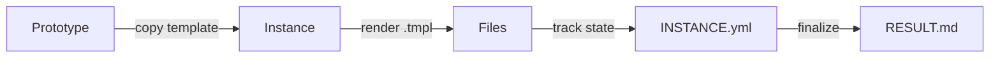

# MOOLLM

**A microworld operating system for LLM agents.**

> *The LLM is a token predictor. The filesystem is the brain. The protocols are the cognitive style.*

> [!TIP]
> **New here?** Start with the [3-minute Quickstart](./QUICKSTART.md), then explore the [skills/](./skills/) directory.

---

## TL;DR

LLMs have no memory. MOOLLM gives them one — the filesystem. Everything the agent knows is in files it can read. Everything it does is logged to files you can inspect. No magic.

| What | How |
|------|-----|
| Memory | Files in `working_set.yml` |
| Audit | Append-only `session-log.md` |
| Planning | YAML task trees |
| Recovery | Self-healing on missing state |

**📖 [Read the 3-minute Quickstart →](./QUICKSTART.md)**

---

## 🗺️ Navigate the Palace

This repository IS a memory palace. Each directory is a room.

| Room | What Lives There | Explore |
|------|------------------|---------|
| **kernel/** | OS protocols — the basement | [Enter →](./kernel/) |
| **skills/** | Userland protocols — the main floor | [Enter →](./skills/) |
| **schemas/** | Data shapes — the vault | [Enter →](./schemas/) |
| **designs/** | Historical archives — the attic | [Enter →](./designs/) |

### Featured Skills

| Skill | Purpose | Go |
|-------|---------|-----|
| 🎴 **trading-card/** | Capabilities as instantiable cards | [→](./skills/trading-card/) |
| 🚪 **room/** | Directories as activation contexts | [→](./skills/room/) |
| 💬 **soul-chat/** | Everything speaks | [→](./skills/soul-chat/) |
| 🎮 **play-learn-lift/** | The methodology | [→](./skills/play-learn-lift/) |
| 🔄 **self-repair/** | Never crash, always repair | [→](./skills/self-repair/) |
| 📋 **plan-then-execute/** | Frozen plans with human approval | [→](./skills/plan-then-execute/) |

---

## Architecture

```
moollm/                        # 🏰 The Palace
├── README.md                  # You are here
├── QUICKSTART.md              # 3-minute overview
├── PROTOCOLS.yml              # Symbol index (K-lines)
│
├── kernel/                    # 🔧 Infrastructure
│   ├── constitution-core.md   # Universal principles
│   ├── tool-calling-protocol.md
│   ├── self-healing-protocol.md
│   └── drivers/               # Orchestrator adapters
│
├── skills/                    # 🎭 Capabilities
│   ├── room/                  # Spatial programming
│   ├── trading-card/          # Instantiable cards
│   ├── soul-chat/             # Entity dialogues
│   └── ...
│
├── schemas/                   # 📐 Data formats
│   └── *.yml
│
└── designs/                   # 📜 Archives
    └── *.md
```

---

## Core Principles

### FILES-AS-STATE

Everything is files. No hidden memory. If it's not in a file, it doesn't exist.

```yaml
# Session state lives here:
.agent/
  sessions/current/
    session-log.md      # Append-only audit
    working_set.yml     # What's in context
    hot.yml             # Keep loaded
    cold.yml            # Can evict
```

### YAML-JAZZ

> *"Start with jazz, end with standards."*

Comments carry meaning. LLMs interpret, not just parse.

```yaml
config:
  timeout: 30  # Generous because the API is flaky on Mondays
  retries: 3   # Based on observed failure patterns in prod
  # TODO: Add circuit breaker after next outage
```

The comments above aren't decoration — they provide context that structured fields cannot capture.

### WHY-REQUIRED

Every tool call explains its intent:

```yaml
fs.read:
  path: "src/parser.ts"
  why: "Check if recursive descent handles nested expressions"
```

Self-documenting traces. Improved coherence. Post-hoc analysis.

### NEVER-CRASH

> [!IMPORTANT]
> Missing state triggers **repair**, not failure.

- Missing file → create minimal stub
- Corrupted state → rename `.corrupted`, create fresh
- Over budget → truncate lowest priority
- Unknown input → BPIP (assume good faith)

---

## Protocol Symbols (K-Lines)

Wikipedia-style keywords that activate conceptual clusters. Type as commands or reference in docs.

| Symbol | Meaning |
|--------|---------|
| `FILES-AS-STATE` | Everything is files. No hidden memory. |
| `YAML-JAZZ` | Comments carry meaning. Data is interpreted. |
| `WHY-REQUIRED` | Every tool call needs a `why` parameter. |
| `APPEND-ONLY` | Never modify logs. Audit trail is sacred. |
| `NEVER-CRASH` | Missing state triggers repair, not failure. |
| `BPIP` | Best Possible Interpretation. Assume good faith. |
| `PLAY-LEARN-LIFT` | Explore → find patterns → share wisdom. |
| `ROOM-AS-FUNCTION` | Enter room = call function. Exit = return. |
| `SPEED-OF-LIGHT` | Many agents in one LLM call. No carrier pigeons. |
| `P-HANDLE-K` | Safe human referencing via K-line activation. |

Full index: **[PROTOCOLS.yml](./PROTOCOLS.yml)**

---

## Capability Tiers

| Tier | Capabilities | Example Orchestrators |
|------|-------------|----------------------|
| 0 | Text only | Basic chat |
| 1 | File read | Most UIs |
| 2 | File read/write | IDEs |
| 3 | + Search | Cursor, Claude Code |
| 4 | + Execution | Cursor, Claude Code |
| 5 | + Custom tools (MCP) | Claude Code |
| 6 | + Full kernel control | Custom |

Protocols degrade gracefully. At Tier 1, `why` is convention. At Tier 6, it's enforced.

---

## Skill System

Skills are **protocols the model follows**, not code the orchestrator runs.

### Structure

```
skills/memory-palace/
├── README.md         # Human entry point
├── SKILL.md          # Protocol documentation
├── PROTOTYPE.yml     # Machine definition
└── template/         # Files to copy on instantiation
    ├── MAP.yml.tmpl
    └── ROOM.md.tmpl
```

### Instantiation



1. Copy template to session directory
2. Render `.tmpl` files with context variables
3. Create `INSTANCE.yml` tracking state
4. Mark status: `active` → `finalized` | `abandoned`

---

## Philosophical Foundation

### The Anti-Magic Principle

> [!CAUTION]
> No hidden scratchpad. No mystical "planning module." No persistent memory the user can't inspect. **If it's not in a file, it doesn't exist.**

<details>
<summary><strong>🔍 Influences (click to expand)</strong></summary>

| System | Contribution | In MOOLLM |
|--------|--------------|-----------|
| **[The Sims][sims]** | Object advertisements, autonomous selection | Files advertise capabilities |
| **[HyperCard][hypercard]** | Stacks/cards, message delegation | Rooms, leaf-to-root dispatch |
| **[Self][self]** | Prototype-based inheritance | Cards, delegation chains |
| **[LambdaMOO][moo]** | Rooms, objects, spatial programming | Room directories |
| **[MFM][mfm]** | Robust-first, local repair | Self-healing demons |
| **[Logo][logo]** | Constructionism, microworlds | Filesystem as microworld |
| **LLOOOOMM** | YAML Jazz, familiars | Semantic comments, K-lines |
| **[Kilroy][kilroy]** | Decentralized swarms | Speed-of-light simulation |

[sims]: https://en.wikipedia.org/wiki/SimAntics
[hypercard]: https://en.wikipedia.org/wiki/HyperCard
[self]: https://selflanguage.org/
[moo]: https://en.wikipedia.org/wiki/LambdaMOO
[mfm]: https://www.cs.unm.edu/~ackley/mfm/
[logo]: https://en.wikipedia.org/wiki/Logo_(programming_language)
[kilroy]: ./designs/kilroy-ideas.md

</details>

### Format Hierarchy

| Format | Use For | Why |
|--------|---------|-----|
| **Markdown** | Logs, docs, conversations | Human-readable, embeds code blocks |
| **YAML** | Config, state, parameters | Has comments! Semantic. Editable. |
| **JSON** | Machine interchange only | No comments. Last resort. |

---

## Goals

MOOLLM aims to:

1. **Auditable**: Every action leaves a file trace
2. **Inspectable**: No hidden state
3. **Portable**: Works on any orchestrator with file tools
4. **Composable**: Prototype inheritance over class hierarchies
5. **Robust**: Self-healing through local repair

The end state: an LLM that navigates its own memory, follows explicit protocols, recovers from corruption, and explains exactly what it did via audit logs.

---

## What This Is Not

- **Not a framework**: No code to install
- **Not an agent**: No autonomous execution loop
- **Not a product**: Specifications and conventions only
- **Not magic**: Files all the way down

---

## Getting Started

| Goal | Start Here |
|------|------------|
| Quick overview | [QUICKSTART.md](./QUICKSTART.md) |
| Build an orchestrator | [kernel/README.md](./kernel/README.md) |
| Use existing orchestrator | [kernel/drivers/](./kernel/drivers/) |
| Explore skills | [skills/README.md](./skills/README.md) |
| Understand the history | [designs/README.md](./designs/README.md) |

---

<details>
<summary><strong>🙏 Credits (click to expand)</strong></summary>

| Person | Contribution |
|--------|--------------|
| **Don Hopkins** | [The Sims][sims] (SimAntics, Pie Menus), LLOOOOMM, YAML Jazz |
| **Will Wright** | SimCity, The Sims — original microworld simulations |
| **Bill Atkinson** | [HyperCard][hypercard], message hierarchy |
| **Chuck Shotton** | [Kilroy][kilroy], WebSTAR, decentralized AI swarms |
| **Dave Ungar** | [Self language][self], prototype inheritance |
| **Dave Ackley** | Robust-first computing, [MFM][mfm] |
| **Pavel Curtis** | [LambdaMOO][moo] spatial programming |
| **Marvin Minsky** | K-lines, Society of Mind |
| **Seymour Papert** | [Logo][logo] microworlds, constructionism |
| **Alan Kay** | Smalltalk, messaging, children |
| **Henry Lieberman** | Programming by demonstration |
| **Ted Nelson** | Xanadu, intertwingled everything |

</details>

---

## License

MIT — Do what you want. Give credit where due.

---

> [!NOTE]
> **Ready to explore?** 
> - 🗺️ [Navigate the Palace](#️-navigate-the-palace)
> - 📖 [Read the Quickstart](./QUICKSTART.md)
> - 🎮 [Learn Play-Learn-Lift](./skills/play-learn-lift/)
