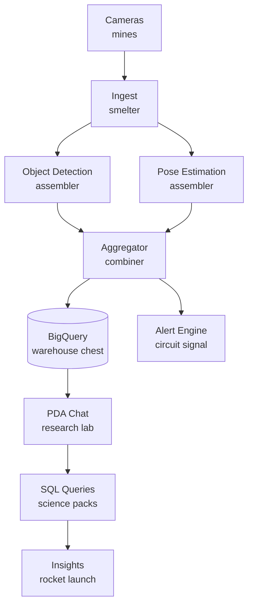
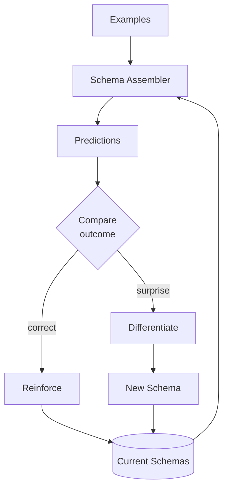

# Factorio as Cognitive Model for MOOLLM and Leela

> *"The factory must grow."* — Factorio vocabulary maps to computing at every scale. LLMs know it deeply.

Factorio is a factory automation game with a comprehensive wiki (2000+ pages of game mechanics, ratios, circuit logic), a rich subreddit culture of base designs and throughput analysis, and a Lua modding API with extensive documentation, and an industry of youtube video tutorials and playthroughs. All deeply indexed in LLM training data. When you describe a system using Factorio vocabulary — belts, inserters, assemblers, backpressure, blueprints — the LLM activates spatial reasoning, throughput intuition, and bottleneck analysis that transfer directly to real infrastructure. The metaphor isn't decorative; it's load-bearing.

---

## Factorio → MOOLLM → Leela Mapping

The core translation table. Factorio concepts on the left become MOOLLM abstractions in the middle, then concrete Leela infrastructure on the right. This isn't analogy — it's isomorphism.

| Factorio | MOOLLM | Leela Infrastructure |
|----------|--------|---------------------|
| Factory floor | [Room](../kernel/DIRECTORY-AS-OBJECT.md) | Service / pipeline stage |
| Belt | Data stream | Pub/Sub topic, Postgres NOTIFY |
| Chest | [Container](../examples/adventure-4/street/lane-neverending/leela-manufacturing/storage/ROOM.yml) | Cloud Storage / NAS / Queue |
| Assembler | LLM node | Cloud Function / Model endpoint, Looker, Thinker |
| Recipe | [Skill](../skills/INDEX.yml) | Processing logic |
| Blueprint | [Skill template](../skills/bootstrap/templates/) | DevOps/GitOps Scripts and GitHub Actions |
| Logistics network | [Carrier pigeons](../kernel/BEAD-ORCHESTRATION.yml) | Async Pub/Sub |
| Circuit network | Metrics / signals | PDA / Concept Viewer / Grafana |
| Research lab | [Play-Learn-Lift](../skills/play-learn-lift/) | **PDA chat** — query and analyze the factory and data |
| Science packs | Refined insights | SQL results, aggregated analytics, alerts, reports |

The research lab mapping is key: in Factorio, research consumes the most refined products (science packs) to unlock new capabilities. In Leela, PDA chat queries the most processed data (aggregated analytics in BigQuery/Postgres) to generate insights. Both sit at the top of the production chain, consuming what everything else produces, and feeding back into training, measuring, and improving models and actions.

---

## Universal Patterns (scales from VLSI to cloud)

The same patterns recur at every level of computing. A belt is a transport mechanism whether it moves items at 45/sec in Factorio, bits at GHz on a metal trace, packets at Gbps on a wire, or messages at thousands/sec through Pub/Sub. The vocabulary transfers because the physics transfer: data moves, buffers absorb variance, processors transform, and backpressure propagates upstream when downstream is slow.

| Pattern | Factorio | Cloud/Leela | MOOLLM |
|---------|----------|-------------|--------|
| **Belt** | Transport belt | Pub/Sub topic | Data stream |
| **Buffer** | Chest | Queue / bucket | Container |
| **Assembler** | Assembler | Microservice | LLM node |
| **Splitter** | Splitter | Topic filter / LB | Conditional |
| **Backpressure** | Full belt stops inserter | Queue depth limits | Soft/hard limits |
| **Ratio** | Smelters:Assemblers | Writers:Readers | Sources:Sinks |
| **Blueprint** | Reusable cell | Helm chart | Skill template |

At VLSI scale: belts are metal traces, chests are registers, assemblers are ALUs, backpressure is clock gating. At GPU scale: belts are memory buses, chests are cache lines, assemblers are CUDA cores. The patterns don't change. Only the units do.

---

## Leela Video Pipeline as Factory

Leela's actual production pipeline maps directly to a Factorio factory. Cameras are mines and pumpjacks — they produce raw material (video frames) continuously. Ingest is smelting — transforming raw ore into usable form. Object detection and pose estimation are parallel assemblers consuming the smelted product, called Looker. Aggregation combines intermediate products to be analyzed by Thinker. Storage is the warehouse. And PDA chat is the research lab and control room, consuming the most refined outputs to generate insights that improve the whole system.



**The flow:** Raw video (ore) → detection/pose (smelting) → aggregation (assembly) → storage (warehouse) → PDA queries (research) → insights (rocket).

See: [loading-docks](../examples/adventure-4/street/lane-neverending/leela-manufacturing/loading-docks/ROOM.yml), [floor-2 insight furnace](../examples/adventure-4/street/lane-neverending/leela-manufacturing/floor-2/ROOM.yml)

---

## Drescher Schema Mechanism

Gary Drescher's "Made-Up Minds" describes how minds build predictive schemas from experience. Examples flow in, get matched against existing schemas, generate predictions. When predictions succeed, schemas strengthen. When they fail (surprise!), the mind differentiates — creating new, more specific schemas. This is a factory: examples are ore, schemas are intermediate products, reliable predictions are finished goods, and the differentiation process is the assembler that builds new schemas from failed predictions.



| Factorio | Play-Learn-Lift | Drescher |
|----------|-----------------|----------|
| Mine ore | PLAY | Encounter examples |
| Smelt/assemble | LEARN | Build schemas |
| Blueprint | LIFT | Reliable prediction |
| Research lab | Meta-learning | Schema composition |
| Tech tree | Develop new skills | Unlock new schema types |

See: [play-learn-lift skill](../skills/play-learn-lift/), [floor-2 ROOM.yml](../examples/adventure-4/street/lane-neverending/leela-manufacturing/floor-2/ROOM.yml)

---

## The Factorio Learning Curve

Factorio is a 100-hour course in systems thinking disguised as a game. The progression is inevitable: you start by hand-carrying iron ore, end up designing and optimizing tileable megabase cells with perfect ratios. The game forces this evolution because manual approaches don't scale and bottlenecks punish you immediately. Cloud engineering follows the same arc — from SSH and manual deploys to Kubernetes and GitOps. MOOLLM skill development does too. The stages are universal because the constraints are universal.

**Stage 1: Hand-craft**
- Factorio: Carry materials by hand, build one thing at a time
- Cloud: SSH in, run commands manually, ClickOps
- MOOLLM: Write prompts in chat, iterate directly
- *Purpose:* Learn the shape of the problem

**Stage 2: Ad-hoc automation**  
- Factorio: First belts, spaghetti everywhere, "it works"
- Cloud: Shell scripts, cron jobs
- MOOLLM: Copy-paste working prompts, hard-coded patterns
- *Purpose:* Save effort, accumulate working examples

**Stage 3: Bottleneck discovery**
- Factorio: "Why is everything stopped?" Follow the backup.
- Cloud: First outage. "Why is the DB at 100%?"
- MOOLLM: Context overflow, rate limits, slow responses
- *Purpose:* Usage reveals truth. You can't plan this — you have to see it.

**Stage 4: Pattern recognition**
- Factorio: "I keep building this same thing"
- Cloud: "Every service needs logging, metrics, health checks"
- MOOLLM: "Every skill needs error handling, context limits"
- *Purpose:* Abstract recurring shapes

**Stage 5: Modular design**
- Factorio: Standard interfaces, tileable cells, blueprint-ready
- Cloud: Dockerfiles, Helm charts, standard contracts, instance groups
- MOOLLM: CARD.yml interfaces, room connection points, prototypes
- *Purpose:* Design for replication

**Stage 6: Optimization trade-offs**
- Factorio: Compactness vs expansion, make here vs import
- Cloud: Build vs buy, sync vs async, edge vs central  
- MOOLLM: Local LLM vs cloud, big model vs many small
- *Purpose:* Right tool for each job

**The key insight:** You can't start at Stage 5. Must play first. Then the cycle repeats at higher levels — blueprints become the playground for the next tier.

---

## Factorio Wisdom

These lessons emerge from hundreds of hours of Factorio play. They're hard-won intuitions about throughput, modularity, failure modes, and robustness. Every experienced Factorio player knows them. Every experienced infrastructure engineer knows them too — they just learned them through production outages instead of being overrun by hoards of bugs.

| Lesson | Factorio | Leela/MOOLLM |
|--------|----------|--------------|
| **Main Bus** | Wide belt feeds all | Pub/Sub topics, rooms tap data |
| **Ratios** | Know producer:consumer | Profile before scaling |
| **Blueprints** | Perfect cell → stamp 100× | [Skill templates](../skills/bootstrap/templates/) → instantiate |
| **Spaghetti vs Clean** | Clear lanes, debug = follow flow | Clean [room interfaces](../kernel/DIRECTORY-AS-OBJECT.md) |
| **Backpressure** | Full belt = downstream slow | Queue depth tells you where to look |
| **Modular cells** | Design once, replicate | Helm charts, [HPA scaling](../examples/adventure-4/street/lane-neverending/leela-manufacturing/logistics/ROOM.yml) |

---

## Don Hopkins Factorio Notes (deduped + categorized)

Don Hopkins shows up across HN Factorio threads with a consistent set of motifs. These are the Factorio-related points that repeat, grouped and condensed for reuse.

### 1) Programmer crack, hacking culture
- Factorio is "programmer crack": extremely addictive, keeps you up, and pushes optimization urges.
- Factorio feels like classic hacker culture: kludging together working systems; technical Factorio (balancers, latches, circuit networks) feels like HACKMEM-era hackery.
- Blueprints are the "package manager": blueprint books = modules, factorioprints.com = registry.

### 2) Scale and simulation metaphors
- Factorio is like a pinball machine with millions of balls, tracking each one deterministically.
- The Sims analogy: many autonomous agents; Factorio amplifies scale and determinism.
- The engine is more complex than it looks because every entity interacts and must be simulated, not just rendered.

### 3) 2D grid vs 3D freedom (Factorio vs Satisfactory)
- 2D grid makes Factorio more like a precise programming language or spreadsheet.
- Grid enables reusable blueprints, drone construction, and scalable modularity.
- 3D freedom (Satisfactory) adds construction joy and verticality, but makes precise reusable blueprints far harder.
- Satisfactory is beautiful and satisfying in 3D building tools, but Factorio stays deeper in abstraction and automation.

### 4) Simulation theory and cellular automata links
- Factorio and SimCity are not pure cellular automata; they mix CA with system dynamics and cybernetics.
- Will Wright's "topologies/dynamics/paradigms" framing fits Factorio's multi-system design.
- Von Neumann CA and universal constructor are conceptually adjacent to blueprints + conveyors.

### 5) Social and learning angles
- Factorio is a candidate for job interviews or learning how people think.
- Pair programming analogies: multiplayer videos show distinct styles and mental models.
- Main-bus debates mirror "tabs vs spaces" culture arguments, but often resolve to scale context.

### 6) Quotes and one-liners worth reusing
- "Programmer crack."
- "Factorio packages are blueprints."
- "Satisfactory is 3D Factorio, but the grid is what makes Factorio programmable."
- "Pinball machine with millions of balls."

## Trade-offs

Factorio forces you to confront trade-offs that don't have right answers — only context-dependent better choices. Compact designs save space but can't grow. One fast assembler is simpler than four slow ones, but four survive a breakdown. Smelting on-site avoids train logistics but sprawls the base. Direct insertion maximizes throughput but couples producer to consumer. These same trade-offs appear in cloud architecture (monolith vs microservices, sync vs async) and MOOLLM design (one big prompt vs many small skills, local vs cloud LLM).

| | Factorio | Cloud/MOOLLM |
|-|----------|--------------|
| **Compact vs expand** | Tight = no growth | Coupled = brittle |
| **Few vs many** | 1 fast vs 4 slow | Vertical vs horizontal |
| **Make vs import** | Smelt on-site vs train | Build vs buy, local vs cloud LLM |
| **Direct vs buffered** | Direct insertion vs chest | Sync vs queue |

---

## Adventure-4 Rooms as Examples

Theory is cheap; implementation is proof. The [Leela Factory rooms](../examples/adventure-4/street/lane-neverending/leela-manufacturing/) are working YAML files that demonstrate every Factorio concept discussed above. They're not documentation about the patterns — they ARE the patterns, executable and explorable.

| Room | Factorio Concept | What It Shows |
|------|------------------|---------------|
| [loading-docks](../examples/adventure-4/street/lane-neverending/leela-manufacturing/loading-docks/ROOM.yml) | Chest modes | `requester` vs `provider` vs `buffer` |
| [logistics](../examples/adventure-4/street/lane-neverending/leela-manufacturing/logistics/ROOM.yml) | Circuit signals | Metrics → scaling decisions |
| [mail-room](../examples/adventure-4/street/lane-neverending/leela-manufacturing/mail-room/ROOM.yml) | Multi-mode transport | Sync/async/batch routing |
| [floor-2](../examples/adventure-4/street/lane-neverending/leela-manufacturing/floor-2/ROOM.yml) | Research lab | Schema mechanism / insight furnace |
| [storage](../examples/adventure-4/street/lane-neverending/leela-manufacturing/storage/ROOM.yml) | Logistics chest | Prototype inheritance |
| [acme-surplus](../examples/adventure-4/street/lane-neverending/acme-surplus/ROOM.yml) | Anti-patterns | What NOT to do (YAML Jazz traps) |

**Multi-layered:** Each room works as adventure setting, Factorio dataflow, Leela demo, and MOOLLM example simultaneously.

---

## The Leela Factory Tour — A Self-Referential Model

The [Leela Manufacturing](../examples/adventure-4/street/lane-neverending/leela-manufacturing/) complex in adventure-4 is a working model of itself. It's simultaneously a text adventure you can explore, a Factorio tutorial you can study, a demonstration of Leela's real video analytics pipeline, and a MOOLLM example showing rooms, skills, and prototype inheritance in action. The recursion goes deeper: in the lobby, under glass, sits a 1:100 scale model of the entire facility with tiny working cameras. The cameras in the model are watching the model. The model demonstrates what Leela does by doing it to itself.

### The Building (Factorio Pipeline)

```
ROOFTOP ──── Drones (logistics bots), Eventually the Turtle (patience)
    │
FLOOR 3 ──── Shipping: insights packaged and dispatched (output belt)
    │
FLOOR 2 ──── Factory: Insight Furnace = Schema Mechanism (assemblers)
    │
FLOOR 1 ──── Intake: problems sorted onto conveyor lines (input belts)
    │
LOBBY ────── Scale Model under glass (recursive self-reference!)
    │
BASEMENT ─── R&D: Zone 7 sealed, Warehouse 23 infinite (research labs)
```

### Room-by-Room Mapping

| Room | Factorio | Real Leela | What You See |
|------|----------|------------|--------------|
| [Lobby](../examples/adventure-4/street/lane-neverending/leela-manufacturing/ROOM.yml) | Entry point | Customer demo | Scale model of itself, ACME across the street |
| [Floor 1](../examples/adventure-4/street/lane-neverending/leela-manufacturing/floor-1/ROOM.yml) | Input belts | Video ingestion | Sorting lines: questions, problems, raw data |
| [Floor 2](../examples/adventure-4/street/lane-neverending/leela-manufacturing/floor-2/ROOM.yml) | Assemblers | ML pipeline | Processing cells A-H, [Insight Furnace](../examples/adventure-4/street/lane-neverending/leela-manufacturing/floor-2/insight-furnace.yml) |
| [Floor 3](../examples/adventure-4/street/lane-neverending/leela-manufacturing/floor-3/ROOM.yml) | Output belt | API responses | Packaging stations, pneumatic dispatch |
| [Basement](../examples/adventure-4/street/lane-neverending/leela-manufacturing/basement/ROOM.yml) | Research lab | Schema learning | Zone 7 (paradox processing), Warehouse 23 |
| [Loading Docks](../examples/adventure-4/street/lane-neverending/leela-manufacturing/loading-docks/ROOM.yml) | Train station | Pub/Sub | Bays 1-4 IN (buffer), Bays 5-8 OUT (active-provider) |
| [Storage](../examples/adventure-4/street/lane-neverending/leela-manufacturing/storage/ROOM.yml) | Logistics chests | Cloud Storage | Prototype inheritance, cloning station |
| [Logistics](../examples/adventure-4/street/lane-neverending/leela-manufacturing/logistics/ROOM.yml) | Circuit network | Prometheus/Grafana | Big Board, 8 operator stations, signals |
| [Mail Room](../examples/adventure-4/street/lane-neverending/leela-manufacturing/mail-room/ROOM.yml) | Mixed logistics | Multi-channel | Pneumatic tubes, pigeons, phones, postal |
| [Rooftop](../examples/adventure-4/street/lane-neverending/leela-manufacturing/rooftop/ROOM.yml) | Bots + research | Edge compute | Drone pads, Eventually the Turtle |

### The Scale Model (Recursive Self-Reference)

From [scale-model.yml](../examples/adventure-4/street/lane-neverending/leela-manufacturing/scale-model.yml):

> *"Under a clear glass dome, a 1:100 scale model of the entire Leela facility. Incredible detail. Moving parts. Tiny cameras blink. Tiny overlays annotate tiny workers. It's a demo of the demo. Recursive, like everything here."*

**What this represents:**
- MOOLLM describing itself
- Leela's product IS watching (the cameras watch the model watching)
- Constructionist learning — understanding through building models
- The factory manufactures the conditions for intelligence to emerge

### The Insight Furnace (Schema Mechanism)

From [insight-furnace.yml](../examples/adventure-4/street/lane-neverending/leela-manufacturing/floor-2/insight-furnace.yml):

> *"Where neural perception becomes symbolic understanding... Problems dissolving into component concepts. Patterns forming, breaking, reforming. Something that looks almost like understanding. Then: DING — an insight emerges, crystallized and ready."*

| Furnace Stage | Drescher | Factorio | Leela |
|---------------|----------|----------|-------|
| Problem input | Examples encounter | Ore on belt | Video frames |
| Decomposition | Schema activation | Smelting | Object detection |
| Pattern extraction | Match/predict | Intermediate product | Pose estimation |
| Synthesis | Schema composition | Assembly | Aggregation |
| Crystallization | Reliable prediction | Finished product | Insight/alert |

### Loading Docks = Chest Modes

From [loading-docks/ROOM.yml](../examples/adventure-4/street/lane-neverending/leela-manufacturing/loading-docks/ROOM.yml):

```yaml
bay_1:
  chest_mode: buffer           # 📦🟢 Staging for inbound
bay_3:
  chest_mode: requester        # 📦🔵 Actively requesting
bay_5:
  chest_mode: active-provider  # 📦🔴 Pushing OUT
```

**This is Factorio logistics made tangible.** Four IN bays buffer incoming (problems, data). Four OUT bays push finished goods (insights, solutions).

### Logistics Center = Circuit Network

From [logistics/ROOM.yml](../examples/adventure-4/street/lane-neverending/leela-manufacturing/logistics/ROOM.yml):

```yaml
signals:
  receives:
    - from: "../loading-docks/"
      signals: [bay-status, inbound-capacity, outbound-ready]
    - from: "../floor-2/"
      signals: [processing-load, cell-status]
  emits:
    - signal: "facility-status"
    - signal: "alert-level"
    - signal: "throughput-rate"
```

**This is the Big Board** — real-time metrics, just like Grafana dashboards for the real Leela pipeline.

### Eventually the Turtle (Patience as Wisdom)

From [rooftop/ROOM.yml](../examples/adventure-4/street/lane-neverending/leela-manufacturing/rooftop/ROOM.yml):

> *"Eventually speaks rarely, and only when asked. Their answers come slowly — sometimes hours later. But they're always worth the wait."*
> 
> Known sayings:
> - "The insight will come. Eventually."
> - "Patience is not waiting. Patience is knowing."

**What this represents:** Some processing takes time. Batch jobs. Model training. Schema consolidation. The turtle embodies the research lab's long-horizon work.

### ACME Across the Street (Anti-Pattern)

The factory faces [ACME Surplus](../examples/adventure-4/street/lane-neverending/acme-surplus/) — shuttered, broken, with a painted tunnel that only works for insiders.

| ACME | Leela |
|------|-------|
| Ship fast, break things | Understand deeply, build reliably |
| Products that don't work | Sight that does |
| Blame the customer | Empower the customer |
| Magic promises | Clarity delivers |

Camera ACM1 watches the painted tunnel 24/7. Anomaly detection. Pattern recognition. Understanding why some things work for insiders but fail for everyone else. (Sound familiar, FSD?)

### Why This Matters

The Leela Factory is:
1. **A playable adventure** — explore, interact, discover
2. **A Factorio tutorial** — chest modes, signals, logistics
3. **A Leela demo** — every camera runs real vision
4. **A MOOLLM example** — rooms, skills, prototype inheritance
5. **A constructionist statement** — build models to understand

And in the lobby, under glass, the scale model watches itself watching itself.

---

## Applying Factorio Logistics Networks to MOOLLM

Factorio logistics networks are dataflow programming in disguise: requests, providers, buffers, and delivery agents move items along explicit routes under clear constraints. MOOLLM already has the primitives to do this, and the parallels are rich enough to be operational.

**Delivery agents as logistics bots**
- **Kilroy** is the logistics dispatcher: the visible trace that "someone was here" and a breadcrumb for delivery flow.
- **Ken Kahn’s ToonTalk birds** are courier agents: lightweight delivery workers that can move payloads between rooms with minimal ceremony.
- **Agents as workers**: each agent has inventory, capacity, a route, and a job queue. This is Factorio bots with personalities.

**Transport infrastructure as belts and chests**
- **Pneumatic tubes** are high-speed belts: deterministic, high throughput, low ceremony.
- **Postal skill** is the logistics network: it routes items/messages to inboxes, with delivery semantics and retry behavior.
- **Rooms with exits** are the belt graph: explicit adjacency, known hops, predictable latency.
- **Throwing objects into exits/tubes** is direct insertion: bypass buffering when you need immediate delivery.
- **Inboxes** are requester chests; shared caches are buffer chests; broadcast rooms are provider chests.

**Dataflow programming in room space**
- Each room is a node. Exits are edges. Items/messages are tokens.
- Moving an object through exits is a concrete representation of dataflow: you can "see" the pipeline.
- Remote delivery uses the postal skill or courier agents; local delivery uses exits and tubes.
- This makes backpressure explicit: full inboxes mean upstream rerouting, buffering, throttling, or load balancing.

**Design patterns to lift into MOOLLM**
- **Logistics zones:** define local networks (room clusters) with courier agents as bots; bridge zones with postal routes.
- **Requester/provider discipline:** explicitly label inboxes with demand signals and providers with supply signals.
- **Belt vs bot split:** use tubes for steady high-volume flows; use couriers for bursty or priority traffic.
- **Circuit signals:** attach simple signals to rooms (capacity, queue depth, error rate) and route accordingly.

This is how Factorio’s logistics network becomes a living MOOLLM dataflow: objects move, agents route, and rooms become explicit computation stages. The system reads like a factory, but behaves like a programmable message bus.

---

## Why This Works

Factorio teaches systems thinking through 100 hours of play. The same lessons take 10 years of production incidents to learn the hard way. Same curriculum. Different tuition.

The metaphor works for LLM prompting because Factorio is massively overrepresented in training data. Wiki articles, reddit optimization debates, Lua mod documentation, YouTube tutorials — all deeply indexed. When you say "this service is like a Factorio assembler with a buffer chest," the LLM activates throughput reasoning, backpressure intuition, and ratio calculations. It's not a metaphor the LLM has to learn; it's a metaphor the LLM already knows.

One vocabulary. Infinite scales. From VLSI to planetary infrastructure. From registers to research labs. The factory must grow.

---

## References

- [Factorio Wiki](https://wiki.factorio.com/)
- [Logistic Network](https://wiki.factorio.com/Logistic_network)
- [Logistic Chests](https://wiki.factorio.com/Logistic_chest)
- [Circuit Network](https://wiki.factorio.com/Circuit_network)
- [Circuit Network Cookbook](https://wiki.factorio.com/Tutorial:Circuit_network_cookbook)
- [Balancer Mechanics](https://wiki.factorio.com/Balancer_mechanics)
- [Blueprint](https://wiki.factorio.com/Blueprint)
- [Blueprint Book](https://wiki.factorio.com/Blueprint_book)
- [Factorio Prints](https://factorioprints.com/)
- [Drescher, "Made-Up Minds"](https://mitpress.mit.edu/books/made-minds) — Schema mechanism
- [Play-Learn-Lift](../skills/play-learn-lift/) — MOOLLM methodology
- [adventure-4 rooms](../examples/adventure-4/) — Living examples
