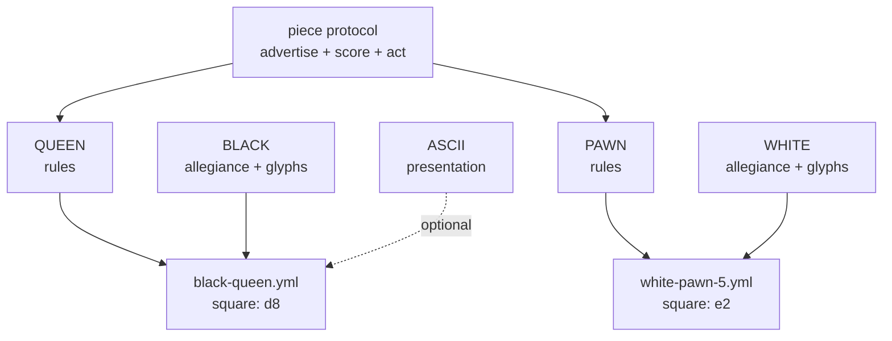

# Game Pieces — a DRY mixin graph for playing pieces

How to build pieces, sets, and plug-in games from prototypes, mixins, and
directories — and how to make them robust enough for expansion packs, user
content, and monsters that eat themselves.

Companions: [DIRECTORY-AS-IUNKNOWN.md](DIRECTORY-AS-IUNKNOWN.md) ·
[GARNET-AMULET-PROTOTYPE-SYSTEM.md](GARNET-AMULET-PROTOTYPE-SYSTEM.md) ·
[object-system/SELF-AND-MOOLLM.md](object-system/SELF-AND-MOOLLM.md) ·
[skills/soul-city/PORTABLE-NPCS.md](../skills/soul-city/PORTABLE-NPCS.md)

## The claim

A playing piece is not a class. It is a **composition of orthogonal mixins**:

- **type** — what it is (queen, superbat, axe, pit)
- **rules** — how it behaves (movement, hazard protocol, combat verbs)
- **presentation** — how it looks (glyph, sprite, prose, emoji)
- **metadata** — provenance, credits, canon sources
- **allegiance** — whose side / what color / which set instance

Keep the axes separate and you get every combination for free, DRY.
Collapse them into classes and you get `BlackQueen`, `WhiteQueen`,
`RedQueen3D`, `BlackQueenASCII`... — the combinatorial explosion Self and
prototype delegation were invented to kill.

(On the standard objection that multiple inheritance is too dangerous for
everyday use: it is — which is why the mixin graph is a *discipline* layered
on a sharp substrate, the same way Densmore's class.ps built structured
inheritance from PostScript's raw dictionary stack and COM's QueryInterface
disciplined raw vtables. The argument, with lineage:
[DIRECTORY-AS-IUNKNOWN.md](DIRECTORY-AS-IUNKNOWN.md#the-classps-precedent-dangerous-substrate-structured-discipline).)

## The chess set (canonical example)

Six types, two colors, N presentations. NOT 6 × 2 × N files — 6 + 2 + N:

```
pieces/chess/
  SET.yml            # the set: roster, board topology, victory rules
  types/
    KING.yml         #   move: one square, any direction; royal: true
    QUEEN.yml        #   move: any distance, straight or diagonal
    ROOK.yml         #   move: any distance, straight; castles: true
    BISHOP.yml       #   move: any distance, diagonal
    KNIGHT.yml       #   move: L-jump; leaps: true
    PAWN.yml         #   move: forward 1 (2 first); captures diagonally; promotes: true
  mixins/
    BLACK.yml        #   color: black;  glyphs: {king: ♚, queen: ♛, ...}
    WHITE.yml        #   color: white;  glyphs: {king: ♔, queen: ♕, ...}
    ASCII.yml        #   presentation: letters (K Q R B N P)
    STAUNTON-3D.yml  #   presentation: model refs
  instances/
    game-001/
      white-queen.yml      # inherits: [types/QUEEN, mixins/WHITE]  square: d1
      black-pawn-3.yml     # inherits: [types/PAWN,  mixins/BLACK]  square: c7
```

Any number of instances per type (eight pawns, two rooks, or a fairy-chess
army of nine queens). Any color: add `mixins/RED.yml`, get a third army
without touching a type file. **Promotion is a one-line re-mixin**: edit the
pawn instance's `inherits` from `types/PAWN` to `types/QUEEN`; its color
mixin, square, and capture history don't move.



The instance file is tiny: parents plus deltas. That is the whole Self
insight — identity is cheap, variation is a small delta on something that
already works, and the taxonomy *emerges* from what people actually make.

## The wumpus set: hazards as sub-piece templates

[Snorax](../examples/adventure-4/characters/fictional/wumpus-snorax/) already
factors this way. Hunt the Wumpus is a **set**, and its hazards are **pieces**:

```
wumpus-snorax/
  GAME.yml                    # the set: rules, win/lose, turn protocol
  DODECAHEDRON.yml            # the board: canonical 20-cave topology
  hazards/
    SUPERBATS.yml             # piece template: population, alpha, relocation
    BOTTOMLESS-PIT.yml        # piece template: fall protocol, breeze warning
  instances/                  # per-world state: which cave, which game
```

Pits and superbats are **sub-object templates of the wumpus** in exactly the
chess-set sense: instantiate any number (`room-x/bats.yml` with
`population: 50` — split the colony), move them by moving files, reset by
`rm` + copy from template. Other games adopt them à la carte: a bottomless
pit works fine in a dungeon that has never heard of a wumpus, because the
piece carries its own rules and advertises its own warnings ("breeze
nearby!") — warnings are presentation mixins on the hazard, not code in the
room.

Same decomposition for the whole menagerie: the crooked arrow is a piece
(ammunition type × inventory mixin), the lamp is a piece (light source type ×
fuel state), and the lamp's fuel is **shared state that two games read** —
wumpus rules while it burns, grue rules when it dies.

## Containers: inventory and stomachs

Location is a path, so containment is free and recursive:

- **Inventory** — [the troll's axe](../examples/adventure-4/characters/fictional/troll/inventory/)
  is a piece he *plays*: fight, throw, catch, eat. It composes weapon rules ×
  throwable × edible (Zork gift protocol: weapons preferred).
- **Stomach** — [the troll's stomach](../examples/adventure-4/characters/fictional/troll/stomach/)
  is a **location piece**: a pocket universe holding characters, weapons,
  food, treasures. Eating is a move, not a copy: set the eaten piece's
  `location` to the stomach path. Local state is a stub `.yml` inheriting
  from the character — spattered in digestive juices — never a mutation of
  the prototype.
- **Recursion** — `location: self` puts the troll in his own stomach. One
  directory; nesting is narrative depth, not filesystem depth.

Containers are just pieces whose presentation includes "what's inside," so a
chess piece could contain a smaller board, and a wumpus could swallow a lamp
(grue rules apply inside).

## Smart placement: the sorting stomach

"Put this in that" is underspecified, and good containers know it. The
pattern comes from **OpenLaszlo** (David Temkin et al.): a child declares a
`placement` attribute, a container declares a `defaultplacement`, and the
container can override its determine-placement method to inspect the
incoming child — plus an optional args object for custom parameterized
placement protocols — and route it to the right sub-container. The everyday
use was a constant sub-path to the "client view," so children added to a
window skipped the chrome (title bar, scroll bars) and landed in the content
area. The general idea is bigger: **the container owns the routing decision,
and the giver doesn't need to know the container's internals.**

[The troll's stomach](../examples/adventure-4/characters/fictional/troll/stomach/STOMACH.yml)
is a sorting container in exactly this sense. EAT X and GIVE X TO TROLL are
user-level verbs — drag-and-drop into the gaping maw — and the stomach's
placement protocol inspects the child: characters route to
`contents/adventurers/` (as digestive-juice-spattered stubs inheriting from
their prototypes), treasures to `contents/treasures/` with a ledger entry,
weapons land loose and crunchy, and the troll himself routes to
`contents/himself.yml`. GIVE TROLL TO TROLL isn't a special case that needs
a flag; it's just the self route through the same protocol. The dumb
explicit API (move the file yourself) is still there underneath — the smart
overlay is for the user's level, where dropping something *into* something
should do the logically right thing without asking where the sub-slot is.

This is the drag-and-drop contract every direct-manipulation microworld
needs: SimCity tiles, Sims object slots, HyperCard backgrounds, Laszlo
views, troll stomachs. Low-level moves obey; high-level verbs route.

### The genealogy in shipped games

Games have been shipping smart placement for decades, in four families:

- **Typed bags** (the container only accepts its type): World of Warcraft's
  profession bags — herb, mining, enchanting, soul bags, quivers; EverQuest's
  quivers and tradeskill containers before that; Breath of the Wild's pouches
  are the purest form — an apple *can only* land in materials, and the player
  never files anything.
- **Auto-routing on deposit** (the container inspects and files — the
  stomach's exact protocol): Guild Wars 2's fills-first bags (oiled bags
  attract junk, craftsman's bags attract mats, equipment boxes attract gear,
  invisible bags opt *out* of sorting and vendoring) plus "deposit all
  materials"; Path of Exile's stash tab affinities routing a ctrl-click dump
  to whichever tab owns the type; Terraria's Quick Stack to Nearby Chests —
  the elegant one, items fly to whatever chests *already contain that kind of
  thing*, so **the world's existing arrangement is the routing table**;
  Stardew Valley's "add to existing stacks"; Diablo III/IV material storage.
- **Routing as visible labor**: Dwarf Fortress stockpiles (dwarves haul
  everything to its typed zone — the sort is performed by characters you can
  watch), Minecraft hopper sorters (player-*built* placement protocols),
  Factorio filter inserters and logistic chests.
- **Containers with behavior** (the stomach's true family): Diablo II's
  Horadric Cube *transforms* what it holds — a container that digests;
  EverQuest's ovens and forges; Torchlight's pet, a walking container that
  leaves to go sell; and NetHack's bag of tricks, a container that turns out
  to be a creature — the exact inverse of the troll, a creature that turns
  out to be a container. NetHack also supplies the recursion cautionary tale:
  bag of holding in bag of holding explodes. GIVE TROLL TO TROLL just deepens
  the narrative stack — single pocket, no boom.

And in **PieCraft** (Don Hopkins,
[canonical design in MicropolisCore](https://github.com/SimHacker/MicropolisCore/blob/main/documentation/designs/piecraft/PIECRAFT.md))
the container *is the UI*: pie menus are craftable typed bags whose
**geometry is part of the type — slot count is valence**. Pies auto-route on
deposit (a potion files itself into the consumables pie, a spell into its
element's slice) and **bond into molecules**: a submenu is a covalent bond, a
loadout is a molecule of complementary valences, and combat can decompose a
molecule back into element pies, spilling loose items. Smart placement,
typed bags, and Fitts's law fused into one crafting system.

### Beyond games: the webtop

Every desktop ever shipped makes the user do all the filing by hand. These
are features a general-purpose webtop window/object manager should have —
the direct descendant of OpenLaszlo's placement protocol, at home in a
zoomable interface of the kind David Temkin has pursued:

- **Quick Stack for files**: drop a pile on the desktop and each file flies
  to a folder that already contains that kind of thing — the user's existing
  arrangement is the routing table, so the system learns filing from the
  filing you already did. That is programming by demonstration where the
  *demonstration is your folder structure*.
- **Affinities and fills-first folders**: a folder declares what it attracts
  (INTERFACE.yml-style, one dropped file at a time); an invisible-bag folder
  opts out of auto-sort entirely.
- **Deposit-all verbs**: one gesture files everything routable and leaves
  the residue visible for triage — conservative in what it moves, liberal in
  what it accepts.
- **Routing as visible animation**: in a zoomable interface the file
  *visibly flies* to its destination, Terraria-style, so auto-filing is
  self-demonstrating — the system shows you its reasoning at exactly the
  moment you could correct it. Smart placement plus visible routing is the
  teach-by-demonstration loop running in reverse: the system demonstrates,
  the user inspects and corrects.

The **pie menu tabbed window interface** is the window-level embodiment of
the same system
([PIE-TAB-WINDOWS.md](https://github.com/SimHacker/MicropolisCore/blob/main/documentation/notes/PIE-TAB-WINDOWS.md)
in MicropolisCore; shell context in
[MOOLLM-WEBTOP-VISION.md](webtop-gwern-inheritance/MOOLLM-WEBTOP-VISION.md)).
A **Stack is a typed bag of Cards**; a **tab is simultaneously the handle
and the advertisement** — grab it to drag, pop a pie on it for the Card's
verbs (close, detach to window, move to stack, open in git), heritage
running back through NeWS tabbed frames and the PSIBER Space Deck. And its
Snapping & Grouping rules are literally a placement protocol for windows:
dragging a Card offers snap positions — dock as a sibling in the layout
tree, insert into a target Stack (tab rows merge), or pull out to float —
so the *workspace* inspects the incoming window and offers placements, the
way the stomach inspects the incoming meal. Pies, tabs, Stacks, and
PieCraft molecules are one container algebra at four scales: slice, tab,
window, workspace.

## Robust-first: the TROLL-FLAG lesson

Zork's troll had two glorious behaviors and one famous bug. GIVE AXE TO
TROLL: he eats his own weapon and cowers. GIVE TROLL TO TROLL: he eats
himself and vanishes — self-devouring via transitive containment, arguably
*acting as designed*, since the MDL's generic containment made it fall out
for free. The bug: **`TROLL-FLAG` was never cleared** when he self-devoured,
so the empty room still "fends you off with a menacing gesture." (Don
Hopkins reverse-engineered that flag from black-box play on MIT-DM and
confirmed it in the source decades later.)

The failure shape: **the room cached a fact about the troll instead of
asking the troll.** A flag is a copy of state; copies go stale; stale copies
haunt rooms.

Design rules for plug-in pieces that can't grow troll flags:

1. **Presence is the flag.** "A troll guards this edge" is true iff a troll
   instance file points at this edge. Remove the file, the fact is gone.
   No cleanup step exists to forget.
2. **Advertisements die with the advertiser.** The room never knows what a
   troll is; it relays whatever pieces currently advertise. An eaten troll
   advertises nothing — from inside his own stomach, fronting is optional.
3. **Derive, don't cache.** If another piece needs "is the bridge guarded?",
   it asks the edge at score time. If it must cache for performance, the
   cache carries the instance path it derived from, and a missing source
   invalidates it.
4. **State lives in the instance, never the prototype.** The customs rule
   from [PORTABLE-NPCS.md](../skills/soul-city/PORTABLE-NPCS.md): wealth,
   grudges, and toll ledgers are instance-local. Prototypes stay clean, so
   every new world gets a fresh troll with no haunted luggage.
5. **Postel at the socket.** Accept pieces with missing or unknown keys;
   default what you can, ignore what you don't understand, emit clean YAML.
   A piece referencing an absent mixin degrades to its next ancestor — a
   queen with no glyph set still moves like a queen and renders as "queen."
6. **Survive > correct** (Dave Ackley, robust-first). A crashed game is
   infinitely wrong. A pit that can't find its breeze warning is a silent
   pit, not a stack trace. Log, degrade, keep playing.
7. **Reset is re-instantiation, not un-mutation.** `rm` instances, copy from
   templates ([SUPERBATS.yml](../examples/adventure-4/characters/fictional/wumpus-snorax/hazards/SUPERBATS.yml)
   documents this in its header). There is no "undo every flag" step because
   there are no flags to undo.

**Why The Sims never grew a troll flag:** the socket was narrow.
Expansion-pack and user-created objects (Edith behaviors, Transmogrifier
ports) carried their own code and broadcast scored advertisements; the base
game never stored "this house contains a hot tub" anywhere — it asked the
objects present. Thousands of third-party objects plugged in for decades
without the world accumulating stale knowledge about any of them. That is
rule 1 at industrial scale, shipped in 2000.

## What the LLM adds

The mixin graph above runs as plain data — the adventure compiler can emit
deterministic JS from it, no LLM at runtime. The LLM earns its keep at
**authoring time** (compose a new piece from prototypes + a natural-language
delta: "a pit like the bottomless one, but it burps") and at **coherence
time** (when two pieces' rules collide in a way no table anticipated, decide
in character, then LIFT the ruling into the rules file so next time it's
deterministic). Bugs like the troll flag become one-line prose fixes: the
ruling "an eaten troll guards nothing" is obvious to a language engine even
when a 1980 flag table missed it.
