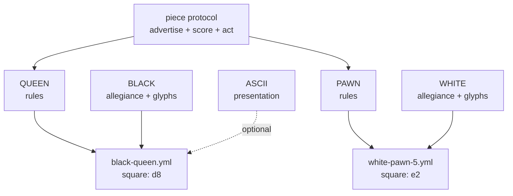

# Game Pieces — a DRY mixin graph for playing pieces

How to build pieces, sets, and plug-in games from prototypes, mixins, and
directories — and how to make them robust enough for expansion packs, user
content, and monsters that eat themselves.

Companions: [DIRECTORY-AS-IUNKNOWN.md](DIRECTORY-AS-IUNKNOWN.md) ·
[GARNET-AMULET-PROTOTYPE-SYSTEM.md](GARNET-AMULET-PROTOTYPE-SYSTEM.md) ·
[object-system/SELF-AND-MOOLLM.md](object-system/SELF-AND-MOOLLM.md) ·
[skills/soul-city/PORTABLE-NPCS.md](../skills/soul-city/PORTABLE-NPCS.md)

## The claim

A playing piece is not a class. It is a **composition of orthogonal mixins**:

- **type** — what it is (queen, superbat, axe, pit)
- **rules** — how it behaves (movement, hazard protocol, combat verbs)
- **presentation** — how it looks (glyph, sprite, prose, emoji)
- **metadata** — provenance, credits, canon sources
- **allegiance** — whose side / what color / which set instance

Keep the axes separate and you get every combination for free, DRY.
Collapse them into classes and you get `BlackQueen`, `WhiteQueen`,
`RedQueen3D`, `BlackQueenASCII`... — the combinatorial explosion Self and
prototype delegation were invented to kill.

(On the standard objection that multiple inheritance is too dangerous for
everyday use: it is — which is why the mixin graph is a *discipline* layered
on a sharp substrate, the same way Densmore's class.ps built structured
inheritance from PostScript's raw dictionary stack and COM's QueryInterface
disciplined raw vtables. The argument, with lineage:
[DIRECTORY-AS-IUNKNOWN.md](DIRECTORY-AS-IUNKNOWN.md#the-classps-precedent-dangerous-substrate-structured-discipline).)

## The chess set (canonical example)

Six types, two colors, N presentations. NOT 6 × 2 × N files — 6 + 2 + N:

```
pieces/chess/
  SET.yml            # the set: roster, board topology, victory rules
  types/
    KING.yml         #   move: one square, any direction; royal: true
    QUEEN.yml        #   move: any distance, straight or diagonal
    ROOK.yml         #   move: any distance, straight; castles: true
    BISHOP.yml       #   move: any distance, diagonal
    KNIGHT.yml       #   move: L-jump; leaps: true
    PAWN.yml         #   move: forward 1 (2 first); captures diagonally; promotes: true
  mixins/
    BLACK.yml        #   color: black;  glyphs: {king: ♚, queen: ♛, ...}
    WHITE.yml        #   color: white;  glyphs: {king: ♔, queen: ♕, ...}
    ASCII.yml        #   presentation: letters (K Q R B N P)
    STAUNTON-3D.yml  #   presentation: model refs
  instances/
    game-001/
      white-queen.yml      # inherits: [types/QUEEN, mixins/WHITE]  square: d1
      black-pawn-3.yml     # inherits: [types/PAWN,  mixins/BLACK]  square: c7
```

Any number of instances per type (eight pawns, two rooks, or a fairy-chess
army of nine queens). Any color: add `mixins/RED.yml`, get a third army
without touching a type file. **Promotion is a one-line re-mixin**: edit the
pawn instance's `inherits` from `types/PAWN` to `types/QUEEN`; its color
mixin, square, and capture history don't move.




The instance file is tiny: parents plus deltas. That is the whole Self
insight — identity is cheap, variation is a small delta on something that
already works, and the taxonomy *emerges* from what people actually make.

And the set is only the cast; the *scene* is modeled too.
[MICROWORLD.yml](../skills/experiment/experiments/turing-chess/MICROWORLD.yml)
lays out the complete chess match as a room tree: the venue with arbiter
and audience (and the demo board, ancestor of every live eval bar), the
**table** as the unsung root object, the board's 64 square rooms, the
two-faced clock, both players' scoresheets (the game's official shallow
memory, doubly witnessed), the box with its spare queens — and the
**sidelines**, where taken pieces stand. Chess never named that spot; shogi
did, and made it load-bearing — the **komadai**, official because captured
pieces change allegiance and re-enter play
([SHOGI-DROPS](../skills/experiment/experiments/turing-chess/plugins/revolutionary-chess/house-rules/SHOGI-DROPS.yml)
is the house rule). Shogi is worth one steal: pieces aren't painted two
colors, they are identical wedges, and **allegiance is orientation** — a
one-bit rotation, derived from which way you point rather than cached as an
identity.

Benched pieces stay *alive*: memories running, no moves, color commentary.
Voice without agency is the liveliest furniture in the microworld. And
because location is just a path — `board/e4`, `sidelines/white-bench`,
`box/spare-queens` — capture, promotion, drop and exile are all **moves in
the same tree**.

## Revolutionary Chess: runtime inheritance as politics

**[Revolutionary Chess](../skills/experiment/experiments/turing-chess/plugins/revolutionary-chess/)**
is the live demonstration that adding inheritance edges at runtime is practical.
A normal game ends with the king's capture; then the defeated side's pawns
reverse direction and march home to revolt. What matters for the piece system is
three properties:

- **Capture is an append, not a removal.** When an aristocrat is taken, their
  move-set organelle is deposited in a shared
  [commons](../skills/experiment/experiments/turing-chess/plugins/revolutionary-chess/COMMONS.yml)
  that every commoner already delegates to. Politics is a monotonic append-only
  ledger; no operation takes a move away.
- **The delegation graph is never amended.** Unification moves organelle
  contents *up* an edge that existed from the first move — no repointing, no
  re-instancing. Contents flow; topology holds.
- **Membership is derived, never cached.** A piece's menu is derived from the
  organelles present, so an empty ledger yields an empty menu rather than an
  error — a piece with no moves is furniture, which is a
  [degradation floor](#robust-first-the-troll-flag-lesson), not a crash.

Move-sets are written in side-relative coordinates (forward = toward the enemy's
home rank), so one rule file serves both colors — DRY across the color axis.

The full design lives with the plugin, not here:
[MANIFESTO.md](../skills/experiment/experiments/turing-chess/plugins/revolutionary-chess/MANIFESTO.md)
for the politics,
[DYNAMICS.md](../skills/experiment/experiments/turing-chess/plugins/revolutionary-chess/DYNAMICS.md)
for the predicted strategy (early surrender is optimal),
[house-rules/](../skills/experiment/experiments/turing-chess/plugins/revolutionary-chess/house-rules/)
for surrender policies as ruleset mixins, and
[DEEP-MEMORY.yml](../skills/experiment/experiments/turing-chess/plugins/revolutionary-chess/DEEP-MEMORY.yml)
for per-piece and per-square logs, which is what makes the tribunal house rules
able to depose a square as a witness.

## Buffs: mixins with expiration dates

Once inheritance edges can be added at runtime, the next question is
whether they can *lapse* — and that's what a buff is: **a mixin with an
expiration date or condition on its delegation edge.**

```yaml
inherits:
  - types/KNIGHT
  - mixins/WHITE
  - buffs/BLESSED.yml        # while: carrying(holy-symbol)
  - buffs/GIANT-GROWTH.yml   # expires: end_of_turn
  - debuffs/POISONED.yml     # expires: after_moves(6), or cured_by(antidote)
```

The grammar is three keywords: `expires_at` (a move number, a date, a
clock time), `expires_when` (an event: first execution, sunrise, the lamp
running out), and `while` (a continuous predicate: active only while the
carrier holds the holy symbol, stands on the home rank, is in shadow).

The lifecycle is a **three-layer ladder**, each layer a step up in
sophistication:

1. **Self-removal.** The common pattern: a buff can own its own death —
   time out, self-destruct, delete its edge when the condition fires.
   The robust-first distinction is *agency*: removal is the buff's own
   act, not a cleanup step some other system must remember to run. The
   troll flag failed because the *world* was supposed to clear it;
   a self-destructing buff carries its own funeral instructions.
2. **Disable-but-remain.** Another layer of conditionalization: the buff
   stays in the graph but *stops answering* while its condition is false —
   evaluated fresh at lookup time, so it can flicker (a `while:` buff
   re-enables the moment you pick the holy symbol back up), and it doubles
   as the safety net under layer 1: a buff that somehow missed its own
   funeral still answers "not anymore," so nothing stale ever acts.
3. **Scoring.** The top of the ladder: an enabled buff doesn't just answer
   present-or-absent, it returns a **score** — and scores flow into the same
   advertise → score → act loop the piece protocol already runs (and The Sims
   shipped). A POISONED debuff doesn't merely restrict moves; it bids "find
   the antidote" high. A BLESSED buff scores holy actions up while it lasts.
   Behavior selection is just reading the current bids from whatever mixins
   are alive, enabled, and shouting.

The buff has graduated from a capability into a voice in an auction, and the
auction has its own design questions — why the highest bid should not always
win, the argmax → find-best-N → softmax spectrum, temperature as an inherited
context value. Those are in
[ADVERTISEMENT-AUCTION.md](ADVERTISEMENT-AUCTION.md).

And since a buff is a full prototype, it carries the whole interface: **a
buff has its own CARD with its own advertisements**, and attaching the
buff merges its card into the host's advertisement pool. The host's menu
and behavior are the *union of the cards of every live, enabled mixin*,
scored together in one auction — the piece contributes its move
advertisements, the color mixin its allegiance-flavored options, and the
POISONED debuff its own card: "seek antidote" advertised to the host,
"administer antidote" advertised *to bystanders* (a poisoned pawn
advertises its plight to nearby healers exactly the way a Sims fridge
advertises meals to the hungry). BLESSED's card adds smite slices to the
pie menu while the blessing lasts; when the buff disables or removes
itself, its advertisements leave the pool with it — no menu cleanup,
because the menu was never stored, only derived. Advertisements compose
the same way move-sets do: the buff doesn't patch the host, it *stands
next to it and shouts*, and the scoring engine hears everyone at once.

The genealogy is everywhere once you look. Chess itself ships two buffs
in the base rules: **castling rights** (a capability that expires
permanently the move your king or rook first moves — and famously a
*cached-flag bug factory*: FEN notation stores castling rights as flags,
and every engine author learns why deriving them from move history is
safer) and **en passant**, the shortest-lived buff in classic games — a
capture right that exists for exactly one move and then evaporates.
Magic: The Gathering built a whole economy on `expires: end_of_turn`
(Giant Growth is a +3/+3 mixin with a one-turn edge); D&D has spell
durations and concentration (a `while:` condition on the caster);
roguelikes distinguish intrinsics (permanent mixins) from timed
extrinsics; The Sims 4 calls them **moodlets** — mood mixins with
visible countdown timers. And Revolutionary Chess already uses them on
the *ruleset*: the golden-bridge surrender window is a buff on the
house rules that `expires_when: first_execution`, and a Hague
restorative sentence is a debuff that lifts on verified completion.
Same mechanism at every scale: piece, player, ruleset — a delegation
edge with a condition, evaluated fresh, never cached.

## The wumpus set: hazards as sub-piece templates

[Snorax](../examples/adventure-4/characters/fictional/wumpus-snorax/) already
factors this way. Hunt the Wumpus is a **set**, and its hazards are **pieces**:

```
wumpus-snorax/
  GAME.yml                    # the set: rules, win/lose, turn protocol
  topologies/                 # the boards: six of Yob's seven caves, parallel plugins
    INDEX.yml                 #   machine-readable manifest with lints
    DODECAHEDRON.yml          #   cave 0, the default -- not a special case
  hazards/                    # the pieces: the other plugin axis
    INDEX.yml                 #   contract, warning order, lints
    BOTTOMLESS-PIT.yml        #   on_enter: death -- ends the run
    SUPERBATS.yml             #   on_enter: relocate -- ends the map
  instances/                  # per-world state: which cave, which game
```

**Both directories are plugin axes, and Yob advertised both in 1973** -- four
lines apart in the original listing: `WUMP2: SOME DIFFERENT CAVE ARRANGEMENTS`
and `WUMP3: DIFFERENT HAZARDS`. So a hazard drops in exactly the way a topology
does: answer the `hazard:` contract (id, warning with sense and priority,
`on_enter`, placement constraints), pick an unused priority, drop the file in.
The warning order is the sort over declared priorities rather than a list in the
rules -- which is the coupling that usually makes a plugin axis fake, and it was
real here until the priorities moved onto the pieces.

The asymmetry between the two axes is worth keeping visible. Wumpus 2 shipped
and its caves are *transcribed*, checkable against Yob's `DATA` statements, with
an errata block for the typos. **Wumpus 3 shipped too -- Yob sold paper tapes
for $5.00 -- but no listing has surfaced**, so hazards are *written to a
contract* and every one declares `canon:` so invention is never mistaken for
restoration.

One uniform contract does not mean one kind of thing: `SUPERBATS.yml` carries a
`character:` block because a colony has a population and a temperament, and
`BOTTOMLESS-PIT.yml` carries an `object:` block because a hole does not. The
engine reads the `hazard:` block from both and cannot tell the difference.

Pits and superbats are **sub-object templates of the wumpus** in exactly the
chess-set sense: instantiate any number (`room-x/bats.yml` with
`population: 50` — split the colony), move them by moving files, reset by
`rm` + copy from template. Other games adopt them à la carte: a bottomless
pit works fine in a dungeon that has never heard of a wumpus, because the
piece carries its own rules and advertises its own warnings ("breeze
nearby!") — warnings are presentation mixins on the hazard, not code in the
room.

This is precisely how Sims expansion packs and twenty-six years of user-created content play together harmoniously: **objects work independently as much as possible, with at most a few system/controller objects per playset**. The WillWrightShowForFood catalogs formalize the
pattern with real playsets
([orchestrator-playsets design](https://github.com/SimHacker/WillWrightShowForFood/blob/main/designs/orchestrator-playsets/README.md)):
[SimProv's wedding Hope Chest](https://github.com/SimHacker/WillWrightShowForFood/blob/main/catalogs/simprov/ORCHESTRATOR.yml)
is a `saga_controller` — it summons Cupid and gates the wedding quest tree;
[Zombie Sims' Ham Radio](https://github.com/SimHacker/WillWrightShowForFood/blob/main/catalogs/zombie-sims/ORCHESTRATOR.yml)
is a `wave_controller` orchestrating outbreaks;
[SliceCity's power plant](https://github.com/SimHacker/WillWrightShowForFood/blob/main/catalogs/simslice/ORCHESTRATOR.yml)
is the seed orchestrator for a whole city of otherwise-independent pieces —
buildings, a modular airport whose components snap together, planes spawned
and absorbed as transit objects, parachuters, swarms of people, and puddles
of blood when you step on them (`stomp_result: red_blood_stains`).
Everything that *can* stand alone does — Cupid, Buddha, the crowd sitter —
à la carte, exactly like the bottomless pit in a dungeon that never heard
of a wumpus. The controller is the exception that earns its keep, not the
default; and even controllers coordinate by merging and gating
*advertisements*, never by owning the objects they orchestrate.

Same decomposition for the whole menagerie: the crooked arrow is a piece
(ammunition type × inventory mixin), the lamp is a piece (light source type ×
fuel state), and the lamp's fuel is **shared state that two games read** —
wumpus rules while it burns, grue rules when it dies.

## The general principle: a game ships as a box

What the wumpus directory *is*, stated plainly: **a game is a box containing
rules, one or more boards, and prototypes for its playing pieces — and play
consists of placing instances of those prototypes.** Snorax carries the rules in
`GAME.yml` and five implementations, the boards as parallel plugins in
`topologies/`, and the pieces as prototypes in `hazards/`. A game session
instantiates a pit here and a colony of bats there.

That is not a MOOLLM invention, it is what a game box has always been:

| Box | Rules | Board(s) | Piece prototypes | Instances |
|---|---|---|---|---|
| Chess | the rulebook | one, fixed | six types per side | 32 on the board, more in fairy variants |
| Hunt the Wumpus | `GAME.yml` | Yob's seven caves | wumpus, pit, superbats | placed per session, randomized |
| Magic: The Gathering | comprehensive rules | the battlefield and its zones | tens of thousands of card types | whatever is in your deck |
| Fluxx | one line, then whatever the table did to it | no board at all | cards, four kinds | the ones that got played |

**Cards are playing pieces, and rich ones**, which is why the card games are the
strongest cases rather than exceptions. A chess knight's behavior lives in the
rulebook and the piece is a token. A Magic card's behavior lives **on the card**,
in text, and the piece is therefore self-describing — which is exactly the
property the bottomless pit has when it works in a dungeon that never heard of a
wumpus.

### Magic solved Kay's language problem commercially, and at scale

Magic's card text is **rigidly templated English** — *"When ~ enters the
battlefield, …"*, *"Whenever ~ deals combat damage to a player, …"* — and
Wizards maintains **Oracle text** as the canonical wording precisely so that a
card printed in 1994 and a card printed today can be adjudicated by one rule
set. Underneath sits a comprehensive rulebook with a layer system, a stack, and
priority, because tens of thousands of self-describing pieces interacting
demands it.

This is *"close to natural language but clearly not natural language"* — Kay's
criterion from [webtop/kay/](webtop/kay/README.md) — shipped as a commercial
product, and arrived at by necessity rather than theory. The templating is what
keeps it on the correct side of the HyperTalk trap: it reads as English, and the
formulaic phrasing signals continuously that it is a **form with edges** rather
than a conversation. Errata and Oracle updates are the maintenance cost of
holding that line, and they are the same cost as this repo's
[assessment lint](webtop/SIGNED-ASSESSMENTS.md) or a synonym collision check.

The lesson for a piece prototype is concrete: **put the behavior on the piece, in
constrained language, and version the wording separately from the printing.** A
piece whose text has drifted from the engine's reading of it is the same bug as a
rung nobody distinguishes.

### Fluxx is runtime inheritance as the entire game

Fluxx (Andrew Looney, Looney Labs, 1997) starts with one rule — draw one, play
one — and **the cards change the rules.** New Rule cards enter play and stay
there, mutating hand limits, draw counts and play counts; Goal cards replace the
win condition mid-game; Keepers are the objects the goals refer to; Actions fire
once and leave.

There is no board and almost no fixed rulebook. The rule set *is* the pile of
New Rule cards currently on the table, so **the game's ruleset is runtime state
that pieces edit.** That is the same move as
[Revolutionary Chess](#revolutionary-chess-runtime-inheritance-as-politics)
above, except it is not a variant — it is the base game, and it is why Fluxx is
the sharpest available demonstration that rules can be pieces:

- **A New Rule card is a mixin with a lifetime**, which is the buff pattern in
  [Buffs](#buffs-mixins-with-expiration-dates) with the expiration set to
  *until somebody removes it*.
- **A Goal card is a win condition as a swappable plugin**, the thing that in
  most games is the one component you cannot replace.
- **Conflicting New Rules need a resolution order**, which is Magic's layer
  problem in miniature and the reason Fluxx prints precedence text on the cards
  that need it.

For this repo the payoff is that a Fluxx-shaped game is *already* the MOOLLM
shape: pieces that carry rules, a ruleset assembled from whatever is present,
and resolution by reading the pieces in scope rather than consulting a central
authority. Which is also the honest caution — **Fluxx games can deadlock or run
long when the rule pile fights itself**, and that is the genuine cost of letting
pieces edit the rules. A precedence mechanism is not optional at scale; it is
what Magic's layers exist to be.

## Containers: inventory and stomachs

Location is a path, so containment is free and recursive:

- **Inventory** — [the troll's axe](../examples/adventure-4/characters/fictional/troll/inventory/)
is a piece he *plays*: fight, throw, catch, eat. It composes weapon rules ×
throwable × edible (Zork gift protocol: weapons preferred).
- **Stomach** — [the troll's stomach](../examples/adventure-4/characters/fictional/troll/stomach/)
is a **location piece**: a pocket universe holding characters, weapons,
food, treasures. Eating is a move, not a copy: set the eaten piece's
`location` to the stomach path. Local state is a stub `.yml` inheriting
from the character — spattered in digestive juices — never a mutation of
the prototype.
- **Recursion** — `location: self` puts the troll in his own stomach. One
directory; nesting is narrative depth, not filesystem depth.

Containers are just pieces whose presentation includes "what's inside," so a
chess piece could contain a smaller board, and a wumpus could swallow a lamp
(grue rules apply inside).

## Smart placement: containers that route

"Put this in that" is underspecified, and good containers know it. The pattern
comes from **OpenLaszlo** (David Temkin et al.): a child declares a `placement`
attribute, a container declares a `defaultplacement`, and the container can
override its determine-placement method to inspect the incoming child and route
it to the right sub-container. **The container owns the routing decision, and
the giver doesn't need to know the container's internals.**

[The troll's stomach](../examples/adventure-4/characters/fictional/troll/stomach/STOMACH.yml)
is a sorting container in exactly this sense: characters route to
`contents/adventurers/`, treasures to `contents/treasures/` with a ledger entry,
weapons land loose and crunchy, and the troll himself routes to
`contents/himself.yml`. GIVE TROLL TO TROLL isn't a special case needing a flag;
it's the self route through the same protocol. The dumb explicit API (move the
file yourself) stays underneath — low-level moves obey, high-level verbs route.

The genealogy in shipped games (typed bags, auto-routing on deposit, routing as
visible labor, containers with behavior), PieCraft's craftable typed pie menus,
and what a webtop window manager should inherit from all of it are in
[SMART-PLACEMENT.md](SMART-PLACEMENT.md).

## Robust-first: the TROLL-FLAG lesson

Zork's troll had two glorious behaviors and one famous bug. GIVE AXE TO
TROLL: he eats his own weapon and cowers. GIVE TROLL TO TROLL: he eats
himself and vanishes — self-devouring via transitive containment, arguably
*acting as designed*, since the MDL's generic containment made it fall out
for free. The bug: `**TROLL-FLAG` was never cleared** when he self-devoured, so the empty room still "fends you off with a menacing gesture." (Don Hopkins reverse-over-engineered that flag from black-box play on MIT-DM and confirmed it in the source decades later.)

The failure shape: **the room cached a fact about the troll instead of
asking the troll.** A flag is a copy of state; copies go stale; stale copies
haunt rooms.

Design rules for plug-in pieces that can't grow troll flags:

1. **Presence is the flag.** "A troll guards this edge" is true iff a troll
  instance file points at this edge. Remove the file, the fact is gone.
   No cleanup step exists to forget.
2. **Advertisements die with the advertiser.** The room never knows what a
  troll is; it relays whatever pieces currently advertise. An eaten troll
   advertises nothing — from inside his own stomach, fronting is optional.
3. **Derive, don't cache.** If another piece needs "is the bridge guarded?",
  it asks the edge at score time. If it must cache for performance, the
   cache carries the instance path it derived from, and a missing source
   invalidates it.
4. **State lives in the instance, never the prototype.** The customs rule
  from [PORTABLE-NPCS.md](../skills/soul-city/PORTABLE-NPCS.md): wealth,
   grudges, and toll ledgers are instance-local. Prototypes stay clean, so
   every new world gets a fresh troll with no haunted luggage.
5. **Postel at the socket.** Accept pieces with missing or unknown keys;
  default what you can, ignore what you don't understand, emit clean YAML.
   A piece referencing an absent mixin degrades to its next ancestor — a
   queen with no glyph set still moves like a queen and renders as "queen."
6. **Survive > correct** (Dave Ackley, robust-first). A crashed game is
  infinitely wrong. A pit that can't find its breeze warning is a silent
   pit, not a stack trace. Log, degrade, keep playing.
7. **Reset is re-instantiation, not un-mutation.** `rm` instances, copy from
  templates ([SUPERBATS.yml](../examples/adventure-4/characters/fictional/wumpus-snorax/hazards/SUPERBATS.yml)
   documents this in its header). There is no "undo every flag" step because
   there are no flags to undo.

**Why The Sims never grew a troll flag:** the socket was narrow.
Expansion-pack and user-created objects (Edith behaviors, Transmogrifier
ports) carried their own code and broadcast scored advertisements; the base
game never stored "this house contains a hot tub" anywhere — it asked the
objects present. Thousands of third-party objects plugged in for decades
without the world accumulating stale knowledge about any of them. That is
rule 1 at industrial scale, shipped in 2000.

## What the LLM adds

The mixin graph above runs as plain data — the adventure compiler can emit
deterministic JS from it, no LLM at runtime. The LLM earns its keep at
**authoring time** (compose a new piece from prototypes + a natural-language
delta: "a pit like the bottomless one, but it burps") and at **coherence
time** (when two pieces' rules collide in a way no table anticipated, decide
in character, then LIFT the ruling into the rules file so next time it's
deterministic). Bugs like the troll flag become one-line prose fixes: the
ruling "an eaten troll guards nothing" is obvious to a language engine even
when a 1980 flag table missed it.

## Compile to ECS: trade flexibility for performance, when it gels

Entity component systems do multi-role entities in a **static, predefined
way**: components are mixins with the inheritance stripped out, archetypes
are the gelled type combinations, and systems iterate dense arrays of them
cache-line by cache-line (Unity DOTS, Bevy, flecs). ECS is what the mixin
graph looks like *after rigor mortis* — fast precisely because nothing can
change shape at runtime.

So don't choose; **compile**. The same move the adventure compiler makes
(natural language → deterministic JS, LLM at authoring time only) applies
one level down: once instance-first development (Oliver Steele's Laszlo
term) has let the schemas **gel** — once thousands of pieces have voted
with their `inherits:` lines and the working set of mixin combinations is
known — compile the gelled part into ECS archetypes and trade runtime
flexibility for performance. The long tail of odd pieces stays on the
dynamic prototype layer; the hot path (every superbat, every crowd sim,
every SliceCity parachuter) runs as packed arrays.

This is the **Self lineage move**, not a departure from it: Ungar, Chambers,
and Hölzle's Self VM recovered class-like efficiency from prototype-like
freedom with maps (hidden classes) and adaptive compilation — clone families
that share a shape share compiled machinery, transparently, without the
author ever declaring a class. V8's hidden classes descend directly from it.
Prototypes for authoring, classes for the compiler to *discover*: the
taxonomy that emerged from play is exactly the archetype table ECS wants.
Play-Learn-Lift, one level down: PLAY with free delegation, LEARN which
shapes gel, LIFT the gelled shapes into the fast engine — and when
Revolutionary Chess appends an organelle to the COMMONS mid-story, that's
an archetype migration; handle it on the dynamic layer, and recompile when
the new order gels.

## See also

Broken out of this document, because it was getting long:

- [ADVERTISEMENT-AUCTION.md](ADVERTISEMENT-AUCTION.md) — why the highest bid shouldn't
  always win: find-best-N dither, the argmax → softmax spectrum, temperature as context
- [SMART-PLACEMENT.md](SMART-PLACEMENT.md) — the routing-container genealogy in shipped
  games, PieCraft, and what a webtop should inherit from it

Elsewhere:

- [skills/buff/](../skills/buff/) — the runtime for the buff half of this document, plus the
  concentrated design: [SELF-KORZ.md](../skills/buff/SELF-KORZ.md) (the Self reading here is
  the narrowest of three — Korz drops the requirement that a buff be attached to a host,
  which retires the room-spirit workaround), [EFFECTIVE-VALUES.md](../skills/buff/EFFECTIVE-VALUES.md)
  (buff as cached constraint expression, and why "never cached" and "caches" are both right),
  [CONSEQUENCE-LOOP.md](../skills/buff/CONSEQUENCE-LOOP.md) (where buffs sit in the
  advertisement cycle, and why the buff table is where a simulation keeps its argument), and
  [buffopedia/](../skills/buff/buffopedia/) (eighteen dialects, four axes, one fidelity ladder)
- [TECH-TREE.md](TECH-TREE.md) — the same gated-mixin mechanism with a progress guard instead
  of an expiration date: unlocks, spells, abilities and buffs as one node type
- [MOODY.md](MOODY.md) — heat as ambient context; buffs gate the constraint wires
