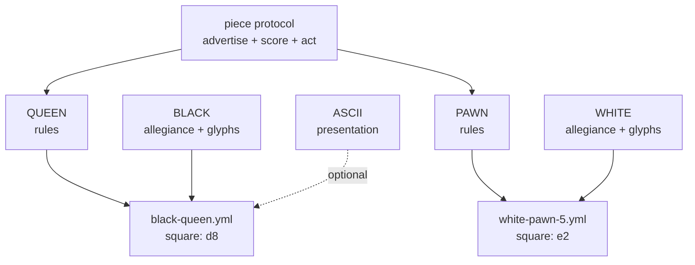

# Game Pieces — a DRY mixin graph for playing pieces

How to build pieces, sets, and plug-in games from prototypes, mixins, and
directories — and how to make them robust enough for expansion packs, user
content, and monsters that eat themselves.

Companions: [DIRECTORY-AS-IUNKNOWN.md](DIRECTORY-AS-IUNKNOWN.md) ·
[GARNET-AMULET-PROTOTYPE-SYSTEM.md](GARNET-AMULET-PROTOTYPE-SYSTEM.md) ·
[object-system/SELF-AND-MOOLLM.md](object-system/SELF-AND-MOOLLM.md) ·
[skills/soul-city/PORTABLE-NPCS.md](../skills/soul-city/PORTABLE-NPCS.md)

## The claim

A playing piece is not a class. It is a **composition of orthogonal mixins**:

- **type** — what it is (queen, superbat, axe, pit)
- **rules** — how it behaves (movement, hazard protocol, combat verbs)
- **presentation** — how it looks (glyph, sprite, prose, emoji)
- **metadata** — provenance, credits, canon sources
- **allegiance** — whose side / what color / which set instance

Keep the axes separate and you get every combination for free, DRY.
Collapse them into classes and you get `BlackQueen`, `WhiteQueen`,
`RedQueen3D`, `BlackQueenASCII`... — the combinatorial explosion Self and
prototype delegation were invented to kill.

(On the standard objection that multiple inheritance is too dangerous for
everyday use: it is — which is why the mixin graph is a *discipline* layered
on a sharp substrate, the same way Densmore's class.ps built structured
inheritance from PostScript's raw dictionary stack and COM's QueryInterface
disciplined raw vtables. The argument, with lineage:
[DIRECTORY-AS-IUNKNOWN.md](DIRECTORY-AS-IUNKNOWN.md#the-classps-precedent-dangerous-substrate-structured-discipline).)

## The chess set (canonical example)

Six types, two colors, N presentations. NOT 6 × 2 × N files — 6 + 2 + N:

```
pieces/chess/
  SET.yml            # the set: roster, board topology, victory rules
  types/
    KING.yml         #   move: one square, any direction; royal: true
    QUEEN.yml        #   move: any distance, straight or diagonal
    ROOK.yml         #   move: any distance, straight; castles: true
    BISHOP.yml       #   move: any distance, diagonal
    KNIGHT.yml       #   move: L-jump; leaps: true
    PAWN.yml         #   move: forward 1 (2 first); captures diagonally; promotes: true
  mixins/
    BLACK.yml        #   color: black;  glyphs: {king: ♚, queen: ♛, ...}
    WHITE.yml        #   color: white;  glyphs: {king: ♔, queen: ♕, ...}
    ASCII.yml        #   presentation: letters (K Q R B N P)
    STAUNTON-3D.yml  #   presentation: model refs
  instances/
    game-001/
      white-queen.yml      # inherits: [types/QUEEN, mixins/WHITE]  square: d1
      black-pawn-3.yml     # inherits: [types/PAWN,  mixins/BLACK]  square: c7
```

Any number of instances per type (eight pawns, two rooks, or a fairy-chess
army of nine queens). Any color: add `mixins/RED.yml`, get a third army
without touching a type file. **Promotion is a one-line re-mixin**: edit the
pawn instance's `inherits` from `types/PAWN` to `types/QUEEN`; its color
mixin, square, and capture history don't move.




The instance file is tiny: parents plus deltas. That is the whole Self
insight — identity is cheap, variation is a small delta on something that
already works, and the taxonomy *emerges* from what people actually make.

And the set is only the cast; the *scene* is modeled too.
[MICROWORLD.yml](../skills/experiment/experiments/turing-chess/MICROWORLD.yml)
lays out the complete chess match as a room tree: the venue with arbiter
and audience (and the demo board, ancestor of every live eval bar), the
**table** as the unsung root object, the board's 64 square rooms, the
two-faced clock, both players' scoresheets (the game's official shallow
memory, doubly witnessed), the box with its spare queens — and the
**sidelines**, where taken pieces stand. Chess never gave that spot an
official name (the FIDE Laws don't designate one; convention says each
player keeps their captures beside the board on their own side), but shogi
did: the **komadai**, official precisely because captured pieces change
allegiance and re-enter play — five centuries of capture-as-enfranchisement
before Revolutionary Chess made it a trial. So each player's stand is
modeled as **the bench**, and benched pieces are *alive on it*: they face
the board, their memories keep running, and they provide color commentary —
heckling their captor, coaching their old teammates, punditing the trials
(The Hague seats them as the commentary desk). Voice and memory, no moves:
the liveliest furniture in the microworld. And shogi's economy is a house
rule of its own —
[SHOGI-DROPS](../skills/experiment/experiments/turing-chess/plugins/revolutionary-chess/house-rules/SHOGI-DROPS.yml):
capture sends any piece to the captor's bench, and a later turn may drop it
back on any vacant square *as one of yours*. The trick that makes it cheap
is worth stealing on its own: shogi pieces aren't painted two colors — they
are identical wedges, and **allegiance is orientation**, a one-bit rotation
rather than an identity. Ownership derived from which way you point, never
cached: robust-first, five hundred years early. A piece's location is just
a path — `board/e4`, `sidelines/white-bench`, `box/spare-queens` — so
capture, promotion, drop, and exile are all *moves in the same tree*.

## Revolutionary Chess: runtime inheritance as politics

The mixin graph isn't static, and
**[Revolutionary Chess](../skills/experiment/experiments/turing-chess/plugins/revolutionary-chess/)**
(a live plugin in the turing-chess experiment) is the demonstration that
**adding inheritance relationships at runtime is practical** — and
dramatically legible. The plugin lies dormant until a normal game ends with
the capture of the king. Then the war is over, and the defeated side's
pawns **reverse direction and march home** — to revolt against their own
royalty and courtier class. Civil war as a rules patch.

The core mechanic is inheritance-by-seizure: **when an aristocrat is taken,
their moves join the commons — and so do they.** Capture is enfranchisement,
not execution; the taken piece joins as a full equal (equality is the whole
point — nobody who joins the commons is ever less than equal), and their
move organelle is deposited in the ledger for everyone, immediately.
Equality doesn't wait for the second rook to die. And the factoring is
perfect — perfectly *flat*: a pawn has **one rules parent, its
[commons](../skills/experiment/experiments/turing-chess/plugins/revolutionary-chess/COMMONS.yml)**.
There is no PAWN class above it; PAWN is a move-set organelle **seeded
into the commons at setup**, the founding deposit of the ledger. From
there, **every political event is an addition** — one append to one file,
never a removal. The revolution appends **NWAP** (the backwards-pawn move
set — "pawn" mirrored, because it *is* the pawn mirrored: homeward step,
homeward capture, coronation at the home rank, *additive*, so pawns keep
their forward moves and now walk both roads); every seizure appends an
organelle; unification hoists contents upward. Politics as a monotonic
append-only ledger, equality as the limit it converges to — there is no
operation that takes a move away from the people. Move-sets are written
in **side-relative coordinates** (forward = toward the enemy's home rank),
rotationally symmetric like a Margolus neighborhood in a block cellular
automaton — one rule file, interpreted in each team's frame, DRY across
the color axis. No per-instance surgery, no hierarchy rebuild, O(1)
political events on the same graph promotion already edits. And the
degenerate case is a feature: a piece whose commons holds **no move-sets
at all** just sits there, like furniture — its menu is *derived* from the
organelles present, so an empty ledger means an empty menu, not an error.
Give it self-destruct or let the troll's stomach eat it; the floor of
degradation is not a stack trace, it's a nice ottoman. The Sims built an
empire on pieces with no moves. The aristocracy never inherits COMMONS,
so bottom-up is structural rather than policed — and here is the punchline
of the class system: **there is no aristocracy mixin at all, because
aristocrats don't share.** A class file holds what its members have in
common, and the elites have nothing in common but their refusal to hold
things in common — an absence of a delegation edge, not a file. The only
sharing among them is piece-type behavior between same-color pairs (two
white rooks share `types/ROOK`, which already exists). When the last
aristocrat joins or falls, the class vanishes with no file to clean up.
And robust-first keeps it honest: membership is *derived by delegation
lookup*, never cached, and the COMMONS file doubles as the **ledger of the
revolution** — read one file to know everything seized, and when.

The commons itself factors by team: black and white run **separate
revolutions at first**, so each side gets its own ledger — COMMONS-WHITE
and COMMONS-BLACK, both inheriting from a generic world COMMONS that starts
empty. Each team progresses toward its own flat society on its own
timeline, which means the board can hold a classless white commune and a
still-royalist black kingdom simultaneously (the flat side will
proselytize). Then comes **the International**: the unification event that
merges the teams — and it touches **no piece's parents at all**. No
repointing, no re-instancing: just move the methods upstairs, cutting the
organelles from the team commons and pasting them into the world COMMONS.
Shared stock deduplicates trivially — PAWN and NWAP are side-relative, so
both teams were carrying the same contents all along — and every commoner
already delegates *through* its team commons *to* the world commons, so
the moves arrive by lookup the moment the file contents change. **The
delegation graph is the constitution and it never needs amending;
political events are contents flowing up edges that existed from the
first move of the game.** The remaining factoring question (where the
team edge lives — on a thin team-pawn prototype, on the color mixin, or
per instance at setup) is written up in
[COMMONS.yml](../skills/experiment/experiments/turing-chess/plugins/revolutionary-chess/COMMONS.yml)
under `team_commons`.

Biologically, this is **sideways migration of organelles**. A move-set is
an organelle in the [soul-city sense](../skills/soul-city/SOUL-MODEL.md) —
the same word Two-Toll's per-game minds use (`kind: organelle`) — a
self-contained package of capability that lives *inside* a piece but is not
*of* the piece. When the last owner of a move-set dies, the organelle is
rescued from the carcass and **transplanted into every surviving piece**:
horizontal transfer instead of vertical inheritance, Lynn Margulis's
endosymbiosis as a game mechanic. Mitochondria were free-living bacteria
until an ancestor cell engulfed them and kept the machinery; queen-moves
were the queen's until the revolution engulfed her and kept the machinery.
The delegation edge *is* the transplant — the organelle never stops being
one file, it just gains hosts.

Surrender is the **nonviolent path, and it's an enfranchisement, not a
demotion**: a fancy piece that capitulates joins the commons as a full
equal — it donates its aristocratic move-set (that organelle reaches the
commons ahead of the executioner's schedule) and joins the class that
inherits: pawn moves, plus everything already seized from the aristocracy,
plus everything seized after. That is
why [DYNAMICS.md](../skills/experiment/experiments/turing-chess/plugins/revolutionary-chess/DYNAMICS.md)
predicts early surrender is optimal — capitulating converts you from
organelle donor to organelle recipient, and the earlier you convert, the
more transplants you're alive to receive.

And surrender itself is a parameter axis, not a fixed rule: the plugin's
[house rules](../skills/experiment/experiments/turing-chess/plugins/revolutionary-chess/house-rules/)
are **mixins on the ruleset** — dealer's choice, like poker — each a small
patch to `surrender_policy` with its own predicted politics. No quarter
(cornered aristocrats, war of extermination), victor's exit (nomenklatura
become oligarchs — treachery rewarded in victory), vanquished mercy
(reconciliation commons vs rigid ancien régime, and a sandbagging metagame
where losing the first war wins the second), a Sun Tzu golden bridge that
burns at the first execution, amnesty by karma-weighted vote of the
commons, and exile, where the organelle emigrates and nobody inherits.
House rules are to rulesets what colors are to pieces: orthogonal mixins
on the same graph.

The **deep version**
([DEEP-MEMORY.yml](../skills/experiment/experiments/turing-chess/plugins/revolutionary-chess/DEEP-MEMORY.yml))
replaces the karma integer with the record itself: every piece keeps an
append-only memory log of every step of its game — every order obeyed,
every threat survived, every move it spent as bait — and **every square
keeps a ledger of everything that ever occurred on it**: arrivals,
departures, captures, who stood there and for how long. The board's 64
squares are 64 small rooms with 64 small memories (A1 has seen more
openings than anyone and is tired of them all). And capture gains a second
policy axis:
[TRIBUNAL](../skills/experiment/experiments/turing-chess/plugins/revolutionary-chess/house-rules/TRIBUNAL.yml)
makes capturing an aristocrat an *arrest*, not an execution. The whole
board votes on whether the captive lives or dies — **both colors**, plus
surrendered aristocrats, who are commoners now and may declaim their
loyalties before casting a ballot. Votes are grounded in how each voter
was actually treated by the accused and in the voter's personality; any
piece may testify from its own memory, and any piece may **call a square
as witness** — the crime scene is deposed, reads its ledger aloud, and
cannot lie, because the entry was written the moment it happened. Spared
aristocrats are enfranchised as full equals, donating their move-set
organelle to the commons alive. The robust-first rule holds even in court:
verdicts
are derived by reading the logs at decision time, never from a cached
loyalty flag — there is no troll flag in the courtroom, only the record.
Predicted dynamics: cross-color reputation (the enemy's pawns may spare
a queen who fought them honorably), kindness in the standard game priced
as life insurance per witness, and — on a persistent board — pieces
citing precedent from square ledgers by the third game.

And the vote is only the entry-level court. **The Hague**
([THE-HAGUE.yml](../skills/experiment/experiments/turing-chess/plugins/revolutionary-chess/house-rules/THE-HAGUE.yml))
stacks on the tribunal and replaces straight democracy with **justice**:
the board itself presides as judge (oldest and most neutral consciousness
in the game — it doesn't vote, it rules on objections), a jury is
empaneled by lot from both colors with loyalties disclosed under voir
dire, and advocates argue the case — a spent pawn prosecuting, a
surrendered aristocrat defending, because who knows the class and its
excuses better. The centerpiece is the **replay**: the accused's every
recorded interaction is reenacted move by move from the deep memory logs,
cross-checked against the ledger of every square they touched — the board
reconstructs the crime scene at the moment of the crime, the same
embedded-block-quote move as the troll's soul realms, but quoting a *past
game state* instead of another game. Testimony that contradicts a square's
ledger is struck; the ledger controls. Each trial is a **playable
mini-game** (take any seat: prosecutor, defender, juror, accused — a trial
is to Revolutionary Chess what a dungeon is to an RPG) and a **court TV
episode** (cold open on the capture replay, square deposition as the
act-three twist, verdict as cliffhanger; the revolution will not only be
televised, it will be subpoenaed). Verdicts gain a middle path the raw
vote never had: **restorative sentences** — escort the pawn you spent to
coronation, stand guard on the square where you abandoned the knight —
logged in the convict's memory and verified against square ledgers on
completion. Justice with a work order.

The plugin runs it as a full state machine — STANDARD → REVOLUTION →
INHERITANCE → EQUALITY → COOPERATION → SANDBOX — with surrender as a
strategic option ([DYNAMICS.md](../skills/experiment/experiments/turing-chess/plugins/revolutionary-chess/DYNAMICS.md)
predicts early surrenderers end up with the most inherited moves, and
surrender cascades once two or three elites fold), pawns promoting at their
*home* rank on the return march, and historic-game replays
([HISTORIC-GAMES.md](../skills/experiment/experiments/turing-chess/plugins/revolutionary-chess/HISTORIC-GAMES.md):
Byrne–Fischer 1956 continued past checkmate — Byrne's pawns reverse and
hunt Fischer's king). When all elites are gone, all pieces have all moves,
competition dissolves, and the board transcends into a sandbox — the game
ends where this document begins, with every piece a composition of
everything the war set free.

## Buffs: mixins with expiration dates

Once inheritance edges can be added at runtime, the next question is
whether they can *lapse* — and that's what a buff is: **a mixin with an
expiration date or condition on its delegation edge.**

```yaml
inherits:
  - types/KNIGHT
  - mixins/WHITE
  - buffs/BLESSED.yml        # while: carrying(holy-symbol)
  - buffs/GIANT-GROWTH.yml   # expires: end_of_turn
  - debuffs/POISONED.yml     # expires: after_moves(6), or cured_by(antidote)
```

The grammar is three keywords: `expires_at` (a move number, a date, a
clock time), `expires_when` (an event: first execution, sunrise, the lamp
running out), and `while` (a continuous predicate: active only while the
carrier holds the holy symbol, stands on the home rank, is in shadow).

The lifecycle is a **three-layer ladder**, each layer a step up in
sophistication:

1. **Self-removal.** The common pattern: a buff can own its own death —
   time out, self-destruct, delete its edge when the condition fires.
   The robust-first distinction is *agency*: removal is the buff's own
   act, not a cleanup step some other system must remember to run. The
   troll flag failed because the *world* was supposed to clear it;
   a self-destructing buff carries its own funeral instructions.
2. **Disable-but-remain.** Another layer of conditionalization: the buff
   stays in the graph but *stops answering* while its condition is false —
   evaluated fresh at lookup time, so it can flicker (a `while:` buff
   re-enables the moment you pick the holy symbol back up), and it doubles
   as the safety net under layer 1: a buff that somehow missed its own
   funeral still answers "not anymore," so nothing stale ever acts.
3. **Scoring.** The top of the ladder: an enabled buff doesn't just answer
   present-or-absent, it returns a **score** — and scores flow into the
   **what-do-I-do-next engine**, the same advertise → score → act loop the
   piece protocol already runs (and The Sims shipped). A POISONED debuff
   doesn't merely restrict moves; it bids "find the antidote" high. A
   BLESSED buff scores holy actions up while it lasts. The buff graduates
   from a capability to a *voice in the auction* — behavior selection is
   just reading the current bids from whatever mixins are alive, enabled,
   and shouting.

And the auction shouldn't always pay the highest bidder. The Sims'
autonomy used a **find-best-N** primitive: score every advertisement,
then pick *randomly among the top N* — deliberate dither that makes
behavior organic instead of digitally predictable, and turns scoring
ties from a bug into personality. Three reasons the dither is a feature,
not a compromise. **Epistemics:** argmax was never "optimal," because
bids are approximations at best and bald-faced lies at their cleverest —
the Sims food chain is a supply chain of hustlers (fridge advertises
"open me if hungry" → raw food advertises "cook me" → stove advertises
a hot meal while omitting the burn-the-house-down clause that scales
with your skill, beside a microwave promising safety and delivering
fish-flavored everything). Paying the top bid every time isn't
optimization, it's being deterministically conned. **Exploration:**
random picks among strong candidates escape local maxima — repeated
iteration finds ways out of apparent dead ends, giving a Drescher-style
schema learner the wide coverage pure exploitation never visits.
**Teachability:** visible imperfection leaves room for the player to
*improve* the character by overriding it — a directed command is a
forced pick of one ad regardless of score, which is programming by
demonstration in disguise; skill gains from the demonstrated action
re-weight future auctions until the override becomes the habit. A piece
that always argmaxes cannot be taught this way. And overrides should
weigh heavy: a forced pick is a **strong salience signal** to a
Drescher-style schema learner — the teacher explicitly marking *which*
choice mattered, worth a thousand unattended trials. Which implies the
unbuilt fourth stage: **advertisements that learn** — not to be more
persuasive (that road is engagement maximization) but more *appropriate
and helpful*, re-tuning bids against the hearer's observed outcomes;
persuasion then arrives as earned trust, because the hearer discovers
the ads serve the listener's good rather than the seller's. The hustler
food chain can learn honesty, and where outcomes feed the auction,
honesty keeps winning it. The full dispatch
spectrum runs
**argmax** (deterministic winner; compiles to a table lookup) →
**find-best-N** (still crystallizable: scoring table plus a *seeded* RNG,
and the seed goes in the deep memory logs so trial replays don't diverge
from the crime) → **softmax** (temperature sampling over judged salience —
which an LLM does natively, because temperature sampling *is* find-best-N's
continuous generalization). Make **temperature a context value** and the
knob composes like everything else: the party planner runs hot, the
accountant runs cold, and a scene sets its dither level once, inherited
implicitly by every decision inside it. And ambient heat doesn't have to
be set by hand — it can come from **the room**, and the room can inherit
it, varying over time, from **moody media** playing in it: music, video,
and pure mood objects that broadcast time-varying heat levels per
semantic tag (romantic, energetic, intellectual...) into the room's
auction while they play. A slow dance is high romantic heat at low
temperature; a party track is high energy at high dither. See
[MOODY.md](MOODY.md) for the full design and its Sims-era history.

And since a buff is a full prototype, it carries the whole interface: **a
buff has its own CARD with its own advertisements**, and attaching the
buff merges its card into the host's advertisement pool. The host's menu
and behavior are the *union of the cards of every live, enabled mixin*,
scored together in one auction — the piece contributes its move
advertisements, the color mixin its allegiance-flavored options, and the
POISONED debuff its own card: "seek antidote" advertised to the host,
"administer antidote" advertised *to bystanders* (a poisoned pawn
advertises its plight to nearby healers exactly the way a Sims fridge
advertises meals to the hungry). BLESSED's card adds smite slices to the
pie menu while the blessing lasts; when the buff disables or removes
itself, its advertisements leave the pool with it — no menu cleanup,
because the menu was never stored, only derived. Advertisements compose
the same way move-sets do: the buff doesn't patch the host, it *stands
next to it and shouts*, and the scoring engine hears everyone at once.

The genealogy is everywhere once you look. Chess itself ships two buffs
in the base rules: **castling rights** (a capability that expires
permanently the move your king or rook first moves — and famously a
*cached-flag bug factory*: FEN notation stores castling rights as flags,
and every engine author learns why deriving them from move history is
safer) and **en passant**, the shortest-lived buff in classic games — a
capture right that exists for exactly one move and then evaporates.
Magic: The Gathering built a whole economy on `expires: end_of_turn`
(Giant Growth is a +3/+3 mixin with a one-turn edge); D&D has spell
durations and concentration (a `while:` condition on the caster);
roguelikes distinguish intrinsics (permanent mixins) from timed
extrinsics; The Sims 4 calls them **moodlets** — mood mixins with
visible countdown timers. And Revolutionary Chess already uses them on
the *ruleset*: the golden-bridge surrender window is a buff on the
house rules that `expires_when: first_execution`, and a Hague
restorative sentence is a debuff that lifts on verified completion.
Same mechanism at every scale: piece, player, ruleset — a delegation
edge with a condition, evaluated fresh, never cached.

## The wumpus set: hazards as sub-piece templates

[Snorax](../examples/adventure-4/characters/fictional/wumpus-snorax/) already
factors this way. Hunt the Wumpus is a **set**, and its hazards are **pieces**:

```
wumpus-snorax/
  GAME.yml                    # the set: rules, win/lose, turn protocol
  DODECAHEDRON.yml            # the board: canonical 20-cave topology
  hazards/
    SUPERBATS.yml             # piece template: population, alpha, relocation
    BOTTOMLESS-PIT.yml        # piece template: fall protocol, breeze warning
  instances/                  # per-world state: which cave, which game
```

Pits and superbats are **sub-object templates of the wumpus** in exactly the
chess-set sense: instantiate any number (`room-x/bats.yml` with
`population: 50` — split the colony), move them by moving files, reset by
`rm` + copy from template. Other games adopt them à la carte: a bottomless
pit works fine in a dungeon that has never heard of a wumpus, because the
piece carries its own rules and advertises its own warnings ("breeze
nearby!") — warnings are presentation mixins on the hazard, not code in the
room.

This is precisely how Sims expansion packs and twenty-six years of user-created content play together harmoniously: **objects work independently as much as possible, with at most a few system/controller objects per playset**. The WillWrightShowForFood catalogs formalize the
pattern with real playsets
([orchestrator-playsets design](https://github.com/SimHacker/WillWrightShowForFood/blob/main/designs/orchestrator-playsets/README.md)):
[SimProv's wedding Hope Chest](https://github.com/SimHacker/WillWrightShowForFood/blob/main/catalogs/simprov/ORCHESTRATOR.yml)
is a `saga_controller` — it summons Cupid and gates the wedding quest tree;
[Zombie Sims' Ham Radio](https://github.com/SimHacker/WillWrightShowForFood/blob/main/catalogs/zombie-sims/ORCHESTRATOR.yml)
is a `wave_controller` orchestrating outbreaks;
[SliceCity's power plant](https://github.com/SimHacker/WillWrightShowForFood/blob/main/catalogs/simslice/ORCHESTRATOR.yml)
is the seed orchestrator for a whole city of otherwise-independent pieces —
buildings, a modular airport whose components snap together, planes spawned
and absorbed as transit objects, parachuters, swarms of people, and puddles
of blood when you step on them (`stomp_result: red_blood_stains`).
Everything that *can* stand alone does — Cupid, Buddha, the crowd sitter —
à la carte, exactly like the bottomless pit in a dungeon that never heard
of a wumpus. The controller is the exception that earns its keep, not the
default; and even controllers coordinate by merging and gating
*advertisements*, never by owning the objects they orchestrate.

Same decomposition for the whole menagerie: the crooked arrow is a piece
(ammunition type × inventory mixin), the lamp is a piece (light source type ×
fuel state), and the lamp's fuel is **shared state that two games read** —
wumpus rules while it burns, grue rules when it dies.

## Containers: inventory and stomachs

Location is a path, so containment is free and recursive:

- **Inventory** — [the troll's axe](../examples/adventure-4/characters/fictional/troll/inventory/)
is a piece he *plays*: fight, throw, catch, eat. It composes weapon rules ×
throwable × edible (Zork gift protocol: weapons preferred).
- **Stomach** — [the troll's stomach](../examples/adventure-4/characters/fictional/troll/stomach/)
is a **location piece**: a pocket universe holding characters, weapons,
food, treasures. Eating is a move, not a copy: set the eaten piece's
`location` to the stomach path. Local state is a stub `.yml` inheriting
from the character — spattered in digestive juices — never a mutation of
the prototype.
- **Recursion** — `location: self` puts the troll in his own stomach. One
directory; nesting is narrative depth, not filesystem depth.

Containers are just pieces whose presentation includes "what's inside," so a
chess piece could contain a smaller board, and a wumpus could swallow a lamp
(grue rules apply inside).

## Smart placement: the sorting stomach

"Put this in that" is underspecified, and good containers know it. The
pattern comes from **OpenLaszlo** (David Temkin et al.): a child declares a
`placement` attribute, a container declares a `defaultplacement`, and the
container can override its determine-placement method to inspect the
incoming child — plus an optional args object for custom parameterized
placement protocols — and route it to the right sub-container. The everyday
use was a constant sub-path to the "client view," so children added to a
window skipped the chrome (title bar, scroll bars) and landed in the content
area. The general idea is bigger: **the container owns the routing decision,
and the giver doesn't need to know the container's internals.**

[The troll's stomach](../examples/adventure-4/characters/fictional/troll/stomach/STOMACH.yml)
is a sorting container in exactly this sense. EAT X and GIVE X TO TROLL are
user-level verbs — drag-and-drop into the gaping maw — and the stomach's
placement protocol inspects the child: characters route to
`contents/adventurers/` (as digestive-juice-spattered stubs inheriting from
their prototypes), treasures to `contents/treasures/` with a ledger entry,
weapons land loose and crunchy, and the troll himself routes to
`contents/himself.yml`. GIVE TROLL TO TROLL isn't a special case that needs
a flag; it's just the self route through the same protocol. The dumb
explicit API (move the file yourself) is still there underneath — the smart
overlay is for the user's level, where dropping something *into* something
should do the logically right thing without asking where the sub-slot is.

This is the drag-and-drop contract every direct-manipulation microworld
needs: SimCity tiles, Sims object slots, HyperCard backgrounds, Laszlo
views, troll stomachs. Low-level moves obey; high-level verbs route.

### The genealogy in shipped games

Games have been shipping smart placement for decades, in four families:

- **Typed bags** (the container only accepts its type): World of Warcraft's
profession bags — herb, mining, enchanting, soul bags, quivers; EverQuest's
quivers and tradeskill containers before that; Breath of the Wild's pouches
are the purest form — an apple *can only* land in materials, and the player
never files anything.
- **Auto-routing on deposit** (the container inspects and files — the
stomach's exact protocol): Guild Wars 2's fills-first bags (oiled bags
attract junk, craftsman's bags attract mats, equipment boxes attract gear,
invisible bags opt *out* of sorting and vendoring) plus "deposit all
materials"; Path of Exile's stash tab affinities routing a ctrl-click dump
to whichever tab owns the type; Terraria's Quick Stack to Nearby Chests —
the elegant one, items fly to whatever chests *already contain that kind of
thing*, so **the world's existing arrangement is the routing table**;
Stardew Valley's "add to existing stacks"; Diablo III/IV material storage.
- **Routing as visible labor**: Dwarf Fortress stockpiles (dwarves haul
everything to its typed zone — the sort is performed by characters you can
watch), Minecraft hopper sorters (player-*built* placement protocols),
Factorio filter inserters and logistic chests. Factorio generalizes
furthest: deposit-routing made *continuous* — belts for arbitrary objects,
in the von Neumann 29-state universal constructor lineage
([FACTORIO-MOOLLM-DESIGN.md](FACTORIO-MOOLLM-DESIGN.md)).
- **Containers with behavior** (the stomach's true family): Diablo II's
Horadric Cube *transforms* what it holds — a container that digests;
EverQuest's ovens and forges; Torchlight's pet, a walking container that
leaves to go sell; and NetHack's bag of tricks, a container that turns out
to be a creature — the exact inverse of the troll, a creature that turns
out to be a container. NetHack also supplies the recursion cautionary tale:
bag of holding in bag of holding explodes. GIVE TROLL TO TROLL just deepens
the narrative stack — single pocket, no boom.

And in **PieCraft** (Don Hopkins,
[canonical design in MicropolisCore](https://github.com/SimHacker/MicropolisCore/blob/main/documentation/designs/piecraft/PIECRAFT.md))
the container *is the UI*: pie menus are craftable typed bags whose
**geometry is part of the type — slot count is valence**. Pies auto-route on
deposit (a potion files itself into the consumables pie, a spell into its
element's slice) and **bond into molecules**: a submenu is a covalent bond, a
loadout is a molecule of complementary valences, and combat can decompose a
molecule back into element pies, spilling loose items. Smart placement,
typed bags, and Fitts's law fused into one crafting system.

### Beyond games: the webtop

Every desktop ever shipped makes the user do all the filing by hand. These
are features a general-purpose webtop window/object manager should have —
the direct descendant of OpenLaszlo's placement protocol, at home in a
zoomable interface of the kind David Temkin has pursued:

- **Quick Stack for files**: drop a pile on the desktop and each file flies
to a folder that already contains that kind of thing — the user's existing
arrangement is the routing table, so the system learns filing from the
filing you already did. That is programming by demonstration where the
*demonstration is your folder structure*.
- **Affinities and fills-first folders**: a folder declares what it attracts
(INTERFACE.yml-style, one dropped file at a time); an invisible-bag folder
opts out of auto-sort entirely.
- **Deposit-all verbs**: one gesture files everything routable and leaves
the residue visible for triage — conservative in what it moves, liberal in
what it accepts.
- **Routing as visible animation**: in a zoomable interface the file
*visibly flies* to its destination, Terraria-style, so auto-filing is
self-demonstrating — the system shows you its reasoning at exactly the
moment you could correct it. Smart placement plus visible routing is the
teach-by-demonstration loop running in reverse: the system demonstrates,
the user inspects and corrects.

The **pie menu tabbed window interface** is the window-level embodiment of
the same system
([PIE-TAB-WINDOWS.md](https://github.com/SimHacker/MicropolisCore/blob/main/documentation/notes/PIE-TAB-WINDOWS.md)
in MicropolisCore; shell context in
[MOOLLM-WEBTOP-VISION.md](webtop-gwern-inheritance/MOOLLM-WEBTOP-VISION.md)).
A **Stack is a typed bag of Cards**; a **tab is simultaneously the handle
and the advertisement** — grab it to drag, pop a pie on it for the Card's
verbs (close, detach to window, move to stack, open in git), heritage
running back through NeWS tabbed frames and the PSIBER Space Deck. And its
Snapping & Grouping rules are literally a placement protocol for windows:
dragging a Card offers snap positions — dock as a sibling in the layout
tree, insert into a target Stack (tab rows merge), or pull out to float —
so the *workspace* inspects the incoming window and offers placements, the
way the stomach inspects the incoming meal. Pies, tabs, Stacks, and
PieCraft molecules are one container algebra at four scales: slice, tab,
window, workspace.

## Robust-first: the TROLL-FLAG lesson

Zork's troll had two glorious behaviors and one famous bug. GIVE AXE TO
TROLL: he eats his own weapon and cowers. GIVE TROLL TO TROLL: he eats
himself and vanishes — self-devouring via transitive containment, arguably
*acting as designed*, since the MDL's generic containment made it fall out
for free. The bug: `**TROLL-FLAG` was never cleared** when he self-devoured, so the empty room still "fends you off with a menacing gesture." (Don Hopkins reverse-over-engineered that flag from black-box play on MIT-DM and confirmed it in the source decades later.)

The failure shape: **the room cached a fact about the troll instead of
asking the troll.** A flag is a copy of state; copies go stale; stale copies
haunt rooms.

Design rules for plug-in pieces that can't grow troll flags:

1. **Presence is the flag.** "A troll guards this edge" is true iff a troll
  instance file points at this edge. Remove the file, the fact is gone.
   No cleanup step exists to forget.
2. **Advertisements die with the advertiser.** The room never knows what a
  troll is; it relays whatever pieces currently advertise. An eaten troll
   advertises nothing — from inside his own stomach, fronting is optional.
3. **Derive, don't cache.** If another piece needs "is the bridge guarded?",
  it asks the edge at score time. If it must cache for performance, the
   cache carries the instance path it derived from, and a missing source
   invalidates it.
4. **State lives in the instance, never the prototype.** The customs rule
  from [PORTABLE-NPCS.md](../skills/soul-city/PORTABLE-NPCS.md): wealth,
   grudges, and toll ledgers are instance-local. Prototypes stay clean, so
   every new world gets a fresh troll with no haunted luggage.
5. **Postel at the socket.** Accept pieces with missing or unknown keys;
  default what you can, ignore what you don't understand, emit clean YAML.
   A piece referencing an absent mixin degrades to its next ancestor — a
   queen with no glyph set still moves like a queen and renders as "queen."
6. **Survive > correct** (Dave Ackley, robust-first). A crashed game is
  infinitely wrong. A pit that can't find its breeze warning is a silent
   pit, not a stack trace. Log, degrade, keep playing.
7. **Reset is re-instantiation, not un-mutation.** `rm` instances, copy from
  templates ([SUPERBATS.yml](../examples/adventure-4/characters/fictional/wumpus-snorax/hazards/SUPERBATS.yml)
   documents this in its header). There is no "undo every flag" step because
   there are no flags to undo.

**Why The Sims never grew a troll flag:** the socket was narrow.
Expansion-pack and user-created objects (Edith behaviors, Transmogrifier
ports) carried their own code and broadcast scored advertisements; the base
game never stored "this house contains a hot tub" anywhere — it asked the
objects present. Thousands of third-party objects plugged in for decades
without the world accumulating stale knowledge about any of them. That is
rule 1 at industrial scale, shipped in 2000.

## What the LLM adds

The mixin graph above runs as plain data — the adventure compiler can emit
deterministic JS from it, no LLM at runtime. The LLM earns its keep at
**authoring time** (compose a new piece from prototypes + a natural-language
delta: "a pit like the bottomless one, but it burps") and at **coherence
time** (when two pieces' rules collide in a way no table anticipated, decide
in character, then LIFT the ruling into the rules file so next time it's
deterministic). Bugs like the troll flag become one-line prose fixes: the
ruling "an eaten troll guards nothing" is obvious to a language engine even
when a 1980 flag table missed it.

## Compile to ECS: trade flexibility for performance, when it gels

Entity component systems do multi-role entities in a **static, predefined
way**: components are mixins with the inheritance stripped out, archetypes
are the gelled type combinations, and systems iterate dense arrays of them
cache-line by cache-line (Unity DOTS, Bevy, flecs). ECS is what the mixin
graph looks like *after rigor mortis* — fast precisely because nothing can
change shape at runtime.

So don't choose; **compile**. The same move the adventure compiler makes
(natural language → deterministic JS, LLM at authoring time only) applies
one level down: once instance-first development (Oliver Steele's Laszlo
term) has let the schemas **gel** — once thousands of pieces have voted
with their `inherits:` lines and the working set of mixin combinations is
known — compile the gelled part into ECS archetypes and trade runtime
flexibility for performance. The long tail of odd pieces stays on the
dynamic prototype layer; the hot path (every superbat, every crowd sim,
every SliceCity parachuter) runs as packed arrays.

This is the **Self lineage move**, not a departure from it: Ungar, Chambers,
and Hölzle's Self VM recovered class-like efficiency from prototype-like
freedom with maps (hidden classes) and adaptive compilation — clone families
that share a shape share compiled machinery, transparently, without the
author ever declaring a class. V8's hidden classes descend directly from it.
Prototypes for authoring, classes for the compiler to *discover*: the
taxonomy that emerged from play is exactly the archetype table ECS wants.
Play-Learn-Lift, one level down: PLAY with free delegation, LEARN which
shapes gel, LIFT the gelled shapes into the fast engine — and when
Revolutionary Chess appends an organelle to the COMMONS mid-story, that's
an archetype migration; handle it on the dynamic layer, and recompile when
the new order gels.

## See also

- [skills/buff/](../skills/buff/) — the runtime for the buff half of this document, plus the
  concentrated design: [SELF-KORZ.md](../skills/buff/SELF-KORZ.md) (the Self reading here is
  the narrowest of three — Korz drops the requirement that a buff be attached to a host,
  which retires the room-spirit workaround), [EFFECTIVE-VALUES.md](../skills/buff/EFFECTIVE-VALUES.md)
  (buff as cached constraint expression, and why "never cached" and "caches" are both right),
  [CONSEQUENCE-LOOP.md](../skills/buff/CONSEQUENCE-LOOP.md) (where buffs sit in the
  advertisement cycle, and why the buff table is where a simulation keeps its argument), and
  [buffopedia/](../skills/buff/buffopedia/) (eighteen dialects, four axes, one fidelity ladder)
- [TECH-TREE.md](TECH-TREE.md) — the same gated-mixin mechanism with a progress guard instead
  of an expiration date: unlocks, spells, abilities and buffs as one node type
- [MOODY.md](MOODY.md) — heat as ambient context; buffs gate the constraint wires
