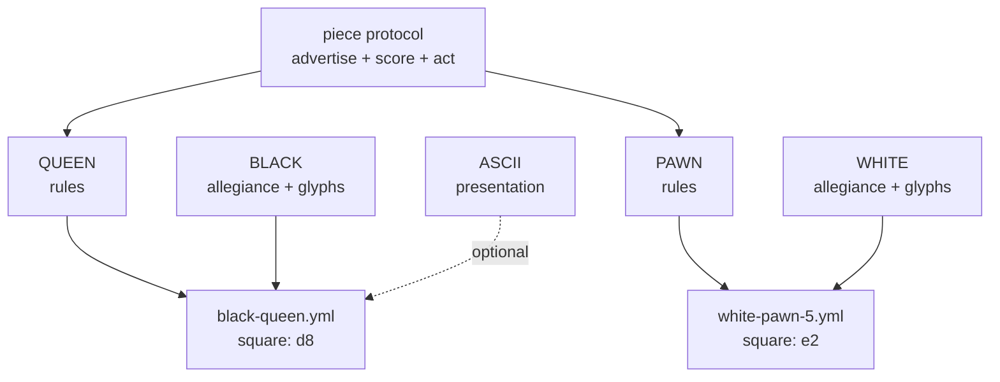

# Game Pieces — a DRY mixin graph for playing pieces

How to build pieces, sets, and plug-in games from prototypes, mixins, and
directories — and how to make them robust enough for expansion packs, user
content, and monsters that eat themselves.

Companions: [DIRECTORY-AS-IUNKNOWN.md](DIRECTORY-AS-IUNKNOWN.md) ·
[GARNET-AMULET-PROTOTYPE-SYSTEM.md](GARNET-AMULET-PROTOTYPE-SYSTEM.md) ·
[object-system/SELF-AND-MOOLLM.md](object-system/SELF-AND-MOOLLM.md) ·
[skills/soul-city/PORTABLE-NPCS.md](../skills/soul-city/PORTABLE-NPCS.md)

## The claim

A playing piece is not a class. It is a **composition of orthogonal mixins**:

- **type** — what it is (queen, superbat, axe, pit)
- **rules** — how it behaves (movement, hazard protocol, combat verbs)
- **presentation** — how it looks (glyph, sprite, prose, emoji)
- **metadata** — provenance, credits, canon sources
- **allegiance** — whose side / what color / which set instance

Keep the axes separate and you get every combination for free, DRY.
Collapse them into classes and you get `BlackQueen`, `WhiteQueen`,
`RedQueen3D`, `BlackQueenASCII`... — the combinatorial explosion Self and
prototype delegation were invented to kill.

## The chess set (canonical example)

Six types, two colors, N presentations. NOT 6 × 2 × N files — 6 + 2 + N:

```
pieces/chess/
  SET.yml            # the set: roster, board topology, victory rules
  types/
    KING.yml         #   move: one square, any direction; royal: true
    QUEEN.yml        #   move: any distance, straight or diagonal
    ROOK.yml         #   move: any distance, straight; castles: true
    BISHOP.yml       #   move: any distance, diagonal
    KNIGHT.yml       #   move: L-jump; leaps: true
    PAWN.yml         #   move: forward 1 (2 first); captures diagonally; promotes: true
  mixins/
    BLACK.yml        #   color: black;  glyphs: {king: ♚, queen: ♛, ...}
    WHITE.yml        #   color: white;  glyphs: {king: ♔, queen: ♕, ...}
    ASCII.yml        #   presentation: letters (K Q R B N P)
    STAUNTON-3D.yml  #   presentation: model refs
  instances/
    game-001/
      white-queen.yml      # inherits: [types/QUEEN, mixins/WHITE]  square: d1
      black-pawn-3.yml     # inherits: [types/PAWN,  mixins/BLACK]  square: c7
```

Any number of instances per type (eight pawns, two rooks, or a fairy-chess
army of nine queens). Any color: add `mixins/RED.yml`, get a third army
without touching a type file. **Promotion is a one-line re-mixin**: edit the
pawn instance's `inherits` from `types/PAWN` to `types/QUEEN`; its color
mixin, square, and capture history don't move.



The instance file is tiny: parents plus deltas. That is the whole Self
insight — identity is cheap, variation is a small delta on something that
already works, and the taxonomy *emerges* from what people actually make.

## The wumpus set: hazards as sub-piece templates

[Snorax](../examples/adventure-4/characters/fictional/wumpus-snorax/) already
factors this way. Hunt the Wumpus is a **set**, and its hazards are **pieces**:

```
wumpus-snorax/
  GAME.yml                    # the set: rules, win/lose, turn protocol
  DODECAHEDRON.yml            # the board: canonical 20-cave topology
  hazards/
    SUPERBATS.yml             # piece template: population, alpha, relocation
    BOTTOMLESS-PIT.yml        # piece template: fall protocol, breeze warning
  instances/                  # per-world state: which cave, which game
```

Pits and superbats are **sub-object templates of the wumpus** in exactly the
chess-set sense: instantiate any number (`room-x/bats.yml` with
`population: 50` — split the colony), move them by moving files, reset by
`rm` + copy from template. Other games adopt them à la carte: a bottomless
pit works fine in a dungeon that has never heard of a wumpus, because the
piece carries its own rules and advertises its own warnings ("breeze
nearby!") — warnings are presentation mixins on the hazard, not code in the
room.

Same decomposition for the whole menagerie: the crooked arrow is a piece
(ammunition type × inventory mixin), the lamp is a piece (light source type ×
fuel state), and the lamp's fuel is **shared state that two games read** —
wumpus rules while it burns, grue rules when it dies.

## Containers: inventory and stomachs

Location is a path, so containment is free and recursive:

- **Inventory** — [the troll's axe](../examples/adventure-4/characters/fictional/troll/inventory/)
  is a piece he *plays*: fight, throw, catch, eat. It composes weapon rules ×
  throwable × edible (Zork gift protocol: weapons preferred).
- **Stomach** — [the troll's stomach](../examples/adventure-4/characters/fictional/troll/stomach/)
  is a **location piece**: a pocket universe holding characters, weapons,
  food, treasures. Eating is a move, not a copy: set the eaten piece's
  `location` to the stomach path. Local state is a stub `.yml` inheriting
  from the character — spattered in digestive juices — never a mutation of
  the prototype.
- **Recursion** — `location: self` puts the troll in his own stomach. One
  directory; nesting is narrative depth, not filesystem depth.

Containers are just pieces whose presentation includes "what's inside," so a
chess piece could contain a smaller board, and a wumpus could swallow a lamp
(grue rules apply inside).

## Robust-first: the TROLL-FLAG lesson

Zork's troll had two glorious behaviors and one famous bug. GIVE AXE TO
TROLL: he eats his own weapon and cowers. GIVE TROLL TO TROLL: he eats
himself and vanishes — self-devouring via transitive containment, arguably
*acting as designed*, since the MDL's generic containment made it fall out
for free. The bug: **`TROLL-FLAG` was never cleared** when he self-devoured,
so the empty room still "fends you off with a menacing gesture." (Don
Hopkins reverse-engineered that flag from black-box play on MIT-DM and
confirmed it in the source decades later.)

The failure shape: **the room cached a fact about the troll instead of
asking the troll.** A flag is a copy of state; copies go stale; stale copies
haunt rooms.

Design rules for plug-in pieces that can't grow troll flags:

1. **Presence is the flag.** "A troll guards this edge" is true iff a troll
   instance file points at this edge. Remove the file, the fact is gone.
   No cleanup step exists to forget.
2. **Advertisements die with the advertiser.** The room never knows what a
   troll is; it relays whatever pieces currently advertise. An eaten troll
   advertises nothing — from inside his own stomach, fronting is optional.
3. **Derive, don't cache.** If another piece needs "is the bridge guarded?",
   it asks the edge at score time. If it must cache for performance, the
   cache carries the instance path it derived from, and a missing source
   invalidates it.
4. **State lives in the instance, never the prototype.** The customs rule
   from [PORTABLE-NPCS.md](../skills/soul-city/PORTABLE-NPCS.md): wealth,
   grudges, and toll ledgers are instance-local. Prototypes stay clean, so
   every new world gets a fresh troll with no haunted luggage.
5. **Postel at the socket.** Accept pieces with missing or unknown keys;
   default what you can, ignore what you don't understand, emit clean YAML.
   A piece referencing an absent mixin degrades to its next ancestor — a
   queen with no glyph set still moves like a queen and renders as "queen."
6. **Survive > correct** (Dave Ackley, robust-first). A crashed game is
   infinitely wrong. A pit that can't find its breeze warning is a silent
   pit, not a stack trace. Log, degrade, keep playing.
7. **Reset is re-instantiation, not un-mutation.** `rm` instances, copy from
   templates ([SUPERBATS.yml](../examples/adventure-4/characters/fictional/wumpus-snorax/hazards/SUPERBATS.yml)
   documents this in its header). There is no "undo every flag" step because
   there are no flags to undo.

**Why The Sims never grew a troll flag:** the socket was narrow.
Expansion-pack and user-created objects (Edith behaviors, Transmogrifier
ports) carried their own code and broadcast scored advertisements; the base
game never stored "this house contains a hot tub" anywhere — it asked the
objects present. Thousands of third-party objects plugged in for decades
without the world accumulating stale knowledge about any of them. That is
rule 1 at industrial scale, shipped in 2000.

## What the LLM adds

The mixin graph above runs as plain data — the adventure compiler can emit
deterministic JS from it, no LLM at runtime. The LLM earns its keep at
**authoring time** (compose a new piece from prototypes + a natural-language
delta: "a pit like the bottomless one, but it burps") and at **coherence
time** (when two pieces' rules collide in a way no table anticipated, decide
in character, then LIFT the ruling into the rules file so next time it's
deterministic). Bugs like the troll flag become one-line prose fixes: the
ruling "an eaten troll guards nothing" is obvious to a language engine even
when a 1980 flag table missed it.
