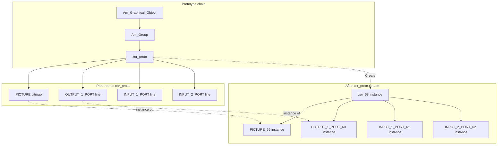

# Garnet and Amulet: Prototype-Instance Objects for UI and MOOLLM

**Status:** Design reference (May 2026)  
**Primary source:** Myers et al., *The Prototype-Instance Object Systems in Amulet and Garnet* (CMU ISR working paper, 1998) — [Research Showcase #746](http://repository.cmu.edu/isr/746)  
**Lineage:** Sketchpad → ThingLab → **Garnet (Lisp, 1988)** → **Amulet (C++, 1994)** → OpenLaszlo → Svelte → MicropolisCore measure protocol → MOOLLM  
**Related:** [SELF-ISH-INFLUENCES.md](SELF-ISH-INFLUENCES.md), [PROTOTYPE-FRAGMENT-CONFIG.md](PROTOTYPE-FRAGMENT-CONFIG.md), [VISUAL-PROGRAMMING-LINEAGE.md](VISUAL-PROGRAMMING-LINEAGE.md), [postscript/LINGUISTIC-MOTHERBOARD.md](postscript/LINGUISTIC-MOTHERBOARD.md), [Don Hopkins — Constraints and Prototypes in Garnet and Laszlo](https://donhopkins.medium.com/constraints-and-prototypes-in-garnet-and-laszlo-84533c49c548)

---

## Why this document exists

Brad Myers' Garnet and Amulet systems are often summarized as "prototype OOP with constraints." That summary misses the feature Don Hopkins and later OpenLaszlo developers found most powerful: **structural inheritance** — parallel trees of prototypes, instances, and part hierarchies, kept coherent by constraints.

MOOLLM already speaks Self (delegation, no classes, progressive revelation). Garnet/Amulet add a complementary lesson: **instancing is not one tree, it is two (or three) synchronized trees**. That maps directly onto how LLM context should be assembled from skills, directories, and reactive bindings.

---

## Don at CMU with Brad Myers

Don Hopkins worked with **Brad Myers** at Carnegie Mellon on **Garnet** (1992–1993), the Lisp predecessor to **Amulet**. Garnet's object kernel was **KR** (Knowledge Representation) — a frame/prototype library in the GOFAI tradition, not a bolt-on widget set.

Don's work included the PostScript printing driver and GLASS interface pieces. The through-line in his own writing:

> *"Constraints are like structured programming for variables."*

Garnet used **lazy pull** constraints (recompute when read). At **Laszlo Systems** Don worked with Henry Minsky and Oliver Steele on **OpenLaszlo**, which used **eager push** constraints — better for Flash/DHTML responsiveness. Both systems kept **prototype-instance objects** and **declarative relationships**; only the constraint scheduling differed.

**Self** (Ungar & Smith) was the other pole Don and Brad knew well: pure prototype language, copy-down semantics, no integrated constraint solver. Garnet/Amulet deliberately chose a **different** prototype contract than Self — and that difference is still useful for MOOLLM.

---

## Three systems, one family

| System | Language | Prototype semantics | Parts / structure | Constraints |
|--------|----------|---------------------|-------------------|-------------|
| **Self** | Self | Copy-down: instance snapshots prototype; later prototype edits do **not** propagate | Maps, slots — no separate structural instancing | None (in the '87 model) |
| **Garnet / Amulet** | Lisp / C++ | **Shared inheritance:** unset slots follow prototype; prototype edits **do** propagate to instances | **Structural inheritance:** parts are instanced in parallel | Formula, web, animation solvers; arbitrary code |
| **OpenLaszlo** | LZX + JS | Prototype OOP + Instance Substitution Principle | XML/component trees | Push constraints compiled from expressions |
| **MOOLLM** | YAML + markdown + LLM | Delegation via `parents:`; compose-time flatten in fragments | **Directory-as-object:** nested skills, rooms, CARD parts | K-line activation, `$derived` UI, measure patches (MicropolisCore) |

Self teaches *objects without classes*. Garnet/Amulet teach *objects without copy constructors* — the system clones structure for you. OpenLaszlo teaches *instance-first development*. MOOLLM needs all three metaphors at different layers.

---

## Parallel trees (the central idea)

Every Garnet/Amulet object participates in **two hierarchies at once**:

1. **Prototype chain** — `xor_proto` is an instance of `circuit_object_proto` is an instance of `Am_Group` …
2. **Part-owner chain** — `xor_58` is a part of `Scrolling_Group_72` is a part of `Window_74` is a part of `Am_Screen`

When you call `Create()` on a prototype:

- The new object's **parent** (prototype) is the object you called `Create()` on.
- For each **part** declared on that prototype, Amulet creates a **new instance of that part**, wired as a child of the new object.
- Normal slots that hold **references** to non-parts share the same object; **parts** get fresh instance subtrees.

So cloning does not flatten the composite — it **replicates the whole parallel subtree**. Figure 1 in the CMU paper (xor gate with PICTURE, INPUT/OUTPUT ports) is the canonical picture: one `Create()` fans out into matched instance trees.



A **third** graph overlays both: **constraint dependencies** (formula slots that read sibling/owner paths). Changing the label width constraint on `Am_LABEL` ripples through `Am_TOP_EDGE`, `Am_BOTTOM_EDGE`, and `Am_FILL_INSIDE` without any imperative "layout method" calling order.

**Why this was useful for UI:** A button could start as one bitmap and evolve into a four-part composite (top edge, bottom edge, fill, label) by editing **only the prototype**. Every `my_button1`, `my_button2`, … gained the new structure automatically. No hand-written copy constructors. No subclass explosion for each visual variant.

**Why this matters for MOOLLM:** Context assembly is the same problem. A "session" is not one blob of text — it is a **prototype chain** (base profile → mixin → adventure), a **structural tree** (skills, rooms, tools as parts), and a **dependency graph** (what activates when a slot changes). Treating those as one tree loses the abstraction Garnet made explicit.

---

## Structural inheritance in depth

### Parts vs ordinary slots

| Slot kind | On `Create()` | Typical use |
|-----------|---------------|-------------|
| **Part** | New instance of the part object; recursively instanced | Composite UI, owned sub-objects |
| **Reference** | Same pointer copied | Shared resources, registries |
| **Local slot** | Not inherited; each object must define its own | Window drawables, instance identity |
| **Copy slot** (Amulet) | Value copied once at create; prototype changes don't propagate | Snapshot configuration |

Garnet initially treated aggregates as graphical-only; **Amulet generalized parts to any object type**. That is the version Don's later work echoes: structure is not just drawing — it is **owned sub-objects**.

### Prototype edits propagate to live instances

Unlike Self's copy-down, unset instance slots **track** the prototype. Change `fill-inside` color on the button prototype → all instances update (unless they override locally). Add or remove a part on the prototype → instances gain or lose matching parts.

This enabled **Lapidary**-style live editing: draw a widget, parameterize slots (`:left`, `:string`), instantiate in the running app, tweak the prototype and watch instances update in context — no recompile.

Tradeoff: prototypes must maintain back-pointers to instances (space + bookkeeping). Self avoided that cost by severing the link at creation.

### Am_Map / aggrelist — dynamic part lists

For menus, palettes, scatter plots: one **item prototype** + a list slot (`Am_ITEMS`). A constraint (with side effects in Amulet) **creates/removes part instances** as the list changes. Same structural inheritance, but the part tree is **data-driven**.

MOOLLM analog: a room whose `exits:` or `skills:` list spawns child objects; a CARD whose `related:` skills materialize as loadable parts for the session.

---

## Slots: no wall between data and methods

In class-based systems, instances share methods; only data varies per instance. Callbacks therefore live outside the method system (function pointers, delegates).

Garnet/Amulet store **methods in slots** like any other value. An instance can override `:draw` the same way it overrides `:left`. Interface builders temporarily swap method slots between "build mode" and "test mode."

**Why useful:** One mechanism for behavior, data, and constraints. Reflection (Inspector) lists all slots uniformly — critical for tools that must edit objects they did not compile against.

**MOOLLM analog:** A skill's `SKILL.md` body, `scripts/`, frontmatter keys, and `parents:` are all slots. "Method" = executable script or protocol section; "data" = YAML. An LLM Inspector that lists slots does not care which is which until invocation time — same as Amulet's Get.

---

## Slot inheritance modes (Amulet refinement)

Garnet inherited all unset slots from prototype. Amulet added explicit control:

- **Inherit** (default) — follow prototype until locally set.
- **Copy** — duplicate value at instancing time; decouple from later prototype edits.
- **Local** — slot exists only on this object, never on instances (e.g. window handle).

MOOLLM already needs this trichotomy:

| Amulet mode | MOOLLM example |
|-------------|----------------|
| Inherit | Skill inherits `tone:` from parent CARD until overridden |
| Copy | Fragment merge bakes defaults into resolved session config |
| Local | Session id, API keys, `.moollm/` scratch — never inherited from prototype |

See [PROTOTYPE-FRAGMENT-CONFIG.md](PROTOTYPE-FRAGMENT-CONFIG.md) for compose-time copy-down vs runtime overlay.

---

## Constraints: declarative glue across parallel trees

Constraints are **spreadsheet formulas on slots**. Reference other objects' slots; the system tracks dependencies and re-evaluates.

### Path-based indirection (critical for reuse)

Button layout constraints do not hard-code object names. They walk the **part-owner graph**:

```text
self → owner → label → width
```

In Amulet: `Get_Owner().Get_Object(Am_LABEL).Get(Am_WIDTH)`.

Each **instance** of the button shares the **same constraint code**; pointers resolve to **that instance's** label part. Structural inheritance and constraints compose: instancing duplicates both parts **and** constraint wiring.

**Indirect constraints** go further: the constraint can compute **which** objects to depend on (e.g. "max width of all current parts"). When parts are added/removed, dependencies update — essential for `Am_Map` menus.

### Pull vs push (Garnet vs OpenLaszlo)

| Style | When values update | Don's environments |
|-------|-------------------|-------------------|
| **Pull (lazy)** | On `Get`, if invalid | Garnet — good when X11 round-trips dominate |
| **Push (eager)** | Immediately on source change | OpenLaszlo, Amulet (eager default) — good for responsive UI |

Modern MOOLLM stack: **Svelte 5 runes** (`$state`, `$derived`, `$effect`) are the descendant. MicropolisCore's **measure protocol** ([map-compositing-and-measurement.md](https://github.com/SimHacker/MicropolisCore/blob/main/documentation/designs/map-compositing-and-measurement.md)) applies the same idea to game-world UI anchors — sparse read/write/patch over named properties, reactive DOM chrome positioned from stage measurements.

### Constraints vs methods (modularity)

The CMU paper's "box A centered over B and C" example: imperative move methods on B and C must know about A (ordering nightmares). Constraints declare the relationship once; the solver orders evaluation.

Same lesson for **multi-agent LLM workflows**: prefer declared bindings ("when budget slot changes, refresh HUD constraint") over N handlers that each call each other.

---

## Reflection and interactive tools

Garnet/Amulet requirements that drove the object model:

- Create and modify UI at **run time** (interface builders, demonstration).
- **Query slot names** without compile-time knowledge (`slots-to-save`, Inspector).
- **Dynamic typing** in slots (label = string | bitmap | composite).
- Treat **classes as first-class** (`obj_to_create = Am_Rectangle; obj_to_create.Create()`).

The Inspector shows inherited slots, constraint dependency graphs, and human-readable method names — debugging interactive UIs, not just batch programs.

**MOOLLM mapping:** `moo read`, cursor-mirror, CARD/GLANCE pyramids, and PROTOCOLS.yml are the reflection layer. An LLM agent is an Inspector with generative hands — it must discover slots, not rely on a fixed API schema.

---

## From Garnet to OpenLaszlo to MOOLLM

Don's Medium essay and [LINGUISTIC-MOTHERBOARD.md](postscript/LINGUISTIC-MOTHERBOARD.md) trace the thread:

```text
Sketchpad (constraints)
  → Garnet/Amulet (prototype-instance + structural parts + pull constraints)
  → OpenLaszlo (LZX, push constraints, Instance Substitution Principle)
  → Svelte (compile-time reactivity)
  → MOOLLM skills + Leela UI
  → MicropolisCore holodeck measure store (world-anchored reactive UI)
```

**Instance Substitution Principle** (Oliver Steele): inline instance ≡ class definition without changing semantics. MOOLLM `<node>`-style containers and "build specific, then refactor to skill" are the same habit.

**`<node>` in LZX** — non-visual inheritance scope — directly inspired MOOLLM's `CONTAINER.yml`: structure without presentation.

---

## Applying Garnet/Amulet ideas to MOOLLM's Self-ish LLM object model

[SELF-ISH-INFLUENCES.md](SELF-ISH-INFLUENCES.md) argues: objects not classes, delegation, living advertisements, K-lines as activation. Garnet/Amulet add **mechanical** rules MOOLLM should make explicit:

### 1. Session = parallel instancing, not deep copy

When MOOLLM "starts an adventure" or composes a session profile:

- Walk **prototype `parents:`** (inheritance chain).
- Walk **structural parts** (nested skills, room trees, bundled scripts) and **instance each part**, not alias shared children unless intentional.
- Apply **constraints** (K-lines, `$derived` context, measure patches) on the resulting tree.

Today fragment config flattens at compose time ([PROTOTYPE-FRAGMENT-CONFIG.md](PROTOTYPE-FRAGMENT-CONFIG.md)). The Garnet lesson: **runtime** objects (a specific player's city, a specific eval session) should still be able to track prototype edits where appropriate — e.g. updating a shared skill CARD propagates to sessions that inherit unset slots.

### 2. Characters and skills as composite prototypes

A `CHARACTER.yml` with `parents:` + directory of correspondence + nested `skills/` is an Amulet-style prototype:

- **Slots:** frontmatter, CARD, GLANCE, README, scripts.
- **Parts:** each skill directory owned by the character.
- **Create():** incarnating the character for an eval run should instance **parts** (load skill subgraphs), not merely link URLs.

### 3. Constraints as context bindings, not prompt spaghetti

Replace imperative "after tool X, also fetch Y" with declared bindings:

| Garnet | MOOLLM |
|--------|--------|
| `(formula (gvl :parent :string))` | `$derived` context block: when `task` slot changes, include skill Z |
| Constraint on `Am_ITEMS` creates menu parts | When `exits:` changes, spawn room link objects in context |
| Indirect constraint (max of widths) | Attention policy: aggregate token budget from active parts |

LLMs benefit because **dependencies are inspectable** — same win as Amulet's Inspector for constraint graphs.

### 4. Data-oriented interface (slots over methods)

MOOLLM already favors reading CARD before SKILL. Garnet strengthens the case: **external code should Get slots**, not invoke bespoke methods, because the slot may be constant or constraint-computed without the caller knowing.

For LLM tool design: prefer **`moo read path#slot`** over opaque RPC when possible — preserves modularity when the slot later becomes derived.

### 5. Three graphs in the context window

When assembling prompt context, treat these separately then merge:

1. **Delegation chain** — `parents:` from leaf to root (what defaults apply).
2. **Part tree** — directory nesting, owned skills, room containment (what to include structurally).
3. **Activation graph** — K-lines, hot.yml, user focus (what constraints fire now).

Collapsing them into one list loses the reason Garnet could reuse button layout formulas across instances.

### 6. Copy vs inherit vs local for LLM state

| State kind | Garnet mode | MOOLLM policy |
|------------|-------------|---------------|
| Shared skill definition | prototype | git-tracked skill repo |
| Session overlay | copy or local | `.moollm/`, branch-specific YAML |
| Live collaborative edit | inherit unset | MOOCO sync on unset slots only? (open design) |

Multiplayer Micropolis voting ([bouncing building](https://github.com/SimHacker/MicropolisCore/blob/main/documentation/designs/map-compositing-and-measurement.md#5-multiplayer-voting-preview-historical--target)) is a constraint problem over **shared prototype, instanced parts, measured UI anchors** — Garnet's problem domain in 2026 guise.

---

## What MOOLLM should not blindly copy

- **Performance:** Garnet/Amulet prototype lookup is slower than native C++; they scoped prototype-instance to UI layers. MOOLLM should flatten for hot paths (compose-time), reflect at inspect-time.
- **Self purity:** MOOLLM should not assume copy-down only; shared inheritance matches "fix the skill CARD, help all sessions still wired to it."
- **Side-effect constraints:** Amulet's eager side effects (Am_Map creating objects) are powerful but loop-prone. MOOCO orchestrator should queue activations like Amulet's constraint queue.
- **Slot name collisions:** Dynamic slot creation caused clashes in Garnet; MOOLLM namespaces (`skills/`, moorls) mitigate but nested prototypes still need discipline.

---

## Comparison cheat sheet

| Question | Self | Garnet/Amulet | MOOLLM target |
|----------|------|---------------|---------------|
| What is `Create()`? | Clone all slots | New object + instanced parts | Compose fragment + instance adventure parts |
| Prototype edit after create? | No effect on instances | Propagates to unset slots | Policy per slot (inherit/copy/local) |
| Composite structure? | Manual | Automatic part tree | Directory + `parents:` + nested skills |
| Behavior in instances? | Copy | Slot override (data or method) | CARD modulation, script override |
| Relationships? | Manual messages | Constraints | K-lines, runes, measure protocol |
| Tools? | Debugger | Inspector + Lapidary | moo, cursor-mirror, agent playbooks |
| Multiple inheritance? | Named `parent*` slots (dynamic) | Garnet yes → **Amulet no** (constraints instead) | Ordered `parents:` list + optional named modulation |

---

## Multiple inheritance: Garnet, Amulet, Self, NeWS, MOOLLM

### Short answer

| System | MI? | Flavor |
|--------|-----|--------|
| **Garnet** | **Yes** (removed in Amulet) | C++-ish: multiple prototype parents, slot collisions to resolve |
| **Amulet** | **No** | Single prototype chain; use **constraints** to copy/bind from other objects |
| **Self** | **Yes** | Dynamic: multiple **`parent*`-marked slots**, each with a **local name** |
| **NeWS `class.ps`** | **Mostly single chain** | One `ParentDict` link; `ParentDictArray` = flattened ancestor list for fast `send` |
| **Java / C# interfaces** | N/A here | Static interface tables — none of these systems use that model |
| **MOOLLM** | **Yes** | Ordered `parents:` list; optional **named** dict entries with modulation |

Garnet/Amulet are **not** like Self for MI. Amulet explicitly dropped Garnet's multiple inheritance as unused complexity. They are also **not** like Java interfaces (separate type lattice). Closest modern relative in the MOOLLM stack is **Self's named parent slots** — but MOOLLM's YAML list/dict form is closer to **NeWS flattening + fragment merge** than to Garnet's C++-style MI.

### Garnet had MI; Amulet deliberately removed it

From Myers et al. §8:

> Garnet supported multiple inheritance, but we found it was not useful or necessary. In Amulet, we instead use the constraint mechanism to copy values among objects.

So Garnet briefly had **static-ish multiple prototype parents** (slot collision resolution, search overhead — the C++ yuck without necessarily the compile-time part). Brad's team concluded **constraints are strictly more flexible**: any slot can pull from any object, with transforms, not just from a fixed parent list.

**Amulet's replacement pattern:** instead of `Button` inheriting from `MotifWidget` and `Draggable`, a constraint on `Am_LEFT` copies or computes from whichever object you need. That is **delegation via declared bindings**, not MI.

**Don's thread:** OpenLaszlo and MOOLLM inherit this Amulet lesson more than Garnet's MI — prototypes + constraints/reactivity, not diamond inheritance.

### Self: named parent slots (`*` suffix)

In Self, a slot whose name ends in `*` is a **parent slot** — a delegation link to another object.

```text
myButton = (|
  traits*      = uiTraits.
  dataSource*  = cityModel.
  label        <- "Budget".
|)
```

The **`*` marker** tells the VM: "when implicit lookup fails here, also search these objects."

The **name before `*`** (`traits`, `dataSource`, …) is a **local alias** for that link. It is not decorative — it has teeth:

1. **Implicit lookup (resend):** Message not found locally → search parent slots. With multiple `*` slots, search proceeds in **definition order** (first match wins among parents). Collisions between parents are resolved by order, not by merge.

2. **Explicit lookup:** Code can target one parent by name — e.g. read a slot **only** from `traits`, not from `dataSource`. This resolves ambiguity when two parents both define `draw` or `width`.

3. **Relative paths:** From inside the object (or in the Outliner), `traits` is a **handle** to that delegation edge. Constraints, mirrors, and debugging follow **named** edges instead of guessing which ancestor meant what.

4. **Runtime rewire:** Parent slots are ordinary slots. `myButton traits: newTraits.` swaps one mixin without rebuilding the object — dynamic MI.

5. **Role semantics:** Names document *why* this parent exists (`traits*` vs `prototype*` vs `canvas*`), not just *what* it points to.

6. **Clone behavior:** Shallow clone typically copies parent pointers; deep clone policy varies. The named slots survive cloning as explicit delegation edges.

Self MI is **yum**: dynamic, simple mechanism (one slot type), no separate interface table. The cost is **implicit collision rules** — you need explicit named access when mixins overlap.

### NeWS: `ParentDict`, `ParentDictArray`, dictionary stack

Stock Owen Densmore / Sun **`class.ps`** ([PieMenus/NeWS/class.ps](https://github.com/SimHacker/PieMenus/blob/main/NeWS/class.ps)) is **single-inheritance** at the class level:

- Each class/object has one **`ParentDict`** (link to superclass).
- At class creation, **`ParentDictArray`** is built: `[ParentDict, ParentDict's ParentDict, …]` — unique ancestors in lookup order.
- **`send`** pushes all dicts in `ParentDictArray` onto the stack, then runs the method — no pointer chasing at dispatch time.

That is **not** a `parents: [p1, p2, p3]` mixin list in the dict — it is a **pre-flattened linearization of one chain**. Multiple inheritance in the broader NeWS story is often described as **dictionary-stack** semantics (push several class dicts; lookup walks the stack) — a different layer from the optimized single-chain `ParentDictArray`.

**Utility of flattening:** Same idea as computing MRO once at class-load time. MOOLLM's fragment resolver should emit a **`resolvedParents[]`** flat list after walking `parents:` — analogous to `ParentDictArray`, not re-walking the graph per request.

JSON/YAML systems (NeWS dicts, MOOLLM YAML) cannot mark `"parent*": obj` inside a dict without a convention. Hence:

```yaml
parents: [p1, p2, p3]   # ordered; merge/search uses list order
```

…instead of Self's annotated slots.

### MOOLLM: list parents vs named parents — both useful

MOOLLM today ([MOO-HERITAGE.md](MOO-HERITAGE.md), [PROTOTYPE-FRAGMENT-CONFIG.md](PROTOTYPE-FRAGMENT-CONFIG.md)):

**List form** — NeWS-flavored ordered merge:

```yaml
parents:
  - animal
  - pet
  - predator
```

Resolution: local wins, then each parent in order, first match (file/slot lookup).

**Dict form** — Self-flavored **named** parents plus modulation (MOOLLM extension Self didn't have):

```yaml
parents:
  - programmer:
      import: [technical-depth, code-review-style]
      modulate: "Finnish directness"
  - caffeine:
      intensity: 0.8
      effect: "Sharp, impatient"
  - finnish-culture
```

The **key** (`programmer`, `caffeine`) plays the role of Self's `programmer*`, `caffeine*` — a stable local name for that delegation edge. The **value** can be a simple id or a structured import/modulate block.

| Concern | Self `traits*` | NeWS `ParentDictArray` | MOOLLM `parents:` list | MOOLLM named dict entry |
|---------|----------------|------------------------|------------------------|-------------------------|
| Ordered merge | Implicit slot order | Precomputed chain | Explicit list order | Keys + YAML order |
| Explicit drill-down | `traits slotName` | `SuperClass supersend` | `moo read …#parents/0` | `#parents/programmer/import/0` |
| Role naming | Slot name | ClassName keyword | Positional only | Dict key |
| Runtime rewire | Assign parent slot | Rare | Edit YAML / overlay | Edit one entry |
| LLM-friendly | Medium (Outliner) | Low (PostScript) | **High** | **High** + semantics |
| Flatten at compose | N/A | **Yes** (`ParentDictArray`) | **Should** (`resolvedParents`) | Same |

**Recommendation:** Treat MOOLLM's dict-key form as the **named marked parent** pattern for YAML — you get Self's explicit paths without `*` slot syntax. Keep ordered list for simple cases and fragment merge. At compose time, **flatten** to a linear `resolvedParents[]` (NeWS style) for runtime/context assembly.

Garnet/Amulet **parts tree** is orthogonal to MI: structural inheritance is "instance my sub-objects," not "inherit from two prototypes." MOOLLM should keep **three concepts separate**:

1. **`parents:`** — behavior/data delegation (Self/NeWS)
2. **`parts:` / directory nesting** — structural ownership (Amulet)
3. **Constraints / K-lines** — cross-links (Amulet/OpenLaszlo)

---

## Suggested implementations (future work)

1. **Structural resolver** — extend fragment resolver to mark `parts:` explicitly (child moorls instanced, not merged by reference). Symmetric to Amulet `Add_Part`.
2. **Constraint registry** — declare session bindings in YAML (when slot X changes, fetch objects Y); orchestrator evaluates like formula constraints.
3. **Inspector view** — `moo inspect CHARACTER.yml` shows prototype chain, part tree, and activation edges (Garnet Figure 5 for LLMs).
4. **Micropolis holodeck** — VotePreviewPlugin + measure store as Am_Map + constraints over instanced building parts (see MicropolisCore HB-04 playbook skeleton).
5. **`resolvedParents[]`** — compose-time flatten of `parents:` graph (NeWS `ParentDictArray` analog); preserve named keys for explicit `#parents/programmer/…` seeks.

---

## References

- Myers, B. A., McDaniel, R. G., Miller, R. C., Vander Zanden, B., Giuse, D., Kosbie, D., & Mickish, A. (1998). *The Prototype-Instance Object Systems in Amulet and Garnet.* CMU ISR working paper 746. http://repository.cmu.edu/isr/746
- Ungar, D., & Smith, R. B. (1987). Self: The power of simplicity. OOPSLA '87.
- Don Hopkins, [Constraints and Prototypes in Garnet and Laszlo](https://donhopkins.medium.com/constraints-and-prototypes-in-garnet-and-laszlo-84533c49c548)
- [VISUAL-PROGRAMMING-LINEAGE.md](VISUAL-PROGRAMMING-LINEAGE.md) — push/pull constraints, Instance Substitution Principle
- [examples/adventure-4/characters/real-people/README.md](../examples/adventure-4/characters/real-people/README.md) — constraints lineage sidebar (Sketchpad → Garnet → OpenLaszlo → Svelte → MOOLLM)
- [MOO-HERITAGE.md](MOO-HERITAGE.md) — MOOLLM `parents:` list vs named modulation
- [skills/prototype/SKILL.md](../skills/prototype/SKILL.md) — Self delegation, NeWS `class.ps`
- [PieMenus/NeWS/class.ps](https://github.com/SimHacker/PieMenus/blob/main/NeWS/class.ps) — `ParentDict`, `ParentDictArray`, `send`
- MicropolisCore: [map-compositing-and-measurement.md](https://github.com/SimHacker/MicropolisCore/blob/main/documentation/designs/map-compositing-and-measurement.md), [playable-pie-publishing-cauldron/wisdom/cursor-layer-without-holodeck.md](https://github.com/SimHacker/MicropolisCore/blob/main/documentation/designs/playable-pie-publishing-cauldron/wisdom/cursor-layer-without-holodeck.md)
