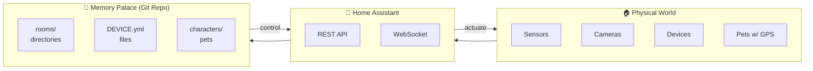

# Home Automation as Memory Palace

**Core Insight**: Your house is already a spatial database. Home Assistant just doesn't know it's a memory palace.

## The Vision

Transform any home automation system into a navigable, intelligent, self-aware space where:
- Every room is a directory you can `cd` into
- Every device is a YAML file with real-time state
- Every pet/person is a character that moves through the space
- The house itself can think, observe, and act



## Directory as Architecture

The filesystem mirrors physical space:

```
rooms/
└── marconistraat-25/            # The address is the root
    ├── ROOM.yml                 # House-level metadata
    ├── front-yard/
    │   ├── ROOM.yml
    │   └── mailbox/
    │       └── DEVICE.yml       # Smart mailbox sensor
    ├── ground-floor/
    │   ├── ROOM.yml
    │   ├── hall/
    │   │   ├── ROOM.yml
    │   │   └── coat-hooks/      # Where keys live
    │   ├── living-room/
    │   │   ├── ROOM.yml
    │   │   ├── sofa/
    │   │   │   └── OBJECT.yml   # Furniture as object
    │   │   └── tv/
    │   │       └── DEVICE.yml   # media_player entity
    │   └── kitchen/
    │       ├── ROOM.yml
    │       ├── fridge/
    │       │   └── DEVICE.yml   # Temperature sensor
    │       └── gas-monitor/
    │           └── DEVICE.yml   # Juho's air quality sensor
    ├── first-floor/
    │   ├── stairs/              # Transition between floors
    │   │   └── ROOM.yml
    │   ├── bathroom/
    │   └── bedrooms/
    ├── second-floor/
    │   ├── don-office/
    │   │   ├── ROOM.yml
    │   │   └── register/        # Heating register
    │   │       └── DEVICE.yml
    │   └── don-bedroom/
    │       └── bathroom/        # En-suite
    ├── roof/
    │   ├── ROOM.yml
    │   ├── access: ladder       # Navigation constraint
    │   ├── solar-panels/
    │   │   └── DEVICE.yml       # Real panel IDs from HA!
    │   └── heat-pump/
    │       └── DEVICE.yml
    └── back-yard/
        ├── ROOM.yml
        ├── garden/
        ├── storage-shed/
        └── tool-shed/
```

## Device Files

Every device knows its Home Assistant identity:

```yaml
# rooms/roof/solar-panels/DEVICE.yml
device:
  name: "Solar Panels"
  type: solar_inverter
  manufacturer: SolarEdge
  model: SE5000H
  serial: "XXXXXXXX"
  
  # Home Assistant integration
  home_assistant:
    entities:
      power: sensor.solaredge_power_production
      energy_today: sensor.solaredge_energy_today
      energy_total: sensor.solaredge_lifetime_energy
      status: sensor.solaredge_status
      
  # Real-time state (synced from HA)
  current_state:
    power_production: 2.4kW
    energy_today: 15.2kWh
    status: producing
    
  # Documentation
  installation_date: 2023-06-15
  warranty_expires: 2033-06-15
  documents:
    - Solar/installation-manual.pdf
    - Solar/warranty-certificate.pdf
    
  maintenance:
    last_cleaned: 2024-09-01
    next_service: 2025-06-15
```

## Cats as Characters

Pets are characters that move through the space:

```yaml
# cats/napoleon.yml
character:
  name: Napoleon
  type: cat
  breed: "Orange Tabby"
  
  # Physical tracking
  collar: home-automation/gps-collars/blue-collar.yml
  current_location: rooms/marconistraat-25/living-room/
  location_history:
    - time: 2026-01-30T14:00:00Z
      room: living-room
      activity: napping
    - time: 2026-01-30T12:30:00Z
      room: kitchen
      activity: eating
      
  # Sims stats (interpreted for cats)
  sims_stats:
    hunger: 65         # Getting peckish
    comfort: 85        # Favorite spot on sofa
    hygiene: 75        # Self-grooming adequate
    bladder: 50        # Litter box trip soon
    energy: 40         # Nap imminent
    fun: 60            # Could use playtime
    social: 35         # Independent cat
    room: 80           # Likes this sunbeam
    
  # Collar integration (two-way link)
  collar_link:
    device: home-automation/gps-collars/blue-collar.yml
    color: blue
    entity_id: device_tracker.napoleon_collar
```

The collar file links back:

```yaml
# home-automation/gps-collars/blue-collar.yml
collar:
  id: tractive_blue_001
  color: blue
  
  # Two-way link to cat
  assigned_to: cats/napoleon.yml
  
  # Home Assistant entity
  entity_id: device_tracker.napoleon_collar
  
  # Current state (synced from HA)
  state:
    battery: 78%
    last_seen: 2026-01-30T14:15:00Z
    latitude: 52.3676
    longitude: 4.9041
    accuracy: 15m
    
  # Zone detection
  zones:
    home: inside
    garden: nearby
```

## Navigation Constraints

Some transitions require conditions:

```yaml
# rooms/marconistraat-25/roof/ROOM.yml
room:
  name: Roof
  type: exterior
  
  access:
    requires: ladder
    from:
      - second-floor/landing (via attic hatch)
      - back-yard (via extension ladder)
    warning: "Requires ladder access. Be careful."
    
  contents:
    - solar-panels/
    - heat-pump/
    
  cameras:
    - Ring side camera has partial view
```

## Integration with Home Assistant

The home-assistant skill drives this like a CLI:

```bash
# Get solar production
HA_TOKEN=$(op item get "Home Assistant" --field token)
curl -s -H "Authorization: Bearer $HA_TOKEN" \
  http://homeassistant.local:8123/api/states/sensor.solaredge_power_production

# Find the cat
curl -s -H "Authorization: Bearer $HA_TOKEN" \
  http://homeassistant.local:8123/api/states/device_tracker.napoleon_collar

# Turn on living room light
curl -X POST -H "Authorization: Bearer $HA_TOKEN" \
  -H "Content-Type: application/json" \
  -d '{"entity_id": "light.living_room"}' \
  http://homeassistant.local:8123/api/services/light/turn_on
```

## Chat Interface

Instead of the Home Assistant web UI, use a chat interface:

```
User: What's the solar production right now?

AI: *checks sensor.solaredge_power_production*
   Currently producing 2.4kW. Today's total: 15.2kWh.
   Status: Producing normally.

User: Where's Napoleon?

AI: *checks device_tracker.napoleon_collar*
   Napoleon is in the living room, near the sofa.
   Battery: 78%. Last position update: 2 minutes ago.
   Based on his patterns, he's probably napping.

User: Turn on the hallway light

AI: *calls light.turn_on for light.hallway*
   Done. Hallway light is now on.

User: What's the gas reading?

AI: *checks sensor.juho_air_quality*
   Gas levels normal: 12 ppm.
   No anomalies detected. The sensor Juho built is working great.
```

This is the dream: natural language interface to your home, backed by the structured memory palace.

## Why This Architecture?

### 1. Documentation IS Configuration
Every YAML file documents the device AND configures the simulation.
Serial numbers, warranty info, maintenance schedules — all in one place.

### 2. Version Control
Git history shows when devices were added, moved, or removed.
"When did we install the heat pump?" → `git log --follow rooms/roof/heat-pump/`

### 3. Portable
Your entire home model is a git repo. 
Move houses? Fork the repo, update the address.

### 4. Collaborative
Family members can PR changes.
"Can I add the new smart plug?" → Open PR, get reviewed, merge.

### 5. AI-Native
The LLM can read YAML, understand spatial relationships, and navigate naturally.
No special API — just files it already knows how to read.

## Industrial Extension

The same pattern works for any physical space:

### Factory Floor
```
rooms/
└── factory-building-a/
    ├── loading-dock/
    │   ├── bay-1/ → forklift-charger/
    │   └── bay-2/
    ├── assembly-line/
    │   ├── station-1/ → robot-arm/
    │   └── quality-checkpoint/ → camera/
    └── warehouse/
        ├── zone-a/ → shelving-unit-001..100/
        └── zone-b/
```

### Hospital Wing
```
rooms/
└── west-wing/
    ├── nurses-station/
    ├── room-101/ → patient-monitor/, iv-pump/
    ├── room-102/
    └── supply-closet/ → inventory/
```

### Ship
```
rooms/
└── cargo-vessel-marconi/
    ├── bridge/
    ├── engine-room/
    ├── hold-1/ → container-tracking/
    └── crew-quarters/
```

## See Also

- `skills/home-assistant/` — The integration skill
- `skills/memory-palace/` — General spatial organization
- `skills/adventure/` — Room navigation mechanics
- `designs/SIMULATION-AS-SERVICE.md` — The larger vision
- `Marconistraat25/` — Working example repo