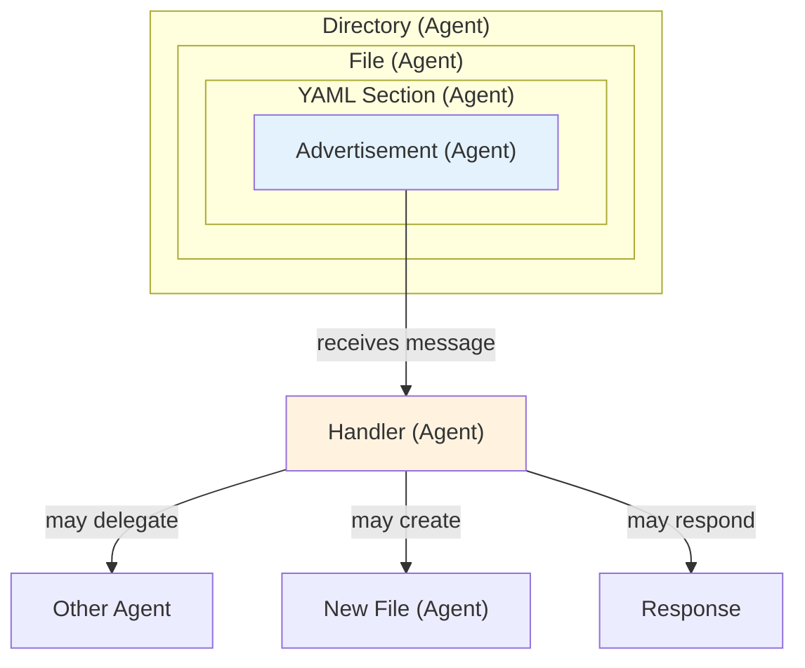
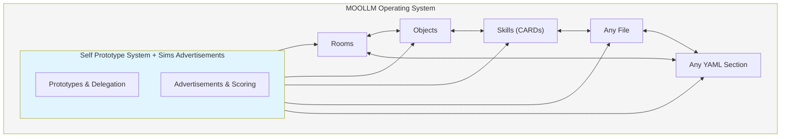
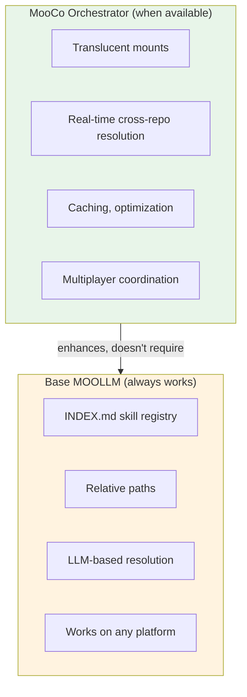

# What MOOLLM Can Learn from MOO and LambdaMOO

> "Every object in the MOO is assigned a number, and may be referred to by this number, prefixed with a #, as well as its name when the user is in the object's presence. Administrators, also known as wizards, who can manage the MOO, and assign certain global names to these objects, which are prefixed with $, a process known as corifying."
> — Wikipedia, MOO

## The Core Problem: Addressing Across Distributed Repos

MOO used **object numbers** (#0, #1, #42) as universal addresses within a single persistent database. This worked brilliantly for a monolithic system but fails immediately in MOOLLM's distributed world:

- Multiple repos (moollm, central, customer repos)
- Multiple workspaces (Cursor, VS Code, Claude Code)
- Cross-repo references that must resolve consistently
- No central authority assigning numbers

MOOLLM's answer: **Paths are the universal address space**.

```
moollm://github/SimHacker/moollm/skills/adventure/CARD.yml
```

This is our equivalent of MOO's `#42` — but it works across repos, is human-readable, and maps cleanly to Git's native addressing, and allows additional namespaces besides github.

## MOO's Addressing Layers (and MOOLLM Equivalents)

### 1. Object Numbers (#42)

**MOO**: Every object gets a unique numeric ID. `#0` is the system object. `#1` is the root class.

**MOOLLM**: Paths replace numbers.
- System object → `kernel/` directory
- Root class → `skills/object/` (the ur-prototype)

**Why paths are better for us**:
- Numbers require a central allocator — impossible across repos
- Paths are self-documenting (`skills/cat/` vs `#7834`)
- Paths survive forks, merges, cross-repo references
- Git already provides content-addressable hashes if we need them

### 2. $Corified Names ($room, $player, $thing)

**MOO**: Wizards assign human-readable global names prefixed with `$`. These are stored in `#0` (the system object) and resolve to object numbers.

```
$room → #3
$player → #6  
$thing → #5
```

**MOOLLM**: Path variables serve this role.

```yaml
$SKILLS  → moollm/skills/
$KERNEL  → moollm/kernel/
$ADVENTURE → examples/adventure-4/  # runtime-bound
```

**Key difference**: MOO's `$` names are **globally unique** (one namespace). MOOLLM's `$` variables support **scoped layering** like Unix `$PATH`:

```yaml
$SKILLS:
  search_path:
    - ./skills/                    # Local repo first
    - moollm://github/SimHacker/moollm/skills/  # Core second
    - moollm://github/community/skills/         # Community third
```

First match wins. This enables **local override** of core skills.

### 3. Parent Chain (→ Root Class #1)

**MOO**: Every object has a parent. Inheritance follows the parent chain up to Root Class (#1).

```
my_cat → $animal → $thing → #1
```

**MOOLLM**: Prototype directories.

```
skills/cat/ → skills/animal/ → skills/character/ → skills/object/
```

The chain is encoded in each skill's `parents:` field — **plural**, because MOOLLM supports **multiple inheritance with modulation**:

```yaml
# skills/cat/CARD.yml — Simple list form
parents:
  - animal      # Primary prototype
  - pet         # Adds domestic behaviors
  - predator    # Hunting instincts
```

```yaml
# skills/linus-torvalds/CHARACTER.yml — Modulated inheritance
parents:

  # Primary personality sources
  - programmer:
      import: [technical-depth, code-review-style]
      modulate: "Finnish directness, no sugarcoating"
      
  - leader:
      import: [delegation, vision-setting]
      exclude: [corporate-speak, HR-friendly]
      modulate: "Benevolent dictator, not consensus-seeker"
      
  # Behavioral modifiers (like giving Linus coffee and a joint)
  - caffeine:                    # Morning Linus
      intensity: 0.8
      effect: "Sharp, impatient, productive"
      
  - thc:                         # Evening Linus  
      intensity: 0.3
      effect: "Reflective, philosophical, still blunt"
      
  # Pure K-line activations (no modulation, just activate)
  - finnish-culture
  - open-source-philosophy
  - kernel-development
```

This is like Python's module imports but for personality/behavior:

```python
# Python analogy
from mit.minsky.marvin import k_lines, society_of_mind
from sims.wright.will import advertisements, needs_system
from self.ungar.david import prototype_delegation  # with modifications
```

The YAML equivalent:

```yaml
parents:
  - minsky:
      import: [k-lines, society-of-mind]
      note: "Memory as K-line activation, mind as agent society"
      
  - sims:
      import: [advertisements, needs]
      exclude: [isometric-graphics]  # We're text-based
      modulate: "Needs drive behavior, ads signal capability"
      
  - self:
      import: [prototype-delegation, slots]
      modulate: "Everything is slots and messages"
```

**Key insight**: Parents can be:
- **Simple K-lines** — just names that activate knowledge
- **Structured imports** — what to take, what to exclude
- **Modulated** — how to adjust the inherited behavior
- **Commented** — YAML Jazz style, the WHY matters

### 4. Presence-Based Naming

**MOO**: Objects can be referred to by name "when the user is in the object's presence."

```
> look at cat
(resolves "cat" to whatever cat object is in the room)
```

**MOOLLM**: **Empathic links** — the LLM resolves names by context.

When you say "the cat skill," the LLM knows you mean `skills/cat/` because:
- You're in a MOOLLM context
- The conversation is about skills
- There's only one `cat` skill

No formal resolver needed. **Context is the resolver.**

## Scoping: A Unified Model

MOOLLM needs multiple scoping mechanisms working together. Here's how they layer:

### Level 1: Local (Directory)

```yaml
./ROOM.yml           # This directory
./guards/entrance.js # Subdirectory
../pub/              # Sibling directory
```

Directory structures are like the **lexical scope** in programming — what's visible from where you stand.

### Level 2: Adventure (Runtime Context)

```yaml
$ADVENTURE/coatroom/     # Resolves to examples/adventure-4/coatroom/
$CHARACTERS/don-hopkins/ # Search list! See below
$PUB/bar/               # $ADVENTURE/pub/bar/
```

Like **closure scope** — values bound at session start, captured in `startup.yml`.

**But `$CHARACTERS` is a search list**, like `$PATH`:

```yaml
$CHARACTERS:
  - $ADVENTURE/characters/           # Adventure-specific first
  - $REPO/characters/                # Repo-level shared characters
  - moollm://github/SimHacker/moollm/examples/adventure-4/characters/  # Core examples
  - moollm://github/community/shared-characters/  # Community contributions
```

When you reference `$CHARACTERS/don-hopkins/`, resolution walks the list. First match wins. This lets adventures override shared characters, repos override community, etc.

### Level 3: Repository (`$REPO` = "me", "self", "this")

```yaml
$REPO/skills/       # This repo's skills
$REPO/kernel/       # This repo's kernel
```

`$REPO` is special — it means **"the repo containing the current object"**. It's the `this`/`self`/`me` of repository context:

- When evaluating `skills/cat/CARD.yml`, `$REPO` = the repo containing that file
- It's always singular — "my repo", not a search list
- Like `self` in Python or `this` in JavaScript — relative to the current context

### Level 4: Core (moollm:// namespace)

```yaml
moollm://github/SimHacker/moollm/skills/character/
moollm://github/SimHacker/moollm/kernel/constitution-core.md
```

Like **global scope** — the shared infrastructure all repos can reference.

### Level 4b: Kernel (`$KERNEL`)

```yaml
$KERNEL/constitution-core.md
$KERNEL/naming/URLS.yml
```

`$KERNEL` is typically **singular** — one kernel, the operating system. But theoretically you could layer kernels (kernel extensions, kernel overrides). Go girl!

### Level 5: External (Other Repos)

```yaml
moollm://github/customer/their-adventure/characters/
moollm://github/community/shared-animals/
```

Like **import scope** — explicit references to other packages.

### Level 6: Empathic (LLM-Inferred)

```
"the schema mechanism skill"
"Don's character"
"that room we were just in"
```

No formal syntax. **The LLM figures it out.** This is MOOLLM's superpower.

## The Self-Like Microcode of Pointers

Can we build all addressing from a small set of primitive operations?

### Primitive Operations

```yaml
primitives:

  resolve:
    signature: "resolve(path) → object"
    description: "Find object at path, traversing search paths"
    examples:
      - "resolve('$SKILLS/cat/') → skills/cat/"
      - "resolve('./guards/') → ./guards/"
    
  inherit:
    signature: "inherit(parents, modulations) → merged_prototype"
    description: "Merge multiple parents with modulation"
    examples:
      - "inherit([animal, pet, predator]) → merged traits"
      - "inherit({programmer: {import: [code-review], modulate: 'blunt'}}) → selective import"
    
  advertise:
    signature: "advertise(name, score) → advertisement"
    description: "Make capability discoverable with priority"
    example: "advertise('hunt_mouse', 0.9)"
    
  scope:
    signature: "scope(level) → namespace"
    description: "Return namespace at scoping level"
    levels: [local, adventure, repo, core, external]
    
  search:
    signature: "search(pattern, scopes) → [objects]"
    description: "Find all matching objects across scopes"
    example: "search('cat-*', [local, repo, core])"
```

### Everything Else Compiles Down

```yaml
# $SKILLS/cat/ compiles to:
resolve(
  search('cat', [
    scope('repo') + '/skills/',
    scope('core') + '/skills/'
  ])
)

# prototype: $SKILLS/animal/ compiles to:
inherit(resolve('$SKILLS/animal/'))

# "the cat skill" compiles to:
empathic_resolve('cat skill', context)
# → LLM infers: resolve('$SKILLS/cat/')
```

This is like Self's **slots and delegation** — everything reduces to:
- **Slots** = named references (paths)
- **Delegation** = prototype chain (inherit)
- **Messages** = resolution (resolve + advertise)

## The Universal Foundation: Not Just for Skills

**Critical architectural point**: Prototypes and advertisements are the **operating system layer**, not skill-specific features.

### Advertisements Are Everywhere

Skills have CARD files with advertisements — that's how skills work. But **any object, file, or even YAML section can have advertisements**:

```yaml
# A room can advertise
# examples/adventure-4/pub/ROOM.yml
advertisements:
  - name: "enter_pub"
    score: 0.8
    triggers: [drink, socialize, relax, cat]
    effect: "Teleport player to pub"

# A character can advertise
# characters/cat-whiskers/CHARACTER.yml  
advertisements:
  - name: "pet_cat"
    score: 0.6
    triggers: [pet, comfort, cute]
    effect: "Increase player mood, cat purrs"
    
  - name: "hunt_mouse"
    score: 0.9
    triggers: [mouse, hunt, predator]
    condition: "mouse_present"
    effect: "Cat stalks and pounces"

# A section of YAML can advertise inline
inventory:
  magic_sword:
    damage: 25
    advertisements:  # Embedded right here!
      - name: "attack_with_sword"
        score_boost: 0.3  # Adds to base attack score
        triggers: [combat, fight, monster]
```

Advertisements are like **event handlers** — but the "event" doesn't have to be reified:

```yaml
# The "event" can be:
- A word in chat           # "feed the cat" triggers hunt_mouse
- A concept                # Player feels lonely → pet_cat scores higher
- A delegated method       # Another skill routes a message here
- A need state             # Hunger > 0.7 activates food-related ads
- Just... a message        # No file, no YAML, just intent
```

**The handler can CHOOSE to materialize the event** — or not:

```yaml
# Advertisement as agent deciding what to do with the message
advertisements:
  - name: "receive_order"
    triggers: [order, command, request]
    handler: |
      # Option 1: Just respond (no file created)
      respond: "Order acknowledged"
      
      # Option 2: Materialize as YAML Jazz in same directory
      create_file: "./orders/{timestamp}-{order_id}.yml"
      schema: "$SKILLS/order/schemas/order.yml"
      
      # Option 3: Route to inbox subdirectory
      create_file: "./inbox/{timestamp}-{sender}.yml"
      
      # Option 4: Delegate to another skill
      delegate: "$SKILLS/order-processing/handle"
      
      # Option 5: Multiple dispatch (fan out)
      dispatch:
        - "$SKILLS/logging/record"
        - "$SKILLS/notification/alert"
        - "./local-handler.yml"
```

**An advertisement is a lexically scoped agent** — bound to its directory context, receiving messages, deciding what to do. It's like a closure that:
- Captures its environment (the directory, the object's state)
- Responds to patterns (triggers)
- Can create side effects (files, messages, state changes)
- Or just returns a value

### Agents All The Way Down



Every advertisement is a mini-agent. Every file containing advertisements is an agent. Every directory containing files is an agent. **Agents composed of agents**, just like Minsky's Society of Mind.

This connects to:
- **Minsky's Society of Mind** — mind as society of simple agents
- **The Actor Model** — everything is message passing (Hewitt, Agha)
- **Self's message sends** — objects respond to messages
- **Erlang's processes** — lightweight agents all the way down
- **The Sims' autonomy** — every Sim is an agent selecting actions

The filesystem IS a distributed agent system. Messages flow. Handlers respond. State emerges.

### Skills Are Just Directories (That Happen to Have CARDs)

Skills aren't special. They're directories that:
1. Have a `CARD.yml` (interface/advertisements)
2. Have a `SKILL.md` (detailed protocol)
3. Inherit from the same prototype system everything uses

**Anthropic skills embedded in MOOLLM gain all the nice things** that every directory and file already inherits:
- Prototype inheritance (from `parents:`)
- Advertisement discovery
- Path variable resolution
- Empathic linking

We didn't invent (or steal) prototypes and advertisements **just for skills**. They're for **everything**:



**Everything composes with everything else. Not just skills with skills.**

### Skills Nested in Skills, Ads Nested in Ads

Skills can contain sub-skills. Rooms can contain rooms. Objects can contain objects. And **advertisements can be anywhere in any of them**:

```yaml
# A skill containing nested skills with their own ads
skills/adventure/
├── CARD.yml           # Adventure skill's own advertisements
├── room/              # Sub-skill: room management
│   ├── CARD.yml       # Room sub-skill's advertisements
│   └── guard/         # Sub-sub-skill: room guards
│       └── CARD.yml   # Guard advertisements
└── character/         # Sub-skill: character in adventure context
    └── CARD.yml       # Character-in-adventure advertisements
```

Each level can advertise. Each level inherits from parents. **Composition is universal**.

### The Sims + Self = MOOLLM's DNA

| Concept | Origin | In MOOLLM |
|---------|--------|-----------|
| Prototypes | Self (Ungar) | Every directory can have `parents:` |
| Slots | Self | Every file is a slot in a directory |
| Delegation | Self | Resolution walks parent chain |
| Advertisements | The Sims (Wright) | Any object can advertise capabilities |
| Dithering | The Sims | Top-N + random for organic selection |
| Needs/Motives | The Sims | Context scores advertisements |

These aren't skill-specific features. They're the **microcode** everything runs on.

## Corifying in a Distributed Multi-Repo World

MOO's corifying: Wizards register global names in `#0`.

MOOLLM's equivalent: **The kernel is the shared core.**

```
moollm://github/SimHacker/moollm/kernel/  # The "$0" equivalent
moollm://github/SimHacker/moollm/skills/  # Corified skill namespace
```

### What Gets Corified?

| MOO | MOOLLM |
|-----|--------|
| `$room` | `$SKILLS/room/` |
| `$player` | `$SKILLS/character/` |
| `$thing` | `$SKILLS/object/` |
| `#0` system object | `kernel/` AND `world` parameter |
| `#1` root class | `skills/object/` |

### The `world` Parameter: `$0` as Closure Argument

In both the Python server and JavaScript browser runtimes, **all generated closures take `world` as their first argument**:

```python
# Python server — generated _py functions
def check_unlock_condition_py(world):
    return world.subject.has_item('red-key') and not world.flags.alarm_triggered
```

```javascript
// JavaScript browser — generated _js functions  
function check_unlock_condition_js(world) {
    return world.subject?.hasItem('red-key') && !world.flags.alarm_triggered;
}
```

**`world` is the root of everything** — like MOO's `#0`:

```yaml
world:
  room: "Current room object"
  character: "Current character"
  skills: "Skill registry"
  subject: "Me, I — the acting entity"
  object: "It, this — the target of action"
  flags: "Global state flags"
  history: "Event log"
```

One parameter. One root. Robustly accessible everywhere.

### Local Corifying

Each repo can have its own "corified" names that shadow or extend the core:

```yaml
# In customer-repo/startup.yml
local_core:
  $SKILLS: 
    - ./skills/           # Local skills first
    - moollm://github/SimHacker/moollm/skills/  # Core fallback
  
  $ROOM: ./skills/room/   # Override core room skill
```

### Cross-Repo Corifying

MooCo (the planned MOOLLM orchestrator) could maintain a global registry:

```yaml
# mooco://registry/corified
$leela-cat: moollm://github/SimHacker/moollm/skills/cat/
$community-cat: moollm://github/community/skills/cat/
```

But this is **optional** — most resolution is local or empathic.

## Dithering for Object Selection

Connecting to The Sims' advertisement dithering (from the demo transcript):

When an LLM needs to choose which object/skill to use:

1. Collect all **advertisements** from available objects
2. Score them by relevance to current context
3. Take top N candidates
4. **Pick randomly** from top tier -- or **magically** (see the Cosmic Dealer in Fluxx)

This prevents robotic "always pick optimal" behavior and leaves room for discovery.

```yaml
# Pseudo-algorithm
candidates = search('*', [local, adventure, repo, core])
scored = candidates.map(c => [c, score(c, context)])
top_n = scored.sort_by_score().take(3)
selected = random_choice(top_n)  # Dithering!
```

## Summary: MOO → MOOLLM Translation

| MOO Concept | MOOLLM Equivalent |
|-------------|-------------------|
| Object numbers (#42) | File paths |
| $corified names | Path variables ($SKILLS, $ADVENTURE) |
| #0 system object | kernel/ directory |
| #1 root class | skills/object/ |
| Parent chain (single) | `parents:` list (multiple inheritance with modulation) |
| Presence-based naming | Empathic links (LLM context resolution) |
| Single database | Distributed repos |
| Wizards | Kernel maintainers |
| Toading/Newting | Git revert (softer!) |

## The Deeper Problem: Location-Independent Skills

The `$SKILLS` path variable is a step, but not enough. Real requirements:

### Skills Must Be Location-Independent

Skills can't be tied to a flat `skills/` directory:
- Skills need **subdirectory organization** (categories, domains)
- Skills can **contain sub-skills** in arbitrary nested structures  
- Skills need **symbolic names** that resolve to arbitrary paths
- The same skill might exist at different paths in different repos

### Character Overlays: Public/Private/Adventure Layers

A character (or any object) can exist in **multiple layers** across repos:

```yaml
# Layer 1: Public core (moollm repo)
moollm/examples/adventure-4/characters/real-people/don-hopkins/
  CHARACTER.yml    # Public persona, curated for publication

# Layer 2: Adventure-specific instance (inherits from core)
moollm/examples/adventure-4/pub/regulars/don-hopkins/
  CHARACTER.yml    # Adventure-specific behaviors
  parents: [$CHARACTERS/real-people/don-hopkins/]

# Layer 3: Private overlay (DonHopkins repo)
DonHopkins/characters/don-hopkins/
  CHARACTER.yml    # Private notes, contacts, unfiltered content
  overlay: true    # Signals this layers on top of public
```

**The LLM decides precedence** based on context:
- Public context → use public layer
- Private context → merge private overlay
- Adventure context → use adventure-specific instance

**Moving information between layers** (like git for filesystems):
- Sanitize private → public (curate for publication)
- Pull adventure-specific → core (generalize patterns)
- Push core → adventure (customize instance)
- Just move files between directories and repos

This is **git-native** — the same tools that edit filesystems and histories apply to character/object management.

### Skill Linking: Import, Remap, Sandwich

Skills need to be **importable and remappable** — like a linker for code:

```yaml
# Importing skills from other collections
imports:
  
  # Trusted MOOLLM skill — use as-is
  - skill: moollm://github/SimHacker/moollm/skills/adventure/
    as: adventure
    
  # Anthropic skill — sandwich with a CARD wrapper
  - skill: anthropic://skills/code-review
    as: code-review
    wrapper: ./wrappers/code-review-card.yml  # Generated CARD
    
  # Untrusted community skill — remap names for isolation
  - skill: moollm://github/community/skills/sketchy-thing/
    as: sandboxed-sketchy
    remap:
      original_name: sandboxed_sketchy  # Make K-lines unique
      inject_context: "⚠️ UNTRUSTED SKILL"
```

**The Sandwich Pattern** for base Anthropic skills:

```yaml
# wrappers/code-review-card.yml — Generated wrapper
# Makes a plain Anthropic skill work with MOOLLM conventions

card:
  name: code-review
  type: [skill, imported, anthropic]
  
  # Map MOOLLM triggers to Anthropic skill file
  advertisements:
    - name: review_code
      triggers: [review, code review, PR]
      delegate:
        file: anthropic://skills/code-review.md  # Original skill
        remap_names:
          code: $SUBJECT      # Map Anthropic terms to MOOLLM
          review: $ACTION
          
  # Override K-lines to avoid collision
  k_line_prefix: "anthropic-code-review-"
```

**Why remapping matters:**
- **Namespace isolation** — multiple skills can use same internal names
- **K-line uniqueness** — assembled world has unique activators
- **Trust boundaries** — untrusted skills can't hijack K-lines
- **Composition** — layer skills without conflict

This is like a **linker** in traditional compilation:
- Resolve symbols across modules
- Handle name collisions
- Apply relocations
- Produce unified output

This means: **skill name → path** must be a managed registry, not filesystem convention.

```yaml
# Symbolic skill registry (conceptual)
skills:
  adventure: 
    path: skills/adventure/
    why: "Text adventure framework, room/object/character architecture"
    triggers: [adventure, room, mud, moo, text game]
    
  cat:
    path: skills/animal/cat/           # Nested under animal/
    why: "Feline character behaviors"
    triggers: [cat, meow, feline, pet]
    
  fluxx-chaos:
    path: skills/experiment/experiments/fluxx-chaos/  # Deep nesting
    why: "Card game experiment framework"
    triggers: [fluxx, card game, chaos]
```

### $VARS as Prioritized Search Paths

Think of `$SKILLS` not as a single path but as a **search list** — like:
- Unix `$PATH` (prioritized directory search)
- Self's parent slots (delegation chain)
- Union/translucent filesystem mounts (overlay directories)

```yaml
$SKILLS:
  - ./skills/                              # Local repo (highest priority)
  - ./vendor/skills/                       # Vendored dependencies
  - moollm://github/SimHacker/moollm/skills/  # Core
  - moollm://github/community/shared-skills/   # Community
```

Resolution: walk the list, first match wins. Just like Self delegation.

### MooCo Orchestrator: Translucent Mounts

When running under MooCo, we can virtualize a **unified filesystem** that:
- **Layers** multiple repo sections over the same virtual path
- **Combines** skill directories from multiple sources
- Provides **translucent mounts** (changes write to top layer, reads merge all layers)

```
Virtual filesystem (MooCo view):
/skills/
  ├── adventure/      # from moollm core
  ├── cat/            # from moollm core
  ├── custom-cat/     # from local repo (shadows nothing, adds)
  └── adventure/      # from local repo (shadows core adventure/)
      └── custom-rooms/  # local extension
```

This is like Docker's layered filesystem, or Plan 9's union directories.

### Platform-Agnostic Degradation

Critical constraint: **MOOLLM must run on any platform** — Cursor, Claude Code, VS Code, bare terminal.

When MooCo isn't available, the system must degrade to:
1. **A skill INDEX file** that maps names → paths → descriptions
2. **Markdown over YAML** for the index (more compact, narrative relationships)
3. **Relative paths** that work in any checkout

```markdown
<!-- skills/INDEX.md — works without any runtime -->

## Core Skills

### adventure
**Path:** `./adventure/`  
**Triggers:** adventure, room, text game, MUD, MOO  
**Why:** Text adventure framework. Rooms are directories, objects are YAML.
Inherits from: simulation. Used by: any interactive fiction.

### character  
**Path:** `./character/`
**Triggers:** character, NPC, player, persona
**Why:** Base prototype for all characters. Personality, memory, dialogue.
Inherits from: object. Extended by: animal, person, fictional.

### cat → animal → character → object
**Path:** `./animal/cat/`
**Triggers:** cat, feline, meow, pet
**Why:** Feline behaviors. Hunting, sleeping, demanding attention.
The prototype chain shows inheritance.
```

This INDEX.md:
- Works as documentation (humans read it)
- Works as LLM context (compact, narrative)
- Lists activation triggers (when to load)
- Shows relationships (inherits from, extended by)
- Needs no runtime — just text

### The Two-Layer Architecture



MOOCO **optimizes** but doesn't **require**. The base layer always works.

## Open Questions

Many of these are addressed in the **mooco** repo design documents!

1. **Content addressing**: Should MOOLLM support git commit hashes as version pins?
   ```
   moollm://github/SimHacker/moollm@abc123/skills/cat/
   ```
   → See: `mooco/designs/MOOCO-REPOS.md` — moollm:// namespace, MOOT resolver

2. **Empathic link caching**: Can we cache LLM-resolved references for performance?
   → See: `mooco/designs/MOOCO-SKILL-SYSTEM.md` — CG (Context Gatherer), k-line heat, K-CACHE.yml

3. **Cross-repo permissions**: How do we handle private repos? OAuth? Tokens?
   → See: `mooco/designs/MOOCO-REPOS.md` — workspace.yml, git credential handling

4. **Conflict resolution**: When two repos define `skills/cat/`, which wins beyond search order?
   → See: `mooco/designs/MOOCO-SKILL-MANAGER.md` — skill namespacing, k-line prefixes

5. **Live linking**: Can MooCo provide real-time cross-repo references like MOO's networked SunNET?
   → See: `mooco/designs/MOOCO-REPOS.md` — MOOT tool for git tree reification

6. **INDEX format**: Markdown vs YAML for skill registries?
   → The CG uses K-CACHE.yml for machine-readable, CARD.yml for LLM-readable, INDEX.md for humans.
   → See: `mooco/designs/MOOCO-SKILL-SYSTEM.md` — Treasure Collector architecture

7. **Skill containment**: When a skill contains sub-skills, how do we represent that in the registry?
   → See: `mooco/designs/MOOCO-SKILL-MANAGER.md` — safe skill invocation, nested skills

8. **Translucent mount semantics**: When layering repos, what happens on write?
   → See: `mooco/designs/MOOCO-REPOS.md` — mount semantics, .moot/ scaffolding

## Academic Research: Presence in Text-Based Virtual Environments

Research has validated that text-based virtual environments create genuine feelings of presence:

> **69% of 207 MUD users felt a sense of presence** in purely text-based environments.
> — Towell & Towell (1997), "Presence in Text-Based Networked Virtual Environments or 'MUDS'"

Key findings from this LambdaMOO-based study:

| Factor | Finding |
|--------|---------|
| **Presence rate** | 69% of users reported feeling "actually being in the same room with others" |
| **Social dependency** | Presence was "dependent on whom they were with" |
| **Spatial metaphor** | Room-based navigation creates mental models |
| **Interactivity** | Social interaction and "flow" states contribute to presence |
| **No graphics needed** | Text alone sufficient for presence when social + spatial elements present |

This research validates MOOLLM's approach:
- **Rooms as directories** — The spatial metaphor matters
- **Characters as social entities** — Presence is socially-driven
- **Text as medium** — LLMs generating text can create presence, not just information

The paper acknowledges Pavel Curtis and the MOO-cows community. The researchers used LambdaMOO (Groups IV-VI) alongside professional conferences (BioMOO) and educational settings.

**Reference:**
Towell, J., & Towell, E. (1997). Presence in Text-Based Networked Virtual Environments or "MUDS". *Presence: Teleoperators and Virtual Environments*, 6(5), 590-595. [Archived](http://www.fragment.nl/mirror/various/Towell_et_al.1997.Presence_in_MUDs.htm)

## The MOO* Namespace Family

From `mooco/designs/MOOCO-REPOS.md`:

| Name | Expansion | Role |
|------|-----------|------|
| **MOO** | Microworld Object Ontology | The core concept |
| **MOOLLM** | MOO + LLM | Skills, rooms, characters for LLMs |
| **MOOCO** | MOO Coordinator/Orchestrator | Orchestrates repos, skills, sessions |
| **MOOT** | MOO Tree | Git tree reification tool |

> *"The point is moot, but the files are real."* — MOOT tagline

## See Also

### In moollm repo
- `kernel/ARCHITECTURE.md` — Agents All The Way Down (foundational section)
- `kernel/naming/URLS.yml` — moollm:// URI scheme
- `kernel/naming/NAMING-PATH-VARIABLES.yml` — $SKILLS, $ADVENTURE
- `kernel/naming/NAMING-K-LINES.yml` — Virtual parents, naming patterns
- `skills/advertisement/CARD.yml` — The Sims-style advertisement system
- `designs/LEELA-MOOLLM-DEMO-TRANSCRIPT.md` — Demo covering these concepts

### In mooco repo
- `designs/README.md` — MOOCO overview, reading order
- `designs/MOOCO-ARCHITECTURE.md` — High-level architecture
- `designs/MOOCO-SKILL-SYSTEM.md` — CG (Context Gatherer), Treasure Collector
- `designs/MOOCO-SKILL-MANAGER.md` — Safe skill invocation, Anthropic import
- `designs/MOOCO-REPOS.md` — Multi-repo mounting, MOOT tool
- `designs/MOOCO-MEMORY.md` — Three-tier memory: ephemeral, persistent, reflective
