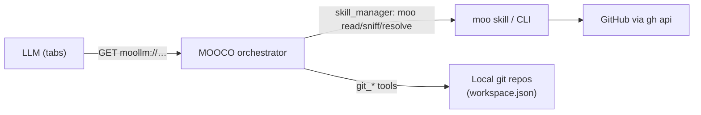
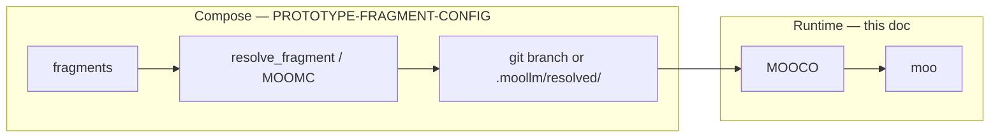
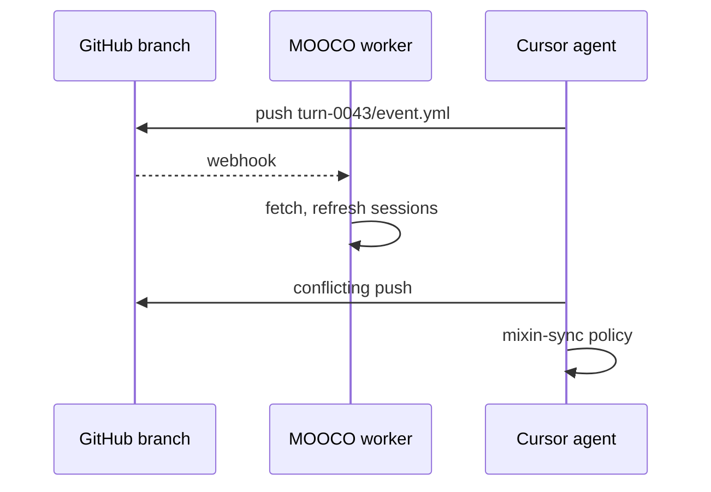

# MOOCO + Moo VM — Runtime Integration

**Status:** Public design (May 2026)  
**Scope:** **Runtime** — moo fetch, MOOCO sessions, hosted worlds, worker sync. Compose-time fragments → [PROTOTYPE-FRAGMENT-CONFIG.md](PROTOTYPE-FRAGMENT-CONFIG.md). Wire protocol → [MOOCO-MOO-CUSTOM-ORCHESTRATOR.md](MOOCO-MOO-CUSTOM-ORCHESTRATOR.md).  
**Implementation:** The **moo** skill ships today in `skills/moo/`. MOOCO orchestrator wiring is partial.  
**Read first:** [MOOCO-MANIFESTO.md](MOOCO-MANIFESTO.md)

---

## The alignment

MOOCO's browser/server metaphor was always about **stable URLs**, **partial fetch**, and **tabs** — not about inventing a new HTTP stack.

The **moo** skill is the working implementation of that client side:

| MOOCO concept | moo skill (today) |
|---------------|-------------------|
| `GET moollm://…` | `moo read <moorl>` |
| Partial fetch / HEAD | `moo sniff`, `moo card`, `moo glance`, fragment `#key`, `-L` lines |
| URL resolution | `moo resolve <moorl>` |
| Open many tabs | `moo focus` (attention-tree overlay), `moo batch-glance` |
| Browse tree | `moo ls`, `moo tree` |
| Session cache | `.moollm/skills/moo/cache/` (per repo/branch/path) |

**Moorl** — MOO URL. Schemes: `moo://` (repo from env) and `moollm://` (full address). See [skills/moo/MOONUAL.md](../skills/moo/MOONUAL.md).

MOOCO orchestrator = **server** that can invoke moo (via `skill_manager` or sister scripts), persist traces, enforce policy.  
Moo CLI = **browser engine** usable directly in a shell — including Cursor running `python skills/moo/moo.py …` turn by turn.

They compose; neither replaces the other.

---

## What ships: the moo skill

**Location:** `skills/moo/` — entry `moo.py`, logic in `lib/` and `lib/commands/`, tests in `tests/`.

**Model** (from [moocroworld](../skills/moocroworld/)): GitHub **branches as objects** (`Issue_42`, `Character_Don`). Files on the branch are object state. `gh api` is the transport — no local clone required for read/browse.

**Config:** `REPOS.yml` lives in **moocroworld** (mooniverse aliases). Override with `MOO_REPOS_FILE`. Cache under `MOOLLM_WORKSPACE/.moollm/skills/moo/cache/`.

**Commands:** `repos`, `resolve`, `ls`, `tree`, `read`, `sniff`, `glance`, `card`, `scan`, `write`, `rm`, `batch-glance`, `focus`, `summarize`.

**Quick start:**

```bash
cd /path/to/moollm
python skills/moo/moo.py repos
python skills/moo/moo.py resolve 'moollm://SimHacker/moollm/main/skills/moo/CARD.yml'
python skills/moo/moo.py read 'moollm://SimHacker/moollm/main/skills/moo/SKILL.md'
python skills/moo/moo.py sniff 'moollm://SimHacker/moollm/main/skills/moo/lib/cli.py' --depth structure
```

Dense LLM reference: [skills/moo/MOOGLANCE.md](../skills/moo/MOOGLANCE.md). Full manual: [MOONUAL.md](../skills/moo/MOONUAL.md).

---

## MOOPMAP: semantic mipmap (related, local)

[MOOPMAP.md](MOOPMAP.md) and `skills/moollm/scripts/moopmap.py` measure the **GLANCE → CARD → SKILL → README** compression pyramid on a **local checkout**. That is the resolution ladder moo climbs at fetch time:

```text
moo glance / card     → resolution 0–1 (MOOPMAP levels)
moo read full file    → resolution 2–3
moo sniff --skeleton  → structural HEAD without values
moo focus overlay     → batch load by depth (attention tree)
```

Moo fetches remotely; moopmap analyzes locally. Same pyramid, different substrate.

---

## How MOOCO should use moo



### Orchestrator mapping (target wiring)

| Orchestrator request | moo invocation | Notes |
|---------------------|----------------|-------|
| `GET moollm://repo/branch/path` | `moo read <moorl>` | Full representation |
| `HEAD …/CARD.yml` | `moo card` or `read` + path | Card-only, no full SKILL.md |
| `GET …#payload/key` | `moo read` with fragment or `-k` | Fragment drill |
| `GET …?sniff` (future) | `moo sniff --depth glance` | Structural partial |
| Resolve before fetch | `moo resolve` | Audit trail in session |
| Multi-resource session | `moo focus <overlay.yml>` | Attention tree = tab batch |

Every invocation should carry **`--why`** (moo accepts it; orchestrator mandates it on tools).

### Two valid runtimes today

1. **Shell/browser loop** — Agent or human runs moo CLI repeatedly. Cache warms across invocations. No MOOCO required.
2. **MOOCO session** — Orchestrator streams SSE, calls moo sisters through `skill_manager`, logs what was fetched. Same moo binary, audited wrapper.

---

## What MOOCO still adds (not in moo alone)

| Concern | Owner |
|---------|--------|
| Moorl fetch, sniff, focus | **moo** (implemented) |
| K-line heat, skill_manager policy | **MOOCO** |
| Session traces, `--why` audit | **MOOCO** |
| Local multi-repo path map | **mooco** `workspace.json` + `git_*` tools (stub) |
| Shadow overlays (GRANT/AFFLICT) | **MOOFS** ([MOOFS-DESIGN.md](MOOFS-DESIGN.md)) |
| Local disk reification (symlink mounts) | **MOOT** (future — [private MOOKIE sketch](../../mooco/designs/MOOKIE.md)) |

Moo solves **remote virtual filesystem** over GitHub. MOOT/MOOKIE (when built) solves **local tree composition**. MOOFS solves **which layer wins**. MOOCO holds the session together. Fragment **compose** → [PROTOTYPE-FRAGMENT-CONFIG.md](PROTOTYPE-FRAGMENT-CONFIG.md). Namespace table → [MOOCO-MANIFESTO.md](MOOCO-MANIFESTO.md).

---

## Compose → runtime handoff



MOOCO **loads** resolved output; it does **not** walk `parents:` at request time. Cursor-only: skip MOOCO, run `moo` in a shell loop.

---

## Hosted worlds — branch timelines on GitHub

Microworld state **exists** as files on a `ClassName_ObjectID` branch ([moocroworld](../skills/moocroworld/SKILL.md) — canonical naming). MOOMC or agents **commit** there; MOOCO and moo **read/serve** there.

```text
moollm://SimHacker/moollm/World_SunnyStreet/timeline/turn-0042/event.yml
moo://World_SunnyStreet/rooms/town-square/state.yml   # local VM view
```

| Mode | How |
|------|-----|
| **Local simulation** | Cursor + `moo read`/`write`; no published MOOCO |
| **Hosted** | `target-hosted-*` fragment + published MOOCO + `mixin-auth-*` |
| **Virtual hosting** | One MOOCO, many worlds — each `target-*` names branch + moorl root |

### Published endpoint

Resolved `target-hosted-*` exposes MOOCO on the web (auth via `mixin-auth-*` fragment):

```text
https://worlds.example.com/sunny-street/v1/GET moollm://…/rooms/town-square
https://worlds.example.com/sunny-street/v1/INVOKE skill/adventure/enter-room
```

Remote LLMs, users, and federation peers use the same GET/INVOKE protocol ([orchestrator doc](MOOCO-MOO-CUSTOM-ORCHESTRATOR.md)). Branch history = audit log; `--why` = session log.

---

## Workers — subscribe, pull, refresh

Orchestrators, Cursor agents, indexers, and federation peers **watch branches** (declared in fragment `watch:` — see [PROTOTYPE-FRAGMENT-CONFIG.md](PROTOTYPE-FRAGMENT-CONFIG.md)).

**On GitHub `push` to watched branch:**

```text
NOTIFY → FETCH (invalidate moo cache) → PULL/merge → re-resolve if config changed
→ MOOCO refresh sessions → COMMIT local overlay merges if any
```

Git commits **are** pub/sub for read-mostly worlds. Webhooks or `moo fetch` poll.

---

## Multi-agent sync — therein lies the rub

Git coordinates **files**, not **live cognition**. Parallel writers on one `World_*` branch will conflict.

Fragment `mixin-sync-*` selects policy (declared at compose, executed at runtime):

| Mixin | Pattern |
|-------|---------|
| `mixin-sync-append-timeline` | `timeline/turn-NNNN/` append-only; rare conflicts |
| `mixin-sync-single-writer` | MOOCO batches commits; others read-only |
| `mixin-sync-llm-merge` | Auto-merge YAML; `Conflict_*` branch on failure |
| + `Session_*` fork | Per-actor branch off `World_*`; merge up later |

Honest extras: file leases (`locks/`), LambdaMOO-style `signals/` notify, federation peers owning separate branches linked by moorls.



---

## Runtime implementation phases

| Phase | Deliverable |
|-------|-------------|
| **R1** | MOOCO loads `.moollm/resolved/` at session start |
| **R2** | `target-hosted-*` — publish MOOCO + auth mixin |
| **R3** | Branch timeline read/write for remote LLMs / federation |
| **R4** | Webhook `watch` loop; `mixin-sync-*` execution |

Compose phases → [PROTOTYPE-FRAGMENT-CONFIG.md](PROTOTYPE-FRAGMENT-CONFIG.md).

---

## Private mooco repo alignment

The orchestrator prototype (`apps/mooco/`) today has:

- `~/.mooco/workspace.json` — name → absolute path for **local** repos
- `@moollm/tools-git` — scoped git operations

It should **delegate remote `moollm://` to the moo skill**, not reimplement URL parsing. See [mooco/designs/MOOCO-REPOS.md](../../mooco/designs/MOOCO-REPOS.md) and [MOOKIE.md](../../mooco/designs/MOOKIE.md) for the trimmed private sketches.

---

## Document map

| Document | Scope |
|----------|-------|
| [MOOCO-MOO-VM.md](MOOCO-MOO-VM.md) | **This file** — runtime: moo, hosted worlds, workers |
| [PROTOTYPE-FRAGMENT-CONFIG.md](PROTOTYPE-FRAGMENT-CONFIG.md) | Compose: fragments, MOOMC, merge |
| [MOOCO-MANIFESTO.md](MOOCO-MANIFESTO.md) | Vision + namespace |
| [MOOCO-MOO-CUSTOM-ORCHESTRATOR.md](MOOCO-MOO-CUSTOM-ORCHESTRATOR.md) | GET/INVOKE protocol |
| [skills/moo/MOONUAL.md](../skills/moo/MOONUAL.md) | Moo CLI reference |
| [skills/moocroworld/SKILL.md](../skills/moocroworld/SKILL.md) | Branch-as-object model |
