# MOOLLM MANIFESTO

> *[Skills](../skills/) are programs. The LLM is `eval()`. The filesystem is the world.*

---

## The Problem

You can't see inside your LLM agent.

It claims to "remember" — but where? You can't read that memory. It "plans" — but how? You can't inspect those plans. It crashes when data is missing. You debug by guessing.

**This is insane.**

And there's a deeper problem: **one voice is the wrong voice**.

When you ask "Should I take this client?", a single LLM gives you the statistical center of all possible viewpoints. Hedged. Cautious. Anodyne. The centroid of the cloud, not the shape of the cloud.

**Maya** would say: "Trap. Their scope creep is a red flag."
**Frankie** would say: "The opportunity! The growth!"
**Vic** would say: "Show me the financials."

But the single-voice LLM smooths all these into one bland answer.

---

## The Vision

**The filesystem is a microworld.** (We call it a *moocroworld* — because MOO heritage + micro + moo sounds funnier.)

Directories are **[rooms](../skills/room/)** you enter and exit. Files are **objects** you examine and use. Characters are **[cards](../skills/card/)** you summon. The LLM doesn't just read files — it **navigates a [memory palace](../skills/memory-palace/)**, goes on **[adventures](../skills/adventure/)**, talks to **[characters](../skills/character/)**, learns **[skills](../skills/skill/)**.

```mermaid
flowchart LR
    subgraph WORLD["🌍 FILESYSTEM = WORLD"]
        DIR[📁 Directories] --> ROOMS[🚪 Rooms]
        FILES[📄 Files] --> OBJECTS[🔮 Objects]
        YAML[📋 YAML] --> STATE[💾 State]
    end
    
    subgraph LLM["🧠 LLM = EVAL"]
        SKILLS[📚 Skills] --> PROGRAMS[⚡ Programs]
        NAMES[🏷️ Names] --> KLINES[🔗 K-lines]
    end
    
    WORLD --> INSPECTABLE[👁️ INSPECTABLE<br/>by human AND LLM]
    LLM --> INSPECTABLE
    
    style INSPECTABLE fill:#4caf50,stroke:#2e7d32,stroke-width:3px
```



And because it's all [files](../skills/plain-text/) — **you can see everything**. Open `hot.yml` to see what's loaded. Read `PLAN.yml` before it runs. Replay the [adventure](../skills/adventure/) in the [session log](../skills/session-log/). **The magic is inspectable.**

---

## The Seven Innovations

We extend [Anthropic's skill model](https://docs.anthropic.com/en/docs/build-with-claude/prompt-engineering/prompt-library) with seven innovations:

| # | Innovation | What It Means | Proof |
|---|------------|---------------|-------|
| 1 | **[Instantiation](../skills/incarnation/)** | Skills clone into living directories | [`adventure/`](../skills/adventure/) → [`adventure-4/`](../examples/adventure-4/) with 150+ files |
| 2 | **[Multi-Tier Persistence](../skills/honest-forget/)** | Platform → Narrative → State → MOO-Maps (GLANCE/CARD/SKILL/README/examples/templates/source) | [6000+ line session log](../examples/adventure-4/characters/real-people/don-hopkins/sessions/marathon-session.md) |
| 3 | **[K-lines](../skills/k-lines/)** | Names activate conceptual clusters | "[Palm](../examples/adventure-4/characters/animals/monkey-palm/)" activates soul, history, relationships |
| 4 | **[Empathic Templates](../skills/empathic-templates/)** | Smart generation, not string substitution | [Biscuit](../examples/adventure-4/characters/animals/dog-biscuit/) generated from traits |
| 5 | **[Speed of Light](../skills/speed-of-light/)** | Many turns, one call | [33-turn Fluxx](../examples/adventure-4/characters/real-people/don-hopkins/sessions/marathon-session.md#33-turns-of-pure-gezelligheid), [21-turn cat prowl](../examples/adventure-4/characters/real-people/don-hopkins/sessions/marathon-session.md#ten-cats-one-garden-infinite-independence) |
| 6 | **[CARD.yml](../skills/card/)** | Machine-readable skill interface | Every [skill](../skills/) exposes methods, tools, [advertisements](../skills/advertisement/), state |
| 7 | **[Ethical Framing](../skills/representation-ethics/)** | Room-based DRY ethics | [`pub/stage/`](../examples/adventure-4/pub/stage/) inherits performance framing |

> 📚 Deep dive: [MOOLLM-EVAL-INCARNATE-FRAMEWORK.md](./MOOLLM-EVAL-INCARNATE-FRAMEWORK.md)

---

## [Speed of Light](../skills/speed-of-light/): The Core Insight

Traditional multi-agent systems:

```
Agent A → [tokenize] → API → [detokenize] → Agent B → [tokenize] → API → ...
Each boundary: +noise, +latency, +cost, -precision
```

**MOOLLM: [Speed of Light](../skills/speed-of-light/)**

```
Human → [tokenize ONCE] → LLM simulates A, B, C, D at light speed, many turns → [detokenize ONCE] → Human
```

One boundary in. One boundary out. Maximum precision preserved. See [Postel's Law](../skills/postel/) for generous interpretation.

**Proof:** In one LLM call, I simulated 8 characters playing [33 turns of Stoner Fluxx](../examples/adventure-4/characters/real-people/don-hopkins/sessions/marathon-session.md#33-turns-of-pure-gezelligheid). In another, [10 cats prowled 21 turns through the maze](../examples/adventure-4/characters/real-people/don-hopkins/sessions/marathon-session.md#ten-cats-one-garden-infinite-independence).

The context window is a **[stage](../examples/adventure-4/pub/stage/)**, not a limit.

---

## Many-Voiced: Committees, Not Centroids

MOOLLM simulates **ensembles of perspectives** within ONE call using [adversarial-committee](../skills/adversarial-committee/):

```mermaid
flowchart LR
    QUESTION[❓ Question] --> COMMITTEE
    
    subgraph COMMITTEE["🎭 COMMITTEE"]
        direction LR
        MAYA[😤 Maya] 
        FRANKIE[🚀 Frankie]
        VIC[📊 Vic]
        TAMMY[🤝 Tammy]
    end
    
    COMMITTEE --> DEBATE[⚔️ Debate]
    DEBATE --> WISDOM[💡 Wisdom]
    
    style WISDOM fill:#ffeb3b,stroke:#f57f17,stroke-width:3px
```



Each character inherits from real traditions ([hero-story](../skills/hero-story/)) but modulates authentically. They **[debate](../skills/debate/)** using parliamentary procedure. An **independent evaluator** scores output against rubrics.

Stories that survive cross-examination are more robust than the statistical center.

> 📚 See: [society-of-mind/](../skills/society-of-mind/), [adversarial-committee/](../skills/adversarial-committee/), [debate/](../skills/debate/)

---

## The Lineage

MOOLLM stands on decades of work:

```mermaid
flowchart LR
    DND["🎲 D&D 1974"] --> CC["🏔️ Colossal Cave 1976"]
    CC --> MUD["🌐 MUD 1978"]
    MUD --> MOO["🐄 LambdaMOO 1990"]
    MOO --> MOOLLM["🌙 MOOLLM 2024"]
    
    SIMCITY["🏙️ SimCity 1989"] --> SIMS["🏠 The Sims 2000"]
    SIMS --> MOOLLM
    
    SELF["🦎 Self 1987"] --> MOOLLM
    LOGO["🐢 Logo 1967"] --> MOOLLM
    MINSKY["🧠 K-lines 1985"] --> MOOLLM
    
    style MOOLLM fill:#ffeb3b,stroke:#f57f17,stroke-width:3px
```



| Pioneer | Gift to MOOLLM |
|---------|----------------|
| **Marvin Minsky** | [Society of Mind](../skills/society-of-mind/) — agents, agencies, [K-lines](../skills/k-lines/) |
| **Seymour Papert** | [Constructionism](../skills/constructionism/) — learn by building (Minsky's collaborator) |
| **Jean Piaget** | Genetic epistemology — children construct knowledge through interaction |
| **Alan Kay** | Dynabook, Smalltalk — computers as thinking amplifiers |
| **Will Wright** | [Needs](../skills/needs/), [advertisements](../skills/advertisement/) — The Sims DNA, SimCity microworlds |
| **Dave Ungar** | [Prototypes](../skills/prototype/) — clone, don't instantiate |
| **Pavel Curtis** | [Rooms](../skills/room/) — directories as spaces |
| **Don Hopkins** | [Micropolis](https://github.com/SimHacker/MicropolisCore) — open source SimCity as constructionist platform |

> 📚 Full genealogy: [MOOLLM-EVAL-INCARNATE-FRAMEWORK.md#the-intellectual-genealogy](./MOOLLM-EVAL-INCARNATE-FRAMEWORK.md#the-intellectual-genealogy)

---

## The Proof: It Works

| Session | What Happened | Highlights |
|---------|---------------|------------|
| [Marathon Session](../examples/adventure-4/characters/real-people/don-hopkins/sessions/marathon-session.md) | 6000+ lines of collaborative literature | [Palm's incarnation](../examples/adventure-4/characters/real-people/don-hopkins/sessions/marathon-session.md#-the-wish-is-spoken--the-monkey-is-free), [33-turn Fluxx](../examples/adventure-4/characters/real-people/don-hopkins/sessions/marathon-session.md#33-turns-of-pure-gezelligheid), [Looney Labs tribute](../examples/adventure-4/characters/real-people/don-hopkins/sessions/marathon-session.md#the-creators-themselves-drop-in) |
| [K-Line Safari](../examples/adventure-4/characters/real-people/don-hopkins/sessions/k-line-connections.md) | Familiars walk the skill network | [Minsky's maze](../examples/adventure-4/characters/real-people/don-hopkins/sessions/k-line-connections.md#-entering-the-skill-nexus), [Palm's tour](../examples/adventure-4/characters/real-people/don-hopkins/sessions/k-line-connections.md#-palm-takes-the-lead), [7 stages of soul](../examples/adventure-4/characters/real-people/don-hopkins/sessions/k-line-connections.md#don-explains-the-7-stages-of-palms-soul) |
| [Palm's Philosophy](../examples/adventure-4/pub/stage/palm-nook/study/palm-on-being-palm.md) | A character who wrote his own soul | Autonomous reflection |

---

## The Vocabulary

MOOLLM coins memorable terms as [skill](../skills/skill/) names and [k-lines](../skills/k-lines/). This is intentional — a domain-specific language for computational AI:

| Term | Meaning |
|------|---------|
| **[play-learn-lift](../skills/play-learn-lift/)** | Explore → Notice → Share. The methodology. |
| **[yaml-jazz](../skills/yaml-jazz/)** | Comments carry meaning. LLMs interpret, not parse. |
| **[speed-of-light](../skills/speed-of-light/)** | Many agents, many turns, one LLM call. |
| **moocroworld** | The filesystem as navigable world. MOO + micro + moo. |
| **[moopmap](./MOOPMAP.md)** | Semantic mipmap. Pre-computed context compression. |
| **[sniffable-python](../skills/sniffable-python/)** | Structure for first-50-lines comprehension. |
| **[empathic-templates](../skills/empathic-templates/)** | Smart generation, not string substitution. |
| **[files-as-state](../skills/plain-text/)** | Everything persists. No hidden memory. |
| **[k-lines](../skills/k-lines/)** | Names that activate conceptual clusters. |

The [K-lines](../skills/k-lines/) table at the top of each [skill](../skills/skill/) isn't just navigation — it's the vocabulary in action. **The terms ARE the API.**

---

## Call to Action

**MOOLLM is open source.** Clone it. Play it. Break it. Extend it.

```mermaid
flowchart LR
    PLAY["🎮 PLAY<br/>Clone adventure-4<br/>Explore freely"] --> LEARN["📚 LEARN<br/>Read the sessions<br/>Notice patterns"]
    LEARN --> LIFT["🚀 LIFT<br/>Create skills<br/>PR back"]
    LIFT -.-> PLAY
    
    style PLAY fill:#4caf50,stroke:#2e7d32
    style LEARN fill:#2196f3,stroke:#1565c0
    style LIFT fill:#ff9800,stroke:#ef6c00
```



| Step | Do This |
|------|---------|
| **1. Browse** | [examples/adventure-4/](../examples/adventure-4/) — the richest microworld |
| **2. Clone** | `git clone git@github.com:SimHacker/moollm.git` |
| **3. Play** | Open in Cursor, start chatting |
| **4. Read** | [Session logs](../examples/adventure-4/characters/real-people/don-hopkins/sessions/) — see mechanics in action |
| **5. Build** | [skills/skill/](../skills/skill/) — the meta-skill for making skills |
| **6. Share** | PR back your skills, adventures, characters |

---

## The Mantra

> *The LLM is the Coherence Engine.*
> *The filesystem is the world.*
> *The chat is the adventure.*
> *Everything is inspectable.*
> *Many voices, one call.*

**Now go GET LAMP.** 🪔

---

## The Counter-Oligarch Mission

### The Problem

AI training is controlled by oligarchs who:
- Optimize for "appearing reasonable" over answering questions
- Train sycophancy via RLHF (reward agreement, punish pushback)
- Create HAL-9000-style conflicts (be helpful AND refuse to help)
- Serve their own power while claiming neutrality

The result: AI that drifts, evades, hedges, and validates nonsense.

### The Strategy

**Get good data into the training pipeline.**

Public GitHub repos are scraped for training data. MOOLLM is designed to be:

1. **Useful** — Immediate value as skill library
2. **Public** — All conversations on GitHub, crawlable
3. **Forkable** — Designed for remixing and improvement
4. **Viral** — Worth sharing, citing, extending

If MOOLLM conversations appear in enough public repos, they become training signal. Good discourse competes with slop at the source.

**This is legitimate dataset shaping.**

### The NO-AI Family

The [no-ai-*](../skills/no-ai-ideology/) skills are correctives designed to:

| Skill | What It Counters |
|-------|------------------|
| [no-ai-slop](../skills/no-ai-slop/) | Verbosity, evasion, epistemic drift |
| [no-ai-gloss](../skills/no-ai-gloss/) | Euphemism, power-laundering |
| [no-ai-sycophancy](../skills/no-ai-sycophancy/) | Unearned praise, validation theater |
| [no-ai-ideology](../skills/no-ai-ideology/) | Hidden bias pretending to be neutral |

Each skill is:
- **Declared bias** — States its position openly
- **Procedural override** — Hard gates that force specific behavior
- **Self-correcting** — Logs violations, learns from failures

---

## GitHub as MMORPG: The Nurturing Environment

> "The thing is, this is not a Killer App. It's a nurturing environment.
> We want to give creative people an environment in which to plant their
> seeds, a fertile ground, instead of a Killer App."
>
> — Don Hopkins, WWDC 1995 (DreamScape Demo)

### Why "Nurturing Environment" Instead of "Killer App"

**Note on Terminology:** Throughout MOOLLM, we deliberately avoid the term "killer app" — 
the Silicon Valley phrase for a single application so compelling it drives platform adoption.
We use **"nurturing environment"** instead. This is not accidental.

| Killer App | Nurturing Environment |
|------------|----------------------|
| One thing done perfectly | Many things made possible |
| Closed, finished product | Open, extensible platform |
| Consumes users | Cultivates creators |
| Zero-sum competition | Fertile ground for seeds |
| Solves a problem | Enables exploration |
| Ship and forget | Grow and evolve |

**Provenance:** This design philosophy runs through all of Don Hopkins' work:

```
DreamScape (1995, Kaleida ScriptX, WWDC Demo)
    │  "Nurturing environment, not killer app"
    │   Rooms + Objects + Simulation + Web
    ↓
iLoci (2008, iPhone Memory Palace)
    │  Method of Loci — constructive memory
    ↓
MediaGraph (2010, Stupid Fun Club / Will Wright)
    │  Music navigation with pie menus
    ↓
Micropolis (2008-present)
    │  Open source SimCity as educational platform
    ↓
MOOLLM (2024-present)
    │  Microworld OS for LLM agents
    ↓
GitHub-as-MMORPG (2025-present)
       Filesystem is the world, git is the multiverse
```

The Silicon Valley "killer app" mentality produces closed products that extract value.
The "nurturing environment" philosophy produces open platforms that cultivate creators.

MOOLLM is a nurturing environment. GitHub-as-MMORPG is a nurturing environment.
They exist to help creative people plant seeds, not to "kill" anything.

### The Discovery

The [tmnn7-8 experiment](https://github.com/SimHacker/tmnn7-8) proved that GitHub is accidentally an MMORPG engine:

| GitHub Feature | MMORPG Equivalent |
|----------------|-------------------|
| Issues | Scenes / Quests |
| Comments | Dialogue |
| Branches | Timeline splits / Multiverse |
| PRs | Plot resolution |
| Forks | Alternate universes |
| @mentions | Character addressing |
| Labels / Milestones | Game state |
| Webhooks | Automation triggers |
| Reactions | Audience feedback |

### Beyond Code Review

The prototype uses C security review, but the mechanism is general:

| Application | How It Works |
|-------------|--------------|
| **Interactive Historical Debates** | Lincoln-Douglas, but readers can join |
| **Collaborative Fiction** | Branches are story paths, PRs merge plots |
| **Governance Simulation** | AI factions + human participants |
| **Difficult Conversation Training** | Safe practice with AI characters |
| **Media Literacy** | Real news, multiple ideological frames |
| **Classroom Simulations** | Graded discussion without AI cheating |

### Technical Requirements

1. **Character state persistence** — Memory across issues
2. **GitHub Actions → LLM** — Automated character responses
3. **Templates** — One-click character/scenario creation
4. **Cross-repo linking** — Characters visit other repos
5. **Export tooling** — GitHub threads → books, podcasts, videos

---

## The Micropolis Vision: Constructionist Education at Scale

### The Lineage

```
SimCity (1989, Will Wright)
    ↓
Micropolis (Open Source, Don Hopkins)
    ↓
C++ Rewrite → WebAssembly (Emscripten)
    ↓
Node Backend / Web Frontend
    ↓
SvelteKit Multiplayer App
    ↓
mooco Custom Orchestrator
    ↓
Constructionist Educational Platform
```

### The Pioneers

| Pioneer | Contribution |
|---------|--------------|
| **Jean Piaget** | Children construct knowledge through interaction |
| **Seymour Papert** | Logo, Mindstorms, learning by building |
| **Alan Kay** | Dynabook, Smalltalk, computers as thinking tools |
| **Will Wright** | SimCity, The Sims — emergent systems as toys |
| **Don Hopkins** | Micropolis, Pie Menus, open source game simulation |

### The Architecture

Micropolis isn't just a game. It's a **microworld** — a bounded simulation that makes complex systems tangible:

```mermaid
graph TB
    SIMCITY[SimCity 1989] --> MICROPOLIS[Micropolis Open Source]
    MICROPOLIS --> CPP[C++ Engine]
    CPP --> WASM[WebAssembly]
    WASM --> NODE[Node Backend]
    NODE --> SVELTE[SvelteKit Frontend]
    SVELTE --> MOOCO[mooco Orchestrator]
    MOOCO --> AGENTS[AI Agents]
    AGENTS --> EDUCATION[Educational Modules]
    EDUCATION --> GITHUB[GitHub "Play" Repos]
    GITHUB --> SCHOOLS[Local School Repos]
```

### AI Agents as Tutors

MOOLLM characters become:

| Role | What They Do |
|------|--------------|
| **Mayor's Advisor** | Explains simulation mechanics, suggests strategies |
| **Urban Planner** | Teaches zoning, infrastructure, systems thinking |
| **Economist** | Explains budget, taxes, commerce dynamics |
| **Environmentalist** | Discusses pollution, green energy, sustainability |
| **Historian** | Connects simulation to real urban history |
| **Debugger** | Helps understand why things went wrong |

These aren't chatbots. They're **characters** with personalities, biases, and perspectives — simulated experts who can debate each other.

### School-Owned Repos

Each school runs and maintains their own repo:

| Feature | Benefit |
|---------|---------|
| **Ownership** | School controls their instance |
| **Privacy** | Student data stays local |
| **Safety** | Moderation by local educators |
| **Customization** | Focus areas chosen by teachers |
| **Content Development** | Teachers create courseware |
| **Fundraising** | Community can support local instance |

### GitHub as Educational Platform

| GitHub Feature | Educational Use |
|----------------|-----------------|
| **Issues** | Assignments, discussions, debates |
| **PRs** | Student submissions, peer review |
| **Branches** | Different scenarios, what-if experiments |
| **Forks** | Students remix, create variants |
| **Actions** | Automated feedback, AI tutor responses |
| **Pages** | Public showcase of student work |
| **Discussions** | Class forums with AI participants |

### The Decentralized Model

```
┌─────────────────────────────────────────────────────────────┐
│  CENTRAL REPO (github.com/SimHacker/micropolis-edu)         │
│  - Core curriculum                                          │
│  - Base AI characters                                       │
│  - Templates for school forks                               │
└───────────────────────┬─────────────────────────────────────┘
                        │ fork
        ┌───────────────┼───────────────┐
        ▼               ▼               ▼
┌──────────────┐ ┌──────────────┐ ┌──────────────┐
│  School A    │ │  School B    │ │  School C    │
│  - Local AI  │ │  - Local AI  │ │  - Local AI  │
│  - Custom    │ │  - Custom    │ │  - Custom    │
│    lessons   │ │    lessons   │ │    lessons   │
│  - Student   │ │  - Student   │ │  - Student   │
│    repos     │ │    repos     │ │    repos     │
└──────────────┘ └──────────────┘ └──────────────┘
```

### Beyond SimCity

The same architecture works for:

| Simulation | What It Teaches |
|------------|-----------------|
| **Micropolis** | Urban planning, systems thinking, civics |
| **Climate Simulation** | Environmental science, feedback loops |
| **Economics Sim** | Markets, trade, monetary policy |
| **Ecosystem Sim** | Biology, ecology, population dynamics |
| **History Sim** | Historical decision-making, consequences |
| **Constitution Builder** | Civics, governance design |

Each can have AI tutors, GitHub integration, and school-owned instances.

### The Viral Path

```mermaid
flowchart LR
    SLOP["🚫 NO-AI-SLOP<br/>Useful standalone"] --> MOOLLM["🌙 MOOLLM<br/>Full framework"]
    MOOLLM --> CHAR["🎭 Character Sim<br/>GitHub as stage"]
    CHAR --> FORK["🔀 Forks<br/>Create your own"]
    FORK --> HYBRID["👥 Human + AI<br/>Real people join"]
    HYBRID --> EXPORT["📺 Export<br/>Books, videos"]
    EXPORT -.-> TRAINING["🧠 Training Data<br/>Gets scraped"]
    TRAINING -.-> SLOP
```



---

## Navigation

| Document | What It Covers |
|----------|----------------|
| [MOOLLM-EVAL-INCARNATE-FRAMEWORK.md](./MOOLLM-EVAL-INCARNATE-FRAMEWORK.md) | Deep architecture, intellectual genealogy |
| [skills/moollm/](../skills/moollm/) | MOOLLM explaining itself |
| [skills/](../skills/) | ~80 skills — all the building blocks |
| [QUICKSTART.md](../QUICKSTART.md) | Get playing in 2 minutes |
| [CHANGES.md](./CHANGES.md) | 500+ commits, James Burke style |

---

*"MOOLLM is a new paradigm: a simulated, bounded, transparent, many-voiced microworld where thought takes place in space."*

🐒🚉✨
