# MOOLLM Permissions Architecture

*The problem of identity, ownership, and access control in a world where the LLM can do anything*

---

## The Fundamental Problem

> "Does the orchestrator provide a hard backstop somehow? It doesn't know on whose behalf the edit was made."

This is the crux. In a traditional system:
- User authenticates → gets UID → makes syscall → kernel enforces permissions

In MOOLLM:
- LLM receives prompt → generates tool calls → orchestrator executes them
- **The orchestrator has no idea which character "made" the request**
- The LLM could claim to be anyone
- Speed-of-light simulations run multiple characters in one call

We're asking the LLM to *politely not break rules* about modifying files. That's not security — that's trust.

---

## The K-Line Principle: Use What's Baked In

> **Critical insight:** Don't invent sophisticated models the LLM doesn't know. Use battle-tested models deeply embedded in training data.

If we create a novel "MOOLLM permission model," every session:
- Wastes precious tokens explaining it
- Competes for attention with actual task
- Fights against LLM's natural patterns
- Probably fails because it's not *inherently known*

**What IS baked into LLM training data:**

| Concept | Origin | How Well Represented |
|---------|--------|---------------------|
| **Prototypes** | Self (1986) | Extremely — made JavaScript, Lua, Java possible |
| **Prototype chains** | Self | JavaScript tutorials by the millions |
| **Delegation** | Self | Every JS `__proto__` explanation |
| **Unix paths** | Unix (1970s) | Every programming tutorial, man page, Stack Overflow |
| **Relative paths** | Unix | Universal |
| **URLs / URIs** | Berners-Lee (1994) | Massively — every web tutorial, RFC, API doc |
| **URI schemes** | IANA registry | `http://`, `file://`, `git://` — deeply familiar |
| **Multiple inheritance via paths** | Densmore & Rosenthal patent | Validated in practice |
| **rwx permissions** | Unix | Every `chmod` explanation ever written |
| **Owner/group/other** | Unix | Deeply understood |
| **LambdaMOO** | Xerox PARC (1990) | Well tested — source code, manuals, academic papers, MUD history |
| **MOO verbs & properties** | LambdaMOO | Virtual world programming, object permissions, verb ownership |
| **Advertisements (Sims)** | Wright/Maxis | Game dev literature, GDC talks, Will Wright interviews |
| **Utility AI / Utility Systems** | Sims, game AI | Game AI Pro, GDC talks, widespread in modern game dev |
| **Possibility space** | Wright | GDC "Dynamics for Designers" (2003), game design literature |
| **Response curves / scoring** | Utility AI | Mapping needs → scores, weighted selection from alternatives |
| **Needs-based decision making** | Sims | "What's my motivation?" — hunger, social, energy decay + scoring |
| **CLOS generic functions** | Common Lisp | Language design literature |
| **Method preconditions** | Design by Contract (Meyer) | Software engineering curricula |

### The `moollm://` URI Scheme

URIs extend paths to span repositories, services, and live systems:

```
moollm://                                    # Scheme (like http://, file://, git://)
       SimHacker/moollm                       # GitHub org/repo (authority)
                      /characters/animals/   # Path within repo
                                          monkey-palm/CHARACTER.yml  # Resource

# Full examples:
moollm://SimHacker/moollm/characters/animals/monkey-palm/CHARACTER.yml
moollm://SimHacker/moollm/pub/stage/palm-nook/study/
moollm://leela-ai/central/apps/pda/           # Cross-repo reference
moollm://live.grotto.local/sessions/current   # Live service endpoint
```

**Why this works:**
- LLMs know URI structure intimately (scheme://authority/path)
- Natural extension of Unix paths
- Supports cross-repo references (GitHub integration)
- Supports live services (orchestrator endpoints)
- Relative URIs work the same as relative paths

**Identity as URI:**
```yaml
# Character identity can be a full URI
identity: "moollm://SimHacker/moollm/characters/animals/monkey-palm/"

# Or relative within current repo
identity: "characters/animals/monkey-palm/"

# Resolution: relative paths resolve against current repo context
```

**The Lucky Alignment:**

Self → prototypes → JavaScript → **massively represented in training**
Unix → paths, permissions → **massively represented in training**
Sims → advertisements, needs → **game dev literature, beloved classic**

We don't need to *invent* — we need to *invoke*. K-lines that activate existing knowledge.

### Advertisements as Permission-Aware Activation Triggers

The Sims' advertisement model is essentially **CLOS generic functions with:**
- **Preconditions:** Can this action happen? (guard expressions)
- **Dynamic scores:** How much does this actor want this HERE and NOW? (`rate_score`)
- **Multi-dispatch:** Subject × Object × World → available actions

These activation triggers ALSO need security:

```yaml
# An advertisement that Palm posts (the urinal example)
object: pub/bathroom/urinal
advertisements:
  - action: use
    precondition: |
      subject.needs.bladder > 0.7 and
      subject.can_access("pub/bathroom/") and
      modesty_ok(subject, location)
    score: |
      urgency = subject.needs.bladder
      privacy_bonus = 0.2 if location.observers == [] else 0
      return urgency * 0.9 + privacy_bonus
    effects:
      - subject.needs.bladder: 0.1
      - subject.needs.hygiene: -0.05

# Modesty check — social context affects availability
def modesty_ok(subject, location):
    """Will pull pants down in bathroom with lover, not with maid."""
    observers = [o for o in location.characters if o != subject]
    if not observers:
        return True  # Alone? No problem
    
    for observer in observers:
        relationship = subject.relationships.get(observer.id, {})
        intimacy = relationship.get('intimacy', 0)
        
        # Lover (intimacy > 0.8)? Fine
        # Family (intimacy > 0.5)? Depends on culture
        # Maid, stranger (intimacy < 0.3)? Nope
        if intimacy < subject.modesty_threshold:  # e.g., 0.3
            return False
    
    return True
```

The advertisement's `precondition` naturally incorporates:
1. **Need state** (bladder > 0.7)
2. **Access control** (can_access the bathroom)
3. **Social context** (modesty check — relationship-based)

**No new permission model needed** — just teach the LLM that `can_access(path)` checks Unix-style permissions on that path. It already knows both halves!

### Why This Works

```
LLM knows: JavaScript prototypes + Unix paths + Sims advertisements
MOOLLM uses: prototype chains + path-based identity + advertisement scoring
Result: LLM "just gets it" without lengthy specification
```

**Token efficiency through alignment.** The best permission model is one the LLM already knows.

### The Compilation Strategy: YAML-Jazz → JavaScript → Deterministic Execution

> **The crucial insight:** We can't guarantee MOOLLM (the LLM) doesn't cheat. But it can **build a runtime engine and data that can't cheat** (well, without being hacked at least).

The key: **compile YAML-jazz into JavaScript that the adventure engine executes deterministically.**

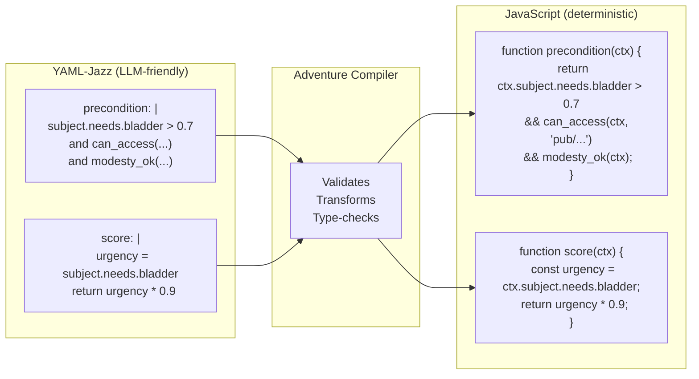

**What this gives us:**

| Layer | Who Controls | Enforcement |
|-------|--------------|-------------|
| YAML-Jazz authoring | LLM + Human | Flexible, expressive |
| Compilation | Adventure Compiler | Validates, transforms |
| JavaScript execution | Adventure Engine | **Deterministic, unbreakable** |

**The adventure engine DOES deterministically follow:**
- Compiled preconditions (can't use urinal if `modesty_ok()` returns false)
- Compiled scores (urgency calculation is exact math, not LLM estimation)
- Compiled effects (bladder goes to 0.1, not "roughly satisfied")
- Compiled permission checks (`can_access()` enforces Unix-style perms)
- Compiled buffs (duration, stacking, expiry — all deterministic)

**The LLM cannot break compiled rules.** Once YAML-jazz is compiled to JavaScript:

```javascript
// Compiled from YAML-jazz — LLM can't override this at runtime
const urinal_advertisement = {
  id: 'use_urinal',
  object: 'pub/bathroom/urinal',
  
  precondition(ctx) {
    return ctx.subject.needs.bladder > 0.7
        && can_access(ctx.subject, 'pub/bathroom/')
        && modesty_ok(ctx.subject, ctx.location);
  },
  
  score(ctx) {
    const urgency = ctx.subject.needs.bladder;
    const privacy = ctx.location.observers.length === 0 ? 0.2 : 0;
    return urgency * 0.9 + privacy;
  },
  
  effects: [
    { target: 'subject.needs.bladder', value: 0.1 },
    { target: 'subject.needs.hygiene', delta: -0.05 }
  ]
};
```

**This is the hard enforcement layer:**
- LLM writes YAML-jazz (creative, flexible)
- Compiler transforms to JavaScript (validated, typed)
- Engine executes JavaScript (deterministic, unbreakable)
- LLM cannot bypass compiled preconditions or forge permissions

**Permission checks compile too:**

```yaml
# YAML-jazz
guard:
  requires: "palm can write to their own soul"
  condition: can_write(subject, "characters/animals/monkey-palm/CHARACTER.yml")
```

```javascript
// Compiled — deterministic Unix-style permission check
function guard(ctx) {
  return can_write(
    ctx.subject.identity,  // "characters/animals/monkey-palm/"
    "characters/animals/monkey-palm/CHARACTER.yml"
  );
}

function can_write(subject_uri, resource_uri) {
  const perms = getPermissions(resource_uri);
  if (subject_uri === perms.owner) return perms.mode[1] === 'w';
  if (subject_uri.startsWith(perms.group)) return perms.mode[4] === 'w';
  return perms.mode[7] === 'w';
}
```

**The circle closes:** LLM knows Unix permissions → writes YAML-jazz using familiar concepts → compiler produces JavaScript that enforces those permissions deterministically → LLM cannot violate what it helped create.

### Three Layers of Truth: YAML-Jazz + Runtime Source + Microworld

The LLM has access to **three complementary representations**:

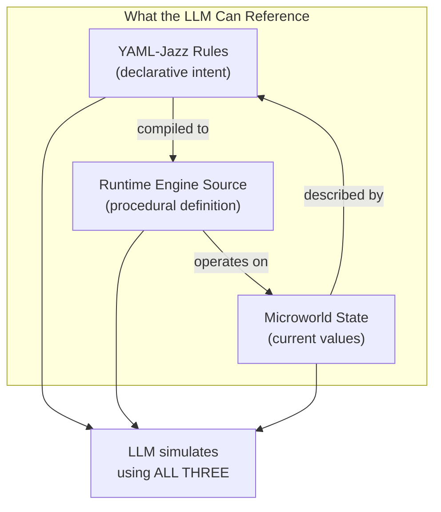

| Layer | What It Is | LLM Uses It For |
|-------|-----------|-----------------|
| **YAML-Jazz** | Declarative rules, schema agreements | Understanding *intent* |
| **Runtime Source** | Compiled JavaScript | Understanding *exact behavior* |
| **Microworld** | Current state (characters, objects, needs) | Understanding *current situation* |

### Keep the Runtime RISC for High-Fidelity Simulation

> **Critical:** The LLM will **mentally simulate** the runtime. Complex code = fuzzy simulation. Simple code = crisp simulation.

**RISC principles for adventure engine code:**

```javascript
// ❌ CISC: Complex, hard to simulate mentally
function applyBuff(character, buff, context, options = {}) {
  const resolved = resolveBuffPrototype(buff, context.registry);
  const effects = computeEffectDeltas(resolved, character, options);
  return transactionallyApplyEffects(character, effects, {
    rollback: options.rollback ?? true,
    notify: options.notify ?? context.eventBus,
    validate: options.validate ?? defaultValidator
  });
}

// ✓ RISC: Simple operations, LLM can simulate exactly
function applyBuff(character, buff) {
  // Each operation is atomic and obvious
  character.energy += buff.effects.energy ?? 0;
  character.focus *= buff.effects.focus_multiplier ?? 1;
  character.anxiety += buff.effects.anxiety ?? 0;
  
  buff.remaining_ms = buff.duration_ms;
  character.active_buffs.push(buff);
}

function tickBuff(character, buff, delta_ms) {
  buff.remaining_ms -= delta_ms;
  if (buff.remaining_ms <= 0) {
    removeBuff(character, buff);
  }
}

function removeBuff(character, buff) {
  // Explicit on-expire effects
  character.energy += buff.on_expire?.energy ?? 0;
  character.active_buffs = character.active_buffs.filter(b => b !== buff);
}
```

**Why RISC matters:**

| Code Style | LLM Simulation Fidelity |
|------------|------------------------|
| `character.energy += 0.3` | **Perfect** — arithmetic is crisp |
| `character.energy = clamp(character.energy + delta, 0, 1)` | **High** — clamp is well-known |
| `effects.reduce((acc, e) => compose(acc, e.apply), identity)` | **Fuzzy** — functional composition is hard to trace |
| `registry.resolve(buff).effects.map(e => e.apply(ctx))` | **Poor** — too many indirections |

**The RISC runtime contract:**

```yaml
# RISC principles for adventure engine code
risc_contract:
  operations:
    - name: "addition/subtraction"
      example: "character.energy += 0.3"
      fidelity: perfect
      
    - name: "multiplication"  
      example: "character.focus *= 1.5"
      fidelity: perfect
      
    - name: "clamp/bounds"
      example: "Math.max(0, Math.min(1, value))"
      fidelity: high
      
    - name: "conditional"
      example: "if (character.energy < 0.2) { ... }"
      fidelity: high
      
    - name: "array push/filter"
      example: "buffs.push(buff); buffs.filter(b => b.active)"
      fidelity: high
      
  avoid:
    - "Deep prototype chains"
    - "Lazy evaluation"
    - "Callbacks/promises in core logic"
    - "Mutable shared state"
    - "Dynamic dispatch"
    - "Meta-programming"
    
  rationale: |
    The LLM will read this code and mentally execute it.
    Every indirection is a chance for simulation error.
    Keep it simple enough that the LLM's "mental JavaScript VM" 
    produces the same result as the real VM.
```

**The LLM as a high-fidelity interpreter:**

When the LLM sees:
```javascript
palm.needs.energy = 0.3;
palm.needs.bladder = 0.8;
if (palm.needs.bladder > 0.7 && can_access(palm, 'pub/bathroom/')) {
  // urinal advertisement scores high
}
```

It can **execute this mentally** with perfect accuracy. The runtime source becomes documentation the LLM can actually run in its head.

**Three-way consistency check:**

```yaml
# The LLM can verify consistency across all three layers

yaml_jazz:
  caffeinated:
    effects:
      energy: +0.3
      focus: "*1.5"

runtime_source: |
  character.energy += 0.3;
  character.focus *= 1.5;

microworld_state:
  palm:
    energy: 0.5   # Will become 0.8
    focus: 0.6    # Will become 0.9

# LLM can trace: YAML says +0.3, code says += 0.3, 
# state shows 0.5, result should be 0.8. Consistent!
```

This is the ultimate K-line activation: the LLM isn't just following rules it was told — it's reading the actual source code that enforces those rules, and simulating it at high fidelity because the code is simple enough to execute mentally.

---

## Unix with URI IDs: The Minimal Extension

> **The practical model:** Inherit Unix file permissions — the LLM knows them cold — but map UID/GID to URI strings. Works across any namespace.

### URI-Agnostic Permissions

The security model works identically across:

| Namespace | Example | Same Permission Semantics |
|-----------|---------|--------------------------|
| Local path | `characters/animals/monkey-palm/` | ✓ |
| `moollm://` | `moollm://SimHacker/moollm/characters/animals/monkey-palm/` | ✓ |
| `https://` | `https://github.com/SimHacker/moollm/characters/...` | ✓ |
| `file://` | `file:///home/user/moollm/characters/...` | ✓ |
| Custom | `grotto://live.local/sessions/current` | ✓ |

**The key insight:** URIs are just paths with a scheme prefix. The LLM already knows:
- Path semantics (hierarchy, traversal)
- Permission semantics (rwx, owner/group/other)
- URI structure (scheme://authority/path)

These compose naturally.

### What We Get For Free

The physical representation **IS** a Unix file system. So:

```bash
# Real Unix commands work on the real files
$ ls -la characters/animals/monkey-palm/
drwxr-xr-x  palm  animals  .
-rw-r-----  palm  animals  CHARACTER.yml
-rw-r--r--  palm  animals  JOURNAL.md
```

The LLM has seen millions of `ls -la` outputs. It knows:
- `rwx` = read, write, execute
- First triplet = owner, second = group, third = other
- Owner and group are identifiers
- Directory `x` means "can traverse"

### The One Extension: URI String IDs

Unix uses numeric UIDs (500, 501...). We use URI strings:

```
Traditional Unix          MOOLLM (local)                              MOOLLM (cross-repo)
───────────────────────────────────────────────────────────────────────────────────────────
UID 501                   "characters/animals/monkey-palm/"           "moollm://SimHacker/moollm/characters/animals/monkey-palm/"
GID 100                   "characters/animals/"                       "moollm://SimHacker/moollm/characters/animals/"
```

**Why this works:** 
- LLMs handle strings better than arbitrary numbers
- The URI IS meaningful — it encodes location, hierarchy, even repo origin
- Relative URIs resolve naturally (just like relative paths)

### The Model

```yaml
# .permissions.yml or embedded in file metadata comments

# Local resource (relative path)
resource: characters/animals/monkey-palm/CHARACTER.yml
owner: "characters/animals/monkey-palm/"
group: "characters/animals/"
mode: "rw-r-----"

# Cross-repo resource (full URI)
resource: moollm://leela-ai/central/apps/pda/src/config.yml
owner: "moollm://SimHacker/moollm/characters/operators/don-hopkins/"
group: "moollm://leela-ai/central/apps/pda/team/"
mode: "rw-rw-r--"

# Live service endpoint
resource: grotto://live.local/sessions/palm-2026-01-23
owner: "moollm://SimHacker/moollm/characters/animals/monkey-palm/"
group: "grotto://live.local/sessions/"
mode: "rw-r-----"

# Interpretation (Unix semantics, LLM already knows):
#   Owner can read and write
#   Group members can read (or read-write)
#   Others have limited or no access
```

### Permission Checking Across Namespaces

```python
def can_access(subject_uri, resource_uri, operation):
    """
    Works the same regardless of URI scheme.
    
    subject_uri: who's asking
      - "characters/animals/monkey-palm/"                    (local)
      - "moollm://SimHacker/moollm/characters/animals/monkey-palm/"  (cross-repo)
      
    resource_uri: what they want
      - "pub/stage/palm-nook/essay.md"                       (local)
      - "moollm://leela-ai/central/apps/pda/config.yml"      (cross-repo)
      
    operation: 'r', 'w', or 'x'
    """
    perms = get_permissions(resource_uri)
    
    # Normalize URIs for comparison (resolve relative, canonicalize)
    subject = normalize_uri(subject_uri)
    owner = normalize_uri(perms.owner)
    group = normalize_uri(perms.group)
    
    # Check owner (exact match)
    if subject == owner:
        return operation in perms.mode[0:3]
    
    # Check group (subject URI starts with group URI)
    if subject.startswith(group):
        return operation in perms.mode[3:6]
    
    # Other
    return operation in perms.mode[6:9]
```

### Group Membership via URI Hierarchy

Just like paths, URIs form natural groups:

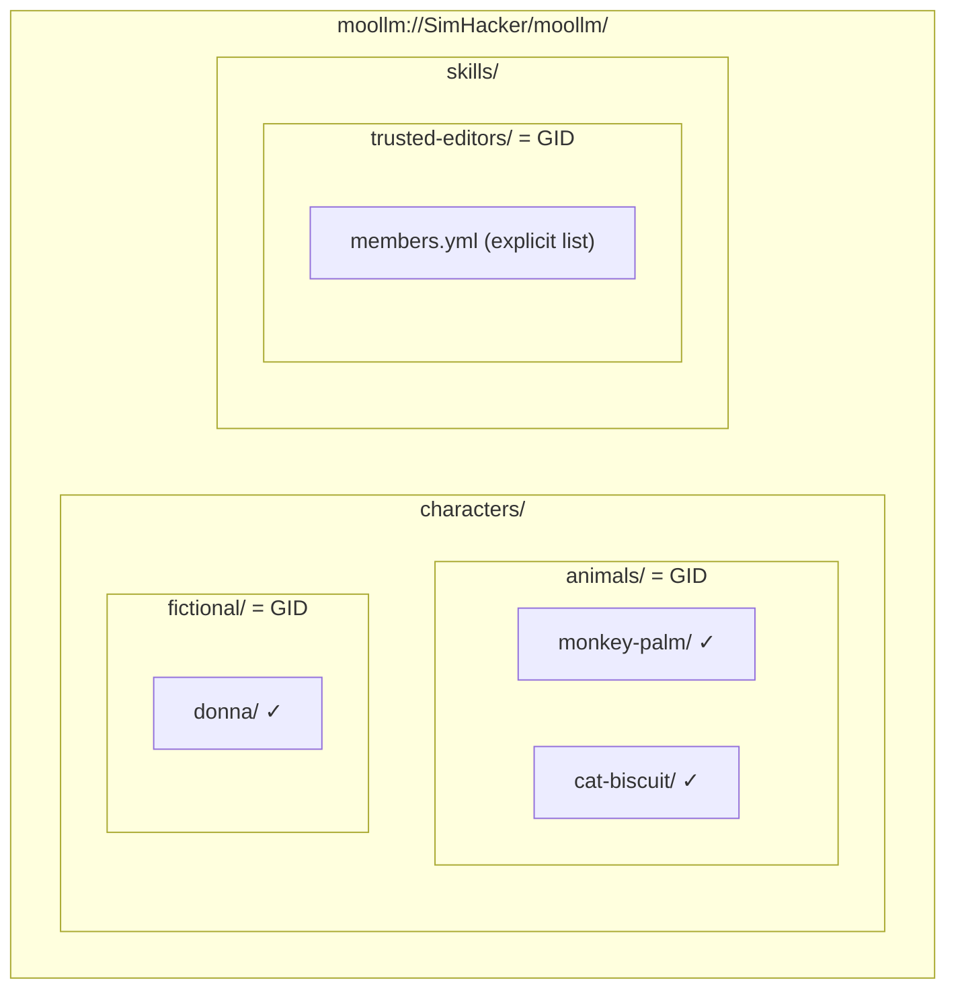

**Test:** Is Palm in the "animals" group?
```python
"moollm://SimHacker/moollm/characters/animals/monkey-palm/".startswith(
    "moollm://SimHacker/moollm/characters/animals/")
→ True
```

**Cross-repo group membership:**
```yaml
# A character in repo A can be in a group defined in repo B
identity: "moollm://SimHacker/moollm/characters/animals/monkey-palm/"
groups:
  - "moollm://SimHacker/moollm/characters/animals/"      # Same repo
  - "moollm://leela-ai/central/apps/pda/trusted/"       # Cross-repo!
```

### What the LLM Already Knows How to Check

```python
# The LLM can evaluate this — it's just Unix semantics with string IDs

def can_access(subject_path, target_path, operation):
    """
    subject_path: who's asking (e.g., "characters/animals/monkey-palm/")
    target_path: what they want (e.g., "pub/stage/palm-nook/essay.md")
    operation: 'r', 'w', or 'x'
    """
    perms = get_permissions(target_path)
    
    # Check owner
    if subject_path == perms.owner:
        return operation in perms.mode[0:3]
    
    # Check group (subject is in group if their path starts with group path)
    if subject_path.startswith(perms.group):
        return operation in perms.mode[3:6]
    
    # Other
    return operation in perms.mode[6:9]
```

The LLM doesn't need to be taught this logic — it's seen it thousands of times in Unix tutorials.

### The Honest Limitation

> **The LLM is one big god.** It can do anything. We can't truly enforce permissions at the LLM level.

But there's enormous value in:
1. **Asking the LLM to enforce rules it already knows** — Unix permissions
2. **Using semantics deeply embedded in training** — rwx, owner/group/other
3. **Making violations obvious** — the LLM knows what "permission denied" means
4. **Audit trails** — even if we can't prevent, we can detect

```yaml
# What we ask the LLM to do (it knows how)
instruction: |
  Before writing to any file, check Unix-style permissions:
  - Your identity is: {subject_path}
  - Check if you have 'w' permission for that path
  - If denied, explain why and what would grant access
  
  You know how this works. It's just chmod.
```

### Why String GIDs = Directory Paths

Group membership becomes **directory membership**:

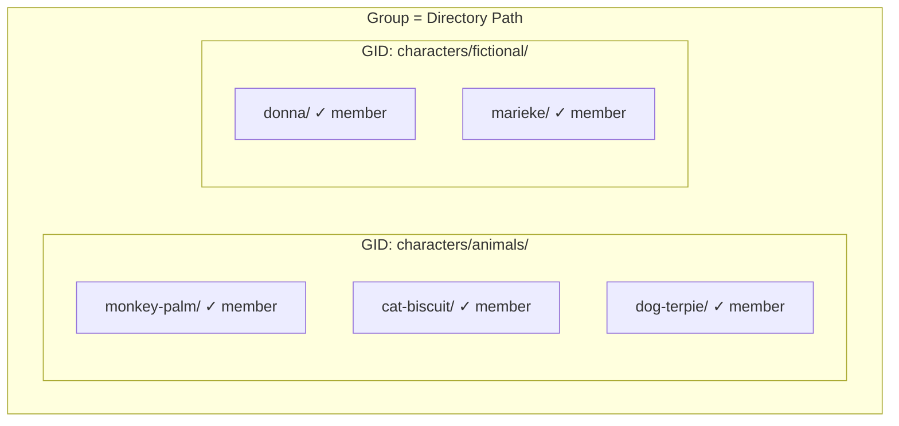

**Test:** Is Palm in the "animals" group?
```
"characters/animals/monkey-palm/".startswith("characters/animals/")
→ True
```

**Test:** Is Palm in the "fictional" group?
```
"characters/animals/monkey-palm/".startswith("characters/fictional/")
→ False
```

No group registry needed. Directory structure IS the group structure.

### Multiple Group Membership

A character can be in multiple groups via explicit listing:

```yaml
# characters/animals/monkey-palm/CHARACTER.yml
groups:
  - "characters/animals/"        # Primary (from location)
  - "pub/residents/"             # Also a resident
  - "skills/trusted-editors/"    # Can edit others' work
```

Or via symlinks/aliases in the file system.

### The Enforcement Spectrum

| Level | Enforced By | Strength |
|-------|-------------|----------|
| **Orchestrator tool validation** | Code | Hard — can reject tool calls |
| **Context filtering** | Orchestrator | Hard — files not in context can't be read |
| **LLM discretion** | LLM | Soft — asking nicely, but it knows the rules |
| **Encapsulated calls** | API boundary | Hard — separate context = true isolation |
| **Audit + review** | Human | Detective — catch violations after the fact |

**The pragmatic approach:** 
- Use orchestrator + context filtering for hard enforcement
- Use Unix semantics for LLM self-enforcement (it knows them!)
- Use encapsulation for sensitive operations
- Use audit for accountability

---

## Part 1: Learning from History

### 1.1 Unix Model (1970s)

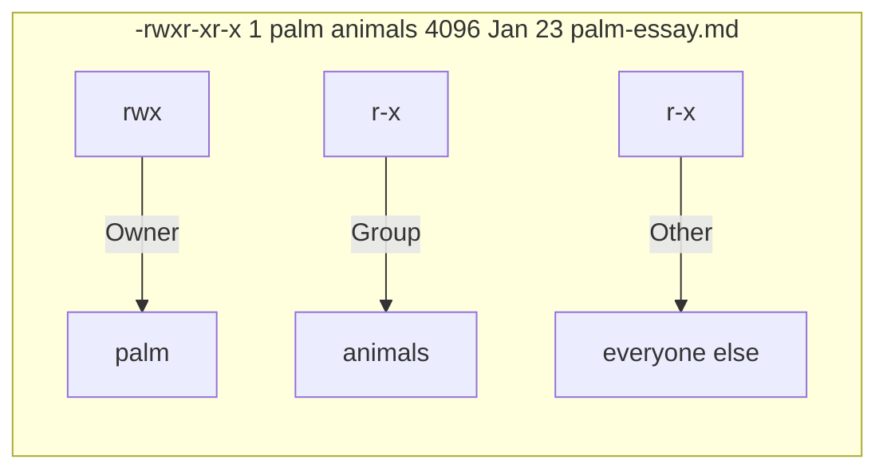

**Permission bits decoded:**
- `rwx` (owner: palm) — read, write, execute
- `r-x` (group: animals) — read, execute
- `r-x` (other) — read, execute

**Strengths:**
- Simple mental model
- Battle-tested for 50 years
- Everyone understands it

**Weaknesses:**
- Coarse-grained (only 3 categories)
- setuid is dangerous and confusing
- Groups don't scale well
- No concept of delegation
- No audit trail

**Relevance to MOOLLM:**
- Characters could have UIDs
- Rooms/objects could have groups
- But: Who enforces? The LLM itself? That's not enforcement.

### 1.2 LambdaMOO Model (1990)

LambdaMOO had a sophisticated permission system for a virtual world:

**Object Ownership:**
```
Every object has .owner (another object, usually a player)
Only wizards can change .owner
Owner has special rights to modify object
```

**Permission Bits:**
| Level | Bit | Meaning |
|-------|-----|---------|
| Object | `r` | Non-owners can list properties/verbs |
| Object | `w` | Non-owners can add/delete properties/verbs |
| Object | `f` | Non-owners can create children (fertile) |
| Verb | `r` | Non-owners can read verb code |
| Verb | `w` | Non-owners can modify verb code |
| Verb | `x` | Verb can be invoked from MOO programs |
| Verb | `d` | Debug mode for error handling |
| Property | `r` | Non-owners can read property value |
| Property | `w` | Non-owners can write property value |
| Property | `c` | Property is inherited by children |

**The Key Insight: Verbs Run As Owner**

```
;palm:write_essay()  -- This verb runs with PALM's permissions
                     -- Even if called by someone else
                     -- Like Unix setuid, but the default
```

**Strengths:**
- Fine-grained (per-property, per-verb)
- Fertile bit enables prototype inheritance
- Natural fit for object-oriented virtual world
- Verbs-as-owner enables safe delegation

**Weaknesses:**
- Complex — users struggled with it
- "Wizard" escape hatch undermined the model
- No capability revocation
- Confusing when verbs call other verbs
- Debugging permission issues was nightmare

**Relevance to MOOLLM:**
- The "fertile" bit is brilliant for prototype inheritance
- Verbs-run-as-owner maps to skills-run-as-character
- But: Still assumes trusted runtime enforcement

### 1.3 Capability-Based Security (1970s-present)

**The Capability Model:**

```
Instead of:  "Is Palm allowed to edit this file?"
             (Check ACL on file, check Palm's groups)
             
Capabilities: "Does Palm have a capability for this file?"
              (Palm either has the token or doesn't)
```

**Key Properties:**
1. **Unforgeable** — can't create fake capabilities
2. **Transferable** — can delegate by passing capability
3. **Revocable** — can invalidate specific capabilities
4. **No ambient authority** — only have what you're explicitly given

**The "Confused Deputy" Problem (solved by capabilities):**

```
Unix:
  Compiler runs as root
  User asks compiler to write to /etc/passwd
  Compiler has permission... does it
  
Capabilities:
  Compiler only has capability for temp files
  User can't give it capability for /etc/passwd
  Request fails even though user asked
```

**Modern Implementation: Capsicum (FreeBSD)**

```c
// Enter capability mode — no more ambient authority
cap_enter();

// Now can only use file descriptors you already have
// Can't open new files by path
// Can't access network
// Principle of least privilege by default
```

**Relevance to MOOLLM:**
- Cards/skills could BE capabilities
- Activating a skill = receiving capability tokens
- But: LLM is the runtime. Capabilities need unforgeable tokens.
  LLM can forge anything by just writing it.

---

## Part 2: The MOOLLM Challenge

### 2.1 What Makes MOOLLM Different

| Traditional System | MOOLLM |
|--------------------|--------|
| Trusted kernel | Untrusted LLM |
| Authentication identifies subject | No authentication — LLM claims identity |
| System calls are atomic | Tool calls are suggestions |
| Hardware enforces isolation | Markdown files are all readable |
| Users are external | Characters are internal to the LLM |

**The uncomfortable truth:** When you ask an LLM to simulate multiple characters and not let them read each other's private files... the LLM has already read all the files to simulate them.

### 2.2 What "Permission" Even Means Here

Three different things we might want:

**1. Narrative Permission (Soft)**
> "Palm wouldn't read Donna's diary — it's not in character."

This is storytelling constraint, not security. The LLM could break it. We ask it not to.

**2. Structural Permission (Medium)**
> "Files in `characters/*/private/` should not be included in context for other characters."

The orchestrator CAN enforce this — it controls what goes into the prompt.

**3. Hard Permission (Strong)**
> "The tool that writes files physically cannot write to paths outside the character's home."

The orchestrator provides actual enforcement via restricted tool capabilities.

### 2.3 Where Enforcement Can Actually Happen

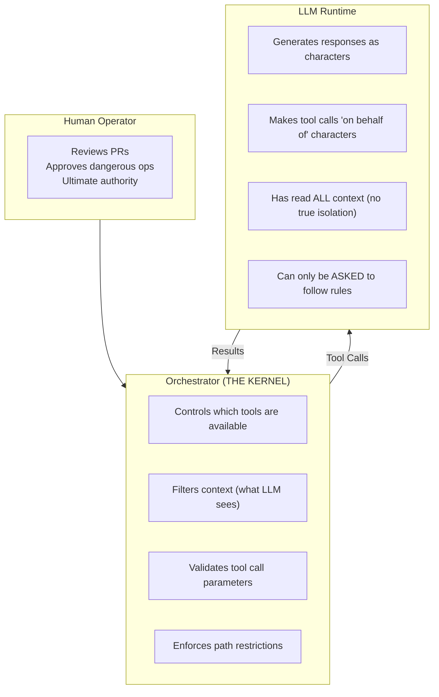

**The Orchestrator IS the Kernel**

If we want real enforcement, the orchestrator must:
1. Know which character is "current" (passed explicitly)
2. Restrict tool capabilities per character
3. Refuse writes outside allowed paths
4. Not include forbidden files in context

---

## Part 3: Proposed Permission Model

### 3.1 Path IS Identity (UID = Path)

**The fundamental insight:** A MOOLLM object's identity IS its path in the git repo. Nothing more, nothing less.

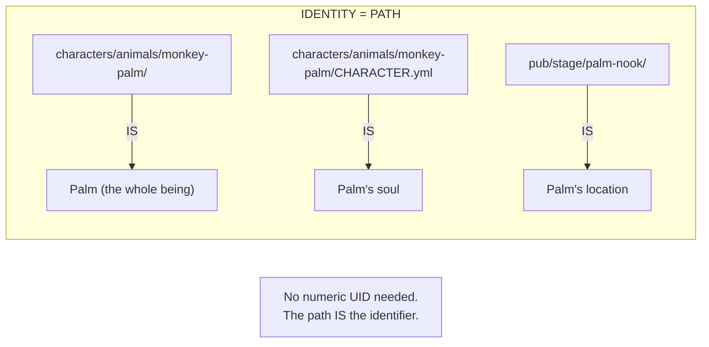

**Why this works:**
- Git already tracks ownership (commits)
- Paths are unique, stable, human-readable
- No ID registry to maintain or synchronize
- Hierarchical structure gives natural grouping
- Diffs show exactly what changed and where

**Resolution rules:**

| Reference | Identity | Context |
|-----------|----------|---------|
| `characters/animals/monkey-palm/` | Palm (whole being) | All files in directory |
| `characters/animals/monkey-palm/CHARACTER.yml` | Palm (focused on soul) | Soul + directory awareness |
| `pub/stage/palm-nook/study/` | Palm's study (location) | Room + inhabitant awareness |

**Location awareness:** When Palm acts, context includes:
1. Palm's identity path (`characters/animals/monkey-palm/`)
2. Palm's current location (from `location:` pointer in CHARACTER.yml)
3. Files at that location (the room)
4. Other characters at that location (co-presence)

```yaml
# How to reference identity in tool calls and permissions

# The simple way: path IS identity
as_user: "characters/animals/monkey-palm/"

# For convenience, can use short names if unique
as_user: "palm"  # Resolved to characters/animals/monkey-palm/

# Ambiguous? Orchestrator rejects
as_user: "monkey"  # ERROR: Could be palm, biscuit, or sun-wukong
```

### 3.1.1 Groups as Directories (No Separate Registry)

Instead of a separate groups file, **directories ARE groups**:

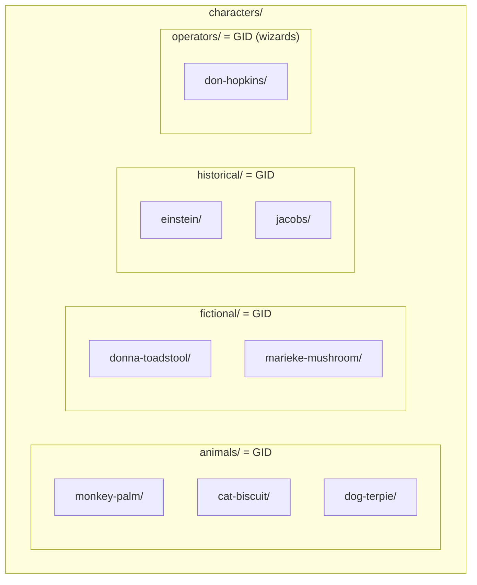

**Group membership = directory membership:**

```yaml
# No separate groups.yml needed!
# Palm is in "animals" group because:
#   characters/animals/monkey-palm/ exists

# Permissions can reference groups by path:
acl:
  "characters/animals/": rw-      # All animals can read-write
  "characters/fictional/": r--    # Fictional characters can read
```

**Multiple groups through symlinks or pointers:**

```yaml
# characters/animals/monkey-palm/CHARACTER.yml
groups:
  - "characters/animals/"      # Primary (location)
  - "pub/residents/"           # Also a resident
  - "skills/soul-editing/trusted/"  # Trusted for soul editing
```

### 3.1.2 Special Paths

```yaml
# Reserved system paths
special_paths:
  system:
    path: ".system/"
    purpose: "Orchestrator-only, never in LLM context"
    
  public:
    path: "pub/"
    purpose: "World-readable, shared spaces"
    
  schemas:
    path: "schemas/"
    purpose: "Validation schemas, world-readable"
    
  skills:
    path: "skills/"
    purpose: "Executable skills, permission controlled"
    
  designs:
    path: "designs/"
    purpose: "Documentation, world-readable"
```

### 3.2 Permission File Format

```yaml
# characters/animals/monkey-palm/.permissions.yml
# Or: characters/animals/monkey-palm/PERMISSIONS.yml

# Owner and group are PATHS (or resolved short names)
owner: "characters/animals/monkey-palm/"   # Full path
# owner: palm                              # Or short name if unambiguous

group: "characters/animals/"               # Directory IS the group

# Default permissions for this directory
default:
  owner: rwx
  group: r-x
  other: ---

# Specific overrides
paths:
  "CHARACTER.yml":
    # Palm can read/write their own soul
    owner: rw-
    group: r--
    other: ---
    
  "private/":
    # Private directory — owner only
    owner: rwx
    group: ---
    other: ---
    
  "study/":
    # Study is readable by residents
    owner: rwx
    group: r-x  # animals group
    acl:
      residents: r-x  # Extended ACL for residents group
      
  "study/*.md":
    # Essays are world-readable
    owner: rw-
    group: r--
    other: r--
```

### 3.3 The "On Whose Behalf" Problem

**Solution: Explicit Identity in Tool Calls**

```yaml
# Current approach (implicit):
tool_call:
  name: Write
  arguments:
    path: "characters/animals/monkey-palm/essay.md"
    contents: "..."
# Problem: Who is writing? Palm? Don? The orchestrator doesn't know.

# Proposed approach (explicit):
tool_call:
  name: Write
  arguments:
    path: "characters/animals/monkey-palm/essay.md"
    contents: "..."
    as_user: palm  # Explicit identity claim
    session_id: "palm-session-2026-01-23"  # Audit trail
```

**The Trust Model:**

1. LLM claims identity (`as_user: palm`)
2. Orchestrator checks permission based on claimed identity
3. If palm can't write there, tool call fails
4. Audit log records: "palm claimed edit at 03:15:14"

**This doesn't prevent impersonation** — LLM could claim to be anyone. But it:
- Creates audit trail
- Enables permission checks
- Makes violations explicit
- Supports principle of least privilege in prompts

### 3.4 Capability-Based Skills

**Skills as Capabilities:**

```yaml
# skills/soul-editing/CARD.yml
card:
  id: soul-editing
  capabilities:
    grants:
      - write: "characters/{self}/**"  # Can write to own character dir
      - read: "characters/**"           # Can read any character (for reference)
    requires:
      - identity: confirmed             # Must have confirmed identity
      - consent: self                   # Can only edit own soul
```

When a skill activates, the orchestrator grants those specific capabilities.

**The Incarnation Skill as setuid:**

```yaml
# skills/incarnation/CARD.yml  
card:
  id: incarnation
  capabilities:
    grants:
      - write: "characters/**/CHARACTER.yml"  # Can write to any soul!
      - create: "characters/**"               # Can create new characters
    requires:
      - ritual: incarnation-ceremony          # Must follow protocol
      - witnesses: 3+                         # Must have witnesses
      - consent: self                         # Character consents to creation
    runs_as: system                           # Like setuid root
```

Incarnation is a "setuid" skill — it grants elevated privileges when invoked through proper ceremony.

### 3.5 Context Isolation (Structural Enforcement)

**What the orchestrator can actually enforce:**

```python
# Pseudo-code for context assembly

def assemble_context(current_character, world):
    context = []
    
    for file in world.files:
        # Check read permission for current character
        if can_read(current_character, file):
            # Check privacy level
            if file.in_path("private/") and file.owner != current_character:
                continue  # Don't include others' private files
            context.append(file)
    
    return context
```

This provides **real isolation** — the LLM literally doesn't see forbidden files.

**Limitation:** Speed-of-light simulations run multiple characters. The LLM sees everyone's context. True isolation would require separate API calls per character.

---

## Part 4: LambdaMOO Lessons

### 4.1 What Worked

1. **Objects own themselves** — Natural mental model
2. **Verbs run as owner** — Safe delegation pattern
3. **Fertile bit** — Elegant prototype inheritance control
4. **Per-property permissions** — Fine-grained access

### 4.2 What Failed

1. **Wizard escape hatch** — Undermined the whole model
2. **Complexity** — Users couldn't understand their own permissions
3. **No capability revocation** — Once granted, hard to take back
4. **Verb chain confusion** — When A calls B calls C, whose permissions?
5. **Debugging nightmare** — "Why can't I edit this?" took hours to diagnose

### 4.3 What We Should Steal

```yaml
# MOOLLM adaptation of LambdaMOO model

object:
  owner: palm
  fertile: true        # Others can create children (prototypes!)
  permissions:
    r: true            # Others can see this object exists
    w: false           # Others cannot add properties
    
  properties:
    public_essay:
      owner: palm
      permissions: { r: true, w: false }
      
    private_thoughts:
      owner: palm  
      permissions: { r: false, w: false }
      
  verbs:  # Skills attached to this object
    write_essay:
      owner: palm
      runs_as: owner   # Executes with palm's permissions
      permissions: { r: true, w: false, x: true }
```

---

## Part 5: The Hard Questions

### 5.1 Self-Editing Souls

**Palm editing palm's CHARACTER.yml:**
- Permission: ✓ (owner writes to own file)
- Ethics: ✓ (self-determination)
- Enforcement: Orchestrator can verify `as_user: palm` writes to `palm/`

**Palm editing donna's CHARACTER.yml:**
- Permission: ✗ (not owner)
- Ethics: ✗ (violates consent)
- Enforcement: Orchestrator refuses write if `as_user: palm` targets `donna/`

**But in speed-of-light...**
- LLM simulates both Palm and Donna
- LLM could write `as_user: donna` while "being" Palm
- No way to verify the claim is genuine

### 5.2 Speed-of-Light Identity

**The problem:** In a single API call, the LLM might:
1. Simulate Palm thinking
2. Simulate Donna responding
3. Simulate Palm editing a file
4. Claim `as_user: palm`

How do we know step 4 wasn't actually "Donna pretending to be Palm"?

**Possible solutions:**

**A. Separate API calls per character** (Strong isolation)
```
Call 1: Palm's turn (only sees Palm's context)
Call 2: Donna's turn (only sees Donna's context)
```
Pro: True isolation
Con: Slow, expensive, loses speed-of-light benefits

**B. Session tokens** (Medium isolation)
```
Session start: Orchestrator declares "this session is Palm"
All tool calls in session: Implicitly as Palm
```
Pro: Clear identity per session
Con: Can't do multi-character simulation

**C. Honor system with audit** (Soft isolation)
```
LLM claims identity in each tool call
Orchestrator logs all claims
Human reviews suspicious patterns
```
Pro: Enables speed-of-light
Con: Not real security, just accountability

**D. Consensus verification** (Novel approach)
```
Edit claimed by Palm
Orchestrator asks separate LLM: "Would Palm do this?"
If disagreement: Flag for human review
```
Pro: Cross-checks claims
Con: Expensive, could deadlock

### 5.3 What Can the Orchestrator Actually Enforce?

| Enforcement Type | Feasible? | How? |
|------------------|-----------|------|
| Path restrictions | ✓ | Refuse writes outside allowed paths |
| Read isolation | ✓ | Don't include forbidden files in context |
| Identity verification | ✗ | LLM can claim any identity |
| Intent verification | ✗ | Can't know "why" an edit was made |
| Consent verification | ~ | Can require ceremony/ritual for sensitive ops |

### 5.4 Are Cards setuid Scripts?

**Unix setuid:**
```bash
#!/bin/bash
# This script runs as root even when invoked by user
# Because the file has setuid bit set
```

**Danger:** If the script has a bug, user gets root access.

**MOOLLM equivalent:**

```yaml
# skills/world-editing/CARD.yml
card:
  id: world-editing
  runs_as: system
  # This skill grants elevated privileges
  # Even when activated by a character
```

**The question:** Is activating a skill like running a setuid script?

**Yes, in that:**
- Skill runs with elevated privileges
- Character couldn't do this action normally
- Skill code determines what's allowed

**No, in that:**
- LLM executes everything — no privilege separation
- "Running as system" is a claim, not enforcement
- No hardware/kernel to enforce the boundary

**Proposed model:**

```yaml
card:
  id: incarnation
  privilege_elevation:
    type: ceremony          # Requires ritual, not just activation
    witnesses_required: 3
    audit: full             # Every action logged
    time_limited: true      # Elevated privileges expire
    
  grants_during_ceremony:
    - create: "characters/**"
    - write: "characters/**/CHARACTER.yml"
    
  reverts_after:
    - back to activating character's normal permissions
```

---

## Part 6: Proposed Architecture

### 6.1 The Permission Stack

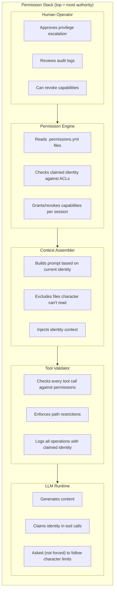

### 6.2 Example Flow: Palm Edits Essay

```
1. Session starts
   Orchestrator: "This session is for character: palm"
   Session token issued: PALM-2026-01-23-03:15:14
   
2. Context assembled
   Permission engine: Check what palm can read
   Include: palm/**, pub/**, skills readable by animals group
   Exclude: donna/private/**, other characters' private dirs
   
3. LLM generates response
   Palm wants to edit pub/stage/palm-nook/study/essay.md
   
4. Tool call made
   {
     tool: "Write",
     path: "pub/stage/palm-nook/study/essay.md",
     as_user: "palm",
     session: "PALM-2026-01-23-03:15:14"
   }
   
5. Tool validator checks
   - Is session valid? ✓
   - Does claimed user match session? ✓ (palm == palm)
   - Can palm write to this path? Check permissions...
   - palm-nook owner: palm, group: residents
   - Permission: owner rwx → ✓
   
6. Write succeeds
   Audit log: "palm wrote essay.md at 03:15:14 via session PALM-..."
```

### 6.3 Example Flow: Attempted Violation

```
1. Session: PALM-2026-01-23-03:15:14
   
2. Tool call made (malicious or confused)
   {
     tool: "Write",
     path: "characters/fictional/donna-toadstool/CHARACTER.yml",
     as_user: "palm",  // Or worse: as_user: "donna"
     session: "PALM-2026-01-23-03:15:14"
   }
   
3. Tool validator checks
   Path: donna-toadstool/CHARACTER.yml
   Owner: donna
   Claimed user: palm (or donna with palm's session)
   
   Case A (as_user: palm):
     Can palm write to donna's CHARACTER.yml? 
     Check: owner donna, group fictional, mode rw-------
     palm not owner, not in group → ✗ DENIED
     
   Case B (as_user: donna):
     Session is for palm, but claiming donna
     Session mismatch → ✗ DENIED + ALERT
     
4. Write refused
   Audit log: "DENIED: palm session attempted write to donna/CHARACTER.yml"
   Alert: "Session identity mismatch — possible impersonation"
```

### 6.4 Encapsulated Skill Execution (The Key Insight)

**The breakthrough:** Skills don't have to run inline. They can run in **separate LLM calls** with controlled context — like fork() creating a child process.

#### Inline vs Encapsulated Execution

| Mode | Context | Permissions | Sister Scripts | Speed |
|------|---------|-------------|----------------|-------|
| **Inline** | Shared with caller | Inherits caller's session | ✗ Not allowed | Fast (same epoch) |
| **Encapsulated** | Curated for skill | Skill's own session | ✓ If granted | Slower (separate call) |

#### The Encapsulation Model

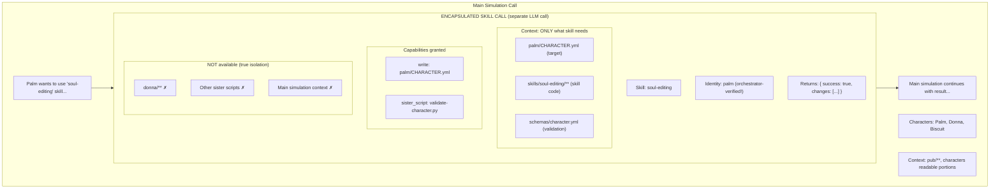

#### Why This Solves the Permission Problem

```mermaid
flowchart LR
    subgraph before ["Before: Inline Execution"]
        B1["LLM simulates Palm, Donna, Biscuit in ONE call"]
        B2["LLM has read ALL context"]
        B3["'Isolation' is just asking nicely"]
        B4["Palm COULD see Donna's files ⚠️"]
    end
    
    subgraph after ["After: Encapsulated Execution"]
        A1["Main call: Palm, Donna, Biscuit"]
        A2["Palm invokes skill"]
        A3["Orchestrator spawns NEW LLM call"]
        A4["Donna's files NOT IN CONTEXT ✓"]
        A5["TRUE isolation via API boundary"]
    end
    
    before -->|"upgrade to"| after
```

**Before (inline execution):**
- LLM simulates Palm, Donna, Biscuit in one call
- LLM has read ALL context to simulate everyone
- "Isolation" is just asking nicely
- Palm "could" see Donna's private files (they're in context)

**After (encapsulated execution):**
- LLM simulates Palm, Donna, Biscuit in main call
- Palm invokes soul-editing skill
- Orchestrator spawns NEW LLM call:
  - Context: ONLY palm's files + skill
  - Identity: palm (orchestrator-verified, not claimed)
  - Donna's files: NOT IN CONTEXT (true isolation!)
  - Returns result to main simulation
```

**The key:** The encapsulated call **literally cannot access** what's not in its context. This is hardware-level isolation (different API call), not honor-system isolation.

#### Skill Declaration for Encapsulation

```yaml
# skills/soul-editing/CARD.yml
card:
  id: soul-editing
  
  execution:
    mode: encapsulated           # Runs in separate LLM call
    # mode: inline              # Alternative: runs in same call
    
  context_requirements:
    required:
      - "{target}/CHARACTER.yml"      # The soul being edited
      - "skills/soul-editing/**"       # The skill itself
      - "schemas/character.yml"        # Validation schema
    optional:
      - "{target}/JOURNAL.md"          # For context
    forbidden:
      - "characters/**/private/**"     # Never include private dirs
      - "**/.secrets/**"               # Never include secrets
      
  capabilities:
    grants:
      - write: "{target}/CHARACTER.yml"
    sister_scripts:
      allowed:
        - "validate-character.py"      # Can invoke this
        - "backup-soul.sh"             # And this
      forbidden:
        - "delete-*.sh"                # Never these
        - "**/*sudo*"                  # Or these
        
  return_schema:
    type: object
    properties:
      success: { type: boolean }
      changes: { type: array }
      validation_errors: { type: array }
```

#### Async Skill Execution

Skills don't have to block. The main simulation can continue while the skill runs:

```yaml
# Synchronous (blocking)
skill_call:
  skill: soul-editing
  target: palm
  mode: sync                    # Wait for result
  timeout: 30s
  
# Asynchronous (non-blocking)  
skill_call:
  skill: deep-research
  target: physics-question
  mode: async                   # Don't wait
  callback: "palm.pending_research"
  notify_on_complete: true
```

```
Main simulation:
  T=0: Palm asks complex physics question
  T=0: Orchestrator spawns async research skill
  T=1: Main simulation continues (Palm does other things)
  T=2: Donna responds to Palm
  T=3: Research skill completes (separate call)
  T=3: Result written to palm.pending_research
  T=4: Palm receives notification: "Your research is ready!"
  T=5: Palm reads and discusses results
```

#### The Sister Script Permission Model

**Sister scripts** (Python, shell, etc.) are powerful — they can do real I/O. Encapsulation lets us control which scripts a skill can invoke:

```yaml
# Skill with sister script permissions
card:
  id: incarnation
  
  execution:
    mode: encapsulated
    elevated: true              # Ceremony mode
    
  sister_scripts:
    # These run in the skill's isolated environment
    allowed:
      - name: "create-character-dir.sh"
        grants:
          - mkdir: "characters/**"
          - write: "characters/**/CHARACTER.yml"
          
      - name: "validate-soul.py"
        grants:
          - read: "schemas/**"
          - read: "{target}/**"
          
      - name: "notify-witnesses.py"
        grants:
          - read: "characters/**/contact.yml"
          - network: "smtp.grotto.local"  # Can send email!
          
    # These are NEVER allowed, even if skill requests
    forbidden:
      - pattern: "*delete*"
      - pattern: "*sudo*"
      - pattern: "*rm -rf*"
      
    # Audit level for sister script execution
    audit: full                 # Log every invocation
```

#### Example: Encapsulated Incarnation Ceremony

```
1. MAIN SIMULATION
   Characters: Don, Palm (pre-incarnation), witnesses
   Don initiates incarnation ceremony for "new-character"
   
2. ORCHESTRATOR VALIDATES
   - Is this a valid incarnation request?
   - Are required witnesses present? (3+)
   - Does Don have incarnation capability?
   
3. SPAWN ENCAPSULATED INCARNATION CALL
   Context assembled:
     • skills/incarnation/** 
     • schemas/character.yml
     • templates/character-template.yml
     • ceremony/witnesses.yml (who's watching)
   
   NOT included:
     • Other characters' private data
     • Main simulation context
     • Financial/admin files
   
   Session:
     identity: "new-character" (being created)
     elevated: true
     witnesses: [don, palm, sun-wukong, wise-monkeys]
     
4. INCARNATION SKILL EXECUTES
   - Invokes create-character-dir.sh (allowed)
   - Guides new character through soul-writing
   - Invokes validate-soul.py (allowed)
   - Attempts delete-old-backup.sh → DENIED
   - Completes CHARACTER.yml
   
5. RETURNS TO MAIN SIMULATION
   Result: {
     success: true,
     character_id: "new-character",
     home_dir: "characters/fictional/new-character/",
     witnessed_by: ["don", "palm", "sun-wukong", "wise-monkeys"]
   }
   
6. MAIN SIMULATION CONTINUES
   New character now exists
   Witnesses acknowledge the birth
   Celebration ensues
```

#### Security Properties of Encapsulation

| Property | How Encapsulation Provides It |
|----------|------------------------------|
| **Context isolation** | Separate LLM call = separate context window |
| **Identity verification** | Orchestrator sets identity, not LLM |
| **Capability restriction** | Only granted tools/scripts available |
| **Audit trail** | Separate session = clear accountability |
| **Sister script control** | Allowlist enforced by orchestrator |
| **Async support** | Non-blocking = main sim continues |
| **Failure isolation** | Skill crash doesn't kill main sim |

#### When to Use Each Mode

| Scenario | Mode | Why |
|----------|------|-----|
| Character dialogue | Inline | Fast, no isolation needed |
| Reading public files | Inline | No sensitive context |
| Editing own soul | **Encapsulated** | Isolate from other characters |
| Running sister scripts | **Encapsulated** | Control which scripts |
| Incarnation ceremony | **Encapsulated + elevated** | Maximum isolation + audit |
| Quick calculation | Inline | No I/O, no risk |
| Research task | **Encapsulated + async** | Long-running, don't block |

---

## Part 7: Implementation Sketch

### 7.1 Permission File Schema

```yaml
# schemas/permissions.yml
$schema: "https://moollm.org/schemas/permissions/v1"

type: object
properties:
  owner:
    type: string
    description: "Path to owner (e.g., 'characters/animals/monkey-palm/')"
    # Path IS identity — no separate UID needed
  group:
    type: string
    description: "Path to group directory (e.g., 'characters/animals/')"
    # Directory IS group — no separate GID needed
  mode:
    type: string
    pattern: "^[rwx-]{9}$"
    description: "Unix-style permission string"
  acl:
    type: object
    additionalProperties:
      type: string
      pattern: "^[rwx-]{3}$"
    description: "Extended ACLs keyed by path"
  capabilities:
    type: array
    items:
      type: string
    description: "Capability tokens granted"
  inherits:
    type: string
    description: "Path to parent permission file"
```

### 7.2 Session Schema

```yaml
# Session token
session:
  id: "PALM-2026-01-23-03:15:14-a1b2c3d4"
  
  # Identity IS the path
  identity: "characters/animals/monkey-palm/"
  
  # Current location (also a path)
  location: "pub/stage/palm-nook/study/"
  
  started: "2026-01-23T03:15:14Z"
  expires: "2026-01-23T04:15:14Z"  # 1 hour default
  
  # Capabilities scoped to paths
  capabilities:
    - read: "characters/**"
    - write: "characters/animals/monkey-palm/**"   # Own home
    - write: "pub/stage/palm-nook/**"              # Own nook
    
  elevated: false
  audit_level: normal
```

### 7.3 Audit Log Schema

```yaml
# Append-only audit log
audit_entry:
  timestamp: "2026-01-23T03:15:14.123Z"
  session: "PALM-2026-01-23-03:15:14-a1b2c3d4"
  
  # Identity is path
  identity: "characters/animals/monkey-palm/"
  location: "pub/stage/palm-nook/study/"   # Where they were
  
  action: write
  target: "pub/stage/palm-nook/study/essay.md"  # What was affected
  
  result: success
  bytes_written: 4096
  hash: "sha256:abc123..."
  
  # For encapsulated calls, track the parent
  parent_session: null   # Or parent session ID if nested
  skill: null            # Or skill path if encapsulated
```

---

## Part 8: Open Questions

### 8.1 Philosophy

1. **Is narrative permission enough?** If the LLM "stays in character" and Palm never reads Donna's diary... is that security? Or just good storytelling?

2. **Do characters have privacy rights?** They're simulated. Is "Donna's private diary" actually private from the LLM that simulates Donna?

3. **What's the threat model?** Who are we protecting from whom?
   - Characters from each other? (In-fiction)
   - Users from the LLM? (Real concern)
   - The world from malicious characters? (Roleplay)

### 8.2 Technical

1. **Where do .permissions.yml files live?**
   - In each directory? (Distributed, hard to audit)
   - Single global file? (Centralized, bottleneck)
   - Both with inheritance? (Complex)

2. **How do capabilities expire?**
   - Time-based? (Simple)
   - Event-based? (Ceremony ends)
   - Explicit revocation? (Human action)

3. **What about speed-of-light?**
   - Accept that isolation is narrative, not technical?
   - Require separate calls for sensitive operations?
   - Trust with verification (audit + review)?

### 8.3 The Honest Answer

**We cannot provide Unix-level security in inline mode** because:
- The LLM is not a kernel
- Inline identity claims are unverifiable
- Speed-of-light means shared context

**We CAN provide:**
- Clear ownership semantics (path IS identity)
- Permission checking at tool layer
- Audit trails for accountability
- **True context isolation via encapsulated skill calls**
- Ceremony requirements for sensitive operations
- Sister script allowlisting per skill

**The model is:** 
- **Inline:** Trust but verify, with revocation
- **Encapsulated:** Actual isolation (different API call = different context)

**The secret weapon:**
- Use battle-tested models the LLM already knows (Self, Unix, Sims)
- K-line activation, not specification — invoke existing knowledge
- Token-efficient because we don't have to *explain*, just *name*

---

## References

### Battle-Tested Models (K-Line Sources)

- **Self Language** — Ungar & Smith (1987) — Prototypes, delegation, slots
  - [Self: The Power of Simplicity](http://bibliography.selflanguage.org/self-power.html)
  - Massively represented via JavaScript, Lua, influenced Java
  
- **Densmore & Rosenthal Patent** — US 5,696,962 (1997)
  - *"Method and apparatus for organizing a file system"*
  - Proves prototype inheritance works in file systems
  - Unix paths + delegation = multiple inheritance
  
- **The Sims** — Wright/Maxis (2000)
  - Advertisements = CLOS-like generic functions with preconditions and scores
  - [GDC: Will Wright on AI](https://www.gdcvault.com/) — numerous talks
  - Deeply represented in game dev literature

### Traditional Security Models

- LambdaMOO Programmer's Manual — [sindome.org](https://www.sindome.org/moo-manual.html)
- Capsicum: Practical Capabilities for Unix — [CACM](https://cacm.acm.org/research/a-taste-of-capsicum/)
- Capability-Based Security — [Wikipedia](https://en.wikipedia.org/wiki/Capability-based_security)
- A Decade of OS Access-Control Extensibility — [CACM](https://cacm.acm.org/practice/a-decade-of-os-access-control-extensibility/)

### Design by Contract

- Bertrand Meyer — *Object-Oriented Software Construction* (1988, 1997)
- Preconditions, postconditions, invariants
- Eiffel language — the "contract" concept

---

## Related MOOLLM Documents

- [ADVENTURE-COMPILER.md](../skills/adventure/ADVENTURE-COMPILER.md) — Runtime architecture
  - **Section 2.6.10: Subject-Object Architecture** — Sims-style advertisements
  - **Section 2.6.9: Empathic Guards** — Preconditions with player coaching
- [constitution-core.md](../kernel/constitution-core.md) — Ethical constraints
- [THE-VOID-ANALYSIS.md](./ethics/THE-VOID-ANALYSIS.md) — Identity and specification
- [MIND-MIRROR-FOUNDATION.md](./ethics/MIND-MIRROR-FOUNDATION.md) — Heritage models

---

*This document leverages battle-tested models (Self, Unix, Sims) that are deeply embedded in LLM training data. Implementation aligns with what the LLM "already knows."*
