# MOOPMAP: Semantic Mipmap for LLM Context Management

> *"Grep invented in 1973 outperforms trillion-parameter embedding models when paired with an intelligent navigator."*
> — Nicolas Bustamante, "The RAG Obituary" (2026)

---

## What Is MOOPMAP?

**MOOPMAP** (MOO + mipmap) is MOOLLM's answer to the RAG problem: a pre-computed semantic compression pyramid that enables fast context loading without chunking, embedding, or vector search.

Like image mipmaps in computer graphics (pre-computed scaled versions for efficient rendering), moopmap provides pre-computed semantic resolutions for efficient LLM context assembly.

```mermaid
graph TB
    subgraph PYRAMID["🔺 SEMANTIC MIPMAP PYRAMID"]
        direction TB
        
        R0["📋 <b>RESOLUTION 0 — GLANCE.yml</b><br/>Quick summary: what, why, when<br/>Load first. Decide if more needed.<br/><i>~1.4 KB</i>"]
        
        R1["🎴 <b>RESOLUTION 1 — CARD.yml</b><br/>Methods, capabilities, triggers<br/>Machine-readable. K-line refs.<br/><i>~6.9 KB</i>"]
        
        R2["📜 <b>RESOLUTION 2 — SKILL.md</b><br/>Complete specification<br/>Anthropic standard format<br/><i>~10 KB</i>"]
        
        R3["📖 <b>RESOLUTION 3 — README.md</b><br/>Deep context. Philosophy.<br/>Human-readable narrative.<br/><i>~3.7 KB</i>"]
        
        R4["📁 <b>RESOLUTION 4 — Directory</b><br/>scripts/, templates/, examples/<br/>Full implementation<br/><i>~32 KB</i>"]
        
        R0 -->|"need interface?"| R1
        R1 -->|"need protocol?"| R2
        R2 -->|"need philosophy?"| R3
        R3 -->|"need everything?"| R4
    end
    
    style R0 fill:#4caf50,stroke:#2e7d32,stroke-width:3px
    style R1 fill:#8bc34a,stroke:#558b2f
    style R2 fill:#cddc39,stroke:#827717
    style R3 fill:#ffeb3b,stroke:#f57f17
    style R4 fill:#ff9800,stroke:#e65100
```



---

## Why Not RAG?

The [RAG Obituary](https://x.com/nicbstme/status/2016251900249964865) (Bustamante, Jan 2026) articulates what MOOLLM discovered independently:

### The RAG Cascading Failure Problem

```mermaid
graph TB
    subgraph RAG["❌ RAG PIPELINE — 5 Failure Points"]
        C["✂️ Chunking<br/><i>5% error</i>"]
        E["🧮 Embedding<br/><i>5% error</i>"]
        B["🔤 BM25<br/><i>5% error</i>"]
        F["🔀 Fusion<br/><i>5% error</i>"]
        R["📊 Reranking<br/><i>5% error</i>"]
        L["🧠 LLM"]
        
        C --> E --> B --> F --> R --> L
    end
    
    L --> ERR["⚠️ Compound Error: ~23%"]
    
    style C fill:#ffcdd2,stroke:#c62828
    style E fill:#ffcdd2,stroke:#c62828
    style B fill:#ffcdd2,stroke:#c62828
    style F fill:#ffcdd2,stroke:#c62828
    style R fill:#ffcdd2,stroke:#c62828
    style ERR fill:#f44336,stroke:#b71c1c,color:#fff
```



Each stage adds latency, cost, and error. And if chunking destroys a table or cross-reference, no amount of reranking fixes it.

### MOOPMAP's Single-Stage Alternative

```mermaid
graph TB
    subgraph MOOPMAP["✅ MOOPMAP — 1 Stage"]
        G["📋 Load GLANCE"]
        M["📁 Load Resolution"]
        L["🧠 LLM"]
        
        G -->|"need more?"| M --> L
    end
    
    L --> OK["✨ Done"]
    
    style G fill:#c8e6c9,stroke:#2e7d32
    style M fill:#c8e6c9,stroke:#2e7d32
    style OK fill:#4caf50,stroke:#1b5e20,color:#fff
```



No chunking. No embeddings. No similarity scores. Just **pre-authored semantic summaries** at known file paths.

---

## Current Stats (2026-01-28)

From `designs/glance-mipmap-analysis.yml`:

| Metric | Value |
|--------|-------|
| Total text files | 3,015 |
| Total text size | 21.9 MB |
| Total GLANCE files | 284 |
| Total GLANCE size | 274 KB |
| **Compression ratio** | **1.23%** |

### By Category

| Category | Count | Avg GLANCE | Avg Direct Text | Ratio |
|----------|-------|------------|-----------------|-------|
| Skills | 118 | 1,394 bytes | 32,406 bytes | 23:1 |
| Rooms | 111 | 633 bytes | 34,078 bytes | 54:1 |
| Characters | 53 | 830 bytes | 30,700 bytes | 37:1 |

### Skill Pyramid (Average Bytes)

```
GLANCE.yml:     1,394 bytes  ████
CARD.yml:       6,871 bytes  ████████████████████
SKILL.md:      10,033 bytes  ██████████████████████████████
README.md:      3,745 bytes  ███████████
Direct text:   32,406 bytes  ████████████████████████████████████████████████████████████████████████████████████████████████
```

**Key insight:** GLANCE provides ~23:1 compression while preserving semantic coverage.

---

## Tool: moopmap.py

Location: `skills/moollm/scripts/moopmap.py`

### Usage

```bash
# From moollm repo root
python3 skills/moollm/scripts/moopmap.py

# Custom output
python3 skills/moollm/scripts/moopmap.py --output my-analysis.yml

# Specific repo
python3 skills/moollm/scripts/moopmap.py /path/to/moollm
```

### Output

Generates `designs/glance-mipmap-analysis.yml` with:

- **repo_summary**: Total files, bytes, compression ratio
- **by_category**: Stats for skills, rooms, characters
- **skill_pyramid**: Average bytes at each resolution level
- **top_10_widest_dirs**: Largest branching factor directories
- **top_10_skills_by_content**: Skills with most direct text

### Methodology

- **Width**: Top-level files + dirs (branching factor, not recursive)
- **Direct text**: Bytes of `.md/.yml/.yaml/.txt` files in directory only
- **No recursive du**: Avoids double-counting nested content
- **Categories**: Inferred from path (`/skills/` → skill, `/characters/` → character, etc.)

---

## Relationship to Other Designs

### MEMGPT-ANALYSIS.md

MemGPT manages memory by **paging** data in/out of context windows.

MOOPMAP provides the **static hierarchy** that makes paging efficient:
- GLANCE = what to prefetch
- CARD = interface for function calls
- SKILL.md = full spec when needed
- README = deep dive

**Connection:** MemGPT's `archival_storage` benefits from pre-summarized GLANCE files.

### moollm-medium-post.md

The Medium article uses moopmap stats to prove the semantic mipmap works:

> "274 KB of GLANCEs summarize 21.9 MB of content — 1.23% the size, but semantically complete."

### MOOLLM-PROTOCOLS.md

K-lines and semantic activation work **because** of the mipmap:
- K-line name → activates GLANCE → decides if more resolution needed
- No vector similarity required — names are semantic addresses

### GIT-AS-FOUNDATION.md

The mipmap is version-controlled:
- GLANCE files are first-class citizens
- Changes to content should update GLANCE
- Git diff shows semantic changes, not just token changes

---

## The RAG Obituary Connection

Bustamante's article validates MOOLLM's approach:

| RAG Problem | MOOPMAP Solution |
|-------------|------------------|
| Chunking destroys relationships | Directories as semantic units |
| Embeddings fail on jargon | K-lines activate by name |
| Reranking adds latency | Pre-authored relevance |
| Index maintenance burden | Files are instantly searchable |
| 5-stage cascading errors | Single-stage file load |

**Key quote from the article:**

> "Claude Code doesn't retrieve. It investigates: runs multiple searches in parallel, starts broad, then narrows based on discoveries, follows references naturally. No embeddings, no similarity scores, no reranking."

MOOLLM does the same — but with **pre-computed summaries** to make investigation faster.

---

## When You Still Need Vector Search

MOOPMAP is primary. Vector search (pgvector) is fallback:

| Use Case | Primary | Fallback |
|----------|---------|----------|
| "Load skill X" | GLANCE → CARD → SKILL.md | — |
| "Find skills like X" | K-line activation | pgvector similarity |
| "What did Y say 3 months ago?" | Session logs + grep | pgvector temporal search |
| "Rooms with this vibe" | — | pgvector embedding search |

**Philosophy:** Use vector search as a tool among tools, not the primary retrieval mechanism.

---

## The Three Sister Directories

Below the document pyramid (GLANCE → CARD → SKILL.md → README.md) lies the implementation layer: **three sister directories** that complete the [play-learn-lift](../skills/play-learn-lift/SKILL.md) cycle.

| Sister | Role | PLL Phase | Link |
|--------|------|-----------|------|
| **`templates/`** | Empathic seeds with breaking-the-frame meta-comments | **PLAY** | `{{~expression}}` + [YAML Jazz](../skills/yaml-jazz/) |
| **`examples/`** | Concrete instances to copy, inherit, customize | **LEARN** | "Show, don't tell" |
| **`scripts/`** | Automation lifted from repeated manual work | **LIFT** | [sister-script](../skills/sister-script/) |

```
        GLANCE.yml
             ↓
        CARD.yml
             ↓
        SKILL.md
             ↓
        README.md
             ↓
    ┌────────┼────────┐
    ↓        ↓        ↓
templates/ examples/ scripts/
(seeds)    (learn)   (lift)
```

**Together:** `templates + examples + scripts = the complete play-learn-lift cycle`

> Play with templates. Learn from examples. Lift into scripts.

### Why Three?

- **Templates** seed exploration — they're prompts for the LLM to instantiate
- **Examples** capture patterns — they're what templates become when played with
- **Scripts** automate patterns — they're what emerges when you do something enough times

This mirrors the MOOPMAP philosophy: pre-computed summaries for fast loading. Templates and examples ARE the schemas. Scripts ARE the lifted knowledge.

See also:
- [play-learn-lift/SKILL.md](../skills/play-learn-lift/SKILL.md) — The methodology
- [sister-script/](../skills/sister-script/) — Automation from documentation
- [cursor-mirror/](../skills/cursor-mirror/) — Python structured for LLM comprehension (sniffable-python exemplar)
- [no-ai-slop/examples/](../skills/no-ai-slop/examples/) — Anti-patterns documented as examples

---

## Creating GLANCEs

### Structure

```yaml
# GLANCE.yml — MUST be at directory root
name: skill-name
type: skill | room | character | slideshow | session
emoji: 📦

what: One-line description of what this is
why: Why it exists, what problem it solves  
when: When to use it

# Category-specific fields
methods:        # for skills
contents:       # for rooms
personality:    # for characters
highlights:     # for slideshows

related:
  - other-thing-1
  - other-thing-2

lineage: Minsky → Papert → MOOLLM
```

### Guidelines

1. **Fit in ~50 lines** — If longer, you're including too much detail
2. **Pure data** — Comments are YAML Jazz, not filler
3. **Action-oriented** — Tell LLM what to DO with this
4. **Links optional** — K-line names are sufficient
5. **Update on change** — GLANCE should reflect current content

---

## Measuring Success

Run moopmap after significant changes:

```bash
# Before
python3 skills/moollm/scripts/moopmap.py
# Make changes
# After
python3 skills/moollm/scripts/moopmap.py
```

Watch for:
- **Compression ratio** staying ~1-2% (higher = GLANCEs too verbose)
- **Skill pyramid** ratios staying consistent
- **New directories** getting GLANCE files

---

## Future Work

1. **Auto-GLANCE generation** — LLM generates GLANCE from directory contents
2. **GLANCE linting** — Ensure all GLANCEs follow structure
3. **Compression tracking** — Historical compression ratio trends
4. **Cross-repo moopmap** — Analyze multiple MOOLLM instances

---

## References

- **Internal:**
  - [`designs/glance-mipmap-analysis.yml`](https://github.com/SimHacker/moollm/blob/don-adventure-4-run-1/designs/glance-mipmap-analysis.yml) — Current stats (live example)
  - [`designs/MEMGPT-ANALYSIS.md`](./MEMGPT-ANALYSIS.md) — Memory management context
  - [`designs/moollm-medium-post.md`](./moollm-medium-post.md) — Public explanation
  - [`skills/moollm/scripts/moopmap.py`](https://github.com/SimHacker/moollm/blob/don-adventure-4-run-1/skills/moollm/scripts/moopmap.py) — The analyzer tool

- **External:**
  - [The RAG Obituary](https://x.com/nicbstme/status/2016251900249964865) — Bustamante, Jan 2026
  - [MemGPT: LLMs as Operating Systems](https://arxiv.org/abs/2310.08560) — Packer et al., 2023
  - [Mipmapping](https://en.wikipedia.org/wiki/Mipmap) — Williams, 1983

---

*"RAG was a clever workaround for a context-poor era. MOOPMAP is designed for context-rich LLMs from the start."*
