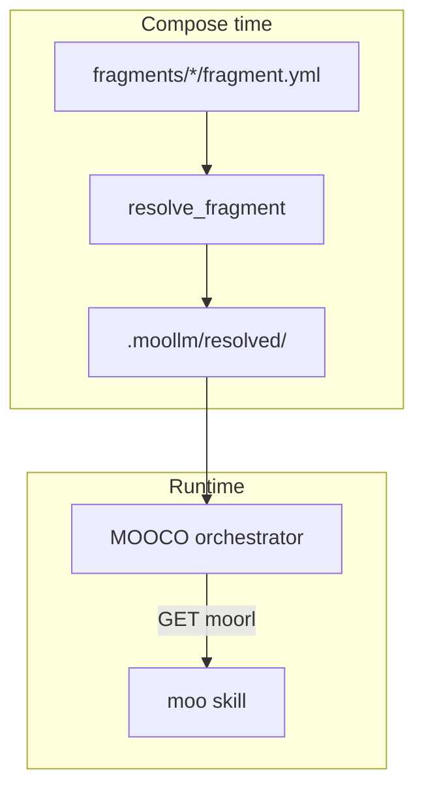
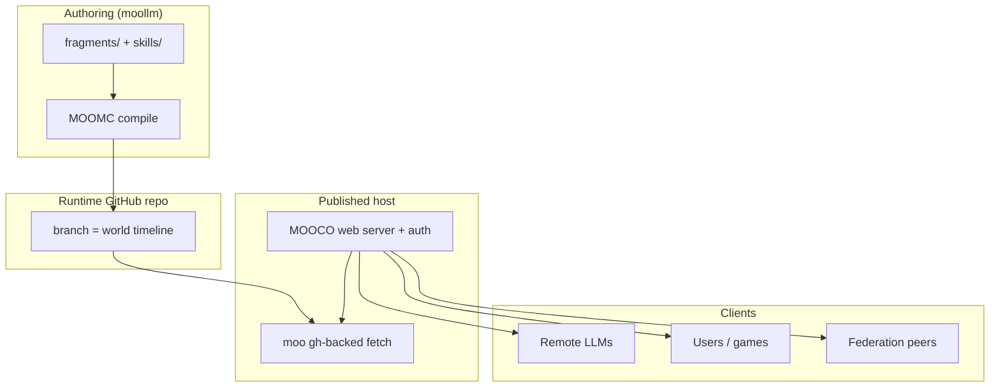

# Prototype Fragment Configuration — Self-ish Composition for MOOLLM

**Status:** Proposed design (May 2026)  
**Lineage:** Self prototypes, Pantomime JSON mixins, MOOLLM `parents:` / `PROTOTYPES.yml`  
**Related:** [SELF-ISH-INFLUENCES.md](SELF-ISH-INFLUENCES.md), [MOOFS-DESIGN.md](MOOFS-DESIGN.md), [MOOCO-MANIFESTO.md](MOOCO-MANIFESTO.md), [skills/prototype/](../skills/prototype/)

---

## What this is

A **prototype-based configuration system** for MOOLLM runtimes: small JSON/YAML **fragments** that declare `parents: []`, merge in order, and optionally carry **co-located scripts and templates** in the same directory — directory-as-package, scripts-as-methods.

A deployable **session profile**, **workspace**, or **adventure runtime** is not one monolithic config file. It is a **leaf prototype** that lists other prototypes as parents. A resolver walks the graph, deep-merges slots, materializes referenced files, and writes one flat artifact for the orchestrator (or for a shell-based Cursor loop).

**Add a capability** = drop a fragment directory + name it in `parents`. No copy-paste drift across “shapes.”

This generalizes a pattern that already proved itself twice:

1. **Pantomime** (Unity AR/VR, years ago) — JSON mixin composition for app conifguration, plug-in objects, *and* per-platform build targets from the same grammar.
2. **Industrial fleet deployments** (private prototype) — VM images built from `container-`*, `mixin-*`, `profile-*`, `image-*` fragments with a Python resolver, RFC 7386 merge, and compile-time materialization.

MOOLLM should adopt the **mechanics**, not the fleet-specific names.

---

## Self mapping (the “why”)


| Self concept                   | Fragment config                                               |
| ------------------------------ | ------------------------------------------------------------- |
| Object / prototype             | `fragment.yml` in `fragments/<id>/`                           |
| Slots                          | JSON/YAML keys (`tools`, `providers`, `mounts`, `k_lines`, …) |
| Parent slots (ordered, plural) | `"parents": ["profile-base", "mixin-mirror", …]`              |
| Traits / shared behavior       | `mixin-`*, `bundle-*`, `service-*` fragments                  |
| Copy-down                      | Resolver flattens graph at **compose time**                   |
| Dynamic inheritance            | **Instance overlay** at session/adventure start (second pass) |


Build **compiles**; runtime **reads** the flat result. The running orchestrator does not walk parent links per request — same payoff as baking a VM image once.

See [skills/prototype/README.md](../skills/prototype/README.md) for how MOOLLM already uses prototype delegation in skills and characters.

---

## What MOOLLM already has (partial)


| Mechanism                        | Where                                                     | Gap                                                         |
| -------------------------------- | --------------------------------------------------------- | ----------------------------------------------------------- |
| Skill `parents:` with modulation | `CARD.yml`, `CHARACTER.yml`                               | Semantic inheritance, not runtime merge                     |
| `PROTOTYPES.yml` ordered parents | characters, adventures                                    | No resolver + materialization                               |
| MOOFS overlay stack              | [MOOFS-DESIGN.md](MOOFS-DESIGN.md)                        | File layers, not JSON fragment graph                        |
| moocroworld `REPOS.yml`          | `skills/moocroworld/`                                     | Repo list, not composable session config                    |
| Attention-tree overlays          | `moo focus`                                               | Fetch graph, not config merge                               |
| **Moorl + seek expressions**     | [skills/moo/](../skills/moo/) (`moo read`, `moo resolve`) | Can **point at literal fragments** today; no merge walk yet |
| Per-event cascade (analog)       | pipeline metadata ⊕ group ⊕ camera                        | Same *compose-don’t-copy* idea at a different layer         |


### Fragments are URL-addressable (already)

A config fragment is just a file (plus sibling scripts). **Moo URLs** and ordinary URLs with **seek expressions** already reach into them — no special resolver required to *fetch*:

```text
moollm://SimHacker/moollm/main/fragments/session-outreach-draft/fragment.yml
moollm://SimHacker/moollm/main/fragments/mixin-no-ai-slop/fragment.yml#tools/allow
moo://Config_Session_42/fragment.yml#parents/1
file:///workspace/fragments/profile-adventure-host/fragment.yml#k_lines/seed/0
https://raw.githubusercontent.com/…/fragment.yml#providers/default/model
```


| Address form           | Seek (`#…`, `-k`, `-L`)                 | Use                                                  |
| ---------------------- | --------------------------------------- | ---------------------------------------------------- |
| `moollm://` moorl      | `#key/path`, `#path:L3-L10`             | Remote fragment + drill into a slot                  |
| `moo://` moorl         | same                                    | Branch-as-object config (e.g. `Issue_*`, `Config_*`) |
| `file://` / local path | `--key`, `-L` on `moo read`             | Checked-out fragment tree                            |
| `https://`             | CLI `--key` only (no moorl query magic) | Published or raw upstream copy                       |


`moo resolve` parses the moorl; `moo read` returns the whole file or one slot via seek. MOOCO `GET moollm://…#parents/0` is the same operation with audit.

**What’s still missing:** walking `parents: []` recursively, registry merge, and materializing co-located scripts into `.moollm/resolved/`. Fetch ≠ compose — but **pointers to fragments can be moorls**, not only bare ids like `mixin-no-ai-slop`.

```yaml
# fragment.yml — parents as ids OR moorls
parents:
  - mixin-no-ai-slop                                    # local id (resolver looks under fragments/)
  - moollm://SimHacker/moollm/main/fragments/service-moo-fetch/fragment.yml
  - moollm://SimHacker/micropolis/main/fragments/workspace-design-docs/fragment.yml#mounts/skills
```

Fragment config **unifies** the runtime side: one resolver, one grammar, many leaf types — with **moorls as first-class fragment addresses** alongside directory ids.

### Nested prototypes — witting and unwitting

A **parent** does not have to live in `fragments/<id>/fragment.yml`. Prototype-shaped objects can appear **anywhere**:


| Kind                      | Where                                                       | How resolver finds it                                                                 |
| ------------------------- | ----------------------------------------------------------- | ------------------------------------------------------------------------------------- |
| **Witting**               | `fragment.yml`, dedicated config leaf                       | `parents: [id]` or full moorl                                                         |
| **Unwitting**             | `CARD.yml`, `CHARACTER.yml`, adventure metadata, game packs | Seek into file: `#parents/0`, `#session/fragments/2`                                  |
| **Embedded**              | Nested YAML/JSON inside another object                      | Seek chain continues: `#overrides/providers/default` then that value is another moorl |
| **Compressed / Archived** | `.gz .zip`, `.tgz`, .tar, `.tar.gz`, `.iff`, `.far`, …      | Path crosses archive boundary before seek                                             |


**Any object** can participate — deliberately authored as a fragment, or incidentally prototype-shaped because MOOLLM already uses `parents:` on skills and characters. The resolver does not require a `fragments/` prefix; it requires a **resolvable address** and mergeable slots.

```yaml
# Witting — top-level fragment leaf
# fragments/session-outreach/fragment.yml
parents:
  - profile-outreach-writer
  - moollm://SimHacker/moollm/main/skills/no-ai-slop/CARD.yml#parents

# Unwitting — skill card already IS a prototype object
# skills/cursor-mirror/CARD.yml
parents:
  - skill
  - debugging
  - moollm://SimHacker/moollm/main/fragments/mixin-mirror-cursor/fragment.yml
```

A session leaf can inherit from a **character file**, a **skill CARD**, or a **zip entry** without copying them into `fragments/`.

### Extended URLs — content-aware seek

MOOCO and moo share one **seek expression** grammar: slash-separated path segments after `#` (plus optional `:L3-L10` line suffix). The **handler** changes by **suffix and container type** at each step — same path syntax, different drill implementation.

```text
URL path                          seek (#…)                    handler
─────────────────────────────────────────────────────────────────────────
…/fragment.yml                    #parents/1                   YAML → dict walk
…/CARD.yml                        #parents/0/modulate          YAML + string slot
…/config.json                     #tools/allow/2               JSON array index
…/docs/guide.md                   #:L10-L40                    line range
…/assets/ui.pack.zip              #skins/button.json           zip member → JSON
…/assets/ui.pack.zip              #skins/button.json#parents   zip → file → YAML seek
…/catalog.iff                     #PTHR/0x0042/traits/speed    IFF chunk catalog (when supported)
…/sprites.far                     #images/12/metadata          FAR archive table (when supported)
```

**Rule:** path segments before `#` select the **outer resource** (repo file or archive member). Each `#` begins seek **inside** the resource selected by the path so far. Nested archives and structured interiors chain left-to-right — one consistent address bar, like a file manager with transparent archives.


| Suffix / container        | Seek behavior                                                     |
| ------------------------- | ----------------------------------------------------------------- |
| `.yml`, `.yaml`, `.json`  | Parse → walk keys; numeric segment = array index                  |
| `.md`, `.txt`, `.py`, …   | Line seek `:Lstart-Lend`; optional future AST sniff               |
| `.zip`, `.jar`            | Path segment = member name; then suffix rules apply inside        |
| `.tgz`, `.tar.gz`, `.tar` | Same as zip after decompress layer                                |
| `.iff`, `.far`            | Format-specific catalog (game/asset heritage); chunk/index seek   |
| opaque binary             | No seek unless registered handler; return bytes or sniff skeleton |


**Orchestrator contract:** `GET <extended-url>` = parse path + seek chain → fetch outer bytes (moo/gh/file) → dispatch handler by suffix → return sub-object or transformed view (`sniff`, `glance`, raw). Same parser for `parents:` resolution and LLM browser tabs.

```text
moollm://SimHacker/moollm/main/skills/adventure/CARD.yml#parents/2
moollm://SimHacker/micropolis/main/assets/tiles.pack.zip/tileset.json#variants/0/parents
moollm://SimHacker/moollm/main/examples/adventure-4/characters/real-people/don-hopkins/CHARACTER.yml#parents/1/import
file:///vault/Pantomime/BuildTargets/android.json#parents/0/plugins/physics
```

**Plugin extension:** new suffixes register a **seek adapter** (like moo’s per-type sniff). MOOLLM game stacks add `.iff`/`.far`; federation adds soul-file XML inside zip; Pantomime-style build JSON adds nested `parents` under `plugins/`. One path language; many handlers.

**What moo does today:** YAML/JSON slash-seek and line ranges on moorls. **What MOOCO + resolver add:** archive traversal, embedded-object parent discovery, merge walk starting from any resolved sub-tree.

---

## Fragment taxonomy (MOOLLM grammar)

Names are conventions (big-endian: `kind-role-detail`):


| Prefix            | Role                                                       | Example (fictional)                                      |
| ----------------- | ---------------------------------------------------------- | -------------------------------------------------------- |
| `**service-*`**   | One bounded capability (tool pack, provider block, mirror) | `service-cursor-mirror`, `service-moo-fetch`             |
| `**mixin-***`     | Swappable cross-cutting driver                             | `mixin-auth-none`, `mixin-tls-local`, `mixin-no-ai-slop` |
| `**bundle-***`    | Curated set of services/mixins                             | `bundle-federation-read`, `bundle-debug-trace`           |
| `**profile-***`   | Reusable role base                                         | `profile-adventure-host`, `profile-outreach-writer`      |
| `**session-***`   | Runnable orchestrator session leaf                         | `session-micropolis-design-review`                       |
| `**workspace-***` | Mount + namespace composition                              | `workspace-moollm-plus-micropolis`                       |
| `**target-***`    | Publish/deploy artifact (compose target)                   | `target-docker-dev`, `target-static-docs`                |


Fleet deployments used `container-*` and `image-*`; MOOLLM uses **session** and **workspace** leaves because the “machine” is often a **MOOCO session** or a **Cursor shell loop**, not always a VM.

---

## Directory-as-package

Each fragment lives in its own directory:

```text
fragments/
  mixin-mirror-cursor/
    fragment.yml          # declarative slots
    scripts/
      warm-cache.sh       # imperative payload (methods)
    templates/
      tool-policy.json.tmpl
  profile-adventure-host/
    fragment.yml
    parents: [service-moo-fetch, bundle-debug-trace]
  session-sunny-street-draft/
    fragment.yml
    parents: [profile-outreach-writer, mixin-auth-none, workspace-moollm-plus-micropolis]
```

- **Slots** — what to enable, which parents, mount URLs, k-line seeds, provider model.
- **Co-located files** — scripts the resolver copies or renders into the materialized tree.
- **General-purpose graph** — the resolver does not care what scripts do; fragments decide at use time.

---

## Resolver mechanics (proposed)

Mirrors the proven two-pass pattern:

### Pass 1 — Type composition (`parents[]`)

1. **Resolve leaf** — load by id (`fragments/<id>/`), moorl, or extended URL (including seek into unwitting host file).
2. For each parent entry **in order**:
  - bare id → `fragments/<id>/`
  - moorl / URL → fetch outer resource → optional seek → if result has `parents`, recurse; else treat result as prototype slots to merge
  - nested reference inside merged object → enqueue if value matches moorl or id pattern
3. Merge **leaf** keys on top.
4. Detect cycles (track normalized canonical URLs); strip authoring keys (`parents`, `id`, `notes`, `_provenance`).

Parent entries are **references to prototype objects**, not only references to fragment directories. A parent may be the whole of `skills/foo/CARD.yml` or only `#parents/0` inside it.

### Pass 2 — Instance overlay

Layer optional overrides:

- Adventure-specific `overlay.yml`
- Room/character session shard (see cascade below)
- CLI `--parents` / inline JSON for one-off runs

### Merge semantics


| Slot kind                                                 | Rule                                              |
| --------------------------------------------------------- | ------------------------------------------------- |
| Scalars                                                   | Child wins (RFC 7386 JSON Merge Patch)            |
| `null` in patch                                           | Delete key                                        |
| Registry maps (`tools`, `mounts`, `providers`, `scripts`) | Merge by **id**; child overrides same id          |
| Arrays (unordered)                                        | Replace entire array unless schema says otherwise |
| `parents`                                                 | Authoring only — stripped from output             |


**Executable spec:** unit tests are the contract (as with any serious resolver). A future `skills/prototype/scripts/resolve_fragment.py` or `@moollm/fragment-resolver` package.

### Materialization

Referenced `resources.scripts`, `resources.templates`, etc. are gathered from **every ancestor directory**, deduplicated by id, written to a flat tree:

```text
.moollm/resolved/<session-id>/
  fragment.resolved.yml
  fragment.provenance.json    # which ancestor contributed each key/file
  scripts/
  templates/
```

Runtime reads only this tree — not the fragment graph.

---

## Philosophy: manifest as intent, fragments as evidence

- **Manifest** (leaf `session-`* or `workspace-*`) states **intent**: “I am an outreach drafting session with federation read mounts and cursor mirror.”
- **Fragments** are **evidence**: small, testable, reviewable pieces that justify each slot value.
- **Provenance** file records the ancestry chain — essential for audit (`--why` on tools, MOOCO session traces).

An LLM browsing MOOCO can `GET` provenance the same way it reads CARD.yml: *why does this session have `mixin-no-ai-slop`?* → parent chain points at the fragment and its README.

---

## Cascade at another layer (per-turn / per-event)

Separate from fragment graphs but **same spirit**: deep-merge policy along a **scope chain** (broad → narrow):

```text
workspace.defaults
  ⊕ adventure.metadata.session
  ⊕ room.metadata.session
  ⊕ character.metadata.session
  ⊕ turn.overlay
```

Example (fictional Micropolis design review):


| Layer                              | Adds                                               |
| ---------------------------------- | -------------------------------------------------- |
| `workspace-moollm-plus-micropolis` | mounts `moollm://`, `MicropolisCore/documentation` |
| `adventure.metadata`               | k-lines: `procedural-rhetoric`, `tile-renderer`    |
| `room.control-room`                | tools: `mooco-mirror` only                         |
| `character.don-hopkins`            | tone: concise, no scheduling in public drafts      |
| turn                               | `--why`: "check federation-peer-games grading"     |


This is the MOOLLM equivalent of **camera_group ⊕ camera ⊕ payload** pipeline cascades — different domain, identical *compose-don’t-copy* rule. One resolver family can serve both with different slot schemas.

---

## MOOLLM examples (end-to-end)

### Example A — Outreach writer session

```yaml
# fragments/session-public-letter-draft/fragment.yml
id: session-public-letter-draft
parents:
  - profile-outreach-writer
  - mixin-mirror-cursor
  - workspace-moollm-plus-micropolis
notes:
  - "Draft public outreach; no private fleet refs"
```

```yaml
# fragments/profile-outreach-writer/fragment.yml
parents: [bundle-federation-read, mixin-no-ai-slop]
providers:
  default: { model: claude-sonnet, temperature: 0.4 }
k_lines:
  seed: [federation, procedural-rhetoric, sunny-street]
tools:
  allow: [skill_manager, moo_read, fs_read]
```

```yaml
# fragments/mixin-mirror-cursor/fragment.yml
tools:
  mirror-cursor:
    enabled: true
    why_required: true
resources:
  scripts:
    warm-cache: { path: scripts/warm-cache.sh, materialize: scripts/warm-cache.sh }
```

Resolved once at session start → MOOCO loads flat config → `GET moollm://…` delegated to **moo** skill.

### Example B — Adventure host (game jam)

```yaml
# fragments/session-adventure-jam/fragment.yml
parents:
  - profile-adventure-host
  - service-moo-fetch
  - mixin-auth-none
mounts:
  skills: moollm://SimHacker/moollm/main/skills/adventure
```

### Example C — Static docs target

```yaml
# fragments/target-static-docs/fragment.yml
parents: [bundle-site-export]
publish:
  renderer: mdbook
  output: dist/docs/
```

---

## How this composes with MOOCO and moo




| Concern                                    | Owner                                                |
| ------------------------------------------ | ---------------------------------------------------- |
| Fragment graph + merge + materialize       | **Fragment resolver** (proposed)                     |
| Extended URL parse + content-aware seek    | **MOOCO** (or shared `@moollm/seek` lib used by moo) |
| Remote outer fetch (`moollm://`, branches) | **moo** (shipped)                                    |
| Local file overlays                        | **MOOFS**                                            |
| Skill/character semantic parents | `CARD.yml` / `PROTOTYPES.yml` (existing) |

MOOCO should **load resolved fragment output**, not reimplement merge. Cursor-only workflows can run `resolve_fragment session-…` once and point tools at `.moollm/resolved/`.

---

## Pantomime lesson — and beyond session shapes

Pantomime composed **objects** and **build targets** from the same JSON mixin vocabulary — plug-ins carried their own assets; platform variants were parent lists, not forks. It stayed simple under multi-product multi-platform multi-player Unity complexity.

Fragment config applies that lesson first to **LLM session shapes**:

| Pantomime | MOOLLM (local) |
|-----------|----------------|
| Build target | `session-*`, `workspace-*` leaf |
| Plug-ins | `mixin-*`, `service-*`, `bundle-*` |
| Binary output | `.moollm/resolved/` config + materialized scripts |

The same grammar scales up to **published microworlds**:

| Pantomime | MOOLLM (hosted) |
|-----------|-----------------|
| Build target | **MiniMOO runtime repo** on GitHub (separate from moollm content) |
| Plug-ins | Same fragment parents — skills, mounts, auth, mirrors |
| Binary output | Running MOOCO server + branch timeline + optional VM/container image |

### MiniMOO runtime repos (MOOMC)

**MOOMC** (MOOLLM Meta Compiler) **generates and edits** dedicated **runtime GitHub repos** — distilled from moollm skills/designs into something a MiniMOO-shaped server can boot. Not a fork of the whole moollm corpus; a **compiled slice**: resolved fragments, materialized scripts, room/skill mounts, provider config.

```text
moollm (content)          MOOMC compile           runtime-micropolis-adventure (repo)
  fragments/       ──►    resolve + seek    ──►     branch: World_2026-05-25/
  skills/                                           MOOCO manifest + moorl roots
  designs/                                          session default fragment
```

Authors edit fragments in moollm (or moorl-seek into skill CARDs); MOOMC **publishes** or **updates** the runtime repo. The runtime repo is the **artifact** — like Pantomime’s per-platform build folder, but versioned on GitHub.

### Branch as timeline — the microworld on GitHub

A hosted microworld’s **state history** lives on a **Git branch** — the same moocroworld model as `Issue_42` / `Character_Don`, extended to whole worlds:

```text
moollm://SimHacker/runtime-sunny-street/World_Main/timeline/turn-0042/event.yml
moollm://SimHacker/runtime-sunny-street/World_Main/rooms/town-square/objects.yml
```

- **Branch** = world identity + timeline fork
- **Commits** = durable turns (events, object mutations, session traces)
- **Files on branch** = current world state the LLM-browser can `GET`
- **moo** fetches without a local clone; MOOCO serves with auth and policy

Other agents do not need your laptop. They need the **published endpoint** and permission to read/write the branch timeline they are invited to.

### Virtual hosting and simulation

**Virtual hosting** — one MOOCO deployment runs **many** resolved session/world shapes. Each `target-*` fragment selects a runtime repo + branch + default overlay. Same host, different microworlds — like virtual hosts in HTTP, but the document root is a **moorl namespace** and a branch timeline.

**Simulation** — worlds can run **fully hosted** (MOOCO + DB + published API) or **locally simulated** (Cursor shell + `moo read`/`write` against a branch without publishing). Fragment config describes both; `target-local-dev` vs `target-hosted-public` are parent swaps.

### Published MOOCO on the web (with auth)

The orchestrator is not only for one IDE session. A resolved `session-*` or `target-hosted-*` fragment can **publish** MOOCO as a **web protocol endpoint**:

```text
https://worlds.example.com/sunny-street/v1/GET moollm://…/rooms/town-square
https://worlds.example.com/sunny-street/v1/INVOKE skill/adventure/enter-room
```

| Audience | Access |
|----------|--------|
| Human browser / client | Authenticated UI (Svelte chat, game shell) |
| Remote LLM | Same GET/INVOKE protocol — LLM-as-browser tab pointed at your world |
| Other servers | MCP or HTTP facade; federation peer read of branch timeline |
| Owner / wizard | Write branch, merge fragments, MOOMC republish |

**Auth** is a `mixin-auth-*` fragment (`mixin-auth-firebase`, `mixin-auth-token`, `mixin-auth-none` for dev). Auth gates **write** and **sensitive read**; public read of published lore/docs may stay open by policy.

The microworld is **inspectable**: branch history is the audit log; `--why` on invocations is the session log; fragments are provenance.



---

## Implementation sketch

| Phase | Deliverable |
|-------|-------------|
| **0** | This design doc + examples under `designs/examples/fragments/` (optional) |
| **1** | `resolve_fragment` + seek handler registry (yaml/json/zip first; iff/far later) |
| **2** | `fragments/` in moollm; parents via moorl seek into skill CARDs |
| **3** | MOOCO loads `.moollm/resolved/` at session start |
| **4** | Per-turn cascade in adventure/room metadata |
| **5** | **MOOMC** — distill moollm → MiniMOO **runtime GitHub repo** |
| **6** | **target-hosted-*** fragments — publish MOOCO + auth mixin |
| **7** | Branch timeline read/write protocol for remote LLMs and federation peers |


Place resolver near [skills/prototype/](../skills/prototype/) — the skill that already owns the Self delegation story.

CLI (proposed):

```bash
python skills/prototype/scripts/resolve_fragment.py session-public-letter-draft
python skills/prototype/scripts/resolve_fragment.py session-public-letter-draft \
  --overlay adventures/outreach/overlay.yml
```

---

## Anti-patterns


| Avoid                                          | Prefer                                      |
| ---------------------------------------------- | ------------------------------------------- |
| One 2000-line `mooco.config.json` per customer | Leaf session + shared parents               |
| Copy-paste TLS/auth blocks                     | `mixin-*` swap                              |
| Runtime parent walking                         | Compose at session start                    |
| Fleet-specific names in public moollm          | MOOLLM grammar (`session-*`, `workspace-*`) |
| Undocumented merge rules                       | Tests as spec                               |


---

## See also

- [SELF-ISH-INFLUENCES.md](SELF-ISH-INFLUENCES.md) — objects, delegation, k-lines
- [MOO-HERITAGE.md](MOO-HERITAGE.md) — `parents:` modulation in skills
- [MOOCO-MANIFESTO.md](MOOCO-MANIFESTO.md) — orchestrator as published protocol endpoint
- [MOOCO-MOO-VM.md](MOOCO-MOO-VM.md) — moo as remote fetch engine; branch-as-object timelines
- [MOOCO-MOO-CUSTOM-ORCHESTRATOR.md](MOOCO-MOO-CUSTOM-ORCHESTRATOR.md) — LLM-as-browser, GET/INVOKE for remote agents
- [MOOPMAP.md](MOOPMAP.md) — GLANCE pyramid (resolution levels for context, analogous to merge depth)
- [skills/moocroworld/](../skills/moocroworld/) — branches as objects, moorls, mooniverse config

---

*"The point is moot, but the fragments are real."*