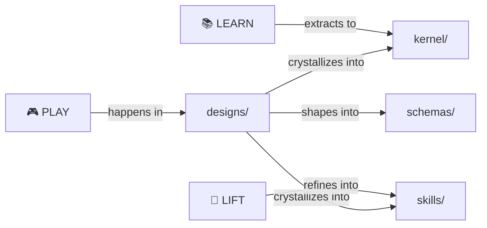

# Designs

> *Raw source material and historical archives.*

Where ideas are born before they crystallize.

> [!NOTE]
> **This is the PLAY archive.** Raw material that crystallized into kernel and skills. Read for context, not for current specs.

---

## 🗺️ You Are Here

```
moollm/
├── README.md           ← Project entrance
├── PROTOCOLS.yml       ← Symbol index
├── kernel/             ← Core protocols (refined)
├── skills/             ← Userland protocols (refined)
├── schemas/            ← Data formats (refined)
└── designs/            ← YOU ARE HERE (the archives)
    ├── README.md       ← This file
    └── *.md, *.txt     ← Raw material
```

---

## Purpose

This directory contains:

- **Early drafts** before crystallization
- **Chat transcripts** with valuable ideas
- **Design explorations** that informed the system
- **Historical context** for archaeology

These files are **not polished documentation**.  
They're the messy workshop where ideas are forged.

---

## What Lives Here

| File | Contains |
|------|----------|
| [MOOLLM-MANIFESTO.md](./MOOLLM-MANIFESTO.md) | Original philosophical vision |
| [MOOLLM-PROTOCOLS.md](./MOOLLM-PROTOCOLS.md) | Early protocol experiments |
| [kilroy-ideas.md](./kilroy-ideas.md) | Synergy with Chuck Shotton's Kilroy |
| [chuck-shotton-chat.txt](./chuck-shotton-chat.txt) | Raw conversation transcript |
| [constitution-design-summary.md](./constitution-design-summary.md) | Constitution evolution |
| [constitution-design.txt](./constitution-design.txt) | Raw constitution notes |
| [moollm-design.txt](./moollm-design.txt) | Original design scratchpad |

---

## The PLAY-LEARN-LIFT Journey

```
PLAY (here, in designs/)
  ↓
LEARN (extract patterns)
  ↓
LIFT (crystallize into kernel/, skills/)
```

These files are the **PLAY** phase — messy exploration.

The refined results live in [kernel/](../kernel/) and [skills/](../skills/).

---

## Mining for Ideas

When you find something valuable here:

1. **Don't delete it** — preserve the journey
2. **Extract the insight** — what's the core idea?
3. **Crystallize it** — add to appropriate kernel/ or skills/
4. **Link back** — reference the origin for archaeology

Per [PRESERVE-JOURNEY](../PROTOCOLS.yml): the path to the solution IS the value.

---

## Key Insights Extracted

| From | Became |
|------|--------|
| MOOLLM-MANIFESTO.md | [PROTOCOLS.yml](../PROTOCOLS.yml) symbols |
| kilroy-ideas.md | [ITS-ABOUT-TIME](../PROTOCOLS.yml), [PLAY-LEARN-LIFT](../PROTOCOLS.yml) |
| constitution-design | [kernel/constitution-core.md](../kernel/constitution-core.md) |

---

## The Intertwingularity

Designs are the attic. Raw material before crystallization.



---

## Navigation

| Direction | Destination |
|-----------|-------------|
| ⬆️ Up | [Project Root](../) |
| 📖 Quick | [QUICKSTART.md](../QUICKSTART.md) |
| 🔧 Sibling | [kernel/](../kernel/) — Where ideas crystallize |
| 🎭 Sibling | [skills/](../skills/) — Where ideas become usable |
| 📐 Sibling | [schemas/](../schemas/) — Where shapes are defined |
| 📋 Symbols | [PROTOCOLS.yml](../PROTOCOLS.yml) — K-line index |
