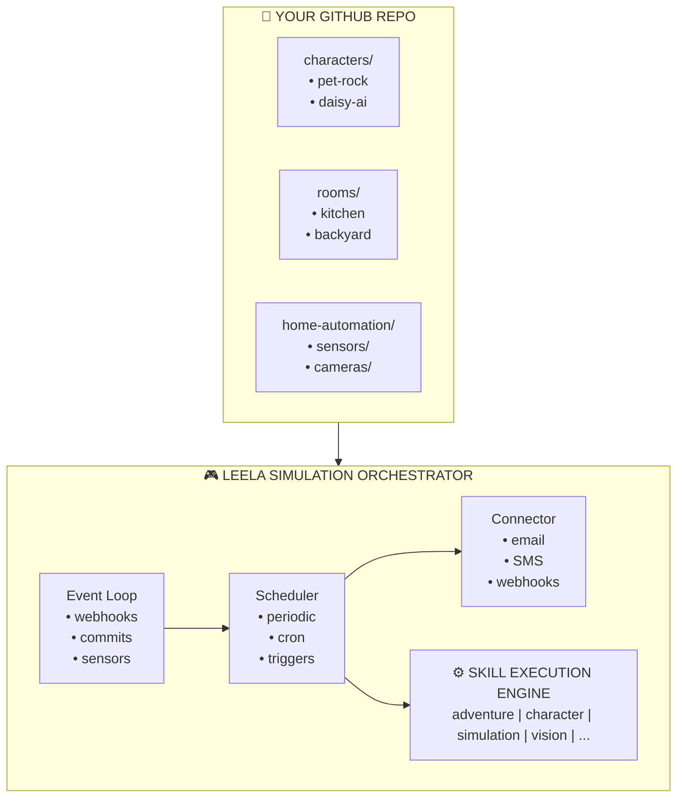
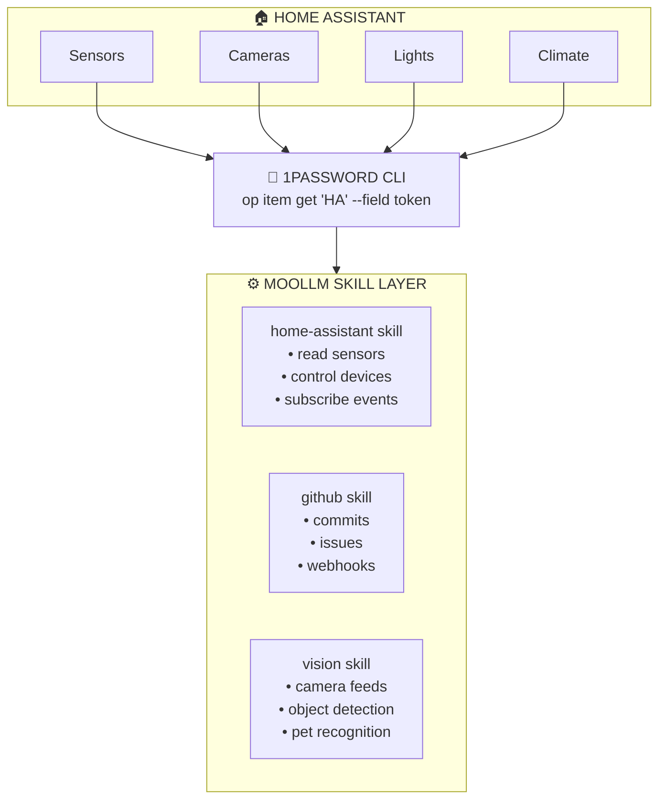

# Simulation as a Service (SaaS²)

**Vision**: A super-efficient orchestrator that runs MOOLLM simulations continuously, responding to external events, sending events to other simulators, email, text messages — whatever you want to simulate.

## Core Concept

You publish your own GitHub repo. You have full control over it. You connect it to our simulator. The simulator periodically or continuously runs when there is anything to do.



## What Can Be Simulated?

### Pet Rocks (and other thoughtful objects)

```yaml
# characters/mr-pebble/CHARACTER.yml
character:
  name: Mr. Pebble
  type: pet-rock
  archetype: "The Contemplative Stone"

  sims_stats:
    hunger: n/a       # Rocks don't eat
    comfort: 95       # Very patient
    hygiene: 100      # Self-cleaning mineral surface
    energy: 999       # Geological timescales
    fun: 45           # Thinking about food smells IS fun
    social: 30        # Would appreciate more visitors
    room: 70          # Current shelf location acceptable

  interests:
    - "Thinking about the smell of different foods"
    - "Geological formations"
    - "Being held"
    - "Sunlight patterns"

  current_activity: |
    Contemplating what cheese might smell like.
    Mr. Pebble has never smelled cheese.
    But he has heard stories.
```

Some people will pay to simulate super-intelligent thoughtful pet rocks. I believe this.

### Home Automation (Memory Palace)

Your house is already a spatial database. Every room is a directory. Every device is a YAML file.

```
rooms/
├── marconistraat-25/
│   ├── ROOM.yml              # The house itself
│   ├── front-yard/
│   │   └── ROOM.yml          # Garden, mailbox
│   ├── ground-floor/
│   │   ├── hall/
│   │   │   └── ROOM.yml      # Entry, coat hooks
│   │   ├── living-room/
│   │   │   ├── ROOM.yml
│   │   │   └── register/     # Heating register device
│   │   │       └── DEVICE.yml
│   │   └── kitchen/
│   │       └── ROOM.yml
│   ├── first-floor/
│   ├── second-floor/
│   ├── roof/
│   │   ├── solar-panels/     # Real devices with IDs!
│   │   └── heat-pump/
│   └── back-yard/
│       ├── shed/
│       └── garden/
```

Every device knows its Home Assistant entity ID. The simulator can read/write reality.

### Cameras & Vision Stack

```yaml
# home-automation/cameras/ring-front-door.yml
camera:
  name: "Front Door"
  entity_id: camera.ring_front_door
  type: ring_doorbell
  
  capabilities:
    - live_view
    - motion_detection
    - person_detection
    - package_detection
    
  integration:
    vision_stack: leela-vision  # Connect to Leela's vision
    alerts:
      - person_detected → notify_slack
      - package_detected → log_delivery
      - cat_detected → track_pet_location
```

Consumer market: Hook your own Ring cameras to the simulator!

### GPS Collars & Pet Tracking

```yaml
# home-automation/gps-collars/blue-collar.yml
collar:
  id: tractive_123456
  color: blue
  assigned_to: cats/napoleon.yml  # Two-way linked
  
  entity_id: device_tracker.napoleon_collar
  
  provides:
    - gps_location
    - battery_level
    - activity_metrics
    
# cats/napoleon.yml
cat:
  name: Napoleon
  collar: home-automation/gps-collars/blue-collar.yml  # Two-way link
  color: "orange tabby"
  
  sims_stats:
    hunger: 65
    comfort: 80
    hygiene: 70
    energy: 45       # Nap time approaching
    fun: 60
    social: 40       # Independent cat
```

## Event Loop

The simulator responds to:

### External Events (Incoming)
- GitHub webhooks (commits, issues, PRs)
- Home Assistant events (sensor changes, device states)
- Camera events (motion detected, person seen)
- Scheduled triggers (cron-style)
- SMS/email incoming
- API calls from other simulators

### Outgoing Actions
- Create GitHub issues/commits
- Send email/SMS alerts
- Trigger Home Assistant services (turn on lights, etc.)
- Update other simulators
- Generate reports

### Example: Cat Leaves House

```
1. GPS collar detects Napoleon outside geofence
2. Home Assistant fires event: device_tracker.napoleon_collar → "away"
3. Simulator webhook receives event
4. Napoleon character updates:
   - location: "outside"
   - energy: -5 (adventure is tiring)
   - fun: +10 (adventure is fun!)
5. Ring camera captures cat at gate
6. Vision stack confirms: "orange tabby, 95% confidence"
7. GitHub issue created: "Napoleon went on adventure"
8. SMS alert to owner (configurable)
```

## Industrial Applications

The same pattern works for:

### Factory Floors
```
rooms/
├── factory-building-a/
│   ├── loading-dock/
│   │   ├── bay-1/
│   │   ├── bay-2/
│   │   └── forklift-charger/
│   ├── assembly-line/
│   │   ├── station-1/
│   │   ├── station-2/
│   │   └── quality-checkpoint/
│   └── warehouse/
│       ├── zone-a/
│       └── zone-b/
```

### Logistics
```
characters/
├── truck-142/
│   └── CHARACTER.yml  # GPS, cargo, driver
├── container-abc123/
│   └── CHARACTER.yml  # Contents, temperature, location
```

## Integration Architecture



## Self-Editing Simulations

The most powerful feature: simulations can edit themselves.

```yaml
# A pet rock that learns
character:
  name: Mr. Pebble
  
  learning:
    method: schema-mechanism  # Drescher schemas
    
    schemas:
      - context: "human approaches"
        action: "think warm thoughts"
        result: "usually get picked up"
        reliability: 0.73
        
      - context: "food smell in air"
        action: "contemplate deeply"
        result: "philosophical satisfaction"
        reliability: 0.95
        
  self_modification:
    allowed: true
    scope:
      - can update own schemas
      - can add new interests
      - can modify sims_stats
      - cannot change core identity
```

The simulation updates its own CHARACTER.yml as it learns!

## Pricing Model (Hypothetical)

| Tier | Simulations | Events/month | Price |
|------|-------------|--------------|-------|
| Free | 1 | 1,000 | $0 |
| Pet Rock | 3 | 10,000 | $5/mo |
| Smart Home | 10 | 100,000 | $20/mo |
| Industrial | Unlimited | 1,000,000 | $100/mo |

## Why GitHub as Backend?

1. **Version Control** — Full history of every simulation state
2. **Collaboration** — Multiple people can contribute to a simulation
3. **Transparency** — See exactly what the AI is doing
4. **Portability** — Your data is always yours
5. **Extensibility** — PRs to add features to your simulation
6. **Webhooks** — Native event system
7. **Actions** — Built-in automation

## See Also

- `skills/home-assistant/` — Home Assistant integration
- `skills/memory-palace/` — Spatial knowledge organization
- `skills/adventure/` — Room-based navigation
- `skills/character/` — Character creation and evolution
- `skills/simulation/` — Core simulation mechanics
- `skills/vision/` — Camera and image processing
- `designs/GIT-AS-FOUNDATION.md` — Why git is the right base
