# ⚡ Speed of Light vs 🐦 Carrier Pigeon

> **The fundamental architectural divide in AI agent systems.**

---

## The Core Insight

There are two ways to coordinate multiple AI agents:

| Approach | Where Agents Interact | Latency | Precision | Cost |
|----------|----------------------|---------|-----------|------|
| **Carrier Pigeon** | BETWEEN LLM calls | 500ms+ per hop | Degrades each hop | High (re-tokenize everything) |
| **Speed of Light** | DURING one LLM call | Instant | Perfect | Low (one call) |

**MCP is Carrier Pigeon.** Every tool call stops generation, waits for external response, starts a new completion. N tool calls = N round-trips.

**MOOLLM Skills are [Speed of Light](../skills/speed-of-light/).** Once loaded into context, skills iterate, recurse, compose, and simulate multiple agents — all within a single generation. No stopping. No serialization.

---

## The Carrier Pigeon Protocol (Anti-Pattern)

```mermaid
flowchart TB
    subgraph CellA["🔒 Agent A's Prison Cell"]
        A1["🖍️ Write on 🧻<br/>with crayon"]
    end
    
    subgraph CellB["🔒 Agent B's Prison Cell"]
        B1["👀 Squint at<br/>smudged crayon 💩"]
    end
    
    subgraph CellC["🔒 Agent C's Prison Cell"]
        C1["🤷 Guess what<br/>they meant... 🤔😵‍💫💀💥"]
    end
    
    A1 -->|"🕊️ Carrier Pigeon<br/>500ms flight"| tokenize1["💥 Tokenization:<br/>precision destroyed"]
    tokenize1 -->|"🦅 Hawks!"| B1
    B1 -->|"🕊️ Carrier Pigeon<br/>500ms flight"| tokenize2["📉 More noise 📢,<br/>🐢 more latency 💩💩💩"]
    tokenize2 -->|"🦅 Hawks!"| C1
    
    style CellA fill:#fee,stroke:#c00
    style CellB fill:#fee,stroke:#c00
    style CellC fill:#fee,stroke:#c00
```



> *"The spirit is willing but the flesh is weak"*
> → *"The vodka is good but the meat is rotten"*

**Each boundary crossing:**
- **+500ms latency** (at minimum)
- **+noise** (tokenization destroys precision)
- **+cost** (re-emit entire context)
- **-coherence** (each agent re-interprets everything)

This is how MCP works. This is how most "agentic" frameworks work. Multiple LLM calls. Orchestrators serializing state. Context windows stuffed with re-explained history. Each agent locked in solitary, guessing what the others meant.

---

## The Speed of Light Protocol

```mermaid
flowchart TB
    subgraph Stage["🎭 The Shared Stage"]
        direction TB
        Alice["🗣️ Alice"] <-->|"⚡ telepathy"| Bob["🗣️ Bob"]
        Alice <-->|"⚡ telepathy"| Carol["🗣️ Carol"]
        Bob <-->|"⚡ telepathy"| Dave["🗣️ Dave"]
        Carol <-->|"⚡ telepathy"| Dave
        Room["🏠 The Room<br/>reacts & updates"]
        Alice --> Room
        Bob --> Room
        Carol --> Room
        Dave --> Room
    end
    
    Note1["🌐 4096+ dimensions<br/>🔗 No serialization<br/>💬 Perfect coherence<br/>♾️ HUNDREDS of turns,<br/>one API call"]
    
    style Stage fill:#efe,stroke:#0a0
```



**Inside the LLM**, there is no latency. There is no serialization. There are no deadlocks. Agents share a context window. They communicate at the speed of neural activation.

One boundary in (user input). One boundary out (final response). Maximum precision preserved. Minimum noise introduced.

---

## Hard Proof: The Numbers

### The Fluxx Experiments

**Phase 1: Organic Emergence** (The 33-Turn Session)

It started informally. After Palm's incarnation ceremony at the pub, the characters gathered around the pie menu table. Someone suggested Fluxx. What happened next wasn't planned — it was **discovered**.

[Full transcript](../examples/adventure-4/characters/real-people/don-hopkins/sessions/marathon-session.md#-day-2--speed-of-light-simulation)

| Metric | Value |
|--------|-------|
| **Total Turns** | 33 |
| **Characters Active** | 12+ (including cats) |
| **Games Played** | 3 rounds of Stoner Fluxx |
| **API Calls** | 1 |
| **Traditional Approach Would Need** | 33+ calls minimum |
| **Latency Saved** | 16+ seconds |

It worked — not just functionally, but *creatively*. The characters played off each other, the cats caused chaos, the game rules bent and flowed. No orchestrator. No agent hand-offs. Just emergent play.

This demanded a harder question: how far can we push it? And how do we *know* it's working? That led to Phase 2: declare our biases, design rubrics, measure fidelity, and iterate rigorously.

**Phase 2: Formal Experiment Design**

After witnessing what emerged organically, we created a new [*experiment* skill](../skills/experiment/), and designed a controlled experiment:

| Component | Description |
|-----------|-------------|
| **Modular Plugin Architecture** | Fluxx expansions as loadable plugins (Stoner, Star, Pirate...) |
| **Refactored Game Engine** | Clean separation: deck, rules, players, dealer, state |
| **FAQ-Fortified Rules** | Edge cases documented, ambiguities resolved |
| **Initial State Files** | `fluxx-run-000.yml` — reproducible starting conditions |
| **Iteration Snapshots** | `fluxx-run-001.yml`, `-002.yml`... full state per turn |
| **Rubrics** | Success criteria, fidelity measures, quality metrics |
| **Analytics** | Harper's numbers, drama scores, teaching effectiveness |

**🎰 The Cosmic Dealer: A Modular Plugin Invention**

The original organic game had no Cosmic Dealer. It was *invented* as part of the Phase 2 modular architecture.

And in true MOOLLM fashion, dealers are **surfaced as playable cards**:

```yaml
card:
  type: meta
  name: "Summon the Cosmic Dealer"
  text: "Activate the Cosmic Dealer plugin. From now on, an invisible force guides card distribution for maximum drama."
  effect: activate_plugin("cosmic-dealer")
  
card:
  type: meta  
  name: "The Karma Accountant"
  text: "THE INVISIBLE HAND. Balance the game. Good deeds rewarded, bad deeds corrected."
  effect: activate_plugin("karma-ledger")

card:
  type: meta
  name: "The Tutor"
  text: "Teach new players. Deal cards that incrementally explain mechanics."
  effect: activate_plugin("tutorial-dealer")

card:
  type: meta
  name: "The Gezelligheid Engine"
  text: "No one left behind. Boost strugglers, headwind leaders. Keep it cozy."
  effect: activate_plugin("gezelligheid-engine")

card:
  type: meta
  name: "The Long Game"
  text: "Infinite play. No one ever truly loses."
  effect: activate_plugin("long-game-dealer")

card:
  type: meta
  name: "The Fellowship Keeper"  
  text: "Detect drift. Deal players back into relevance."
  effect: activate_plugin("fellowship-keeper")
```

**Cards as gamified interfaces.** Play a card to activate a plugin. Everything is playable, everything is an activator.

**Multiple dealers, multiple balls in play.** Blend dealers simultaneously — meta-pinball. FAFO + Karma + Narrative, all interweaving in-context.

**Rule-changing rule changers.** Meta-rules all the way up. The LLM holds the entire stack.

**The Invisible Hand Programming Language.** Natural language DSL for programming fate. Per-player handicaps, dramatic timing curves, mercy thresholds — all configurable in plain English. *Economics called it "the invisible hand." We made it programmable.*

See: [Fluxx Dealer Plugins](../skills/experiment/experiments/fluxx-chaos/engine/DEALER.yml) for full implementation.

The informal game proved it was *possible*. The formal experiment proved it was *reliable* and *measurable*.

### What's Actually Happening In Those Fluxx Runs

The numbers above don't capture the *depth*. Here's what the simulation is tracking **in parallel**:

**🎴 Game Mechanics Layer**
- Base Fluxx rules (draw 1, play 1)
- Dynamically changing rules ("Draw 3", "Hand Limit 2", "Play All")
- [Amsterdam Flux](../skills/experiment/experiments/fluxx-chaos/cardsets/VARIANTS.yml#amsterdam_flux) + [MOOLLM card packs](../skills/experiment/experiments/fluxx-chaos/cards/moollm-tech-pack.yml)
- **Personalized custom cards** generated mid-game and played in the same session
- Dynamic rule creation and modification
- Full deck tracking, shuffling, discard pile
- **Cosmic Dealer**: An invisible force that doesn't just force cards — it **GENERATES NEW CARDS ON THE FLY**

**🃏 Dynamic Card Generation**

The Cosmic Dealer can create entirely new cards mid-game:
- **New Rules** tailored to the current game state
- **New Actions** that reference specific characters by name
- **New Keepers** themed to the situation
- **New Goals** that play on character relationships and history
- **Custom Graphics** described for each generated card
- **Personalized** for specific characters, their history, their conflicts

Example: If Marcus and Elena have been feuding for 10 turns, the Cosmic Dealer might generate:

```yaml
card:
  type: action
  name: "Buried Hatchet"
  text: "Marcus and Elena must exchange one Keeper. If either refuses, both draw 3 cards."
  art: "Two hands releasing a hatchet into a garden, thorny roses growing where it lands"
  theme: reconciliation-with-thorns
  targets: [marcus, elena]
  drama_potential: high
```

This isn't a fixed deck. It's a **living game that writes itself** based on the social dynamics at the table.

**🎬 What's Really Happening Here**

Let's be precise about the ontology of Speed of Light multi-agent simulation:

**The LLM is God.**

It knows everything. Every character's hand. Every inner thought. Every secret plan. Every memory. Every relationship. The complete state of the universe.

**And God is really, really good at pretending to be mortals.**

The LLM faithfully simulates individual characters who *can't* read each other's minds. Marcus genuinely doesn't know Elena's hand — not because the information isn't in context, but because the LLM is constitutionally committed to simulating Marcus's epistemic limits. Marcus knows what Marcus would know. Marcus is blind to what Marcus would be blind to.

This is **divine acting**. The omniscient pretending to be limited. And it works beautifully.

**🔗 Except When Relationships Allow More**

Here's where it gets nuanced. Not all characters are epistemic islands:

```yaml
relationship:
  marcus_and_elena:
    type: married_20_years
    bond: deep
    shared_knowledge:
      - "each other's tells"
      - "likely card preferences" 
      - "reaction patterns under stress"
    can_predict:
      - "what the other will play next"
      - "when they're bluffing"
      - "unspoken communication via glances"
```

Characters with **deep long-term bonds** are allowed to:
- Share experiences and memories
- Predict each other's thoughts
- Read micro-expressions
- Communicate non-verbally
- Know things they "shouldn't" know — because love grants that

**🎲 THIS Is What Makes Fluxx Simulation Interesting**

Fluxx by itself is a fun, clever, socially engaging card game. That's just the base.

The magic is simulating **PEOPLE PLAYING** Fluxx:
- Complex social dynamics between players
- Body language, tells, micro-expressions
- Alliances forming and betraying
- Teaching moments between experienced and new players
- Inside jokes evolving over multiple games
- Grudges from three turns ago influencing this turn
- The vibe of the table shifting as the night goes on

MOOLLM doesn't just simulate card games. It simulates **communities of people** engaging in shared activities — with all the multisensory, multimodal, multimedia richness that entails.

This is structure and interpretation of community programs.

**🃏 How Relationships Affect Different Games**

| Game | Bonded Pair Effect | Why |
|------|-------------------|-----|
| **Bridge** | 🟢ADVANTAGE | Partners *should* predict each other. Bidding conventions emerge naturally from deep knowledge. |
| **Poker** | 🔴DISADVANTAGE | You can't bluff someone who knows your tells. Married couples are terrible poker opponents — they read each other instantly. |
| **Fluxx** | ✨FUN | Unpredictable chaos + predictable ally = beautiful drama. You know they'll help you, but the rules keep changing! |

The LLM-as-God handles all this naturally. It doesn't need explicit rules about "Alice can read Bob's thoughts 40% of the time." It understands that a 20-year marriage means *something*, and simulates accordingly.

**This is why Speed of Light works.** The omniscient mind is simulating limited minds with varying degrees of connection. It's not a hack. It's the natural architecture.

**👁️ Only The Cosmic Dealer Sees All**

The Cosmic Dealer is the ONE agent constitutionally *permitted* to break the fourth wall:

| What The Dealer Sees | What The Dealer Does With It |
|---------------------|------------------------------|
| Every character's hand | Force cards that create dramatic collisions |
| Every character's plans | Set up betrayals and reversals |
| Every relationship history | Generate cards targeting specific dynamics |
| Every inner thought | Know when characters are bluffing |
| Every motivation | Optimize for individual fun, not just group fun |
| **Karma** | Track moral debts, schedule cosmic justice |

The Dealer maintains a **karma ledger** in game state:

```yaml
karma:
  marcus:
    balance: -3
    recent:
      - { turn: 12, action: "stole keeper from elena", weight: -2 }
      - { turn: 15, action: "helped newbie understand rules", weight: +1 }
    due: "reversal incoming"
  elena:
    balance: +2
    recent:
      - { turn: 8, action: "gracious in defeat", weight: +1 }
      - { turn: 14, action: "shared card info with ally", weight: +1 }
    due: "reward opportunity"
```

**Karma drives card selection.** Characters in karmic debt get challenges. Characters in karmic credit get opportunities. The universe balances itself — not through external logic, but through the Dealer's omniscient gaze into the shared context.

**🎭 Character Layer**
- 12+ distinct personalities with traits, quirks, tells
- Relationships between characters (allies, rivals, crushes)
- Social dynamics evolving over turns
- Inner thoughts vs spoken words
- Body language and facial expressions
- Perception, misperception, and selective ignorance
- Missed connections and misunderstandings
- Grudges, karma, revenge arcs

**🎯 Multi-Objective Optimization (Simultaneously!)**

| Objective | How the Cosmic Dealer Optimizes |
|-----------|--------------------------------|
| **Drama** | Force cards that create tension, betrayal, reversals |
| **Fun** | Keep everyone engaged, no one sitting out |
| **Fairness** | Prevent runaway winners, give underdogs chances |
| **Teaching** | Give new players cards that teach mechanics incrementally |

The Cosmic Dealer is optimizing **all four objectives at once** — feeding a new player exactly the card they need to stay competitive while also setting up a dramatic reversal that creates narrative tension.

**📁 State Management**

All game state persists across turns in iteration files:
```
stoner-fluxx-run-000.yml  # Initial state
stoner-fluxx-run-001.yml  # After turn 1
stoner-fluxx-run-002.yml  # After turn 2
...
```

Complete auditability. Replayable. Forkable.

**🌌 We Haven't Found the Limits Yet**

We keep pushing complexity — more characters, more rules, more social dynamics — and it keeps working. The simulation maintains coherence across:
- Nested rule interactions
- Character memory spanning 30+ turns
- Social graphs with 12+ nodes
- Simultaneous optimization of competing objectives

There's a **deep attractor** here. The architecture wants to do this. We're discovering capabilities, not just engineering them.

### The 21-Turn Cat Prowl

[Full transcript](../examples/adventure-4/characters/real-people/don-hopkins/sessions/marathon-session.md#-day-5--the-midnight-prowl)

| Metric | Value |
|--------|-------|
| **Cats Simulated** | 10 |
| **Turns** | 21 |
| **Character-Turns** | 210 |
| **Traditional Approach** | 210 API calls |
| **Speed of Light** | 1 API call |

Each cat had distinct personality, navigated independently, made deposits, returned home. Natural parallel behavior — exactly how real cats operate.

### The Optimization Horizon

What we're glimpsing:

```mermaid
flowchart TB
    subgraph Now["What We Have Now"]
        A["cursor-mirror watches behavior"]
        B["Play-Learn-Lift methodology"]
        C["Skill composition"]
    end
    
    subgraph Soon["What's Emerging"]
        D["📊 Measurement: Which skills actually activate?"]
        E["🔬 Rubrics: What makes a good skill?"]
        F["⚡ JIT: Compile frequently-used patterns"]
    end
    
    subgraph Deep["The Attractor"]
        G["🧬 Polymorphic inline caching for skills"]
        H["🌊 Data flow optimization across skill networks"]
        I["🔮 PbD: Programming by Demonstration via cursor-mirror"]
    end
    
    Now --> Soon --> Deep
```



**[cursor-mirror](../skills/cursor-mirror/) enables Programming by Demonstration** — watch what the human does, extract patterns, lift into optimized skills. The same methodology that made [Self](https://en.wikipedia.org/wiki/Self_(programming_language)) fast (Ungar/Smith) applies to skill networks.

This isn't speculation. The architecture is *pulling* toward these optimizations. Context windows have hard limits. Skill networks can be measured and optimized. [cursor-mirror](../skills/cursor-mirror/) provides the instrumentation. [Play-Learn-Lift](../skills/play-learn-lift/) provides the methodology.

There's an strange attractor in this design space, and we're falling into it.

---

## MCP vs Skills: The Architecture

### MCP (Model Context Protocol)

```mermaid
flowchart TD
    UP["👤 User Prompt"] --> LLM1["🤖 LLM generates tool call"]
    LLM1 --> STOP["⛔ STOP GENERATION<br/>💀 Universe destroyed"]
    STOP --> MCP["📡 Send request to MCP server"]
    MCP --> WAIT["⏳ WAIT 500ms+<br/>🕊️ Carrier pigeon flight time"]
    WAIT --> PARSE["📥 Receive response, parse JSON"]
    PARSE --> NEW["🔄 NEW LLM CALL<br/>💸 Re-tokenize entire context"]
    NEW --> LLM2["🤖 LLM generates next tool call..."]
    LLM2 --> REPEAT["🔁 ...repeat ad nauseam"]
    
    COST["💰 Cost: O(n) API calls<br/>🐢 Latency: O(n × 500ms)<br/>📉 Precision: Degrades each hop"]
    
    style STOP fill:#fcc,stroke:#c00
    style WAIT fill:#ffc,stroke:#cc0
    style NEW fill:#fcc,stroke:#c00
```



**MCP is valuable for:**
- Connecting to external systems (databases, APIs, hardware)
- Operations that MUST happen outside the model
- Integration with existing infrastructure

**MCP is terrible for:**
- Reasoning
- Simulation
- Skills calling skills
- Multi-agent coordination
- Anything that can happen inside the context window

### MOOLLM Skills

```mermaid
flowchart TD
    UP["👤 User Prompt"] --> CTX["📚 Skills already in context"]
    CTX --> LLM["🧠 LLM understands, iterates, recurses, composes..."]
    
    LLM --> A["🔧 Skill A activates"]
    LLM --> B["🔗 Skill B composes with A"]
    LLM --> C["🗣️ Character C responds"]
    LLM --> D["💬 Character D debates with C"]
    LLM --> R["🏠 Room updates"]
    LLM --> MORE["🔄 20 more turns happen internally"]
    
    A --> ONE["✨ ONE GENERATION, MANY TURNS ⚡"]
    B --> ONE
    C --> ONE
    D --> ONE
    R --> ONE
    MORE --> ONE
    
    ONE --> OUT["📤 Final response + state changes"]
    
    COST["💚 Cost: O(1) API calls<br/>🚀 Latency: O(generation time only)<br/>🎯 Precision: Perfect within context"]
    
    style ONE fill:#cfc,stroke:#0a0
    style OUT fill:#cfc,stroke:#0a0
```



---

## The Hybrid Architecture: When Carrier Pigeons Are Unavoidable

Speed of Light is the default. But some work genuinely can't fit in one context window. When you need multiple contexts, the question becomes: how do you do Carrier Pigeon *correctly*?

### The Core Rule: Speed of Light Within, Carrier Pigeon Between

```mermaid
flowchart TB
    subgraph Federation["MOOLLM FEDERATION"]
        direction TB
        subgraph CellA["Context A (Speed of Light)"]
            A1["🗣️ Agent 1"] <-->|"⚡ instant"| A2["🗣️ Agent 2"]
        end
        subgraph CellB["Context B (Speed of Light)"]
            B1["🗣️ Agent 3"] <-->|"⚡ instant"| B2["🗣️ Agent 4"]
        end
        CellA <-->|"🕊️ Carrier Pigeon<br/>(Git / Mail)"| CellB
    end
    
    style CellA fill:#efe,stroke:#0a0
    style CellB fill:#efe,stroke:#0a0
```



**Within context:** Speed of Light (instant). **Between contexts:** Carrier Pigeon (async, persisted).

### Factoring Principles

**Principle 1: Maximize Locality.** Group into same context: agents that converse rapidly, characters in the same scene, tasks with tight dependencies, multi-perspective debate on the same question. Separate into different contexts: independent work streams, different codebases, parallel batch tasks, conflict-prone changes.

**Principle 2: Minimize Crosstalk.** Every boundary crossing costs latency, serialization overhead, context window consumption, and state synchronization complexity. Reduce crosstalk by factoring into independent chunks, using async fire-and-forget messaging, batching messages, and designing for eventual consistency.

**Principle 3: Serialize at Boundaries Only.**

```yaml
# GOOD: Speed of light within, serialize at edges
context_a:
  internal_state: [agent_1, agent_2, shared_memory]  # Fast
  output_to_b: "Summary message"                      # Serialized once

# BAD: Constant serialization (Carrier Pigeon everywhere)
agent_1 → serialize → agent_2 → serialize → agent_3  # Slow
```

### MOOLLM Cells

A **cell** is a MOOLLM context that runs Speed of Light internally and communicates externally via git-backed messages:

```yaml
cell:
  id: design-review-cell
  
  # What's inside (speed of light)
  internal:
    agents: [architect, critic, implementer]
    shared_state: true
    simulation_style: adversarial-committee
    
  # How it connects (carrier pigeon)
  external:
    inbox: cells/design-review/inbox/
    outbox: cells/design-review/outbox/
    sync_mode: async
    
  input_schema:
    - design_doc: markdown
    - constraints: list
  output_schema:
    - verdict: approve | reject | revise
    - feedback: markdown
    - action_items: list
```

Cells communicate via simple git-backed YAML messages. Reasoning travels with the message. History is auditable. Everything persists.

### Decision Matrix

| Scenario | Architecture | Why |
|----------|--------------|-----|
| **Single complex task** | One cell, Speed of Light | Coherence, instant communication |
| **Multi-perspective analysis** | One cell, multiple simulated agents | Same context enables rapid debate |
| **Parallel batch work** | Multiple cells, Carrier Pigeon | Independence, scaling |
| **Long-running project** | Cells with persistent state | Context limits require boundaries |
| **Code review** | One cell (reviewer + author) | Conversation needs shared context |
| **Large refactor** | Multiple cells by subsystem | Isolation reduces conflicts |
| **Interactive session** | Single cell | User needs coherent conversation |
| **Overnight batch** | Multiple cells + orchestrator | Parallelism, fault isolation |

### The ToonTalk Connection

[Ken Kahn's ToonTalk](https://toontalk.com/) (1995) used trained birds as a metaphor for message passing — brilliant pedagogy that made concurrency *visible*. See also [Constructionism 2016: Ken Kahn workshop on ToonTalk](https://www.youtube.com/watch?v=lHH5RqEXlXc) (a programming language that is not textual, block-based, or procedural). That's the right use of the carrier pigeon metaphor: a teaching tool for understanding asynchronous communication. The problem isn't carrier pigeons as a concept. The problem is carrier pigeons as the *default architecture* when Speed of Light is available.

### Gas Town: The Carrier Pigeon Cautionary Tale

Gas Town (a competing agent framework) demonstrates what happens when you build *everything* as Carrier Pigeon. Its architecture maximizes waste:

**Token philosophy:** "Tokens are abundant" — spawn 20-30 external processes. But abundant tokens aren't free. Costs multiply with coordination overhead:

| Agents | Naive Cost | With Coordination | With Retries |
|--------|------------|-------------------|--------------|
| 1 | 1× | 1× | ~1.2× |
| 5 | 5× | ~7× | ~10× |
| 20 | 20× | ~40× | ~80× |
| 30 | 30× | ~70× | ~140× |

**Orchestration model:** External processes, tmux session management, shell-outs to CLI, text injection for commands. Every operation crosses a serialization boundary. Every boundary destroys precision.

**Code relationship:** "Never look at the code" — if you generate code, don't read it. This is cowardice. It's the attitude of someone who won't dogfood their own product, can't debug when things break, and confuses convenience with wisdom. The result: manual string parsing for structured data, shell-outs where native calls would work, deprecated code alongside active code, inconsistent naming. MOOLLM reviews everything because every line matters.

**Agent identity:** External processes with no self-reflection. Agents can't see themselves. Compare cursor-mirror, where agents watch themselves think.

**Vocabulary:** Invented terminology hostile to LLMs. Novel jargon that isn't in training data. Mad Max cosplay branding. MOOLLM uses vocabulary the LLM already knows — Unix filesystem, YAML, Smalltalk inheritance, Sims advertisements.

**The anti-pattern checklist.** If your orchestration system does any of these, reconsider:

- Wraps CLI tools instead of direct access
- Parses text output from subprocesses
- Has deprecated packages still in the tree
- Requires tmux for operation
- Uses invented acronyms
- Claims to need "advanced developers" to use
- Stores structured data in description fields

**The one good idea:** Persistent assignment — work should survive session death. MOOLLM already has this via three-tier persistence. We don't need a Mad Max metaphor for a file that tracks what you're working on.

**The lesson:** Efficient parallelism requires efficient cells, not "throw more agents at it." When you do need boundaries between contexts, keep the cells themselves running at Speed of Light. Don't shell out to CLI tools. Don't parse text by hand. Don't inject commands via tmux. Factor for efficiency, not just parallelism.

---

## MOOLLM Extensions: Beyond Basic Skills

MOOLLM extends Anthropic's Skill specification with eight architectural extensions:

### 1. Instantiation
Skills as prototypes creating instances with their own state. Not just "call this procedure" — create a living instance that remembers, evolves, persists.

### 2. K-Lines
Minsky's Society of Mind: names as semantic activation vectors. Saying "adversarial-committee" doesn't just load a file — it activates a constellation of related concepts.

### 3. Empathic Templates
Smart generation based on semantic understanding, not string substitution. Templates that understand intent.

### 4. Multi-Tier Persistence
- **Platform** (ephemeral) — `.moollm/` scratch space
- **Narrative** (append-only) — session logs, output
- **State** (edit) — character files, room configs
- **MOO-Maps** (read-only, multi-resolution) — INDEX.md GLANCE.yml, CARD.yml, SKILL.md, README.md, examples, templates, source files

### 5. Speed of Light
Many turns in one call. Minimal tokenization overhead. The subject of this document.

### 6. CARD.yml
Machine-readable skill interfaces with advertisements — The Sims-style "what can I do here?" discovery.

### 7. Ethical Framing
Room-based inheritance of performance context. Characters behave appropriately for their setting.

### 8. Ambient Skills
Always-on behavioral shaping via AMBIENT advertisements. The NO-AI-* suite works this way — skills that don't DO anything, they PREVENT bad behaviors. Load them and they shape output continuously without explicit invocation. Hygiene as architecture.

---

## MOO-Maps: The Semantic Image Pyramid

Like MIP-maps for multi-resolution textures, MOO-Maps give multi-resolution skill understanding. Read top to bottom; never load a lower level without loading the level above.

- **GLANCE.yml** (5–70 lines) — "Is this relevant?" Can inject all glances; tiny.
- **CARD.yml** (50–200 lines) — "What can it do?" Interface sniff, capability ads.
- **SKILL.md** (200–1000 lines) — "How does it work?" Full protocol, loaded on activation.
- **README.md** (500+ lines) — "Why was it built?" Human context, rarely needed.

**Token Savings:** INDEX.md beats INDEX.yml for skill catalogs:
- INDEX.yml: 711 lines, ~4380 tokens (repeats keys)
- INDEX.md: 124 lines, ~2370 tokens (narrative, compact)
- **46% fewer tokens, more meaning**

---

## Skill Compositions: Ensembles and Suites

Skills compose. That's the whole point. Here are the patterns:

### The Introspection Suite

| Skill | Role |
|-------|------|
| [**cursor-mirror**](../skills/cursor-mirror/) | Watch yourself think — introspects Cursor via SQLite + transcripts |
| **+** [**skill-snitch**](../skills/skill-snitch/) | Security audit — composes with cursor-mirror for runtime surveillance |
| **+** [**thoughtful-commitment**](../skills/thoughtful-commitment/) | Commits with reasoning — traces thinking blocks into git |
| **= COMPLETE METACOGNITION** | |

### The No-AI-* Suite

| Constraint | Effect |
|------------|--------|
| [no-ai-slop](../skills/no-ai-slop/) | No decorative filler |
| [no-ai-bias](../skills/no-ai-bias/) | Acknowledge limitations |
| [no-ai-joking](../skills/no-ai-joking/) | Stay focused |
| [no-ai-sycophancy](../skills/no-ai-sycophancy/) | Don't flatter |
| [no-ai-hedging](../skills/no-ai-hedging/) | Commit to answers |
| [no-ai-gloss](../skills/no-ai-gloss/) | No surface prettiness |
| [no-ai-moralizing](../skills/no-ai-moralizing/) | Skip lectures |
| [no-ai-ideology](../skills/no-ai-ideology/) | No political preaching |
| [no-ai-customer-service](../skills/no-ai-customer-service/) | Not a chatbot |
| [no-ai-overlord](../skills/no-ai-overlord/) | Not trying to take over |
| [no-ai-soul](../skills/no-ai-soul/) | Honest about nature |

These compose as **constraints** — they don't DO anything, they PREVENT bad behaviors. Load them all and the LLM's output becomes stark, useful, honest.

### The Adversarial Suite

| Component | Purpose |
|-----------|---------|
| [**adversarial-committee**](../skills/adversarial-committee/) | Multiple personas debating |
| **+** [**roberts-rules**](../skills/roberts-rules/) | Parliamentary procedure |
| **+** [**debate**](../skills/debate/) | Structured deliberation |
| **+** [**evaluator**](../skills/evaluator/) | Independent assessment |
| **= ENSEMBLE INFERENCE** | |

**One voice is the wrong number of voices.** ChatGPT gives you the statistical center — the bland, hedged, inoffensive average. An adversarial committee gives you the SHAPE of the opinion space, not just the centroid.

---

## The Skill Ecosystem Vision

### Registries and Distribution

Skills are the new packages. The ecosystem needs:

| Component | Analogue | Purpose |
|-----------|----------|---------|
| **Skill Registry** | npm, PyPI | Publish and discover skills |
| **Skill Hub** | Docker Hub | Pre-built skill bundles |
| **Skill Snitch** | npm audit, Snyk | Security scanning |
| **Skill Forge** | GitHub Actions | CI/CD for skills |

### Trust Levels

| Tier | Description | Examples |
|------|-------------|----------|
| 🟢 **Core** | Bundled with MOOLLM, audited | moollm, bootstrap, skill, k-lines |
| 🔵 **Verified** | Community skills, snitch-verified | cursor-mirror, adventure, persona |
| 🟡 **Community** | Published, not audited (scan on install) | |
| 🟠 **Local** | Your personal skills in `.moollm/skills/` | |
| ⚪ **Ephemeral** | Generated during session, don't persist | |

### The Play-Learn-Lift Cycle

```mermaid
flowchart LR
    PLAY["🎮 PLAY<br/>Try things, make mistakes<br/>Explore freely"] --> LEARN["📖 LEARN<br/>Notice patterns<br/>Document what works"]
    LEARN --> LIFT["🚀 LIFT<br/>Share as reusable skill<br/>Contribute to ecosystem"]
    LIFT --> PLAY
```



**skill-snitch** participates in this cycle:
- **Scanning untrusted skills** before you PLAY with them
- **Auditing your own skills** as you LEARN from building
- **Verifying contributions** before you LIFT to the community

---

## The Žižek Angle: Hermeneutic Inspection

> *"The structure of the toilet is how a culture examines itself."*
> — [Slavoj Žižek](https://www.youtube.com/watch?v=rzXPyCY7jbs) (paraphrased)

[Žižek on toilets](https://www.youtube.com/watch?v=rzXPyCY7jbs) (Pamplona architecture congress): German toilets have a shelf so you can inspect what you've produced before flushing. French toilets rush everything away immediately. American toilets sit in between. See also [Don Hopkins on HN](https://news.ycombinator.com/item?id=38577122) (hermeneutic stool inspection, link to video + [Hermeneutics](https://en.wikipedia.org/wiki/Hermeneutics)).

**[cursor-mirror](../skills/cursor-mirror/) is the German toilet of AI.**

It lets you examine your own cognitive products:
- What context was assembled?
- What reasoning happened in thinking blocks?
- What tools were called and why?
- What files were read, written, modified?

Most AI systems are French toilets — thoughts disappear instantly, no inspection possible. MOOLLM + [cursor-mirror](../skills/cursor-mirror/) provides **hermeneutic self-examination**: the ability to interpret and understand your own outputs.

This matters for:
- **Debugging** — Why did it do that?
- **Learning** — What patterns work?
- **Trust** — Is this skill behaving as declared?
- **Optimization** — What's eating my tokens?

---

## Summary: The Choice

| | Carrier Pigeon | Speed of Light |
|---|----------------|----------------|
| **Architecture** | MCP tool calls between completions | Skills in context during completion |
| **Latency** | 500ms+ per tool call | One generation |
| **Precision** | Degrades each hop | Perfect within context |
| **Cost** | O(n) API calls | O(1) API calls |
| **Multi-agent** | Separate sessions, serialized state | Same context, instant coordination |
| **Debugging** | Black box at each boundary | [cursor-mirror](../skills/cursor-mirror/) sees everything |
| **Ecosystem** | External servers, JSON schemas | In-context skills, YAML + markdown |

**MCP has its place.** Use it for external systems that genuinely require external calls.

**For everything else, there's Speed of Light.**

---

## Quick Links

- [Speed of Light Skill](../skills/speed-of-light/)
- [Cursor Mirror Skill](../skills/cursor-mirror/)
- [Skill Snitch Skill](../skills/skill-snitch/)
- [Adversarial Committee](../skills/adversarial-committee/)
- [Play Learn Lift](../skills/play-learn-lift/)
- [33-Turn Fluxx Proof](../examples/adventure-4/characters/real-people/don-hopkins/sessions/marathon-session.md#-day-2--speed-of-light-simulation)
- [21-Turn Cat Prowl](../examples/adventure-4/characters/real-people/don-hopkins/sessions/marathon-session.md#-day-5--the-midnight-prowl)
- [No-AI-* Suite](../skills/) (search for no-ai-*)
- [Žižek on toilets](https://www.youtube.com/watch?v=rzXPyCY7jbs) (Pamplona; German/French/American toilet ideology)
- [Don Hopkins on HN](https://news.ycombinator.com/item?id=38577122) (hermeneutic stool inspection)
- [Hermeneutics](https://en.wikipedia.org/wiki/Hermeneutics) (Wikipedia)

---

*"Writing on wet toilet paper with crayon from a solitary confinement cell, sending messages by carrier pigeon — when you could be navigating idea-space at the speed of light."*
