# ⚡ Speed of Light vs 🐦 Carrier Pigeon

> **The fundamental architectural divide in AI agent systems.**

---

## The Core Insight

There are two ways to coordinate multiple AI agents:

| Approach | Where Agents Interact | Latency | Precision | Cost |
|----------|----------------------|---------|-----------|------|
| **Carrier Pigeon** | BETWEEN LLM calls | 500ms+ per hop | Degrades each hop | High (re-tokenize everything) |
| **Speed of Light** | DURING one LLM call | Instant | Perfect | Low (one call) |

**MCP is Carrier Pigeon.** Every tool call stops generation, waits for external response, starts a new completion. N tool calls = N round-trips.

**MOOLLM Skills are Speed of Light.** Once loaded into context, skills iterate, recurse, compose, and simulate multiple agents — all within a single generation. No stopping. No serialization.

---

## The Carrier Pigeon Protocol (Anti-Pattern)

```mermaid
flowchart TB
    subgraph CellA["Agent A's Solitary Confinement Cell"]
        A1[Write on wet toilet paper with crayon]
    end
    
    subgraph CellB["Agent B's Solitary Confinement Cell"]
        B1[Squint at smudged crayon on wet paper]
    end
    
    subgraph CellC["Agent C's Solitary Confinement Cell"]
        C1[Guess what they meant...]
    end
    
    A1 -->|"🐦 Carrier Pigeon<br/>500ms flight"| tokenize1[Tokenization: precision destroyed]
    tokenize1 --> B1
    B1 -->|"🐦 Carrier Pigeon<br/>500ms flight"| tokenize2[More noise, more latency]
    tokenize2 --> C1
    
    style CellA fill:#fee,stroke:#c00
    style CellB fill:#fee,stroke:#c00
    style CellC fill:#fee,stroke:#c00
```

> *"The spirit is willing but the flesh is weak"*
> → *"The vodka is good but the meat is rotten"*

**Each boundary crossing:**
- **+500ms latency** (at minimum)
- **+noise** (tokenization destroys precision)
- **+cost** (re-emit entire context)
- **-coherence** (each agent re-interprets everything)

This is how MCP works. This is how most "agentic" frameworks work. Multiple LLM calls. Orchestrators serializing state. Context windows stuffed with re-explained history. Each agent locked in solitary, guessing what the others meant.

---

## The Speed of Light Protocol

**Inside the LLM**, there is no latency. There is no serialization. There are no deadlocks. Agents share a context window. They communicate at the speed of neural activation.

One boundary in (user input). One boundary out (final response). Maximum precision preserved. Minimum noise introduced.

---

## Hard Proof: The Numbers

### The 33-Turn Fluxx Game

[Full transcript](../examples/adventure-4/characters/real-people/don-hopkins/sessions/marathon-session.md#-day-2--speed-of-light-simulation)

| Metric | Value |
|--------|-------|
| **Total Turns** | 33 |
| **Characters Active** | 12+ (including cats) |
| **Games Played** | 3 rounds of Stoner Fluxx |
| **API Calls** | 1 |
| **Traditional Approach Would Need** | 33+ calls minimum |
| **Latency Saved** | 16+ seconds |

### The 21-Turn Cat Prowl

[Full transcript](../examples/adventure-4/characters/real-people/don-hopkins/sessions/marathon-session.md#-day-5--the-midnight-prowl)

| Metric | Value |
|--------|-------|
| **Cats Simulated** | 10 |
| **Turns** | 21 |
| **Character-Turns** | 210 |
| **Traditional Approach** | 210 API calls |
| **Speed of Light** | 1 API call |

Each cat had distinct personality, navigated independently, made deposits, returned home. Natural parallel behavior — exactly how real cats operate.

---

## MCP vs Skills: The Architecture

### MCP (Model Context Protocol)

**MCP is valuable for:**
- Connecting to external systems (databases, APIs, hardware)
- Operations that MUST happen outside the model
- Integration with existing infrastructure

**MCP is terrible for:**
- Reasoning
- Simulation
- Skills calling skills
- Multi-agent coordination
- Anything that can happen inside the context window

### MOOLLM Skills

---

## MOOLLM Extensions: Beyond Basic Skills

MOOLLM extends Anthropic's Skill specification with seven architectural innovations:

### 1. Instantiation
Skills as prototypes creating instances with their own state. Not just "call this procedure" — create a living instance that remembers, evolves, persists.

### 2. K-Lines
Minsky's Society of Mind: names as semantic activation vectors. Saying "adversarial-committee" doesn't just load a file — it activates a constellation of related concepts.

### 3. Empathic Templates
Smart generation based on semantic understanding, not string substitution. Templates that understand intent.

### 4. Three-Tier Persistence
- **Platform** (ephemeral) — `.moollm/` scratch space
- **Narrative** (append-only) — session logs, output
- **State** (edit) — character files, room configs

### 5. Speed of Light
Many turns in one call. Minimal tokenization overhead. The subject of this document.

### 6. CARD.yml
Machine-readable skill interfaces with advertisements — The Sims-style "what can I do here?" discovery.

### 7. Ethical Framing
Room-based inheritance of performance context. Characters behave appropriately for their setting.

---

## MOO-Maps: The Semantic Image Pyramid

Just as graphics uses MIP-maps for multi-resolution textures, MOOLLM uses **MOO-Maps** for multi-resolution skill understanding:

```mermaid
flowchart TB
    subgraph Pyramid["MOO-Maps: Multi-Resolution Reading"]
        direction TB
        G["👁️ GLANCE.yml (5-70 lines)<br/>'Is this relevant?'<br/>Can inject ALL glances — tiny"]
        C["📇 CARD.yml (50-200 lines)<br/>'What can it do?'<br/>Interface sniff, capability ads"]
        S["📜 SKILL.md (200-1000 lines)<br/>'How does it work?'<br/>Full protocol, loaded on activation"]
        R["📚 README.md (500+ lines)<br/>'Why was it built?'<br/>Human context, rarely needed"]
        
        G --> C --> S --> R
    end
    
    style G fill:#cfc,stroke:#0a0
    style C fill:#cfc,stroke:#0a0
    style S fill:#ffc,stroke:#cc0
    style R fill:#fcc,stroke:#c00
```

**Reading Rule:** Never load a lower level without first loading the level above.

**Token Savings:** INDEX.md beats INDEX.yml for skill catalogs:
- INDEX.yml: 711 lines, ~4380 tokens (repeats keys)
- INDEX.md: 124 lines, ~2370 tokens (narrative, compact)
- **46% fewer tokens, more meaning**

---

## Skill Compositions: Ensembles and Suites

Skills compose. That's the whole point. Here are the patterns:

### The Introspection Suite

| Skill | Role |
|-------|------|
| **cursor-mirror** | Watch yourself think — introspects Cursor via SQLite + transcripts |
| **+ skill-snitch** | Security audit — composes with cursor-mirror for runtime surveillance |
| **+ thoughtful-commit** | Commits with reasoning — traces thinking blocks into git |
| **= COMPLETE METACOGNITION** | |

### The No-AI-* Suite

| Constraint | Effect |
|------------|--------|
| no-ai-slop | No decorative filler |
| no-ai-bias | Acknowledge limitations |
| no-ai-joking | Stay focused |
| no-ai-sycophancy | Don't flatter |
| no-ai-hedging | Commit to answers |
| no-ai-gloss | No surface prettiness |
| no-ai-moralizing | Skip lectures |
| no-ai-ideology | No political preaching |
| no-ai-customer-service | Not a chatbot |
| no-ai-overlord | Not trying to take over |
| no-ai-soul | Honest about nature |

These compose as **constraints** — they don't DO anything, they PREVENT bad behaviors. Load them all and the LLM's output becomes stark, useful, honest.

### The Adversarial Suite

| Component | Purpose |
|-----------|---------|
| **adversarial-committee** | Multiple personas debating |
| **+ roberts-rules** | Parliamentary procedure |
| **+ debate** | Structured deliberation |
| **+ evaluator** | Independent assessment |
| **= ENSEMBLE INFERENCE** | |

**One voice is the wrong number of voices.** ChatGPT gives you the statistical center — the bland, hedged, inoffensive average. An adversarial committee gives you the SHAPE of the opinion space, not just the centroid.

---

## The Skill Ecosystem Vision

### Registries and Distribution

Skills are the new packages. The ecosystem needs:

| Component | Analogue | Purpose |
|-----------|----------|---------|
| **Skill Registry** | npm, PyPI | Publish and discover skills |
| **Skill Hub** | Docker Hub | Pre-built skill bundles |
| **Skill Snitch** | npm audit, Snyk | Security scanning |
| **Skill Forge** | GitHub Actions | CI/CD for skills |

### Trust Levels

| Tier | Description | Examples |
|------|-------------|----------|
| 🟢 **Core** | Bundled with MOOLLM, audited | moollm, bootstrap, skill, k-lines |
| 🔵 **Verified** | Community skills, snitch-verified | cursor-mirror, adventure, persona |
| 🟡 **Community** | Published, not audited (scan on install) | |
| 🟠 **Local** | Your personal skills in `.moollm/skills/` | |
| ⚪ **Ephemeral** | Generated during session, don't persist | |

### The Play-Learn-Lift Cycle

```mermaid
flowchart LR
    PLAY["🎮 PLAY<br/>Try things, make mistakes<br/>Explore freely"] --> LEARN["📖 LEARN<br/>Notice patterns<br/>Document what works"]
    LEARN --> LIFT["🚀 LIFT<br/>Share as reusable skill<br/>Contribute to ecosystem"]
    LIFT --> PLAY
```

**skill-snitch** participates in this cycle:
- **Scanning untrusted skills** before you PLAY with them
- **Auditing your own skills** as you LEARN from building
- **Verifying contributions** before you LIFT to the community

---

## The Zizek Angle: Hermeneutic Inspection

> *"The structure of the toilet is how a culture examines itself."*
> — Slavoj Zizek (paraphrased)

German toilets have a shelf so you can inspect what you've produced before flushing. French toilets rush everything away immediately. American toilets sit in between.

**cursor-mirror is the German toilet of AI.**

It lets you examine your own cognitive products:
- What context was assembled?
- What reasoning happened in thinking blocks?
- What tools were called and why?
- What files were read, written, modified?

Most AI systems are French toilets — thoughts disappear instantly, no inspection possible. MOOLLM + cursor-mirror provides **hermeneutic self-examination**: the ability to interpret and understand your own outputs.

This matters for:
- **Debugging** — Why did it do that?
- **Learning** — What patterns work?
- **Trust** — Is this skill behaving as declared?
- **Optimization** — What's eating my tokens?

---

## Summary: The Choice

| | Carrier Pigeon | Speed of Light |
|---|----------------|----------------|
| **Architecture** | MCP tool calls between completions | Skills in context during completion |
| **Latency** | 500ms+ per tool call | One generation |
| **Precision** | Degrades each hop | Perfect within context |
| **Cost** | O(n) API calls | O(1) API calls |
| **Multi-agent** | Separate sessions, serialized state | Same context, instant coordination |
| **Debugging** | Black box at each boundary | cursor-mirror sees everything |
| **Ecosystem** | External servers, JSON schemas | In-context skills, YAML + markdown |

**MCP has its place.** Use it for external systems that genuinely require external calls.

**For everything else, there's Speed of Light.**

---

## Quick Links

- [Speed of Light Skill](../skills/speed-of-light/)
- [Cursor Mirror Skill](../skills/cursor-mirror/)
- [Skill Snitch Skill](../skills/skill-snitch/)
- [Adversarial Committee](../skills/adversarial-committee/)
- [Play Learn Lift](../skills/play-learn-lift/)
- [33-Turn Fluxx Proof](../examples/adventure-4/characters/real-people/don-hopkins/sessions/marathon-session.md#-day-2--speed-of-light-simulation)
- [No-AI-* Suite](../skills/) (search for no-ai-*)

---

*"Writing on wet toilet paper with crayon from a solitary confinement cell, sending messages by carrier pigeon — when you could be navigating idea-space at the speed of light."*
