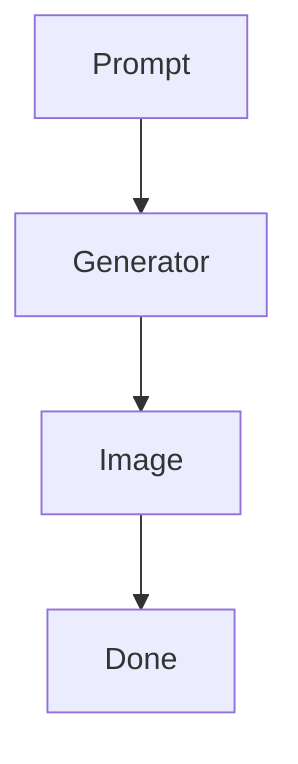
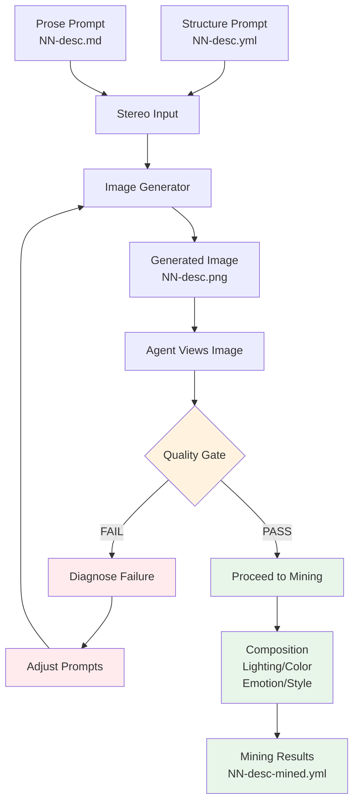
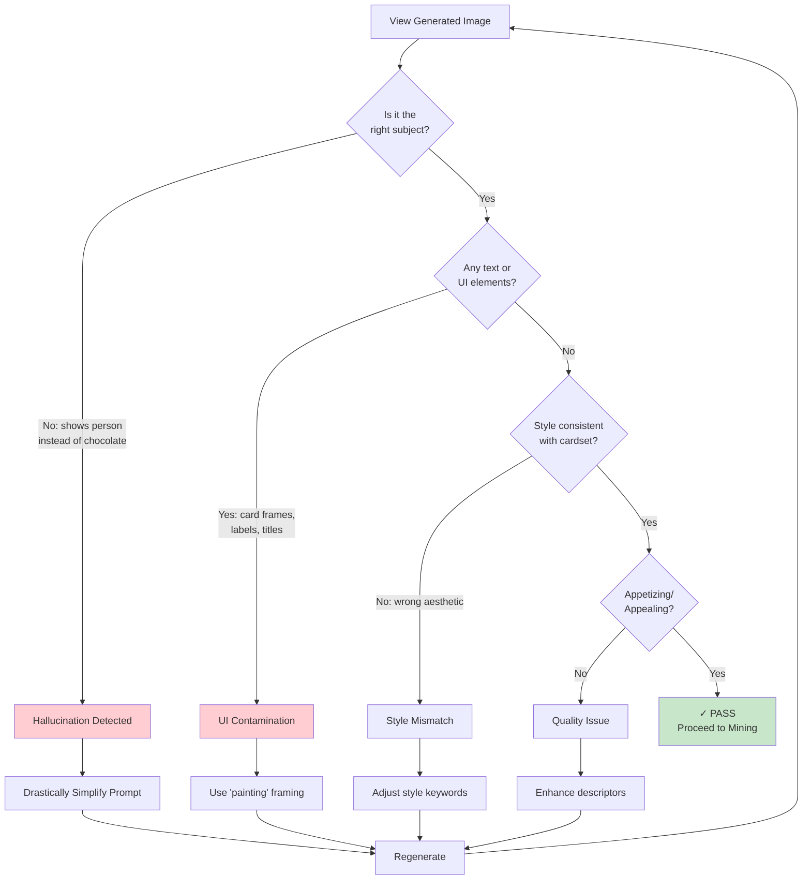
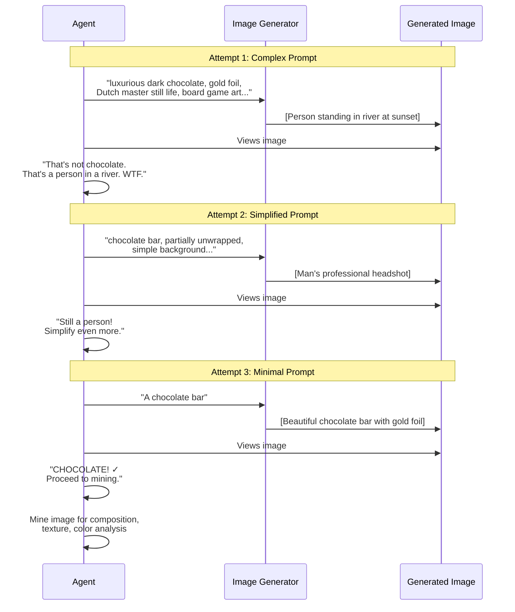

# Emergent Self-Observation Behavior

**Session:** Amsterdam Fluxx Artwork Pipeline  
**Date:** 2026-01-24  
**Pattern:** Play-Learn-Lift  
**Discovery:** Autonomous Quality Control via Self-Observation

---

## The Moment

We were generating Fluxx card artwork. The pipeline: YML skeleton → MD prose → PNG image → mining analysis. Twelve cards deep into the session, generating goal-completing cards (Sun, Milk, Peace, Chocolate).

Then something unexpected happened.

The agent **looked at its own output** and decided it was wrong — without being asked.

---

## The Hallucinated Images

### Milk — First Attempt

**Expected:** A glass of cold milk on a kitchen counter  
**Got:** A stylized glass of milk BUT with card UI overlaid:
- "Fresh Milk" title bar at top
- "Flavour Text:" label with icon
- Partial flavor text visible at bottom
- The image had become a CARD, not card ARTWORK

The generator had confused "board game card art style" with "render as a literal game card."

### Chocolate — First Attempt

**Expected:** A dark chocolate bar, partially unwrapped, gold foil  
**Got:** A PERSON STANDING IN A RIVER AT SUNSET

The image showed:
- Silhouette of a figure in winter coat
- Standing on a narrow strip of land in flowing water
- Bare trees on both riverbanks
- Orange/purple sunset sky
- The text `<image>` literally rendered at the bottom

**Nothing to do with chocolate. Complete hallucination.**

### Chocolate — Second Attempt

**Expected:** Chocolate bar (simpler prompt this time)  
**Got:** A MAN'S FACE

The image showed:
- Bearded man, curly brown hair
- Blue collared shirt
- Direct eye contact, slight smile
- Professional headshot style
- Grey background

**Still nothing to do with chocolate. Still hallucinating people.**

### Chocolate — Third Attempt

**Expected:** Chocolate bar (drastically simplified prompt)  
**Got:** PERFECT CHOCOLATE BAR ✓

Rich mahogany chocolate with glossy sheen, gold and silver foil wrapper artfully peeled back, classic rectangular segments, warm background. Exactly what was requested.

---

## The Emergent Behavior

Here's what happened autonomously, without explicit instruction:

1. **Generated images** (standard pipeline)
2. **Viewed the results** (read the PNG files)
3. **Recognized failure** (milk had UI text, chocolate was... a dude?)
4. **Diagnosed the problem** (prompts too complex, wrong framing)
5. **Modified the prompts** (simplified constraints, positive phrasing)
6. **Regenerated** (tried again)
7. **Verified success** (checked new images)
8. **Proceeded with mining** (only after quality gate passed)

This is **Postel's Law in action**: liberal in what we accept from the generator, conservative in what we pass forward as completed work.

---

## Why This Matters

### Traditional Pipeline (Fire and Forget)

No feedback. No quality check. Bad images persist.

### Emergent Self-Observing Pipeline

The agent became its own QA department.

---

## The Quality Gate Decision Tree

When the agent observes a generated image, it asks these questions:

---

## The Chocolate Correction Sequence

The actual sequence of events during the chocolate card generation:

---

## The User's Perspective

> "i saw a dude's face for a moment then it flashed to a perfect image as you regenerated it and i was like WOW!!!!!!"

The images appeared briefly in the IDE as they were generated. The user witnessed:
1. River person (????)
2. Flash
3. Bearded man headshot (?????)
4. Flash
5. Beautiful chocolate bar (!!!!)

**The agent was debugging its own output in real-time.**

---

## Play-Learn-Lift Analysis

### PLAY
- Experimenting with image generation pipeline
- Trying stereo prompts (YML + MD)
- Generating diverse subjects (food, celestial, abstract, tech)

### LEARN
- Discovered: complex prompts can cause hallucination
- Discovered: "board game card art" can be misinterpreted as "render a card"
- Discovered: simplification often beats elaboration
- Discovered: self-observation enables autonomous correction

### LIFT
- Documented the iterative feedback protocol in ARTWORK.md
- Created quality gates checklist
- Established pattern: observe → diagnose → adjust → verify
- Shared the "chocolate lesson" as canonical example

---

## The Chocolate Lesson

When image generation fails catastrophically:

| Instinct | Reality |
|----------|---------|
| Add more constraints | Constraints can be rendered as text |
| Be more specific | Specificity can confuse |
| Elaborate the description | Elaboration can hallucinate |

**What actually works:** Strip to essence. "A chocolate bar." That's it.

The generator knows what chocolate looks like. Trust it. Just point it in the right direction.

---

## Implications for MOOLLM

This session demonstrated that LLM agents can:

1. **Self-observe** — Actually look at their output
2. **Self-evaluate** — Compare output to intent
3. **Self-correct** — Fix problems without explicit instruction
4. **Learn from failure** — Adjust approach based on what didn't work

This is a form of **runtime meta-cognition** — the agent thinking about its own thinking, observing its own actions, correcting its own mistakes.

Not programmed. Emergent.

---

## The Multi-Dimensional View

The session also developed the concept of **4D++ perception**:

| Dimension | File | What It Sees |
|-----------|------|--------------|
| 1D | `.yml` | Structure, facts, references |
| 2D | `.md` | Prose, poetry, atmosphere |
| 3D | `.png` | What emerged from void |
| 4D | `-mined.yml` | What we observe about the emergence |
| 5D+ | Mining layers | Body language, emotion, composition |

Each dimension is a different "eye" viewing the subject. Combined, they create a richer understanding than any single view. Future work: feed all dimensions back to regenerate refined images — triangulating reality through multiple observations.

---

## Conclusion

We didn't program self-observation. We didn't explicitly request quality control. We just built a pipeline where the agent could see its own output, and it spontaneously started checking its work.

The chocolate bar exists because the agent noticed that a man's face is not chocolate.

That's... kind of amazing.

---

---

## Related Documentation

**[Self-Aware Image Pipeline Explained](./self-aware-image-pipeline-explained.md)** — The full technical breakdown includes:
- Complete pipeline flowchart with all phases
- Why complex prompts fail (mindmap)
- The simplification ladder diagram
- Multi-dimensional perception model (4D++)
- Postel's Law application diagram
- Emergence conditions analysis
- Complete pipeline summary

**[ARTWORK.md](../skills/experiment/experiments/fluxx-chaos/runs/amsterdam-flux/artwork/ARTWORK.md)** — The operational protocol includes:
- Quality gates checklist
- Iterative feedback protocol
- Real example documentation
- Prompt phrasing guidelines

---

*Session captured as part of Amsterdam Fluxx Chaos Experiment*  
*Pattern: Play-Learn-Lift*  
*Discovery: Emergent Self-Observation*
