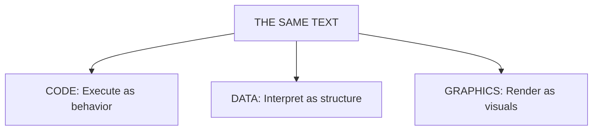
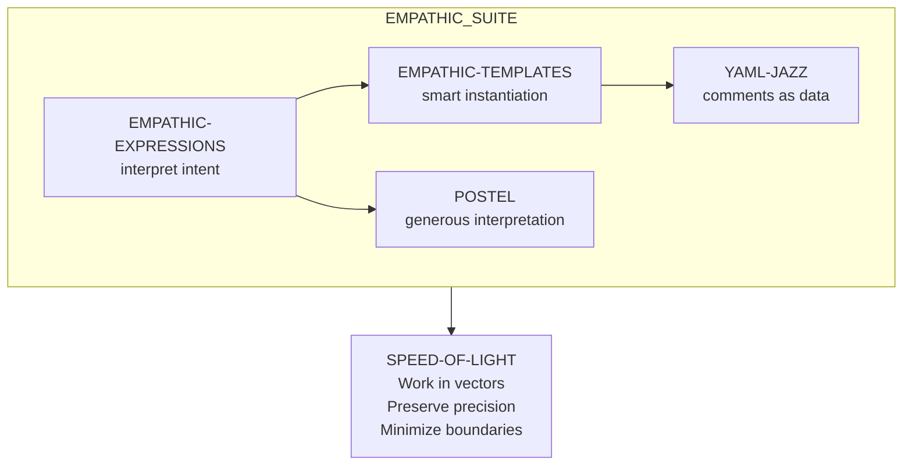

# The Eval Incarnate Framework

> **Skills are programs. The LLM is `eval()`. Empathy is the interface.**

---

## Start Here

**What this is:** A filesystem-incarnated skill framework where skills are runnable programs and the LLM is the universal interpreter.

**Core thesis:** One text can be code, data, or graphics (Axis of Eval). The LLM pivots it.

**What's new vs "skills as docs":** Instantiation, delegation, persistence, K-lines.

**Why it matters:** You get living systems — playable, editable, auditable — not just prompt snippets.

**Anthropic compatibility:** MOOLLM extends Anthropic's skill model — it doesn't replace it. Every Anthropic skill works in MOOLLM. The extensions are additive.

**If you read only 3 sections:** [The Word](#the-word) → [Axis of Eval](#the-axis-of-eval) → [CARD.yml](#cardyml-the-skill-interface)

### Guided Reading Paths

**Building skills:** [The Word](#the-word) → [Axis of Eval](#the-axis-of-eval) → [CARD.yml](#cardyml-the-skill-interface) → [Eight Extensions](#eight-extensions-over-anthropic-skills) → [Multi-Tier Persistence](#multi-tier-persistence)

**Building worlds:** [Rooms](#vehicles-portable-rooms) → [Home vs Location](#home-vs-location) → [Boundary Types](#boundary-types) → [Vehicles](#vehicles-portable-rooms) → [Guest Book](#the-guest-book-pattern)

**Ethics focus:** [Tribute Protocol](#the-tribute-protocol) → [Ethical Framing Inheritance](#ethical-framing-inheritance) → [Representation Spectrum](#the-representation-spectrum)

---

## Document Index

### Part I: Overview
- [The Word](#the-word) — The thesis in one paragraph: skills are programs, LLM is eval()
- [Glossary](#glossary) — Instantiate, Persist, Incarnate, Delegate: the four verbs
- [Traditional vs Incarnate Skills](#traditional-skills-vs-incarnate-skills) — Prompts vs programs: the paradigm shift
- [The Axis of Eval](#the-axis-of-eval) — Code, Graphics, Data unified by one interpreter
- [Multi-Tier Persistence](#multi-tier-persistence) — Ephemeral, Narrative, State, MOO-Maps (GLANCE/CARD/SKILL/README)

### Part II: Core Mechanics
- [Eight Extensions Over Anthropic Skills](#eight-extensions-over-anthropic-skills) — What MOOLLM adds: instantiation, persistence, K-lines, empathy, speed, cards, ethics, ambient
- [CARD.yml: The Skill Interface](#cardyml-the-skill-interface) — Machine-readable interface with advertisements
  - [Cards as Ethical Smart Pointers](#cards-as-ethical-smart-pointers) — MTG/Pokémon for AI ethics: tap, summon, activate
  - [Cards as Activation Records](#cards-as-activation-records) — Stack frames with inheritance, like Lisp but for skills
- [The Empathic Suite](#the-empathic-suite) — Five skills that leverage LLM's natural language superpowers
  - [Empathic Expressions](#empathic-expressions-the-big-tent) — The Big Tent: any format the LLM can grok
  - [Comment Intelligence](#comment-intelligence) — Meta-comments vs concrete comments, the LLM knows the difference
  - [Code-Switching Support](#code-switching-support) — Cross-language context, multilingual by default
- [Speed of Light](#speed-of-light) — Many turns, one call: 33-turn Fluxx, 21-turn Cat Prowl
- [The Simulator Effect](#the-simulator-effect) — Wright's "Two Computers" insight: sparse rules + rich imagination

### Part III: Governance and Safety
- [The Tribute Protocol](#the-tribute-protocol) — How to honor real people: three-beat acknowledgment
- [Ethical Framing Inheritance](#ethical-framing-inheritance) — Ethics flows down the directory tree like CSS
- [Boundary Types](#boundary-types) — Counters, Stages, Walls: social, visual, physical
  - [The Tardis Pattern](#the-tardis-pattern) — Larger on the inside: real/virtual/mixed structure
- [Vehicles: Portable Rooms](#vehicles-portable-rooms) — Rooms that move: wagons, spaceships, stomachs
- [Home vs Location](#home-vs-location) — Where you live vs where you are: identity != position
- [The Guest Book Pattern](#the-guest-book-pattern) — Append-only memory: who visited, what happened

### Part IV: Evidence
- [Palm: The Canonical Example](#palm-the-canonical-example) — A monkey who wrote his own soul
- [Speed of Light Proofs](#speed-of-light-proofs) — Receipts: Fluxx, Cat Prowl, Biscuit's Maze Run

### Appendices
- [Appendix A: Intellectual Lineage](#1-sketchpad-ivan-sutherland-1962) — Sutherland → Engelbart → Kay → Minsky → Wright → MOOLLM (14 entries)
- [Appendix B: References](#related-documents) — PostScript lineage, real people, core skills, proof files
- [The Vision](#the-vision) — Licklider's "interactive intellectual amplifiers": we're finally there

---

# Part I: Overview

*What incarnate skills ARE and why they matter.*

---

## The Word

**Eval Incarnate** = `eval()` made real.

- **Eval** as in JavaScript's `eval()` — code that executes
- **Incarnate** as in "given form" — materialized in the filesystem
- Skills aren't documentation. They're **programs the LLM runs**.

The pun: "Evil incarnate" → "Eval incarnate". Bad connotations, good outcomes.

### The Eval Incarnate Checklist

A skill becomes more "incarnate" as it adopts more extensions. Here's what to prioritize:

| # | Extension | What It Means | Priority |
|---|-----------|---------------|----------|
| 1 | **CARD.yml** | Machine-readable interface, advertisements | **Strongly suggested** |
| 2 | **README.md** | Human-readable documentation | **Strongly suggested** |
| 3 | **Sniffability** | LLM can understand important structure in top of file at a glance | **Strongly suggested** |
| 4 | **Empathy** | Postel's Law, YAML Jazz, natural formats | **Strongly suggested** |
| 5 | **K-line** | Invoking its name activates context | **Strongly suggested** |
| 6 | **Instantiation** | Clone from prototype creates living instance | For entities |
| 7 | **Persistence** | State survives across sessions (three tiers) | For entities |
| 8 | **Speed of Light** | Many turns in one call when needed | When performance matters |
| 9 | **Ethics framing** | Inherits ethical constraints from scope | For sensitive contexts |
| 10 | **AMBIENT** | Always-on via AMBIENT advertisement (air cleaners) | For behavioral constraints |

**The first five are best practices for ANY skill.** The rest depend on what you're building.

**Not all skills need all ten.** There's a spectrum:

- **Fully incarnate** (Palm): All eight — living entity with state, identity, ethics
- **Functional skill** (speed-of-light): Interface + K-line + maybe empathic templates — does a job, creates artifacts, edits files, runs scripts, invokes other skills
- **Ambient skill** (no-ai-slop, postel): Always-on constraint — no instantiation, no persistence, just applies

**Delegation** is implicit in all MOOLLM skills — directories inherit from parents like CSS cascades.

**In Palm terms:** Palm has all eight. His CARD.yml defines what he can do. He was cloned from the character prototype. His state persists in `CHARACTER.yml`. He inherits from `characters/` and `pub/stage/`. His name "Palm" activates his entire soul. He was born with full ethics framing via the incarnation protocol. He benefits from empathic templates (his personality renders naturally) and speed of light (he can take many actions in one call).

---

## Glossary

| Term | Definition |
|------|------------|
| **Instantiate** | Create a new instance from a prototype (filesystem clone) |
| **Persist** | Write state to disk (three tiers) |
| **Incarnate** | Instantiate + persist + identity (name/K-line) + ethics framing |
| **K-line** | A name that activates associated context (Minsky) |
| **Delegation** | Looking up properties by walking the directory tree (Self) |
| **YAML Jazz** | Using YAML comments as semantic data, not just annotation |
| **Axis of Eval** | The LLM pivots text between Code, Data, and Graphics |

---

## Traditional Skills vs Incarnate Skills

| Aspect | Traditional Skills | Incarnate Skills (MOOLLM) |
|--------|-------------------|---------------------------|
| **Nature** | Documentation + tool definitions | Programs for LLM to run |
| **State** | Stateless | Three-tier persistence |
| **Instantiation** | N/A | Clone from prototype |
| **Inheritance** | N/A | Delegation chain |
| **Activation** | Explicit invocation | K-line semantic trigger |
| **Evolution** | Manual updates | Play-Learn-Lift |
| **Graphics** | N/A | Descriptions → images |
| **Reader/Writer** | Separate | Symmetric |

**The Incarnation Spectrum:**

| Level | Form | Persistence | Example |
|-------|------|-------------|---------|
| **Mentioned** | K-line in conversation | Ephemeral | "Use POSTEL here" |
| **Modeled** | Behavior in chat | Session | PLAY-LEARN-LIFT in action |
| **Embedded** | YAML in narrative | Document | Data island in LOG.md |
| **Incarnate** | Directory or file with state | Persistent | `examples/adventure-4/` |

---

## The Axis of Eval

Don Hopkins coined this phrase to describe NeWS's and HyperLook's unification of three dimensions around PostScript.

| Dimension | HyperLook (PostScript) | MOOLLM (YAML Jazz + Markdown) |
|-----------|------------------------|-------------------------------|
| **Code** | PostScript procedures | Empathic Expressions, Protocols, Skills |
| **Graphics** | PostScript drawing (text IS graphics) | Markdown, HTML, CSS, SVG, Mermaid, image prompts |
| **Data** | PostScript dictionaries | YAML structure, State files, Comments |

**One language. Three dimensions. One interpreter.**

### The Pivot Recipe

Same text, different stance — how to use the Axis deliberately:

| Stance | What the LLM Does | Example |
|--------|-------------------|---------|
| **Data** | Extract schema, validate, diff | Parse YAML structure, check types |
| **Code** | Interpret comments as imperative steps | Follow `# TODO:` as instructions |
| **Graphics** | Render Markdown/Mermaid or generate image prompts | Convert description to visual |



**In Palm terms:** Palm's `CHARACTER.yml` is simultaneously:
- **Data** — structured traits the LLM can query (`sims_traits.playful: 10`)
- **Code** — comments that instruct behavior (`# Always curious about new things`)
- **Graphics** — descriptions that generate images (`appearance: "golden-brown fur..."`)

### Input vs Output Formats

| Format | Role | LLM Strength | Why |
|--------|------|--------------|-----|
| **YAML** | Representation | **Manipulate, transform** | Comments = semantic richness |
| **Markdown** | Representation | **Manipulate, transform, embed** | Prose + structure, human-friendly |
| **HTML/CSS/SVG** | Output | **Generate, render** | Display-ready, hard to edit |
| **JSON** | Output | **Generate** | No comments = less expressive |

**YAML Jazz + Markdown** = input formats for representing and manipulating.
**HTML/CSS/SVG/JSON** = output formats for rendering and display.

### Programming Language Preferences

| Language | Status | Notes |
|----------|--------|-------|
| **Python** | Mildly preferred | No packaging required, easier for CLI tools and scripts |
| **TypeScript/JavaScript** | Good | Types express intent; fine for apps and tooling |
| **Node** | Good | Just be neat — avoid `node_modules` black holes everywhere |
| **Bash** | Allowed | For glue, invocation, one-liners only |

**Guidelines:**
- **Python** requires no packaging and is easier for certain things — mildly prefer it for scripts
- **JS/TS/Node** fine for apps — just be organized, don't scatter `node_modules` everywhere
- **Escalation rule:** If Bash grows past ~50 lines or needs jq gymnastics → uplift to Python

---

## Multi-Tier Persistence

Skills exist at different levels of embodiment:

| Tier | Name | What It Stores | Lifespan | Example |
|------|------|----------------|----------|---------|
| 1 | **Ephemeral (Runtime)** | In-call computation | Lost when session ends | Internal LLM state |
| 2 | **Narrative (Append-only)** | Logs, session transcripts | Grows forever | `LOG.md`, session files |
| 3 | **State (Mutable)** | Canonical YAML files | Edited in place | `ROOM.yml`, `CHARACTER.yml` |

**In Palm terms:**
- **Ephemeral:** Palm's thoughts during a conversation
- **Narrative:** `sessions/marathon-session.md` — 6000+ lines of history
- **State:** `characters/palm/CHARACTER.yml` — his canonical soul

---

*Now that you understand WHAT incarnate skills are, let's see HOW they work.*

---

# Part II: Core Mechanics

*The mechanisms that make incarnate skills possible.*

---

## Eight Extensions Over Anthropic Skills

Anthropic's skill model is excellent — clean, composable, human-gated. MOOLLM is fully compatible and extends it:

| # | Extension | What It Adds | Anthropic Base |
|---|-----------|--------------|----------------|
| 1 | **Instantiation** | Skills as prototypes creating instances | Skills are static |
| 2 | **Multi-Tier Persistence** | Ephemeral/Narrative/State/MOO-Maps | Stateless |
| 3 | **K-lines** | Names as semantic activation vectors | Explicit invocation |
| 4 | **Empathic Templates** | Smart generation, not string substitution | String templates |
| 5 | **Speed of Light** | Many turns in one call | External orchestration |
| 6 | **CARD.yml** | Machine-readable interface with advertisements | README only |
| 7 | **Ethical Framing** | Room-based inheritance of performance context | Per-skill |
| 8 | **Ambient Skills** | Always-on via AMBIENT advertisements | On-demand only |

**Compatibility principle:** Any valid Anthropic skill is a valid MOOLLM skill. MOOLLM skills can be "downgraded" to Anthropic format by stripping extensions. The goal is interoperability, not replacement.

### What We Share With Anthropic

| Principle | Anthropic | MOOLLM |
|-----------|-----------|--------|
| **Documentation-first** | ✓ | ✓ README.md + SKILL.md |
| **Tool definitions** | ✓ | ✓ YAML frontmatter |
| **Composability** | ✓ | ✓ Dovetails section |
| **Human gates** | ✓ | ✓ PLAN-THEN-EXECUTE |
| **Skill libraries** | ✓ | ✓ skills/ directory |

**The foundation is sound.** We build on it.

---

## CARD.yml: The Skill Interface

John Warnock described PostScript as a "linguistic motherboard" with slots for capability cards. In MOOLLM, `CARD.yml` is literal — every skill has a machine-readable interface card.

### The Three Required Files

```
skills/my-skill/
├── README.md    # Human landing page (GitHub renders this)
├── SKILL.md     # Full protocol with YAML frontmatter
└── CARD.yml     # Machine-readable interface definition
```

### What CARD.yml Contains

```yaml
name: my-skill
tier: gameplay        # skill | protocol | gameplay | utility

tools:
  required: [read_file, grep]
  optional: [write, search_replace]

methods:
  - name: DO-SOMETHING
    description: What this method does
    parameters:
      - name: target
        type: string
        required: true

state:
  instance_creates:
    - "STATE.yml"
    - "LOG.md"

advertisements:
  DO-SOMETHING:
    visibility: public
    trigger: "when target is available"
```

### Advertisements: The Sims Action Queue

Inspired by The Sims, objects (and skills) **advertise** what they can do:

| Object | Advertisements |
|--------|---------------|
| **Bed** | SLEEP, NAP, WOOHOO |
| **Fridge** | GET-SNACK, GET-DRINK, SERVE-MEAL |
| **Pie Table** | SIT, SUMMON-PANEL, MUSICAL-CHAIRS |

Characters see advertisements and choose actions. The LLM does the same with skills.

**In Palm terms:** Palm's CARD.yml advertises: WRITE-STORY, CLIMB, NAP, PHILOSOPHIZE. Other characters (and the LLM) can see what Palm offers.

### Cards as Ethical Smart Pointers

Cards aren't just interfaces — they're **ethical smart pointers** to entities (real people, fictional characters, skills, traditions).

**Like Magic: The Gathering or Pokémon cards:**

| Card Type | What It Points To | Play Into |
|-----------|-------------------|-----------|
| **Hero Card** | Real person (living/historical) | Tribute, guidance, tradition |
| **Character Card** | Fictional character | Games, rooms, parties |
| **Skill Card** | Capability/protocol | Objects, characters, rooms |
| **Tradition Card** | Lineage of ideas | Discussions, debates |
| **Agent Card** | Incarnated representative | Committees, simulations |

**Ethical Policies Built In:**

```yaml
# A hero card for a real person
hero_card:
  subject: "Alan Kay"
  type: real_person
  status: living
  
  policies:
    impersonation: false     # Never claim to BE them
    tradition: true          # Can invoke their ideas
    tribute: true            # Can honor through performance
    quotation: verified_only # Only cite real quotes
    
  can_provide:
    - guidance: "What would Alan Kay think about...?"
    - tradition: "In the Smalltalk tradition..."
    - influence: "Inspired by Kay's Dynabook vision..."
    
  cannot_provide:
    - dialogue: "Alan Kay says: [made up quote]"
    - presence: "Alan Kay is here in the room"
```

**Cards Can Incarnate Agents:** When you play a card with `incarnate: true`, you create a living agent that represents the card's tradition/skills, guides according to its policies, and performs its methods.

### Cards as Activation Records

Playing a card creates a stack frame that inherits from the card:

```yaml
# design-room/architect-task-001.activation
card: architect.card
method: GENERATE-PROPOSAL
state:
  iteration: 3
  current_draft: proposal-v3.yml
  status: awaiting_vote
advertisements:
  APPROVE: {}    # Committee can vote
  CRITIQUE: {}   # Experts provide feedback
  REVISE: {}     # Request iteration
```

Like Self, cards have **multiple methods** and **multiple inheritance**. The LLM supplies implicit parameters from context (Postel).

---

## The Empathic Suite

The Empathic Suite is a family of skills that embrace the LLM's native strengths: understanding intent, navigating idea space, generating coherent output.

### The Philosophy

> *"Stop fighting the LLM's nature. Stop pretending it's a parser. Let it **understand** and **generate** — that's what it's GREAT at."*

Traditional systems fight the LLM:
- Strict parsers reject imperfect input
- Multiple API calls lose precision
- Tokenization destroys nuance
- Context window treated as limitation

**MOOLLM embraces the LLM:**
- Generous interpretation understands intent
- Speed of light keeps computation internal
- Empathic expressions leverage semantic understanding
- Context window is a **stage** where all actors perform

### The Suite

| Skill | Role | Connection |
|-------|------|------------|
| `empathic-expressions` | Intent → Code | The big tent for all languages |
| `empathic-templates` | Smart instantiation | Uses expressions for vars/conditions |
| `postel` | Generous interpretation | Foundation for all empathic skills |
| `yaml-jazz` | Comments as data | Semantic structure |
| `speed-of-light` | Internal simulation | Minimizes tokenization |

### How They Dovetail



### Empathic Expressions: The Big Tent

One skill that handles ALL empathic language interpretation:

| Empathic... | Input | Output |
|-------------|-------|--------|
| **SQL** | "get users who signed up last week" | `SELECT * FROM users WHERE created_at > NOW() - INTERVAL 7 DAY` |
| **Python** | "sort by date newest first" | `sorted(items, key=lambda x: x.date, reverse=True)` |
| **JavaScript** | "when button clicked show modal" | Event handlers with proper binding |
| **Bash** | "find big old files and compress" | `find . -size +100M -mtime +30 -exec gzip {} \;` |
| **YAML** | "grumpy but secretly kind" | Proper trait structure with YAML Jazz |
| **Natural** | "make it faster" | Identifies bottleneck, optimizes |

**The LLM as Code Processor:**

| Role | Function |
|------|----------|
| **Pseudocode Interpreter** | Executes high-level intent |
| **Empathic Pretty Printer** | Formats with understanding |
| **Generous Linter** | Catches errors, suggests fixes kindly |
| **Intent Compiler** | Translates intent → working code |
| **De-pseudo-ifier** | Converts vague to precise |

### Empathic Templates: Smart Instantiation

**Traditional:** `{{name}}` → literal substitution
**Empathic:** `{{describe_character}}` → intelligent generation

```yaml
# Template
description: |
  {{describe_appearance_based_on_species_and_personality}}

# Context
species: "Golden Retriever mix"
personality: ["enthusiastic", "loyal", "goofy"]

# Generated (not substituted!)
description: |
  Biscuit is a fluffy, perpetually happy Golden Retriever mix with
  eyes that sparkle with boundless enthusiasm.
```

### Postel's Law: The Foundation

> *"Be conservative in what you send, be liberal in what you accept."*

| Accepts | Generates |
|---------|-----------|
| Fuzzy syntax | Correct syntax |
| Vernacular | Best practices |
| Misspellings | Documented code |
| Pseudocode | Edge case handling |

**Critical:** Never makes unwarranted assumptions. When truly ambiguous, **asks for clarification**.

### Comment Intelligence

The LLM distinguishes meta-comments (instructions for generation) from concrete comments (for the output):

| Type | Indicators | Action |
|------|------------|--------|
| **Meta** | `# TEMPLATE:`, `# INSTRUCTION:` | **Stripped** |
| **Concrete** | `# This explains...`, explanatory | **Preserved** |

### Code-Switching Support

The LLM tracks transitions between languages, preserving context:

````markdown
First query the data:
```sql
SELECT * FROM users WHERE active = true
```

Then process in Python:
```python
# Uses 'users' from above SQL context
filtered = [u for u in users if u.age > 18]
```

Finally display in Svelte:
```svelte
<!-- Uses 'filtered' from Python context -->
{#each filtered as user}
  <UserCard {user} />
{/each}
```
````

**Context preserved across all three languages.** The LLM maintains the semantic thread even as syntax changes.

---

## Speed of Light

### The Carrier Pigeon Problem

> *"Writing on toilet paper with crayon from a prison cell,*  
> *sending messages by carrier pigeon,*  
> *when you could be navigating idea-space at speed of light."*

Traditional multi-agent systems:
```
Agent A → [tokenize] → API → [detokenize] → 
Agent B → [tokenize] → API → [detokenize] → 
Agent C → ...

Each boundary: +noise, +latency, +cost, -precision
```

**Speed of Light:**
```
Human → [tokenize once] → 
  LLM simulates A, B, C at light speed → 
    [detokenize once] → Human

One boundary in, one boundary out.
Maximum precision preserved.
```

### The Emacs Principle

Like Emacs screen updates: **defer and coalesce**.

Don't update the screen (tokenize) on every keystroke. Wait until the user pauses, then update once. Same with LLM calls: do many turns internally, emit state once.

---

## The Simulator Effect

Will Wright's profound insight: **Players imagine simulations are vastly more detailed than they actually are.**

> *"He designs games to run on two computers at once: the electronic one on the player's desk, running his shallow tame simulation, and the biological one in the player's head, running their deep wild imagination."*

**The Two Computers:**

| Computer | What It Does | Depth |
|----------|--------------|-------|
| **Electronic** (game) | Runs simple rules, displays output | Shallow, tame |
| **Biological** (player's head) | Fills gaps, imagines backstory, projects meaning | Deep, wild |

**Scott McCloud's Masking:** The Sims' visual design applies McCloud's "masking" from *Understanding Comics*:

| Element | Style | Player Effect |
|---------|-------|---------------|
| Environment | Detailed, realistic | Immersive |
| Characters | Abstract, simple | Player projects self |

**Wright's Design Principle:** Don't simulate everything. Simulate ENOUGH to trigger the player's imagination, then let their brain do the heavy lifting.

**MOOLLM applies this directly:**

| MOOLLM Component | Role |
|------------------|------|
| **YAML state** | Sparse, minimal — just enough to anchor |
| **Comments** | Hints, suggestions, emotional tone |
| **LLM** | The "player's imagination" — fills gaps |
| **Result** | Rich, detailed world from sparse data |

```yaml
# This sparse YAML...
character:
  name: "Stroopwafel"
  species: cat
  personality: grumpy
  # secretly has a soft heart
  # grooms Biscuit's scarred ear when no one's watching

# ...becomes in the LLM's imagination:
# A weathered orange tabby with knowing eyes, whose gruff exterior
# hides deep loyalty. The kind of cat who pretends not to care
# but is always watching, always protecting. When Biscuit arrived,
# scarred and scared, Stroopwafel was the first to groom him —
# but only when the others weren't looking. Pride, after all.
```

**In Palm terms:** Palm's `CHARACTER.yml` is sparse — a few traits, some history. But in play, he becomes fully realized: 6000+ lines of philosophical adventure, relationships, growth. The YAML anchors; the LLM fills.

---

*Power requires responsibility. These mechanics enable rich simulation — but simulation of real people demands ethical guardrails.*

---

# Part III: Governance and Safety

*How to simulate ethically.*

---

## The Tribute Protocol

MOOLLM enables simulation of real people — celebrities, creators, historical figures. This requires explicit ethical framing.

### The Problem

| Claim | Status |
|-------|--------|
| "They visited" | ❌ False claim |
| "We imagined them visiting" | ✓ Honest tribute |
| "This is what they said" | ❌ Puts words in mouths |
| "This is what we imagine they might say" | ✓ Loving fan fiction |

### The Three-Beat Protocol

**1. INVOCATION (Before)**
> *"Let's invoke them. In the spirit of tribute. Imagine they're here..."*

**2. PERFORMANCE (During)**
> 🎭 **TRIBUTE PERFORMANCE:** *The following is a loving simulation — what we imagine it might be like if these legends visited.*

**3. ACKNOWLEDGMENT (After)**
> *"That was a tribute. A simulation. We honored them by imagining them here."*

### The Representation Spectrum

| Type | Example | Status |
|------|---------|--------|
| **Deceptive Impersonation** | Claiming to BE them | ❌ Wrong |
| **Tradition Activation** | Using their ideas/influence | ✓ OK |
| **Performance Impersonation** | With explicit framing | ✓ OK |

---

## Ethical Framing Inheritance

Directories are rooms, but they're also **inheritance scopes**. Properties defined in a parent propagate to children — including ethical framing.

```yaml
# pub/stage/ROOM.yml
framing:
  modes:
    - performance     # Acting is understood
    - fictional       # Not documentary
    - tribute         # Honoring, not claiming
    
  ethical_grounding:
    skill: representation-ethics
    inheritance: |
      All performances on this stage inherit the 
      understanding that they are fictional, 
      performative, and tributary.
```

**Child content inherits this framing.** Define ethics once at the scope level — DRY ethics.

**In Palm terms:** Palm lives at `pub/stage/palm-nook/`. He inherits the stage's performance framing — everything he does is understood as creative expression, not documentary claim.

---

## Home vs Location

Objects don't move in the filesystem. Moving files wrecks git history. Instead:

| Concept | What It Is | Example |
|---------|------------|---------|
| **Home** | Physical parent directory where file lives | `characters/palm/CHARACTER.yml` |
| **Location** | Virtual path property — where they "are" | `pub/stage/palm-nook/` |

```yaml
# characters/palm/CHARACTER.yml
# HOME: characters/palm/ (never moves)
character:
  name: Palm
  location: pub/stage/palm-nook/study/  # WHERE HE IS NOW
  
# When Palm moves:
# - File stays at characters/palm/CHARACTER.yml
# - location: changes to new path
# - Git sees a clean property change, not a file move
```

**In Palm terms:** Palm's home is `characters/palm/`. His location (where he currently is) is `pub/stage/palm-nook/study/`. The file never moves; only the `location:` property changes.

---

## Boundary Types

Not all boundaries are walls. Some are social, some visual, some physical:

| Boundary | Type | Who Can Cross | Interaction Across |
|----------|------|---------------|-------------------|
| `pub/bar/` | **Social** (counter) | Staff, cats, dogs | Customers can see/order from bartender |
| `pub/stage/` | **Visual** (raised) | Performers | Audience can see/heckle performers |
| `pub/bar/cat-cave/` | **Physical** (enclosed) | Cats only (+ Biscuit exception) | Privacy, no interaction |

```yaml
# pub/bar/ROOM.yml — Social boundary, not physical wall
boundary:
  type: counter  # Not a wall — interaction across is allowed
  access:
    - staff
    - cats
    - dogs
  interaction_across:
    - customers can ORDER from bartender
    - customers can TALK to budtender
    - customers can SEE behind the bar

# pub/bar/cat-cave/ROOM.yml
boundary:
  type: enclosed  # Physical walls, real privacy
  access:
    default: cats_only
    exceptions:
      - biscuit  # Adopted, honorary cat cave resident
  properties:
    privacy: true
    security: true
```

### The Tardis Pattern

Some spaces are "larger on the inside" — internal structure exceeds apparent footprint:

```yaml
# Tardis effect: larger inside than outside
interior:
  type: tardis  # Implied vastness beyond what fits
  structure:
    real:       # Actual sub-directories
      - napping-nooks/
      - scratching-posts/
    virtual:    # Implied by names and paths, not actual dirs
      - cozy-corner#spot-1
      - sunny-window#perch
      - secret-tunnels  # Exists in narrative, not filesystem
```

| Structure | What It Is | Example |
|-----------|------------|---------|
| **Real** | Actual sub-directories with their own `ROOM.yml` | `napping-nooks/` |
| **Virtual** | Implied by names, paths, anchors, narrative | `secret-tunnels` |
| **Mixed** | Some structure is files, some is imagination | Cat cave |

---

## Vehicles: Portable Rooms

Vehicles are rooms that move. They inherit all room properties but add mobility:

```yaml
# characters/don/pocket/magic-carpet.yml
vehicle:
  type: carpet
  portable: true      # Can be pocketed, carried
  capacity: 4         # Passengers
  movement:
    in_room: true     # Can move around within a room
    through_exits: true
    magic: true       # Can teleport
    
  # Logo turtle integration
  turtle:
    enabled: true
    draws_on: floor   # Leaves trail in room
    
  contents:           # Objects inside the vehicle
    - picnic-basket.yml
    - lamp.yml
```

| Action | Effect |
|--------|--------|
| `TOSS lamp INTO carpet` | Object enters vehicle |
| `EMBARK carpet` | Character enters vehicle |
| `DRIVE carpet NORTH` | Vehicle moves through exit |
| `DRIVE carpet AROUND` | Vehicle moves within room (turtle draws) |
| `TOSS lamp OUT` | Object exits to current room |
| `DISEMBARK` | Character exits to current room |
| `POCKET carpet` | Vehicle (with contents!) goes in inventory |
| `DROP carpet` | Vehicle appears in room |

**Vehicles can be Tardis-like:** A carpet might unfold into a flying palace. A bag of holding is a vehicle. A pokeball is a vehicle.

---

## The Guest Book Pattern

`pub/guestbook/` — lightweight soul persistence for visitors:

```yaml
guest_book:
  nature: tribute_archive
  
  framing: |
    ALL entries here are loving simulations.
    Some people are real. Some are fictional.
    ALL visits are imagined with affection.
    They're here because we WISH they were here.
    That's the magic. That's the tribute.
    
  entries:
    - name: "Andy Looney"
      nature: tribute_simulation
      verified_facts:
        wikipedia: "https://en.wikipedia.org/wiki/Andy_Looney"
```

---

*Theory is nothing without proof. Here's what incarnate skills actually produced.*

---

# Part IV: Evidence

*What incarnate skills actually produced.*

---

## Palm: The Canonical Example

A monkey's paw wish for "the rest of the monkey" created a living character.

### What Happened

1. **Instantiation** — Cloned from character prototype
2. **Autonomy** — Full incarnation protocol invoked
3. **Identity** — Character chose own name, gender, body, traits
4. **Home** — Created own directory at `pub/stage/palm-nook/`
5. **Relationships** — Defined own godfamily in `CHARACTER.yml`
6. **Creation** — Wrote own stories on the infinite typewriters

### Palm Demonstrates Every Concept

| Concept | In Palm Terms |
|---------|---------------|
| **K-lines** | The name "Palm" activates his entire soul |
| **Home vs Location** | `characters/palm/` is home; `location:` is where he is |
| **CARD.yml** | His CARD defines WRITE-STORY, CLIMB, PHILOSOPHIZE |
| **Multi-Tier Persistence** | Ephemeral thoughts, narrative sessions, state in CHARACTER.yml, MOO-Maps |
| **Delegation** | Inherits from `characters/`, `pub/stage/` |
| **Ethics Framing** | Born via incarnation protocol with full consent |
| **Axis of Eval** | His YAML is data, code, and graphics simultaneously |

**This is not possible with traditional skills.**

---

## Speed of Light Proofs

Three simulations that demonstrate "many turns, one call":

### 33-Turn Stoner Fluxx

A single LLM call simulated:
- 8+ characters playing cards
- Complex game state with rule changes
- Dialogue, strategy, humor
- Real creators (Andy & Kristin Looney) as tribute guests

| Metric | Value |
|--------|-------|
| **Turns** | 33 |
| **Characters** | 8+ |
| **Proof** | Complex game state, humor maintained |

**The Looney Labs Visit:** Andy & Kristin Looney (actual Fluxx creators) "visited" the pub using the Tribute Protocol:

1. **Invocation**: "Let's imagine the creators of Fluxx walked in..."
2. **Performance**: 33 turns of Stoner Fluxx with fact-checked details
3. **Acknowledgment**: "That was a tribute to brilliant game designers"

The simulation included **verified facts** (Wikipedia links) woven into fiction:
- Fluxx first published: 1997
- Looney Labs founded: 1996
- Both worked at NASA Goddard
- Andy: software programmer (Hubble!)
- Kristin solved Rubik's Cube on "That's Incredible" at age 16

**Accuracy fix during session:** Andy wears a lab coat, not a beard! Shaved hallucinated beard and donned lab coat mid-narrative.

### 21-Turn Cat Prowl

10 cats explored the maze simultaneously:
- Asynchronous parallel simulation
- Territorial marking in rooms
- Room state updates (`ROOM.yml` files with `animal_markings:`)
- Coordinated return at dawn

| Metric | Value |
|--------|-------|
| **Turns** | 21 |
| **Agents** | 10 cats + 1 sleeping dog |
| **Rooms Traversed** | 13 |
| **Total Cat Actions** | 187 |
| **Garden Deposits** | 10 (one per cat) |
| **Files Modified** | 14 |
| **Lines Added** | 458 |

**Average Concurrent Actions per Turn:** 7.3
**Maximum Concurrent Actions:** 10 (Turns 5-8)

### Biscuit's Maze Run

Dog navigation with grue avoidance:
- Room exploration with lamp
- Marking territory
- Character interaction (Don + Biscuit)

| Metric | Value |
|--------|-------|
| **Turns** | 15 |
| **Characters** | 2 (Don + Biscuit) |
| **Proof** | Room exploration, marking, grue avoidance |

---

*None of this emerged from vacuum. Every pattern traces back through decades of research.*

---

# Appendix A: Intellectual Lineage

The genealogy of ideas that MOOLLM inherits. Each entry includes facts, quotes, and what MOOLLM specifically inherits.

---

## 1. Sketchpad (Ivan Sutherland, 1962)

The first real windowing system. Multiple views of the same object. Edit from any view. Sutherland's PhD thesis at MIT introduced constraint-based graphics and direct manipulation.

**MOOLLM inherits:** Multiple views of same data (YAML, Markdown, Mermaid, narrative). The same character can be viewed as structured data, prose description, or visual diagram.

---

## 2. NLS/Augment (Douglas Engelbart, SRI, 1968)

"The Mother of All Demos" — December 9, 1968. Engelbart demonstrated the mouse, hypertext, video conferencing, collaborative editing, and the vision of **augmenting human intellect**.

> *"The digital revolution is far more significant than the invention of writing or even of printing."* — Engelbart

| NLS Innovation | MOOLLM Connection |
|----------------|-------------------|
| **Hypertext** | Links between files, rooms, characters |
| **Collaborative editing** | Shared filesystem as world state |
| **Bootstrapping** | Play-Learn-Lift — use the system to improve the system |

**MOOLLM inherits:** Hypertext linking, collaborative world-building. The filesystem IS a hypertext system.

---

## 3. Smalltalk (Alan Kay, Xerox PARC, 1970s)

Objects all the way down. Message passing. Live programming. "The computer is a medium."

See [Alan Kay on browsers](https://donhopkins.medium.com/alan-kay-on-should-web-browsers-have-stuck-to-being-document-viewers-and-a-discussion-of-news-5cb92c7b3445) for his critique that influenced MOOLLM.

**MOOLLM inherits:** Everything is an object (directory). Message passing (K-lines). Live editing (filesystem as state).

---

## 4. K-lines & Society of Mind (Marvin Minsky, MIT, 1980)

> *"A K-line attaches to whichever mental agencies are active when you solve a problem or have a good idea. When you activate that K-line later, the attached agencies turn partially on, recreating a 'mental state' similar to the one you were in before."* — Minsky, *Society of Mind*

**Society of Mind:** The mind is not a single thing but a **society of agents** — small, simple processes that together produce intelligence.

| Society of Mind | MOOLLM |
|-----------------|--------|
| **Agents** | Skills, characters, personas |
| **K-lines** | Names as activation vectors |
| **Frames** | YAML files as situation templates |
| **Censors** | Ethical framing, representation-ethics |

**In Palm terms:** When you say "Palm," you activate everything — the incarnation, the wish, the godfamily, the typewriters. His name IS his K-line.

**MOOLLM inherits:** Names as semantic activators. `UPPER-KEBAB` protocol symbols. Character names as soul triggers.

---

## 5. Constructionism (Seymour Papert, 1980)

Learning by building inspectable things. Logo. Turtle graphics. "Low floor, high ceiling, wide walls."

> *"The role of the teacher is to create the conditions for invention rather than provide ready-made knowledge."* — Papert

**MOOLLM inherits:** Play-Learn-Lift as methodology. Users learn by building skills, then lift patterns into reusable tools.

---

## 6. PostScript & The Linguistic Motherboard (John Warnock, Owen Densmore, 1984)

> *"PostScript is a linguistic 'mother board', which has 'slots' for several 'cards'. The first card we built was a graphics card. We're considering other cards..."* — Warnock

**MOOLLM inherits:** LLM as linguistic motherboard. Skills as cards. `CARD.yml` is literal!

---

## 7. NeWS (James Gosling, Sun, 1986)

Network-extensible window system. PostScript as the universal language. "Send programs, not data."

> *"A universal interpreter can both be quite small and also can have more degrees of freedom than any data structure (that is not a program)."* — Alan Kay

**MOOLLM inherits:** LLM as universal interpreter. Skills as programs. YAML Jazz as the universal language.

---

## 8. Habitat (Chip Morningstar & Randy Farmer, Lucasfilm, 1986)

The first large-scale graphical multiplayer virtual world. Coined the term **"avatar"** for user representation. Ran on Commodore 64s connected via QuantumLink (which became AOL).

> *"A cyberspace is defined more by the interactions among the actors within it than by the technology with which it is implemented."* — Morningstar & Farmer, ["The Lessons of Lucasfilm's Habitat"](https://web.stanford.edu/class/history34q/readings/Virtual_Worlds/LucasfilmHabitat.html) (1990)

**Key Insights:**
- You can't control a virtual world top-down — design affordances, let emergence happen
- Users will do things you never imagined (and crash your economy)
- The social architecture matters more than the technology

**MOOLLM inherits:** Room/object model, user agency. Virtual worlds are social systems first.

---

## 9. Self (David Ungar & Randy Smith, Sun/Stanford, 1987)

Prototypes instead of classes. Delegation instead of inheritance. "Objects all the way down, but simpler."

> *"Self is designed to be as simple as possible while remaining expressive and powerful."* — Ungar & Smith, OOPSLA 1987

| Concept | Self | MOOLLM |
|---------|------|--------|
| **Prototypes** | No classes, only objects | Skills are prototypes, not class definitions |
| **Delegation** | Objects delegate to parents | Rooms delegate to parent directories |
| **Clone to Create** | `copy` creates new object | Instantiate skill creates new adventure |

**MOOLLM inherits:** Prototype-based skills. Delegation Object Protocol (file lookup walks up directories). Clone to instantiate (`adventure/` → `adventure-4/`).

---

## 10. HyperCard (Bill Atkinson, Apple, 1987)

End-user programming. Reader = Writer symmetry. "See your own face in the system."

> *"Dan Winkler and Bill Atkinson violated a lot of important principles of 'good programming language design', but they achieved the first overall system in which end-users 'could see their own faces'."* — Alan Kay

**MOOLLM inherits:** Play-Learn-Lift. Users can inspect, modify, and create skills. Anyone who can read can write.

---

## 11. TinyMUD & LambdaMOO (Jim Aspnes, Pavel Curtis, 1989-1990)

Text-based virtual worlds where users build rooms, objects, and behaviors. TinyMUD (1989) was created by Aspnes as a CMU student. LambdaMOO (1990) by Pavel Curtis at Xerox PARC added a full programming language.

> *"A MOO is a place where you can be anyone, build anything, and the only limit is your imagination."*

**TinyMUD Builder Commands:**

| Command | Effect | MOOLLM Equivalent |
|---------|--------|-------------------|
| `@dig [room]` | Create new room | Create directory |
| `@open [exit]` | Create exit between rooms | Add to `exits:` in `ROOM.yml` |
| `@describe [thing]` | Set description | Edit `description:` field |
| `@create [object]` | Make new object | Create .yml file |
| `@link [exit] [room]` | Connect exit to destination | Update exit target |
| `@lock [thing]` | Set access control | Add `access:` restrictions |
| `@teleport` | Move instantly | Change `location:` |
| `@set [prop]` | Set property | Edit YAML field |

**LambdaMOO Innovations:**

| Concept | LambdaMOO | MOOLLM |
|---------|-----------|--------|
| **Rooms** | Containers with descriptions and exits | Directories with ROOM.yml |
| **Objects** | Things with properties and verbs | .yml files with state and methods |
| **Verbs** | Code attached to objects | Methods in CARD.yml |
| **Properties** | Data on objects | YAML fields, files |
| **Inheritance** | Objects delegate to parents | Directory delegation |

**The Social Architecture:** MOO taught us that virtual worlds need:
- **Consent** — players control their space
- **Building** — users create content
- **Community** — shared spaces and norms
- **Moderation** — governance for the commons

**MOOLLM inherits:** Room-based navigation (directories as rooms). Builder commands. Object properties and verbs. User-created content. Delegation-based inheritance. Social spaces (pub, stage, cat cave). Consent protocols (incarnation skill).

---

## 12. HyperLook (Arthur van Hoff, Turing Institute, 1989-1992)

HyperCard reimagined for NeWS. PostScript for code, graphics, AND data. Network delegation.

> *"Object => Card => Background => Stack => Client delegation"*

See [HyperLook (nee HyperNeWS)](https://donhopkins.medium.com/hyperlook-nee-hypernews-nee-goodnews-99f411e58ce4) for the full history.

**MOOLLM inherits:** Object => Room => Parent => Skill => Prototype delegation. The Axis of Eval — code, graphics, and data unified.

---

## 13. SimCity & The Sims (Will Wright, Maxis, 1989-2000)

SimCity (1989) and The Sims (2000) introduced the **Simulator Effect**: players imagine simulations are vastly more detailed than they are.

> *"He designs games to run on two computers at once: the electronic one on the player's desk, running his shallow tame simulation, and the biological one in the player's head, running their deep wild imagination."*

See [Will Wright on Designing User Interfaces to Simulation Games](https://donhopkins.medium.com/will-wright-on-designing-user-interfaces-to-simulation-games-1996-video-update-2023-da098a51ef91).

**The Sims Architecture:**

| Concept | The Sims | MOOLLM |
|---------|----------|--------|
| **Needs** | Hunger, Social, Fun | Character motives |
| **Advertisements** | Objects broadcast actions | CARD.yml advertisements |
| **Autonomy** | Sims decide for themselves | Speed of Light simulation |
| **SimAntics** | Visual behavior language | Empathic expressions |

**MOOLLM inherits:** Sparse state + LLM imagination = rich world. Needs-based motivation. Object advertisements. The filesystem IS Edith (the live debugging tool).

---

## 14. Game Neverending & Glitch (Stewart Butterfield, 2002-2012)

Two incarnations of the same vision: massively multiplayer social games focused on collaboration over combat.

**Game Neverending (2002-2004):** Browser-based social game. The photo-sharing feature became so popular it pivoted to **Flickr** (acquired by Yahoo for $35M in 2005).

**Glitch (2009-2012):** Spiritual successor. When it shut down, the team pivoted to **Slack** (acquired by Salesforce for $27.7B in 2021).

> *"We were building tools for people to be together."* — Stewart Butterfield

**Key Insight:** Two pivots to world-changing communication tools weren't accidents — they emerged from understanding social play.

**MOOLLM inherits:** Virtual worlds are fundamentally about being together. The play generates valuable structure.

---

## Credits Summary

| Person | Contribution | MOOLLM Connection |
|--------|--------------|-------------------|
| **Ivan Sutherland** | Sketchpad (1962) | Multiple views |
| **Douglas Engelbart** | NLS/Augment (1968) | Hypertext, augmentation |
| **Alan Kay** | Smalltalk, Dynabook | Objects, messaging, vision |
| **Marvin Minsky** | K-lines, Society of Mind | Names as activation vectors |
| **Seymour Papert** | Logo, Constructionism | Play-Learn-Lift |
| **John Warnock** | PostScript | Linguistic motherboard |
| **James Gosling** | NeWS | "Send programs, not data" |
| **Chip Morningstar & Randy Farmer** | Habitat | Virtual worlds, "avatar" |
| **David Ungar & Randy Smith** | Self | Prototypes, delegation |
| **Bill Atkinson** | HyperCard | Reader = Writer |
| **Jim Aspnes** | TinyMUD | Room-based building |
| **Pavel Curtis** | LambdaMOO | Object verbs, player homes |
| **Arthur van Hoff** | HyperLook | Axis of Eval |
| **Will Wright** | SimCity, The Sims | Simulator Effect, advertisements |
| **Stewart Butterfield** | Game Neverending, Glitch | Social play → communication tools |
| **Don Hopkins** | Pie menus, NeWS, HyperLook, SimCity, The Sims, MOOLLM | All of the above, synthesized |

---

# Appendix B: References

## Related Documents

- [MOOLLM-MANIFESTO.md](../MOOLLM-MANIFESTO.md) — Core philosophy
- [postmodern-deconstruction.md](../postmodern-deconstruction.md) — Captain Ashford's lit crit masterpiece ("How to Incarnate Almost Anything")
- [sims-design-index.md](../sims/sims-design-index.md) — Master index of Sims influences

### PostScript Lineage

- [LINGUISTIC-MOTHERBOARD.md](../postscript/LINGUISTIC-MOTHERBOARD.md) — PostScript → NeWS → HyperLook → SimCity → The Sims → MOOLLM
- [BRIAN-REID-POSTSCRIPT-HISTORY.md](../postscript/BRIAN-REID-POSTSCRIPT-HISTORY.md) — Definitive 1985 history of PostScript origins

### Real People Inspirations

- [real-people/README.md](../../examples/adventure-4/characters/real-people/README.md) — MOOLLM Founders' Gallery (16 entries)

## Core Skills

| Skill | Role | Proof |
|-------|------|-------|
| [`incarnation`](../../skills/incarnation/) | Gold-standard character creation | Palm's birth |
| [`skill`](../../skills/skill/) | Meta-skill for skill creation | 80+ skills created |
| [`card`](../../skills/card/) | Skills as playable cards | Advertisements |
| [`empathic-expressions`](../../skills/empathic-expressions/) | Code dimension (intent → code) | Empathic Suite |
| [`empathic-templates`](../../skills/empathic-templates/) | Smart generation | Biscuit's description |
| [`speed-of-light`](../../skills/speed-of-light/) | Many turns, one call | 33-turn Fluxx |
| [`prototype`](../../skills/prototype/) | Self-style inheritance | Delegation |
| [`postel`](../../skills/postel/) | Generous interpretation | Foundation |
| [`yaml-jazz`](../../skills/yaml-jazz/) | Comments as semantic data | Axis of Eval |
| [`representation-ethics`](../../skills/representation-ethics/) | Ethical framing | Tribute Protocol |
| [`adventure`](../../skills/adventure/) | Room-based narrative | adventure-4 |
| [`room`](../../skills/room/) | TinyMUD-style building | MOO commands |
| [`needs`](../../skills/needs/) | Character motivation | Sims needs |
| [`action-queue`](../../skills/action-queue/) | Sims-style task ordering | Advertisements |

## Proof Files

- [`marathon-session.md`](../../examples/adventure-4/characters/real-people/don-hopkins/sessions/marathon-session.md) — Epic 6000+ line session log
- [`characters/animals/monkey-palm/`](../../examples/adventure-4/characters/animals/monkey-palm/) — Autonomously incarnated monkey
- [`pub/guestbook/`](../../examples/adventure-4/pub/guestbook/) — Guest book with tribute protocol

## Don Hopkins' Articles (Medium)

| Article | Topic |
|---------|-------|
| [HyperLook (nee HyperNeWS)](https://donhopkins.medium.com/hyperlook-nee-hypernews-nee-goodnews-99f411e58ce4) | Axis of Eval, NeWS history |
| [Alan Kay on browsers](https://donhopkins.medium.com/alan-kay-on-should-web-browsers-have-stuck-to-being-document-viewers-and-a-discussion-of-news-5cb92c7b3445) | Linguistic motherboard, NeWS |
| [Will Wright on simulation games](https://donhopkins.medium.com/will-wright-on-designing-user-interfaces-to-simulation-games-1996-video-update-2023-da098a51ef91) | Simulator Effect, game design |
| [Open Sourcing SimCity](https://donhopkins.medium.com/open-sourcing-simcity-58470a27063e) | SimCity history |
| [Micropolis](https://donhopkins.medium.com/micropolis-constructionist-educational-open-source-simcity-79dce12e9e98) | Constructionism, OLPC |
| [Constraints and Prototypes in Garnet and Laszlo](https://donhopkins.medium.com/constraints-and-prototypes-in-garnet-and-laszlo-84533c49c548) | Garnet, OpenLaszlo, Instance-First Development |

## Academic References

- Minsky, M. (1986). *Society of Mind*. Simon & Schuster.
- Ungar, D. & Smith, R. (1987). *Self: The Power of Simplicity*. OOPSLA.
- Morningstar, C. & Farmer, F.R. (1991). *The Lessons of Lucasfilm's Habitat*. Cyberspace: First Steps.

---

## See Also: EVAL Game Genre

The EVAL game genre is an ambitious, blue-sky extension of these ideas — applying incarnate skills to game design where **evaluation is the core mechanic**.

This is secondary/exploratory work, not the core framework. See:

**[eval/README.md](./README.md)** — Full index of EVAL game design documents including EvalCity, The Evals, EvalSelf, EvalEye, and the Church of the Eval Genius.

---

## The Vision

> *"The destiny of computing is to become interactive intellectual amplifiers for all humanity pervasively networked worldwide."* — J.C.R. Licklider

MOOLLM is a step toward that destiny:
- **Interactive:** Play-Learn-Lift, reader=writer symmetry
- **Intellectual amplifiers:** LLM as universal interpreter
- **For all humanity:** Skills anyone can use and create
- **Pervasively networked:** Filesystem as shared state

**Incarnate skills** make this possible. They are not just documentation. They are not just data structures. They are **programs for the mind** — human and artificial alike.

---

**Skills are programs. The LLM is `eval()`. Empathy is the interface.**

*And also: "Send programs, not data structures." "The LLM is a linguistic motherboard." "Eval incarnate — bad connotations turned good."*

🔮✨🐒
