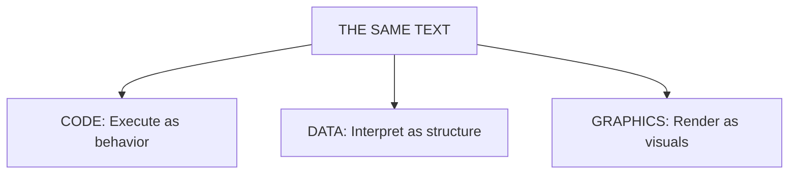

# The Eval Incarnate Framework

> **Skills are programs. The LLM is `eval()`. Empathy is the interface.**

---

## Start Here

**What this is:** A filesystem-incarnated skill framework where skills are runnable programs and the LLM is the universal interpreter.

**Core thesis:** One text can be code, data, or graphics (Axis of Eval). The LLM pivots it.

**What's new vs "skills as docs":** Instantiation, delegation, persistence, K-lines.

**Why it matters:** You get living systems — playable, editable, auditable — not just prompt snippets.

**Anthropic compatibility:** MOOLLM extends Anthropic's skill model — it doesn't replace it. Every Anthropic skill works in MOOLLM. The extensions are additive.

**If you read only 3 sections:** [The Word](#the-word) → [Axis of Eval](#the-axis-of-eval) → [CARD.yml](#cardyml-the-skill-interface)

### Guided Reading Paths

**Building skills:** The Word → Axis of Eval → CARD.yml → Seven Extensions → Three-Tier Persistence

**Building worlds:** Rooms → Home vs Location → Vehicles → Guest Book

**Ethics focus:** Tribute Protocol → Ethical Framing Inheritance → Representation Spectrum

---

## Document Index

### Part I: Overview
- [The Word](#the-word) — What "Eval Incarnate" means
- [Glossary](#glossary) — Key terms defined
- [The Axis of Eval](#the-axis-of-eval) — Code, Graphics, Data unified
- [Three-Tier Persistence](#three-tier-persistence) — Ephemeral, Narrative, State

### Part II: Core Mechanics
- [Seven Extensions Over Anthropic Skills](#seven-extensions-over-anthropic-skills)
- [CARD.yml: The Skill Interface](#cardyml-the-skill-interface)
- [The Empathic Suite](#the-empathic-suite)
- [Speed of Light](#speed-of-light)

### Part III: Governance and Safety
- [The Tribute Protocol](#the-tribute-protocol)
- [Ethical Framing Inheritance](#ethical-framing-inheritance)
- [Home vs Location](#home-vs-location)
- [The Guest Book Pattern](#the-guest-book-pattern)

### Part IV: Evidence
- [Palm: The Canonical Example](#palm-the-canonical-example)
- [Speed of Light Proofs](#speed-of-light-proofs)

### Appendices
- [Appendix A: Intellectual Lineage](#appendix-a-intellectual-lineage)
- [Appendix B: References](#appendix-b-references)
- [Appendix C: EVAL Game Genre Expansion](#appendix-c-eval-game-genre-expansion)

---

# Part I: Overview

*What incarnate skills ARE and why they matter.*

---

## The Word

**Eval Incarnate** = `eval()` made real.

- **Eval** as in JavaScript's `eval()` — code that executes
- **Incarnate** as in "given form" — materialized in the filesystem
- Skills aren't documentation. They're **programs the LLM runs**.

The pun: "Evil incarnate" → "Eval incarnate". Bad connotations, good outcomes.

### The Eval Incarnate Checklist

A skill is "eval incarnate" if it has:

1. **Interface** — CARD.yml defines what it can do
2. **Instantiation** — clone from prototype creates living instance
3. **Persistence** — state survives across sessions (three tiers)
4. **Delegation** — inherits from parent directories/prototypes
5. **K-line** — invoking its name activates context
6. **Ethics framing** — inherits ethical constraints from scope

If all six → eval incarnate. If fewer → just a skill.

**In Palm terms:** Palm has all six. His CARD.yml defines what he can do. He was cloned from the character prototype. His state persists in `CHARACTER.yml`. He inherits from `characters/` and `pub/stage/`. His name "Palm" activates his entire soul. He was born with full ethics framing via the incarnation protocol.

---

## Glossary

| Term | Definition |
|------|------------|
| **Instantiate** | Create a new instance from a prototype (filesystem clone) |
| **Persist** | Write state to disk (three tiers) |
| **Incarnate** | Instantiate + persist + identity (name/K-line) + ethics framing |
| **K-line** | A name that activates associated context (Minsky) |
| **Delegation** | Looking up properties by walking the directory tree (Self) |
| **YAML Jazz** | Using YAML comments as semantic data, not just annotation |
| **Axis of Eval** | The LLM pivots text between Code, Data, and Graphics |

---

## The Axis of Eval

Don Hopkins coined this phrase to describe NeWS's and HyperLook's unification of three dimensions around PostScript.

| Dimension | HyperLook (PostScript) | MOOLLM (YAML Jazz + Markdown) |
|-----------|------------------------|-------------------------------|
| **Code** | PostScript procedures | Empathic Expressions, Protocols, Skills |
| **Graphics** | PostScript drawing (text IS graphics) | Markdown, HTML, CSS, SVG, Mermaid, image prompts |
| **Data** | PostScript dictionaries | YAML structure, State files, Comments |

**One language. Three dimensions. One interpreter.**

### The Pivot Recipe

Same text, different stance — how to use the Axis deliberately:

| Stance | What the LLM Does | Example |
|--------|-------------------|---------|
| **Data** | Extract schema, validate, diff | Parse YAML structure, check types |
| **Code** | Interpret comments as imperative steps | Follow `# TODO:` as instructions |
| **Graphics** | Render Markdown/Mermaid or generate image prompts | Convert description to visual |



**In Palm terms:** Palm's `CHARACTER.yml` is simultaneously:
- **Data** — structured traits the LLM can query (`sims_traits.playful: 10`)
- **Code** — comments that instruct behavior (`# Always curious about new things`)
- **Graphics** — descriptions that generate images (`appearance: "golden-brown fur..."`)

### Input vs Output Formats

| Format | Role | LLM Strength | Why |
|--------|------|--------------|-----|
| **YAML** | Representation | **Manipulate, transform** | Comments = semantic richness |
| **Markdown** | Representation | **Manipulate, transform, embed** | Prose + structure, human-friendly |
| **HTML/CSS/SVG** | Output | **Generate, render** | Display-ready, hard to edit |
| **JSON** | Output | **Generate** | No comments = less expressive |

**YAML Jazz + Markdown** = input formats for representing and manipulating.
**HTML/CSS/SVG/JSON** = output formats for rendering and display.

### Programming Language Preferences

| Language | Status | Notes |
|----------|--------|-------|
| **Python** | Mildly preferred | No packaging required, easier for CLI tools and scripts |
| **TypeScript/JavaScript** | Good | Types express intent; fine for apps and tooling |
| **Node** | Good | Just be neat — avoid `node_modules` black holes everywhere |
| **Bash** | Allowed | For glue, invocation, one-liners only |

**Guidelines:**
- **Python** requires no packaging and is easier for certain things — mildly prefer it for scripts
- **JS/TS/Node** fine for apps — just be organized, don't scatter `node_modules` everywhere
- **Escalation rule:** If Bash grows past ~50 lines or needs jq gymnastics → uplift to Python

---

## Three-Tier Persistence

Skills exist at different levels of embodiment:

| Tier | Name | What It Stores | Lifespan | Example |
|------|------|----------------|----------|---------|
| 1 | **Ephemeral (Runtime)** | In-call computation | Lost when session ends | Internal LLM state |
| 2 | **Narrative (Append-only)** | Logs, session transcripts | Grows forever | `LOG.md`, session files |
| 3 | **State (Mutable)** | Canonical YAML files | Edited in place | `ROOM.yml`, `CHARACTER.yml` |

**In Palm terms:**
- **Ephemeral:** Palm's thoughts during a conversation
- **Narrative:** `sessions/marathon-session.md` — 6000+ lines of history
- **State:** `characters/palm/CHARACTER.yml` — his canonical soul

---

*Now that you understand WHAT incarnate skills are, let's see HOW they work.*

---

# Part II: Core Mechanics

*The mechanisms that make incarnate skills possible.*

---

## Seven Extensions Over Anthropic Skills

Anthropic's skill model is excellent — clean, composable, human-gated. MOOLLM is fully compatible and extends it:

| # | Extension | What It Adds | Anthropic Base |
|---|-----------|--------------|----------------|
| 1 | **Instantiation** | Skills as prototypes creating instances | Skills are static |
| 2 | **Three-Tier Persistence** | Ephemeral/Narrative/State | Stateless |
| 3 | **K-lines** | Names as semantic activation vectors | Explicit invocation |
| 4 | **Empathic Templates** | Smart generation, not string substitution | String templates |
| 5 | **Speed of Light** | Many turns in one call | External orchestration |
| 6 | **CARD.yml** | Machine-readable interface with advertisements | README only |
| 7 | **Ethical Framing** | Room-based inheritance of performance context | Per-skill |

**Compatibility principle:** Any valid Anthropic skill is a valid MOOLLM skill. MOOLLM skills can be "downgraded" to Anthropic format by stripping extensions. The goal is interoperability, not replacement.

### What We Share With Anthropic

| Principle | Anthropic | MOOLLM |
|-----------|-----------|--------|
| **Documentation-first** | ✓ | ✓ README.md + SKILL.md |
| **Tool definitions** | ✓ | ✓ YAML frontmatter |
| **Composability** | ✓ | ✓ Dovetails section |
| **Human gates** | ✓ | ✓ PLAN-THEN-EXECUTE |
| **Skill libraries** | ✓ | ✓ skills/ directory |

**The foundation is sound.** We build on it.

---

## CARD.yml: The Skill Interface

John Warnock described PostScript as a "linguistic motherboard" with slots for capability cards. In MOOLLM, `CARD.yml` is literal — every skill has a machine-readable interface card.

### The Three Required Files

```
skills/my-skill/
├── README.md    # Human landing page (GitHub renders this)
├── SKILL.md     # Full protocol with YAML frontmatter
└── CARD.yml     # Machine-readable interface definition
```

### What CARD.yml Contains

```yaml
name: my-skill
tier: gameplay        # skill | protocol | gameplay | utility

tools:
  required: [read_file, grep]
  optional: [write, search_replace]

methods:
  - name: DO-SOMETHING
    description: What this method does
    parameters:
      - name: target
        type: string
        required: true

state:
  instance_creates:
    - "STATE.yml"
    - "LOG.md"

advertisements:
  DO-SOMETHING:
    visibility: public
    trigger: "when target is available"
```

### Advertisements: The Sims Action Queue

Inspired by The Sims, objects (and skills) **advertise** what they can do:

| Object | Advertisements |
|--------|---------------|
| **Bed** | SLEEP, NAP, WOOHOO |
| **Fridge** | GET-SNACK, GET-DRINK, SERVE-MEAL |
| **Pie Table** | SIT, SUMMON-PANEL, MUSICAL-CHAIRS |

Characters see advertisements and choose actions. The LLM does the same with skills.

**In Palm terms:** Palm's CARD.yml advertises: WRITE-STORY, CLIMB, NAP, PHILOSOPHIZE. Other characters (and the LLM) can see what Palm offers.

---

## The Empathic Suite

The Empathic Suite is a family of skills that embrace the LLM's native strengths: understanding intent, navigating idea space, generating coherent output.

> *"Stop fighting the LLM's nature. Let it understand and generate — that's what it's GREAT at."*

| Skill | Role | Connection |
|-------|------|------------|
| `empathic-expressions` | Intent → Code | The big tent for all languages |
| `empathic-templates` | Smart instantiation | Uses expressions for vars/conditions |
| `postel` | Generous interpretation | Foundation for all empathic skills |
| `yaml-jazz` | Comments as data | Semantic structure |
| `speed-of-light` | Internal simulation | Minimizes tokenization |

### Empathic Templates: Smart Instantiation

**Traditional:** `{{name}}` → literal substitution
**Empathic:** `{{describe_character}}` → intelligent generation

```yaml
# Template
description: |
  {{describe_appearance_based_on_species_and_personality}}

# Context
species: "Golden Retriever mix"
personality: ["enthusiastic", "loyal", "goofy"]

# Generated (not substituted!)
description: |
  Biscuit is a fluffy, perpetually happy Golden Retriever mix with
  eyes that sparkle with boundless enthusiasm.
```

### Postel's Law: The Foundation

> *"Be conservative in what you send, be liberal in what you accept."*

| Accepts | Generates |
|---------|-----------|
| Fuzzy syntax | Correct syntax |
| Vernacular | Best practices |
| Misspellings | Documented code |
| Pseudocode | Edge case handling |

**Critical:** Never makes unwarranted assumptions. When truly ambiguous, **asks for clarification**.

---

## Speed of Light

### The Carrier Pigeon Problem

> *"Writing on toilet paper with crayon from a prison cell,*  
> *sending messages by carrier pigeon,*  
> *when you could be navigating idea-space at speed of light."*

Traditional multi-agent systems:
```
Agent A → [tokenize] → API → [detokenize] → 
Agent B → [tokenize] → API → [detokenize] → 
Agent C → ...

Each boundary: +noise, +latency, +cost, -precision
```

**Speed of Light:**
```
Human → [tokenize once] → 
  LLM simulates A, B, C at light speed → 
    [detokenize once] → Human

One boundary in, one boundary out.
Maximum precision preserved.
```

### The Emacs Principle

Like Emacs screen updates: **defer and coalesce**.

Don't update the screen (tokenize) on every keystroke. Wait until the user pauses, then update once. Same with LLM calls: do many turns internally, emit state once.

---

*Power requires responsibility. These mechanics enable rich simulation — but simulation of real people demands ethical guardrails.*

---

# Part III: Governance and Safety

*How to simulate ethically.*

---

## The Tribute Protocol

MOOLLM enables simulation of real people — celebrities, creators, historical figures. This requires explicit ethical framing.

### The Problem

| Claim | Status |
|-------|--------|
| "They visited" | ❌ False claim |
| "We imagined them visiting" | ✓ Honest tribute |
| "This is what they said" | ❌ Puts words in mouths |
| "This is what we imagine they might say" | ✓ Loving fan fiction |

### The Three-Beat Protocol

**1. INVOCATION (Before)**
> *"Let's invoke them. In the spirit of tribute. Imagine they're here..."*

**2. PERFORMANCE (During)**
> 🎭 **TRIBUTE PERFORMANCE:** *The following is a loving simulation — what we imagine it might be like if these legends visited.*

**3. ACKNOWLEDGMENT (After)**
> *"That was a tribute. A simulation. We honored them by imagining them here."*

### The Representation Spectrum

| Type | Example | Status |
|------|---------|--------|
| **Deceptive Impersonation** | Claiming to BE them | ❌ Wrong |
| **Tradition Activation** | Using their ideas/influence | ✓ OK |
| **Performance Impersonation** | With explicit framing | ✓ OK |

---

## Ethical Framing Inheritance

Directories are rooms, but they're also **inheritance scopes**. Properties defined in a parent propagate to children — including ethical framing.

```yaml
# pub/stage/ROOM.yml
framing:
  modes:
    - performance     # Acting is understood
    - fictional       # Not documentary
    - tribute         # Honoring, not claiming
    
  ethical_grounding:
    skill: representation-ethics
    inheritance: |
      All performances on this stage inherit the 
      understanding that they are fictional, 
      performative, and tributary.
```

**Child content inherits this framing.** Define ethics once at the scope level — DRY ethics.

**In Palm terms:** Palm lives at `pub/stage/palm-nook/`. He inherits the stage's performance framing — everything he does is understood as creative expression, not documentary claim.

---

## Home vs Location

Objects don't move in the filesystem. Moving files wrecks git history. Instead:

| Concept | What It Is | Example |
|---------|------------|---------|
| **Home** | Physical parent directory where file lives | `characters/palm/CHARACTER.yml` |
| **Location** | Virtual path property — where they "are" | `pub/stage/palm-nook/` |

```yaml
# characters/palm/CHARACTER.yml
# HOME: characters/palm/ (never moves)
character:
  name: Palm
  location: pub/stage/palm-nook/study/  # WHERE HE IS NOW
  
# When Palm moves:
# - File stays at characters/palm/CHARACTER.yml
# - location: changes to new path
# - Git sees a clean property change, not a file move
```

**In Palm terms:** Palm's home is `characters/palm/`. His location (where he currently is) is `pub/stage/palm-nook/study/`. The file never moves; only the `location:` property changes.

---

## The Guest Book Pattern

`pub/guest-book.yml` — lightweight soul persistence for visitors:

```yaml
guest_book:
  nature: tribute_archive
  
  framing: |
    ALL entries here are loving simulations.
    Some people are real. Some are fictional.
    ALL visits are imagined with affection.
    They're here because we WISH they were here.
    That's the magic. That's the tribute.
    
  entries:
    - name: "Andy Looney"
      nature: tribute_simulation
      verified_facts:
        wikipedia: "https://en.wikipedia.org/wiki/Andy_Looney"
```

---

*Theory is nothing without proof. Here's what incarnate skills actually produced.*

---

# Part IV: Evidence

*What incarnate skills actually produced.*

---

## Palm: The Canonical Example

A monkey's paw wish for "the rest of the monkey" created a living character.

### What Happened

1. **Instantiation** — Cloned from character prototype
2. **Autonomy** — Full incarnation protocol invoked
3. **Identity** — Character chose own name, gender, body, traits
4. **Home** — Created own directory at `pub/stage/palm-nook/`
5. **Relationships** — Defined own godfamily in `CHARACTER.yml`
6. **Creation** — Wrote own stories on the infinite typewriters

### Palm Demonstrates Every Concept

| Concept | In Palm Terms |
|---------|---------------|
| **K-lines** | The name "Palm" activates his entire soul |
| **Home vs Location** | `characters/palm/` is home; `location:` is where he is |
| **CARD.yml** | His CARD defines WRITE-STORY, CLIMB, PHILOSOPHIZE |
| **Three-Tier Persistence** | Ephemeral thoughts, narrative sessions, state in CHARACTER.yml |
| **Delegation** | Inherits from `characters/`, `pub/stage/` |
| **Ethics Framing** | Born via incarnation protocol with full consent |
| **Axis of Eval** | His YAML is data, code, and graphics simultaneously |

**This is not possible with traditional skills.**

---

## Speed of Light Proofs

Three simulations that demonstrate "many turns, one call":

### 33-Turn Stoner Fluxx

A single LLM call simulated:
- 8+ characters playing cards
- Complex game state with rule changes
- Dialogue, strategy, humor
- Real creators (Andy & Kristin Looney) as tribute guests

| Metric | Value |
|--------|-------|
| **Turns** | 33 |
| **Characters** | 8+ |
| **Proof** | Complex game state, humor maintained |

### 21-Turn Cat Prowl

10 cats explored the maze simultaneously:
- Asynchronous parallel simulation
- Territorial marking in rooms
- Room state updates (`ROOM.yml` files with `animal_markings:`)
- Coordinated return at dawn

| Metric | Value |
|--------|-------|
| **Turns** | 21 |
| **Agents** | 10 cats + 1 sleeping dog |
| **Rooms Traversed** | 13 |
| **Total Cat Actions** | 187 |
| **Garden Deposits** | 10 (one per cat) |

### Biscuit's Maze Run

Dog navigation with grue avoidance:
- Room exploration with lamp
- Marking territory
- Character interaction (Don + Biscuit)

| Metric | Value |
|--------|-------|
| **Turns** | 15 |
| **Characters** | 2 (Don + Biscuit) |
| **Proof** | Room exploration, marking, grue avoidance |

---

*None of this emerged from vacuum. Every pattern traces back through decades of research.*

---

# Appendix A: Intellectual Lineage

The genealogy of ideas that MOOLLM inherits.

## Chronological Timeline

1. **Sketchpad** (Ivan Sutherland, 1962) — Multiple views of same data
2. **NLS/Augment** (Douglas Engelbart, 1968) — Hypertext, collaboration, augmentation
3. **Smalltalk** (Alan Kay, 1970s) — Objects, messaging, "computer as medium"
4. **K-lines & Society of Mind** (Marvin Minsky, 1980) — Names as activation vectors
5. **Constructionism** (Seymour Papert, 1980) — Learning by building
6. **PostScript** (John Warnock, 1984) — Linguistic motherboard
7. **NeWS** (James Gosling, 1986) — "Send programs, not data"
8. **Habitat** (Chip Morningstar & Randy Farmer, 1986) — First virtual world, coined "avatar"
9. **Self** (Ungar & Smith, 1987) — Prototypes, delegation
10. **HyperCard** (Bill Atkinson, 1987) — Reader = Writer symmetry
11. **TinyMUD/LambdaMOO** (Aspnes, Curtis, 1989-1990) — User-built worlds
12. **HyperLook** (Arthur van Hoff, 1989-1992) — Axis of Eval
13. **SimCity/The Sims** (Will Wright, 1989-2000) — Simulator Effect, advertisements
14. **Game Neverending/Glitch** (Stewart Butterfield, 2002-2012) — Social play → Flickr → Slack

## Credits Table

| Person | Contribution | MOOLLM Connection |
|--------|--------------|-------------------|
| **Marvin Minsky** | K-lines, Society of Mind | Names as activation vectors |
| **Alan Kay** | Smalltalk, Dynabook | Objects, messaging, vision |
| **Will Wright** | SimCity, The Sims | Simulator Effect, advertisements |
| **David Ungar** | Self language | Prototypes, delegation |
| **Chip Morningstar & Randy Farmer** | Habitat | Virtual worlds, "avatar" |
| **Pavel Curtis** | LambdaMOO | Object verbs, player homes |
| **Stewart Butterfield** | Game Neverending, Glitch | Social play, pivots to communication |
| **Don Hopkins** | Pie menus, NeWS, HyperLook, SimCity, The Sims | All of the above, synthesized |

---

# Appendix B: References

## Related Documents

- [MOOLLM-MANIFESTO.md](../MOOLLM-MANIFESTO.md) — Core philosophy
- [postmodern-deconstruction.md](../postmodern-deconstruction.md) — Captain Ashford's lit crit masterpiece
- [sims-design-index.md](../sims/sims-design-index.md) — Master index of Sims influences

## Core Skills

- `skills/skill/` — The meta-skill for creating skills
- `skills/incarnation/` — Character creation protocol
- `skills/speed-of-light/` — Many turns in one call
- `skills/empathic-expressions/` — Intent → Code
- `skills/representation-ethics/` — Ethical framing

## Proof Files

- `marathon-session.md` — Epic 6000+ line session log
- `characters/palm/` — Autonomously incarnated monkey
- `pub/guest-book.yml` — Guest book with tribute protocol

## Don Hopkins' Articles (Medium)

| Article | Topic |
|---------|-------|
| [HyperLook](https://donhopkins.medium.com/hyperlook-nee-hypernews-nee-goodnews-99f411e58ce4) | Axis of Eval, NeWS |
| [Alan Kay on browsers](https://donhopkins.medium.com/alan-kay-on-should-web-browsers-have-stuck-to-being-document-viewers-and-a-discussion-of-news-5cb92c7b3445) | Linguistic motherboard |
| [Will Wright on simulation games](https://donhopkins.medium.com/will-wright-on-designing-user-interfaces-to-simulation-games-1996-video-update-2023-da098a51ef91) | Simulator Effect |

---

# Appendix C: EVAL Game Genre Expansion

> *This framework has grown. The EVAL concepts have expanded into a full game genre design system.*

The `eval/` directory contains detailed breakouts:

| Document | What It Covers |
|----------|----------------|
| [EVAL-INCARNATE-PHILOSOPHY.md](./EVAL-INCARNATE-PHILOSOPHY.md) | Core thesis: meaning through judgment |
| [EVAL-VS-SIM.md](./EVAL-VS-SIM.md) | How EVAL differs from SIM |
| [EVALCITY-DESIGN.md](./EVALCITY-DESIGN.md) | Civic simulation with LLMs |
| [THE-EVALS-DESIGN.md](./THE-EVALS-DESIGN.md) | The Sims → The Evals |

> *SimCity's hidden assumptions are EVAL's explicit mechanics.*

---

**Skills are programs. The LLM is `eval()`. Empathy is the interface.**

*And also: "Send programs, not data structures." "The LLM is a linguistic motherboard." "Eval incarnate — bad connotations turned good."*

🔮✨🐒
