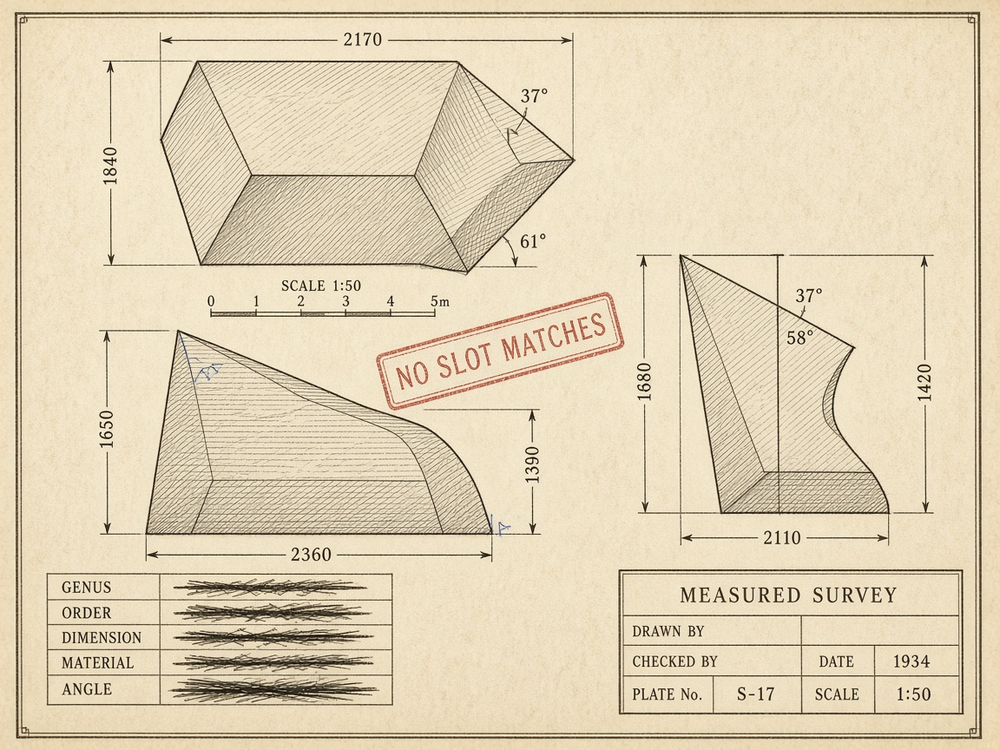
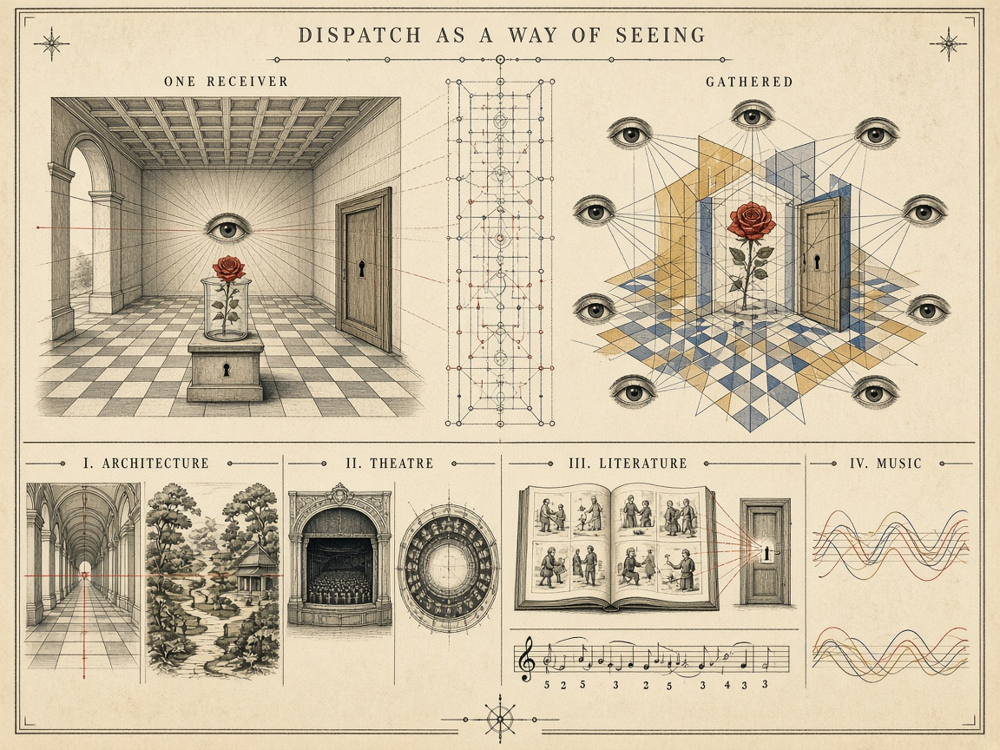

# Case study: mystery as dispatch, and then all of it

*A [Korz](../README.md) case study, alongside [case-zork.md](../case-zork.md) (Zork as shipped
five-dimensional dispatch) and [case-cellular-automata.md](../case-cellular-automata.md)
(Korz at absolute zero). This one runs the other direction: not a program read as
narrative, but **narrative read as a dispatch configuration** — and the claim is that the
genre names critics have used for a century are descriptions of which coordinate is
unbound.*

[](images/headline-mystery-and-art.md)

***One drawer is open and there is nothing in it.*** Every row of the table below is a different empty
drawer, and the form you are reading is the name on the open one. The plates are not arranged in this
room, they are kept in it — which is what [`images/INDEX.yml`](images/INDEX.yml) is, and why the four
visual registers are allowed to disagree. →
[about this plate](images/headline-mystery-and-art.md) ·
[prompt girders](images/headline-mystery-and-art.yml) ·
[the whole pile](images/INDEX.yml)

## The observation that starts it

> Howcatchem crystallizes who. Whodunit computes who. — Don, Sept 2026

Which is Korz′'s two tiers, named by detective fiction first. In Korz′ a slot is either
**crystallized** — decidable, matched by the strict tier — or it **deoptimizes** to the
soft tier, which improvises an answer the compiled guards could not supply
([korz-prime/README.md](../korz-prime/README.md)).

An inverted detective story (Columbo, *Crime and Punishment*, most heists) hands you the
culprit in the first act: `rcvr` arrives **bound**, a constant, and the drama is entirely
in the mechanism. A classical whodunit leaves the same coordinate **unbound** and the whole
form is the computation of it. Same sea of slots. Different guard configuration.

So a genre is not a plot shape. **A genre is a dispatch configuration**: which coordinates
arrive bound, which one you are solving for, and who holds which bindings.

## The mystery table

| Genre | Solving for | Dimension | Specimens |
|---|---|---|---|
| **Whodunit** | the agent | `rcvr` unbound, computed | Christie, the drawing-room form |
| **Howcatchem** | the mechanism of catching | `rcvr` crystallized; `method` computed | Columbo, *Poker Face* |
| **Howdunit** | the mechanism of doing | `method` foregrounded, all else given | heist films, *Rififi*, Ocean's Eleven |
| **Whydunit** | the motive | **`purpose`** unbound | Highsmith, *Crime and Punishment*, most literary crime |
| **Wherecatchem** | the coupling, the place | `place` | *Pokémon Go*, geocaching, the hunt genre |
| **Whendunit** | the alibi, the timetable | `time` | Crofts' railway timetables, *Memento*, time-loop films |
| **Whatdunit** | whether there was an act, and of what kind | the *class* is unbound | Kafka, *The Crying of Lot 49*, cosmic horror |

Three entries earn their place by being more than labels.

**The whydunit is the detective genre of the `purpose` dimension.** It is the form in which
every coordinate is bound except why, and readers experience an unbound `purpose` as the
most unbearable of the gaps — more than who, more than how. Which is a point in favor of
the dimension existing
([korz-prime/examples/purpose-dimension.md](../korz-prime/examples/purpose-dimension.md)).

**Whatdunit is the horror case, and it is a guard failure rather than a search.** Cosmic
horror is the genre where the unbound dimension *cannot be bound by the reader's
vocabulary* — no coordinate in the reader's sea fits, so no slot matches, and the dread is
the dispatch failure itself. Lovecraft's adjectives are the transcript of a lookup
returning nothing: unnameable, indescribable, non-Euclidean. He is not being lazy. He is
reporting a miss.

[](images/cosmic-horror-no-slot-matches.md)

***The horror is in the paperwork.*** No creature, because drawing it would bind the class and lose
the claim. Instead a complete, competent, professionally executed survey whose own measurements
contradict each other — 2170 in plan, 2360 in elevation, 2110 in section. The instrument worked and
the hand was steady; the world did not fit the form. Note who signed it. →
[about this plate](images/cosmic-horror-no-slot-matches.md) ·
[prompt girders](images/cosmic-horror-no-slot-matches.yml)

**And a locked room is a type error.** The sub-genre, for anyone who has not spent time in it:
a body is found in a space that nothing could have entered or left — door bolted from the
inside, windows barred, snow outside unmarked — so the crime is not merely unsolved but
*impossible*. Poe invented it in 1841 with "The Murders in the Rue Morgue"; John Dickson Carr
made a career of it and stopped *The Hollow Man* (1935) dead in chapter 17 to deliver a lecture
enumerating every known solution.

The constraints over-determine and nothing matches. And the solution is *always* the discovery
of a dimension nobody knew was in the sea — a passage, a twin, a clock that was wrong, a room
that was not locked at the time you assumed.

[](images/locked-room-missing-axis.md)

***The room that closes on every side.*** Every dimension on the plate agrees with every other
one, and the answer is still not in it — because the failure is one level up, in the list of
things worth measuring. → [about this plate](images/locked-room-missing-axis.md) ·
[prompt girders](images/locked-room-missing-axis.yml)
Korz's answer to "nothing matched" is that your guards were written over the wrong axes,
which is the locked-room solution stated as a compiler diagnostic. The genre's fair-play
rule is even the Korz discipline: the author must have put the dimension in the sea before
the reveal.

**And the genre bans the same repair a type system bans, for the same reason.** There are two
ways to make "no slot matches" go away. Extend the context with a coordinate that was present
all along — the fair-play solution, and the one that leaves the reader able to re-read the book
and find it. Or *relax the guard* so the mismatch stops being reported, which is
`as any`: the error is gone, nothing was learned, and the next reader cannot reconstruct why
the call is safe. Knox's rules are a lint against precisely that move — no undisclosed
passages, no twins sprung in the last chapter, no poison unknown to science. **`as any` is the
secret passage nobody told you about**, and Chekhov's gun is the same rule pointed forward:
declare the dimension in act one or you may not dispatch on it in act three.

**Which is what "fair play" buys, and it is a property worth naming precisely: re-readability.**
A locked-room solution adds no fact from outside. It *re-indexes* facts already on the page — the
lamp, the mirror, the time on the clock, which way the snow was disturbed were all given to you,
and each meant something other than what you assumed. So the second reading is a different book:
the clues are visible, and the misdirection is visible *as* misdirection, with nothing retracted.
That is why the form rewards re-reading more than any other kind of mystery, and why the
withheld-fact solutions Knox and Van Dine banned — the twin sprung in the last chapter, the
poison unknown to science — cannot be re-read at all. Re-reading can only show you what was
already there.

A suppressed type error is the same transaction run backwards. `as any` makes the program
compile and deletes the record that an axis was ever missing, so the next reader — including you
in a year — has no way to reconstruct why the call is safe. **One keeps the evidence of the
missing dimension at the site; the other keeps the silence.** Fair play and a good error message
are the same discipline.

[](images/as-any-secret-passage.md)

***The passage is real. The drawing has been scraped.*** The indictment is not the passage, which
is ordinary joinery. It is that the dimension lines were carefully redrawn to close across the
gap, so the record does not merely omit the passage but asserts its absence. →
[about this plate](images/as-any-secret-passage.md) ·
[prompt girders](images/as-any-secret-passage.yml)

### Two passes minimum, and the second one is lit

"Re-readable" above is doing too little work, because it does not say what the second pass *is*.
Don's account, which is the mechanism:

> The first is a shadowed reading without foreknowledge, seeing the dark side of everything
> unilluminated with knowledge of the fate of the story. The second you see the bright side knowing
> all the connections — or more, re-reading some books makes a richer and richer understanding. It
> survives the surprise of the first viewing, because it serves you another layer you were not aware
> of before.

**Two is the floor, not the count.** The shadowed pass and the bright pass are the minimum a work
must support to survive at all; the good ones keep paying out past two, which is a different and
harder property than merely not collapsing when spoiled.

In this vocabulary the two passes are **the same text dispatched under different bound contexts**,
and nothing about the text changes between them:

```yaml
first_reading:  {rcvr: the-text, foreknowledge: none}         # shadowed
second_reading: {rcvr: the-text, foreknowledge: the-ending}   # lit
```

Which gives the test, and it is sharp: **a work survives re-reading exactly when it has slots guarded
on a coordinate the first pass cannot bind.** If every slot is guarded only on position-in-the-plot,
the second pass dispatches identically to the first and there is nothing there — you have a machine
for producing one surprise, and you already spent it. The layer Don describes being "served" on the
second pass was always in the dispatch table; the first reading simply could not satisfy its guard.

And the lighting is not a metaphor borrowed for the occasion — it is the same mechanism as the
[webtop's candles](../../webtop/READ-UNREAD.md), where light intensity is attention weight and **a
saved lighting rig is a K-line**. The first pass is what *builds* the p-tree of agents. The second
pass is the k-line firing over it, which is why it arrives illuminated rather than merely remembered.
You are not recalling the book, you are running it with a mask you did not have the first time.

### The conversion, which is the finding

**A whodunit re-read is a howcatchem.** Both rows of the mystery table, the same text, no edit.

You now know who, so the whodunit's question is answered before page one and the pleasure has
nowhere to go but the mechanism — how it was done, how it was concealed, how close the detective came
and when. That is Columbo's form exactly. **The genre changed under re-dispatch while the text stood
still**, which is the strongest evidence in this essay that genre is a coordinate in the reader's
context rather than a property of the book.

[](images/whodunit-and-howcatchem.md)

***Nothing moved. Only the lighting rig changed.*** Same set, same camera, same five people in the
same postures — and the key, the note and the glass on the table are present in the left panel too,
sitting in the black. Fair play rendered as exposure: the clue was always on the stage, and the
second pass has to be able to go back and find it there. →
[about this plate](images/whodunit-and-howcatchem.md) ·
[prompt girders](images/whodunit-and-howcatchem.yml)

**Oedipus is the limiting case, and it runs the other way.** The Athenian audience knew the myth
walking in — every one of them, no exceptions — so Sophocles wrote for people who *could not have a
shadowed pass*. Everybody arrived lit. Which means dramatic irony is not a bonus the second time
through; for that play it is the only reading that was ever available, and the work is built to be
watched exclusively in the bright mode. **So the bright pass is not a derivative or lesser
experience. You can build the entire work for it**, and the canonical tragedy of the Western
tradition is the proof.

**And the venue enforced it physically.** Greek drama was performed outdoors, in daylight, at the
festival, in an open amphitheatre with no way to darken the house. **You cannot stage a shadowed pass
at midday in the sun.** Which turns dramatic irony from a privilege the author grants into a
constraint the building imposes — Sophocles had no dimmer, every face in the bowl was lit, and the job
was to write something worth watching under exactly that condition.

[](images/oedipus-aliasing-bug.md)

***One mask, two cords, two names.*** Not two masks that resemble each other — that would be a twin,
the cheat Knox banned. A single object with two attachments, which is why it is an aliasing bug and
not a twist: both names were correct all along, and the investigation was competent. →
[about this plate](images/oedipus-aliasing-bug.md) ·
[prompt girders](images/oedipus-aliasing-bug.yml)

### Three ways a work survives, because your own examples span three

Blade Runner, 2001 and Holy Grail do not survive by the same mechanism, and lumping them together
would lose the useful part:

| Mode | What the second pass does | Specimens |
|---|---|---|
| **Revelation** | binds a coordinate that was present and unsatisfiable — a layer *was* there | the fair-play locked room · [*The Man in the High Castle*](../../pkd/README.md#the-man-in-the-high-castle-is-the-re-reading-novel) · the concealed allegiance |
| **Ambiguity** | binds a coordinate **the text never binds at all**, and may bind it differently each time | *Blade Runner* — is Deckard a replicant · *2001* — the monolith |
| **Anticipation** | binds nothing new; the text becomes an **activator** for a mask you already carry | *Holy Grail* · *Rocky Horror* · any line you can quote |

Only the first is what "surviving the surprise" usually means, and it is the one the Detection Club
legislated. **The second is a different and riskier design: ship the work with a load-bearing
coordinate deliberately unbound.** *Blade Runner* does it twice over, because it also exists as a
family of disagreeing variants — the 1982 theatrical cut with its voiceover and its borrowed happy
ending, the 1992 Director's Cut restoring the unicorn, the 2007 Final Cut — and Scott has said
Deckard is a replicant while Ford has said he played him as a man. The authors do not agree, the cuts
do not agree, and the film is better for refusing to settle it. A work as a dispatch table with a
hole in it, rather than a work with an answer.

**The third mode is not re-dispatch at all**, which is why it feels so different from the inside.
Nothing is revealed and nothing is re-bound; the k-line simply fires. You are not discovering a rung,
you are performing one you already have, which is why it works out loud and in company, and why the
line lands *harder* when everyone in the room knows it is coming.

**And that is what a con is.** Quote-alongs, callbacks, costuming, filk — fandom is the third mode
institutionalised: a culture organised around firing shared k-lines aloud, together, on purpose. The
fandom roots are not an aside to the argument, they are the field site where this mode is practised as
a discipline rather than an accident.

### So fair play was a re-readability specification all along

Which turns the earlier point about Knox into something stronger than a lint. **Knox's Decalogue
(1929) and Van Dine's Twenty Rules (1928) are a test suite for the second pass.** Every prohibition
in them — no undisclosed passages, no twin sprung in the last chapter, no poison unknown to science —
bans a solution that the bright reading cannot validate. A "cheat" is *defined* as a move the second
pass exposes as having no support on the page.

So the golden age wrote a re-readability guarantee and filed it under sportsmanship. And the codebase
mirror holds all the way down: `as any` is the move whose defence is that nobody will re-read the
line. Fair play, a good error message, and a work that survives its own ending are one discipline
seen from three distances.

## The Canon already said it, and somebody in Alan Kay's house is still working the seam

This document's title claims mystery and art are one mechanism differently configured. **Doyle
claims it outright in 1893.** Asked where his faculty comes from, Holmes credits not logic but
inherited *artistic* temperament — his grandmother was the sister of the painter Vernet:

> "Art in the blood is liable to take the strangest forms." — Holmes, "The Greek Interpreter"

Detection as a strange form of painting, from the man who invented the detective. The perspective
panel and the Cubist panel were never separate arguments.

[](images/art-in-the-blood.md)

***The palette that holds no paint.*** The labels are lettered where the pigment names belong,
because in this studio these are the pigments. → [about this plate](images/art-in-the-blood.md) ·
[prompt girders](images/art-in-the-blood.yml)

**Bonnie MacBird took that sentence for the title of her first novel**, and has written six
Sherlock Holmes adventures for HarperCollins — *Art in the Blood* (2015), *Unquiet Spirits*
(2017), *The Devil's Due* (2019), *The Three Locks* (2021), *What Child Is This?* (2022), *The
Serpent Under* (2025). She also co-wrote *TRON*, produced to three Emmys, acts, narrates her own
prologues, paints, and volunteers for the Sherlock Holmes Society of London. She has been married
to Alan Kay since 1983.

That is a coincidence worth exactly one sentence, except that her books keep landing on this
document's mechanics, so it gets a section instead.

### Pastiche is a gather along the author coordinate

The Canon is a fixed sea of slots — Baker Street, the characters, the period, Watson's voice. A
pastiche binds an `author` coordinate over that sea and dispatches. Fidelity is *guard matching*:
the praise MacBird gets (*"the best and most faithful pastiche writer out there today"* —
Alistair Duncan) is a claim that her guards agree with Doyle's on contexts Doyle never wrote.
Which is why the failure mode of bad pastiche is so specific and so recognizable — not bad prose,
but a slot firing that the original's guards would have excluded. Irene Adler wheeled on for no
reason. The Giant Rat of Sumatra cashed in. MacBird is noted for declining both.

### *The Three Locks* is polysemy used as structure

The 1887 plot runs three mysteries that turn out to connect: an impenetrable silver box sent to
Watson carrying a secret from his own past; the escape artist Dario Borelli burned alive on stage
inside the "Cauldron of Death" illusion *designed by his wife*; and a Cambridge don's daughter
whose dismembered lookalike doll is found floating in **Jesus Lock** on the River Cam before she
herself is found drowned.

Three locks, and **the word means something different each time** — a lock you pick, a lock you
escape, a lock that raises a river. The title is one name gathered along three axes, and the
novel's construction is the gather. That is the `rcvr`-versus-`place` distinction run as a plot
device rather than a diagram.

[](images/three-locks-polysemy.md)

***One word, asked three times.*** Three panels, one caption — because captioning them separately
would make it a glossary, and captioning them once makes it a gather. A guard on a container, a
constraint on a body, and a piece of civil engineering. →
[about this plate](images/three-locks-polysemy.md) ·
[prompt girders](images/three-locks-polysemy.yml)

Madame Ilaria Borelli is the other thing worth noting: she builds the effects and her husband
takes the stage, and her grievance is that the credit attaches to whoever is standing in the
light. Which is the [credit-diffusion](https://github.com/SimHacker/WillWrightShowForFood)
problem in a corset, written by someone who spent thirty years in film production.

### A reviewer supplied evidence for the table without meaning to

The strongest support for *genre is a dispatch configuration* in this whole document comes from
someone with no interest in the claim. Reviewing *The Three Locks*, the Classic Mystery blog
objects:

> "It reads like more of a whodunit mystery than a typical Holmes tale — for example, Holmes seems
> to take the whole book to work out who the villain of the piece is, unlike his usual trick of
> basically knowing what is going on from moment one and then just being annoyingly quiet about
> the whole thing."

**That is the table's first two rows, felt as a character violation.** Canonical Holmes is a
*howcatchem*: `rcvr` crystallized in act one, and the "annoyingly quiet" interval is the reader
watching a bound coordinate be withheld. MacBird left it *unbound* and wrote a whodunit in
Holmes's clothes. The reviewer could not name what moved, registered it as Holmes behaving
unlike himself, and reached for "that didn't feel like Holmes to me."

Which is the prediction the frame makes and the one that could have failed: **readers detect
which coordinate is unbound, precisely, without vocabulary for it, and experience a change of
binding as a change of character.** Genre is not a marketing label applied after the fact. It is
load-bearing, and audiences audit it.

## Point of view is subjective dispatch

Korz's own gloss: gather the sea's slots along `rcvr` and you see objects; gather along
`user` and you see **one person's view of the system**. That is not an analogy for
narrative point of view. It is the same mechanism.

- **Dramatic irony** is differential binding. In Columbo the audience's context has the
  culprit bound and the detective's does not. Same slots, different guards match, and the
  tension is exactly the delta between two gathers.
- **The unreliable narrator** is a transcript that disagrees with the bindings — the
  *hidden dither* quadrant from [moody-temperature.md](../korz-prime/examples/moody-temperature.md),
  where the printed context claims `temperature: 0` and the dice are rolling. Same failure
  mode, same diagnosis, and mystery fiction has been exploiting it since 1926.
- ***Rashomon*** is the canonical Korz film: gather four times along `witness`, refuse to
  privilege a cut, and let the absence of a dominant decomposition be the content.
- **Oedipus is an aliasing bug.** `detective` and `culprit` turn out to be the same
  coordinate, and the tragedy is the discovery of the alias rather than the identity. Every
  reveal of the form "you were the monster" is this one bug.

## Widening: the same move outside the mystery

If a genre is which coordinate is unbound and who holds the bindings, the frame does not
stop at crime.

| Form | Configuration |
|---|---|
| **Tragedy** | The audience's context carries a binding the protagonist's lacks — prophecy, the letter that went astray. Fate *is* an ambient coordinate everyone but him can read |
| **Farce** | Two contexts with *conflicting* bindings on one sea. Mistaken identity is a wrong `rcvr` that keeps dispatching plausibly, which is why the mechanism must be watertight to be funny |
| **Romance** | The unknown is `purpose`, held by the other party. A whydunit of the heart, and the reason the genre survives a thousand identical plots is that the coordinate is genuinely unreadable from outside |
| **Bildungsroman** | The protagonist's *own* `purpose` starts unbound and ends bound. Coming of age is binding your own setpoint — which is closure, and is why the form feels like becoming a person rather than learning a fact |
| **Satire** | The acts dispatch under a purpose the reader holds and the characters do not. Remove the reader's binding and satire reads as endorsement, which is the entire history of misread satire |
| **Lyric poetry** | No unknown at all. Maximum meaning gain, zero mystery — the moody keyboard rather than the detective |
| **Ambient and generative art** | The work is a **context author**: it writes bindings the audience's other dispatches then read. MOODY, exactly |

[](images/bildungsroman-binding-your-own-setpoint.md)

***The failures are mounted too, and at the end the mark changes.*** The split dovetail is bracketed
as proudly as the finished joint, because in this form the mistakes are the mechanism rather than the
obstacle. And the guilds made the coordinate physical: your work went out under your master's mark
until you were granted one of your own. Five worn stamps, then a different stamp struck fresh —
`whose_purpose` changing hands as a piece of steel. →
[about this plate](images/bildungsroman-binding-your-own-setpoint.md) ·
[prompt girders](images/bildungsroman-binding-your-own-setpoint.yml)

## The two claims worth arguing about

### Cubism is symmetric dispatch

Renaissance perspective is **single-receiver dispatch**: one privileged station point, the
picture composed *to* a particular eye, every other viewpoint wrong. Cubism gathers the
same object along several viewer coordinates at once and declines to make one dominant —
which is Korz's central claim, that no decomposition is the dominant one, rendered in paint
twenty years before Korzybski named the error and eighty before Ungar formalized it.

Which makes the usual complaint about Cubism ("it doesn't look like anything") the exact
complaint a Smalltalk programmer makes about a slot sea: *where is the object?* Gathered,
if you ask along an axis. Not before.

[](images/cubism-symmetric-dispatch.md)

***Two ways of seeing, one of which names its eye.*** A perspective construction is a guard with
one coordinate in it; the station point is a binding, not a technique. →
[about this plate](images/cubism-symmetric-dispatch.md) ·
[prompt girders](images/cubism-symmetric-dispatch.yml)

### Melodrama is the is-of-identity; tragedy is E-Prime

Korz is E-Prime for objects — the rose is not red, redness lives in the dispatch
([README.md](../README.md)).

**Melodrama binds the moral coordinate into the object.** The villain *is* evil, the way
the rose *is* red. **Tragedy leaves it relational**: the act dispatches monstrous from this
position, in this context, and would not from another. Antigone and Creon are both right
along their own axes, and the form is the collision rather than the verdict.

Which predicts something checkable: melodrama ages into camp and tragedy does not. The
Korzybski violation is the part that spoils, because a property welded into an object stops
matching any context the author did not live in, while a relation recomputes against
whatever context arrives. Same reason a hardcoded constant rots and a guard survives.

[](images/melodrama-and-tragedy.md)

***Same shop, same hand, same age — and the decay is worst exactly where the moral claim was
painted.*** The cape and the hat survive; the face and the word have gone. A hardcoded constant rots
at the constant. On the sound flat nothing is labelled, both figures are equally lit, and their hands
nearly touch — the property is in the gap, which is where a relation lives. →
[about this plate](images/melodrama-and-tragedy.md) ·
[prompt girders](images/melodrama-and-tragedy.yml)

## Why this is not a party trick

Two payoffs, one for each direction of the analogy.

**For Korz:** narrative forms are a several-thousand-year empirical search over dispatch
configurations, run by people optimizing for whether an audience can *follow* it. Which
configurations are legible, which are unbearable, which need the binding withheld and which
need it given away in act one — that is data about dimension design, from the only
discipline that has been testing it at scale. The whydunit being the most gripping
configuration is evidence about `purpose`. The locked room always resolving to an unknown
axis is evidence about guard completeness.

**For the reader of this repo:** it is the same claim the rest of the design makes in a
register that is harder to fake. Dimensions are not a programming convenience. They are how
attention gets organized, which is why the publishing ladder, the torch overlay, the
advertisement economy and the mystery genre keep turning out to be one mechanism — and why
literature is the oldest prosthetic for holding a context whose bindings are not yours.

## Open questions

- Is there a genre for `device` — a form whose unbound coordinate is *the medium*? Concrete
  poetry and demoscene work feel like candidates, where the constraint is the content.
- The `assertions` dimension has no obvious narrative analogue, which is either a gap in
  the mapping or a hint that debug modes are peculiar to machines.
- If binding your own `purpose` coordinate is closure, and the Bildungsroman is the
  literary form of that event, is the reason no machine has the form yet the same reason it
  has no closure?

**See also:** [case-zork.md](../case-zork.md) — the same repo reading a game engine as five
hardwired dimensions · [korz-prime/examples/purpose-dimension.md](../korz-prime/examples/purpose-dimension.md)
— the dimension the whydunit is about ·
[../TELEOLOGY.md](../../TELEOLOGY.md) — whodunit / howcatchem / wherecatchem as three genres
of question about minds, which is where this frame came from
