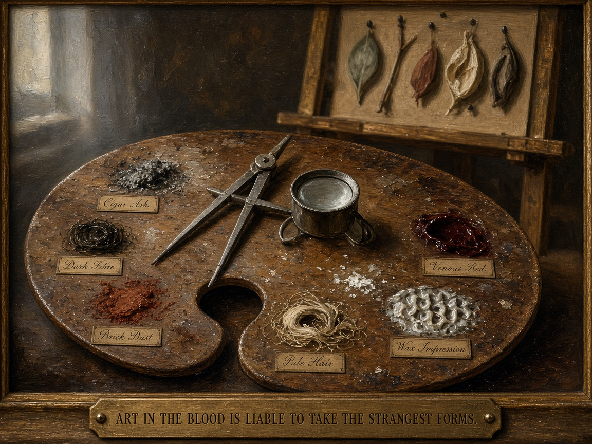

# The palette that holds no paint

**Plate for:** [*Case study: mystery as dispatch*](../README.md) — the section where Doyle says the
quiet part · **Girders:** [`art-in-the-blood.yml`](art-in-the-blood.yml)

It reads as a still life first, and it should: a well-used mahogany palette, scraped down over
years, lying in north studio light with the dividers across it. An ordinary object in a painter's
room.

Then the labels resolve. *Cigar Ash. Dark Fibre. Brick Dust. Pale Hair. Wax Impression. Venous
Red.* Lettered in the same fine copperplate a colourman would use for vermilion and lead white,
gummed under each well exactly where the pigment names belong — because in this studio these **are**
the pigments, and the man working here is mixing them the same way and for the same purpose.

The lens and the dividers lie flat among the other tools. Nobody is holding them up to the light.
Behind, on the easel where a canvas should be, a card of pinned specimens.

**The argument is Doyle's, not this repo's, and he made it in 1893.** Asked in "The Greek
Interpreter" where his faculty comes from, Holmes does not credit logic or method or training. He
credits *descent* — his grandmother was the sister of the French painter Vernet — and the sentence
on the brass plate is his:

> **Art in the blood is liable to take the strangest forms.**

Which is the man who invented the detective saying that detection is a **strange form of painting**.
Not that the two resemble each other, or that a good detective has an artistic sensibility as a
charming extra. That the faculty is the same faculty, inherited down a painter's line, showing up in
an unexpected application. One mechanism, differently configured — this document's whole thesis,
stated by the founding text a century before anyone needed it for a programming language.

So the perspective panel and the Cubist panel in [the Cubism
plate](cubism-symmetric-dispatch.md) were never a separate argument bolted onto a mystery essay.
They are the same argument arriving from the other end.

**And the seam is still being worked, in Alan Kay's house.** Bonnie MacBird took that sentence for
the title of her first Holmes novel — *Art in the Blood*, 2015, the first of six for HarperCollins.
She also paints, acts, narrates her own prologues, co-wrote *TRON*, and has been married to Alan
since 1983. A Holmes novelist who paints, publishing under Doyle's line about detection being
painting, is not a coincidence this essay had to reach for. Her *The Three Locks* then goes and
builds a novel out of [a gather](three-locks-polysemy.md).

**Up:** [the essay](../README.md) · **Pile:** [`INDEX.yml`](INDEX.yml) · **See also:**
[`three-locks-polysemy.md`](three-locks-polysemy.md) ·
[`cubism-symmetric-dispatch.md`](cubism-symmetric-dispatch.md)
