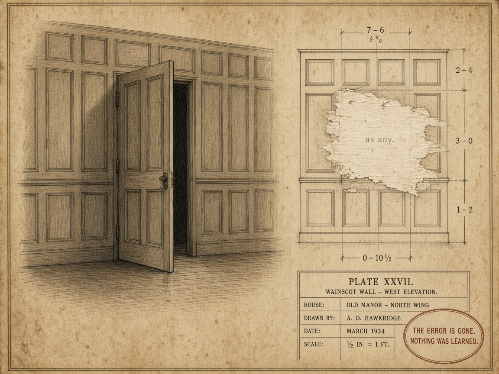

# The passage is real. The drawing has been scraped.

**Plate for:** [*Case study: mystery as dispatch*](../README.md) — the section on the repair the genre
bans · **Girders:** [`as-any-secret-passage.yml`](as-any-secret-passage.yml) · **Pair:**
[`locked-room-missing-axis.md`](locked-room-missing-axis.md)

The panel on the left is open and it is **boring.** That is deliberate. No cobwebs, no candle, no
draught stirring a curtain — the trick is simply over, and a hinged section of wainscot turns out to
be an ordinary piece of joinery. Any house of that period could have one.

The indictment is on the right, and it is not the passage. It is the **plan of the wall containing
the passage**, drawn by A. D. Hawkridge in March 1934 at half an inch to the foot, from which the
passage has been physically scraped away. Paper fibres raised. The abraded patch is the brightest
thing on the plate, because removal leaves a mark even when it is trying not to.

And look at what the draughtsman did next, because this is the part that matters: **the dimension
lines close across the gap.** Seven-six across the top, two-four and three-oh and one-two down the
side, nought-ten-and-a-half along the base. The arithmetic is clean. The wall is documented as
solid. Somebody competent went to real trouble so that the record would not merely omit the passage
but *positively assert its absence*, consistently, in every direction a reader might check.

In the middle of the scraped patch, small and faint, the two words that do this in a codebase:

> `as any`

Both repairs make "no slot matches" go away. The [fair-play repair](locked-room-missing-axis.md)
extends the world with an axis that was there all along, and pays for it by having seeded the axis in
act one — which is why you can read the book a second time and watch the clues be clues. This repair
costs nothing up front and destroys the thing the first one preserves: **the next reader has no way
to reconstruct why the wall is safe to lean on.** Including you, in a year, holding your own drawing.

Knox banned undisclosed passages. Van Dine banned the twin sprung in the last chapter and the poison
unknown to science. Those are not rules about taste in plotting, they are **a lint against erasing
the record of a missing dimension** — and Chekhov's gun is the same rule pointed forward: declare the
axis in act one or you may not dispatch on it in act three.

The stamp in the corner is what a suppressed diagnostic actually buys you, and it is worth reading as
a verdict on the draughtsman rather than on the house:

> **THE ERROR IS GONE. NOTHING WAS LEARNED.**

**Up:** [the essay](../README.md) · **Pile:** [`INDEX.yml`](INDEX.yml) · **Previous:**
[`locked-room-missing-axis.md`](locked-room-missing-axis.md) — the failure both repairs answer
