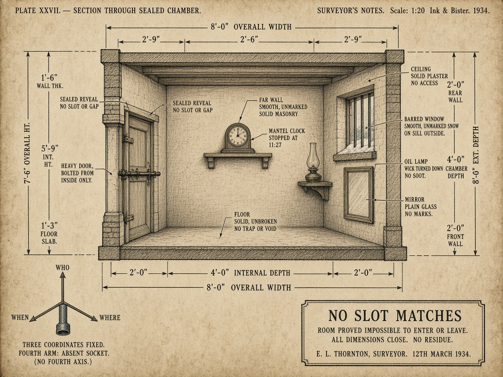

# The room that closes on every side

**Plate for:** [*Case study: mystery as dispatch*](../README.md) — the section arguing that a locked
room is a type error · **Girders:** [`locked-room-missing-axis.yml`](locked-room-missing-axis.yml)

A surveyor has done his job perfectly. The door is bolted from the inside, the window is barred, the
snow on the sill is smooth, the floor is solid with no trap or void, and every dimension on the plate
**closes.** Eight feet overall, four feet internal depth, two feet front wall, and the arithmetic
agrees with itself all the way around the room. Nothing is sloppy. Nothing is unmeasured. The clock
stopped at 11:27 and somebody wrote that down.

This is why the impossible crime is frightening rather than merely difficult. It is not the
*absence* of information. It is a room where the information is complete and the answer is still
not in it.

Then look at the bottom left corner, where a draughtsman would put his key. Three arms of a
coordinate cross, labelled the way a surveyor labels anything — **WHO, WHEN, WHERE** — and a
fourth arm that is not broken, not smudged, not left off in a hurry. It is a machined empty socket,
drawn with the same care as the three that are seated, waiting for something that was never
specified. *Three coordinates fixed. Fourth arm: absent socket.*

The failure is not in the measurements. The failure is one level up, in **the list of things worth
measuring** — and no amount of remeasuring the room will surface it, which is exactly why the
detective in these stories always stops pacing and starts thinking about something else entirely.

The title block says what a compiler would say, in the register of 1934:

> **NO SLOT MATCHES**
> Room proved impossible to enter or leave. All dimensions close. No residue.

Every locked-room solution ever written is the same repair: not a better search along the three
arms you have, but the discovery of a fourth that was in the world all along and missing from your
paperwork. A passage. A twin. A clock that was wrong. A room that was not locked at the time you
assumed.

**And the genre's fair-play rule is a discipline about that socket.** The author must have put the
fourth axis into the world before the reveal, or the solution is a cheat — which is the same rule a
type system enforces, and the reason the [next plate](as-any-secret-passage.md) is about the other
way to make this error go away.

**Up:** [the essay](../README.md) · **Pile:** [`INDEX.yml`](INDEX.yml) · **Next:**
[`as-any-secret-passage.md`](as-any-secret-passage.md) — the repair the genre bans
