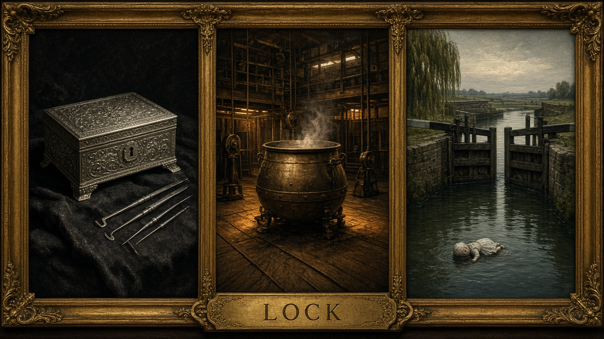

# One word, asked three times

**Plate for:** [*Case study: mystery as dispatch*](../README.md) — the section on *The Three Locks*
as polysemy used as structure · **Girders:** [`three-locks-polysemy.yml`](three-locks-polysemy.yml)

Three panels, equal size, equal dignity, and **one caption for all three.** That is the whole
construction of the plate, and it is why there are no labels under the individual panels. Caption
them separately and the picture says *here are three kinds of lock*, which is a glossary. Caption
them once and it says *here is one name, asked along three axes*, which is a gather — and a gather
is what MacBird built the novel out of.

**A lock you pick.** An engraved silver box sent to Watson, holding a secret from his own past, with
a single fine keyhole and the picks laid ready beside it. The lock is a **guard on a container**: it
admits or refuses, and the question is whether you have the key.

**A lock you escape.** Dario Borelli burned alive on stage inside the Cauldron of Death. The panel
shows the cauldron from the wings on purpose, with the ropes and counterweights and battens frankly
visible, because the illusion is machinery and **the machinery has an author** — the effect was
designed by his wife, Madame Ilaria Borelli, who builds the apparatus while her husband stands in the
light. Here the lock is a **constraint on a body**, and the interesting coordinate is not the lock
but the designer.

**A lock that raises a river.** Jesus Lock on the Cam at dawn, gates closed, the water sitting at two
different heights on either side of the timber, a doll afloat. This lock refuses nothing and holds
nobody. It is **infrastructure**: it changes the level of the world rather than the state of a thing,
and the two water levels in one frame are the only place in the triptych where you can see a lock
*working*.

Same five letters. A guard, a constraint, and a piece of civil engineering — and no one of the three
is the real meaning that the other two are metaphors for. That is precisely what it means to gather a
name along several coordinates and decline to privilege a cut, which is the [Cubism
claim](cubism-symmetric-dispatch.md) in a plot instead of in paint.

**Madame Borelli deserves the last word**, because her grievance is the repo's. She builds the
effects, her husband takes the stage, and the credit attaches to whoever is standing in the light.
That is the credit-diffusion problem in a corset, written by somebody who spent thirty years in film
production before she started writing Holmes.

**Up:** [the essay](../README.md) · **Pile:** [`INDEX.yml`](INDEX.yml) · **See also:**
[`art-in-the-blood.md`](art-in-the-blood.md) — Doyle's hinge, and her first title
