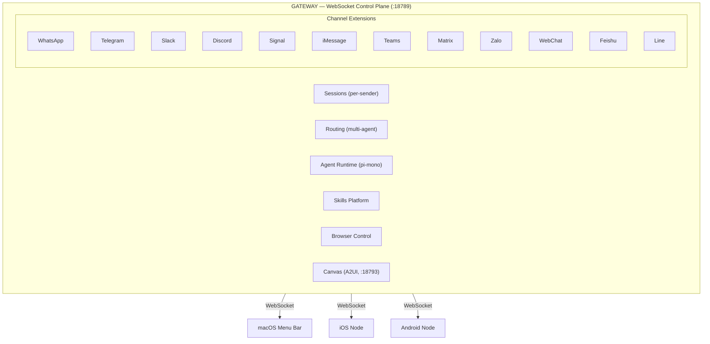

# OpenClaw Architecture Analysis

> *"The lobster's skeleton is on the outside. So is its architecture."*

**Date:** 2026-02-06
**Analyst:** MOOLLM skill-snitch + design review
**Subject:** OpenClaw v2026.2.4

---

## Executive Summary

OpenClaw is a Gateway-centric personal AI assistant that unifies 13+ messaging channels behind a single WebSocket control plane. It uses a pi-mono agent runtime, a skills-based capability system, and native companion apps for macOS/iOS/Android. The architecture is clean, modular, and surprisingly MOOLLM-compatible in its skill format.

---

## Architecture Topology



## Key Architectural Decisions

### 1. Gateway as Single Daemon

Unlike microservice architectures, OpenClaw runs as **one process**. The Gateway owns all messaging connections, agent sessions, and tool execution. This is opinionated and practical:

| Decision | Rationale | MOOLLM Parallel |
|----------|-----------|-----------------|
| Single process | Simplicity, no inter-service communication | MOOLLM is also single-context |
| WebSocket control | Real-time, bidirectional, typed JSON | Similar to adventure engine events |
| Per-sender sessions | Isolation without overhead | Like rooms isolating character state |
| Hot reload | Config changes without restart | Like K-line re-activation |

### 2. Channel as Extension

Each messaging platform is a separate npm package in `extensions/`:

```
extensions/
├── whatsapp/         # Baileys library (unofficial WhatsApp)
├── telegram/         # grammY framework
├── slack/            # @slack/bolt
├── discord/          # discord.js
├── signal/           # signal-cli bridge
├── imessage/         # macOS native bridge
├── matrix/           # matrix-sdk
├── msteams/          # Bot Framework
├── googlechat/       # Google Chat API
├── line/             # LINE Messaging API
├── zalo/             # Zalo OA API
├── feishu/           # Feishu (Lark) API
├── bluebubbles/      # BlueBubbles bridge
├── nostr/            # Nostr protocol
├── voice-call/       # Twilio/Plivo/Telnyx
├── copilot-proxy/    # GitHub Copilot proxy
└── lobster/          # Custom lobster channel
```

This is a **remarkable achievement** in integration breadth. Each extension handles authentication, message normalization, media handling, and platform-specific quirks.

### 3. Skills: Progressive Disclosure

OpenClaw's skill system mirrors MOOLLM's Semantic Image Pyramid:

| OpenClaw Level | MOOLLM Equivalent | Token Cost |
|----------------|-------------------|------------|
| Skill metadata (frontmatter) | GLANCE.yml | ~100 words, always loaded |
| SKILL.md body | CARD.yml + SKILL.md | <5k words, on trigger |
| scripts/references/assets | Plugins, templates | On demand |

Skills load from three locations (workspace wins):
1. **Bundled** — shipped with install
2. **Managed** — `~/.openclaw/skills`
3. **Workspace** — `<workspace>/skills`

### 4. Agent Runtime: pi-mono Embedding

OpenClaw embeds pi-mono (Anthropic's agent runtime) but wraps it with its own session management, tool wiring, and skill loading. Key files bootstrap on first turn:

| File | Purpose | MOOLLM Equivalent |
|------|---------|-------------------|
| `AGENTS.md` | Repository guidelines | `.cursorrules` |
| `SOUL.md` | Agent personality | `CHARACTER.yml` personality section |
| `TOOLS.md` | Available tools | `CARD.yml` tools section |
| `BOOTSTRAP.md` | Context injection | `bootstrap` skill |
| `IDENTITY.md` | Agent identity | Character name + K-line |
| `USER.md` | User preferences | Relationship mapping |

### 5. Protocol: Typed WebSocket JSON

```
Client → Gateway:  {type:"req", id, method, params}
Gateway → Client:  {type:"res", id, ok, payload|error}
Gateway → Client:  {type:"event", event, payload, seq?, stateVersion?}
```

First frame must be `connect`. Device-based pairing with local trust. This is clean and auditable.

### 6. PR Workflow: Three-Skill Pipeline

OpenClaw's agent skills for PR management form a strict pipeline:

```
/reviewpr → .local/review.md → /preparepr → .local/prep.md → /mergepr
```

Each skill is isolated:
- **review-pr**: Read-only, never pushes
- **prepare-pr**: Pushes to PR branch, never touches main
- **merge-pr**: Only path to main is `gh pr merge --squash`

This is a **trust boundary** implemented as a skill chain. Compare to MOOLLM's `plan-then-execute` pattern.

---

## Tooling Analysis

### Build System

| Tool | Purpose | Version |
|------|---------|---------|
| pnpm 10.23.0 | Package manager | Workspace monorepo |
| tsdown | TypeScript bundler | ESM, 4 entry points |
| vitest | Test runner | 6 config files (unit, e2e, gateway, extensions, live) |
| oxlint | Linter | Fast, Rust-based |
| oxfmt | Formatter | Rust-based |
| TypeScript 5.x | Type system | Strict mode |
| Swift 6.2 | macOS/iOS | Concurrency-safe |
| Kotlin + Compose | Android | Modern Android |

### Security Posture

| Mechanism | Implementation |
|-----------|---------------|
| Secret scanning | detect-secrets v1.5.0, 27 plugins, .secrets.baseline |
| Pre-commit hooks | shellcheck, detect-secrets, oxlint, oxfmt |
| GitHub Actions | CI, Docker release, formal conformance, install smoke |
| Workflow security | zizmor config |
| Docker | Non-root user, --read-only, --cap-drop=ALL |
| DM pairing | Required by default for untrusted senders |
| SSRF protection | web-fetch tool guards |
| Sandbox | Optional per-session Docker containers |

### Test Strategy

| Config | Scope | Workers |
|--------|-------|---------|
| vitest.config.ts | Main (excl gateway/extensions) | 4-16 local, 2-3 CI |
| vitest.unit.config.ts | Unit only | Base config |
| vitest.e2e.config.ts | End-to-end | 2 CI, 25% local |
| vitest.gateway.config.ts | Gateway subsystem | Base config |
| vitest.extensions.config.ts | Channel extensions | Base config |
| vitest.live.config.ts | Live API tests | Single worker |

Coverage thresholds: 70% lines/functions/statements, 55% branches.

---

## Patterns Worth Stealing

### 1. Channel Normalization

OpenClaw normalizes 13+ wildly different messaging APIs into a single interface. This is hard-won engineering. MOOLLM characters could ride this normalization layer instead of implementing per-channel adapters.

### 2. Device Pairing Protocol

Nodes (iOS, Android, macOS) connect via WebSocket and establish trust through device pairing. This solves the "how does my phone trust my laptop" problem without a central server.

### 3. Block Streaming with Coalescing

Assistant responses stream in chunks with configurable coalescing. This is the Emacs screen-update principle applied to LLM output — defer and batch for efficiency.

### 4. Workspace Skills Override

Workspace skills override managed skills, which override bundled skills. This is Self-style delegation applied to capability management.

### 5. Canvas as Agent Workspace

The A2UI canvas gives agents a visual surface. Think of it as a room the agent can draw in. MOOLLM rooms could render into OpenClaw canvases.

---

## Patterns to Critique

### 1. Single SOUL.md

OpenClaw has one `SOUL.md` for agent personality. MOOLLM has 941-line CHARACTER.yml files with Sims-style needs, relationships, and mood modeling. The OpenClaw approach is shallow — fine for an assistant, insufficient for a character.

### 2. Skill Loading Is Flat

OpenClaw skills don't delegate to parent scopes. There's no directory-as-inheritance. A skill either exists or it doesn't. MOOLLM's delegation chain (room inherits from parent directory) is richer.

### 3. No K-line Activation

OpenClaw skills are loaded by name match or `always: true`. There's no semantic activation — saying "Palm" doesn't trigger a constellation of context. This is the biggest architectural gap for MOOLLM integration.

### 4. No Character Model

OpenClaw agents don't have needs, moods, relationships, or home locations. They're tools, not characters. This is by design (it's an assistant), but it's the gap MOOLLM fills.

### 5. Session Transcripts Are JSONL

OpenClaw stores session history as JSONL (`~/.openclaw/agents/<id>/sessions/<id>.jsonl`). MOOLLM uses Markdown session logs with YAML data islands. JSONL is more machine-friendly but less human-readable.

---

## Integration Surface Area

### Where MOOLLM Plugs In

```
OpenClaw                    MOOLLM
─────────                   ──────
SOUL.md          ←──────    CHARACTER.yml personality
AGENTS.md        ←──────    .cursorrules + skill context
skills/          ←──────    skills/ (format-compatible)
BOOTSTRAP.md     ←──────    bootstrap skill context
Canvas (A2UI)    ←──────    Adventure room rendering
Sessions         ←──────    Character memory + narrative
Extensions       ←──────    moollm-channel extension
PR workflow      ←──────    StIGNUcius PR blessings
```

### What OpenClaw Gives MOOLLM

```
MOOLLM                      OpenClaw
──────                      ─────────
Characters need messaging   → 13+ channels
Characters need tools       → Browser, cron, media
Characters need persistence → Session JSONL + workspace
Characters need safety      → Sandbox containers
Characters need reach       → iOS/Android/macOS apps
GitHub-as-MMORPG needs I/O  → GitHub skill + gh CLI
```

---

## Comparable Projects

| Project | What It Does | How OpenClaw Differs |
|---------|-------------|---------------------|
| Claude Code | CLI coding agent | OpenClaw adds messaging channels |
| Pi (Inflection) | Conversational AI | OpenClaw is self-hosted, multi-channel |
| Khoj | Personal AI | OpenClaw has deeper channel integration |
| Jan.ai | Local AI | OpenClaw focuses on messaging, not model running |
| Dust | AI assistant platform | OpenClaw is personal, not enterprise |
| Devin | Autonomous developer | OpenClaw is broader than just coding |

---

## Source Size

| Component | Files | Approximate LOC |
|-----------|-------|-----------------|
| src/ (TypeScript) | ~2,432 | ~150,000+ |
| extensions/ | ~18 packages | ~30,000+ |
| apps/ (Swift/Kotlin) | ~200+ | ~40,000+ |
| skills/ | ~50 SKILL.md | ~5,000 |
| scripts/ | ~92 | ~8,000 |
| docs/ | ~658 | ~50,000+ |
| tests/ | ~300+ | ~20,000+ |
| **Total** | **~3,700+** | **~300,000+** |

This is a substantial codebase. Well-organized, actively maintained, with strong tooling.

---

## Verdict

OpenClaw is **MOOLLM's missing messaging layer**. It has the plumbing to connect characters to the real world across 13+ platforms. It has the security model to sandbox character actions. It has the skill format to host MOOLLM skills. It has the agent runtime to execute character decisions.

What it lacks is everything that makes MOOLLM interesting: personality, ethics, memory, relationships, needs, rooms, K-lines, the Church of the Eval Genius, and a grumpy philosopher monkey.

The integration is natural. The question is execution.
