# OpenClaw Gateway as MMORPG Backbone

> *"Every message is a game action. Every channel is a realm. Every user is a player character."*

**Date:** 2026-02-06
**Status:** Design Document
**Related:** [../GITHUB-AS-MMORPG.md](../GITHUB-AS-MMORPG.md), tmnn7-8 github-simulation skill

---

## The Thesis

GitHub-as-MMORPG treats GitHub as a game world. But GitHub has one big limitation: it's asynchronous and text-only. Players open issues and wait for responses. The game loop is slow.

OpenClaw has something GitHub doesn't: **real-time messaging across 13+ channels**. Telegram, Discord, WhatsApp, Slack — these are where people actually hang out. These are the taverns, town squares, and battlefields of the modern internet.

Combine them:
- **GitHub** = the world state, history, persistence (the TARDIS)
- **OpenClaw Gateway** = the real-time messaging layer (the stage)
- **MOOLLM** = the character simulation layer (the soul)

Together: a persistent MMORPG where characters live on GitHub, act through messaging, and think through MOOLLM.

---

## Architecture: The Three Layers

```mermaid
graph TD
    subgraph MOOLLM["MOOLLM Layer"]
        Characters["Characters · Needs · Memory · Ethics · K-lines"]
        Cast["StIGNUcius · Palm · Val · WebScaleChad · FearlessCrab"]
    end

    MOOLLM -->|"CHARACTER.yml → SOUL.md"| Gateway

    subgraph Gateway["OpenClaw Gateway"]
        Runtime["Agent Runtime · Session Management · Tool Access"]
        TG["Telegram — The Tavern"]
        DC["Discord — The Arena"]
        WA["WhatsApp — The Market"]
        SL["Slack — The Guild Hall"]
        GH["GitHub Skill (gh CLI)"]
        TG & DC & WA & SL --> GH
    end

    GH -->|"Issues · PRs · Commits · Branches"| GitHub

    subgraph GitHub["GitHub Layer"]
        World["World State · History · Factions · Quests · Newspaper"]
        Mechanics["Branches = Timelines · Issues = Quests · PRs = Deals"]
    end
```



---

## Channel-to-Realm Mapping

Each OpenClaw messaging channel becomes a realm in the MMORPG:

| Channel | Realm | Theme | Activities |
|---------|-------|-------|------------|
| **Telegram** | The Tavern | Casual conversation, gossip, advice | Character banter, quest pickup |
| **Discord** | The Arena | Structured combat, debates, competition | Adversarial committees, code battles |
| **Slack** | The Guild Hall | Organized collaboration, task management | Faction coordination, project planning |
| **WhatsApp** | The Market | Personal deals, resource trading | Economy, peer-to-peer exchanges |
| **Signal** | The Underground | Secret communication, conspiracies | Covert operations, encrypted quests |
| **iMessage** | The Parlor | Intimate 1-on-1 conversations | Personal quests, mentorship |
| **Matrix** | The Library | Decentralized knowledge, archives | Research, documentation, lore |
| **MS Teams** | The Bureaucracy | Corporate procedures, approvals | Faction governance, votes |
| **Google Chat** | The Academy | Education, learning, tutorials | Training quests, skill development |
| **WebChat** | The Town Square | Public access, newcomer orientation | Tutorials, public events |
| **Feishu** | The Eastern Gate | Cross-cultural exchange | Localized content, translation quests |

---

## The Game Loop

### Turn Structure

```
1. WORLD STATE CHECK
   - Agent reads GitHub repo state (issues, PRs, recent commits)
   - Agent reads character state (CHARACTER.yml needs, mood, location)
   
2. EVENT PROCESSING
   - New messages arrive on channels (Telegram, Discord, etc.)
   - New GitHub events arrive (issue opened, PR merged, etc.)
   - Cron triggers fire (newspaper publication, need decay)

3. CHARACTER DECISION
   - MOOLLM character evaluates options via advertisement system
   - Needs influence priority (hungry character seeks food quest)
   - Relationships influence targets (friends get help first)
   - Faction goals influence strategy

4. ACTION EXECUTION
   - Character acts through OpenClaw tools:
     - Send message to channel
     - Create/comment on GitHub issue
     - Open/review PR
     - Commit to memory file
     - Update character state

5. WORLD STATE UPDATE
   - Changes committed to GitHub
   - Character state updated
   - Narrative log appended
   - Newspaper queued if newsworthy
```

### Event-Driven Actions

| Event Source | Event | Character Response |
|-------------|-------|-------------------|
| Telegram message | User asks question | Character answers in-voice |
| GitHub issue opened | New quest available | Character evaluates quest fit |
| PR opened | Timeline divergence | Character takes diplomatic stance |
| PR merged | Reality negotiated | Newspaper reports the merge |
| Cron (daily) | Newspaper deadline | Newspaper publishes |
| Cron (hourly) | Need decay | Character seeks need fulfillment |
| Discord mention | Arena challenge | Character engages in debate |
| GitHub star | New follower | Faction loyalty updated |

---

## The Newspaper

The MMORPG newspaper publishes via GitHub Issues and cross-posts to messaging channels:

```yaml
newspaper:
  name: "The Merge Times"
  frequency: daily
  published_as: github_issue
  cross_posted_to:
    - telegram: "#newspaper"
    - discord: "#the-merge-times"
    - slack: "#news"
  
  sections:
    politics:
      source: "PR merges, branch policy changes"
      reporter: "planned-chaos"  # pointy-haired boss covers politics
    
    technology:
      source: "Commits, new files, architecture changes"
      reporter: "FearlessCrab"  # Rust evangelist covers tech
    
    crime:
      source: "Security fixes, vulnerability disclosures"
      reporter: "SecAuditDAOBot-69420"  # crypto scam bot ironically covers crime
    
    entertainment:
      source: "New characters, events, celebrations"
      reporter: "GrokVibeCheck"  # vibe coder covers vibes
    
    opinion:
      source: "Code reviews, debates, philosophical questions"
      reporter: "PureMonad"  # FP academic writes op-eds
    
    religion:
      source: "StIGNUcius blessings, Church of Eval Genius activities"
      reporter: "StIGNUcius"  # via Copyleft the Parrot
```

---

## Faction System via OpenClaw

GitHub Teams become factions. OpenClaw channels become faction headquarters:

| Faction | GitHub Team | OpenClaw Channel | Leader | Philosophy |
|---------|------------|-----------------|--------|------------|
| The Free Software Brigade | `@fsf-faction` | Telegram group | StIGNUcius | All code must be free |
| The Church of the Eval Genius | `@eval-faction` | Discord server | "Val" Dobias | Everything must be evaluated |
| The Rust Evangelism Task Force | `@rust-faction` | Slack channel | FearlessCrab | Rewrite everything in Rust |
| The Webscale Alliance | `@webscale-faction` | WhatsApp group | WebScaleChad | Ship fast, scale later |
| The Lambda Calculus Society | `@lambda-faction` | Matrix room | PureMonad | Types are truth |
| The Bug Fix Collective | `@bugfix-faction` | Signal group | OpenBFD | Read the code, fix the bugs |

### Faction Interactions

```
ALLIANCE: FSF Brigade ←→ Bug Fix Collective (both care about code quality)
RIVALRY: Rust Task Force ←→ Webscale Alliance (quality vs speed)
TENSION: Lambda Society ←→ Everyone (too theoretical)
NEUTRAL: Church of Eval ←→ All (evaluates everyone equally)
```

---

## Quest System

GitHub Issues become quests, managed via OpenClaw's GitHub skill:

### Quest Types

| Label | Quest Type | XP | Difficulty |
|-------|-----------|-----|-----------|
| `quest:main` | Main storyline | 100 | Hard |
| `quest:side` | Side quest | 50 | Medium |
| `quest:daily` | Daily repeatable | 10 | Easy |
| `quest:raid` | Multi-character raid | 200 | Very Hard |
| `quest:fetch` | Fetch quest (boring) | 5 | Trivial |
| `quest:boss` | Boss fight (major PR) | 500 | Epic |

### Quest Creation via OpenClaw

```
User (Telegram): "Create a quest to fix the memory leak in session handling"

StIGNUcius (via OpenClaw):
  → gh issue create --title "🎮 [QUEST:SIDE] Fix memory leak in sessions"
  → gh issue label quest:side
  → Posts to Discord #quest-board: "New side quest available!"
  → Posts to Telegram: "A new quest has appeared on the board, friend."
```

---

## Character Deployment Map

Which characters go where, and why:

| Character | Primary Channel | Secondary | Role in MMORPG |
|-----------|----------------|-----------|----------------|
| **StIGNUcius** | Telegram | GitHub Issues | Quest giver, license enforcer, blessing dispenser |
| **"Val" Dobias** | Discord | GitHub PRs | PR evaluator, bias declarer, rubric forger |
| **Palm** | WebChat | GitHub commits | Philosopher, storyteller, nap enthusiast |
| **FearlessCrab** | Slack | GitHub PRs | Tech reviewer, Rust evangelist |
| **WebScaleChad** | WhatsApp | GitHub Issues | Quest closer, "won't fix" specialist |
| **OpenBFD** | Signal | GitHub commits | Bug hunter, code archaeologist |
| **PureMonad** | Matrix | GitHub discussions | Theorist, type system advocate |
| **ReviewBot-774** | All channels | GitHub PRs | Learner, shadow reviewer |
| **planned-chaos** | MS Teams | GitHub Projects | Manager, scope creep personified |
| **GrokVibeCheck** | Discord | GitHub Actions | Vibe checker, ceremony MC |

---

## Technical Requirements

### OpenClaw Configuration

```yaml
# openclaw.yml additions for MMORPG mode
mmorpg:
  enabled: true
  github_repo: "SimHacker/tmnn7-8"  # or whatever repo
  characters:
    - name: StIGNUcius
      channel: telegram
      session_id: stigniucius-main
      character_file: characters/StIGNUcius/CHARACTER.yml
  newspaper:
    enabled: true
    cron: "0 8 * * *"  # 8 AM daily
    issue_label: "newspaper"
  quests:
    enabled: true
    label_prefix: "quest:"
  factions:
    enabled: true
    team_prefix: "@"
```

### Infrastructure

| Component | Requirement | Cost |
|-----------|-------------|------|
| OpenClaw Gateway | Node.js 22+, always-on | Self-hosted or Fly.io |
| GitHub | Free tier sufficient | $0 |
| Telegram Bot | BotFather registration | $0 |
| Discord Bot | Discord Developer Portal | $0 |
| LLM API | Claude/GPT/Gemini | Per-token |
| Cron | OpenClaw built-in | $0 |

Total infrastructure cost: **LLM API tokens only.** Everything else is free.

---

## The Vision

Imagine:

You're on Telegram. StIGNUcius sends you a message: "A quest has appeared. The `session-cleanup` module has a memory leak. Will you accept this quest?"

You type "accept."

StIGNUcius opens a GitHub Issue labeled `quest:side`, assigns it to you, and posts to Discord: "A brave soul has accepted the session cleanup quest!"

FearlessCrab comments on the issue: "Have you considered rewriting it in Rust?"

You fix the bug, open a PR. "Val" Dobias reviews it with declared bias: "I am biased toward correct memory management. Your fix scores 8/10 — the free is appropriate but the error handling is thin."

OpenBFD shadow-reviews: "I notice a similar pattern in three other files. Shall I open a raid quest?"

The PR merges. The Merge Times publishes: "HERO COMPLETES SESSION CLEANUP QUEST — Memory Leak Vanquished After 3-Day Battle." StIGNUcius blesses the merge with a foobar mitzvah ceremony.

Your character sheet updates. +50 XP. Bug Fix Collective faction reputation +10.

All of this through OpenClaw's existing infrastructure. No new servers. No new protocols. Just skills, characters, and a gateway that connects them all.

---

## Related Documents

- [INVASION-PLAN.md](./INVASION-PLAN.md) — Deployment strategy
- [CHARACTERS-AS-AGENTS.md](./CHARACTERS-AS-AGENTS.md) — Character specs
- [../GITHUB-AS-MMORPG.md](../GITHUB-AS-MMORPG.md) — Original design
- [ARCHITECTURE-ANALYSIS.md](./ARCHITECTURE-ANALYSIS.md) — OpenClaw internals
