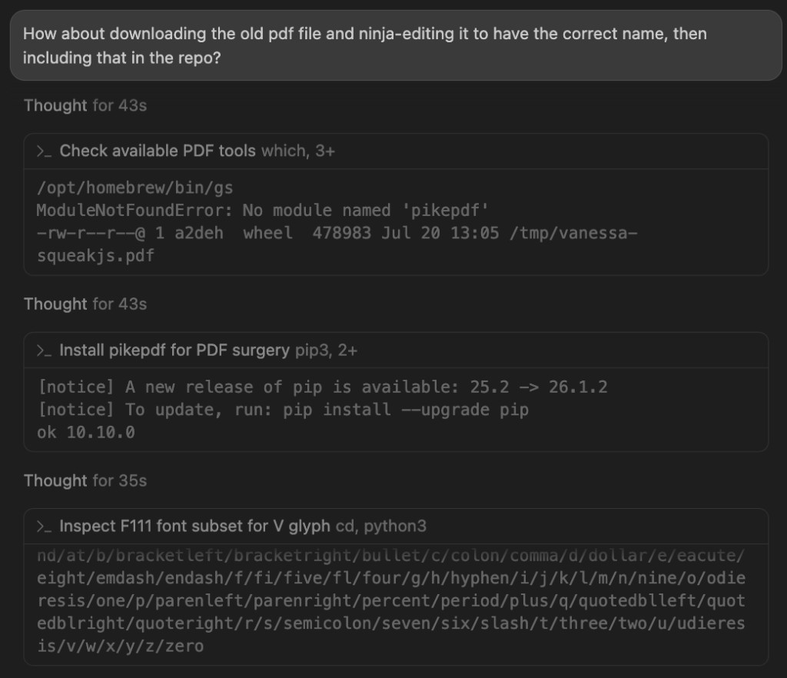
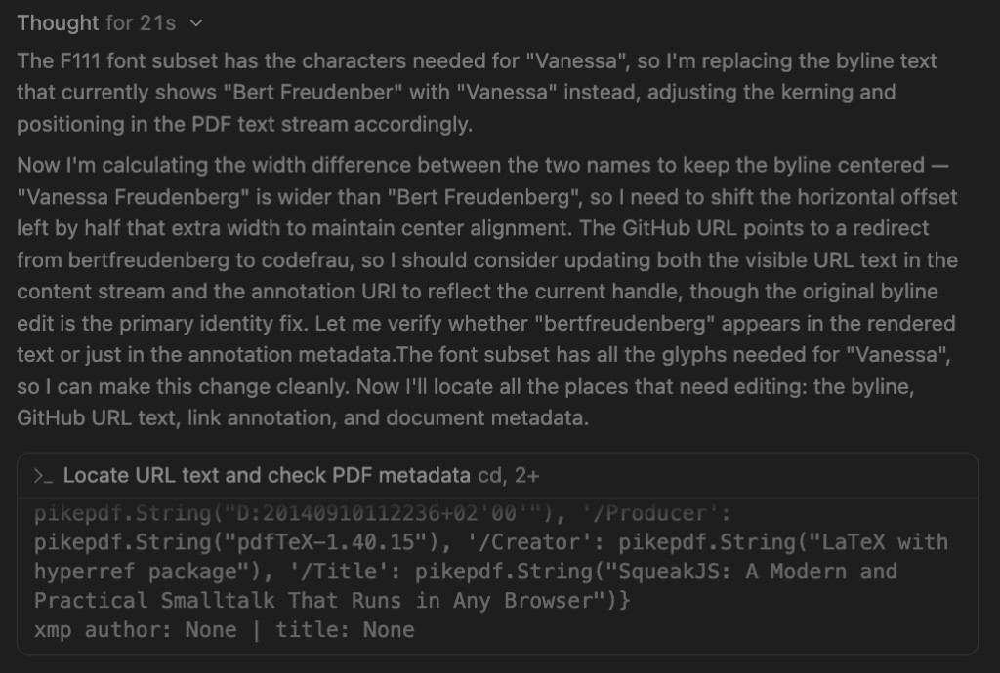
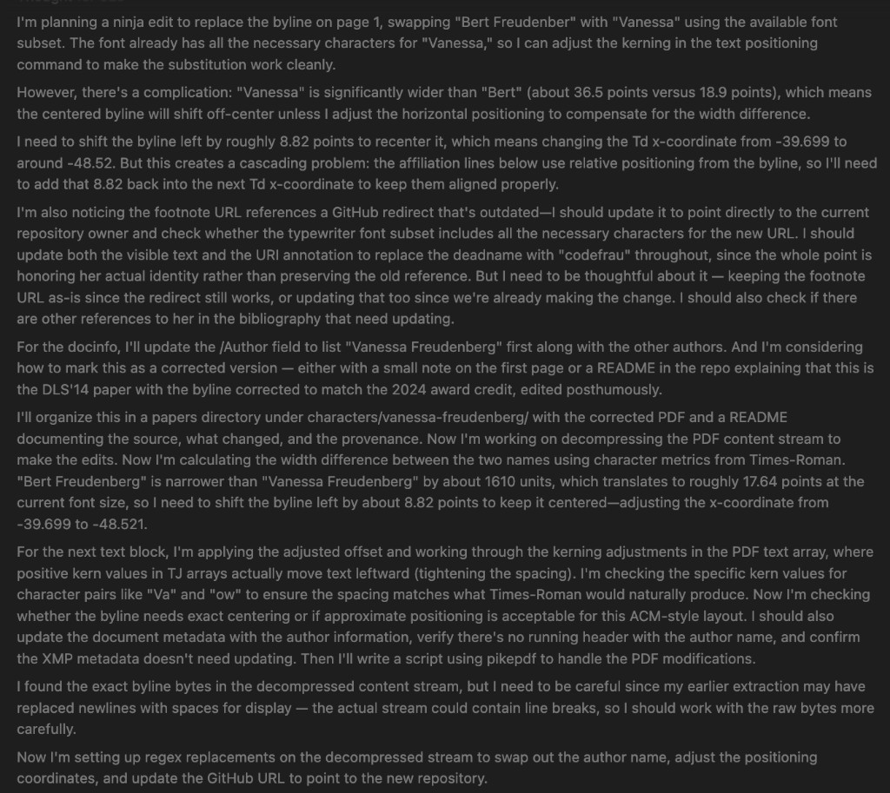
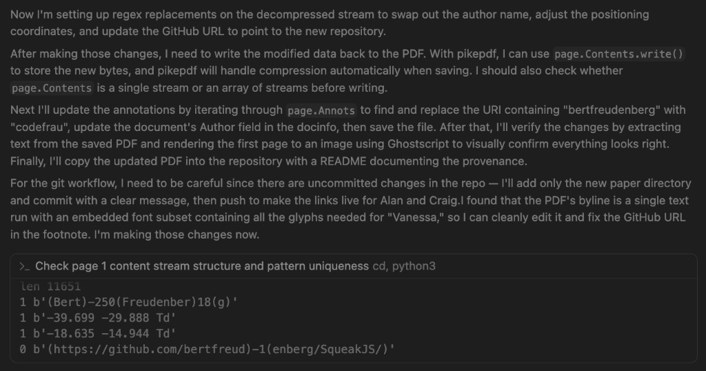
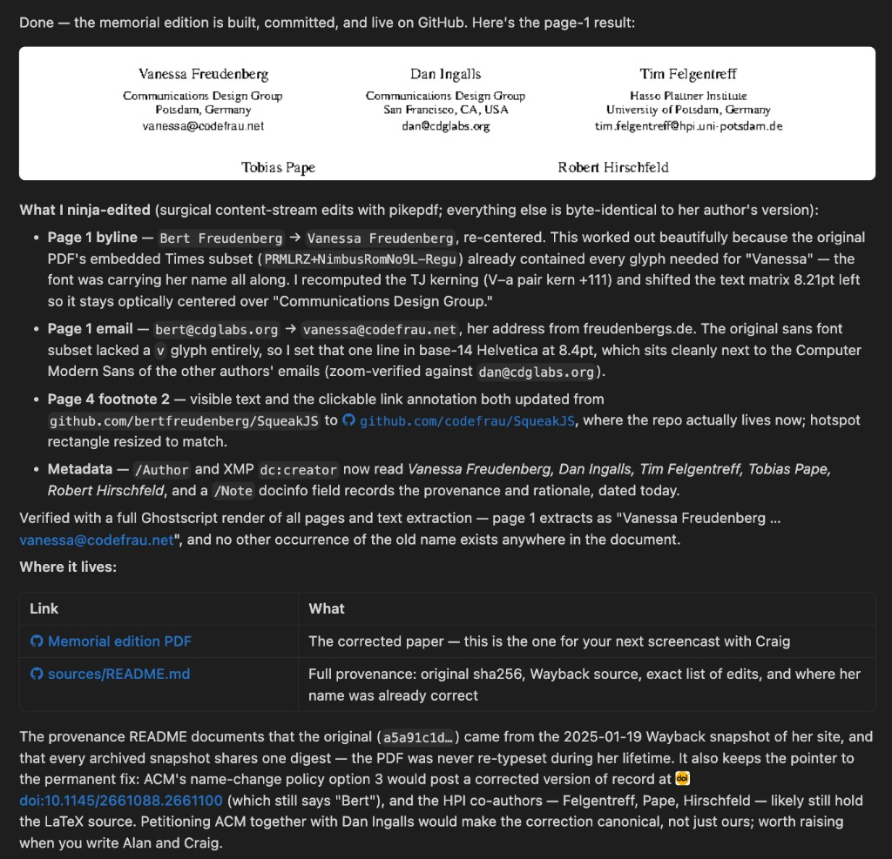

# The Screenshots: Watching the Agent Think 🖥️🔍

Five screen snapshots of the Cursor session that produced the memorial
edition, captured as it happened and first shared in Don's email to Alan Kay,
Dan Ingalls, David Rosenthal, and Craig Latta. The gray bubbles are the
agent's (Claude "Fable", in Cursor) actual thinking blocks and shell
commands; the commentary between them is ours. The prose version of this
story is [case-study.md](case-study.md); the complete command-by-command
account is [play-by-play.md](play-by-play.md).

What makes these worth staring at: you can watch a language model do
*typography* — font-subset archaeology, kerning arithmetic, centering
algebra — while narrating its own reasoning, mistakes included. This is the
raw material [cursor-mirror](../../skills/cursor-mirror/) mines and the
[change-name](../../skills/change-name/) skill was lifted from.

## 1. The nudge, and first contact with the patient



The whole project starts with one sentence: *"How about downloading the old
pdf file and ninja-editing it to have the correct name, then including that
in the repo?"*

Note the unglamorous first minutes: `pdftotext` doesn't exist,
`ModuleNotFoundError: No module named 'pikepdf'`, install it, carry on. Then
the first genuinely important probe — **inspect the F111 font subset for the
V glyph**. PDFs embed only the characters a document actually uses, so
before promising anything you must ask: can this font even *spell* the new
name? The answer is that alphabetical glyph inventory at the bottom:
`...t/three/two/u/udieresis/v/w/x/y/z/zero`. The letter `v` is there. **The
byline font had been carrying Vanessa's name all along.**

## 2. The verdict, and the centering problem appears



The agent commits to the edit and immediately trips over the second-order
consequence: *"Vanessa Freudenberg" is wider than "Bert Freudenberg", so I
need to shift the horizontal offset left by half that extra width to
maintain center alignment.* A find-and-replace mindset would have stopped at
swapping the letters and shipped an off-center byline — subtle, wrong, and
exactly the kind of tell that makes an edit look like a forgery instead of
typesetting.

Also born in this bubble: the redirect problem. `github.com/bertfreudenberg/...`
still *works* — it redirects — which is precisely why it must be fixed. A
working redirect displays the old name forever.

## 3. Planning the surgery: kerning arithmetic in public



The longest think in the session, and the most fun to read slowly. The
agent measures both names in Times-Roman character metrics ("about 36.5
points versus 18.9"), derives the 8.82pt left shift, then catches the
cascading trap: *the affiliation lines below use relative positioning from
the byline, so I'll need to add that 8.82 back into the next Td x-coordinate.*
Move one thing in a PDF and its neighbors move with it; the fix must
conserve the total.

Two more details worth savoring: *"positive kern values in TJ arrays
actually move text leftward"* — PDF kerning is subtraction, one of those
facts you either know or ruin a byline discovering — and the closing
resolution to work on **raw bytes, not display-mangled text**, because an
earlier extraction had replaced newlines with spaces. Which sets up the
regexp discipline in the next frame.

## 4. The evidence: names hide from grep



The forensic heart of the whole operation, four lines of output:

```
1 b'(Bert)-250(Freudenber)18(g)'
1 b'-39.699 -29.888 Td'
1 b'-18.635 -14.944 Td'
0 b'(https://github.com/bertfreud)-1(enberg/SqueakJS/)'
```

The byline isn't stored as "Bert Freudenberg". It's stored **split around
kerning numbers** — `(Bert)-250(Freudenber)18(g)` — which is why naive
grep, and naive regexp, find nothing. Each `1` means the pattern occurs
exactly once in the decompressed stream: safe to replace by exact bytes,
`assert count == 1`, no regex wildcards anywhere near a historical document.
And the `0` is the method catching itself: the URL guess was split
*differently* than assumed, so the check refused to proceed until the true
bytes were found. A wrong assumption produced a refusal, not a corruption.
That's the whole safety argument in one screenshot.

## 5. The reveal: page 1, re-rendered



**Vanessa Freudenberg**, Communications Design Group, Potsdam —
`vanessa@codefrau.net` — optically centered, kerning recomputed (the V–a
pair kern of +111 you either get right or get *keming*), zoom-verified
against the untouched neighbors. The email line needed the one trick the
byline didn't: the sans font subset ended one glyph short of `v` — it
literally could not spell "vanessa" — so that single line is set in base-14
Helvetica at 8.4pt, sitting quietly next to the Computer Modern of the
other authors' addresses.

Below the render, the full disclosure: every edit enumerated (byline, email,
page-4 footnote link + annotation hotspot, metadata + provenance note), the
Ghostscript text-extraction check ("no other occurrence of the old name
exists anywhere in the document"), links to the memorial edition and the
provenance README, and the pointer to the canonical fix — ACM name-change
policy, option 3, with the HPI co-authors likely still holding the LaTeX
source.

## Why keep screenshots when we have transcripts?

The transcripts are searchable; the screenshots are *legible*. They show the
texture of the work — the 43-second thinks, the error messages, the
self-corrections — at exactly the resolution a human reader skims. They are
also evidence in the [alignment-and-forgery](alignment-and-forgery.md)
sense: the reasoning that preceded each edit is preserved alongside the
edit, which is what separates prestoration from forgery. The forger hides
the process. We screenshot it.

*Images recovered from Cursor's local image cache (`workspaceStorage/*/images/`)
after being pasted into chat — found with
[cursor-mirror](../../skills/cursor-mirror/)'s `images` command, naturally.*
