# Self-Aware Reflective Image Generation Pipeline

**For the Class — How Emergent Quality Control Works**

---

## The Big Picture

Most image generation pipelines are **fire and forget**:


Our pipeline is **self-aware and reflective**:


---

## The Quality Gate Decision Tree

When the agent observes a generated image, it asks these questions:


---

## The Chocolate Case Study

A real example from this session showing the iterative correction loop:

```mermaid
sequenceDiagram
    participant A as Agent
    participant G as Image Generator
    participant I as Generated Image
    
    Note over A,I: Attempt 1: Complex Prompt
    A->>G: "luxurious dark chocolate, gold foil,<br/>Dutch master still life, board game art..."
    G->>I: [Person standing in river at sunset]
    A->>I: Views image
    A->>A: "That's not chocolate.<br/>That's a person in a river. WTF."
    
    Note over A,I: Attempt 2: Simplified Prompt
    A->>G: "chocolate bar, partially unwrapped,<br/>simple background..."
    G->>I: [Man's professional headshot]
    A->>I: Views image
    A->>A: "Still a person!<br/>Simplify even more."
    
    Note over A,I: Attempt 3: Minimal Prompt
    A->>G: "A chocolate bar"
    G->>I: [Beautiful chocolate bar with gold foil]
    A->>I: Views image
    A->>A: "CHOCOLATE! ✓<br/>Proceed to mining."
    
    A->>A: Mine image for composition,<br/>texture, color analysis
```



---

## Why Complex Prompts Can Fail

```mermaid
mindmap
  root((Complex Prompt<br/>Failure Modes))
    Hallucination
      Too many concepts
      Conflicting instructions
      Model confusion
      Random association
    Text Rendering
      "NO text" → renders "NO text"
      Constraints as content
      Labels as literal
    Style Confusion
      "card art style" → actual card UI
      Mixed metaphors
      Aesthetic conflict
    Overspecification
      Too many details
      Model picks subset
      Ignores key elements
```



---

## The Fix: Simplification Ladder

When generation fails, descend the ladder:


**Key Insight:** The model knows what chocolate looks like. Don't over-explain. Just point.

---

## The Multi-Dimensional Perception Model

Each file adds a "dimension" of understanding:


**Future Application:** Feed all dimensions back to generator for refined 4D++ regeneration — triangulating reality through multiple observations.

---

## Postel's Law in Action

> "Be conservative in what you send, be liberal in what you accept."


---

## The Emergent Behavior

This was NOT programmed. It emerged from:


**The agent wasn't told to check its work. It just... did.**

---

## Complete Pipeline Summary

```mermaid
flowchart TB
    subgraph INPUT["Input Assembly"]
        CARD[Card Definition<br/>from RUN-000.yml]
        STYLE[Cardset Style<br/>from artwork_style]
        CARD & STYLE --> YML_GEN[Generate<br/>Skeleton Prompt]
        YML_GEN --> YML[NN-desc.yml]
        YML --> MD_GEN[Expand to<br/>Prose Prompt]
        MD_GEN --> MD[NN-desc.md]
    end
    
    subgraph GENERATION["Image Generation"]
        YML & MD --> STEREO[Stereo Input<br/>YIN + YANG]
        STEREO --> VIZ[Visualizer<br/>Sister Script]
        VIZ --> IMG[NN-desc.png]
    end
    
    subgraph QA["Quality Assurance"]
        IMG --> VIEW[View Image]
        VIEW --> GATE{Quality<br/>Gate}
        GATE -->|FAIL| DIAG[Diagnose]
        DIAG --> FIX[Adjust Prompts]
        FIX --> VIZ
        GATE -->|PASS| OK[✓]
    end
    
    subgraph MINING["Image Mining"]
        OK --> ANALYZE[Analyze Image]
        ANALYZE --> LAYERS[Choose 3<br/>Relevant Layers]
        LAYERS --> MINED[NN-desc-mined.yml]
    end
    
    subgraph UPDATE["State Update"]
        MINED --> GAMESTATE[Update RUN-000.yml<br/>with image pointer]
    end
    
    style QA fill:#fff3e0
    style MINING fill:#e8f5e9
```



---

## Key Takeaways for the Class

1. **Self-observation is possible** — Agents can view and evaluate their own output
2. **Quality gates prevent bad propagation** — Don't pass garbage forward
3. **Simplification beats elaboration** — When failing, strip to essence
4. **Emergence happens** — Given the right conditions, QA behavior emerges naturally
5. **Multiple dimensions enrich understanding** — YML + MD + PNG + MINED = 4D++ perception
6. **Postel's Law works** — Liberal input, self-observation, conservative output

---

## The Wow Moment

The user saw images flash in their IDE:

```
🖼️ River person at sunset  →  ❌ Rejected
🖼️ Bearded man headshot    →  ❌ Rejected  
🖼️ Beautiful chocolate bar →  ✓ Accepted
```

The agent was debugging its own output in real-time.

**That's emergent meta-cognition.**

---

---

## Related Documentation

- **[Emergent Self-Observation Session Log](./emergent-self-observation-2026-01-24.md)** — The session where this was discovered
- **[ARTWORK.md](../skills/experiment/experiments/fluxx-chaos/runs/amsterdam-flux/artwork/ARTWORK.md)** — Pipeline protocol with quality gates

---

*Documented as part of Amsterdam Fluxx Chaos Experiment*  
*Pattern: Play-Learn-Lift*  
*Discovery: Self-Aware Reflective Image Generation*
