# Sims ↔ MOOLLM Bridge: Technical Design

**Status:** Design  
**Data source:** [BRIDGE.yml](BRIDGE.yml)  
**Related:** [THE-UPLIFT.md](THE-UPLIFT.md) (vision and story) · [IFF-LAYERS.md](IFF-LAYERS.md) (resource architecture)

## Overview

The bridge maps Sims 1 save file data to MOOLLM [CHARACTER.yml](https://github.com/SimHacker/moollm/tree/main/skills/character) format and back. MOOLLM already has [`sims_traits`](https://github.com/SimHacker/moollm/tree/main/skills/character) as a first-class personality system — the same 5 traits, same 25-point budget as The Sims. [SimObliterator](https://github.com/DnfJeff/SimObliterator_Suite) already parses all 88 `person_data` fields from save files.

## Field Mapping

### Uplift: Sims → MOOLLM

| Sims Field | Index | MOOLLM Field | Notes |
|------------|-------|-------------|-------|
| `NeighborData.name` | — | `name`, `id` | First + last name |
| `PersonData[7]` Nice | 7 | `sims_traits.nice` | 0-1000 → 0-10 |
| `PersonData[8]` Active | 8 | `sims_traits.active` | 0-1000 → 0-10 |
| `PersonData[9]` Generous | 9 | `sims_traits.nice` (alt) | Maps to nice dimension |
| `PersonData[10]` Playful | 10 | `sims_traits.playful` | 0-1000 → 0-10 |
| `PersonData[11]` Outgoing | 11 | `sims_traits.outgoing` | 0-1000 → 0-10 |
| `PersonData[12]` Neat | 12 | `sims_traits.neat` | 0-1000 → 0-10 |
| `PersonData[0-6]` Skills | 0-6 | `skills[]` | Cooking, Mechanical, Charisma, Logic, Body, Creativity, Cleaning |
| `PersonData[13-20]` Motives | 13-20 | `needs` | Hunger, Comfort, Hygiene, Bladder, Energy, Fun, Social, Room |
| `PersonData[21]` Age | 21 | `age` | |
| `PersonData[22]` Gender | 22 | `pronouns` | 0=he/him, 1=she/her |
| `PersonData[23-24]` Career | 23-24 | `job`, `job_level` | 24 career tracks |
| `FamilyData.budget` | — | `gold` | Simoleons |
| `FamilyData.house_number` | — | `location` | Mapped to room path |
| `NeighborData.relationships` | — | `relationships` | `{id: [daily, lifetime]}` → `{id: {feeling, memories}}` |

### Download: MOOLLM → Sims

SimObliterator provides binary-level writers for the reverse direction:

| MOOLLM Field | SimObliterator Method | Notes |
|-------------|----------------------|-------|
| `sims_traits.*` | `set_sim_personality()` | Scale 0-10 → 0-1000 |
| `skills[]` | `set_sim_skill()` | Per-skill setter |
| `needs.*` | `set_sim_motive()` | Per-motive setter |
| `relationships` | `set_relationship()` | Daily + lifetime values |
| `gold` | `FamilyData.budget` | Direct write |
| `job`, `job_level` | `set_sim_career()` | Career track + level |

### LLM Enrichment (Uplift Only)

Fields that don't exist in Sims saves but are generated by the LLM during uplift:

| MOOLLM Field | Generated From | How |
|-------------|---------------|-----|
| `emoji_identity` | personality + name | LLM picks 3-6 emojis capturing essence |
| `mind_mirror` | `sims_traits` | LLM infers [Timothy Leary circumplex](https://en.wikipedia.org/wiki/Leary_circumplex) from 5 traits |
| `physical_description` | SPR2 skin textures | [Image generation](#skin-regenesis) from original bitmaps |
| `dialogue.greetings` | personality | LLM generates speech patterns (shy vs outgoing) |
| `relationships.*.feeling` | daily/lifetime scores | LLM narrates: `-80` → "bitter rivals since the fire" |
| `relationships.*.memories` | family album text | Harvested from [archive.org](#family-album-archaeology) if available |
| `lineage` | career + interests | LLM assigns cultural/philosophical origins |

## SimObliterator: Key Components

[SimObliterator Suite](https://github.com/DnfJeff/SimObliterator_Suite) (v1.0.3, 276 tests) provides the Sims-side infrastructure.

### Architecture

### File Format Support

| Format | Status | Parser | Round-trip |
|--------|--------|--------|-----------|
| IFF (objects, saves) | Complete | [iff_file.py](https://github.com/DnfJeff/SimObliterator_Suite/tree/main/src/formats/iff) | Verified |
| FAR1/FAR3 (archives) | Complete | [far/](https://github.com/DnfJeff/SimObliterator_Suite/tree/main/src/formats/far) | Verified |
| DBPF (packages) | Complete | [dbpf.py](https://github.com/DnfJeff/SimObliterator_Suite/tree/main/src/formats/dbpf) | — |
| BCF/BMF/CMX/SKN (meshes) | Complete | [mesh/](https://github.com/DnfJeff/SimObliterator_Suite/tree/main/src/formats/mesh) | Export to glTF |

### BHAV Analysis (SimAntics Bytecode)

The deepest part of the codebase. [BHAVs](https://github.com/DnfJeff/SimObliterator_Suite/tree/main/src/formats/iff/chunks/bhav.py) are SimAntics bytecode — the VM that drives all Sims behavior. SimObliterator provides full lifecycle support:

| Capability | File | Status |
|-----------|------|--------|
| Disassembly with semantic names | `bhav_disassembler.py` | Complete |
| AST construction | `bhav_ast.py` | Complete |
| Decompilation | `bhav_decompiler.py` | Complete |
| Call graph building | `bhav_call_graph.py` | Complete |
| Variable flow analysis | `variable_analyzer.py` | Complete |
| Authoring from scratch | `bhav_authoring.py` | Complete |
| Pointer rewiring | `bhav_rewiring.py` | Complete |
| ID remapping / patching | `bhav_patching.py` | Complete |
| Behavior classification | `behavior_classifier.py` | Complete |
| Text-based assembler (round-trip) | — | **Gap** (see [IFF-LAYERS.md](IFF-LAYERS.md)) |

Key insight from [DEFINITIVE_BHAV_REFERENCE.md](https://github.com/DnfJeff/SimObliterator_Suite/tree/main/Docs/research/DEFINITIVE_BHAV_REFERENCE.md): *"The Sims 1 is 100% event-driven. There are NO inter-BHAV function calls."* BHAVs are triggered by engine events via [OBJf](https://github.com/DnfJeff/SimObliterator_Suite/tree/main/src/formats/iff/chunks/objf.py) lookup, execute in a polling loop, then return control. Documented in the original [VM Design Document](https://donhopkins.com/home/TheSimsDesignDocuments/VMDesign.pdf) by Don Hopkins.

### Expansion Pack ID Blocks

Each expansion gets 256 global BHAV IDs at the same offsets:

| Pack | Range | Hex |
|------|-------|-----|
| Base Game | 256-511 | `0x100-0x1FF` |
| Livin' Large | 512-767 | `0x200-0x2FF` |
| House Party | 768-1023 | `0x300-0x3FF` |
| Hot Date | 1024-1279 | `0x400-0x4FF` |
| Vacation | 1280-1535 | `0x500-0x5FF` |
| Unleashed | 1536-1791 | `0x600-0x6FF` |
| Superstar | 1792-2047 | `0x700-0x7FF` |
| Makin' Magic | 2048-2303 | `0x800-0x8FF` |

Same function at same offset across all packs. Global 264 (Base `0x08`) = `test_user_interrupt`. Global 1800 (Superstar `0x08`) = same function, Superstar version.

## Auto-Internationalizer

LLM-powered translation of all [STR#](https://github.com/DnfJeff/SimObliterator_Suite/tree/main/src/formats/iff/chunks/str_.py) strings in user-created objects to all 20 supported languages.

```mermaid
flowchart TD
    IFF["📦 User object.iff"] --> PARSE["Parse STR# chunks<br/>str_parser.py"]
    PARSE --> AUDIT["Detect missing<br/>language slots<br/>localization_audit.py"]
    AUDIT --> TRANSLATE["🧠 LLM translates<br/>English → 19 languages<br/>with game context"]
    TRANSLATE --> PREVIEW["👁️ PREVIEW mode<br/>verify before apply"]
    PREVIEW --> WRITE["Write STR# back<br/>STRSerializer"]
    WRITE --> IFF2["📦 Translated object.iff<br/>20 languages filled"]
```

The 20 Sims 1 languages: US English, UK English, French, German, Italian, Spanish, Dutch, Catalan, Czech, Danish, Swedish, Norwegian, Finnish, Hebrew, Russian, Portuguese, Japanese, Polish, Traditional Chinese.

Existing infrastructure: [str_parser.py](https://github.com/DnfJeff/SimObliterator_Suite/tree/main/src/Tools/core/str_parser.py), [localization_audit.py](https://github.com/DnfJeff/SimObliterator_Suite/tree/main/src/Tools/core/localization_audit.py), `LocalizationFixer.copy_language_to_missing()`. Replace copy with LLM translate. Short formulaic game strings = high quality output.

MOOLLM skill: `skills/sims-translator/`

## Family Album Archaeology

```mermaid
flowchart TB
    ARCHIVE["🏛️ archive.org<br/>thesims.ea.com snapshots"] --> SCRAPE["Scrape HTML + images"]
    SCRAPE --> PARSE["Parse into YAML Jazz<br/>story beats, names, plots"]
    PARSE --> VISION["👁️ Computer Vision<br/>identify characters,<br/>rooms, emotions, objects"]
    VISION --> NARRATIVE["🧠 LLM YES-AND<br/>player stories become<br/>character HISTORY"]
    NARRATIVE --> MERGE["Merge with save data<br/>(if available)"]
    MERGE --> CITIZEN["🧑 MOOLLM Citizen<br/>with a PAST"]
```

Player-created family albums on archive.org contain:
- Multi-page illustrated stories about Sims families
- Screenshots with captions (the original social media)
- Custom skins and objects shared between players
- The Exchange: the first user-generated content platform

These are cultural artifacts. Uplifting their characters gives those stories a second life.

## Transmogrifier Modernization

[Transmogrifier](https://donhopkins.com/home/TheSimsDesignDocuments/VMDesign.pdf) (TMOG) was the official Sims 1 content creation tool, written by Don Hopkins. It mapped IFF binary resources to XML for editing. Daniel Tupper has volunteered to help modernize it.

| Aspect | TMOG (2000) | Modern Target |
|--------|------------|---------------|
| Language | C++/COM | TypeScript / WASM |
| Platform | Windows-only desktop | Browser-native |
| Intermediate format | XML | YAML (see [IFF-LAYERS.md](IFF-LAYERS.md)) |
| Automation | OLE Automation | REST API / CLI |
| Reference impl | Lost/proprietary | [SimObliterator](https://github.com/DnfJeff/SimObliterator_Suite) (open source) |

Approach:
1. Use SimObliterator's 60+ chunk parsers as ground truth
2. LLM-assisted Python → TypeScript translation
3. WASM compilation of any remaining C++ components
4. Rug-O-Matic pattern: higher-level tools built on TMOG primitives

Don's existing Python code (not EA property): IFF reader/writer, [Zope](https://en.wikipedia.org/wiki/Zope)/[Plone](https://en.wikipedia.org/wiki/Plone_(software)) Sims CMS, TMOG-driven web server for on-demand object creation.

## Roadmap

### Phase 1: Proof of Concept (Weekend Hackathon)

| Task | Effort | Depends On |
|------|--------|-----------|
| Add `to_moollm_yaml()` to SimEntity | Hours | Nothing |
| Load a save file, export one character as CHARACTER.yml | Hours | Above |
| Load that CHARACTER.yml into MOOLLM, have a conversation | Hours | Above |
| Modify character in MOOLLM, export back | Hours | Download mapping |
| Write modified character back to save file | Hours | `set_sim_*()` exists |

### Phase 2: Album Archaeology

| Task | Effort | Depends On |
|------|--------|-----------|
| Scrape sample family albums from archive.org | Days | Nothing |
| Parse HTML to YAML Jazz + download images | Days | Scraper |
| Computer vision analysis of screenshots | Days | Images |
| LLM narrative generation from album text | Days | YAML Jazz |
| Merge album history with save data | Days | Phase 1 |

### Phase 3: Full Pipeline

| Task | Effort | Depends On |
|------|--------|-----------|
| Skin regenesis (image generation from SPR2) | Weeks | Sprite export |
| Auto-internationalizer skill | Days | str_parser exists |
| Neighborhood-wide uplift/download | Weeks | Phase 1 |
| Family Album page generation | Weeks | Phase 1 + 2 |
| IFF Semantic Image Pyramid (see [IFF-LAYERS.md](IFF-LAYERS.md)) | Weeks | SimObliterator parsers |

### Phase 4: Browser Pipeline

| Task | Effort | Depends On |
|------|--------|-----------|
| TypeScript IFF parser (from SimObliterator Python) | Months | Phase 3 |
| VitaBoy TypeScript port | Months | [VitaBoyUnity.zip](https://donhopkins.com/home/VitaBoyUnity.zip) |
| Browser-native Transmogrifier | Months | Above |
| WebGL character viewer with generated skins | Months | VitaBoy TS |

## Adventure Compiler: MOOLLM → Multi-Target Export

This is the Sims equivalent of the [MOOLLM Adventure Compiler](https://github.com/SimHacker/moollm/tree/main/skills/adventure). One adventure map — characters, rooms, objects, stories — compiled to multiple targets simultaneously.

```mermaid
flowchart TB
    subgraph source["MOOLLM Adventure (Source of Truth)"]
        CHARS["🧑 Characters<br/>CHARACTER.yml"]
        ROOMS["🚪 Rooms<br/>directory tree"]
        OBJECTS["🪑 Objects<br/>OBJECT.yml"]
        STORY["📜 Story<br/>narrative, dialogue,<br/>puzzles, events"]
    end

    subgraph compiler["Adventure Compiler"]
        AC["Multi-target<br/>export engine"]
    end

    subgraph targets["Export Targets"]
        WEB["🌐 Web Browser<br/>JavaScript + WebGL<br/>interactive experience"]
        PYTHON["🐍 Python Server<br/>Flask/FastAPI<br/>multiplayer, persistence"]
        SIMS["🎮 The Sims 1<br/>IFF objects + save files<br/>+ family album pages"]
        DEV["🛠️ Dev Tools<br/>YAML layers, git,<br/>CI/CD pipeline"]
    end

    CHARS --> AC
    ROOMS --> AC
    OBJECTS --> AC
    STORY --> AC

    AC --> WEB
    AC --> PYTHON
    AC --> SIMS
    AC --> DEV
```

### Sims Target: What Gets Compiled

| MOOLLM Source | Sims Output | How |
|--------------|-------------|-----|
| CHARACTER.yml | Save file `PersonData` | Map `sims_traits` → 88 shorts, write with `set_sim_*()` |
| Room descriptions | Lot layout | House number, object placement via ARRY chunks |
| OBJECT.yml | Custom IFF objects | Generate OBJD + STR# + BHAV + SPR2, package as IFF |
| Story narrative | Family Album pages | HTML with screenshots + LLM-written captions |
| Dialogue | STR# popup strings | Compile to string tables with 20 language translations |
| Puzzles/events | BHAV scripts | Compile logic to SimAntics bytecode via `bhav_authoring.py` |
| Object images | SPR2 sprites | Image generation → palette quantize → SPR2 binary |

### Dynamic Object Generation

[Transmogrifier](https://donhopkins.com/home/TheSimsDesignDocuments/VMDesign.pdf) could create objects on demand via [OLE Automation](https://en.wikipedia.org/wiki/OLE_Automation). Rug-O-Matic used this to make custom rugs. Don Hopkins built a web server that drove TMOG to create custom tombstones (name + eulogy + photo). The Adventure Compiler is this pattern generalized:

| Precedent | What It Made | How |
|-----------|-------------|-----|
| Rug-O-Matic | Custom rugs (title + text + picture) | TMOG OLE Automation |
| Don's tombstone server | Custom tombstones (name + eulogy + photo) | TMOG via web server |
| Adventure Compiler | **Any object from MOOLLM description** | SimObliterator IFF generation |

The pipeline for dynamic object creation:

```mermaid
flowchart TD
    DESC["📄 MOOLLM OBJECT.yml<br/>name, description<br/>interactions, image"]
    DESC --> OBJD["Generate OBJD<br/>object definition"]
    DESC --> STR["Generate STR#<br/>name + description<br/>in 20 languages"]
    DESC --> BHAV["Generate BHAVs<br/>interaction logic<br/>via bhav_authoring.py"]
    DESC --> IMG["Generate sprites<br/>image gen → SPR2"]
    DESC --> TTAB["Generate TTAB<br/>menu interactions"]
    DESC --> SLOT["Generate SLOT<br/>routing positions"]
    OBJD --> IFF["📦 Package as IFF"]
    STR --> IFF
    BHAV --> IFF
    IMG --> IFF
    TTAB --> IFF
    SLOT --> IFF
    IFF --> GAME["🎮 Drop into The Sims"]
```

A MOOLLM room's furniture becomes Sims objects. A character's journal becomes a readable in-game book. A pub's menu becomes an interaction table. The adventure's story becomes a family album. Everything that exists in MOOLLM can materialize in The Sims as a playable artifact.

### Web Target: JavaScript Interactive Experience

The same adventure simultaneously compiles to a browser-based experience:
- Characters rendered via [VitaBoy](https://donhopkins.com/home/VitaBoyUnity.zip) TypeScript port + WebGL
- Rooms as navigable HTML/Canvas spaces
- SimObliterator's [web viewers](https://github.com/DnfJeff/SimObliterator_Suite/tree/main/src/Tools/webviewer) (Flask) as the prototype
- Dialogue via LLM API calls
- Objects as interactive DOM/Canvas elements

### Python Server Target

For multiplayer, persistence, and development:
- [MOOLLM skills](https://github.com/SimHacker/moollm/tree/main/skills) as the runtime
- SimObliterator's headless backend as the Sims I/O layer
- FastAPI endpoints for save file upload/download/uplift
- WebSocket for live character interaction

### Dev Tools Target

The [IFF Layers](IFF-LAYERS.md) pipeline:
- YAML at every resolution for git diffing
- Layer 4 annotations for collaborative authoring
- CI/CD: edit YAML → compile to IFF → test → ship
- Text-based BHAV assembler for SimAntics development

## People

| Person | Role | Links |
|--------|------|-------|
| Don Hopkins | TMOG creator, VitaBoy, pie menus, MOOLLM | [moollm](https://github.com/SimHacker/moollm), [VitaBoy](https://donhopkins.com/home/VitaBoyUnity.zip), [VM Design](https://donhopkins.com/home/TheSimsDesignDocuments/VMDesign.pdf) |
| Jeff Adkins | SimObliterator creator, CTO Sims community | [SimObliterator](https://github.com/DnfJeff/SimObliterator_Suite) |
| Daniel Tupper | TMOG modernization volunteer | — |

Jeff is asking for BHAV authoring expertise. Don wrote the [VM design document](https://donhopkins.com/home/TheSimsDesignDocuments/VMDesign.pdf). Natural collaboration.

## Links

| Resource | URL |
|----------|-----|
| SimObliterator Suite | https://github.com/DnfJeff/SimObliterator_Suite |
| MOOLLM | https://github.com/SimHacker/moollm |
| VitaBoy Unity (C# character animation) | https://donhopkins.com/home/VitaBoyUnity.zip |
| SimAntics VM Design Document | https://donhopkins.com/home/TheSimsDesignDocuments/VMDesign.pdf |
| "The Wedding Album" (Wikipedia) | https://en.wikipedia.org/wiki/The_Wedding_Album_(short_story) |
| "The Wedding Album" (Kindle) | https://www.amazon.com/dp/B0073NQC7W |
| ZombieSims HN discussion | https://news.ycombinator.com/item?id=34485103 |
| Sims modding HN thread | https://news.ycombinator.com/item?id=43065985 |
| MOOLLM character skill | https://github.com/SimHacker/moollm/tree/main/skills/character |
| MOOLLM incarnation skill | https://github.com/SimHacker/moollm/tree/main/skills/incarnation |
