# IFF Semantic Image Pyramid: Multi-Resolution Resource Layers

**Status:** Design  
**Data source:** [IFF-LAYERS.yml](IFF-LAYERS.yml)  
**Related:** [THE-UPLIFT.md](THE-UPLIFT.md) (vision) · [BRIDGE.md](BRIDGE.md) (character bridge)

## Concept

Apply MOOLLM's [Semantic Image Pyramid](https://github.com/SimHacker/moollm/tree/main/skills/bootstrap) (GLANCE → CARD → SKILL → README) to IFF game resources. Six layers from raw binary to narrative entity. Edit at the highest level you can. Pull from lower levels to revert. Add annotations that enrich without destroying. Slosh back and forth, recontextualizing intact at different resolutions.

This is the successor to [Transmogrifier](https://donhopkins.com/home/TheSimsDesignDocuments/VMDesign.pdf)'s XML mapping — same idea (human-editable intermediate between binary and game), but multi-layered, YAML-native, and LLM-friendly.

## The Layer Stack

```mermaid
flowchart TB
    L0["Layer 0: Raw Binary<br/>🔒 ground truth<br/>chair.iff"] --> L1
    L1["Layer 1: Extracted<br/>📁 bigendian-named sidecars<br/>BHAV/0100-Init.bin"] --> L2
    L2["Layer 2: Decoded<br/>📋 machine-readable YAML<br/>all fields named, hex comments"] --> L3
    L3["Layer 3: Semantic<br/>📝 human + LLM friendly<br/>pseudocode, plain english"] --> L4
    L4["Layer 4: Annotated<br/>✏️ creative overlays<br/>layouts, comments, PSDs"] --> L5
    L5["Layer 5: MOOLLM<br/>🧑 narrative entity<br/>CHARACTER.yml / OBJECT.yml"]

    L5 -.->|"download<br/>(compile)"| L3
    L3 -.->|"compile"| L2
    L2 -.->|"serialize"| L1
    L1 -.->|"reassemble"| L0

    style L0 fill:#1a1a2e,color:#fff
    style L1 fill:#16213e,color:#fff
    style L2 fill:#0f3460,color:#fff
    style L3 fill:#533483,color:#fff
    style L4 fill:#e94560,color:#fff
    style L5 fill:#f39c12,color:#000
```



## Layer Details

### Layer 0: Raw Binary (Ground Truth)

The original IFF file bytes. Lossless. Every unknown field preserved. This is the save file, the FAR archive, the mesh. Never destroyed, always recoverable.

| Property | Value |
|----------|-------|
| Format | Binary (IFF, FAR, DBPF) |
| Editability | None (sacred) |
| Round-trip | Is the ground truth |
| Who touches it | Nothing — only read |

### Layer 1: Extracted Resources

Each chunk extracted to its own file with a deterministic name encoding chunk type, ID, and label. Raw binary data preserved as-is. Lossless mirror of Layer 0 in exploded form.

```
chair/
  META.yml              # chunk index, ordering, IFF header
  OBJD/
    0001-Chair_Dining.bin
  BHAV/
    0100-Init.bin
    0101-Sit.bin
  STR#/
    0200-Catalog.bin
  SPR2/
    0500-Sprite.bin
  SLOT/
    0400-Routing.bin
```

| Property | Value |
|----------|-------|
| Format | Binary files + META.yml index |
| Editability | Hex editors |
| Round-trip | **Guaranteed**: reassemble = byte-identical to Layer 0 |
| Existing code | [IFFSplitter](https://github.com/DnfJeff/SimObliterator_Suite/tree/main/src/Tools/core/container_operations.py), [IFFMerger](https://github.com/DnfJeff/SimObliterator_Suite/tree/main/src/Tools/core/container_operations.py) |

### Layer 2: Decoded Fields

[SimObliterator's 60+ chunk parsers](https://github.com/DnfJeff/SimObliterator_Suite/tree/main/src/formats/iff/chunks) decode binary into structured YAML with every field named. Raw hex preserved as comments for unknown fields. Byte offsets annotated.

```
chair/
  BHAV/
    0100-Init.decoded.yml     # all fields, operand bytes as hex
  STR#/
    0200-Catalog.decoded.yml  # language slots with codes
  OBJD/
    0001-Chair_Dining.decoded.yml  # all 138 OBJD fields
```

Example `0100-Init.decoded.yml`:
```yaml
bhav_id: 0x0100
label: "Init"
arg_count: 0
local_count: 2
instructions:
  - index: 0
    opcode: 0x0002  # Expression
    true_ptr: 1
    false_ptr: 0xFD  # error
    operand: "0A 00 03 00 00 00 01 00"
  - index: 1
    opcode: 0x0000  # Sleep
    true_ptr: 0xFE  # return true
    false_ptr: 0xFD  # error
    operand: "1E 00 00 00 00 00 00 00"
```

| Property | Value |
|----------|-------|
| Format | YAML with all fields named |
| Editability | Machines, careful humans |
| Round-trip | **Guaranteed**: Layer 2 → Layer 1 → Layer 0 = identical |
| Existing code | All [chunk parsers](https://github.com/DnfJeff/SimObliterator_Suite/tree/main/src/formats/iff/chunks) + serializers |
| Gap | Need `to_yaml()` wrappers per chunk type |

### Layer 3: Semantic / Pretty-Printed

Decoded fields interpreted into meaningful representations. This is where humans and LLMs **read and edit**. TMOG's XML layer, done right in YAML.

```
chair/
  BHAV/
    0100-Init.yml           # pseudocode with variable names
    0101-Sit.yml            # "if motive:comfort < 30 then..."
  STR#/
    0200-Catalog.yml        # { en: "Dining Chair", fr: "Chaise" }
  TTAB/
    0300-Interactions.yml   # menu items in plain english
  SLOT/
    0400-Routing.yml        # "slot: sit, facing: object, height: 0.5"
```

Example `0100-Init.yml`:
```yaml
name: "Init"
purpose: "Initialize chair state on creation"
instructions:
  - "set local:0 = 0"            # comfort counter
  - "sleep 30 ticks (1 second)"
  - "return true"
```

Example `0200-Catalog.yml`:
```yaml
name: "Dining Chair Catalog Strings"
strings:
  - id: 0
    purpose: "Object name"
    translations:
      en: "Dining Chair"
      fr: "Chaise de Salle à Manger"
      de: "Esszimmerstuhl"
      # ... 17 more languages
  - id: 1
    purpose: "Catalog description"
    translations:
      en: "A comfortable chair for family meals."
```

| Property | Value |
|----------|-------|
| Format | Human-readable YAML |
| Editability | **Humans, LLMs** — this is the edit layer |
| Round-trip | Lossy going down (comments lost) but functional |
| Existing code | [bhav_disassembler.py](https://github.com/DnfJeff/SimObliterator_Suite/tree/main/src/Tools/core/bhav_disassembler.py), [bhav_formatter.py](https://github.com/DnfJeff/SimObliterator_Suite/tree/main/src/formats/iff/chunks/bhav_formatter.py) (PSEUDOCODE/ASSEMBLY/FLOWCHART modes), [str_parser.py](https://github.com/DnfJeff/SimObliterator_Suite/tree/main/src/Tools/core/str_parser.py) |
| Gap | Need YAML read-back parser (Layer 3 → Layer 2) for compilation |

### Layer 4: Annotations + Authoring Overlays

User and tool annotations that **don't exist in the binary**. ADDITIVE only — never compiled down, never lost. Enriches lower layers without corrupting them.

```
chair/
  BHAV/
    0100-Init.layout.yml    # node x,y positions for visual graph editor
    0100-Init.notes.yml     # "this checks if sim is standing first"
    0101-Sit.layout.yml
  SPR2/
    0500-Sprite.source.psd  # original Photoshop file
    0500-Sprite.palette.yml # palette metadata
  DESIGN.md                 # object design notes by author
  HISTORY.yml               # edit history, authorship, provenance
```

The [SimAntics](https://en.wikipedia.org/wiki/SimAntics) visual editor had node position data for BHAV graph layout. Production builds stripped it. We recreate it by auto-layout ([bhav_call_graph.py](https://github.com/DnfJeff/SimObliterator_Suite/tree/main/src/Tools/core/bhav_call_graph.py) already builds call graphs), let users edit positions and add comments, save it all in Layer 4, compile down to Layer 0 without it. Next uplift, the layout is still there. Creative work is never thrown away.

| Property | Value |
|----------|-------|
| Format | YAML, PNG, PSD, MD — whatever the author needs |
| Editability | Authors, visual tools, WYSIWYG editors |
| Round-trip | **Not compiled** — persists in directory alongside lower layers |
| Existing code | [bhav_call_graph.py](https://github.com/DnfJeff/SimObliterator_Suite/tree/main/src/Tools/core/bhav_call_graph.py) (DOT export), [bhav_beautifier.py](https://github.com/DnfJeff/SimObliterator_Suite/tree/main/src/formats/iff/chunks/bhav_beautifier.py) (variable name inference) |

### Layer 5: MOOLLM Entity

The object or character as a [MOOLLM citizen](https://github.com/SimHacker/moollm/tree/main/skills/character). Generated FROM lower layers with LLM enrichment that adds narrative meaning to raw data. See [BRIDGE.md](BRIDGE.md) for the full field mapping.

```
chair/
  CHARACTER.yml   # for Sims: personality, relationships, memories
  OBJECT.yml      # for objects: provenance, history, mood
```

| Property | Value |
|----------|-------|
| Format | MOOLLM [CHARACTER.yml](https://github.com/SimHacker/moollm/tree/main/skills/character) / OBJECT.yml |
| Editability | LLMs, storytellers |
| Round-trip | Lossy going down (narrative → numeric) but synchronizes what it can |
| Existing code | MOOLLM [incarnation](https://github.com/SimHacker/moollm/tree/main/skills/incarnation) skill |

## Compilation Directions

```mermaid
flowchart TD
    subgraph uplift["⬆️ Uplift"]
        U0["L0 Binary"] --> U1["L1 Extracted"]
        U1 --> U2["L2 Decoded"]
        U2 --> U3["L3 Semantic"]
        U3 --> U4["L4 Annotated"]
        U4 --> U5["L5 MOOLLM"]
    end

    subgraph download["⬇️ Download"]
        D5["L5 MOOLLM"] --> D3["L3 Semantic"]
        D3 --> D2["L2 Decoded"]
        D2 --> D1["L1 Extracted"]
        D1 --> D0["L0 Binary"]
    end
```



| Direction | Rule |
|-----------|------|
| **Uplift** (0→5) | Information only INCREASES. Nothing is lost. |
| **Download** (5→0) | Compile back. Annotations (Layer 4) persist but don't compile. |
| **Revert** | Pull from layer below to undo. Edit BHAV wrong in L3? Regenerate from L2. |
| **Lossless invariant** | L0 → L1 → L2 → L1 → L0 = **byte-identical**. |
| **Lossy boundary** | L3→L2 loses comments. L5→L3 loses memories. Raw layers guarantee recovery. |
| **Sloshing** | Edit at L3, see results in L0. Pull old L1 chunk to revert L3 edit. Independent but connected. |

## What TMOG Got Right (and Wrong)

[Transmogrifier](https://donhopkins.com/home/TheSimsDesignDocuments/VMDesign.pdf) understood that modders need a human-editable intermediate between binary and the game. Its XML mapping was the right idea in 2000.

| Aspect | TMOG (2000) | This Design (2026) |
|--------|-------------|---------------------|
| Intermediate format | XML | YAML |
| Layer count | 1 (binary ↔ XML) | 6 (binary through narrative) |
| Unknown field handling | Lost on round-trip | Preserved in raw layers |
| Annotations | None | Layer 4 (never compiled) |
| LLM readability | Hostile | Native (Layer 3) |
| Platform | Windows COM | Filesystem + any editor |
| Version control | Not designed for it | git diff on Layer 2/3 |
| Automation | OLE Automation | CLI / Python API / REST |

## What This Enables

| Capability | How |
|-----------|-----|
| `git diff` on Sims objects | Layer 2/3 YAML is diffable |
| LLM editing of behaviors | Layer 3 pseudocode |
| Visual BHAV editors | Layer 4 preserves node layout |
| Sprite authoring | Layer 4 preserves source PSDs |
| Auto-translation | Layer 3 STR# + LLM (see [BRIDGE.md](BRIDGE.md#auto-internationalizer)) |
| Character uplift | Layer 5 CHARACTER.yml (see [THE-UPLIFT.md](THE-UPLIFT.md)) |
| Collaborative modding | git branches and PRs on Layer 2/3 |
| CI/CD for Sims mods | Edit YAML → compile to IFF → test → ship |
| Archaeology | Annotate unknown fields in Layer 4 as decoded |
| Text-based BHAV assembler | Layer 3 pseudocode → Layer 2 → Layer 1 → binary |

## Existing Infrastructure

Everything below already exists in [SimObliterator](https://github.com/DnfJeff/SimObliterator_Suite):

| Component | File | Layer |
|-----------|------|-------|
| IFF splitter (by type/object) | [container_operations.py](https://github.com/DnfJeff/SimObliterator_Suite/tree/main/src/Tools/core/container_operations.py) `IFFSplitter` | L0→L1 |
| IFF merger (reassemble) | [container_operations.py](https://github.com/DnfJeff/SimObliterator_Suite/tree/main/src/Tools/core/container_operations.py) `IFFMerger` | L1→L0 |
| 60+ chunk parsers | [src/formats/iff/chunks/](https://github.com/DnfJeff/SimObliterator_Suite/tree/main/src/formats/iff/chunks) | L1→L2 |
| Chunk serializers | Same files, `serialize()` methods | L2→L1 |
| BHAV disassembler | [bhav_disassembler.py](https://github.com/DnfJeff/SimObliterator_Suite/tree/main/src/Tools/core/bhav_disassembler.py) | L2→L3 |
| BHAV formatter (3 modes) | [bhav_formatter.py](https://github.com/DnfJeff/SimObliterator_Suite/tree/main/src/formats/iff/chunks/bhav_formatter.py) | L2→L3 |
| BHAV beautifier | [bhav_beautifier.py](https://github.com/DnfJeff/SimObliterator_Suite/tree/main/src/formats/iff/chunks/bhav_beautifier.py) | L3→L4 |
| Call graph builder | [bhav_call_graph.py](https://github.com/DnfJeff/SimObliterator_Suite/tree/main/src/Tools/core/bhav_call_graph.py) | L4 layout |
| Variable name inference | [variable_analyzer.py](https://github.com/DnfJeff/SimObliterator_Suite/tree/main/src/Tools/core/variable_analyzer.py) | L3/L4 |
| Sprite export (PNG) | [sprite_export.py](https://github.com/DnfJeff/SimObliterator_Suite/tree/main/src/formats/iff/chunks/sprite_export.py) | L1 view |
| Mesh export (glTF) | [gltf_export.py](https://github.com/DnfJeff/SimObliterator_Suite/tree/main/src/formats/mesh/gltf_export.py) | L1 view |
| STR# parser (20 languages) | [str_parser.py](https://github.com/DnfJeff/SimObliterator_Suite/tree/main/src/Tools/core/str_parser.py) | L1→L3 |
| MOOLLM character system | [skills/character](https://github.com/SimHacker/moollm/tree/main/skills/character) | L5 |
| MOOLLM incarnation | [skills/incarnation](https://github.com/SimHacker/moollm/tree/main/skills/incarnation) | L5 |

## Gaps to Fill

| Gap | Layer Transition | Effort | Priority |
|-----|-----------------|--------|----------|
| `to_yaml()` per chunk type | L2→L3 export | Days | High |
| Directory layout convention | L1 structure | Hours | High |
| YAML read-back parser | L3→L2 compile | Weeks | High |
| META.yml schema | L1 index | Hours | High |
| Text-based BHAV assembler | L3→L2 for BHAVs | Weeks | Medium |
| Auto-layout for BHAV graphs | L4 generation | Days | Medium |
| Image generation integration | L4/L5 skins | Days | Low (API call) |

## Links

| Resource | URL |
|----------|-----|
| SimObliterator Suite | https://github.com/DnfJeff/SimObliterator_Suite |
| MOOLLM | https://github.com/SimHacker/moollm |
| MOOLLM Semantic Image Pyramid | https://github.com/SimHacker/moollm/tree/main/skills/bootstrap |
| MOOLLM Character Skill | https://github.com/SimHacker/moollm/tree/main/skills/character |
| MOOLLM Incarnation Skill | https://github.com/SimHacker/moollm/tree/main/skills/incarnation |
| SimAntics VM Design Document | https://donhopkins.com/home/TheSimsDesignDocuments/VMDesign.pdf |
| VitaBoy Unity (character animation) | https://donhopkins.com/home/VitaBoyUnity.zip |
| IFF Format (FreeSO wiki) | https://wiki.freeso.org/index.php/IFF |
