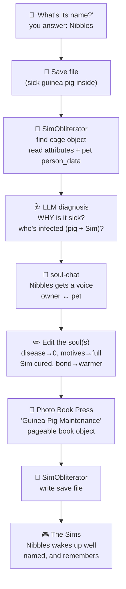

# The Pet Shop — healing sick guinea pigs by editing their soul

> *"Don't take the guinea pig to the vet. Open the guinea pig."*

**Status:** Design
**Related:** [THE-UPLIFT.md](THE-UPLIFT.md) (the character bridge) · [BRIDGE.md](BRIDGE.md) (field mappings) · [README.md](README.md)
**Depends on:** [SimObliterator Suite](https://github.com/DnfJeff/SimObliterator_Suite) (IFF + save editing) · [soul-chat](https://github.com/SimHacker/moollm/tree/main/skills/soul-chat) (a pet has a soul = its editable state)

The canonical patient is **the guinea pig** — The Sims' famous caged pet with the
infamous deadly illness (neglect the cage → the guinea pig sickens → it bites a Sim →
the disease spreads through the household and can kill). To fans it is, and always will
be, *the guinea pig*. (The underlying code and file formats may label small pets
inconsistently — that confusion is real — but the canon, and the love, is guinea pig.)

## The one-line version

Your guinea pig is sick. Instead of loading the game, walking a Sim to the community lot,
and clicking the pet-shop counter, you drag the **save file** into the Pet Shop. It asks
you one thing first — *what's your guinea pig's name?* — then finds the cage object, reads
*why* the little soul is suffering, **cures both of you** (the guinea pig's illness and
the disease it gave you), hands you a coffee-table book on guinea pig maintenance, and
gives the save back. The guinea pig wakes up well, and named, and remembers you were kind.

This is the [Unleashed](https://en.wikipedia.org/wiki/The_Sims:_Unleashed) pet shop,
**everything it does** — heal, adopt, buy, train, match, revive — done as direct
soul-surgery on the save file, LLM-superpowered with imagination and dreaming.

## The consultation

The shop is a conversation, not a counter:

1. **"What's your guinea pig's name?"** — it asks first. A named soul is a different soul
   than a stock one; the name seeds everything downstream (its `CHARACTER.yml`, the book,
   the meet-cute).
2. **Diagnosis for two.** It reads the save and finds *both* patients: the guinea pig
   (sick from a neglected cage) and **you** (bitten, infected — the illness that spreads
   to the household). It explains the cause from history, not just the flag.
3. **Cure both.** Reset the cage/guinea-pig illness attributes and restore its motives;
   clear the Sim's disease and top up the motives the sickness drained.
4. **The coffee-table book.** You leave with *Guinea Pig Maintenance* — a pageable
   in-game book object (built by the [Photo Book Press](THE-UPLIFT.md#the-moollm-mall-shopping-crafting-and-content-creation)):
   how to keep the cage clean, the warning signs, your guinea pig's own care schedule,
   illustrated. Click it on your Sims coffee table and page through it, in any of the 20
   languages via the [auto-internationalizer](BRIDGE.md#auto-internationalizer).

## Why this is the purest demo of the thesis

The [soul-chat](https://github.com/SimHacker/moollm/tree/main/skills/soul-chat)
definition, made literal: **a soul is the inspectable, editable artifact that defines a
thing.** A Sims guinea pig's soul is a handful of object attributes and (for cats/dogs) a
`person_data` array — bytes on disk you can open and change. "Healing" isn't a metaphor
and it isn't a minigame; it's *editing the soul directly*. The guinea pig has a soul in
exactly the sense the whole system means: state you can read, edit, and write back.

No metaphysical claim — the same **BYOB** firewall as everywhere else. We assert only the
tangible level (here are the attribute bytes, here is the fix). Whether the guinea pig
"really" suffers is the player's to feel — and feeling it is the point (it's the
[Cyberiad "Seventh Sally"](https://en.wikipedia.org/wiki/The_Cyberiad) question the whole
project keeps alive as drama).

## What the in-game pet shop does — and our LLM version of each

| In-game (Unleashed) | Soul-surgery equivalent | The LLM superpower |
|---|---|---|
| Cure the sick caged guinea pig (the infamous deadly illness) | Reset the cage object's `dirty`/`disease` attribute; restore the guinea pig's health/motive fields; clear the *Sim's* infection too | Read the *history* — how long neglected, who last cleaned it — and explain the cause, not just clear the flag |
| Adopt / buy a pet | Insert a new pet neighbor + cage object into the lot ([objd.py](https://github.com/DnfJeff/SimObliterator_Suite/tree/main/src/formats/iff/chunks/objd.py) instance) | *Dream* a pet to fit the household — personality matched to the family, a name and backstory generated |
| Train / teach tricks | Bump the pet's skill/relationship fields | Coach in natural language; the pet "learns" a trick and a memory of learning it |
| Improve your bond | Edit the pet↔owner relationship (`daily`/`lifetime`) | Negotiate it — a [soul-chat](https://github.com/SimHacker/moollm/tree/main/skills/soul-chat) between you and the guinea pig, then commit the result |
| Pet dies of neglect | Revive: restore motives, un-set the death flag | Ask whether it *should* return — consent, dignity, [incarnation ethics](https://github.com/SimHacker/moollm/tree/main/skills/incarnation) |

## The pipeline

## The audacious version — object regenesis and the live hot-patch

Editing the sick guinea pig's attributes in place is the easy, safe path. Here's the bold
one, and it's genuinely audacious: **don't patch the stock guinea pig — generate a brand
new, personalized, named, healthy guinea pig *object* and splice it into the save to
replace the stock one.**

Concretely: clone the guinea-pig object with a fresh GUID
([Transmogrifier](https://donhopkins.com/home/TheSimsDesignDocuments/VMDesign.pdf)'s
whole trade), write it a bespoke identity — the name you gave, a temperament, maybe a
regenerated skin — set every attribute to *healthy*, then repoint the cage slot in the
save so it instances **your** guinea pig instead of the generic one.

That move is the **polymorphic inline cache** miracle, applied to a save file. A PIC (Self
— Hölzle, Chambers, Ungar) is a running JIT rewriting its own call sites: it replaces a
generic, slow, polymorphic dispatch with a specialized monomorphic fast path *patched in
live at the call site*. The Sims object system is prototype/delegation-based — the same
[Self lineage (Ungar)](THE-UPLIFT.md#parallel-existence) — so the analogy is exact:

- **call site** ↔ the cage slot in the lot
- **generic polymorphic target** ↔ the stock guinea-pig prototype
- **specialized monomorphic fast path** ↔ *your* named, healthy, bespoke guinea pig object
- **the JIT rewriting itself at runtime** ↔ the Pet Shop generating an object and hot-patching the save in place

Self-modifying code that specializes a generic call into a named, optimized instance —
except the "runtime" is a 26-year-old game and the specialized value is a guinea pig
called Nibbles. That's the whole thrill: the same trick that made Self and modern JITs
fast, aimed at making a virtual pet *specifically yours*.

## Grounding (what already exists)

- **Pets are save-file citizens.** Per the uplift templates, pets are stored as neighbors
  with `person_data`, most fields repurposed for the species
  ([uplift-cat.yml](https://github.com/SimHacker/moollm/blob/main/examples/simopolis/exchange/templates/uplift-cat.yml),
  [uplift-dog.yml](https://github.com/SimHacker/moollm/blob/main/examples/simopolis/exchange/templates/uplift-dog.yml)).
- **The cage is an object with attributes.** Object instances carry their current semantic
  attribute values in the lot; [objd.py](https://github.com/DnfJeff/SimObliterator_Suite/tree/main/src/formats/iff/chunks/objd.py)
  defines the fields, the [save editor](https://github.com/DnfJeff/SimObliterator_Suite/tree/main/src/Tools/save_editor)
  reads and writes them.
- **Object cloning exists.** Transmogrifier already clones Sims objects with new GUIDs; Don's
  tombstone module wrote custom IFF objects directly. Generating a bespoke guinea pig is a
  known trade — the new part is the *save-file instance swap*.
- **Setters exist.** `set_sim_motive()`, `set_sim_skill()`, `set_sim_personality()` (from
  [THE-UPLIFT.md](THE-UPLIFT.md#feasibility)) already write these fields; a caged pet needs
  the object-attribute equivalent — small, mechanical.
- **Species framing is solved.** The uplift templates map Sims traits to animal behavior
  (neat→fastidious, playful→mischievous), so the healed guinea pig reads as *itself*.

## Small pets get souls too

The [uplift](THE-UPLIFT.md) work covers cats and dogs (rich `person_data`). Caged pets —
guinea pigs, birds, fish — are thinner in the save file, mostly object attributes rather
than a full neighbor record. The Pet Shop is where they earn a fuller soul: on the first
visit the LLM writes a `CHARACTER.yml` for the guinea pig (the name you gave it, a
temperament, a memory of the cage), so a creature that was three bytes of "health" comes
home with a story — its own **specialized organelle**, inherited soul plus local soul.

## Imagination & dreaming (the part the 2002 shop couldn't)

- **Dream new pets** — describe a companion in words; generate the object, skin, name, and
  personality, package as IFF, drop it in the lot.
- **Understand, don't just fix** — the shop tells you the guinea pig got sick because the
  cage went 6 days uncleaned during the promotion crunch. Diagnosis as narrative.
- **Cross-species matchmaking** — the Unleashed pet-shop matchmaking, but the LLM reasons
  about temperament fit and writes the meet-cute.
- **Grief and revival with dignity** — a dead pet can return, but the shop *asks first*,
  the same consent posture as [incarnation](https://github.com/SimHacker/moollm/tree/main/skills/incarnation).

## Place in the world

This is a shop in the **[MOOLLM Mall](THE-UPLIFT.md#the-moollm-mall-shopping-crafting-and-content-creation)**
(Soul City's Plaza) alongside the Head Shop, Rug-O-Matic, and Tombstone Studio — the one
that works on the living. In Soul-family terms it's a **soul catcher + soul transmogrifier**
pointed at animals: ingest the pet's state, edit or regenerate it, write it home.

## Open questions

- **Canon vs code:** to fans it's the **guinea pig**; the file formats/tooling may name small
  pets inconsistently. Standardize docs on *guinea pig*; note actual field labels when confirmed.
- Exact cage-illness attribute(s), the Sim-infection field, and death flag — confirm offsets
  against a real save via SimObliterator before claiming specifics.
- **The hot-patch:** confirm the save-file instance swap — can we repoint a lot's cage slot
  to a freshly-cloned GUID cleanly, or does it require rewriting neighbor/object references?
  This is the audacious bit; scope it before promising it.
- Should the guinea pig's `CHARACTER.yml` round-trip back into the save, or live only in
  MOOLLM as its "web soul"?
