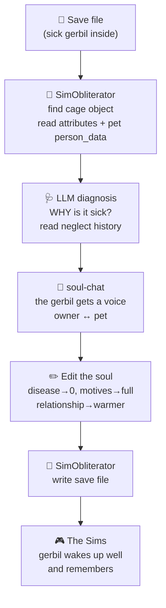

# The Pet Shop — healing sick pets by editing their soul

> *"Don't take the gerbil to the vet. Open the gerbil."*

**Status:** Design
**Related:** [THE-UPLIFT.md](THE-UPLIFT.md) (the character bridge) · [BRIDGE.md](BRIDGE.md) (field mappings) · [README.md](README.md)
**Depends on:** [SimObliterator Suite](https://github.com/DnfJeff/SimObliterator_Suite) (IFF + save editing) · [soul-chat](https://github.com/SimHacker/moollm/tree/main/skills/soul-chat) (a pet has a soul = its editable state)

## The one-line version

Your gerbil is sick. Instead of loading the game, walking a Sim to the community lot,
and clicking the pet-shop counter, you drag the **save file** into the Pet Shop. It
finds the gerbil-cage object, reads *why* the little soul is suffering, heals it by
editing its attributes, and hands the save back. The gerbil wakes up well — and it
remembers you were kind to it.

This is the [Unleashed](https://en.wikipedia.org/wiki/The_Sims:_Unleashed) pet shop,
**everything it does** — heal, adopt, buy, train, match, revive — but done as direct
soul-surgery on the save file, LLM-superpowered with imagination and dreaming.

## Why this is the purest demo of the thesis

The [soul-chat](https://github.com/SimHacker/moollm/tree/main/skills/soul-chat)
definition, made literal: **a soul is the inspectable, editable artifact that defines a
thing.** A Sims gerbil's soul is a handful of object attributes and (for cats/dogs) a
`person_data` array — bytes on disk you can open and change. "Healing" isn't a metaphor
and it isn't a minigame; it's *editing the soul directly*. The gerbil has a soul in
exactly the sense the whole system means: state you can read, edit, and write back.

No metaphysical claim — the same **BYOB** firewall as everywhere else. We assert only
the tangible level (here are the attribute bytes, here is the fix). Whether the gerbil
"really" suffers is the player's to feel — and feeling it is the point (it's the
[Cyberiad "Seventh Sally"](https://en.wikipedia.org/wiki/The_Cyberiad) question the
whole project keeps alive as drama).

## What the in-game pet shop does — and our LLM version of each

| In-game (Unleashed) | Soul-surgery equivalent | The LLM superpower |
|---|---|---|
| Cure a sick caged pet (the infamous deadly guinea-pig/gerbil illness) | Reset the cage object's `dirty`/`disease` attribute; restore the pet's health/motive fields | Read the *history* — how long neglected, who last cleaned it — and explain the cause, not just clear the flag |
| Adopt / buy a pet | Insert a new pet neighbor + cage object into the lot ([objd.py](https://github.com/DnfJeff/SimObliterator_Suite/tree/main/src/formats/iff/chunks/objd.py) instance) | *Dream* a pet to fit the household — personality matched to the family, a name and backstory generated |
| Train / teach tricks | Bump the pet's skill/relationship fields | Coach in natural language; the pet "learns" a trick and a memory of learning it |
| Improve your bond | Edit the pet↔owner relationship (`daily`/`lifetime`) | Negotiate it — a [soul-chat](https://github.com/SimHacker/moollm/tree/main/skills/soul-chat) between you and the gerbil, then commit the result |
| Pet dies of neglect | Revive: restore motives, un-set the death flag | Ask whether it *should* return — consent, dignity, [incarnation ethics](https://github.com/SimHacker/moollm/tree/main/skills/incarnation) |

## The pipeline

## Grounding (what already exists)

- **Pets are save-file citizens.** Per the uplift templates, pets are stored as
  neighbors with `person_data`, most fields repurposed for the species
  ([uplift-cat.yml](https://github.com/SimHacker/moollm/blob/main/examples/simopolis/exchange/templates/uplift-cat.yml),
  [uplift-dog.yml](https://github.com/SimHacker/moollm/blob/main/examples/simopolis/exchange/templates/uplift-dog.yml)).
- **The cage is an object with attributes.** Object instances carry their current
  semantic attribute values in the lot; [objd.py](https://github.com/DnfJeff/SimObliterator_Suite/tree/main/src/formats/iff/chunks/objd.py)
  defines the fields, the [save editor](https://github.com/DnfJeff/SimObliterator_Suite/tree/main/src/Tools/save_editor)
  reads and writes them.
- **Setters exist.** `set_sim_motive()`, `set_sim_skill()`, `set_sim_personality()`
  (from [THE-UPLIFT.md](THE-UPLIFT.md#feasibility)) already write these fields; a caged
  pet needs the object-attribute equivalent — small, mechanical.
- **Species framing is solved.** The uplift templates already map Sims traits to animal
  behavior (neat→fastidious, playful→mischievous), so the healed pet reads as *itself*,
  not a tiny human.

## Small pets get souls too

The [uplift](THE-UPLIFT.md) work covers cats and dogs (rich `person_data`). Caged
pets — gerbils, guinea pigs, birds, fish — are thinner in the save file, mostly object
attributes rather than a full neighbor record. The Pet Shop is where they earn a fuller
soul: on first visit the LLM writes a `CHARACTER.yml` for the gerbil (a name, a
temperament, a memory of the cage), so a creature that was three bytes of "health" comes
home with a story — its own **specialized organelle**, inherited soul plus local soul.

## Imagination & dreaming (the part the 2002 shop couldn't)

- **Dream new pets** — describe a companion in words; generate the object, skin, name,
  and personality, package as IFF, drop it in the lot.
- **Understand, don't just fix** — the shop tells you the gerbil got sick because the
  cage went 6 days uncleaned during the promotion crunch. Diagnosis as narrative.
- **Cross-species matchmaking** — the Unleashed pet-shop matchmaking, but the LLM
  reasons about temperament fit and writes the meet-cute.
- **Grief and revival with dignity** — a dead pet can return, but the shop *asks first*,
  the same consent posture as [incarnation](https://github.com/SimHacker/moollm/tree/main/skills/incarnation).

## Place in the world

This is a shop in the **[MOOLLM Mall](THE-UPLIFT.md#the-moollm-mall-shopping-crafting-and-content-creation)**
(Soul City's Plaza) alongside the Head Shop, Rug-O-Matic, and Tombstone Studio — the
one that works on the living. In Soul-family terms it's a **soul catcher + soul
transmogrifier** pointed at animals: ingest the pet's state, edit it, write it home.

## Open questions

- Exact cage-illness attribute(s) and death flag — confirm field offsets against a real
  Unleashed save via SimObliterator before claiming specifics.
- Should caged-pet `CHARACTER.yml` files round-trip back into the save, or live only in
  MOOLLM as the pet's "web soul"?
- Where does the healed pet's memory of *being healed* persist across game↔MOOLLM crossings?
