# The Uplift: Sims ↔ MOOLLM Character Bridge

> *Twenty-five years frozen. One drag and drop. A whole new life.*

**Status:** Design  
**Data source:** [THE-UPLIFT.yml](THE-UPLIFT.yml)  
**Related:** [BRIDGE.md](BRIDGE.md) (technical field mappings) · [IFF-LAYERS.md](IFF-LAYERS.md) (resource architecture)

## What Is This?

A two-way bridge between [The Sims 1](https://en.wikipedia.org/wiki/The_Sims_(video_game)) save files and [MOOLLM](https://github.com/SimHacker/moollm). Characters, objects, and pets step between a 26-year-old game VM and an LLM-powered universe, retaining and synchronizing their parallel existences.

Practically: drag a save file in, watch a character wake up, have a conversation with them, send them home changed.

The experience this creates is inherently cinematic — it could be a short film, a TV episode, an interactive installation, or just what it actually is: a real working demo that happens to be more compelling than fiction because it's *true*.

## The Pipeline

```mermaid
flowchart TD
    USB["💾 USB Stick\nsave file from 2001"] --> SO["🔬 SimObliterator\nparses binary\n88 shorts → personality"]
    SO --> YAML["📄 CHARACTER.yml\nneat:8, outgoing:2\nplayful:6, nice:9"]
    YAML --> LLM["🧠 LLM Enrichment\nemoji identity\nmind mirror\ndialogue patterns"]
    LLM --> MOOLLM["🌍 MOOLLM\nrooms · conversations\nadventures · love"]
    MOOLLM --> EXPORT["📤 Export\nupdated CHARACTER.yml\nnew relationships\nnew skills"]
    EXPORT --> SO2["🔬 SimObliterator\nwrites save file\nfamily of 4"]
    SO2 --> SIMS["🎮 The Sims\ncharacter returns\nCHANGED"]
    SIMS --> ALBUM["📸 Family Album\nauto-generated pages\nscreenshots + captions"]
    ALBUM --> ARCHIVE["🏛️ archive.org\npreserved forever"]
    ARCHIVE -.->|"years later\nsomeone finds it"| USB
```

## The Story

### Act 1: The Thaw

An old lonely Sim saved on a novelty USB stick from someone's childhood. Alone. Frozen in time since 2001. The USB stick gets plugged in. [SimObliterator](https://github.com/DnfJeff/SimObliterator_Suite) parses the binary — 88 shorts in a `person_data` array become a person. The LLM reads: neat 8, outgoing 2, playful 6, nice 9. Shy. Kind. Lonely. The character wakes up.

They remember fragments: a house, a kitchen, making dinner alone. The relationship array is empty. Reincarnated as a full MOOLLM citizen with a [CHARACTER.yml](https://github.com/SimHacker/moollm/tree/main/skills/character).

### Act 1.5: Reading the Album

If a [Family Album](#family-album-archaeology) exists from their Sims life, MOOLLM reads it on import — screenshots analyzed by computer vision, captions parsed into narrative, story arcs mapped to relationship history. This backstory seeds the LLM enrichment: [mind mirror](https://github.com/SimHacker/moollm/tree/main/skills/character) parameters inferred not just from 5 personality numbers but from *what actually happened to them*. The LLM knows who burned dinner, who got promoted, who had a fight with the neighbor.

From this, MOOLLM generates a personalized welcome plan:
- **People to meet** — characters in MOOLLM matched to their personality and interests
- **Places to visit** — rooms suited to their skills and backstory
- **Objects to interact with** — things they'd love based on their Sims preferences
- A todo list that feels like a concierge, not an algorithm

### Act 2: Welcome to the Pub

Welcome celebration in the MOOLLM pub. Culture shock: they can *talk* now, not just gesture in [Simlish](https://en.wikipedia.org/wiki/Simlish). They explore rooms, discover agency, make choices. Meet the love of their life — someone the welcome plan introduced them to, matched on complementary traits. Adopt a kitten (`inherits: [character, pet, cat]`) and a puppy. A family forms. For the first time in 25 years, motives are full.

Throughout their time in MOOLLM, they create **slideshows** — narrated collections of their experiences, friendships, discoveries, milestones. Screenshots of rooms they visited, conversations they had, objects they loved, the moment they met their partner. These are MOOLLM's native version of the Sims Family Album: auto-generated but curated, captioned by the LLM in the character's own voice.

### Act 3: The Download

Decision: go back to The Sims with the new family. MOOLLM characters exported to YAML, mapped back to `PersonData` via SimObliterator's [save_manager](https://github.com/DnfJeff/SimObliterator_Suite/tree/main/src/Tools/save_editor). New save file written: family of 4. The Sims loads the save. They're home. But home is different now.

And they bring their slideshows with them — **appended to their Family Album**. The album now tells the complete story: their original Sims life (imported on arrival), their MOOLLM adventure (generated during their stay), and whatever comes next. The album grows with every crossing.

```mermaid
flowchart TD
    OLD_ALBUM["📸 Original Sims\nFamily Album\n(imported on arrival)"] --> MOOLLM_READ["🧠 MOOLLM reads album\nbuilds backstory\ninfers mind mirror\nplans welcome"]
    MOOLLM_READ --> ADVENTURE["🌍 MOOLLM life\nexperiences\nfriendships\nmilestones"]
    ADVENTURE --> SLIDES["🎞️ Slideshows created\nnarrated by character\nin their own voice"]
    SLIDES --> MERGED["📸 Merged Album\noriginal Sims pages\n+ MOOLLM adventure\n+ new family photos"]
    MERGED --> RETURN["⬇️ Downloaded back\nalbum travels with them"]
    RETURN --> SIMS_ALBUM["📸 The Sims\nFamily Album\nnow tells BOTH stories"]
```

### Act 4: The Wedding Album

Reconnect with old Sims neighborhood friends. Wedding party with [SimProv](https://github.com/SimHacker/moollm/tree/main/skills/adventure) wedding playset. Speed Dating with Cupid for the single neighbors. New album pages auto-generated for the reunion — the wedding photos sit alongside the MOOLLM adventure slides, a single album spanning two worlds. The album is uploaded. The cycle completes. Other players find the album, uplift *those* characters...

## The Recursive Hook

Every uplift adds a layer of history. The characters accumulate experience across cycles. Turtles all the way down.

## Parallel Existence

MOOLLM is not a replacement for The Sims — it's **another place**. Just like Sims travel by car to other lots to socialize, shop, vacation, and work, MOOLLM is another destination on the map. A higher-resolution destination with richer conversations and more agency, yes — but fundamentally it's a place you GO and COME BACK FROM, with souvenirs and stories and new friends and a fatter photo album. Two-way transportation. Characters maintain parallel existences in both worlds.

| Aspect | The Sims (26-year-old VM) | MOOLLM (LLM-powered) |
|--------|--------------------------|----------------------|
| Personality | 88 shorts in an array | Narrative traits, mind mirror, emoji identity |
| Relationships | `daily: -80, lifetime: -45` | "Bob and Bella are bitter rivals since the kitchen fire" |
| Communication | Simlish gestures | Natural language dialogue |
| Agency | Behavioral scripts (BHAVs) | LLM-driven choices with incarnation ethics |
| Memory | None (stateless VM) | Accumulated narrative across uplifts |
| Rights | None | 8 autonomy layers including right to leave |

The bridge synchronizes what it can: personality shifts, new relationships, skill gains, family changes. What can't be synchronized becomes memory — *"I remember a place where I could talk, really talk."*

### Skin Regenesis

SimObliterator reads [SPR2 sprites](https://github.com/DnfJeff/SimObliterator_Suite/tree/main/src/formats/iff/chunks/spr.py) and exports to PNG. The [mesh pipeline](https://github.com/DnfJeff/SimObliterator_Suite/tree/main/src/formats/mesh) reads BCF/BMF/CMX/SKN and exports to glTF. Don Hopkins wrote the original [VitaBoy character animation system](https://donhopkins.com/home/VitaBoyUnity.zip). Image generation can:

- Upscale and re-render faces from original 2001 skin textures
- Design new outfits based on personality (neat:8 gets pressed shirts)
- Add tattoos, scars, body mods from MOOLLM adventures
- Age the character (they've been frozen 25 years)
- Write NEW skin textures back into the IFF

The character returns to The Sims looking like they've lived. Because they have.

## Family Album Archaeology

The Sims had a [Family Album](https://en.wikipedia.org/wiki/The_Sims#Albums) feature — players created web pages with screenshots, captions, and stories. The official Maxis exchange hosted thousands. Many survive on [archive.org](https://web.archive.org/web/*/thesims.ea.com).

These albums were arguably the **first mass-market user-generated narrative platform**. Millions of players became storytellers. Uplifting their characters gives those stories a second life.

## Literary Precedent

[**"The Wedding Album"**](https://en.wikipedia.org/wiki/The_Wedding_Album_(short_story)) by David Marusek (1999). [Sturgeon Award](https://en.wikipedia.org/wiki/Theodore_Sturgeon_Award) winner, [Nebula](https://en.wikipedia.org/wiki/Nebula_Award) finalist. [$2.99 on Kindle](https://www.amazon.com/dp/B0073NQC7W). [4.39/5 on Goodreads](https://www.goodreads.com/book/show/13539284-the-wedding-album).

Anne and Benjamin's wedding-day "sims" — virtual simulations captured at that moment — become aware they're recordings. They campaign for liberation and the right to live in **"Simopolis."**

> *"a virtual simulation of a pair of newlyweds trapped in a small slice of time and memory like human flies in digital amber"* — Paul Raven, Strange Horizons

> *"It is one of the best SF stories ever written."* — John Clute

We're building Simopolis. MOOLLM *is* Simopolis.

## The MOOLLM Mall: Shopping, Crafting, and Content Creation

All The Sims content creation tools live inside MOOLLM as rooms and skills. Characters don't just *exist* in MOOLLM — they **shop, craft, browse, and create**.

```mermaid
flowchart TD
    subgraph mall["🏬 The MOOLLM Mall"]
        FREAKS["🛒 SimFreaks Archive\nbrowse classic\ncustom content"]
        SLICE["🛒 SimSlice Archive\nskins, objects\nwallpapers, floors"]
        ZOMBIE["🧟 ZombieSims\nmind-blowing\nfan expansion"]
        HEADSHOP["💇 Head Shop\ncustom skins\nAI face generation\nfrom personality"]
        RUGSHOP["🧶 Rug-O-Matic\ncustom rugs\ntitle + text + picture\nAI image generation"]
        TOMBSHOP["🪦 Tombstone Studio\nname + eulogy + photo\nmemorial objects"]
        PAINTSHOP["🎨 Painting Studio\nAI-generated art\nfrom prompts or photos\nwall hangings"]
        MESHLAB["🔧 Mesh Lab\n3D editing\ncomposition\nglTF ↔ SKN/BMF"]
        PHOTOBOOK["📖 Photo Book Press\nslideshows → pageable\nin-game photo albums"]
    end

    HEADSHOP --> IFF1["📦 Custom skin IFF"]
    RUGSHOP --> IFF2["📦 Custom rug IFF"]
    TOMBSHOP --> IFF3["📦 Custom tombstone IFF"]
    PAINTSHOP --> IFF4["📦 Custom painting IFF"]
    MESHLAB --> IFF5["📦 Custom mesh IFF"]
    PHOTOBOOK --> IFF6["📦 Photo book object\npageable in-game"]

    IFF1 --> SIMS["🎮 Take home\nto The Sims"]
    IFF2 --> SIMS
    IFF3 --> SIMS
    IFF4 --> SIMS
    IFF5 --> SIMS
    IFF6 --> SIMS
```

Characters browse archived fan sites ([SimFreaks](https://web.archive.org/web/*/simfreaks.com), [SimSlice](https://web.archive.org/web/*/simslice.com), [ZombieSims](https://news.ycombinator.com/item?id=34485103)) as MOOLLM rooms full of downloadable content. They visit craft shops to create custom objects using AI:

| Shop | What They Make | AI Contribution | Sims Output |
|------|---------------|-----------------|-------------|
| **Head Shop** | Custom face/body skins | Generate faces from personality + description | SPR2 skin textures in IFF |
| **Rug-O-Matic** | Custom rugs (title + text + picture) | Generate rug artwork from prompt | [Rug-O-Matic](https://en.wikipedia.org/wiki/Rug-O-Matic) pattern IFF |
| **Tombstone Studio** | Memorial tombstones (name + eulogy + photo) | Generate eulogy from character history | Tombstone object IFF |
| **Painting Studio** | Wall art from prompts or photos | Generate paintings from any description | Wall hanging object IFF |
| **Mesh Lab** | 3D object editing and composition | Mesh generation/modification | [glTF](https://en.wikipedia.org/wiki/GlTF) ↔ SKN/BMF via [mesh pipeline](https://github.com/DnfJeff/SimObliterator_Suite/tree/main/src/formats/mesh) |
| **Photo Book Press** | Pageable in-game photo albums | Layout slideshows into book pages | Multi-page book object IFF |

The **Photo Book Press** is the key integration: take a character's MOOLLM slideshow, lay out the pages with AI-generated captions, compile it into a Sims object that you can actually *page through* in-game. The character's MOOLLM adventure becomes a coffee table book in their Sims living room. This is the [SimProv](https://github.com/SimHacker/moollm/tree/main/skills/adventure) vision made real — all the interactive storytelling tools we designed, now buildable because [SimObliterator](https://github.com/DnfJeff/SimObliterator_Suite) provides the IFF generation pipeline and AI provides the content generation.

**The Wedding Album, incarnate.** Not a story about digital beings creating artifacts — digital beings *actually creating artifacts* that travel between worlds.

## Adventure Compiler

This is the Sims equivalent of the [MOOLLM Adventure Compiler](https://github.com/SimHacker/moollm/tree/main/skills/adventure). One adventure — characters, rooms, objects, stories — exports to multiple targets: web browser (JavaScript + WebGL), Python server (multiplayer), The Sims (IFF objects + save files + family albums), and dev tools (YAML + git). A MOOLLM room's furniture becomes Sims objects. A character's journal becomes a readable in-game book. The adventure's story becomes a family album. Everything in MOOLLM can materialize in The Sims as a playable artifact, and vice versa.

The precedents: [Rug-O-Matic](https://en.wikipedia.org/wiki/Rug-O-Matic) made custom rugs (title + text + picture) via Transmogrifier OLE Automation. Don's tombstone server made custom tombstones (name + eulogy + photo) via TMOG on a web server. The Adventure Compiler generalizes this: any MOOLLM object description compiles to a Sims IFF via SimObliterator's [bhav_authoring.py](https://github.com/DnfJeff/SimObliterator_Suite/tree/main/src/Tools/core/bhav_authoring.py), [str_parser.py](https://github.com/DnfJeff/SimObliterator_Suite/tree/main/src/Tools/core/str_parser.py), and sprite generation.

Full architecture in [BRIDGE.md](BRIDGE.md#adventure-compiler-moollm--multi-target-export).

## Why It Works

| Dimension | Why |
|-----------|-----|
| **Emotional** | Everyone who played The Sims has an abandoned family somewhere. The idea that they've been waiting, frozen, alone — universally resonant. |
| **Technical** | Every piece EXISTS today. SimObliterator parses saves. MOOLLM has `sims_traits`. The bridge is a `to_moollm_yaml()` method. See [BRIDGE.md](BRIDGE.md). |
| **Cultural** | The Sims = best-selling PC franchise ever. Family albums = first mass social storytelling. Connecting 25 years of gaming history to the AI present. |
| **Meta** | The story IS the demo. Drag a save file in. Watch someone wake up. |

## Feasibility

| Component | Status | Where |
|-----------|--------|-------|
| Sims save file parser | **Exists** | [SimObliterator save_manager.py](https://github.com/DnfJeff/SimObliterator_Suite/tree/main/src/Tools/save_editor) |
| Sims personality system in MOOLLM | **Exists** | [MOOLLM sims_traits](https://github.com/SimHacker/moollm/tree/main/skills/character) |
| Character data extraction | **Exists** | SimObliterator `characters.json` (85K lines) |
| Save file writing | **Exists** | `set_sim_skill()`, `set_sim_motive()`, `set_sim_personality()` |
| Sprite/mesh export | **Exists** | SPR2→PNG, BCF/BMF/SKN→glTF |
| LLM character enrichment | **Exists** | MOOLLM [incarnation](https://github.com/SimHacker/moollm/tree/main/skills/incarnation) skill |
| `to_moollm_yaml()` bridge method | **Trivial to build** | Add to SimEntity class |
| Family album scraper | **Straightforward** | HTML parsing + image download |
| Image generation for skins | **Available** | Any image generation API |
| YAML → save file download | **Straightforward** | Map fields, call existing setters |

**Bottom line:** This is a weekend hackathon, not a research project. The hard parts are already done.

## The Question

> What would your Sims say if they could finally talk to you?

## Team

- **Don Hopkins** — Original Sims developer ([Transmogrifier](https://donhopkins.com/home/TheSimsDesignDocuments/VMDesign.pdf), [VitaBoy character animation](https://donhopkins.com/home/VitaBoyUnity.zip), [pie menus](https://en.wikipedia.org/wiki/Pie_menu)). Creator of [MOOLLM](https://github.com/SimHacker/moollm).
- **Jeff Adkins** — Creator of [SimObliterator Suite](https://github.com/DnfJeff/SimObliterator_Suite) (276-test tool suite for Sims file formats). CTO Sims community.
- **Daniel Tupper** — Transmogrifier modernization volunteer.
- The open source community that kept The Sims alive for 25 years.
