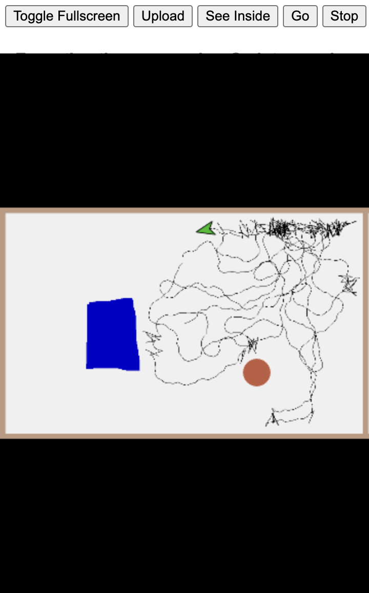

# The Ultimate TinkerToy — Alan Kay's active essay, and what it cost to still be running

**People:** Alan Kay · Marvin Minsky · Grey Walter · John Maloney · Yoshiki Ohshima ·
Cynthia Solomon · Margaret Minsky · Mike Travers

Alan Kay wrote an afterword to Marvin Minsky's "Infinite Construction Kit" for *Inventive Minds*
(MIT Press, 2019). He wanted it to have live programs in it, which a printed book cannot carry, so
Ohshima and Maloney built a web version whose examples are running GP projects the reader can open
and edit. Children build Grey Walter's conditioned reflex out of three toilet tanks.

**This file exists because, in September 2026, Alan said in a Quora comment: "I should put this
paper online …".** Two versions were already online and he did not have the links, so the links, the
dependency inventory, and a run-verification are recorded here rather than in a bookmark.

## The published chapter is an abridgement, and the cut is the subject

**Correction, 19 September 2026, from Alan, in reply to the comment that pointed him at the DOI
below.** Quoted whole, because it invalidates the tidy version of this document's own premise:

> The problem was that the whole account about making a "conditioned reflex analogue" (as Walter
> called it) was excised from the MIT press book because it was too long (they said). So the chapter
> they published missed the most important part IMO.
>
> I'll send you an email of what I originally gave them.

So "it is already online in both versions" was wrong in the way that matters most. **The print
artifact is a cut, and what was cut is CORA** — Walter's conditioned reflex analogue, the seven steps
from chance to meaning, the mechanism this entire document is about. The chapter that has the DOI, the
publisher and the deposit libraries is the one missing the argument.

Three consequences, and the third is the one worth sitting with:

1. **The active essay is the only complete public version.** It builds the conditioned reflex — three
   memories at three decay rates, and the nudibranch learns. The thing the press cut for length is
   the thing the web version *implements and runs*.
2. **The unexcised original is unpublished and exists nowhere public.** Alan has offered to send it.
   That is not a link to collect; it is a primary source arriving, and it needs a permanent home with
   his name on it.
3. **The durability row in the table below reverses.** This document was going to argue that the inert
   half got the permanence while the live half sat on one abandoned host. That is still true, and it
   is now worse: the half that got the permanence **got edited down**, and nobody reading it can tell.
   A DOI guarantees that a thing stays findable. It guarantees nothing about whether the thing is
   whole.

`status: awaiting the email. When it arrives: verbatim, under Alan's byline, with the excision noted`
`and the published chapter linked beside it so the two can be diffed. Slot is`
[`sources/kay-cora-unexcised/`](#awaiting-the-unexcised-original)`.`

## The two artifacts

| | Print | Active |
|---|---|---|
| **What** | "Afterword to Essay 1" | "Marvin Minsky And The Ultimate TinkerToy" |
| **Where** | <https://doi.org/10.7551/mitpress/11558.003.0007> | <https://tinlizzie.org/tinkertoy/> |
| **Access** | Open access, free PDF, MIT Press | Free, no login |
| **Complete?** | **No — the CORA account was excised for length** | **Yes, and it runs** |
| **Also** | In the OA volume, chapter 194044 | Japanese: [`ja.html`](https://tinlizzie.org/tinkertoy/ja.html), trans. Ohshima |
| **Byline** | Alan Kay | Alan Kay, *web adaptation by Yoshiki Ohshima and John Maloney* |
| **Durability** | DOI, publisher, deposit libraries — **for an abridgement** | One host, one abandoned VM — **for the whole argument** |

Minsky's essay it answers was written for *LogoWorks: Challenging Programs in Logo* (1986) and is
reprinted beside it at [`construction.html`](https://tinlizzie.org/tinkertoy/construction.html).
Ohshima translated the whole book into Japanese for O'Reilly Japan (2020), introduced to them by
Kazuhiro Abe.

## What the essay actually builds

The spine is Grey Walter's tortoise, reconstructed as something a nine-to-fourteen-year-old can
assemble and take apart:

1. **Wander** — `forever: turn by random(-45, 45); move 10`. One block script, and Kay notes the
   trace looks like a Roomba's.
2. **Avoid** — a second script running at the same time, reading the touch sensor, jumping back.
   Two agents, no coordinator. *"Two simple agents can make a lot happen!"*
3. **Nudibranch** — the same behaviors rebuilt as sensory neuron → motor neuron → muscle, with
   rubber-band lines drawn from the creature's body to the neural diagram, so the diagram is not an
   illustration of the model, it **is** the model.
4. **The memory** — *"This sounds a lot like a toilet!"* A basin is a number, a drain script that
   decrements to zero but no lower, a rate variable, and a float. Promoted into a GP part so it can
   be instanced.
5. **The conditioned reflex** — three instances of that one part, **identical except for their rate
   of decay**: Sound Memory (fast), Coincidence Memory (slower, stair-steps up on each coincidence),
   Long Term Memory (slowest, latched past a threshold of 80). Plus four small scripts.

**The load-bearing observation, and it is the essay's own thesis at its smallest scale.** Kay states
the idea as *"architecture dominates materials"* — and then the deepest mechanism in the piece is
one part used three times, varying only in how fast it forgets. Associative learning is not in any
of the three components. It is in the arrangement of their time constants. A society of mind with a
population of three.

That is also the answer to the question this repository keeps asking about Ken Kahn's divergence
(grow the architecture versus build it by hand): **the part is hand-built, the behavior is grown,
and the join is that the hand-built part is instanceable.** See
[`../AXES-NOT-CAMPS.md`](../AXES-NOT-CAMPS.md).

## Grey Walter, sourced

Alan's phrase "the 7 steps from chance to meaning" is a chapter title, not a paraphrase.

| Claim | Source |
|---|---|
| "The Seven Steps from Chance to Meaning" | *The Living Brain*, Norton, 1953, ch. 7 |
| CORA's circuit | same, Appendix C — *"worked out to fit on to M. speculatrix, but it is difficult to adjust on a moving model and should be set up on the bench first"* |
| CORA = **CO**nditioned **R**eflex **A**nalogue; the learning tortoise is *Machina docilis*, the exploring one *Machina speculatrix* | Walter; Science Museum Group holds the device, built by W. J. "Bunny" Warren at the Burden Neurological Institute |
| The training method | Walter's own account: *"The schooling was to blow a police whistle and kick it. After it had been whistled at and kicked about a dozen times, it learned that a whistle meant trouble."* |
| Two-note whistle induced a breakdown, cured by cutting out the added circuits | Walter — he called it leucotomy, and it turned *docilis* back into *speculatrix* |
| Minsky knew Walter personally, and Walter's tortoises fed the Logo turtle | Kay, in this essay |

`needs-check: Alan's comment says the scheme "was later called Hebbian Learning." Hebb's The
Organization of Behavior is 1949 and CORA is 1950–53, so Hebb is not later than Walter. The
defensible reading is that the name spread later. Hebb is in the essay's own bibliography.`

Walter also published it for a general audience twice in *Scientific American*: "An Imitation of
Life" (May 1950) and "A Machine That Learns" (August 1951).

### He put a teacher at the head of it, and the pun is two decades early

**The epigraph of "An Imitation of Life" — printed above Walter's own byline — is the Mock Turtle:**

> "When we were little… we went to school in the sea. The master was an old Turtle — we used to call
> him Tortoise."
>
> "Why did you call him Tortoise if he wasn't one?" Alice asked.
>
> "We called him Tortoise because he **taught us**," said the Mock Turtle angrily. "Really you are
> very dull!"
>
> — Lewis Carroll, *Alice's Adventures in Wonderland*

`verified: W. Grey Walter, "An Imitation of Life," Scientific American 182(5), May 1950 —`
[PDF](https://cse-robotics.engr.tamu.edu/dshell/cs689/papers/walter50imitation.pdf)`. The same`
`passage is reproduced in Holland's history` ([PDF](https://cse-robotics.engr.tamu.edu/dshell/cs689/papers/holland02first.pdf))`,`
`where it also heads the tortoise's own instruction sheet — the pun was printed in the manual.`

**The precise version, because the loose version is tempting and wrong.** Walter's stated reason for
the genus name is *appearance*: "because of its general appearance we call the genus 'Testudo,' or
tortoise." So he did not name the machines *after* a teacher — he named them for the shell **and
chose an epigraph about teaching**, deliberately, at the head of the paper. The teaching pun is
authorial intent rather than etymology, which is a better fact than the overstatement and survives a
close reader.

**And it lands two decades before the turtle started teaching children.** The 1950 epigraph is a joke
about a tortoise who was a schoolmaster; Papert's Logo turtle arrives in the late 1960s. Alan's
phrase "the original turtle guy" is therefore right in a second sense he did not claim: Walter picked
the pedagogical pun first.

### The anti-stacking reading, which is Don's and belongs here

Kay's stated thesis is **"architecture dominates materials,"** and the essay's deepest mechanism is
*one part instanced three times, differing only in rate of decay*. Not a class hierarchy — **a flat
population with varied parameters.** Associative learning is in the arrangement, not in any
component, and not in any ancestor of any component.

Which makes a line of descent that is really an argument against depth:

| | The structure | What it refuses |
|---|---|---|
| Walter's tortoise | two tubes, two senses, two motors | a controller above the behaviours |
| Papert's turtle | **one** turtle, commanded directly | an abstraction layer between child and motion |
| Minsky's agents | a society of many simple ones | a homunculus at the top |
| Kay's CORA in GP | three instances of one part | an inheritance chain |

**Dr. Seuss wrote the warning.** In *Yertle the Turtle* (1958) the king builds his hierarchy by
stacking turtles, and it is **the turtle at the bottom** who brings the whole stack down — Mack,
who burps. A deep hierarchy fails at its least privileged member, which is the same complaint
functional programmers make about deep inheritance and the same reason
[dry-piles](../korz/dry-piles.md) insists the pile stays **flat**: a subdirectory below the type level
asserts one decomposition as dominant. Flat pile, many indexes, none of them the tree.

*Ubik* supplies the mechanism for why depth specifically hurts: **the deeper the chain, the further
you can regress** when a specific binding stops matching, and every intermediate ancestor is a
plausible-looking world to get stranded in ([ubik.md](../pkd/ubik.md)).

## Dependency inventory

What the live half of the essay actually needs, as of 19 September 2026:

| Component | Where | Status |
|---|---|---|
| Essay pages, images, `code.js` | `tinlizzie.org/tinkertoy/` | HTTP 200 |
| `wanderAndAvoid.gpp` | same dir | 200, 9 KB |
| `NudibranchNeuronChain.gpp` | same dir | 200, 240 KB |
| `MemoryTinkering8.gpp` | same dir | 200, 37 KB |
| `conditionedReflex12.gpp` | same dir | 200, 208 KB |
| GP runner | `tinkertoy/gpblocks/run/go.html` | 200 |
| GP VM | `emModule.js` (Emscripten), `gpSupport.js`, `FileSaver.js` | 200 |
| GP project home | <https://gpblocks.org> | 200, now on HTTPS |
| `@croquet/croquet`, `qrious` | jsDelivr CDN, unpinned | 200 |

**The single point of failure is not the code, it is the host.** Every `.gpp` and the VM are static
files under one directory on one domain. `code.js` computes its own base from
`location.hostname + dir`, so the whole thing is relocatable by copying the directory — which is
the good news, and the reason a mirror is cheap.

`@croquet/croquet` is loaded **unpinned** from a CDN, which is the one dependency that can change
underneath the page without anyone touching the server.

## Run verification, 19 September 2026

Loaded in a current Chromium, seven years after publication. The Emscripten GP VM boots.

**Wander and avoid** — Grey Walter's explore behavior, with the pen down. Green turtle, blue
barrier, brown obstacle, and the scribble of a machine that has no map:

**See Inside** — the button the entire pedagogy rests on. Full editor: block palette by category,
the `Robot` and `obstacle` classes, the instance list, the stage still running, and the scripts
open for rearranging. `when I receive go: go to x0 y0, pen down, clear stamps and pen trails,
broadcast wander, broadcast avoid`:

**The conditioned reflex** — the nudibranch, the obstacles, the microphone button, and the three
basins. Sound Memory caught mid-decay, the sawtooth Kay drew by hand in the essay before he built
it:

`verified: all three screenshots taken from the live site, not from the essay's static images.
One gotcha for anyone repeating this — the runner reads location.hash once at load, so switching
projects by editing the fragment alone does not reload. Navigate away and back.`

## The irony, stated plainly, because it is the argument for this repo

The essay argues that inert media are a poor container for powerful ideas and that dynamic media
are the point of computers at all. **The inert half got a DOI, a publisher, an open-access licence
and deposit copies. The dynamic half — the better artifact, the one with the child's hands in it —
is a directory on one host, running a language whose lab was dissolved in 2016.**

GP's history is the exposure: Maloney, Mönig and Ohshima built it from 2014 at SAP's Communications
Design Group under Kay; CDG was disbanded mid-2016; Maloney and Ohshima moved to HARC at Y
Combinator Research, which ended in 2017; Mönig had promised SAP he would stop working on GP. GP
was never publicly released as a product. The essay's own bibliography cites it as
`John Maloney, GP http://gpblocks.org`.

So the live essay survives on maintenance, and maintenance is a person. That is not a criticism of
anyone — it is the condition, and the reason
[`../PROSTHETICS.md`](../PROSTHETICS.md) treats archives as prosthetics for a faculty nobody has:
remembering where you put a thing you made.

It is also the
[`../AXES-NOT-CAMPS.md`](../AXES-NOT-CAMPS.md) language-versus-environment axis charging its
documented price, on Alan Kay's own work, in an essay about Marvin Minsky. The axis says liveness
does not travel. Here liveness travelled exactly as far as one directory, and the inert file went
everywhere.

**The cheap fix is a mirror**, because the whole thing is static and self-relocating. Offered to
Alan in the thread; not done unilaterally, because the credit and the provenance belong to Ohshima
and Maloney and the offer should be theirs to accept.

## Awaiting the unexcised original

Alan has offered to send what he originally gave MIT Press, before the CORA account was cut for
length. **This is the one item in this document that is not a link to something that exists in
public, and it is the most valuable.** Slot, prepared so the material does not sit in an inbox:

| | |
|---|---|
| **Destination** | `characters/alan-kay/sources/2026-09-19-grey-walter-minsky-essay/kay-cora-unexcised/` in WWSFF, beside the cached published chapter and the run screenshots |
| **Form** | verbatim, whatever he sends, unedited, under his byline |
| **Beside it** | the published abridgement, so the two can be diffed and the excision made visible rather than asserted |
| **What not to do** | do not summarise it in place of publishing it, do not fold it into this document's prose, do not let an LLM paraphrase a primary source that exists in one copy |
| **Permission** | sending it is not publishing it. Ask before it goes public, name the ask plainly, and keep the private copy either way |

The last row is the one that matters. An email is a private act; a repo is not. The offer to receive
is not an offer to broadcast, and the difference has to be stated before the file lands rather than
negotiated after.

`status: open, 19 Sep 2026. Close this section when the email arrives, and again when permission is`
`settled — those are two separate closures.`

## See also

- [`gp-alan-kay-lineage.md`](gp-alan-kay-lineage.md) — GP → Snap!, Jens in Kay's orbit
- [`sap-research-and-snap.md`](sap-research-and-snap.md) — who was paying, and when it stopped
- [`snapcon-2025/closing-keynote-jens-neural-networks.md`](snapcon-2025/closing-keynote-jens-neural-networks.md)
  — Jens building backpropagation in Snap!, thirty years downstream of the same idea: the perceptron
  as a sprite you duplicate to add a hidden layer
- [`../AXES-NOT-CAMPS.md`](../AXES-NOT-CAMPS.md) — the axis that priced this
- [`../PROSTHETICS.md`](../PROSTHETICS.md) — archives as prosthetics
- [`../NOISY-CHANNEL.md`](../NOISY-CHANNEL.md) — why a fluent mistranscription is worse than a gap

↑ [Snap! index](README.md)
