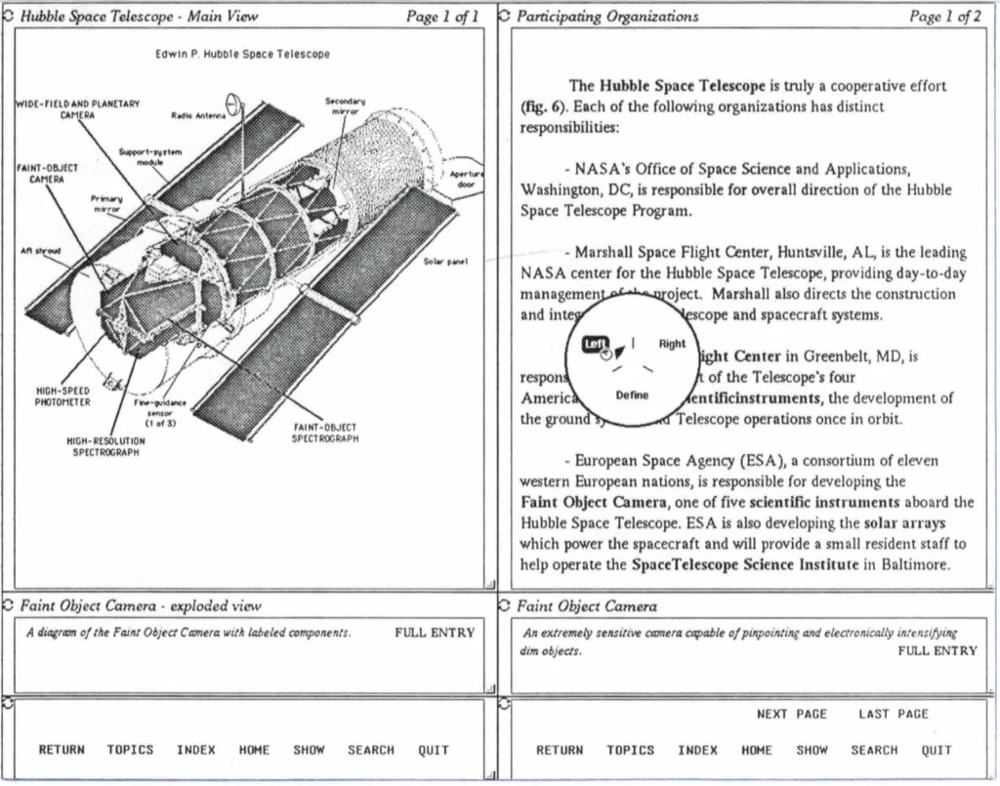

# HyperTIES: the Hacker News archive, distilled

Source: Don Hopkins, ["HyperTIES Discussions from Hacker News"](https://donhopkins.medium.com/hyperties-discussions-from-hacker-news-937d156f0330),
Medium, 13 January 2022. 74 minutes of reading. His own preface:

> I'm putting this lightly edited archive of a bunch of different discussions and email about
> HyperTIES, all together in one place here on Medium. Please forgive the rough wall of text and
> redundancy, but I haven't yet had time to distill it all down into one sentence.

This file is that distillation. Same material, sorted by claim, with the receipts attached and the
redundancy collapsed. The original stays canonical for anything not carried over.

---

## 1. The blue link

**The claim Ben makes, and the one he does not.** From his email to Don and John Gilmore,
13 April 2020, prompted by a question on the Internet History mailing list about the origin of the
word "hyperlink":

> I do not have a claim for the term "hyperlinks" and don't know when it came into use. **My claim is
> for the visual interface for showing highlighted selectable links embedded in paragraphs.** This is
> what we called embedded menu items...
>
> While Engelbart had shown a list that could be selected by pointing and clicking in 1968, **I claim
> the idea of embedded highlighted selectable text in paragraphs.**

Precise, narrow, and falsifiable. He disclaims the word and claims the interface.

**Why blue, and why not red.**

> My students conducted more than a dozen experiments (unpublished) on different ways of highlighting
> and selection using current screens, e.g. green screens only permitted, bold, underscore, blinking,
> and I think italic(???). When we had a color screen we tried different color highlighted links.
> **While red made the links easier to spot, user comprehension and recollection of the content
> declined.** We chose the light blue, which Tim adopted.

Don's gloss, which is the methodological point: *"Ben likes to actually run controlled experiments
and measure things like that, instead of just speculating!"*

**The transmission path to the web.**

> But Tim told me at the time that he was influenced by our design as he saw it in the **Hypertext on
> Hypertext** project that we used Hyperties to build for the July 1988 CACM that held the articles
> from the July 1987 Hypertext conference at the University of North Carolina. **The ACM sold 4000
> copies of our Hypertext on Hypertext disks.**

Berners-Lee's [Spring 1989 proposal](http://www.w3.org/History/1989/proposal.html) cites that
electronic journal as the source of the "hot spots" idea.

**The "No Blue Scotsman" exchange.** Elise Blanchard's Mozilla article argued HyperTIES was not the
first blue link because its links were cyan, not dark blue. Don's rebuttal — the joke is on *No True
Scotsman* — is that this is splitting hairs when the designer of the later system says he took it
from the earlier one, and Ben describes his own choice as "light blue," picked from a limited PC
palette, easier to read against black than dark blue. Blanchard's counter, which is fair and stands:
there is no direct evidence Eric Bina was looking at cyan when he coded Mosaic, and earlier Mosaic
betas used underlines rather than blue.

**Unresolved, and worth resolving:** the causal chain Ben → Tim is attested by both parties. The
chain Ben → Mosaic → the web's default stylesheet is not. Both can be true at once; the histories
are separate.

---

## 2. Definition previews: single click reads, double click goes

The feature this hub inherits most directly, and the one the web still does not have.

> In HyperTIES, single clicking on a hyperlink (either inline text or embedded graphical menus) would
> display a description of the link destination at the bottom of the screen, and double clicking
> would follow the link. **That gave users an easy way to get more information on a link without
> losing their context and navigating away from the page they were reading.**

And the structural fact that makes it work — **the definition was mandatory**:

> Each article had a short **required** "definition" so you could click on a link to show its
> definition in a pane and read it before deciding if you wanted to double click to follow the link
> or not, so you didn't have to lose your context to see where each link leads.

Every article carried an author-written abstract as a condition of existing. That is the
`title → abstract` rung of the semantic pyramid, made compulsory by the schema in 1988. The web
made it optional and therefore absent; gwern.net reconstructs it by hand as annotations; we intend
to generate it.

### The screenshot that settles it

Two complete browser windows side by side, from the Hubble Space Telescope database. Read it as a
specification, because every rung of the pyramid is visible at once:

- **Left window:** *Hubble Space Telescope — Main View, Page 1 of 1*, the labeled instrument diagram.
  Its definition pane below reads *"A diagram of the Faint Object Camera with labeled components"* —
  the abstract for `Faint Object Camera - exploded view`, a **graphical** target's definition.
- **Right window:** *Participating Organizations, Page 1 of 2*. The bold phrases in the prose —
  `Faint Object Camera`, `scientific instruments`, `solar arrays`, `SpaceTelescope Science Institute`
  — are embedded menus. This is the self-naming link case: the author wrote the sentence, and the
  phrase resolved against titles and synonyms.
- **Its definition pane:** *"An extremely sensitive camera capable of pinpointing and electronically
  intensifying dim objects."* The abstract for the link the cursor is on, shown **without navigating**.
- **`FULL ENTRY`** in both panes. The escalation control. The definition is a rung, and this is the
  button that goes down one.
- **The pie menu, open over the link:** slices for **Left**, **Right**, and **Define**.

That last item is the one worth staring at. The choice offered at the moment of following a link is
not *whether* to go, it is **where to put it** — this window, the other window, or just show me the
definition. Link routing as a directional gesture, in 1988. The hub's line about "same window, other
window, new window as a gesture" is not an extrapolation from pie menus in general; it is this
picture.

And the definition pane is not a tooltip. It is a persistent, titled, per-window pane with its own
escalation button — which is what makes gwern's popups-as-real-windows convergence more than an
aesthetic coincidence. Both systems concluded that the preview of a target needs the affordances of
a window, because readers do things with previews besides glance at them.

Don's 2015 proposal, still unimplemented anywhere:

> web browsers should also give users an option to enable double-click link navigation like
> HyperTIES, so a single click can display more information and actions related to the link without
> taking you away from your current context, and a double click navigates the link.

His argument against the objection that double-click would confuse people is worth keeping as
method: the person in the thread claiming links and directories are "distinct enough in most
people's minds" had, two comments earlier in the same thread, misremembered whether he
double-clicks on a Mac. *"Can you at least refer me to some empirical studies that support your
claim, please?"*

---

## 3. Click the background to reveal every link

> HyperTIES had a feature that you could click or press and hold on the page background, and it would
> blink or highlight **ALL** of the links on the page, either by inverting the brightness of text
> buttons, or by popping up all the cookie-cut-out picture targets (we called them "embedded menus")
> at the same time.

The published reasoning, from *Designing to Facilitate Browsing* (1991), is a genuine piece of
interaction design rather than a gimmick. The problem: arbitrarily-shaped graphical targets cannot
be self-naming the way link text is, so an image with hidden targets is a guessing game.
Requirements they set: unambiguously identify location and scope, do not interfere with comprehension
of the image, and demand little user effort.

Their answer was **pop-out** highlighting:

> it consists of offsetting the highlighted object vertically and horizontally by a small amount, and
> placing a drop-shadow beneath. This gives the appearance of having the object pop out of the
> screen; in addition, **the slight movement of the object makes it readily detectable to the eye.**

Then the observation that produced reveal-all:

> when confronted with an image with hidden targets, they tend to sweep across the image until a
> target is highlighted, or try to select what they think might be a target until one is found. This
> suggested that the system could highlight all of the targets automatically whenever it appears that
> the user is searching for targets, as when sweeping the display, **or clicking in non-target
> areas.** ... This technique was found effective and generally very well received by users.

A failed click is not an error. It is a request for the map. That is the design principle, and it
generalizes far past images.

Independent demand for the same feature, from a HyperCard veteran in the thread: *"One convention
that didn't make it to the web browser was having a key you could press to highlight which elements
were clickable. Lots of modern webapps could use that…"* Don's extension, which belongs in the
webtop spec:

> instead of "disabling" links and buttons and other elements so they are inexplicably useless, they
> should be dimmed but still enabled, so hovering or clicking on them immediately tells you **WHY**
> they're disabled, and **WHAT** you can do to enable them.

---

## 4. The stack: C, FORTH, PostScript, MockLisp

The workstation version, on a Sun running NeWS. Four languages, each doing what it was best at, and
two of them written by James Gosling before he wrote Java.

| Layer | Language | Job |
|---|---|---|
| Formatter | C | `fmt.c`, text and graphics layout |
| Markup interpreter, browser scripting | FORTH | HyperTIES Markup Language, storyboard compiler |
| Rendering, interaction, applets | NeWS PostScript | display lists, targets, pie menus, widgets |
| Authoring tool | UniPress Emacs MockLisp | YAHTITTIE — "Yet Another HyperTIES Implementation, This Time In Emacs" |

**The storyboard compiler**, which is the part worth stealing:

> it could even compile storyboards into FORTH words (one word per each storyboard) that it compiled
> and dumped out to a binary image, so it could start up and display **pre-formatted compiled pages**
> quickly (kind of like partial evaluation, and Smalltalk VM images).

His own verdict: *"That was probably a premature optimization (or maybe not, since a 4 meg Sun 3/50
was pretty slow), but that was just the kind of stuff FORTH is great for, and it was fun to write
FORTH code that wrote FORTH code that called C code that wrote PostScript code that wrote PostScript
code!"*

The FORTH was Mitch Bradley's Sun FORTH / Forthmacs, which could dynamically link and call C by
running the Unix linker to relocate a library into FORTH's memory — SunOS had no shared libraries
yet — and which later became **OpenFirmware** (IEEE 1275-1994, since withdrawn).

**On rejecting SGML.** Asked why the markup language looked so clean, Don:

> We considered using SGML, but decided not to, because **we wanted to focus on ease of use and
> writability and maintainability for hypermedia authors.**

It had macros and conditionals. And the later C rewrite added the thing that matters most:

> supported macros and conditionals and **shared definitions, kind of like style sheets (but using
> the same markup language, not one language for markup and another for style).**

One language for content and presentation. This is the direct ancestor of the "no CSS, style is
attributes" position in Declare, and the standing argument against the markup-plus-stylesheet split
the web took. It is also a receipt for Borretti's XML complaint from the other direction: they
looked at the strict extensible option and chose authorability.

**Embedded applets, years before Java:**

> you could script and configure reusable embedded NeWS "applets" in PostScript, like custom pie
> menus for font selection and other commands, text editors, user interface widgets, PostScript
> driven animations, interactive popup targets, buttons that sent commands to NeWS, Emacs, FORTH,
> the Unix shell, etc, not unlike Java applets or web components.

> It was no coincidence that the same guy who wrote Java (James Gosling) also wrote those two other
> languages we used: NeWS PostScript and UniPress Emacs MockLisp!

Pie menus were in the browser for navigation and link routing, and in the Emacs authoring tool
alongside tabs. Source and papers: [donhopkins.com/home/ties/doc/ties/](https://donhopkins.com/home/ties/doc/ties/).

---

## 5. HyperCard, and the browse/edit boundary

The thread's most transferable idea, and it is not about HyperTIES:

> While there was a debate at the time about whether HyperCard was truly "Hypertext" or a "User
> Interface Design Tool" or a "Personal Database" or just how to classify it, the much more important
> thing was that **it was not just a browser, but also an authoring tool, that enabled regular users
> to switch back and forth between browse mode and edit mode WHILE they were using it, and empowered
> users as authors.**
>
> This is in stark contrast with the other hypertext browsers, authoring tools, and user interface
> design tools of the time (the cutting edge of which was the NeXT Interface Builder), that made a
> distinction between "run time" and "design time".

The web inherited the wrong side of that line. Netscape and IE eventually shipped *"some shitty
half-assed WYSIWYG editing abilities that were sub-par, and produced terrible HTML, and couldn't be
applied to any web page."* Declare's Inspector — click a value, see its expression and live inputs,
edit in place — is the first thing in thirty years that puts the boundary back where HyperCard had
it.

The lineage that runs through this hub: HyperCard inspired **Arthur van Hoff** to build a
network-aware HyperCard in PostScript for NeWS — GoodNeWS, then HyperNeWS, then shipped as
**HyperLook**, which Don used to port SimCity to X11/NeWS. Van Hoff then wrote the Java compiler in
Java, built AWT, co-founded Marimba, and shipped **Bongo** — a HyperCard-like Java UI toolkit whose
distinguishing feature was editing and dynamically compiling event handlers *at runtime*, by calling
back into the compiler he had already written. Don's rule follows:

> Without the ability to dynamically edit scripts at runtime, you can't hold a candle to HyperCard,
> because **interactive scripting is an essential feature.**

Also collected there: the *Washington Apple Pi* newsletters from October 1987, capturing how loudly
people lost their minds over HyperCard in real time, and **LiveCard**, which served live interactive
HyperCard stacks over the web through MacHTTP/WebStar — arguably the first authoring tool with which
non-programmers and children published interactive web apps.

---

## 6. Pie menus and "self revealing"

Ted Nelson's term, which Don adopts as the precise description of what pie menus do:

> The term "intuitive" is stupid. Because, is a mouse "intuitive"? You look at it, and oooh, oooh,
> oooh. But the moment you see it work, it has revealed itself. So it's "self revealing", is the
> term. **Pac-Man** is another very nice example of a "self revealing" piece of software... Because
> you learn the rules within three quarters.

Ted credited the term to his supervisor at Datapoint. Don emailed to ask who that was; see
[`../nelson/README.md`](../nelson/README.md) for the reply.

The mechanism, from the 1991 *Dr. Dobb's* paper and the 2018 retrospective:

> Pie menus **either lead, follow, or get out of the way.** When you don't know them, they lead you.
> When you are familiar with them, they follow. And when you're really familiar with them, they get
> out of the way, you don't see them. Unless you stop.

> every time you select from a pie menu, you practice the motion to mark ahead, so you naturally
> learn to do it by feel! As Jaron Lanier has remarked, **"The mind may forget, but the body
> remembers."**

Original paper: Callahan, Hopkins, Weiser, Shneiderman, *An empirical comparison of pie vs. linear
menus*, ACM CHI '88, 95–100. Note the co-author: **Mark Weiser**, before ubiquitous computing.

Don's standing ask, still open, and the reason much of this archive exists:

> I would really like to finally and publicly make the case that **all web browsers and desktop user
> interfaces should natively support user definable pie menus,** just like HyperTIES did, and just
> like Blender does.

He has attended WebExtensions Community Group meetings to raise it. His own diagnosis of why it goes
nowhere: *"most of the people there are so busy with simply standardizing things that already exist,
that it's hard to get their attention."*

---

## 7. Touchscreens: the lift-off strategy

Adjacent HCIL work, included because it explains a persistent misattribution and because the
technique is in every phone.

Touchscreens in 1987 selected on first touch — "land-on" — so parallax and calibration errors made
them notorious, and interface textbooks asserted targets could not be smaller than a fingertip.
HyperTIES needed to select individual letters in an index. The **lift-off strategy**: draw a cursor
slightly above the finger, highlight what it is over, act on lift-off, and let the user slide to
correct first. *"Only the cursor position mattered for the selection, not the finger itself.
Selecting a single character was now possible."* Then time-dependent position averaging stabilized
the cursor down to roughly 1mm² targets, matching a mouse.

Ben's actual statement is *"the iPhone uses a lift-off strategy"* — not that he invented the iPhone
keyboard, which is how it has been misquoted. Separately, HCIL's 1990 touchscreen toggle work
(Plaisant and Wallace, push-versus-slide) has been cited as prior art against Apple's "Slide to
Unlock" patents. Apple sponsored HCIL from 1988 to 1993; Jobs visited in 1988.

---

## 8. Demos, and Steve Jobs

Educom, October 1988. A Sun workstation on the show floor, rotating demos of NeWS, pie menus, Emacs
and HyperTIES to passers-by.

> That was when Steve Jobs came by, saw the demo, and jumped up and down shouting **"That sucks!
> That sucks! Wow, that's neat. That sucks!"**

The Hubble Space Telescope database had pop-out targets on every instrument. The other demo was a
photo of Sun's three founders whose heads popped out when pointed at, all at once when you clicked
the background — *"Kind of like what they call 'Big Head Mode' these days."*

> The best part of the demo was when I demonstrated popping up all the heads of the Sun founders at
> once, by holding the optical mouse up to my mouth, and blowing and sucking into the mouse while
> secretly pressing and releasing the button, so it looked like I was inflating their heads!

And the man who hung around through several loops:

> by the time I got back around to the Emacs demo, he finally said "Hey, I used to use Emacs on ITS!"
> I said "Wow cool! So did I! What's was your user name?" and he said **"WNJ"**.
>
> It turns out that I had been giving an Emacs demo to Bill Joy all that time, then popping his head
> up and down by blowing and sucking into a Sun optical mouse, without even recognizing him, because
> he had shaved his beard!

---

## 9. Manual transclusion, and why this hub exists

Asked how he assembles these posts, Don gave the answer that is the whole thesis of the webtop. The
mundane version first — HN search, Google site search, copy and paste, manually expanding the links
HN truncates with "…", and replacing dead links with Internet Archive URLs. Then:

> I think of what I try to do as **manually implementing** Ted Nelson's, Ivan Sutherland's, Douglas
> Engelbart's, and Ben Shneiderman's important ideas about "transclusion".

> I err on the side of transcluding relevant text that I and other people have posted before, instead
> of just linking to it, because often the links need to be updated or get lost over time, it's
> clumsy to link into the middle of a page, **there's no way to indicate the end of the relevant
> excerpt**, and I can leave out the redundant stuff.

> Following links is distracting and costly, so most people aren't going to click on a bunch of
> inline links, read something, then come back, re-establish their context, and keep on reading from
> where they left off... So I aspire to simulate Ted Nelson's and other people's ideals with **the
> crude stone knives and bearskins that we're stuck with today.**

And the irony he names himself:

> It's ironic that the web is still so primitive that I had to perform a lot of transclusion myself
> by hand in order to explain the idea of Transclusion that has been around so long, which Ted Nelson
> has always thought should be built in and automatic, **not something you have to do laboriously by
> hand.**

Two things follow directly, and they are the load-bearing requirements of this whole design pack.

**The definition preview is the fix for the cost of following a link.** Not a nicety. The reason
people do not follow links is that losing and re-establishing context is expensive, so authors
compensate by transcluding by hand, which is also expensive and does not stay correct. Give the
reader the abstract without the navigation and the economics change.

**"There's no way to indicate the end of the relevant excerpt"** is a specification. Transclusion
needs a span, not a point — a stable start *and* end anchor. Every link in this hub that quotes a
source is currently a hand-copied span with no machine-checkable relationship to its origin. That is
the debt Borretti warns about, and the only real cure is addressable spans.

---

## What to take, in one page

| From HyperTIES | Into the webtop |
|---|---|
| Mandatory per-article definition | The abstract rung of the pyramid, required by schema, generated when absent |
| Single click reads, double click goes | Read the target without paying navigation cost |
| Click background, reveal all targets | A failed click is a request for the map |
| Pop-out highlight with drop-shadow | Motion as the cheapest possible "this is live" signal |
| Dimmed-but-enabled instead of disabled | Clicking a dead control must explain why it is dead |
| One markup language for content *and* shared definitions | No second language for style |
| Authorability chosen over SGML strictness | Optimize for the writer, not the validator |
| Storyboards compiled to FORTH words, dumped as an image | Precompile the pyramid rungs; partial evaluation of a page |
| Scriptable embedded applets | Live objects in the page, not sandboxed foreigners |
| Pie menus for link routing | Same, other, or new window as a gesture |
| Browse/edit as a toggle, not two programs | The Inspector belongs in the reader |
| Controlled experiments before defaults | Do not ship an interaction claim you have not measured |

↑ [hyperties](README.md) · [team](TEAM.md) · [webtop hub](../README.md)
