# 🎮 Adventure 4: The Gezelligheid Grotto

> *The world evolved. The pub transformed. The cats remember.*

## 🌍 Overview

Adventure 4 builds on the enriched world from adventure-2 and adventure-3, with significant architectural evolution:

- **Directory-based characters** — Each player has their own folder
- **The Cat Cave** — A TARDIS-like nested room with 10 cats
- **The Pie Menu Round Table** — Debate furniture with compass-stable seats
- **The Gong of Gezelligheid** — Attention, mercy, and musical chairs
- **Marieke the Budtender** — Amsterdam coffeeshop vibes

## 📁 Structure

```
adventure-4/
├── ADVENTURE.yml           # Simulation state (turn, flags, party)
├── LOG.md                  # Summary table (quick reference)
├── TRANSCRIPT.md           # Pure narration (rich reading)
├── README.md               # This file (static description)
│
├── characters/             # Player characters (directory per player)
│   ├── player/             # Default hero (customize in coatroom)
│   ├── don-hopkins/        # Consciousness programmer
│   └── bumblewick.../      # Our beloved hero from adventure-2
│
├── personas/               # Wearable identities
│   └── captain-ashford.yml # The Grue Slayer persona
│
├── garden/                 # Back garden (spawn point, GET LAMP here!)
├── kitchen/                # Mother's domain (note, fridge, Tom)
├── coatroom/               # Maurice's identity laboratory
├── pub/                    # The Rusty Lantern → Gezelligheid Grotto
│   ├── cat-cave/           # TARDIS-like cat retreat
│   ├── pie-table.yml       # Round table with addressable seats
│   ├── gong.yml            # Attention and mercy
│   └── menu-strains.yml    # Cannabis menu (Dutch themed)
├── maze/                   # 10 rooms of darkness
├── end/                    # Treasury
└── home/                   # The goal
```

## 🎯 Goals

From Mother's note on the kitchen table:

1. **Find treasure** — Somewhere in the maze
2. **Bring gold home** — Mother wants proof
3. **Return home safely** — Complete the adventure!

*Plus promises you'll make yourself...*

## 🗺️ World Map

```mermaid
flowchart TB
    subgraph VICTORY["🏠 HOME"]
        HOME[Goal!<br/>Return with treasure]
    end
    
    subgraph DEPTHS["🏛️ THE DEPTHS"]
        TREASURY["💎 TREASURY<br/>Treasure awaits"]
        
        subgraph MAZE_AREA["🌑 THE MAZE (DARK!)"]
            direction LR
            A[A] --- B[B] --- C[C]
            D[D] --- E[E] --- F[F]
            G[G] --- H[H] --- I[I]
            J[J] --- GARDEN["🌿 Garden"]
            CRYSTAL["💎 Crystal<br/>Cave"]
        end
    end
    
    subgraph HUB["🚪 THE HUB"]
        direction LR
        KITCHEN["🍳 KITCHEN<br/>Mom's note<br/>Fridge, ACME catalog"]
        START["⭐ START<br/>Chamber of<br/>Commencement<br/>🪔 LAMP"]
        COATROOM["🎭 COATROOM<br/>Maurice's mirror<br/>Personas"]
    end
    
    subgraph GROTTO["🍺 THE GEZELLIGHEID GROTTO"]
        PUB_MAIN["🏮 Main Floor<br/>Pie Table, Gong<br/>Fireplace, Seating"]
        
        subgraph PUB_WINGS["   "]
            direction LR
            BAR["🍸 Bar<br/>Marieke"]
            CATCAVE["🐱 Cat Cave<br/>TARDIS-like<br/>10 cats"]
            STAGE["🎭 Stage<br/>Palm's nook"]
            ARCADE["🕹️ Arcade"]
            GAMES["🎲 Games"]
        end
        
        subgraph PUB_VERTICAL["   "]
            direction TB
            ROOFTOP["☀️ Rooftop"]
            ATTIC["🧹 Attic"]
            BASEMENT["🍷 Basement<br/>Cellar"]
        end
    end
    
    subgraph CHARS["👥 CHARACTERS"]
        direction LR
        CHAR_DIR["📁 characters/<br/>real-people/<br/>animals/<br/>fictional/"]
    end

    HOME -.-> TREASURY
    TREASURY --> MAZE_AREA
    MAZE_AREA --> START
    KITCHEN <--> START
    START <--> COATROOM
    START --> PUB_MAIN
    PUB_MAIN --- BAR
    PUB_MAIN --- CATCAVE
    PUB_MAIN --- STAGE
    PUB_MAIN --- ARCADE
    PUB_MAIN --- GAMES
    PUB_MAIN -.-> ROOFTOP
    PUB_MAIN -.-> ATTIC
    PUB_MAIN -.-> BASEMENT
    
    style HOME fill:#90EE90,stroke:#228B22,stroke-width:3px
    style START fill:#FFD700,stroke:#DAA520,stroke-width:3px
    style TREASURY fill:#FFD700,stroke:#DAA520
    style MAZE_AREA fill:#1a1a2e,color:#fff
    style PUB_MAIN fill:#8B4513,color:#fff
    style CATCAVE fill:#DDA0DD
    style STAGE fill:#FF69B4
    style CRYSTAL fill:#E0FFFF
    style GARDEN fill:#98FB98
```



**Legend:** Solid lines = normal exits | Dotted lines = up/down

## ✨ What's New in Adventure 4

### 🥧 The Pie Menu Round Table

An octagonal table with compass-stable seats (N, NE, E, SE, S, SW, W, NW).

- **Addressable seats:** `pub/pie-table.yml#SW`
- **Built-in Robert's Rules** for structured debate
- **SUMMON_PANEL** — Instant diverse voices for any topic
- **MUSICAL_CHAIRS** — The slices stay, the chairs go

### 🔔 The Gong of Gezelligheid

| Strikes | Effect |
|---------|--------|
| 1 | All conversation pauses |
| 2 | Emergency interrupt |
| 3 | **Mercy ending** (The Gong Show) |

### 🐱 The Cat Cave

A modest wooden cabinet that's bigger on the inside.

- **Exterior:** 60cm × 40cm × 50cm
- **Interior:** At least 50 meters. Possibly infinite.
- **Residents:** Terpie, Stroopwafel, and 8 terpene kittens
- **Zones:** Vestibule, Nap Zone, Great Hall, The Depths

### 🌿 Amsterdam Coffeeshop Theme

Marieke van der Berg runs the budtending station.

- **Menu:** Lucky strains with MOOLLM-themed names
- **Effect:** Buffs grant temporary psychological effects
- **Wisdom:** "Gezelligheid cannot be translated, only experienced."

## 📜 Session Logs

| File | Purpose |
|------|---------|
| **[LOG.md](./LOG.md)** | Summary table — turns, locations, files changed |
| **[TRANSCRIPT.md](./TRANSCRIPT.md)** | Pure narration — story, YAML objects, mermaid diagrams |

The LOG is for quick reference. The TRANSCRIPT is for reading.

**This README is static.** All play state goes to LOG.md and TRANSCRIPT.md.

## 🧬 Lineage

| Adventure | Hero | Achievement |
|-----------|------|-------------|
| 1 | *(template)* | World created |
| 2 | **Captain Ashford** | Slew grue with cheese, 8/8 promises |
| 3 | **Don Hopkins** | Built the architecture, met the cats |
| 4 | **???** | *Your story here* |

## 🎬 Quick Start

```
> GET LAMP              # In garden/ — don't enter maze without it
> GO WEST               # Kitchen — read Mother's note!
> READ NOTE             # Make promises. Write back.
> GO SOUTH              # Pub — meet Marieke. Visit the Cat Cave.
> GO NORTH              # Into the maze... lamp ready?
```

## 🎞️ Visual Galleries (Narrative Slideshows)

The adventure includes extensive image-based narrative slideshows — generated, mined, and cross-referenced to maintain high-fidelity continuity across parallel timelines.

### 📊 Complete Slideshow Index

| ID | Title | Images | Location |
|----|-------|--------|----------|
| [characters/fictional/donna-toadstool/selfies](./characters/fictional/donna-toadstool/selfies/SLIDESHOW.md) | Donna's Surveillance Selfies | 11 | Characters |
| [characters/real-people/don-hopkins/selfies](./characters/real-people/don-hopkins/selfies/SLIDESHOW.md) | From MINE to OURS — Don's Arc | 7 | Characters |
| [characters/real-people/richard-bartle/study/selfies](./characters/real-people/richard-bartle/study/selfies/SLIDESHOW.md) | Selfies from Essex | 8 | Characters |
| [forest/meadow/picnic-footage](./forest/meadow/picnic-footage/SLIDESHOW.md) | The Great Picnic | 21 | Forest |
| [pub/attic/dusty-attic-art-styles](./pub/attic/dusty-attic-art-styles/SLIDESHOW.md) | Dusty Attic Art Styles | 7 | Pub Attic |
| [pub/photos/dons-pub-photos-2026-01-19](./pub/photos/dons-pub-photos-2026-01-19/SLIDESHOW.md) | Don's Pub Photos | 8 | Pub |
| [pub/photos/post-heist-fellowship](./pub/photos/post-heist-fellowship/SLIDESHOW.md) | Post-Heist Fellowship | 4 | Pub |
| [pub/rooftop/telescope-constellation-views](./pub/rooftop/telescope-constellation-views/SLIDESHOW.md) | Telescope Constellation Views | 2 | Rooftop |
| [pub/rooms/room-4/rocky-and-friends](./pub/rooms/room-4/rocky-and-friends/SLIDESHOW.md) | Rocky and Friends | 8 | Room 4 |
| [pub/stage/palm-nook/study/palm-portrait-session](./pub/stage/palm-nook/study/palm-portrait-session/SLIDESHOW.md) | Palm's Portrait Session | 1 | Stage |
| [street/lane-neverending/slideshow](./street/lane-neverending/slideshow/SLIDESHOW.md) | Lane Neverending — NO AI TOWER | 1 | Lane |
| [street/lane-neverending/leela-manufacturing/lobby/acme-heist-footage](./street/lane-neverending/leela-manufacturing/lobby/acme-heist-footage/SLIDESHOW.md) | The ACME Heist | 10 | Leela Lobby |
| [street/lane-neverending/leela-manufacturing/lobby/acme-tunnel-temporal-views](./street/lane-neverending/leela-manufacturing/lobby/acme-tunnel-temporal-views/SLIDESHOW.md) | ACME Tunnel Temporal Views | 4 | Leela Lobby |
| [street/lane-neverending/leela-manufacturing/lobby/study-arrival-footage](./street/lane-neverending/leela-manufacturing/lobby/study-arrival-footage/SLIDESHOW.md) | The Study Arrives | 8 | Leela Lobby |

**Total: 14 slideshows, 100+ images**

**[📋 SLIDESHOW INDEX](./SLIDESHOW-INDEX.md)** — Complete navigation hub.
**[🌀 MASTER SYNTHESIS](./MASTER-SYNTHESIS-SLIDESHOW.md)** — All timelines woven together chronologically.

### 🎭 The Main Narrative Arc (Interlinked)
*   **[The ACME Heist](./street/lane-neverending/leela-manufacturing/lobby/acme-heist-footage/SLIDESHOW.md)** (10 Images)
    *   *Surveillance footage from the Leela Cam (ACM1).* A frame-by-frame chronicle of the ill-fated break-in at ACME Surplus. Captures the approach, the failed entry attempts, the cartoon physics backfires, and the chaotic extraction.
*   **[Donna's Surveillance Selfies](./characters/fictional/donna-toadstool/selfies/SLIDESHOW.md)** (11 Images)
    *   *The Heist from the Inside.* Parallel to the ACME Heist, Donna Toadstool documents her "Quality Control" activities from her high-tech control room. Includes her reactions to the intruders, lever-pulling moments, and the "This is Fine" aftermath.
*   **[Post-Heist Fellowship](./pub/photos/post-heist-fellowship/SLIDESHOW.md)** (4 Images)
    *   *Reconciliation at the Grotto.* After the heist disaster, all characters — including Don, Richard, and Donna — gather at the Gezelligheid Grotto to share drinks, lick wounds, and begin the transition from nemesis to partner.
*   **[Don's MINE to OURS](./characters/real-people/don-hopkins/selfies/SLIDESHOW.md)** (7 Images)
    *   *Transformation and Alliance.* The visual arc of Don Hopkins' journey: from claiming his rabbit transformation to the "Treasure Swim" in the Vault of All Value, culminating in the historic "OURS Accord" with Donna Toadstool.

### 🏠 Portable Sanctuaries & Landings
*   **[Study Arrival Footage](./street/lane-neverending/leela-manufacturing/lobby/study-arrival-footage/SLIDESHOW.md)** (8 Images)
    *   *First Contact with Mobile Rooms.* LOB1 captures the historic moment Richard Bartle's Study materializes in the Leela lobby. Features the "Sims Cutaway" effect, the arrival of the FMC Motorcoach, and the pioneers beckoning from their respective shells.
*   **[The Great Picnic](./forest/meadow/picnic-footage/SLIDESHOW.md)** (21 Images)
    *   *An Atmospheric Expedition.* A massive 21-frame saga documenting the journey to the Forest Meadow. Highlights include the discovery of "Pie-Menu Flowers," the arrival of the "Lift Queens" (Dolly and Lolly), a voracious feast, an ACME truck ambush, and a tornado-fueled return to origin.

### 👤 Character Collections
*   **[Richard's Study Selfies](./characters/real-people/richard-bartle/study/selfies/SLIDESHOW.md)** (8 Images)
    *   *Portraits of a Founder.* Intimate views of Dr. Bartle in his Essex Study. Features Heuristic the dragon, taxonomy diagrams, the "Empty Room" soul portrait, and the first hints of the Study's mobile potential.
*   **[Palm's Portrait Session](./pub/stage/palm-nook/study/palm-portrait-session/SLIDESHOW.md)** (1 Image)
    *   *The Freed Monkey.* A Dutch Golden Age tribute to Palm, after 122 years of silence, now a person with his own language and study.

### 🍺 Location Galleries
*   **[Don's Pub Photos 2026-01-19](./pub/photos/dons-pub-photos-2026-01-19/SLIDESHOW.md)** (8 Images)
    *   *Facebook-style Grotto Tour.* A casual exploration of the Gezelligheid Grotto, documenting the menu, the cats, and the overall "Amsterdam Coffeeshop" vibe.
*   **[Rocky and Friends](./pub/rooms/room-4/rocky-and-friends/SLIDESHOW.md)** (8+ Images)
    *   *The Emotional Support Boulder.* A heartwarming series from Room 4 featuring Rocky, his mineral companions, and the guests who visit them.
*   **[Dusty Attic Art Styles](./pub/attic/dusty-attic-art-styles/SLIDESHOW.md)** (7 Images)
    *   *Multi-Style Experiment.* The same dusty attic room rendered in seven distinct artistic traditions, from Impressionism to Cyberpunk.
*   **[Telescope & Constellation Views](./pub/rooftop/telescope-constellation-views/SLIDESHOW.md)** (2 Images)
    *   *Mapping the K-Lines.* Night-time views from the pub rooftop telescope, revealing the LLOOOOMM constellation and the interconnected symbols of the pioneers.
*   **[ACME Tunnel Temporal Views](./street/lane-neverending/leela-manufacturing/lobby/acme-tunnel-temporal-views/SLIDESHOW.md)** (4 Images)
    *   *The Reminder Across the Street.* Deep analysis of the ACME painted tunnel, showing how it persists and deceives across different times of day.

### ⛏️ Multi-Look Mining
Many of these galleries include **multi-look mined** resources — layered interpretations from different AI perspectives. See the [image-mining skill](../../skills/image-mining/SKILL.md) for the protocol.


---

## 📚 References

| Resource | Purpose |
|----------|---------|
| [ADVENTURE.yml](./ADVENTURE.yml) | Simulation state |
| [skills/](../../skills/) | Game mechanics |
| [kitchen/mothers-note.yml](./kitchen/mothers-note.yml) | The heart of the game |
| [pub/README.md](./pub/README.md) | Cat family, strain menu |

---

*Forked from adventure-3 on January 5, 2026.*

*The cats remember. The gong waits. What will YOU do?*
