# 📜 Adventure Transcript

> *Pure narration of your journey. [Date TBD].*
>
> For the summary table, see **[LOG.md](./LOG.md)**.

---

## Awakening

_Your story begins..._

---

## The Chamber of Commencement

*You are in [start/](./start/) — the Chamber of Commencement.*

```mermaid
graph TD
    START[Chamber of Commencement]
    START -->|NORTH| MAZE[🔦 The Maze<br/>Darkness. Grue. TEST.]
    START -->|SOUTH| PUB[🍺 The Rusty Lantern<br/>Social hub]
    START -->|WEST| KITCHEN[🍳 Kitchen<br/>Mother's note. TOM.]
    START -->|EAST| COAT[🎭 Coatroom<br/>Maurice. Costumes.]
    START -->|UP| HOME[🏠 Home<br/>The END goal]
```



---

## Current State

```yaml
player:
  id: player
  name: "The Hero"
  location: start/
  home: characters/player/
  
  gold: 50
  moves: 0
  
  inventory: []
    
  buffs: []
        
  goals:
    find_treasure: pending
    bring_gold_home: pending
    return_home_safely: pending
```

---

*Your story awaits...*
