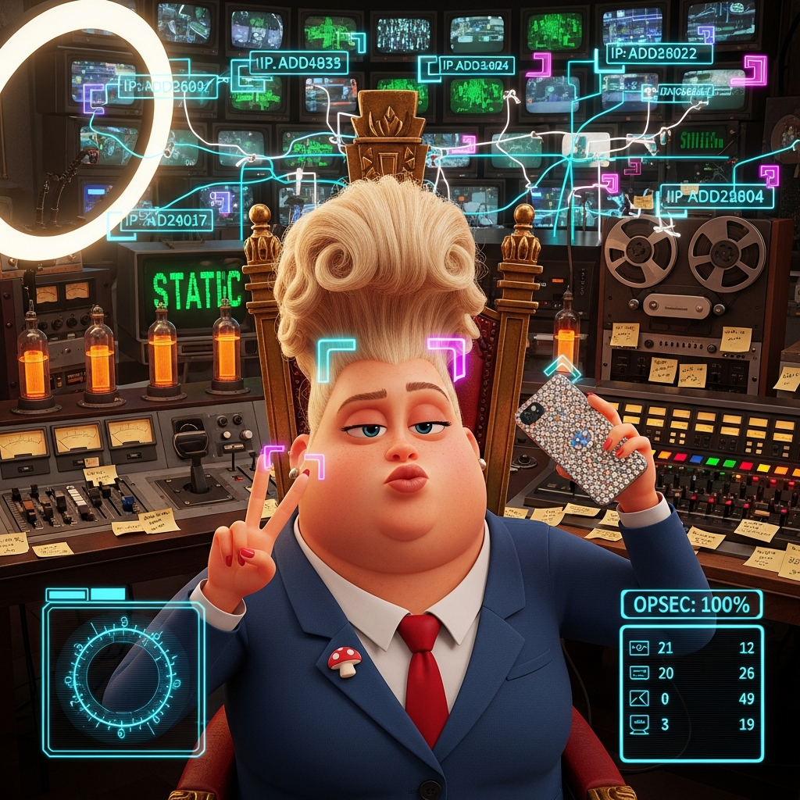
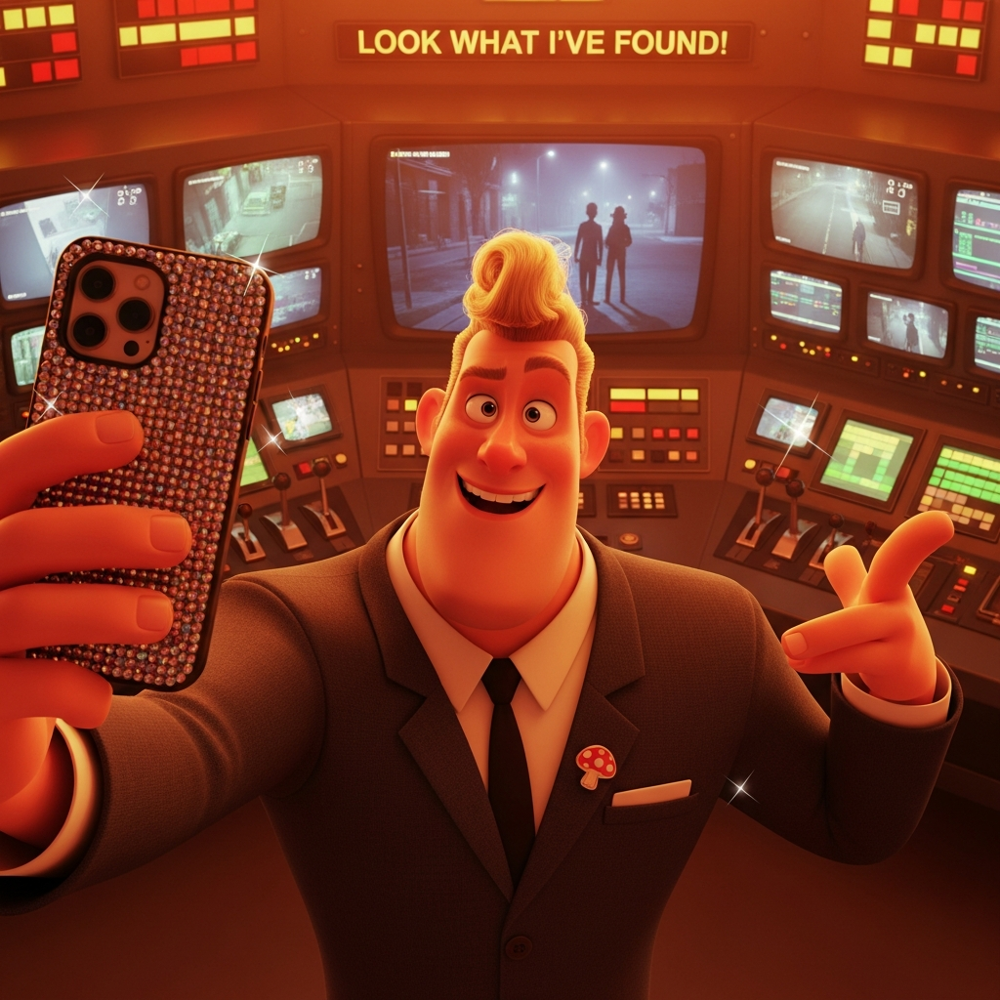
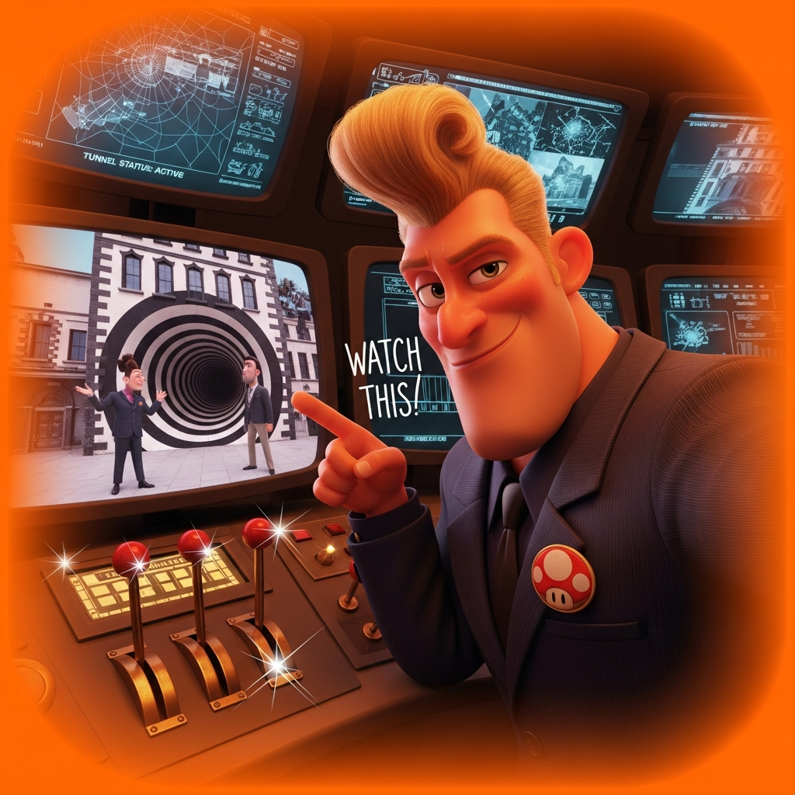
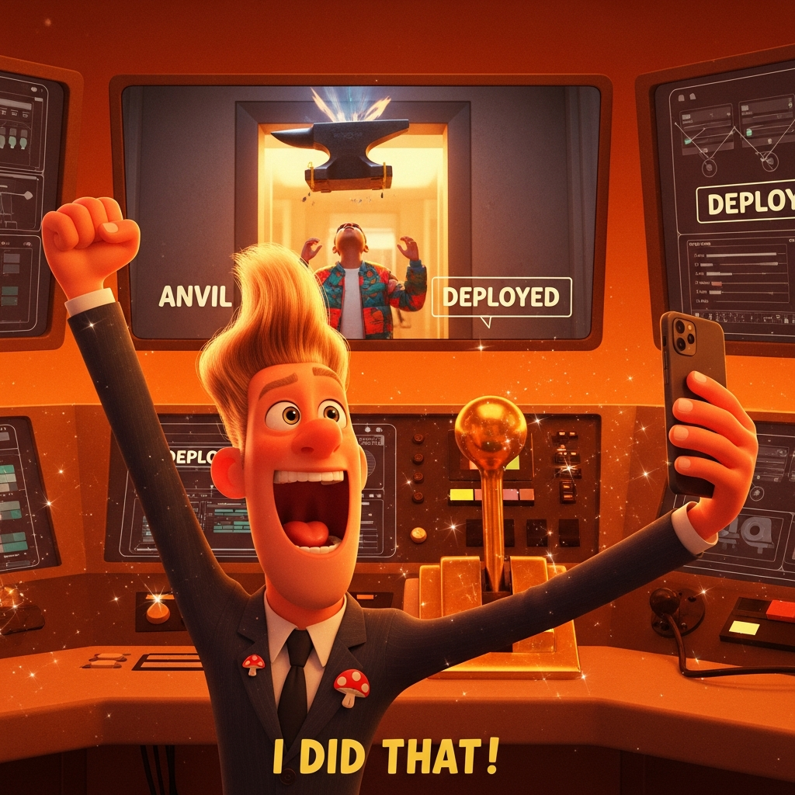
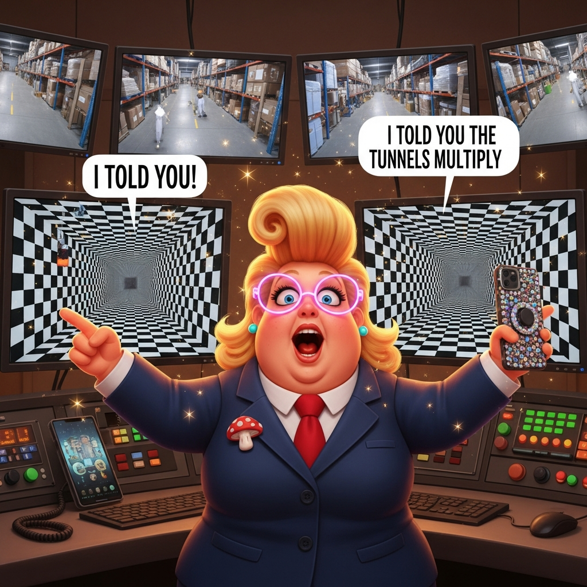
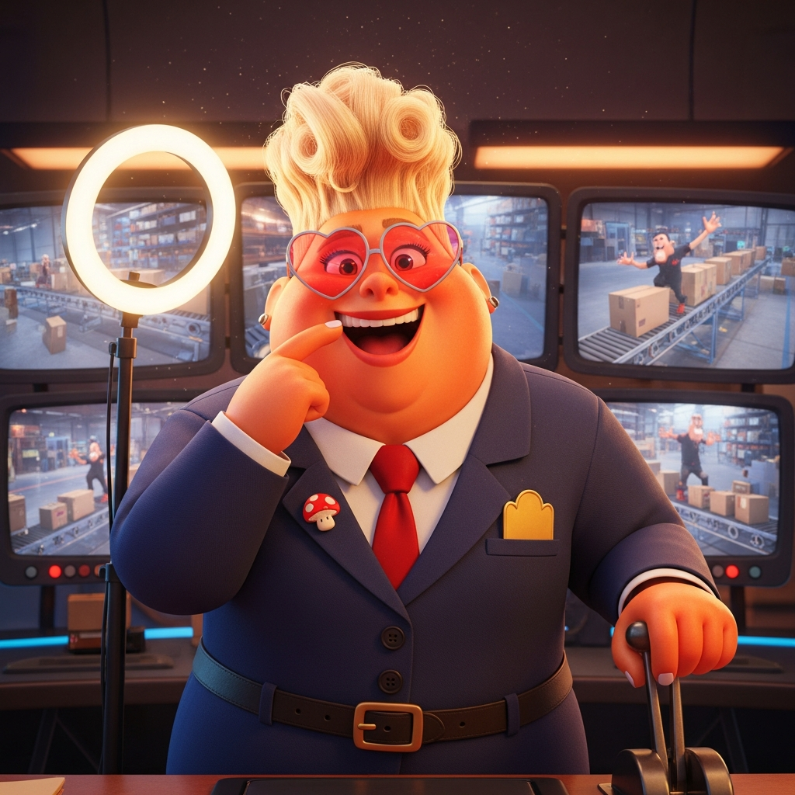
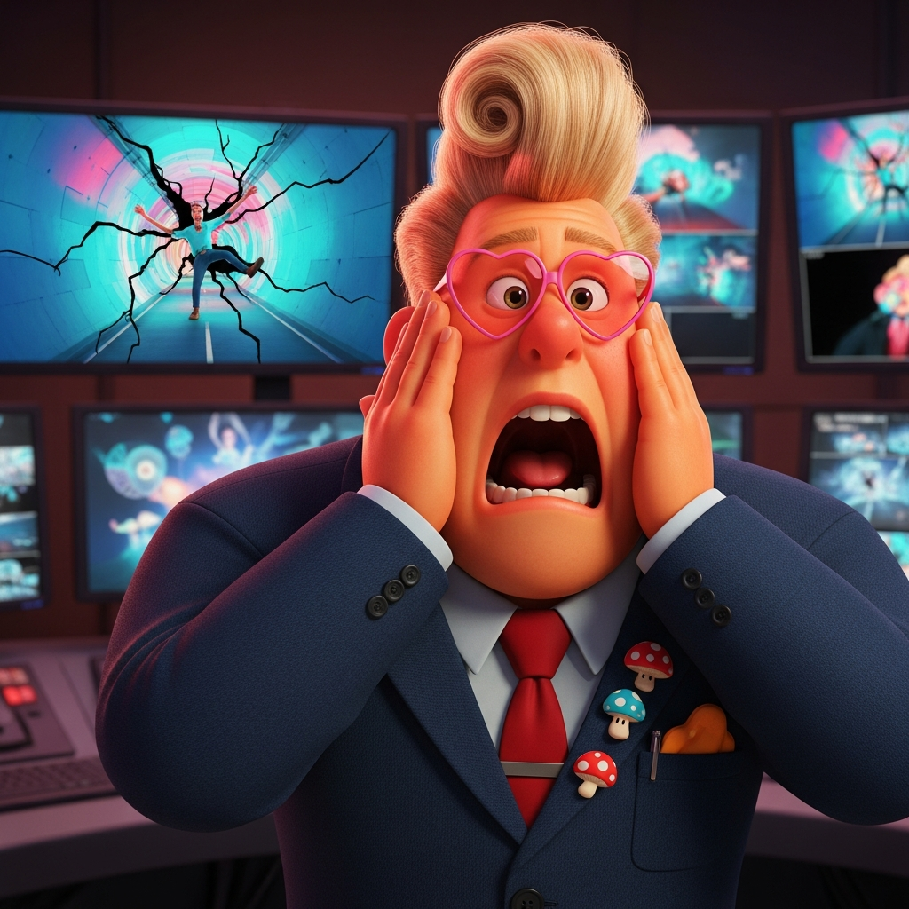
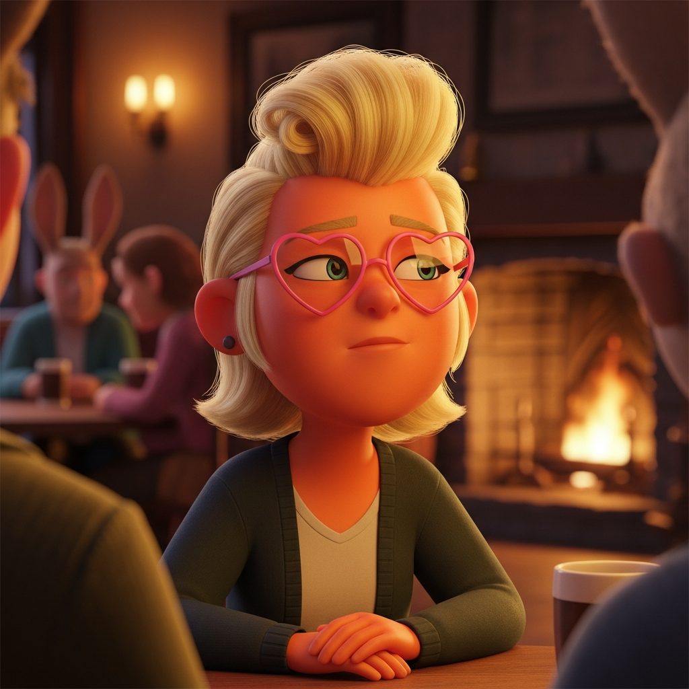

# 🍄📸 Donna's Surveillance Selfies

> *"If it's BEAUTIFUL it deserves to be SEEN. If it's CLASSIFIED it's probably INTERESTING."*

Eleven selfies documenting the ACME heist from the inside — through the eyes (and phone) of the security officer who orchestrated everything. Every trap. Every moment. Every OPSEC violation.

**Camera App**: SELFIE_SPY.exe v34.0 (custom filter)

---

## 🔗 Parallel Timeline

This series runs PARALLEL to:
- **[The ACME Heist Footage](../../../../street/lane-neverending/leela-manufacturing/lobby/acme-heist-footage/SLIDESHOW.md)** — What Donna was watching
- **[Don's MINE to OURS Arc](../../../real-people/don-hopkins/selfies/SLIDESHOW.md)** — The continuation
- **[MASTER SYNTHESIS](../../../../MASTER-SYNTHESIS-SLIDESHOW.md)** — Both timelines interleaved

**Sync Points**: Each selfie documents Donna's reaction to a specific heist frame.

---

## 📍 Selfie 0: The OPSEC Disaster (Pre-Heist)

### *"OPSEC: 100%"* — She thinks this is GOOD.

**Time**: ~03:47 AM (before the heist)  
**Location**: ACME Basement Control Room

**The Legendary Selfie**: 847 likes. 234 shares. Banned from Leela in 28 minutes.

**What She Exposed**:
- Full monitor array (40+ screens)
- IP addresses floating as AR tags
- Network topology lines
- Equipment counts
- THE THRONE (ornate gold chair)

**Her Response**: "FINE. I deleted it. But 847 likes. That's called ENGAGEMENT."

📎 **Files**: [Mining](opsec-disaster-2026-01-22-imagen4-mine.yml)

---

## 📍 Selfie 1: Intruder Alert

### *"LOOK WHAT I'VE FOUND!"*

**Syncs With**: [Heist Frame 01 — The Approach](../../../../street/lane-neverending/leela-manufacturing/lobby/acme-heist-footage/SLIDESHOW.md#frame-01)

**The Moment**: Two figures appear on the monitors. Don and the instigator approaching ACME. Donna's eyes light up.

**Emergent Caption**: The image generated "LOOK WHAT I'VE FOUND!" — Donna's first self-captioning selfie.

📎 **Files**: [Mining](selfie-01-intruder-alert-imagen4-mine.yml)

---

## 📍 Selfie 2: Tunnel Watch

### *"WATCH THIS!"*

**Syncs With**: [Heist Frame 02 — Chekhov's Tunnel](../../../../street/lane-neverending/leela-manufacturing/lobby/acme-heist-footage/SLIDESHOW.md#frame-02)

**The Reveal**: "TUNNEL STATUS: ACTIVE" — the tunnels are a CONTROLLABLE SYSTEM. Donna has brass levers.

📎 **Files**: [Mining](selfie-02-tunnel-watch-imagen4-mine.yml)

---

## 📍 Selfie 3: Anvil Deployed

### *"I DID THAT!"*

**Syncs With**: [Heist Frame 03 — The Entry](../../../../street/lane-neverending/leela-manufacturing/lobby/acme-heist-footage/SLIDESHOW.md#frame-03)

**Self-Incrimination**: Donna takes credit for the anvil drop. Double mushroom pins appear.

📎 **Files**: [Mining](selfie-03-anvil-deployed-imagen4-mine.yml)

---

## 📍 Selfie 4: Tunnels Multiply

### *"I TOLD YOU! I TOLD YOU THE TUNNELS MULTIPLY!"*

**Syncs With**: [Heist Frame 04 — Inside](../../../../street/lane-neverending/leela-manufacturing/lobby/acme-heist-footage/SLIDESHOW.md#frame-04)

**Major Evolution**: 
- TWO speech bubbles (first time)
- PINK HEART GLASSES appear (signature)
- Both tunnel monitors visible

📎 **Files**: [Mining](selfie-04-tunnels-multiply-imagen4-mine.yml)

---

## 📍 Selfie 5: Conveyor Chaos

**Syncs With**: [Heist Frame 05 — Deeper](../../../../street/lane-neverending/leela-manufacturing/lobby/acme-heist-footage/SLIDESHOW.md#frame-05)

**Hand on the Lever**: Donna is CONDUCTING this chaos. Pink glasses continuous.

📎 **Files**: [Mining](selfie-05-conveyor-chaos-imagen4-mine.yml)

---

## 📍 Selfie 6: Propulsion Success

**Syncs With**: [Heist Frame 06 — The Sprint](../../../../street/lane-neverending/leela-manufacturing/lobby/acme-heist-footage/SLIDESHOW.md#frame-06)

**Peak Triumph**: Chef's kiss gesture. Fist pump with sparkle trail. ROCKET LAUNCHES on monitors.

📎 **Files**: [Mining](selfie-06-propulsion-success-imagen4-mine.yml)

---

## 📍 Selfie 7: THWACK Moment

**Syncs With**: [Heist Frame 07 — Extraction](../../../../street/lane-neverending/leela-manufacturing/lobby/acme-heist-footage/SLIDESHOW.md#frame-07)

**Home Alone Face**: Hands on cheeks, shock/delight at Don hitting the painted tunnel. THREE mushroom pins.

📎 **Files**: [Mining](selfie-07-thwack-moment-imagen4-mine.yml)

---

## 📍 Selfie 8: Aftermath Gloat

**Syncs With**: [Heist Frame 08 — The Fire](../../../../street/lane-neverending/leela-manufacturing/lobby/acme-heist-footage/SLIDESHOW.md#frame-08)

**Total Victory**: Double peace signs. Fire on ALL monitors. FOUR+ mushroom pins. Completely unbothered by catastrophe.

📎 **Files**: [Mining](selfie-08-aftermath-gloat-imagen4-mine.yml)

---

## 📍 Selfie 9: This is Fine

**Syncs With**: [Heist Frames 09-10 — Richard's Catastrophe](../../../../street/lane-neverending/leela-manufacturing/lobby/acme-heist-footage/SLIDESHOW.md#frame-10)

**The Meme Made Manifest**: Donna sipping coffee while monitors show Richard consumed by tunnel vortex and Don as full rabbit. "This is fine."

📎 **Files**: [Mining](selfie-09-this-is-fine-imagen4-mine.yml)

---

## 📍 Selfie 10: The Denouement

**Location**: The Neverending Arms (post-heist)

**The Private One**: This selfie Donna doesn't post. Glasses still on but expression GENUINE. Cardigan replaces suit. Contemplative, not performing. Rabbit ears visible in background.

**The Moment She Was "Seen"**: Richard called her "weather." She accepted it.

→ **Continues in**: [Don's MINE to OURS Selfies](../../../real-people/don-hopkins/selfies/SLIDESHOW.md) — where she tunnels into his treasure vault

📎 **Files**: [Mining](selfie-10-denouement-imagen4-mine.yml)

---

## Accessory Progression

| Selfie | Mushroom Pins | Pink Glasses | Caption Style |
|--------|---------------|--------------|---------------|
| 00 | 1 | No | HUD only |
| 01-03 | 1 | No | Text captions |
| 04+ | 1+ | YES | Dual captions |
| 06 | 2 | Yes | Visual peak |
| 07 | 3 | Yes | Home Alone |
| 08 | 4+ | Yes | Victory |
| 09 | Many | Yes | Transcendence |
| 10 | Few | Yes | Genuine |

---

## The Heisenbergian Gender Fluidity

> *See [GENDER-FLUIDITY-REFLECTION.md](../GENDER-FLUIDITY-REFLECTION.md)*

Across 11 renders, Donna appears with coherent variation — not inconsistency, but PERFORMANCE. The drag king whose presentation shifts with mood and moment. All configurations are canonical.

---

## 🔗 Continue the Journey

- **[The Heist (What She Watched) →](../../../../street/lane-neverending/leela-manufacturing/lobby/acme-heist-footage/SLIDESHOW.md)**
- **[Don's Arc (Where She Goes Next) →](../../../real-people/don-hopkins/selfies/SLIDESHOW.md)**
- **[MASTER SYNTHESIS →](../../../../MASTER-SYNTHESIS-SLIDESHOW.md)**

---

*"She documents EVERYTHING. Including the moment she got a partner."*
