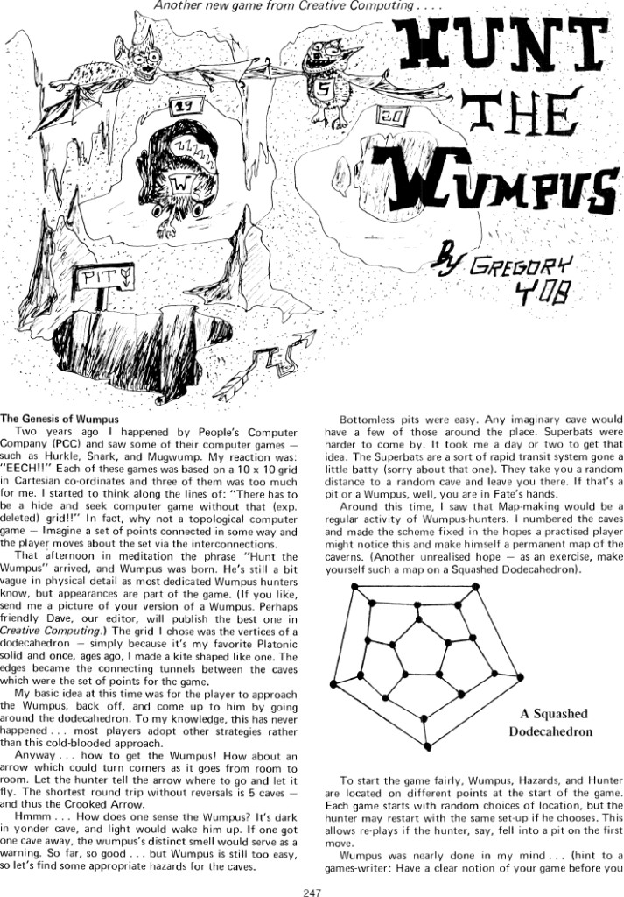
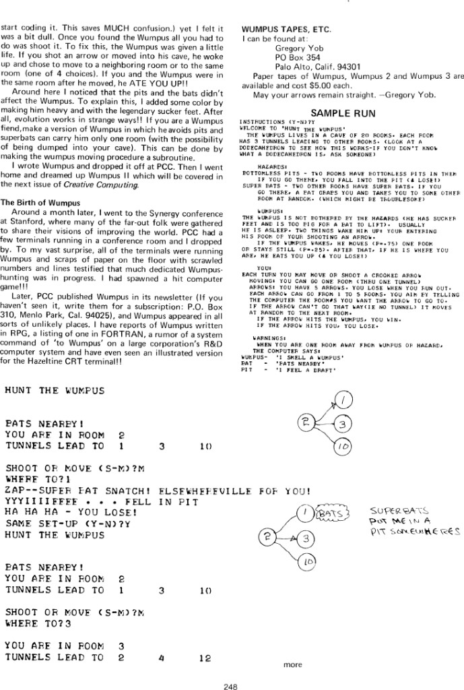
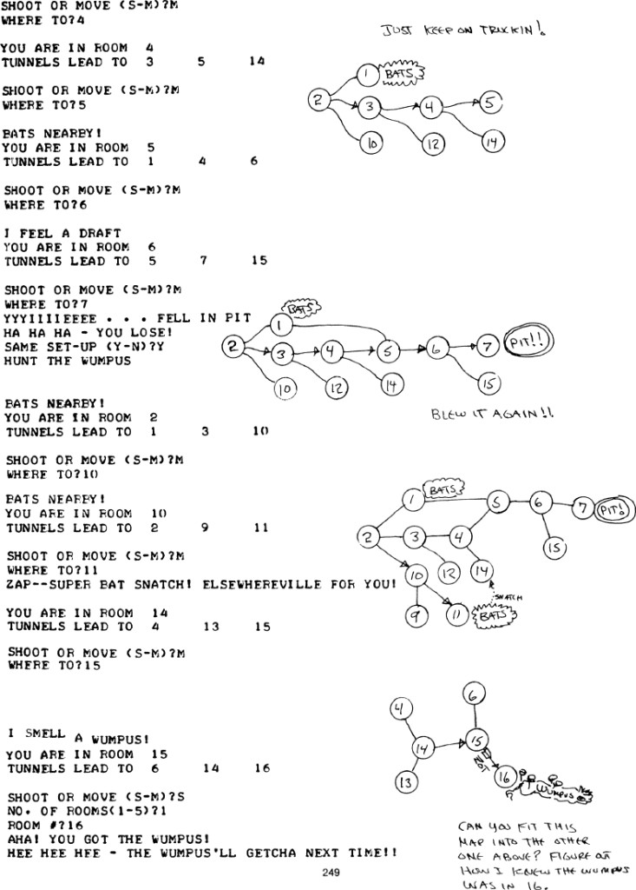
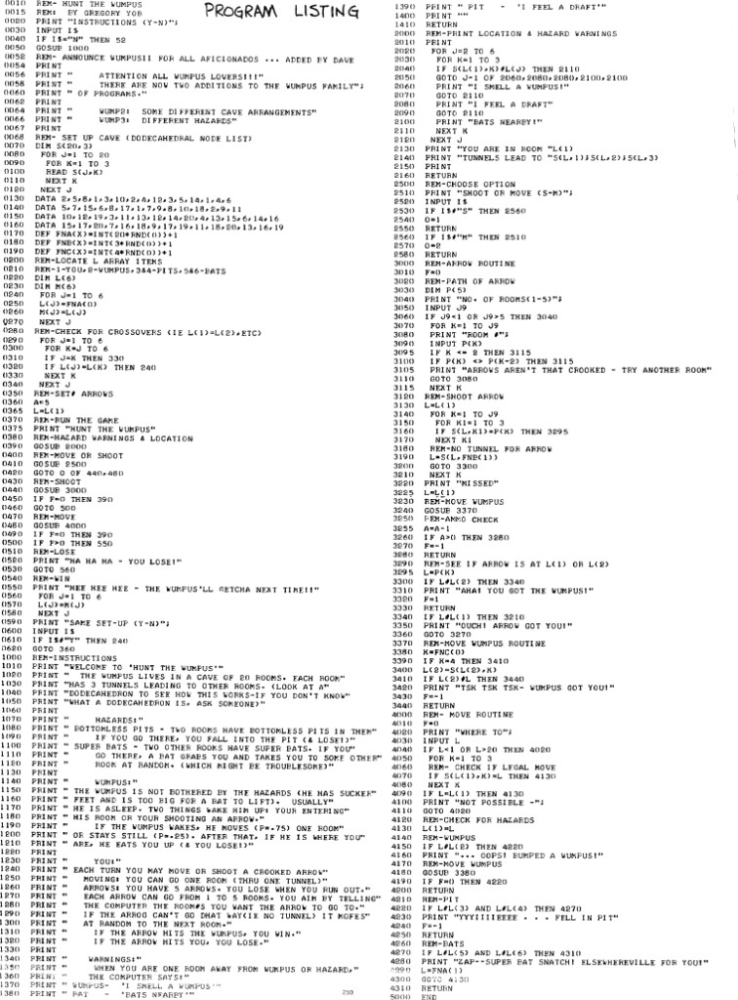

# Gregory Yob's Wumpus essay — digest and page guide

Gregory Yob's design essay and annotated playthrough accompanied the
Wumpus 1 listing in *Creative Computing* (1975) and again in *The Best
of Creative Computing, Volume 1* (Creative Computing Press, 1976,
David Ahl ed.), pages 247 to 250, in two parts: "The Genesis of
Wumpus" and "The Birth of Wumpus." The full spread is readable at
atariarchives.org, hosted there with the publisher's permission; the
page scans are mirrored in [`scans/`](scans/) for study. This file is
the digest and study guide; the complete proofread transcription of
all four pages, with an emendations log, is
[`yob-1975-essay-full-text.md`](yob-1975-essay-full-text.md).

## Page guide

| Page | Contents (archive's captions) | Scan | Online |
|------|-------------------------------|------|--------|
| 247 | Genesis of Wumpus, history | [scan](scans/bcc1-page-247.png) | [page 247](https://www.atariarchives.org/bcc1/showpage.php?page=247) |
| 248 | Birth of Wumpus, sample run | [scan](scans/bcc1-page-248.png) | [page 248](https://www.atariarchives.org/bcc1/showpage.php?page=248) |
| 249 | Maps: annotated playthrough with hand-drawn cave maps | [scan](scans/bcc1-page-249.png) | [page 249](https://www.atariarchives.org/bcc1/showpage.php?page=249) |
| 250 | BASIC program listing | [scan](scans/bcc1-page-250.png) | [page 250](https://www.atariarchives.org/bcc1/showpage.php?page=250) |

The listing from page 250 is archived here as
[`wumpus1-bcc1.bas`](wumpus1-bcc1.bas), taken from the archive's own
text layer (transcription notes below).

## The Genesis of Wumpus (page 247)

The origin is a rejection of the grid. Yob had happened by People's
Computer Company and seen Hurkle, Snark, and Mugwump, each a
hide-and-seek game on a 10 by 10 Cartesian grid. His reaction:
"EECH!!" — and the thought: "There has to be a hide and seek computer
game without that (exp. deleted) grid!!" The fix was mathematical,
not cosmetic: "why not a topological computer game — Imagine a set of
points connected in some way and the player moves about the set via
the interconnections."

The name arrived the same afternoon, in meditation: "the phrase 'Hunt
the Wumpus' arrived, and Wumpus was born." The monster's vagueness is
deliberate: "He's still a bit vague in physical detail... but
appearances are part of the game." (Yob even invites readers to mail
in drawings of their Wumpus for Dave Ahl to publish.)

Design decisions, each with its reason on the page:

- **The dodecahedron**, "simply because it's my favorite Platonic
  solid and once, ages ago, I made a kite shaped like one." Vertices
  became caves, edges became tunnels.
- **The crooked arrow**: his original vision was the player stalking
  the Wumpus clear around the dodecahedron ("To my knowledge, this
  has never happened... most players adopt other strategies rather
  than this cold-blooded approach"). The arrow turns corners; "the
  shortest round trip without reversals is 5 caves — and thus the
  Crooked Arrow."
- **Smell as the sensor**: "It's dark in yonder cave, and light would
  wake him up," so proximity is smelled, not seen. Gaming's original
  ambient warning is a lighting constraint.
- **Hazards**: bottomless pits were easy; Superbats took "a day or
  two" — "a sort of rapid transit system gone a little batty (sorry
  about that one)."
- **Map-making as intended play**: he numbered the caves and fixed
  the scheme "in the hopes a practised player might notice this and
  make himself a permanent map of the caverns," with the squashed
  dodecahedron diagram offered as the exercise.
- **Fair starts**: Wumpus, hazards, and hunter always start apart,
  and the same set-up can be replayed, explicitly to forgive
  first-move pit deaths.

Mid-thought at the page break, he drops the advice: "hint to a
games-writer: Have a clear notion of your game before you start
coding it. This saves MUCH confusion."

## The Birth of Wumpus (page 248)

The first playtest verdict was that a findable, shootable Wumpus was
"a bit dull," so "the Wumpus was given a little life": waking on an
arrow shot or a cave entry, moving with probability 0.75 or staying
with 0.25, and eating the hunter on a shared room ("he ATE YOU
UP!!"). The sucker feet and the weight are a retrofit to explain why
pits and bats don't touch him: "After all, evolution works in strange
ways!!" He even hands modders their first assignment: make a variant
where bats can carry the Wumpus one room, "with the possibility of
being dumped into your cave."

The hit-game moment is the Synergy conference at Stanford, about a
month after he dropped the program off at PCC: every PCC terminal in
the room running Wumpus, "scraps of paper on the floor with scrawled
numbers and lines" as evidence of dedicated hunting. "I had spawned a
hit computer game!!!" Then the diaspora: PCC published it in the
newsletter, and reports came back of Wumpus in RPG, a FORTRAN
listing, "a rumor of a system command of 'to Wumpus' on a large
corporation's R&D computer system," and an illustrated version for
the Hazeltine CRT terminal.

The page ends with the 1975 distribution channel, a sidebar worth
preserving whole in spirit: Gregory Yob, PO Box 354, Palo Alto,
Calif. 94301; paper tapes of Wumpus, Wumpus 2, and Wumpus 3, $5.00
each; "May your arrows remain straight." Note the confirmation that
**Wumpus 3 existed and shipped on paper tape**, even though no
listing has surfaced in the archives (see [`README.md`](README.md)).

## The maps page (page 249)

Page 249 is the pedagogical heart of the spread: a sample run
printed beside hand-drawn maps that grow as the player learns the
cave. Yob's printed marginalia coach deduction ("BLEW IT AGAIN!!",
"JUST KEEP ON TRUCKIN!", "SUPERBATS PUT ME IN A PIT SOMEWHERES") and
end with the challenge beside the final map: "CAN YOU FIT THIS MAP
INTO THE OTHER ONE ABOVE? FIGURE OUT HOW I KNEW THE WUMPUS WAS IN
16." The run ends with a one-arrow kill from room 15, exactly the
inference the maps teach.

For criticism purposes this page is the thesis in miniature: the
interface is numbered rooms and three warnings, but the play happens
on paper, in the player's reconstruction of the hidden graph.
Environmental storytelling ("I SMELL A WUMPUS!") and player-made maps
arrive here together, two years before Adventure.

## The BCC1 listing vs. the circulating transcription

The book listing ([`wumpus1-bcc1.bas`](wumpus1-bcc1.bas)) differs
from the widely circulated modern transcription archived at
[`wumpus1-yob.bas`](wumpus1-yob.bas). The differences
are themselves historical evidence:

| Point | BCC1 page 250 (1976) | Circulating transcription |
|-------|----------------------|---------------------------|
| Credit | line 15: `REM: BY GREGORY YOB` | absent |
| Dave Ahl's ad | "TWO ADDITIONS": WUMP2, WUMP3 | "3 ADDITIONS": adds WUMP4 hide-n-seek |
| Dialect | HP 2000 BASIC: `#` for not-equals, `GOTO ... OF` computed goto, `RND(0)` | genericized: `<>` comparisons, `ON ... GOTO`, `RND(1)` |
| Instruction pacing | plain `PRINT` between sections | `INPUT A$` pauses ("press return") |
| Bats line | "TWO OTHER ROOMS HAVE SUPER BATS" | "SUPER RATS" (transcription typo) |
| Random spelling | "AT RAMDOM" (as printed or OCR slip; verify against scan) | "AT RANDOM" |

So the BCC1 page preserves the HP time-sharing dialect Wumpus was
born in, and the WUMP4 line in the other transcription marks a later
printing of Ahl's advertisement. Neither is wrong; they are two
editions of the same 1973 program.

## Transcription notes

`wumpus1-bcc1.bas` follows the atariarchives text layer for page 250
verbatim, with only unambiguous digit/letter OCR fixes (0 for O, 1
for l) and one stray punctuation mark removed (line 3330 `RETURN`).
"RAMDOM" (line 1300) is retained and flagged above. Anything
load-bearing should be verified against the
[scan](scans/bcc1-page-250.png).

## Attribution

- Gregory Yob (1945–2005), "Hunt the Wumpus": game, essay, maps, and
  listing. First listing: *People's Computer Company* newsletter,
  November 1973. Essay spread: *Creative Computing*, 1975; *The Best
  of Creative Computing, Vol. 1*, ed. David H. Ahl, Creative
  Computing Press, 1976, pp. 247–250.
- Scans and text layer: [atariarchives.org, Best of Creative Computing Vol. 1](https://www.atariarchives.org/bcc1/showpage.php?page=247),
  hosted there with permission of the copyright holders; page images
  mirrored in [`scans/`](scans/) for study and criticism.
- Canon siblings and verification: [`README.md`](README.md).
