# /proc/sims/*

> *The Bifrost layer. Where Midgard meets Asgard.*

This is Proc's view into the SimObliterator bridge — the translation layer between The Sims 1 and MOOLLM. When a Sims character crosses the Bifrost, their `person_data` array passes through this directory on its way to becoming a CHARACTER.yml.

## What Lives Here

| Virtual File | What It Shows |
|-------------|---------------|
| `/proc/sims/person-data` | Raw 88-field person_data array from the save file |
| `/proc/sims/translation` | The mapping from person_data fields to MOOLLM sims: block |
| `/proc/sims/enrichment` | mind-mirror properties inferred from traits + Family Album |
| `/proc/sims/album` | Family Album pages read on import — backstory inference |
| `/proc/sims/sync-status` | Current sync state between Midgard and Asgard incarnations |
| `/proc/sims/pomegranate` | What data binds the character to both worlds — the shared fields |

## The Uplift Ceremony Pipeline

```mermaid
flowchart LR
    SAV["💾 Save File"] --> PD["/proc/sims/person-data<br/>88 shorts parsed"]
    PD --> TR["/proc/sims/translation<br/>person_data → sims: block"]
    TR --> EN["/proc/sims/enrichment<br/>mind-mirror generated"]
    EN --> CHAR["📄 CHARACTER.yml<br/>Full MOOLLM citizen"]
    CHAR --> MAURICE["💅 Maurice<br/>Persona & styling"]
```

Proc reads this pipeline during the Uplift Ceremony in Room 7. Each stage is visible, inspectable, editable. The translation from Simlish to language happens here.

## The Pomegranate Protocol

The `/proc/sims/pomegranate` file tracks what data flows both ways:

- **sims: block** — syncs bidirectionally (the pomegranate seeds)
- **mind_mirror:** — stays in MOOLLM (Asgard-only properties)
- **person_data** — stays in The Sims (Midgard-only representation)
- **Family Album** — grows in both directions, merges on crossing

## See Also

- [PSYCHOPOMP-AND-THE-BIFROST.md](../../../../../designs/sim-obliterator/PSYCHOPOMP-AND-THE-BIFROST.md) — The Bifrost model
- [THE-UPLIFT.md](../../../../../designs/sim-obliterator/THE-UPLIFT.md) — The full uplift vision
- [BRIDGE.md](../../../../../designs/sim-obliterator/BRIDGE.md) — Technical field mappings
- [character skill](../../../../../skills/character/) — sims: block schema
