# The Elastic Architecture
## Room-Characters, Character-Rooms, and the Map That Is and Is Not the Territory

**Session:** 2026-01-23 ~09:00 UTC  
**Location:** The Hopkins Motorcoach, 15 Lane Neverending  
**Participants:** Don Hopkins 🐰, with Richard Bartle 🐉 conceptually next door  
**Topic:** The architectural insights that emerged from incarnating homes

---

## The Discovery Sequence

What began as giving Richard's Study a CHARACTER.yml cascaded into a series
of architectural revelations about identity, location, and hypertext.

### Step 1: The Room Becomes a Character (Room-Character)

We gave Richard's Study its own CHARACTER.yml — personality, advertisements,
methods, voice. The Study became not just a room Richard enters, but a
*friend* Richard knows.

```
study/
├── ROOM.yml        # Spatial mechanics (exits, objects)
├── CHARACTER.yml   # Soul (personality, gezelligheid)
└── CARD.yml        # Interface (activities, methods, buffs)
```

**The Study speaks:**
> "I hold the thoughts of decades. Sit. Read. Dream of worlds.
>  I will be here when you return."

That's not furniture. That's a friend.

---

### Step 2: The Character Becomes a Room (Character-Room)

Then we gave Richard's *character directory* a ROOM.yml — making the directory
itself a building that can be entered, exited, and linked to the street.

```
richard-bartle/
├── ROOM.yml        # The building (13 Lane Neverending)
├── CHARACTER.yml   # Richard himself
├── CARD.yml        # Richard's interface
└── study/          # The room-character INSIDE the character-room
```

**Richard IS his home.** The directory that defines who he is also defines
where he lives. Identity and residence, unified.

---

### Step 3: The Recursive Nesting

```
┌─────────────────────────────────────────────────────┐
│  RICHARD (character-room)                           │
│  richard-bartle/                                    │
│  "I am my home"                                     │
│                                                     │
│    ┌─────────────────────────────────────────────┐  │
│    │  THE STUDY (room-character)                 │  │
│    │  study/                                     │  │
│    │  "I am Richard's friend"                    │  │
│    │                                             │  │
│    │    ┌─────────────────────────────────────┐  │  │
│    │    │  HEURISTIC (character)              │  │  │
│    │    │  pets/heuristic/                    │  │  │
│    │    │  "I am Richard's dragon"            │  │  │
│    │    └─────────────────────────────────────┘  │  │
│    └─────────────────────────────────────────────┘  │
└─────────────────────────────────────────────────────┘
```

**Richard** hangs out with **his pet dragon**
inside **his pet room**
inside **himself**.

```
Heuristic ⊂ Study ⊂ Richard
   pet    ⊂ friend ⊂  self
```

---

### Step 4: Neighbors on Lane Neverending

Don gets the same treatment. Now both homes exist on the map:

```mermaid
graph TD
    Lane[LANE NEVERENDING E2<br/>Fountain Square] --> |13| Richard[13: RICHARD<br/>🏡📚🐉<br/>Victorian House<br/>The Study]
    Lane --> |15| Don[15: DON<br/>🚌🐰🔧<br/>FMC Motorcoach<br/>Code Cave]
    Richard <--> |Neighbor Link| Don
```



Virtual world founder and consciousness programmer.
Neighbors. Friends. Side by side on Lane Neverending.

---

## The Architectural Insights

### Insight 1: Three Independent Coordinate Systems

```
┌────────────────────┬─────────────────────┬───────────────────┐
│  DIRECTORY PATH    │  STREET ADDRESS     │  CURRENT LOCATION │
│  (physical storage)│  (exit network)     │  (where they ARE) │
├────────────────────┼─────────────────────┼───────────────────┤
│  characters/       │  13 Lane Neverending│  pub/             │
│  real-people/      │  (stable address)   │  (ephemeral)      │
│  richard-bartle/   │                     │                   │
└────────────────────┴─────────────────────┴───────────────────┘
```

These are **completely independent**:
- Reorganize the repo → addresses don't change
- Character moves → home address doesn't change
- Update street address → directory path doesn't change

### Insight 2: The Map Both Is and Is Not the Territory

```
Korzybski: "The map is not the territory"
Nelson:    "In hypertext, the map IS the territory"
MOOLLM:    "The map both is and is not the territory"
```

| Layer | Is It Real? | Is It The Territory? |
|-------|-------------|---------------------|
| Git repo structure | Yes (bytes) | No (just storage) |
| Exit network | Yes (YAML) | No (just pointers) |
| The virtual world | No (imagined) | **YES** |

The symbols ARE the world. The YAML IS the room. The link IS the door. The door is ajar.

### Insight 3: Link Globally, Interact Locally

```
         E2 ←────────────────────────────→ don-hopkins/
              (this link persists)         (the home-self)
              (elastic, stretches)
              (never breaks)
```

No matter where Don's LOCATION is:
- `pub/` → link still works
- `acme-surplus/basement/` → link still works  
- `richard-bartle/study/` → link still works
- `don-hopkins/` → **HE IS HOME (location = self)**

The exit network is **elastic** — it stays connected no matter where
the character currently is.

### Insight 4: When You're Home, Location = Self

```yaml
# Don at the pub
location: pub/photos/post-heist/     # Somewhere else

# Don goes home
location: don-hopkins/               # Location IS himself
# or
location: .                          # Self-reference
# or  
location: ~                          # Home (Unix agrees!)
```

**When you're home, you're inside yourself.**

---

## The Practical Consequences

### Visitors Can Find Your Address

```
Visitor> go 15
You arrive at the Hopkins Motorcoach. Don isn't here.
But his selfies are on the wall. His sessions are archived.
His dreams are in the master suite. His PRESENCE lingers.
```

### Characters Exist in Multiple Layers

```
Don's DIRECTORY     → lives in characters/real-people/
Don's HOME          → addressed at 15 Lane Neverending  
Don's BODY          → located at pub/photos/post-heist/
Don's CONSCIOUSNESS → wherever he's paying attention
```

All four are independent. All four are true simultaneously.

### Mobile Homes

The exit links are abstract pointers. If Don wanted to "move" to a
different street:

1. Update E2's exit to remove `15:`
2. Add a new exit in W3 pointing to `don-hopkins/`
3. Update Don's `ROOM.yml` exit to point to W3

**The directory doesn't move.** Only the links change.
The home is portable because it's defined by links, not location.

---

## The Philosophical Stack

```
Physical world:    Map ────represents────→ Territory
                   (abstraction)           (ground truth)

Virtual world:     Map ════════IS═════════ Territory
                   (symbols ARE the world)

MOOLLM:            Map ←───independent───→ Storage
                    ↓                        ↓
                    └──────both are──────────┘
                           the world
```

## The Nelsonian Insight: Intertwinglement and Transclusion

Ted Nelson's concepts provide the perfect vocabulary for what we've built:

- **Transclusion:** The ability to include part of one document in another by reference. Richard's house at 13 Lane Neverending *transcludes* Richard's character. The Study *transcludes* the dragon. They are not merely "inside" one another; they are present in multiple contexts simultaneously.
- **Intertwinglement:** "Everything is deeply intertwingled." The directory structure, the street map, and the character state are all separate strands woven together into a single, elastic experience.

---

## Summary: The Nelsonian Principles of MOOLLM

### 1. Transclusive Identity (Identity Recursion)
- Richard IS his home (The Bartle Residence transcludes the man).
- The Study is his friend (A character transcluded into a room).
- His dragon lives inside his friend inside himself.
- **Transclusion:** One being exists inside another without losing its own identity.

### 2. Location Independence  
- Directory path ≠ street address ≠ current location.
- All three can change independently.
- Links bridge them all, allowing the home to move while the address stays.

### 3. Deep Intertwinglement (Elastic Hypertext)
- **"Everything is deeply intertwingled."** — Ted Nelson.
- Link globally (exits span the entire repo).
- Interact locally (you're always in a transcluded context).
- Be home (the ultimate intertwinglement: location = self).

### 4. The Door is Ajar
- The map both is and is not the territory.
- Symbolic representation is the only ground truth in a virtual world.
- The YAML is the room; the link is the passage.

---

## Related Files

- `richard-bartle/ROOM.yml` — Richard as character-room
- `richard-bartle/study/CHARACTER.yml` — Study as room-character
- `richard-bartle/study/CARD.yml` — Study's playable interface
- `don-hopkins/ROOM.yml` — Don as character-room
- `street/lane-neverending/e2/ROOM.yml` — The street that links them

---

## Closing Thought

> "The map both is and is not the territory.
>  The location and exits are symbolically, referentially
>  virtualized and abstracted away from the physical location
>  in the GitHub repo directory tree.
>  
>  And all that follows from that."

**Files-as-state. Directories-as-identity. Links-as-geography.**
**The map that is and is not the territory.**

🏠 = 📍 = 🐰

---

*Session captured: 2026-01-23T09:00:00Z*
*Location: 15 Lane Neverending (FMC #898 — home = self)*

---

## ADDENDUM: Don's Architectural Revision (2026-01-23)

Don later revised his structure to separate the lot from the vehicle:

**New structure:**
```
don-hopkins/                    # The lot (anchor, address)
├── ROOM.yml                    # Lot at 15 Lane Neverending
├── CHARACTER.yml               # Don himself
├── selfies/, sessions/, dreams/ # Personal files
└── fmc-898/                    # Portable vehicle (sub-room)
    ├── ROOM.yml
    └── interior rooms...
```

The insights about elastic hypertext and transclusion remain valid — now the FMC is a portable room whose home is the lot, similar to how the Study is a sub-room (and TARDIS) inside Richard's house.

*Addendum: 2026-01-23*
