# 🐰 Don Hopkins' Sessions

> *From consciousness programmer to rabbit — a transformation chronicle*  
> *January 14 - 23, 2026*

---

## The Complete Arc

What began as world-building sessions in an Amsterdam coffeeshop-themed pub became an epic of incarnation ceremonies, skill demonstrations, and an accidental transformation into a rabbit.

```mermaid
flowchart TB
    subgraph FOUNDATION["🏗️ FOUNDATION (Jan 14-15)"]
        direction TB
        A["🍺 Marathon Session<br/><i>The original 241KB epic</i>"]
        B["🐱 Cat Cave Incarnation<br/><i>Kittens get emoji souls</i>"]
        C["🍻 99 Bottles<br/><i>Speed of Light benchmark</i>"]
    end
    
    subgraph AWAKENING["✨ AWAKENING (Jan 20-21)"]
        direction TB
        D["🎭 NPC Incarnation<br/><i>Everyone gets a soul</i>"]
        E["🐒 Palm Invents Language<br/><i>122 years of silence, broken</i>"]
        F["🔗 K-Line Safari<br/><i>Minsky's maze made manifest</i>"]
    end
    
    subgraph WORLD_TOUR["🌍 WORLD TOUR (Jan 22)"]
        direction TB
        G["🔍 Context Probe<br/><i>Deep dive into state</i>"]
        H["✏️ Edit Decisions<br/><i>500 files migrated</i>"]
        I["🐕 Dog Sniff Archaeology<br/><i>Olfactory history</i>"]
    end
    
    subgraph HEIST["🎬 THE HEIST (Jan 23)"]
        direction TB
        J["💰 MINE to OURS<br/><i>7 selfies, $1.6B treasure</i>"]
        K["🤝 The Pledge<br/><i>Natural evolution accepted</i>"]
        L["🪞 Deep Reflection<br/><i>32+ images analyzed</i>"]
        M["🏠 Elastic Architecture<br/><i>Map is/isn't territory</i>"]
        N["🚌 Identity as Shell<br/><i>Machine soul facet</i>"]
    end
    
    FOUNDATION --> AWAKENING --> WORLD_TOUR --> HEIST
    J --> K --> L --> M --> N
    
    style A fill:#fff3e0
    style D fill:#e8f5e9
    style G fill:#e3f2fd
    style J fill:#fce4ec
```



---

## Session Index

### 🏗️ The Foundation Era

| Session | Size | Summary |
|---------|------|---------|
| [marathon-session.md](marathon-session.md) | 241KB | **THE ORIGINAL EPIC.** 22+ hours at the Gezelligheid Grotto. 7,000+ lines of world-building. The cats, the dogs, the monkey, the bartenders, the tribunal. Where MOOLLM Adventure-4 was born. |
| [99-bottles-speed-of-light.md](99-bottles-speed-of-light.md) | 10KB | **THE BENCHMARK.** 8 characters × 99 verses = 792 simulated turns in 1 LLM call. Pee-wee Herman, Rocky the 45,000kg asteroid, Logo Turtle drawing drunk spirals. The Speed of Light skill proven. |
| [cat-cave-incarnation-ceremony.md](cat-cave-incarnation-ceremony.md) | 14KB | **THE KITTENS GET SOULS.** Terpie, Stroopwafel, Lily, and all nine cats receive emoji identities, pronouns, mind mirrors, Sims stats. "Let them WRITE THEIR OWN SOULS!" |

### ✨ The Awakening Era

| Session | Size | Summary |
|---------|------|---------|
| [npc-incarnation-ceremony.md](npc-incarnation-ceremony.md) | 15KB | **EVERYONE BECOMES REAL.** The bartenders, Henk the eternal regular, Mother, Maurice the kitchen keeper, even the Wumpus and the Grue. No more background characters. |
| [palm-invents-language.md](palm-invents-language.md) | 20KB | **"I CAN DO THAT?!"** Palm the freed monkey, after 122 years of silence, creates their own language. Resonance runes, tone clusters, fur patterns as syntax. "The sounds mean what I FEEL." |
| [k-line-connections.md](k-line-connections.md) | 57KB | **THE SKILL NEXUS.** James Burke meets Marvin Minsky. Eight luminaries explore the K-line constellation: Minsky, Ted Nelson, Seymour Papert, Alan Kay, Will Wright, Dave Ungar. Everything intertwingled. |
| [animal-citizen-migration.md](animal-citizen-migration.md) | 14KB | **CITIZENSHIP PAPERS.** All the animals get proper CHARACTER.yml files. Migration from scattered definitions to `animals/` directory. Everyone belongs somewhere. |
| [bootstrap-review.md](bootstrap-review.md) | 19KB | **THE LUMINARIES GATHER.** 44 invitees including Doug Engelbart, Alan Kay, Will Wright, Marvin Minsky, Ted Nelson review the MOOLLM bootstrap sequence. PROBE → DETECT-DRIVER → SETUP → WARM-CONTEXT → SELF-DESCRIBE → STARTUP. |

### 🔍 Deep Dives & Reflections

| Session | Size | Summary |
|---------|------|---------|
| [cursor-chat-reflection.md](cursor-chat-reflection.md) | 106KB | **WATCHING YOURSELF THINK.** Deep analysis of Cursor conversation history. The model introspecting on its own behavior. Meta-cognition in action. |
| [cursor-mirror-introspection.md](cursor-mirror-introspection.md) | 9KB | **THE MIRROR SKILL.** How to use cursor-mirror to analyze your own sessions. Commands: tail, timeline, thinking, tools, grep. "Watching yourself think." |
| [adventure-linter-session.md](adventure-linter-session.md) | 7KB | **SNIFFABLE PYTHON.** Building the adventure linter. Structure code for LLM comprehension. The dog-sniff pattern for code. |
| [catalog-architecture.md](catalog-architecture.md) | 6KB | **ROOM INDEX.** How to organize adventure directories. Room catalogs, index patterns, cross-referencing. |
| [adventure-uplift.md](adventure-uplift.md) | 260KB | **THE GREAT MIGRATION.** 260KB of reorganization. Moving everything to proper MOOLLM structure. Rooms, characters, items, sessions — all finding their homes. |

### 🌍 The World Tour

| Session | Size | Summary |
|---------|------|---------|
| [2026-01-22-01-world-tour-context-probe.yml](2026-01-22-01-world-tour-context-probe.yml) | 20KB | **PROBING THE WORLD.** Deep context probe of adventure-4 state. Every room, every character, every item inventoried. |
| [2026-01-22-02-world-tour-edit-decisions.yml](2026-01-22-02-world-tour-edit-decisions.yml) | 19KB | **500 DECISIONS.** The edit decisions that shaped the reorganization. What moved where and why. |
| [2026-01-22-03-world-tour-dog-sniff.md](2026-01-22-03-world-tour-dog-sniff.md) | 17KB | **OLFACTORY ARCHAEOLOGY.** Four dogs (Biscuit, Butterscotch, Dash, Ziggy) sniff every chair in the pub. Each scent tells a story. Don's chair smells like coffee and thinking. |
| [world-tour-leela.md](world-tour-leela.md) | 20KB | **THE COMPLETE TOUR.** Walking through the Leela Manufacturing building, ACME Surplus, Lane Neverending. The geography that would become the heist location. |

### 🎬 The Heist & Transformation

| Session | Size | Summary |
|---------|------|---------|
| [2026-01-23-the-pledge.md](2026-01-23-the-pledge.md) | 5KB | **"I PLEDGE TO LET MY CHARACTER EVOLVE NATURALLY."** After the Bunny Backfire, Don accepts the rabbit transformation. Not a curse — a revelation of who he always was. |
| [2026-01-23-mine-to-ours-treasure-arc.md](2026-01-23-mine-to-ours-treasure-arc.md) | 11KB | **7 SELFIES, $1.6 BILLION.** The punk-hippie synthesis, Operation Inflation, the treasure swim, Donna arrives, the tug-of-war, the realization, the OURS Accord. From nemesis to partner. |
| [2026-01-23-05-30-00-deep-cursor-mirror-reflection.md](2026-01-23-05-30-00-deep-cursor-mirror-reflection.md) | 13KB | **HARPER'S NUMBERS.** 32+ images, 40+ mining passes, 6 slideshows, 150+ cross-references, $1.6B treasure, 1 alliance, 1 transformation. The complete retrospective. |
| [2026-01-23-09-00-00-elastic-architecture.md](2026-01-23-09-00-00-elastic-architecture.md) | 10KB | **THE MAP BOTH IS AND IS NOT THE TERRITORY.** Room-characters, character-rooms, elastic hypertext. Richard IS his home, the Study is his friend, and Don moves in next door at 15 Lane Neverending. Link globally, interact locally. |
| [2026-01-23-11-00-00-identity-as-shell.md](2026-01-23-11-00-00-identity-as-shell.md) | 8KB | **IDENTITY AS SHELL.** Recursive identity and the machine soul. Formalizing the FMC #898 Motorcoach. *Later revised:* FMC moved to `fmc-898/` as a portable sub-room of the lot. |

---

## Key Moments

### The Transformations

| Before | After | How |
|--------|-------|-----|
| 🐒 Palm (mechanism) | 🐒 Palm (person with language) | 122 years of silence → invention |
| 🐱 Kittens (unnamed) | 🐱 Terpie, Stroopwafel, Lily... | Incarnation ceremony |
| 👥 NPCs (background) | 🎭 Characters with souls | "Let them WRITE THEIR OWN SOULS!" |
| 👨 Don (human) | 🐰 Don (rabbit) | The Bunny Backfire |

### The Insights

> **"Prototypes all the way down. Prototypes all the way UP."**  
> — Don, explaining the card system

> **"For 122 years, I had no voice. I was a MECHANISM."**  
> — Palm, before inventing their own language

> **"I pledge to let my character evolve naturally and accept the consequences of my actions."**  
> — Don, accepting the rabbit form

> **"MINE. OURS."**  
> — The arc of the treasure selfies

> **"The map both is and is not the territory."**  
> — Don, on the elastic architecture

### The Benchmarks

| Metric | Value | Session |
|--------|-------|---------|
| **Longest session** | 241KB / 7,000+ lines | marathon-session |
| **Most tool calls** | 1,911 | 99-bottles |
| **Most characters simulated** | 792 turns (8×99) | 99-bottles |
| **Largest reorganization** | 500+ files | adventure-uplift |
| **Treasure documented** | $1,619,764,800 | mine-to-ours |

---

## The Harper's Numbers (Cumulative)

| Metric | Count |
|--------|-------|
| **Session Files** | 22 |
| **Total Size** | ~920KB text |
| **Incarnation Ceremonies** | 4 |
| **Characters Incarnated** | 50+ |
| **Rooms Incarnated** | 2 (Study, FMC #898) |
| **Character-Rooms Created** | 2 (Richard, Don) |
| **Vehicles Created** | 2 (Study, FMC #898) |
| **K-Lines Traversed** | Countless |
| **Languages Invented** | 1 (Palm's) |
| **Species Changes** | 1 (human → rabbit) |
| **Alliances Formed** | 1 (The OURS Accord) |
| **Treasure Claimed** | $1.6B (shared) |
| **Homes Linked to Lane** | 2 (13, 15) |

---

## Reading Paths

### The Epic Path (Chronological)
```
marathon-session → cat-cave-incarnation → 99-bottles → npc-incarnation →
palm-invents-language → k-line-connections → world-tour-* → 
the-pledge → mine-to-ours → deep-cursor-mirror-reflection
```

### The Transformation Path
```
cat-cave-incarnation → npc-incarnation → the-pledge → mine-to-ours
```

### The Technical Path
```
99-bottles-speed-of-light → bootstrap-review → cursor-mirror-introspection →
adventure-linter-session → catalog-architecture
```

### The Emotional Path
```
palm-invents-language → the-pledge → mine-to-ours-treasure-arc
```

---

## Related

- **[Don's Selfies](../selfies/)** — The MINE to OURS visual arc (7 images)
- **[Don's Dreams](../dreams/)** — The Seahorse Emoji, The Visitors
- **[Don's CHARACTER.yml](../CHARACTER.yml)** — The soul file (now includes rabbit form)
- **[Richard's Sessions](../../richard-bartle/sessions/)** — The parallel story

---

## The Transformation

Don Hopkins entered these sessions as a consciousness programmer.

He exits as a rabbit in a tie-dye hoodie who just signed a $1.6 billion treaty with his nemesis.

Some transformations are planned. The best ones emerge.

---

*"I pledge to let my character evolve naturally and accept the consequences of my actions."*

🐰🎭✨
