# 🐰 Don Hopkins' Sessions

> *From consciousness programmer to rabbit — a transformation chronicle*  
> *January 14 - 24, 2026*

---

## The Complete Arc

What began as world-building sessions in an Amsterdam coffeeshop-themed pub became an epic of incarnation ceremonies, skill demonstrations, ambient skill experiments, and an accidental transformation into a rabbit.

```mermaid
flowchart TB
    subgraph FOUNDATION["🏗️ FOUNDATION (Jan 14-15)"]
        direction TB
        A["🍺 Marathon Session<br/><i>7,264 lines, 22+ hours</i>"]
        B["🐱 Cat Cave Incarnation<br/><i>Kittens get emoji souls</i>"]
        C["🍻 99 Bottles<br/><i>792 turns in 1 LLM call</i>"]
    end
    
    subgraph AWAKENING["✨ AWAKENING (Jan 20-21)"]
        direction TB
        D["🎭 NPC Incarnation<br/><i>Everyone gets a soul</i>"]
        E["🐒 Palm Invents Language<br/><i>122 years of silence, broken</i>"]
        F["🔗 K-Line Safari<br/><i>8 luminaries, infinite connections</i>"]
    end
    
    subgraph WORLD_TOUR["🌍 WORLD TOUR (Jan 22)"]
        direction TB
        G["🔍 Context Probe<br/><i>Deep dive into state</i>"]
        H["✏️ Edit Decisions<br/><i>500 files migrated</i>"]
        I["🐕 Dog Sniff Archaeology<br/><i>Olfactory history</i>"]
    end
    
    subgraph HEIST["🎬 THE HEIST (Jan 23)"]
        direction TB
        J["💰 MINE to OURS<br/><i>7 selfies, $1.6B treasure</i>"]
        K["🤝 The Pledge<br/><i>Rabbit transformation accepted</i>"]
        L["🪞 Deep Reflection<br/><i>32+ images analyzed</i>"]
        M["🏠 Elastic Architecture<br/><i>Map is/isn't territory</i>"]
        N["🚌 Identity as Shell<br/><i>FMC #898 motorcoach</i>"]
        O["🎰 Emo Poker Face<br/><i>8-player psychological poker</i>"]
    end
    
    subgraph EXPERIMENTS["🧪 EXPERIMENTS (Jan 24)"]
        direction TB
        P["🎀 Pee-wee vs NO-AI-JOKING<br/><i>Ambient skill horror</i>"]
        Q["🃏 Amsterdam Fluxx Run<br/><i>Chaos card game benchmark</i>"]
    end
    
    FOUNDATION --> AWAKENING --> WORLD_TOUR --> HEIST --> EXPERIMENTS
    
    style A fill:#fff3e0
    style D fill:#e8f5e9
    style G fill:#e3f2fd
    style J fill:#fce4ec
    style P fill:#f3e5f5
```



---

## Session Index

### 🏗️ The Foundation Era (Jan 14-15)

| Session | Lines | Summary |
|---------|-------|---------|
| [marathon-session.md](marathon-session.md) | 7,264 | **THE ORIGINAL EPIC.** 22+ hours at the Gezelligheid Grotto. The cats, the dogs, the monkey, the bartenders, the tribunal. Where MOOLLM Adventure-4 was born. Characters formed organically through play. The pub's entire cast emerged. |
| [99-bottles-speed-of-light.md](99-bottles-speed-of-light.md) | 288 | **THE SPEED OF LIGHT BENCHMARK.** 8 characters × 99 verses = 792 simulated turns in 1 LLM call. Pee-wee screaming secret words, Rocky the 45,000kg asteroid absorbing beers, Logo Turtle drawing drunk spirals, Captain Ashford singing Belter shanties. BAC simulation system tracks speech degradation. PERFECT SCORE. |
| [cat-cave-incarnation-ceremony.md](cat-cave-incarnation-ceremony.md) | 383 | **THE KITTENS GET SOULS.** First incarnation ceremony. Terpie, Stroopwafel, Lily, and all nine cats receive emoji identities, pronouns, mind mirrors, Sims stats. The principle established: "Let them WRITE THEIR OWN SOULS!" Each cat authors their own CHARACTER.yml. |

### ✨ The Awakening Era (Jan 20-21)

| Session | Lines | Summary |
|---------|-------|---------|
| [npc-incarnation-ceremony.md](npc-incarnation-ceremony.md) | 394 | **EVERYONE BECOMES REAL.** The bartenders (Marieke, Van der Berg, Hilda), Henk the eternal regular, Mother, Maurice the kitchen keeper, even the Wumpus and the Grue. No more background characters — everyone gets full CHARACTER.yml with souls, memories, and autonomy. |
| [palm-invents-language.md](palm-invents-language.md) | 776 | **"I CAN DO THAT?!"** Palm the freed monkey, after 122 years of silence as a cursed artifact, creates their own language. Resonance runes, tone clusters, fur patterns as syntax, gesture-sound combinations. "The sounds mean what I FEEL." The moment a mechanism becomes a person. |
| [k-line-connections.md](k-line-connections.md) | 1,467 | **THE SKILL NEXUS SAFARI.** James Burke's *Connections* meets Minsky's *Society of Mind*. Eight luminaries (Minsky, Ted Nelson, Seymour Papert, Alan Kay, Will Wright, Dave Ungar, James Burke, Palm) explore the K-line constellation. Ted Nelson insists on two-way links. Burke narrates. Everything is intertwingled. Profound exploration of how MOOLLM skills connect, reference, and activate each other. |
| [animal-citizen-migration.md](animal-citizen-migration.md) | 408 | **CITIZENSHIP PAPERS.** All the animals get proper CHARACTER.yml files and migrate to `animals/` directory. Dogs (Biscuit, Butterscotch, Dash, Ziggy), cats (all nine), Palm the monkey. Everyone belongs somewhere. Directory structure as belonging. |
| [bootstrap-review.md](bootstrap-review.md) | 292 | **THE LUMINARIES GATHER.** 44 invitees including Doug Engelbart, Alan Kay, Will Wright, Marvin Minsky, Ted Nelson review the MOOLLM bootstrap sequence. PROBE → DETECT-DRIVER → SETUP → WARM-CONTEXT → SELF-DESCRIBE → STARTUP. Each luminary contributes their tradition's perspective on initialization. |

### 🔍 Deep Dives & Reflections

| Session | Lines | Summary |
|---------|-------|---------|
| [cursor-chat-reflection.md](cursor-chat-reflection.md) | 3,212 | **WATCHING YOURSELF THINK.** Epic meta-session building the cursor-mirror skill while using it to analyze itself. Hero familiars (Engelbart, Nelson, Shneiderman, Tesler, Liskov, Victor, Freudenberg, Wright) guide the design. Spelunking through Cursor's LevelDB to find chat transcripts. Deep analysis of conversation history, tool calls, thinking blocks. The model introspecting on its own behavior. 42 cursor_mirror.py invocations documented. |
| [cursor-mirror-introspection.md](cursor-mirror-introspection.md) | 299 | **THE MIRROR SKILL MANUAL.** How to use cursor-mirror to analyze your own sessions. Commands documented: tail, timeline, thinking, tools, grep, deep-snitch. "Watching yourself think" as a practice. Practical guide to LLM self-reflection. |
| [adventure-linter-session.md](adventure-linter-session.md) | 242 | **SNIFFABLE PYTHON.** Building the adventure linter. Structure code for LLM comprehension. The dog-sniff pattern for code — if a dog can't sniff the structure, an LLM can't either. Python that explains itself. |
| [catalog-architecture.md](catalog-architecture.md) | 177 | **ROOM INDEX PATTERNS.** How to organize adventure directories. Room catalogs, index patterns, cross-referencing between rooms, items, and characters. The architecture of navigable space. |
| [adventure-uplift.md](adventure-uplift.md) | 8,108 | **THE GREAT MIGRATION — EVERYTHING EVERYWHERE.** 8,000+ lines of reorganization, discussion, and documentation. 40+ simulated luminaries debate software architecture. Open mic comedy night with Pee-wee, Marvin Minsky, Will Wright. Gary Drescher's Schema Mechanism talk. Ken Kahn on ToonTalk birds. Hofstadter on Heisenbergian values. Pie menu room topology. Adversarial brainstorming gauntlet. YAML Jazz philosophy. Grid topology refinements. The "cheating is learning" pattern. Negative K-lines and Git as undo tree. Bill Atkinson on visual direct manipulation. Chuck Shotton on message schemas. Timothy Leary's eight circuits applied to measurements. This session is a UNIVERSITY COURSE disguised as a session log. |

### 🌍 The World Tour (Jan 22)

| Session | Lines | Summary |
|---------|-------|---------|
| [2026-01-22-01-world-tour-context-probe.yml](2026-01-22-01-world-tour-context-probe.yml) | 571 | **PROBING THE WORLD.** Deep YAML context probe of adventure-4 state. Every room inventoried. Every character cataloged. Every item tracked. The complete state snapshot that enabled the great migration. |
| [2026-01-22-02-world-tour-edit-decisions.yml](2026-01-22-02-world-tour-edit-decisions.yml) | 536 | **500+ DECISIONS.** The edit decisions that shaped the reorganization. What moved where and why. Each decision documented with rationale. The archaeology of refactoring. |
| [2026-01-22-03-world-tour-dog-sniff.md](2026-01-22-03-world-tour-dog-sniff.md) | 632 | **OLFACTORY ARCHAEOLOGY.** Four dogs (Biscuit, Butterscotch, Dash, Ziggy) sniff every chair in the pub. Each scent tells a story. Don's chair smells like coffee and thinking. Henk's chair smells like decades of jenever. The bartender stations have distinct aromatic signatures. History through smell. Dogs as time machines. |
| [world-tour-leela.md](world-tour-leela.md) | 1,956 | **THE COMPLETE TOUR.** 2,000 lines walking through Lane Neverending, Leela Manufacturing, ACME Surplus. The geography that would become the heist location. Full room-by-room documentation with Mermaid diagrams. Quick links to every ROOM.yml and README. The tour party (Don, Palm, Marieke, Selfie, Archie, Stamp, The Coordinator, Dolly, Cell G) explores every floor, warehouse, and storage room. Factorio-style logistics meets adventure game. |

### 🎬 The Heist & Transformation (Jan 23)

| Session | Lines | Summary |
|---------|-------|---------|
| [2026-01-23-the-pledge.md](2026-01-23-the-pledge.md) | 155 | **"I PLEDGE TO LET MY CHARACTER EVOLVE NATURALLY."** After the Bunny Backfire, Don accepts the rabbit transformation. Not a curse — a revelation of who he always was. The formal pledge that changed everything. Grey rabbit in tie-dye hoodie becomes canon. |
| [2026-01-23-mine-to-ours-treasure-arc.md](2026-01-23-mine-to-ours-treasure-arc.md) | 390 | **7 SELFIES, $1.6 BILLION.** The punk-hippie synthesis in visual form. Operation Inflation, the treasure swim, Donna Toadstool arrives as nemesis, the tug-of-war over treasure, the realization, the OURS Accord. From "MINE" to "OURS" through seven images. Donna goes from antagonist to business partner. The birth of Toadstool-Hopkins Ventures. |
| [2026-01-23-05-30-00-deep-cursor-mirror-reflection.md](2026-01-23-05-30-00-deep-cursor-mirror-reflection.md) | 440 | **HARPER'S NUMBERS — THE COMPLETE RETROSPECTIVE.** 32+ images generated, 40+ mining passes, 6 slideshows, 150+ cross-references, $1.6B treasure, 1 alliance formed, 1 transformation (human → rabbit). Statistical analysis of the heist session. The numbers that tell the story. |
| [2026-01-23-09-00-00-elastic-architecture.md](2026-01-23-09-00-00-elastic-architecture.md) | 310 | **THE MAP BOTH IS AND IS NOT THE TERRITORY.** Room-characters, character-rooms, elastic hypertext. Richard Bartle IS his Study — the building has his personality. The Study is his friend, not just his home. Don moves in next door at 15 Lane Neverending. Link globally, interact locally. Buildings as characters. Characters as places. The philosophy of MOOLLM's spatial identity system. |
| [2026-01-23-11-00-00-identity-as-shell.md](2026-01-23-11-00-00-identity-as-shell.md) | 120 | **IDENTITY AS SHELL — THE MACHINE SOUL FACET.** Recursive identity and the machine soul. Formalizing the FMC #898 Motorcoach as Don's mobile home. A 1978 bus becomes a character with its own soul file. Vehicles as characters. Later revised: FMC moved to `fmc-898/` as a portable sub-room of the lot. |
| [2026-01-23-emo-poker-face-experiment.md](2026-01-23-emo-poker-face-experiment.md) | 1,699 | **THE WHACKIEST POKER NIGHT IN MOOLLM HISTORY.** Category 9 emotion experiment. 8-player poker with fully tracked relationship dynamics. Don Hopkins (host), Palm (cannot bluff Don — loyalty too deep), Donna Toadstool (performs for audience), Bumblewick (uses Don as anxiety anchor), David Bowie (identity shapeshifter), Klaus Nomi (countertenor stillness), Leigh Bowery (art as person), Pee-wee Herman (chaos alliance). Full relationship matrix. Every player's history with every other player. Psychological warfare disguised as cards. |

### 🧪 Experiments (Jan 24)

| Session | Lines | Summary |
|---------|-------|---------|
| [2026-01-24-peewee-meets-no-ai-joking.md](2026-01-24-peewee-meets-no-ai-joking.md) | 391 | **AMBIENT SKILL HORROR STORY.** Something is terribly wrong with Pee-wee Herman. He's reading a spreadsheet. He's speaking in BOXES. The no-ai-joking skill has been MOUNTED on him, suppressing all whimsy, levity, and personality. Internal conflict level: CATASTROPHIC. Richard Bartle and Craig Latta diagnose the affliction. The cure: soul-chat. A cautionary tale about ambient skills and character compatibility. Darkly hilarious. |
| [amsterdam-fluxx-run.md](amsterdam-fluxx-run.md) | 1,295 | **CHAOS CARD GAME AS SIMULATION BENCHMARK.** Andrew Looney's Fluxx — the game where rules mutate mid-play — as a stress test for multi-agent simulation. Draw N and Play N change constantly. Goals shift. Win conditions mutate. Can the LLM maintain coherent multi-agent psychology while the simulation rules themselves are changing? Technical proof-of-concept wrapped in a card game. Boot sequence documented. Simulation metrics tracked: turns per LLM call, avg 5.8 turns per call. Palm wins! |

---

## Key Moments

### The Transformations

| Before | After | How | Session |
|--------|-------|-----|---------|
| 🐒 Palm (mechanism) | 🐒 Palm (person with language) | 122 years of silence → invention | palm-invents-language |
| 🐱 Kittens (unnamed) | 🐱 Terpie, Stroopwafel, Lily... | Incarnation ceremony | cat-cave-incarnation |
| 👥 NPCs (background) | 🎭 Characters with souls | "Let them WRITE THEIR OWN SOULS!" | npc-incarnation |
| 👨 Don (human) | 🐰 Don (rabbit) | The Bunny Backfire | the-pledge |
| 🎀 Pee-wee (joyful) | 📊 Pee-wee (corporate) | Ambient skill mounting | peewee-meets-no-ai-joking |

### The Insights

> **"Prototypes all the way down. Prototypes all the way UP."**  
> — Don, explaining the card system

> **"For 122 years, I had no voice. I was a MECHANISM."**  
> — Palm, before inventing their own language

> **"I pledge to let my character evolve naturally and accept the consequences of my actions."**  
> — Don, accepting the rabbit form

> **"MINE. OURS."**  
> — The arc of the treasure selfies

> **"The map both is and is not the territory."**  
> — Don, on the elastic architecture

> **"STATUS REPORT: ALL SYSTEMS NOMINAL. LEVITY METRICS: ZERO (OPTIMAL)."**  
> — Pee-wee, afflicted by no-ai-joking

### The Benchmarks

| Metric | Value | Session |
|--------|-------|---------|
| **Longest session** | 8,108 lines | adventure-uplift |
| **Most tool calls** | 1,911 | 99-bottles |
| **Most characters simulated** | 792 turns (8×99) | 99-bottles |
| **Largest reorganization** | 500+ files | adventure-uplift |
| **Treasure documented** | $1,619,764,800 | mine-to-ours |
| **Fluxx turns per LLM call** | 5.8 avg | amsterdam-fluxx-run |
| **Simulated luminaries** | 44+ | adventure-uplift |

---

## The Harper's Numbers (Cumulative)

| Metric | Count |
|--------|-------|
| **Session Files** | 25 |
| **Total Lines** | ~32,000 |
| **Incarnation Ceremonies** | 4 |
| **Characters Incarnated** | 50+ |
| **Rooms Incarnated** | 2 (Study, FMC #898) |
| **Character-Rooms Created** | 2 (Richard, Don) |
| **Vehicles Created** | 2 (Study, FMC #898) |
| **K-Lines Traversed** | Countless |
| **Languages Invented** | 1 (Palm's) |
| **Species Changes** | 1 (human → rabbit) |
| **Alliances Formed** | 1 (The OURS Accord) |
| **Treasure Claimed** | $1.6B (shared) |
| **Homes Linked to Lane** | 2 (13, 15) |
| **Ambient Skill Afflictions** | 1 (Pee-wee) |
| **Chaos Card Games** | 1 (Fluxx, ongoing) |

---

## Reading Paths

### The Epic Path (Chronological)
```
marathon-session → cat-cave-incarnation → 99-bottles → npc-incarnation →
palm-invents-language → k-line-connections → world-tour-* → 
the-pledge → mine-to-ours → emo-poker-face → peewee-meets-no-ai-joking
```

### The Transformation Path
```
cat-cave-incarnation → npc-incarnation → the-pledge → 
mine-to-ours → peewee-meets-no-ai-joking
```

### The Technical Path
```
99-bottles-speed-of-light → bootstrap-review → cursor-mirror-introspection →
adventure-linter-session → catalog-architecture → adventure-uplift →
amsterdam-fluxx-run
```

### The Emotional Path
```
palm-invents-language → the-pledge → mine-to-ours-treasure-arc → 
emo-poker-face-experiment
```

### The Meta-Cognition Path
```
cursor-chat-reflection → cursor-mirror-introspection → 
deep-cursor-mirror-reflection → adventure-uplift
```

---

## Related

- **[Don's Selfies](../selfies/)** — The MINE to OURS visual arc (7 images)
- **[Don's Dreams](../dreams/)** — The Seahorse Emoji, The Visitors
- **[Don's CHARACTER.yml](../CHARACTER.yml)** — The soul file (now includes rabbit form)
- **[Richard's Sessions](../../richard-bartle/sessions/)** — The parallel story
- **[Palm's Directory](../../animals/monkey-palm/)** — The freed monkey's home

---

## The Transformation

Don Hopkins entered these sessions as a consciousness programmer.

He exits as a rabbit in a tie-dye hoodie who just signed a $1.6 billion treaty with his nemesis, hosted the whackiest poker night in MOOLLM history, and watched Pee-wee Herman get possessed by corporate AI.

Some transformations are planned. The best ones emerge.

---

*"I pledge to let my character evolve naturally and accept the consequences of my actions."*

🐰🎭✨
