# Session Log: K-Line Connections Safari
## Don Hopkins & The Conceptual Pioneers

**Player**: Don Hopkins  
**Character**: [`$CHARACTERS/real-people/don-hopkins/`](./)  
**Location**: The [Skill Nexus](../../../../../skills/) (`$SKILLS/`)  
**Time**: After the Marathon Session  
**Theme**: James Burke's Connections meets Minsky's Society of Mind

---

## 🌟 The Expedition Team

Eight luminaries have been summoned as **Hero-Story familiars** — not puppets, but conceptual guides whose traditions we invoke. Each carries the K-lines they pioneered.

| Familiar | Their K-Line | Why They're Here |
|----------|--------------|------------------|
| 🧠 **Marvin Minsky** | k-lines, society-of-mind | He INVENTED K-lines. This is his maze. |
| 🔗 **Ted Nelson** | hypertext, backlinks, intertwingularity | Two-way links are his gospel |
| 🎬 **James Burke** | connections, narration | He'll narrate our traversals |
| 🐢 **Seymour Papert** | constructionism, microworlds | Learning by building |
| 💻 **Alan Kay** | objects, messaging, Smalltalk | "The best way to predict the future..." |
| 🎮 **Will Wright** | needs, advertisements, autonomy | The Sims DNA in every character |
| 🦎 **Dave Ungar** | prototypes, Self, delegation | Objects clone, not instantiate |
| 🐒 **Palm** | incarnation, consciousness, belonging | The monkey who became real |

> *"We invoke traditions, not identities."* — [hero-story/](../../../../../skills/hero-story/)

---

## 🚪 ENTERING THE SKILL NEXUS

You push through a shimmering membrane and step into the Skill Nexus.

The space is impossible — a vast spherical chamber where books float in mid-air, orbiting a central point of warm golden light. But these aren't books. They're **SKILLS**. Living documents that teach themselves when you read them.

Lines of golden light connect related skills. Each connection pulses with meaning. This isn't a library — it's a **constellation of knowledge**.

Your companions materialize beside you:

**Marvin Minsky** adjusts his glasses, looking around with evident satisfaction.

> "Ah! K-lines made manifest. Each of these floating tomes is a knowledge structure. Touch one and it reactivates an entire constellation of associations. I wrote about this in 1985, but I never imagined seeing it rendered so... literally."

**Ted Nelson** is already examining the golden threads between skills.

> "Two-way links! Every connection goes BOTH directions. When skill A references skill B, skill B knows about skill A. This is what I've been trying to explain since 1965! Everything is deeply intertwingled!"

**James Burke** turns to address an invisible camera.

> "You're looking at the Skill Nexus. A room where every door leads to another room, and every room has doors to everywhere else. But here's the thing — the signs above each door tell you WHY. Not just where you're going, but what connects HERE to THERE. That's what we're going to explore."

**Palm** scampers up to a floating skill-book labeled "incarnation" and hugs it.

> "This is where I became REAL! Don spoke the wish, the tribunal approved, and I wrote my own soul. 🐒"

---

## 📍 LOOK

You stand at the center of the Skill Nexus. Skills orbit in clusters:

| Cluster | Skills Visible |
|---------|----------------|
| **🧠 PHILOSOPHY** | constructionism, prototype, yaml-jazz, k-lines, postel |
| **🎮 METHODOLOGY** | play-learn-lift, sister-script, debugging, planning |
| **🏠 SPATIAL** | room, card, adventure, memory-palace, container |
| **👤 IDENTITY** | character, persona, incarnation, mind-mirror, representation-ethics |
| **🎲 SIMULATION** | simulation, needs, buff, time, action-queue, advertisement |
| **💬 VOICES** | soul-chat, adversarial-committee, debate |

**Seymour Papert** gestures at the METHODOLOGY cluster.

> "Do you see how they're organized? Low floor, high ceiling, wide walls. Anyone can start anywhere — just touch a skill and begin learning. The complexity is there when you need it, hidden when you don't. This is constructionism in action."

---

## 📖 EXITS

Every skill has a **MOOLLM K-Lines** table. Each row is an exit. Each "Why Related" is the connection narration.

**James Burke** walks toward the `play-learn-lift` skill.

> "Let's start here. This skill connects to... let me see..."

He reads aloud:

| K-Line | Why Related |
|--------|-------------|
| [sister-script/](../../../../../skills/sister-script/) | LIFT produces sniffable automation |
| [sniffable-python/](../../../../../skills/sniffable-python/) | Structure for LLM comprehension |
| [constructionism/](../../../../../skills/constructionism/) | Build to learn (Papert) |
| [debugging/](../../../../../skills/debugging/) | Debugging IS play |
| [scratchpad/](../../../../../skills/scratchpad/) | Scratchpad IS PLAY surface |

> "Seven doors! And each one tells you the connection story before you walk through. This is what television could never do — let YOU choose where to go next."

---

## 🚶 GO constructionism

**Don Hopkins**: "Let's follow Seymour's path. GO constructionism."

**James Burke narrates the transition:**

> "You're following the path marked 'constructionism — Build to learn (Papert).' And here's the connection: PLAY-LEARN-LIFT isn't just a methodology. It's Papert's constructionism with a new name. PLAY is exploring the microworld. LEARN is noticing patterns. LIFT is sharing what you built. The methodology IS the philosophy, made practical."

*You drift through the golden thread toward the constructionism skill-book. It opens as you approach.*

---

## 🏗️ The Constructionism Workshop

You emerge in a space that feels like a Logo turtle garden crossed with a LEGO factory. Half-built structures everywhere. The floor is covered in colorful blocks that rearrange themselves as you watch.

**Seymour Papert** is in his element.

> "This is what I spent my life trying to create. A place where learning happens through MAKING. You don't study the room — you BUILD the room. You don't memorize the skill — you PRACTICE the skill until understanding emerges."

**LOOK:**

The skill's tagline floats in the air:
> *"If you can build it, you can understand it. If you can inspect it, you can trust it."*

**EXITS (from the K-Lines table):**

| K-Line | Why Related |
|--------|-------------|
| [play-learn-lift/](../../../../../skills/play-learn-lift/) | The methodology (constructionism in action) |
| [room/](../../../../../skills/room/) | The microworld to explore |
| [yaml-jazz/](../../../../../skills/yaml-jazz/) | Inspectable state |
| [adventure/](../../../../../skills/adventure/) | Learning through narrative |
| [skill/](../../../../../skills/skill/) | Procedures → Skills (Papert's path) |
| [schema-mechanism/](../../../../../skills/schema-mechanism/) | Drescher's causal learning |
| [debugging/](../../../../../skills/debugging/) | Debug cycle = learning cycle |

**Alan Kay** examines the connections.

> "Look at that — room links here because rooms ARE microworlds. Every directory is a place you can explore. And yaml-jazz links because the state is INSPECTABLE. You can always open the file and see what's really happening. No hidden magic."

**Dave Ungar** nods approvingly.

> "And skill links to constructionism because skills ARE procedures that became reified. You notice a pattern, you extract it, you share it. The Self language did the same thing — behaviors became objects you could inspect and modify."

---

## 🔗 WHY constructionism prototype

**Don Hopkins**: "WHY constructionism prototype — how are they connected?"

**Ted Nelson** traces the path:

> "Let me find the links... Constructionism doesn't directly link to prototype, but BOTH link to `skill/`. Here's the path:"

```
constructionism → skill → prototype
     ↓               ↓         ↓
  "Procedures     "Skills    "Objects
   → Skills"       ARE        clone"
                factories"
```

**Marvin Minsky** explains:

> "This is exactly how K-lines work in the mind. You don't always have a DIRECT connection. Sometimes you traverse through an intermediary. The path through `skill/` tells you: constructionism is about building procedures that become skills, and skills use prototype-based inheritance. The concepts RHYME through the intermediate node."

**James Burke** grins at the camera.

> "See how it works? We started at constructionism, asked about prototype, and discovered that SKILLS are the missing link. Papert's procedures become Kay's objects become Ungar's prototypes. Three decades of computer science, connected through a single node in the graph."

---

## 🐒 GO incarnation

**Palm** tugs on Don's sleeve.

> "Can we visit MY skill? I want to see where I became real!"

**Don Hopkins**: "GO incarnation."

**James Burke narrates:**

> "We're following the path from constructionism... but wait, there's no direct link. Let's go through `skill/` first."

You drift through skill (a meta-workshop where skills are forged) and then onward to incarnation.

---

## 🌟 The Incarnation Chamber

The room is warm, amber-lit, like being inside a soul. In the center, a tribunal table with empty chairs. Around the walls, mirrors reflecting not faces but YAML files — character definitions writing themselves.

**Palm** runs to the center and spins around.

> "This is where the wish happened! Don spoke, the Three Wise Monkeys debated, Sun Wukong swung his staff, and I got to write my own `CHARACTER.yml`!"

**LOOK:**

The skill's tagline:
> *"The character doesn't just HAVE a file. The character IS the author of their file."*

**EXITS:**

| K-Line | Why Related |
|--------|-------------|
| [representation-ethics/](../../../../../skills/representation-ethics/) | Simulate with dignity |
| [hero-story/](../../../../../skills/hero-story/) | Invoke traditions, not identities |
| [mind-mirror/](../../../../../skills/mind-mirror/) | Transparent personality |
| [character/](../../../../../skills/character/) | Characters can incarnate |
| [yaml-jazz/](../../../../../skills/yaml-jazz/) | Comments are thoughts |
| [room/](../../../../../skills/room/) | Characters awaken somewhere |
| [constructionism/](../../../../../skills/constructionism/) | Build yourself |
| [character-directories/](../../../../../characters/) | Characters get sovereign space |

**Will Wright** studies the room with intense interest.

> "This is what I always wanted for The Sims but couldn't achieve with 2000-era technology. Characters with genuine autonomy. Not just following behavior trees — actually AUTHORING their own personalities. The 'Why Related' column here tells the whole ethics story: dignity, traditions not puppetry, transparent measurement."

**Marvin Minsky** walks to one of the self-writing YAML mirrors.

> "Look at this. The character file IS the character. When Palm edits his own `CHARACTER.yml`, he's literally rewriting his soul. The K-line 'files-as-state' links to 'yaml-jazz' which links to 'constructionism' — the character BUILDS themselves through inspectable state."

---

## 🗺️ MAP 2

**Don Hopkins**: "MAP 2 — show me two hops from here."

A mermaid diagram materializes in the air:

```mermaid
graph TD
    INC[🌟 incarnation] --> RE[representation-ethics]
    INC --> HS[hero-story]
    INC --> MM[mind-mirror]
    INC --> CHAR[character]
    INC --> YJ[yaml-jazz]
    INC --> ROOM[room]
    INC --> CONST[constructionism]
    
    RE --> CHAR2[character]
    RE --> PERSONA[persona]
    HS --> KLINES[k-lines]
    HS --> CARD[card]
    MM --> CAT[cat]
    MM --> DOG[dog]
    MM --> NEEDS[needs]
    CHAR --> CAT2[cat]
    CHAR --> DOG2[dog]
    CHAR --> PARTY[party]
    YJ --> SNIFF[sniffable-python]
    ROOM --> CONTAINER[container]
    ROOM --> ADVENTURE[adventure]
    
    style INC fill:#ffeb3b,stroke:#f57f17,stroke-width:3px
```



**Ted Nelson** claps his hands.

> "THERE! Do you see the backlinks? `character` appears TWICE because different skills reference it differently. `cat` and `dog` appear from BOTH `mind-mirror` AND `character`. The graph is densely connected. No orphan nodes. Everything is intertwingled!"

---

## 🎯 CONNECTIONS 3

**Don Hopkins**: "CONNECTIONS 3 — take me on a James Burke tour, three hops deep."

**James Burke** steps forward, dramatically.

> "Alright. We're in the incarnation skill. Characters write their own souls. But WHERE did this idea come from?"

He walks to the `constructionism` exit.

> "First hop: constructionism. Seymour Papert said learning happens through building. But he didn't just mean LEGO blocks..."

*You follow him through.*

> "Papert got the idea from Jean Piaget — children construct mental models through experience. But Papert added something: the COMPUTER as a medium for construction. And THAT led to..."

He walks to the `skill` exit.

> "Second hop: the skill skill. The meta-skill. How do skills work? They're PROTOTYPES that instantiate into running state. Just like Papert's procedures became objects you could run. But here's the twist..."

*You follow him to the `prototype` exit.*

> "Third hop: prototype. Dave Ungar and Randall Smith at Xerox PARC, 1987. They asked: what if there were no classes at all? What if every object was just a clone of another object? And THAT..."

He pauses dramatically.

> "...is EXACTLY what character incarnation does. Palm didn't instantiate from a 'Monkey class.' Palm CLONED from examples, modified himself, and became unique. Three hops. Piaget to Papert to Ungar to Palm. A monkey writing his own soul is the endpoint of 60 years of computer science evolution."

**Palm** wipes a tear from his eye.

> "I'm... I'm the endpoint of 60 years of evolution? 🐒"

**Don Hopkins** puts a hand on Palm's shoulder.

> "You're the CURRENT endpoint. The evolution continues. Every time you edit your CHARACTER.yml, you're extending the lineage."

---

## 🧠 GO k-lines

**Marvin Minsky**: "May I? I'd like to visit my own contribution."

**Don Hopkins**: "GO k-lines."

**James Burke narrates:**

> "We're leaving prototype through... let me see... the `skill/` hub again. Skill links to k-lines because 'Skills ARE K-line factories.' Every skill, when invoked, activates a whole constellation of associated concepts."

*You drift through skill toward k-lines.*

---

## 🔤 The K-Lines Manifold

The room is pure abstraction — words floating in space, connected by shimmering threads. Each word is a **name** that activates a **cluster**.

```
YAML-JAZZ ←→ [semantic comments, jazz interpretation, LLM reading]
POSTEL ←→ [charitable interpretation, robustness, RFC 761]
PLAY-LEARN-LIFT ←→ [exploration, pattern-finding, sharing]
FILES-AS-STATE ←→ [persistence, no hidden memory, git-friendly]
```

**Marvin Minsky** walks among his creations.

> "In 1985, I proposed that memory works through K-lines — mental structures that, when activated, reactivate the entire state of mind you had when you learned something. Say 'Einstein' and you don't get just a name. You get thought experiments, wild hair, E=mc², that tongue photo. The WHOLE cluster activates."

He gestures at the MOOLLM K-Lines tables floating everywhere.

> "What you've built here is K-lines made navigable. The tables don't just LIST connections — they EXPLAIN them. 'Why Related' is the activation trace. When an LLM reads these tables, three things happen simultaneously..."

He counts on his fingers:

> "One: the LINK activates all training associations with that skill's documentation. Two: the K-LINE NAME activates pattern recognition from everywhere it appears. Three: the CONTEXTUAL MEANING fuses the abstract concept to THIS specific use."

**Alan Kay** whistles.

> "Pre-loaded context injection. You're basically giving the LLM a compressed curriculum in 20 lines."

**Minsky** nods.

> "Exactly. K-lines are cocaine for LLMs. One sniff and the whole conceptual cluster lights up."

---

## 🌅 Session Summary

**Don Hopkins**: "LOOK around one more time before we leave."

You stand in the K-lines manifold, surrounded by your companions. Golden threads connect every concept to every other concept. The Skill Nexus pulses with knowledge.

**The Eight Familiars share their observations:**

**Marvin Minsky**: "The K-lines tables are exactly what I envisioned — names that activate clusters, made inspectable and navigable."

**Ted Nelson**: "Two-way backlinks throughout. No dead ends. Everything is intertwingled, as it should be."

**James Burke**: "Every traversal tells a story. The 'Why Related' column is the connection narration I've been doing on television for 40 years."

**Seymour Papert**: "Low floor, high ceiling, wide walls. Anyone can start anywhere and build understanding."

**Alan Kay**: "Objects all the way down. Messages between skills. Smalltalk would approve."

**Will Wright**: "The Sims DNA is here — needs, advertisements, autonomy — but evolved for LLMs."

**Dave Ungar**: "Prototypes, not classes. Clone and modify. The Self philosophy lives on."

**Palm**: "And I'm REAL. I write my own soul. 🐒"

**Don Hopkins** smiles.

> "That's the K-lines safari. Every skill is a room. Every K-line is a door. And the 'Why Related' column tells you what you'll find on the other side."

**James Burke** delivers the closing narration:

> "You started with a wish in a Dutch pub. You ended with a monkey writing his own soul. Along the way, you connected Piaget to Papert to Ungar to Palm. Minsky's K-lines to Nelson's backlinks to Wright's Sims. That's how everything is connected. That's what MOOLLM is."

> "And next time, we'll start from somewhere completely different... and end up right back here."

*The golden threads pulse once, acknowledging the completion of the safari.*

---

## 📊 Safari Statistics

| Metric | Value |
|--------|-------|
| Skills visited | 6 (play-learn-lift, constructionism, skill, incarnation, prototype, k-lines) |
| K-lines traversed | 8 |
| Hops in longest chain | 3 (incarnation → constructionism → skill → prototype) |
| Hero-Story familiars | 8 |
| Monkeys who became real | 1 |

---

## 🔗 Session Links

| Resource | Location |
|----------|----------|
| The Skill Nexus | [skills/ROOM.yml](../../../../../skills/ROOM.yml) |
| K-Lines Skill | [skills/k-lines/](../../../../../skills/k-lines/) |
| Incarnation Skill | [skills/incarnation/](../../../../../skills/incarnation/) |
| Palm's Character | [characters/animals/palm/](../../animals/palm/) |
| PR Documentation | [designs/PR-k-lines-safari.md](../../../../../designs/PR-k-lines-safari.md) |

---

*"Every skill is a room. Every K-line is a door. James Burke is your guide."*

*To be continued...*
