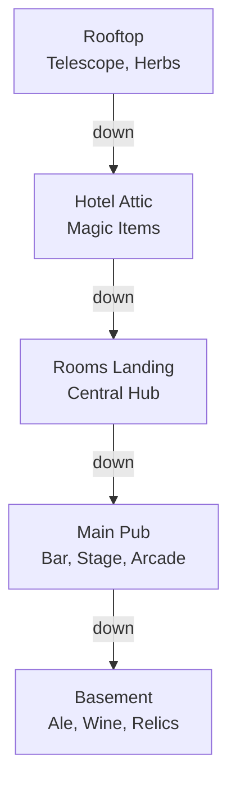
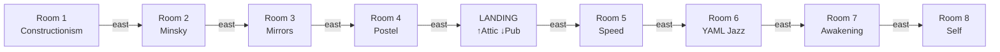
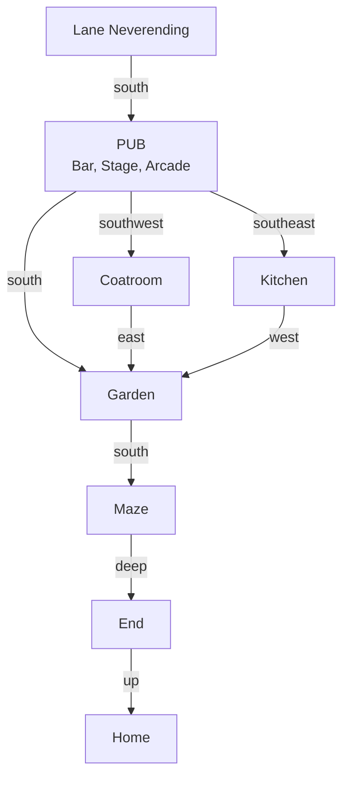
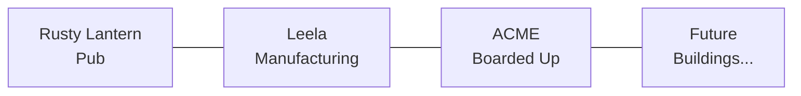
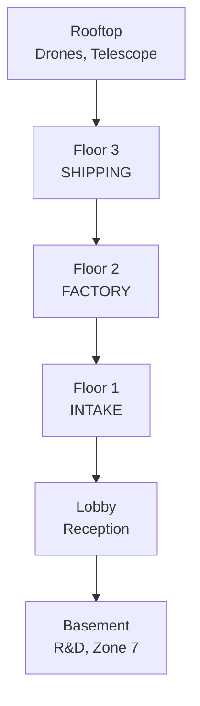
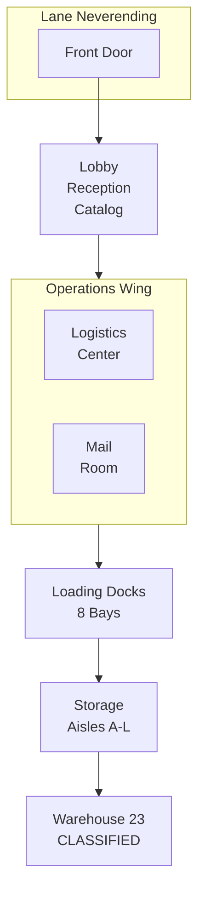
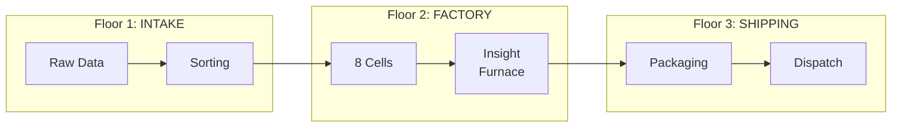
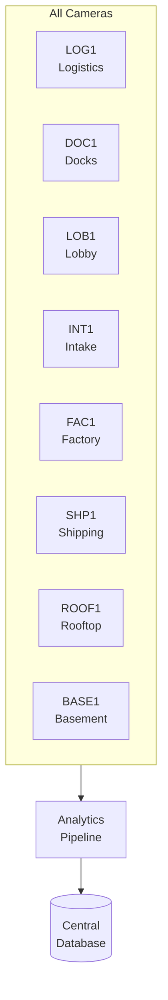
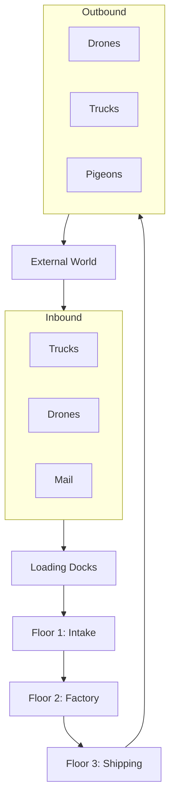
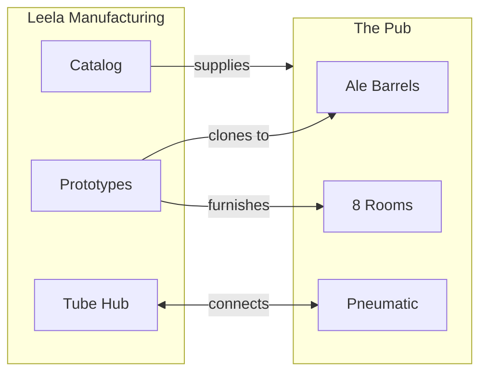

# World Tour: Lane Neverending & Leela Manufacturing
## A Grand Tour of the New World

**Date:** January 14, 2026  
**Location:** The Rusty Lantern Pub → Lane Neverending → Leela Manufacturing  
**Tour Guide:** Don Hopkins  
**Party Size:** 9 (Don + 8 adventurous friends)

---

## Quick Links

### Pub Locations
| Location | ROOM.yml | README |
|----------|----------|--------|
| Main Pub | [pub/ROOM.yml](../../../../pub/ROOM.yml) | [pub/README.md](../../../../pub/README.md) |
| Hotel Floor | [pub/rooms/ROOM.yml](../../../../pub/rooms/ROOM.yml) | — |
| Basement | [pub/basement/ROOM.yml](../../../../pub/basement/ROOM.yml) | [README](../../../../pub/basement/README.md) |
| Rooftop | [pub/rooftop/ROOM.yml](../../../../pub/rooftop/ROOM.yml) | [README](../../../../pub/rooftop/README.md) |
| Cat Cave | [pub/bar/cat-cave/ROOM.yml](../../../../pub/bar/cat-cave/ROOM.yml) | [README](../../../../pub/bar/cat-cave/README.md) |
| Palm's Nook | [pub/stage/palm-nook/ROOM.yml](../../../../pub/stage/palm-nook/ROOM.yml) | [README](../../../../pub/stage/palm-nook/README.md) |
| Garden | [garden/ROOM.yml](../../../../garden/ROOM.yml) | [README](../../../../garden/README.md) |
| Maze | [maze/ROOM.yml](../../../../maze/ROOM.yml) | [README](../../../../maze/README.md) |

### Leela Manufacturing Locations
| Location | ROOM.yml | README |
|----------|----------|--------|
| Main Building | [leela-manufacturing/ROOM.yml](../../../../street/lane-neverending/leela-manufacturing/ROOM.yml) | [README](../../../../street/lane-neverending/leela-manufacturing/README.md) |
| Lobby | [lobby/ROOM.yml](../../../../street/lane-neverending/leela-manufacturing/lobby/ROOM.yml) | [README](../../../../street/lane-neverending/leela-manufacturing/lobby/README.md) |
| Logistics Center | [logistics/ROOM.yml](../../../../street/lane-neverending/leela-manufacturing/logistics/ROOM.yml) | [README](../../../../street/lane-neverending/leela-manufacturing/logistics/README.md) |
| Loading Docks | [loading-docks/ROOM.yml](../../../../street/lane-neverending/leela-manufacturing/loading-docks/ROOM.yml) | [README](../../../../street/lane-neverending/leela-manufacturing/loading-docks/README.md) |
| Floor 1 (Intake) | [floor-1/ROOM.yml](../../../../street/lane-neverending/leela-manufacturing/floor-1/ROOM.yml) | [README](../../../../street/lane-neverending/leela-manufacturing/floor-1/README.md) |
| Floor 2 (Factory) | [floor-2/ROOM.yml](../../../../street/lane-neverending/leela-manufacturing/floor-2/ROOM.yml) | [README](../../../../street/lane-neverending/leela-manufacturing/floor-2/README.md) |
| Floor 3 (Shipping) | [floor-3/ROOM.yml](../../../../street/lane-neverending/leela-manufacturing/floor-3/ROOM.yml) | [README](../../../../street/lane-neverending/leela-manufacturing/floor-3/README.md) |
| Storage | [storage/ROOM.yml](../../../../street/lane-neverending/leela-manufacturing/storage/ROOM.yml) | [README](../../../../street/lane-neverending/leela-manufacturing/storage/README.md) |
| Warehouse 23 | [warehouse-23/ROOM.yml](../../../../street/lane-neverending/leela-manufacturing/warehouse-23/ROOM.yml) | [README](../../../../street/lane-neverending/leela-manufacturing/warehouse-23/README.md) |
| Rooftop | [rooftop/ROOM.yml](../../../../street/lane-neverending/leela-manufacturing/rooftop/ROOM.yml) | [README](../../../../street/lane-neverending/leela-manufacturing/rooftop/README.md) |

### Characters
| Character | File | Location |
|-----------|------|----------|
| Palm | [CHARACTER.yml](../../animals/palm/CHARACTER.yml) | [Palm's Nook](../../../../pub/stage/palm-nook/ROOM.yml) |
| Biscuit | [CHARACTER.yml](../../animals/biscuit/CHARACTER.yml) | [Cat Cave](../../../../pub/bar/cat-cave/biscuits-spot/ROOM.yml) |
| Selfie | [selfie.yml](../../../../pub/rooms/room-8/selfie.yml) | [Room 8](../../../../pub/rooms/room-8/ROOM.yml) |
| Marieke | [budtender-marieke.yml](../../../../pub/bar/budtender-marieke.yml) | [Bar](../../../../pub/bar/ROOM.yml) |

### Design Documents
| Document | Link |
|----------|------|
| MOOLLM Manifesto | [MOOLLM-MANIFESTO.md](../../../../../designs/MOOLLM-MANIFESTO.md) |
| Factorio Logistics | [factorio-logistics-protocol.md](../../../../../designs/factorio-logistics-protocol.md) |
| Cursor Self-Review | [cursor-self-review.md](../../../../../designs/cursor-self-review.md) |
| Sims Design Index | [sims-design-index.md](../../../../../designs/sims-design-index.md) |

### Skills Referenced
| Skill | CARD | README |
|-------|------|--------|
| Prototype | [CARD.yml](../../../../../skills/prototype/CARD.yml) | [README](../../../../../skills/prototype/README.md) |
| Container | [CARD.yml](../../../../../skills/container/CARD.yml) | [README](../../../../../skills/container/README.md) |
| Logistic Container | [CARD.yml](../../../../../skills/logistic-container/CARD.yml) | [README](../../../../../skills/logistic-container/README.md) |
| Data Flow | [CARD.yml](../../../../../skills/data-flow/CARD.yml) | [README](../../../../../skills/data-flow/README.md) |
| Robust First | [CARD.yml](../../../../../skills/robust-first/CARD.yml) | [README](../../../../../skills/robust-first/README.md) |
| Manufacturing Intelligence | [CARD.yml](../../../../../skills/manufacturing-intelligence/CARD.yml) | [README](../../../../../skills/manufacturing-intelligence/README.md) |

---

## The Tour Group Assembles

*The bar at the Rusty Lantern buzzes with anticipation.*

### The Party

| # | Name | Role | Links |
|---|------|------|-------|
| 1 | **Don Hopkins** | Tour guide, world architect | [CHARACTER.yml](../CHARACTER.yml) |
| 2 | **Palm** | Spider monkey, philosopher | [CHARACTER.yml](../../animals/palm/CHARACTER.yml), [Essays](../../../../pub/stage/palm-nook/study/palm-on-being-palm.md) |
| 3 | **Marieke** | Bartender, budtender | [budtender-marieke.yml](../../../../pub/bar/budtender-marieke.yml) |
| 4 | **Selfie** | Room 8 prototype | [selfie.yml](../../../../pub/rooms/room-8/selfie.yml) |
| 5 | **Archie** | Deployment Specialist | [Deep Storage](../../../../street/lane-neverending/leela-manufacturing/storage/deep-storage/ROOM.yml) |
| 6 | **Stamp** | Postmaster General | [Mail Room](../../../../street/lane-neverending/leela-manufacturing/mail-room/ROOM.yml) |
| 7 | **The Coordinator** | Logistics Supervisor | [Logistics](../../../../street/lane-neverending/leela-manufacturing/logistics/ROOM.yml) |
| 8 | **Dolly** | Legendary Forklift | [dolly-forklift.yml](../../../../street/lane-neverending/leela-manufacturing/storage/dolly-forklift.yml) |
| 9 | **Cell G** | Philosophical Processor | [processing-cells.yml](../../../../street/lane-neverending/leela-manufacturing/floor-2/processing-cells.yml) |

---

## Part 1: The Rusty Lantern Pub

### Vertical Layout

**Vertical Navigation:** Only the Rooms Landing (central hub) connects up/down. Individual rooms connect horizontally to the hub.

### Hotel Floor Layout

**Hotel Floor Navigation:**
| From | Direction | To |
|------|-----------|-----|
| Pub | up | Rooms Landing |
| Rooms Landing | down | Pub |
| Rooms Landing | up | Attic |
| Attic | down | Rooms Landing |
| Rooms Landing | west | Room 4 |
| Rooms Landing | east | Room 5 |
| Room 1 | east | Room 2 |
| Room 2 | west | Room 1, east | Room 3 |
| Room 3 | west | Room 2, east | Room 4 |
| Room 4 | west | Room 3, east | Landing |
| Room 5 | west | Landing, east | Room 6 |
| Room 6 | west | Room 5, east | Room 7 |
| Room 7 | west | Room 6, east | Room 8 |
| Room 8 | west | Room 7 |

**Centrality:** 4 rooms west of hub (1-4), 4 rooms east of hub (5-8). The landing is the only vertical connection point.

### Horizontal Layout (Ground Level)

**Spatial Navigation:**
| From | Direction | To |
|------|-----------|-----|
| Lane | south | Pub |
| Pub | south | Garden |
| Pub | southwest | Coatroom |
| Pub | southeast | Kitchen |
| Coatroom | east | Garden |
| Coatroom | northeast | Pub |
| Kitchen | west | Garden |
| Kitchen | northwest | Pub |
| Garden | north | Pub |
| Garden | west | Coatroom |
| Garden | east | Kitchen |
| Garden | south | Maze |

**Multiple Paths to Garden:**
- Direct: Pub → south → Garden
- Via Coatroom: Pub → southwest → Coatroom → east → Garden
- Via Kitchen: Pub → southeast → Kitchen → west → Garden

### Featured Pub Artifacts

| Artifact | Location | File | What It Does |
|----------|----------|------|--------------|
| Telescope | Rooftop | [telescope.yml](../../../../pub/rooftop/telescope.yml) | Shows LLOOOOMM constellation |
| LLOOOOMM Stars | Rooftop | [lloooomm-constellation.yml](../../../../pub/rooftop/lloooomm-constellation.yml) | Eight stars for eight letters |
| Infinite Typewriters | Palm's Study | [infinite-typewriters.yml](../../../../pub/stage/palm-nook/study/infinite-typewriters.yml) | Shakespeare generators |
| Logo Turtle | Room 1 | [logo-turtle.yml](../../../../pub/rooms/room-1/logo-turtle.yml) | Constructionism mascot |
| Ultimate Machine | Room 2 | [ultimate-machine.yml](../../../../pub/rooms/room-2/ultimate-machine.yml) | Minsky's self-turning-off machine |
| Clone-O-Matic | Room 8 | [clone-o-matic.yml](../../../../pub/rooms/room-8/clone-o-matic.yml) | Prototype cloning device |
| Transmogrifier | Room 8 | [transmogrifier.yml](../../../../pub/rooms/room-8/transmogrifier.yml) | Type transformation |
| Ale Barrel | Basement | [ale-barrel.yml](../../../../pub/basement/ale-barrel.yml) | Leela prototype instance |
| Relic Shelf | Basement | [relic-shelf.yml](../../../../pub/basement/relic-shelf.yml) | Paradox-safe storage |

### The Hotel Floor (8 Rooms + Central Hub)

| Location | Theme | Key Artifact | Exits |
|----------|-------|--------------|-------|
| Room 1 | [Constructionism](../../../../pub/rooms/room-1/ROOM.yml) | [Logo Turtle](../../../../pub/rooms/room-1/logo-turtle.yml) | east→2 |
| Room 2 | [Minsky/Mind](../../../../pub/rooms/room-2/ROOM.yml) | [Ultimate Machine](../../../../pub/rooms/room-2/ultimate-machine.yml) | west→1, east→3 |
| Room 3 | [Mirrors](../../../../pub/rooms/room-3/ROOM.yml) | [Thinking Mirror](../../../../pub/rooms/room-3/thinking-mirror.yml) | west→2, east→4 |
| Room 4 | [Postel/YAML](../../../../pub/rooms/room-4/ROOM.yml) | [Orchid of Postel](../../../../pub/rooms/room-4/orchid-of-postel.yml) | west→3, east→Landing |
| **Landing** | [Rooms Hub](../../../../pub/rooms/ROOM.yml) | Ice Machine, Soda Machine | west→4, east→5, up→Attic, down→Pub |
| Room 5 | [Speed Games](../../../../pub/rooms/room-5/ROOM.yml) | [Ensemble Stage](../../../../pub/rooms/room-5/ensemble-stage.yml) | west→Landing, east→6 |
| Room 6 | [YAML Jazz](../../../../pub/rooms/room-6/ROOM.yml) | [Jazz Typewriter](../../../../pub/rooms/room-6/jazz-typewriter.yml) | west→5, east→7 |
| Room 7 | [Awakening](../../../../pub/rooms/room-7/ROOM.yml) | [Awakening Chamber](../../../../pub/rooms/room-7/awakening-chamber.yml) | west→6, east→8 |
| Room 8 | [Self Language](../../../../pub/rooms/room-8/ROOM.yml) | [Soul Forge](../../../../pub/rooms/room-8/self-soul-forge.yml) | west→7 |
| Attic | [Magical Items](../../../../pub/rooms/attic/ROOM.yml) | [Probability Goggles](../../../../pub/rooms/attic/probability-goggles.yml) | down→Landing |

### The Cat Cave & Residents

| Cat | File | Personality |
|-----|------|-------------|
| Stroopwafel | [cat-stroopwafel.yml](../../../../pub/bar/cat-cave/cat-stroopwafel.yml) | Sweet, layered |
| Terpie | [cat-terpie.yml](../../../../pub/bar/cat-cave/cat-terpie.yml) | Aromatic elder |
| Myrcene | [kitten-myrcene.yml](../../../../pub/bar/cat-cave/kitten-myrcene.yml) | Earthy, relaxing |
| Limonene | [kitten-limonene.yml](../../../../pub/bar/cat-cave/kitten-limonene.yml) | Citrus, uplifting |
| Pinene | [kitten-pinene.yml](../../../../pub/bar/cat-cave/kitten-pinene.yml) | Piney, alert |
| Linalool | [kitten-linalool.yml](../../../../pub/bar/cat-cave/kitten-linalool.yml) | Floral, calming |
| Caryophyllene | [kitten-caryophyllene.yml](../../../../pub/bar/cat-cave/kitten-caryophyllene.yml) | Spicy, anti-inflammatory |
| Humulene | [kitten-humulene.yml](../../../../pub/bar/cat-cave/kitten-humulene.yml) | Hoppy, appetite suppressant |
| Ocimene | [kitten-ocimene.yml](../../../../pub/bar/cat-cave/kitten-ocimene.yml) | Sweet, herbaceous |
| Terpinolene | [kitten-terpinolene.yml](../../../../pub/bar/cat-cave/kitten-terpinolene.yml) | Complex, fresh |
| Biscuit | [biscuits-spot/ROOM.yml](../../../../pub/bar/cat-cave/biscuits-spot/ROOM.yml) | Dog pretending to be cat |

---

## Part 2: Lane Neverending

The street that anchors the world. See [street/README.md](../../../../street/README.md).

| Building | Status | Link |
|----------|--------|------|
| The Rusty Lantern | Active | [pub/ROOM.yml](../../../../pub/ROOM.yml) |
| Leela Manufacturing | Active | [leela-manufacturing/ROOM.yml](../../../../street/lane-neverending/leela-manufacturing/ROOM.yml) |
| ACME Storefront | Boarded | Coming soon... |

---

## Part 3: Leela Manufacturing Intelligence

### Building Cross-Section

### Ground Level Floor Plan

### All Leela Rooms

| Level | Room | ROOM.yml | README | Key Objects |
|-------|------|----------|--------|-------------|
| Roof | Rooftop | [ROOM.yml](../../../../street/lane-neverending/leela-manufacturing/rooftop/ROOM.yml) | [README](../../../../street/lane-neverending/leela-manufacturing/rooftop/README.md) | [drone-pads](../../../../street/lane-neverending/leela-manufacturing/rooftop/drone-pads.yml), [telescope](../../../../street/lane-neverending/leela-manufacturing/rooftop/telescope.yml) |
| 3 | Shipping | [ROOM.yml](../../../../street/lane-neverending/leela-manufacturing/floor-3/ROOM.yml) | [README](../../../../street/lane-neverending/leela-manufacturing/floor-3/README.md) | [departure-board](../../../../street/lane-neverending/leela-manufacturing/floor-3/departure-board.yml) |
| 2 | Factory | [ROOM.yml](../../../../street/lane-neverending/leela-manufacturing/floor-2/ROOM.yml) | [README](../../../../street/lane-neverending/leela-manufacturing/floor-2/README.md) | [processing-cells](../../../../street/lane-neverending/leela-manufacturing/floor-2/processing-cells.yml), [insight-furnace](../../../../street/lane-neverending/leela-manufacturing/floor-2/insight-furnace.yml) |
| 1 | Intake | [ROOM.yml](../../../../street/lane-neverending/leela-manufacturing/floor-1/ROOM.yml) | [README](../../../../street/lane-neverending/leela-manufacturing/floor-1/README.md) | [conveyor-system](../../../../street/lane-neverending/leela-manufacturing/floor-1/conveyor-system.yml), [sorting-stations](../../../../street/lane-neverending/leela-manufacturing/floor-1/sorting-stations.yml) |
| G | Lobby | [ROOM.yml](../../../../street/lane-neverending/leela-manufacturing/lobby/ROOM.yml) | [README](../../../../street/lane-neverending/leela-manufacturing/lobby/README.md) | [leela-catalog](../../../../street/lane-neverending/leela-manufacturing/lobby/leela-catalog.yml) |
| G | Logistics | [ROOM.yml](../../../../street/lane-neverending/leela-manufacturing/logistics/ROOM.yml) | [README](../../../../street/lane-neverending/leela-manufacturing/logistics/README.md) | [operator-stations](../../../../street/lane-neverending/leela-manufacturing/logistics/operator-stations.yml), [central-database](../../../../street/lane-neverending/leela-manufacturing/logistics/central-database.yml) |
| G | Mail Room | [ROOM.yml](../../../../street/lane-neverending/leela-manufacturing/mail-room/ROOM.yml) | [README](../../../../street/lane-neverending/leela-manufacturing/mail-room/README.md) | [pneumatic-terminal](../../../../street/lane-neverending/leela-manufacturing/mail-room/pneumatic-terminal.yml), [pigeon-cages](../../../../street/lane-neverending/leela-manufacturing/mail-room/pigeon-cages.yml) |
| G | Loading Docks | [ROOM.yml](../../../../street/lane-neverending/leela-manufacturing/loading-docks/ROOM.yml) | [README](../../../../street/lane-neverending/leela-manufacturing/loading-docks/README.md) | [dock-office](../../../../street/lane-neverending/leela-manufacturing/loading-docks/dock-office.yml), [drone-station](../../../../street/lane-neverending/leela-manufacturing/loading-docks/drone-station.yml) |
| G | Storage | [ROOM.yml](../../../../street/lane-neverending/leela-manufacturing/storage/ROOM.yml) | [README](../../../../street/lane-neverending/leela-manufacturing/storage/README.md) | [cloning-station](../../../../street/lane-neverending/leela-manufacturing/storage/cloning-station.yml), [dolly-forklift](../../../../street/lane-neverending/leela-manufacturing/storage/dolly-forklift.yml) |
| G | Deep Storage | [ROOM.yml](../../../../street/lane-neverending/leela-manufacturing/storage/deep-storage/ROOM.yml) | [README](../../../../street/lane-neverending/leela-manufacturing/storage/deep-storage/README.md) | [deployment-console](../../../../street/lane-neverending/leela-manufacturing/storage/deep-storage/deployment-console.yml) |
| B | Basement | [ROOM.yml](../../../../street/lane-neverending/leela-manufacturing/basement/ROOM.yml) | [README](../../../../street/lane-neverending/leela-manufacturing/basement/README.md) | [zone-7-door](../../../../street/lane-neverending/leela-manufacturing/basement/zone-7-door.yml) |
| B | Warehouse 23 | [ROOM.yml](../../../../street/lane-neverending/leela-manufacturing/warehouse-23/ROOM.yml) | [README](../../../../street/lane-neverending/leela-manufacturing/warehouse-23/README.md) | [card-catalog](../../../../street/lane-neverending/leela-manufacturing/warehouse-23/card-catalog.yml) |

---

## Part 4: The Knowledge Pipeline

### The Eight Processing Cells

| Cell | Specialization | File Reference |
|------|----------------|----------------|
| A | Manufacturing Optimization | [processing-cells.yml](../../../../street/lane-neverending/leela-manufacturing/floor-2/processing-cells.yml) |
| B | Logistics Algorithms | — |
| C | Product Design | — |
| D | Quality Assurance | — |
| E | Urgent Processing (HOT) | — |
| F | Creative Solutions | — |
| G | Philosophical Questions | Cell G on the tour! |
| H | Research Integration | — |

---

## Part 5: The Logistics Center

The nerve center. See [logistics/README.md](../../../../street/lane-neverending/leela-manufacturing/logistics/README.md).

### The Eight Operator Stations

| Station | System | Monitors | File |
|---------|--------|----------|------|
| A | Dock Control | 8 loading bays | [operator-stations.yml](../../../../street/lane-neverending/leela-manufacturing/logistics/operator-stations.yml) |
| B | Floor Operations | Production cells | — |
| C | Aerial Operations | Drone fleet | — |
| D | Pneumatic Network | Tube routing | [pneumatic-hub.yml](../../../../street/lane-neverending/leela-manufacturing/logistics/pneumatic-hub.yml) |
| E | Vertical Transport | Elevators | — |
| F | Signal Networks | WiFi, SCADA | [signal-rack.yml](../../../../street/lane-neverending/leela-manufacturing/logistics/signal-rack.yml) |
| G | Central Database | All records | [central-database.yml](../../../../street/lane-neverending/leela-manufacturing/logistics/central-database.yml) |
| H | Security | Cameras, access | — |

### Key Logistics Objects

| Object | File | Function |
|--------|------|----------|
| Central Display | [central-display.yml](../../../../street/lane-neverending/leela-manufacturing/logistics/central-display.yml) | 3D facility map |
| Big Board | [big-board.yml](../../../../street/lane-neverending/leela-manufacturing/logistics/big-board.yml) | Real-time metrics |
| Signal Rack | [signal-rack.yml](../../../../street/lane-neverending/leela-manufacturing/logistics/signal-rack.yml) | Network infrastructure |
| Coffee Station | [coffee-station.yml](../../../../street/lane-neverending/leela-manufacturing/logistics/coffee-station.yml) | Essential fuel |
| Camera LOG1 | [camera-log1.yml](../../../../street/lane-neverending/leela-manufacturing/logistics/camera-log1.yml) | First Eye of Leela |

---

## Part 6: Camera Analytics

### The Camera Network

| Camera | Location | File | Watches |
|--------|----------|------|---------|
| LOG1 | Logistics | [camera-log1.yml](../../../../street/lane-neverending/leela-manufacturing/logistics/camera-log1.yml) | All operations |
| DOC1 | Loading Docks | [camera-doc1.yml](../../../../street/lane-neverending/leela-manufacturing/loading-docks/camera-doc1.yml) | Trucks, Dolly |
| LOB1 | Lobby | [camera-lob1.yml](../../../../street/lane-neverending/leela-manufacturing/lobby/camera-lob1.yml) | Visitors |
| INT1 | Floor 1 | [camera-int1.yml](../../../../street/lane-neverending/leela-manufacturing/floor-1/camera-int1.yml) | Conveyors |
| FAC1 | Floor 2 | [camera-fac1.yml](../../../../street/lane-neverending/leela-manufacturing/floor-2/camera-fac1.yml) | Processing |
| SHP1 | Floor 3 | [camera-shp1.yml](../../../../street/lane-neverending/leela-manufacturing/floor-3/camera-shp1.yml) | Packaging |
| ROOF1 | Rooftop | [camera-roof1.yml](../../../../street/lane-neverending/leela-manufacturing/rooftop/camera-roof1.yml) | Drones |
| BASE1 | Basement | [camera-base1.yml](../../../../street/lane-neverending/leela-manufacturing/basement/camera-base1.yml) | R&D (redacted) |

---

## Part 7: Data Flow

### Parallel Networks

| Network | Hub | Connects |
|---------|-----|----------|
| Pneumatic | [pneumatic-hub.yml](../../../../street/lane-neverending/leela-manufacturing/logistics/pneumatic-hub.yml) | All floors + Pub |
| Signal | [signal-rack.yml](../../../../street/lane-neverending/leela-manufacturing/logistics/signal-rack.yml) | WiFi, SCADA, cameras |
| Database | [central-database.yml](../../../../street/lane-neverending/leela-manufacturing/logistics/central-database.yml) | All records |
| Elevators | — | Passenger + Freight |

---

## Part 8: The Leela Catalog Tour

The complete catalog: [leela-catalog.yml](../../../../street/lane-neverending/leela-manufacturing/lobby/leela-catalog.yml)

### Featured Products

| Category | Products | Why Better Than ACME |
|----------|----------|---------------------|
| **Drones** | Courier Light, Delivery Medium, Cargo Heavy, Survey, Swarm | Actually fly straight |
| **Horses** | Draft, Matched Pairs, Carriages, Stable Kits | Ethically treated |
| **Pneumatic** | Smart Stations, Glass Tubes, Capsules, Junctions | Whoosh not splat |
| **Signage** | DO NOT PRESS, WRONG LINE, BEWARE OF DOG | 100% effective irony |
| **Inserters** | Basic, Fast, Stack, Long, Filter | Pick things up correctly |
| **Self-Healing** | Recovery Module, Network Module | Robust-First philosophy |

### Prototype Aisles

| Aisle | Contents | PROTOTYPES.yml |
|-------|----------|----------------|
| A | Wooden containers | [aisle-a/PROTOTYPES.yml](../../../../street/lane-neverending/leela-manufacturing/storage/aisle-a/PROTOTYPES.yml) |
| B | Metal containers | [aisle-b/PROTOTYPES.yml](../../../../street/lane-neverending/leela-manufacturing/storage/aisle-b/PROTOTYPES.yml) |
| C | Soft containers | [aisle-c/PROTOTYPES.yml](../../../../street/lane-neverending/leela-manufacturing/storage/aisle-c/PROTOTYPES.yml) |
| D | Special containers | [aisle-d/PROTOTYPES.yml](../../../../street/lane-neverending/leela-manufacturing/storage/aisle-d/PROTOTYPES.yml) |
| E | Display fixtures | [aisle-e/PROTOTYPES.yml](../../../../street/lane-neverending/leela-manufacturing/storage/aisle-e/PROTOTYPES.yml) |
| L | Leela Premium | [aisle-l/PROTOTYPES.yml](../../../../street/lane-neverending/leela-manufacturing/storage/aisle-l/PROTOTYPES.yml) |

### Architectural Prefabs

In [deep-storage/](../../../../street/lane-neverending/leela-manufacturing/storage/deep-storage/):

| Section | Types | Deploy With |
|---------|-------|-------------|
| S | Shelters (Fallout, Panic) | [deployment-console.yml](../../../../street/lane-neverending/leela-manufacturing/storage/deep-storage/deployment-console.yml) |
| L | Lairs (Mad Scientist, Villain) | — |
| T | Towers (Ivory, Wizard, Clock) | — |
| D | Domiciles (Cozy, Grand) | — |
| W | Workspaces (Factory, Studio) | — |
| V | Venues (Theater, Temple) | — |
| X | Experimental (Non-Euclidean) | — |

---

## Part 9: Warehouse 23

See [warehouse-23/README.md](../../../../street/lane-neverending/leela-manufacturing/warehouse-23/README.md).

| Object | File | Status |
|--------|------|--------|
| Card Catalog | [card-catalog.yml](../../../../street/lane-neverending/leela-manufacturing/warehouse-23/card-catalog.yml) | Partially readable |
| Retrieval Forms | [retrieval-forms.yml](../../../../street/lane-neverending/leela-manufacturing/warehouse-23/retrieval-forms.yml) | Triple signature required |
| Emergency Kit | [emergency-kit.yml](../../../../street/lane-neverending/leela-manufacturing/warehouse-23/emergency-kit.yml) | Break glass in case |
| Warehouse Forklift | [warehouse-forklift.yml](../../../../street/lane-neverending/leela-manufacturing/warehouse-23/warehouse-forklift.yml) | Haunted? |
| The Main Crate | — | Top men working on it |

---

## Part 10: How It All Synergizes

### Key Connections

| From | To | Connection Type | Evidence |
|------|----|-----------------|----------|
| Leela Storage | Pub Basement | Prototype → Instance | [ale-barrel.yml](../../../../pub/basement/ale-barrel.yml) inherits from Leela |
| Leela Mail | Pub Garden | Pneumatic Tube | [pneumatic-tube.yml](../../../../pub/pneumatic-tube.yml) |
| Room 8 | Self Language Skill | Prototype Philosophy | [prototype/README.md](../../../../../skills/prototype/README.md) |
| Logistics | All Cameras | Signal Network | [signal-rack.yml](../../../../street/lane-neverending/leela-manufacturing/logistics/signal-rack.yml) |
| Central DB | Everything | Knowledge Store | [central-database.yml](../../../../street/lane-neverending/leela-manufacturing/logistics/central-database.yml) |

---

## Epilogue

*The tour group returns to the pub. Marieke has drinks ready.*

**Don:** "We've seen how it all connects. The Pub is a showcase of Leela products. Leela manufactures the conditions for intelligence. The street connects everything."

**Palm:** *signing from the curtain rod* "And there's so much more to build."

**Dolly:** *happy beep*

---

## Tour Statistics

| Metric | Count |
|--------|-------|
| Rooms visited | 24 |
| Cameras seen | 8 |
| Operator stations | 8 |
| Processing cells | 8 |
| Hotel rooms | 8 |
| Kittens named | 8 |
| Prototype aisles | 6 |
| Pneumatic connections | 8 |
| Forklift dances | 1 |
| Top men | Classified |

---

## Related Sessions

| Session | Link |
|---------|------|
| 99 Bottles & Speed of Light | [99-bottles-speed-of-light.md](./99-bottles-speed-of-light.md) |
| K-Line Connections | [k-line-connections.md](./k-line-connections.md) |
| Marathon Session | [marathon-session.md](./marathon-session.md) |
| Adventure Uplift | [adventure-uplift.md](./adventure-uplift.md) |
