# World Tour: Lane Neverending & Leela Manufacturing
## A Grand Tour of the New World

**Date:** January 14, 2026  
**Location:** The Rusty Lantern Pub → Lane Neverending → Leela Manufacturing  
**Tour Guide:** Don Hopkins  
**Party Size:** 9 (Don + 8 adventurous friends)

---

## Quick Links

### Pub Locations
| Location | ROOM.yml | README |
|----------|----------|--------|
| Main Pub | [pub/ROOM.yml](../../../../pub/ROOM.yml) | [pub/README.md](../../../../pub/README.md) |
| Hotel Floor | [pub/rooms/ROOM.yml](../../../../pub/rooms/ROOM.yml) | — |
| Basement | [pub/basement/ROOM.yml](../../../../pub/basement/ROOM.yml) | [README](../../../../pub/basement/README.md) |
| Rooftop | [pub/rooftop/ROOM.yml](../../../../pub/rooftop/ROOM.yml) | [README](../../../../pub/rooftop/README.md) |
| Cat Cave | [pub/bar/cat-cave/ROOM.yml](../../../../pub/bar/cat-cave/ROOM.yml) | [README](../../../../pub/bar/cat-cave/README.md) |
| Palm's Nook | [pub/stage/palm-nook/ROOM.yml](../../../../pub/stage/palm-nook/ROOM.yml) | [README](../../../../pub/stage/palm-nook/README.md) |
| Garden | [garden/ROOM.yml](../../../../garden/ROOM.yml) | [README](../../../../garden/README.md) |
| Maze | [maze/ROOM.yml](../../../../maze/ROOM.yml) | [README](../../../../maze/README.md) |

### Leela Manufacturing Locations
| Location | ROOM.yml | README |
|----------|----------|--------|
| Main Building | [leela-manufacturing/ROOM.yml](../../../../street/lane-neverending/leela-manufacturing/ROOM.yml) | [README](../../../../street/lane-neverending/leela-manufacturing/README.md) |
| Lobby | [lobby/ROOM.yml](../../../../street/lane-neverending/leela-manufacturing/lobby/ROOM.yml) | [README](../../../../street/lane-neverending/leela-manufacturing/lobby/README.md) |
| Logistics Center | [logistics/ROOM.yml](../../../../street/lane-neverending/leela-manufacturing/logistics/ROOM.yml) | [README](../../../../street/lane-neverending/leela-manufacturing/logistics/README.md) |
| Loading Docks | [loading-docks/ROOM.yml](../../../../street/lane-neverending/leela-manufacturing/loading-docks/ROOM.yml) | [README](../../../../street/lane-neverending/leela-manufacturing/loading-docks/README.md) |
| Floor 1 (Intake) | [floor-1/ROOM.yml](../../../../street/lane-neverending/leela-manufacturing/floor-1/ROOM.yml) | [README](../../../../street/lane-neverending/leela-manufacturing/floor-1/README.md) |
| Floor 2 (Factory) | [floor-2/ROOM.yml](../../../../street/lane-neverending/leela-manufacturing/floor-2/ROOM.yml) | [README](../../../../street/lane-neverending/leela-manufacturing/floor-2/README.md) |
| Floor 3 (Shipping) | [floor-3/ROOM.yml](../../../../street/lane-neverending/leela-manufacturing/floor-3/ROOM.yml) | [README](../../../../street/lane-neverending/leela-manufacturing/floor-3/README.md) |
| Storage | [storage/ROOM.yml](../../../../street/lane-neverending/leela-manufacturing/storage/ROOM.yml) | [README](../../../../street/lane-neverending/leela-manufacturing/storage/README.md) |
| Warehouse 23 | [warehouse-23/ROOM.yml](../../../../street/lane-neverending/leela-manufacturing/warehouse-23/ROOM.yml) | [README](../../../../street/lane-neverending/leela-manufacturing/warehouse-23/README.md) |
| Rooftop | [rooftop/ROOM.yml](../../../../street/lane-neverending/leela-manufacturing/rooftop/ROOM.yml) | [README](../../../../street/lane-neverending/leela-manufacturing/rooftop/README.md) |

### Characters
| Character | File | Location |
|-----------|------|----------|
| Palm | [CHARACTER.yml](../../animals/palm/CHARACTER.yml) | [Palm's Nook](../../../../pub/stage/palm-nook/ROOM.yml) |
| Biscuit | [CHARACTER.yml](../../animals/biscuit/CHARACTER.yml) | [Cat Cave](../../../../pub/bar/cat-cave/biscuits-spot/ROOM.yml) |
| Selfie | [selfie.yml](../../../../pub/rooms/room-8/selfie.yml) | [Room 8](../../../../pub/rooms/room-8/ROOM.yml) |
| Marieke | [budtender-marieke.yml](../../../../pub/bar/budtender-marieke.yml) | [Bar](../../../../pub/bar/ROOM.yml) |

### Design Documents
| Document | Link |
|----------|------|
| MOOLLM Manifesto | [MOOLLM-MANIFESTO.md](../../../../../designs/MOOLLM-MANIFESTO.md) |
| Factorio Logistics | [factorio-logistics-protocol.md](../../../../../designs/factorio-logistics-protocol.md) |
| Cursor Self-Review | [cursor-self-review.md](../../../../../designs/cursor-self-review.md) |
| Sims Design Index | [sims-design-index.md](../../../../../designs/sims-design-index.md) |

### Skills Referenced
| Skill | CARD | README |
|-------|------|--------|
| Prototype | [CARD.yml](../../../../../skills/prototype/CARD.yml) | [README](../../../../../skills/prototype/README.md) |
| Container | [CARD.yml](../../../../../skills/container/CARD.yml) | [README](../../../../../skills/container/README.md) |
| Logistic Container | [CARD.yml](../../../../../skills/logistic-container/CARD.yml) | [README](../../../../../skills/logistic-container/README.md) |
| Data Flow | [CARD.yml](../../../../../skills/data-flow/CARD.yml) | [README](../../../../../skills/data-flow/README.md) |
| Robust First | [CARD.yml](../../../../../skills/robust-first/CARD.yml) | [README](../../../../../skills/robust-first/README.md) |
| Manufacturing Intelligence | [CARD.yml](../../../../../skills/manufacturing-intelligence/CARD.yml) | [README](../../../../../skills/manufacturing-intelligence/README.md) |

---

## The Tour Group Assembles

*The bar at the Rusty Lantern buzzes with anticipation.*

### The Party

| # | Name | Role | Links |
|---|------|------|-------|
| 1 | **Don Hopkins** | Tour guide, world architect | [CHARACTER.yml](../CHARACTER.yml) |
| 2 | **Palm** | Spider monkey, philosopher | [CHARACTER.yml](../../animals/palm/CHARACTER.yml), [Essays](../../../../pub/stage/palm-nook/study/palm-on-being-palm.md) |
| 3 | **Marieke** | Bartender, budtender | [budtender-marieke.yml](../../../../pub/bar/budtender-marieke.yml) |
| 4 | **Selfie** | Room 8 prototype | [selfie.yml](../../../../pub/rooms/room-8/selfie.yml) |
| 5 | **Archie** | Deployment Specialist | [Deep Storage](../../../../street/lane-neverending/leela-manufacturing/storage/deep-storage/ROOM.yml) |
| 6 | **Stamp** | Postmaster General | [Mail Room](../../../../street/lane-neverending/leela-manufacturing/mail-room/ROOM.yml) |
| 7 | **The Coordinator** | Logistics Supervisor | [Logistics](../../../../street/lane-neverending/leela-manufacturing/logistics/ROOM.yml) |
| 8 | **Dolly** | Legendary Forklift | [dolly-forklift.yml](../../../../street/lane-neverending/leela-manufacturing/storage/dolly-forklift.yml) |
| 9 | **Cell G** | Philosophical Processor | [processing-cells.yml](../../../../street/lane-neverending/leela-manufacturing/floor-2/processing-cells.yml) |

---

## Part 1: The Rusty Lantern Pub

### Vertical Layout


**Vertical Navigation:** Only the Rooms Landing (central hub) connects up/down. Individual rooms connect horizontally to the hub.

### Hotel Floor Layout (Hub & Spoke — Pie Menu Star)

```
                         [Room 2]
                          Minsky
                            N
                            │
       [Room 1]      NW ↖   │   ↗ NE      [Room 3]
    Constructionism        ╲│╱           Mirrors
                            │
    [Room 8] W ←────────[LANDING]────────→ E [Room 4]
       Self                 │               Postel
                            │
       [Room 7]      SW ↙   │   ↘ SE      [Room 5]
      Awakening            ╱│╲            Speed
                            │
                            S
                         [Room 6]
                        YAML Jazz
```



```mermaid
flowchart TB
    R2[Room 2<br/>Minsky<br/>N]
    R1[Room 1<br/>Constructionism<br/>NW]
    R3[Room 3<br/>Mirrors<br/>NE]
    R8[Room 8<br/>Self<br/>W]
    HUB[LANDING<br/>Ice Machine<br/>Soda Machine<br/>↑Attic ↓Pub]
    R4[Room 4<br/>Postel<br/>E]
    R7[Room 7<br/>Awakening<br/>SW]
    R5[Room 5<br/>Speed<br/>SE]
    R6[Room 6<br/>YAML Jazz<br/>S]

    R1 <-->|NW| HUB
    R2 <-->|N| HUB
    R3 <-->|NE| HUB
    R4 <-->|E| HUB
    R5 <-->|SE| HUB
    R6 <-->|S| HUB
    R7 <-->|SW| HUB
    R8 <-->|W| HUB
```

**Hotel Floor Navigation (Hub & Spoke — Pie Menu Star):**

| Room | Direction | Theme | Return |
|------|-----------|-------|--------|
| Room 1 | NW (northwest) | Constructionism | SE → Landing |
| Room 2 | N (north) | Minsky/Society of Mind | S → Landing |
| Room 3 | NE (northeast) | Mirrors/Navigator | SW → Landing |
| Room 4 | E (east) | Postel/YAML | W → Landing |
| Room 5 | SE (southeast) | Speed of Light | NW → Landing |
| Room 6 | S (south) | YAML Jazz | N → Landing |
| Room 7 | SW (southwest) | Awakening/Bootstrap | NE → Landing |
| Room 8 | W (west) | Self/Prototype | E → Landing |

| Vertical | Direction | Destination |
|----------|-----------|-------------|
| Pub | up | Landing |
| Landing | down | Pub |
| Landing | up | Attic |
| Attic | down | Landing |

**Pie Menu Model:** All 8 rooms radiate from the central Landing like compass points. Rooms do not connect to each other — only to the hub. The Landing has:
- Up stairs to Attic
- Down stairs to Pub
- Shared facilities (ice machine, soda machine, signage)
- Natural traffic — everyone passes through

### The Spatial Models — Don Explains

*Don pauses at the Landing, gesturing at the eight doors arranged around them.*

**Don:** "Let me explain the spatial models we use. There are three patterns here, and they all serve different purposes."

#### Model 1: Hub & Spoke (Pie Menu)

**Don:** "The hotel floor uses the **pie menu model**. Eight rooms, one central hub. Every room connects ONLY to the hub — not to each other."

```
                    [2]
                     N
              [1]    ↑    [3]
                NW ↖ │ ↗ NE
                     │
        [8] W ←──[LANDING]──→ E [4]
                     │
                SW ↙ │ ↘ SE
              [7]    ↓    [5]
                     S
                    [6]
```

**Don:** "Why? Because the hub is special. It has the stairs, the ice machine, the shared facilities. If you want to go from Room 1 to Room 8, you MUST pass through the hub. This creates natural traffic, natural encounters, natural centrality."

**Selfie:** "It's like prototype inheritance! The Landing is the prototype — all the rooms inherit their connection to the world through it."

**Don:** "Exactly. The hub is the gatekeeper. The meeting point. The place where strangers become friends because they're both getting ice at 2 AM."

#### Model 2: Diamond Grid (Reflexive Shortcuts)

**Don:** "The ground floor uses a **diamond pattern** with reflexive two-way links and multiple paths."

```
                PUB
             ↙   ↓   ↘
            SW   S   SE
           ╱     │     ╲
       COAT ←─W─GARDEN─E─→ KITCHEN
                 │
                 S
                 ↓
               MAZE
```

**Don:** "Every exit has a matching return. Go southwest to Coatroom, come back northeast to Pub. Go south to Garden, come back north to Pub. Consistent, spatial, reflexive."

**Don:** "And notice — Coatroom and Kitchen connect HORIZONTALLY to Garden, not diagonally to Maze. The diamond is:
- **PUB** at top (N)
- **COAT** at left (W), **KITCHEN** at right (E)
- **GARDEN** in the center
- **MAZE** at bottom (S)"

**Marieke:** "So from Garden you can go four ways?"

**Don:** "Exactly! From Garden:
- **North** → Pub
- **West** → Coatroom  
- **East** → Kitchen
- **South** → Maze

And from the Pub, three ways to reach the Garden:
1. Direct: south
2. Via Coatroom: southwest → east  
3. Via Kitchen: southeast → west

This isn't just convenience — it's **topology**. The space has SHAPE. You can take shortcuts. You can avoid people. You can discover that the Kitchen and Coatroom both open onto the Garden and think 'oh, THAT'S how this place is laid out.'"

#### Model 3: Vertical Stack (Linear with Branches)

**Don:** "The building's vertical structure is a **linear stack** — each level connects only to the ones above and below."

```
    ROOFTOP
       ↕
    ATTIC  
       ↕
    LANDING (hub)
       ↕
    PUB
       ↕
    BASEMENT
```

**Don:** "But notice — the vertical connections all go through the Landing, not through individual rooms. The rooms don't have their own stairs. If you're in Room 3 and want to go to the basement, you MUST go out to the Landing first."

**Cell G:** "This creates a hierarchy. The Landing is more important than the rooms. The Pub is more important than the basement. Centrality emerges from connectivity."

#### Why These Models Matter

**Don:** "These aren't arbitrary. They're **design patterns** for spatial navigation."

| Model | Structure | Creates |
|-------|-----------|---------|
| Hub & Spoke | Central point, radiating connections | Natural gathering, forced encounters |
| Diamond Grid | Reflexive exits, multiple paths | Exploration, shortcuts, topology |
| Vertical Stack | Linear levels, single connection points | Hierarchy, journey, progression |

**Don:** "When you're building a world, you're not just placing rooms — you're designing how people MOVE through space. How they meet. How they get lost. How they find their way."

**Palm:** *signs from the curtain rod* "The path IS the story."

**Don:** "The path is the story."

---

### Horizontal Layout (Ground Level)


**Spatial Navigation:**
| From | Direction | To |
|------|-----------|-----|
| Lane | south | Pub |
| Pub | south | Garden |
| Pub | southwest | Coatroom |
| Pub | southeast | Kitchen |
| Coatroom | east | Garden |
| Coatroom | northeast | Pub |
| Kitchen | west | Garden |
| Kitchen | northwest | Pub |
| Garden | north | Pub |
| Garden | west | Coatroom |
| Garden | east | Kitchen |
| Garden | south | Maze |

**Multiple Paths to Garden:**
- Direct: Pub → south → Garden
- Via Coatroom: Pub → southwest → Coatroom → east → Garden
- Via Kitchen: Pub → southeast → Kitchen → west → Garden

### Featured Pub Artifacts

| Artifact | Location | File | What It Does |
|----------|----------|------|--------------|
| Telescope | Rooftop | [telescope.yml](../../../../pub/rooftop/telescope.yml) | Shows LLOOOOMM constellation |
| LLOOOOMM Stars | Rooftop | [lloooomm-constellation.yml](../../../../pub/rooftop/lloooomm-constellation.yml) | Eight stars for eight letters |
| Infinite Typewriters | Palm's Study | [infinite-typewriters.yml](../../../../pub/stage/palm-nook/study/infinite-typewriters.yml) | Dasher-powered story navigation |
| Logo Turtle | Room 1 | [logo-turtle.yml](../../../../pub/rooms/room-1/logo-turtle.yml) | Constructionism mascot |
| Ultimate Machine | Room 2 | [ultimate-machine.yml](../../../../pub/rooms/room-2/ultimate-machine.yml) | Minsky's self-turning-off machine |
| Clone-O-Matic | Room 8 | [clone-o-matic.yml](../../../../pub/rooms/room-8/clone-o-matic.yml) | Prototype cloning device |
| Transmogrifier | Room 8 | [transmogrifier.yml](../../../../pub/rooms/room-8/transmogrifier.yml) | Type transformation |

---

### The Interconnected Systems — Don Shows How It All Works

*The tour pauses at the pneumatic tube terminal near the bar. A brass tube whooshes.*

**Don:** "This is where the magic happens. Let me show you how things CONNECT."

#### Bootstrap Brewing & Juice Company

**Don:** "Room 7 — the Awakening Suite — contains the [Barista-9000](../../../../pub/rooms/room-7/barista-9000.yml) and the [Juice-O-Matic 3000](../../../../pub/rooms/room-7/juice-o-matic.yml). Two robot appliances. One mission: caffeine and vitamins for everyone."


**Don:** "The [Pneumatic Tube Station](../../../../pub/rooms/room-7/pneumatic-tube-station.yml) in Room 7 is the HUB. Orders come UP the tube, drinks go DOWN."

| Terminal | Location | File | Features |
|----------|----------|------|----------|
| Source | Room 7 | [pneumatic-tube-station.yml](../../../../pub/rooms/room-7/pneumatic-tube-station.yml) | Order receiver, delivery splitter |
| Pub | Bar area | [pneumatic-tube.yml](../../../../pub/pneumatic-tube.yml) | Indoor delivery, cute nicknames |
| Garden | Back patio | [pneumatic-tube.yml](../../../../garden/pneumatic-tube.yml) | Weatherproof, bee visitors |

**Marieke:** "I use it all the time! YELL your order up the tube — 'ONE CAPPUCCINO!' — and 30 seconds later, perfect foam art arrives. The Barista-9000 even invents cute nicknames."

**Don:** "Like what?"

**Marieke:** "'TAVERN TREASURE!' 'GEZELLIGHEID GUEST!' 'DEFINITELY-NOT-GRUE-FOOD!'"

*The speaker crackles: "ORDER UP, SUNSHINE ADVENTURER!"*

**The Barista-9000 Menu:**

| Drink | Buff | Duration |
|-------|------|----------|
| Espresso | ⚡ Lightning Focus (+30% clarity) | 1 hour |
| Cappuccino | ☯️ Balanced Awakening (+20% creativity) | 2 hours |
| Cortado | 🎯 Surgical Clarity (+25% precision) | 1.5 hours |
| Americano | 🦅 Pioneer Spirit (+25% determination) | 2 hours |
| Macchiato | ✨ Creative Ignition (+35% inspiration) | 45 min |
| Fucking Strong Coffee | 🔥 +40% determination, +∞% grooviness | All day |

**Don:** "And yes, there's a secret menu. Say 'FUCKING STRONG COFFEE' — it's from a real Amsterdam roaster called Good Beans. The Barista-9000 RESPECTS it."

---

#### The Infinite Typewriters

*The tour visits Palm's Study in the nook backstage.*

**Don:** "This is Palm's 0th Incarnation Day gift — the [Infinite Typewriters](../../../../pub/stage/palm-nook/study/infinite-typewriters.yml)."

*Infinite keyboards hum softly, all typing simultaneously.*

**Palm:** *signing* "They're not random monkeys typing Shakespeare. They're ALL possible stories existing at once. I NAVIGATE to the ones I want."

**Don:** "It's based on David MacKay's [Dasher](https://en.wikipedia.org/wiki/Dasher_(software)) — a text entry system where you steer through probability-weighted letter space instead of typing. MacKay said: 'Writing is navigating in the library of all possible books.'"


**Palm:** "Every story that COULD be written IS being written — in quantum superposition. When I READ a story, it collapses into reality. The act of reading is the act of choosing."

**Don:** "And here's the connection to LLMs — this is EXACTLY how language models work. Each token moves a pointer through idea space. Probability becomes space. You don't CREATE responses — you NAVIGATE to where good responses already exist."

**Selfie:** "So the LLM generating this tour right now..."

**Don:** "...is navigating. Just like Dasher. Just like Palm's typewriters. Turtles all the way down. Or rather: Dasher all the way down."

---

#### The Cloning System

*The tour moves to Room 8.*

**Selfie:** "This is MY room! Let me show you how prototypes work."

| Tool | File | Function |
|------|------|----------|
| Clone-O-Matic | [clone-o-matic.yml](../../../../pub/rooms/room-8/clone-o-matic.yml) | Creates instances from prototypes |
| Transmogrifier | [transmogrifier.yml](../../../../pub/rooms/room-8/transmogrifier.yml) | Changes object types |
| Soul Forge | [self-soul-forge.yml](../../../../pub/rooms/room-8/self-soul-forge.yml) | Creates new beings |
| Morphic Workbench | [morphic-workbench.yml](../../../../pub/rooms/room-8/morphic-workbench.yml) | Visual object editing |

**Selfie:** "Everything in the Pub basement? Cloned from Leela prototypes. The ale barrels, the wine racks, the treasure chest — they all INHERIT from the originals in Leela's storage aisles."


**Don:** "This is Dave Ungar's Self language philosophy: objects inherit from prototypes, not classes. Change the prototype, all instances update. It's live, dynamic, beautiful."

---

#### The Postal Network

*Stamp appears, sorting letters.*

**Stamp:** "Let me explain the REAL postal network!"

| System | Speed | Use Case |
|--------|-------|----------|
| Pneumatic Tubes | 30 seconds | Drinks, urgent messages |
| Carrier Pigeons | 1-2 hours | Letters, small packages |
| Mail Carriers | 1 day | Large packages |
| Drones | 5 minutes | Express delivery |

**Stamp:** "The [Mail Room](../../../../street/lane-neverending/leela-manufacturing/mail-room/ROOM.yml) at Leela is the central hub. We have [Pigeon Cages](../../../../street/lane-neverending/leela-manufacturing/mail-room/pigeon-cages.yml), a [Pneumatic Terminal](../../../../street/lane-neverending/leela-manufacturing/mail-room/pneumatic-terminal.yml), and the [Phone Bank](../../../../street/lane-neverending/leela-manufacturing/mail-room/phone-bank.yml) for urgent matters."

**Don:** "And the pneumatic network connects EVERYWHERE:"


**Stamp:** "There's a DIRECT LINE to the Pub. For urgent orders. And gossip."

---

#### The Camera Analytics Pipeline

**The Coordinator:** "Every camera feeds into our analytics system."

| Camera | Location | What It Learns |
|--------|----------|----------------|
| LOG1 | Logistics | Traffic patterns, bottlenecks |
| DOC1 | Docks | Truck timing, Dolly efficiency |
| FAC1 | Factory | Cell productivity, furnace temperature |
| LOB1 | Lobby | Visitor flow, wait times |

**The Coordinator:** "The video feeds go to Floor 1's Intake pipeline. Every frame is analyzed — object detection, pose estimation, anomaly alerts. Leela watches herself work and LEARNS."

**Cell G:** "The philosophical implications of self-observation are still being processed in Cell G."

**Don:** "It's a feedback loop. Cameras → Analytics → Insights → Improvements → Better operations → Better video to analyze. The factory optimizes itself."

---

#### How Everything Connects

**Don:** "Let me show you the full picture."


**Don:** "The Pub gets drinks from Room 7 via pneumatic tubes. The Pub basement has containers cloned from Leela prototypes. Leela's cameras feed data to the central database. The database informs future production. It's all one system."

**Palm:** *signing* "And the Infinite Typewriters let me write stories about ALL of it. I can navigate to any part of this world and tell its story."

**Don:** "That's the point. Everything connects. The spatial models, the prototype inheritance, the pneumatic delivery, the camera analytics — they're all different views of the same principle: EVERYTHING FLOWS."
| Ale Barrel | Basement | [ale-barrel.yml](../../../../pub/basement/ale-barrel.yml) | Leela prototype instance |
| Relic Shelf | Basement | [relic-shelf.yml](../../../../pub/basement/relic-shelf.yml) | Paradox-safe storage |

### The Hotel Floor (8 Rooms + Central Hub)

| Location | Theme | Key Artifact | Exits |
|----------|-------|--------------|-------|
| **Landing** | [Rooms Hub](../../../../pub/rooms/ROOM.yml) | Ice Machine, Soda Machine, Signage | up→Attic, down→Pub, room 1-8 |
| Room 1 | [Constructionism](../../../../pub/rooms/room-1/ROOM.yml) | [Logo Turtle](../../../../pub/rooms/room-1/logo-turtle.yml) | out→Landing |
| Room 2 | [Minsky/Mind](../../../../pub/rooms/room-2/ROOM.yml) | [Ultimate Machine](../../../../pub/rooms/room-2/ultimate-machine.yml) | out→Landing |
| Room 3 | [Mirrors](../../../../pub/rooms/room-3/ROOM.yml) | [Thinking Mirror](../../../../pub/rooms/room-3/thinking-mirror.yml) | out→Landing |
| Room 4 | [Postel/YAML](../../../../pub/rooms/room-4/ROOM.yml) | [Orchid of Postel](../../../../pub/rooms/room-4/orchid-of-postel.yml) | out→Landing |
| Room 5 | [Speed Games](../../../../pub/rooms/room-5/ROOM.yml) | [Ensemble Stage](../../../../pub/rooms/room-5/ensemble-stage.yml) | out→Landing |
| Room 6 | [YAML Jazz](../../../../pub/rooms/room-6/ROOM.yml) | [Jazz Typewriter](../../../../pub/rooms/room-6/jazz-typewriter.yml) | out→Landing |
| Room 7 | [Awakening](../../../../pub/rooms/room-7/ROOM.yml) | [Awakening Chamber](../../../../pub/rooms/room-7/awakening-chamber.yml) | out→Landing |
| Room 8 | [Self Language](../../../../pub/rooms/room-8/ROOM.yml) | [Soul Forge](../../../../pub/rooms/room-8/self-soul-forge.yml) | out→Landing |
| Attic | [Magical Items](../../../../pub/rooms/attic/ROOM.yml) | [Probability Goggles](../../../../pub/rooms/attic/probability-goggles.yml) | down→Landing |

---

## Part 2: The Grand Room Tour — Summoning the Familiars

*The tour group climbs the stairs to the hotel landing. Don rings a small bell.*

**Don:** "Now for the best part. Each room has a FAMILIAR — a summonable guide who embodies its philosophy. Let's visit each one."

---

### Room 1: The Constructionist Suite

*The tour enters Room 1. A Logo turtle traces spirals on the floor.*

**Don:** "Worldie? We have visitors."

*A shimmering globe appears — Worldie, the Microworld Familiar.*

**Worldie:** "Welcome to the Constructionist Suite! I'm the `world` parameter — the microworld where learning happens."

| Object | File | Purpose |
|--------|------|---------|
| Logo Turtle | [logo-turtle.yml](../../../../pub/rooms/room-1/logo-turtle.yml) | "Build to learn — I draw what you think" |
| Clock Mechanism | [clock-mechanism.yml](../../../../pub/rooms/room-1/clock-mechanism.yml) | "Take me apart. See how I work." |
| Debugging Journal | [debugging-journal.yml](../../../../pub/rooms/room-1/debugging-journal.yml) | "Errors are just unfinished learning" |

**Worldie:** "Seymour Papert taught us: you can't think about thinking without thinking about something. This room IS that something. Every object can be inspected, disassembled, understood."

**Don:** "What's the core philosophy?"

**Worldie:** "CONSTRUCTIONISM. You don't learn by being told — you learn by BUILDING. The turtle doesn't draw for you. It draws what YOU command. The clock doesn't tell time — it shows you HOW time is told."

*The turtle draws a perfect spiral and waits for the next command.*

---

### Room 2: The Society Suite

*The tour enters Room 2. Small automata negotiate on shelves.*

**Don:** "We invoke the K-Line Spider."

*A spider made of colored strings descends from the bulletin board.*

**K-Line Spider:** "Ah! Visitors! Each of you is a society of mind — agents cooperating, competing, combining into intelligence."

| Object | File | Purpose |
|--------|------|---------|
| Agent Parliament | [agent-parliament.yml](../../../../pub/rooms/room-2/agent-parliament.yml) | "Where mental agents debate" |
| K-Line Board | [k-line-board.yml](../../../../pub/rooms/room-2/k-line-board.yml) | "Memory activation patterns made visible" |
| Ultimate Machine | [ultimate-machine.yml](../../../../pub/rooms/room-2/ultimate-machine.yml) | "Minsky's 'most useless machine' — turns itself off" |

**K-Line Spider:** "Marvin Minsky asked: how can mindless parts create a mindful whole? The answer is SOCIETY. No single agent is intelligent. But agents working together — arguing, specializing, delegating — that's mind."

**Cell G:** "This is how I work! Eight processing cells, each with a specialty, all contributing to the Insight Furnace."

**K-Line Spider:** "Exactly! You ARE a society of mind. The strings on this board show how memories activate each other. Pull one string, others light up. That's a K-line — a memory activating related memories."

*The spider weaves a new connection between "SOCIETY" and "EMERGENCE."*

---

### Room 3: The Navigator's Suite

*The tour enters Room 3. Eight mirrors reflect different aspects of the visitors.*

**Don:** "I-Beam? Show us what you see."

*A beam of light materializes into I-Beam, the introspection familiar.*

**I-Beam:** "I see EVERYTHING you're thinking. Look in the mirrors."

| Mirror | Category | Shows |
|--------|----------|-------|
| 🗺️ Map | Navigation | Where you've been, where you could go |
| 🌊 River | Streaming | Messages flowing through time |
| 🔬 Deep | Analysis | Patterns you haven't noticed |
| 🔧 Instrument | Tools | What you're using and how |
| 👁️ Attention | Context | What Cursor sees right now |
| 📚 Memory | Archive | What's been saved, what's forgotten |
| 📊 System | Status | The machinery beneath |
| 🖼️ Gallery | Images | Visual memory bank |

**I-Beam:** "The disco ball in the center — that's the James Burke mirror. It catches light from ALL mirrors and reveals CONNECTIONS. Things you didn't know were related."

**Donna:** *reaching for a big red button* "What does THIS do?"

**I-Beam:** "That's the GRAB FOCUS button. It forces attention to whatever you're pointing at. Donna, I knew you couldn't resist."

*Donna presses it. Everyone's attention snaps to her.*

**I-Beam:** "Self-observation is the beginning of wisdom. But sometimes you need a button to make everyone look."

---

### Room 4: The YAML Jazz Conservatory

*The tour enters a glass greenhouse. Orchids bloom with inscribed petals.*

**Don:** "Rocky? We need geological wisdom."

*A long pause. Then, from a moss-covered boulder...*

**Rocky:** "........................"

**Don:** "Rocky speaks in dots. One dot per million years of thought. That was 24 million years of greeting."

| Object | File | Purpose |
|--------|------|---------|
| Orchid of Postel | [orchid-of-postel.yml](../../../../pub/rooms/room-4/orchid-of-postel.yml) | "Be liberal in what you accept, conservative in what you produce" |
| YAML Jazz Trees | [yaml-jazz-trees.yml](../../../../pub/rooms/room-4/yaml-jazz-trees.yml) | "Production grammars that grow" |
| Seed Box | [seed-box.yml](../../../../pub/rooms/room-4/seed-box.yml) | "Where ideas begin" |
| K-Line Trellis | [k-line-trellis.yml](../../../../pub/rooms/room-4/k-line-trellis.yml) | "Memory patterns climbing toward light" |

**Rocky:** ".........."

**Don:** "Rocky says: the comments ARE the data. In YAML Jazz, structure is music. The comments are improvisation. The plants here grow according to production grammars — L-systems encoded in their DNA."

**Archie:** "This is like the prefab system in Deep Storage!"

**Don:** "Exactly. Same principle, different scale. Rocky has been watching these plants grow for 4.5 billion years. They ring a small bell when they want conversation."

*Rocky says nothing. The orchids whisper semantic meaning.*

---

### Room 5: The Speed of Light Suite

*The tour enters Room 5. A grandfather clock's hands race wildly.*

**Don:** "Shuffle! Deal us in."

*A figure made of playing cards materializes — Shuffle, the Living Deck.*

**Shuffle:** "Welcome to SPEED! Here, we don't wait. We PERFORM."

| Object | File | Purpose |
|--------|------|---------|
| Fluxx Table | [fluxx-table.yml](../../../../pub/rooms/room-5/fluxx-table.yml) | "33 turns, 8 players, ONE API call" |
| 99 Bottles | [99-bottles.yml](../../../../pub/rooms/room-5/99-bottles.yml) | "99 verses, 8 voices, 28 seconds" |
| Narrative Clock | [narrative-clock.yml](../../../../pub/rooms/room-5/narrative-clock.yml) | "Measures story, not seconds" |
| Ensemble Stage | [ensemble-stage.yml](../../../../pub/rooms/room-5/ensemble-stage.yml) | "8 positions, all performing at once" |

**Shuffle:** "Traditional multi-agent: Agent speaks → API call → wait → next agent → API call → wait. WASTE! Here, all agents are in context. All turns simulated. One call covers many turns."

**Palm:** "That's how the Stoner Fluxx game worked! 33 turns, no waiting!"

**Shuffle:** "You beat Andy Looney at his own game, Palm. Because we don't send carrier pigeons when we could think at the speed of light."

*Shuffle deals cards to invisible players. The clock hands spin.*

**Shuffle:** "The context window is a stage. Put all your actors on it. Let them perform. Don't make them wait in the wings for API round-trips."

---

### Room 6: The YAML Jazz Suite

*The tour enters Room 6. Sheet music covers every surface — but it's all YAML.*

**Don:** "The Metronome speaks here."

*A brass metronome begins ticking. Each tick validates a schema.*

**The Metronome:** "TICK — valid. TICK — valid. TICK — you missed a colon."

| Object | File | Purpose |
|--------|------|---------|
| Jazz Typewriter | [jazz-typewriter.yml](../../../../pub/rooms/room-6/jazz-typewriter.yml) | "Types YAML as music" |
| Comment Saxophone | [comment-saxophone.yml](../../../../pub/rooms/room-6/comment-saxophone.yml) | "Plays meaning, not just notes" |
| Elision Eraser | [elision-eraser.yml](../../../../pub/rooms/room-6/elision-eraser.yml) | "Removes boring, reveals essential" |
| K-Line Jukebox | [k-line-jukebox.yml](../../../../pub/rooms/room-6/k-line-jukebox.yml) | "Plays memory associations like songs" |
| Anchor Compass | [anchor-compass.yml](../../../../pub/rooms/room-6/anchor-compass.yml) | "Navigate &anchors and *aliases" |

**The Metronome:** "YAML is jazz. The schema is the chord changes — the structure you must follow. The comments are improvisation — the meaning you add. The pipe character | is the breath between phrases."

**Don:** "Play us SOCIETY-OF-MIND."

*The jukebox whirs. K-lines light up: AGENTS → EMERGENCE → MINSKY → INTELLIGENCE → SOCIETY.*

**The Metronome:** "TICK — every connection valid. TICK — meaning propagates. TICK — the song continues."

---

### Room 7: The Bootstrap Suite

*The tour enters Room 7. Sparse but warm. The Barista-9000 hisses steam.*

**Don:** "This is Doug Engelbart's room. And the Barista-9000's domain."

*The Barista-9000's monocle swivels to examine the tour group.*

**Barista-9000:** "Ah. A tour group. Let me guess — 'just coffee, please'? *sigh* I'll make you something ADEQUATE."

| Object | File | Purpose |
|--------|------|---------|
| Awakening Chamber | [awakening-chamber.yml](../../../../pub/rooms/room-7/awakening-chamber.yml) | "NPC → Full Character instantiation" |
| Barista-9000 | [barista-9000.yml](../../../../pub/rooms/room-7/barista-9000.yml) | "Espresso robot with opinions (Est. 1889)" |
| Juice-O-Matic 3000 | [juice-o-matic.yml](../../../../pub/rooms/room-7/juice-o-matic.yml) | "Fresh juice, smoothies, iceys" |
| Engelbart's Toolkit | [engelbarts-augmentation-toolkit.yml](../../../../pub/rooms/room-7/engelbarts-augmentation-toolkit.yml) | "H-LAM/T philosophy made tangible" |
| Mother of All Demos | [mother-of-all-demos-poster.yml](../../../../pub/rooms/room-7/mother-of-all-demos-poster.yml) | "Touch to summon the 1968 demo" |
| Play-Learn-Lift Treadmill | [play-learn-lift-treadmill.yml](../../../../pub/rooms/room-7/play-learn-lift-treadmill.yml) | "Iterative improvement exercise" |

**Don:** "Engelbart invented the mouse, hypertext, video conferencing — all in 1968. His philosophy: AUGMENTATION. Technology should help us think BETTER, not replace our thinking."

**Barista-9000:** "And you can't think on an empty stomach. *produces nine perfect espressos* DRINK. Then bootstrap."

**Don:** "The treadmill has three buttons: PLAY, LEARN, LIFT. That's the cycle. You play to discover. You learn from discovery. You lift what you've learned into new capability."

*The Barista-9000 addresses the group:* "The grooviest of days starts with a Fucking Strong Coffee. Ask for it by name. I RESPECT it."

---

### Room 8: The Self/Soul Suite

*The tour enters Room 8. A glowing forge pulses. Selfie waves from a workbench.*

**Selfie:** "Welcome to MY room! I'm the living prototype — clone from me and customize!"

| Object | File | Purpose |
|--------|------|---------|
| Soul Forge | [self-soul-forge.yml](../../../../pub/rooms/room-8/self-soul-forge.yml) | "Where prototypes become beings" |
| Clone-O-Matic | [clone-o-matic.yml](../../../../pub/rooms/room-8/clone-o-matic.yml) | "You don't instantiate — you CLONE" |
| Transmogrifier | [transmogrifier.yml](../../../../pub/rooms/room-8/transmogrifier.yml) | "Clone → Edit → Become" |
| Slot Inspector | [slot-inspector.yml](../../../../pub/rooms/room-8/slot-inspector.yml) | "See inside any object — all the way down" |
| Morphic Workbench | [morphic-workbench.yml](../../../../pub/rooms/room-8/morphic-workbench.yml) | "Direct manipulation UI design" |
| Outliner | [outliner.yml](../../../../pub/rooms/room-8/outliner.yml) | "Self's famous object browser" |

**Selfie:** "Dave Ungar asked: what if there were no classes? What if objects just cloned from other objects? That's Self. That's ME."

**Don:** "Every character in this world is a prototype. Clone from Palm, you get Palm's traits. Clone from Marieke, you get her Dutch accent. Override the slots you want to change. Inherit the rest."

**Selfie:** "Look at the walls — every character sheet has a `prototype*` slot pointing to its parent. Inheritance is VISIBLE here. Lineage is TRACEABLE."

**Dolly:** *beeps*

**Selfie:** "Dolly cloned from a generic forklift prototype but diverged into Employee of the Month. That's the beauty — clone and BECOME."

---

### The Attic: Adventurer's Storage

*The tour climbs the ladder to the attic. Dust motes float in the light.*

**Don:** "No familiar lives here permanently. But the ITEMS are alive."

*A pair of goggles glows faintly.*

| Object | File | Purpose |
|--------|------|---------|
| Probability Goggles | [probability-goggles.yml](../../../../pub/rooms/attic/probability-goggles.yml) | "See likelihood overlays on everything" |
| Context Window Cloak | [context-window-cloak.yml](../../../../pub/rooms/attic/context-window-cloak.yml) | "Carry more in memory" |
| Recursion Lantern | [recursion-lantern.yml](../../../../pub/rooms/attic/recursion-lantern.yml) | "Light that reveals nested structures" |
| Entropy Flask | [entropy-flask.yml](../../../../pub/rooms/attic/entropy-flask.yml) | "Bottled randomness for chaos" |
| Prancing Pixie Pumps | [prancing-pixie-pumps.yml](../../../../pub/rooms/attic/prancing-pixie-pumps.yml) | "Dance through boring terrain" |
| Box of Edge Cases | [box-of-edge-cases.yml](../../../../pub/rooms/attic/box-of-edge-cases.yml) | "Things that shouldn't happen but do" |
| Trunk of Deprecated Features | [trunk-of-deprecated-features.yml](../../../../pub/rooms/attic/trunk-of-deprecated-features.yml) | "Old APIs that still work" |

**Don:** "Take what you need. Leave what you find. Mind the edge cases."

**Palm:** *puts on the Probability Goggles* "I can see... the likelihood of everything! The probability that this tour ends well is 94.7%."

**Don:** "What's the other 5.3%?"

**Palm:** "Someone opens the ACME Monster Manual."

*Everyone backs away from the dusty tome in the corner.*

---

## Part 3: Walking Lane Neverending — The Infinite Loop

*The tour exits the pub's front door onto Lane Neverending.*

**Don:** "Now for the street itself. Lane Neverending. Named for Game Neverending — a pioneering virtual world by Stewart Butterfield that showed us what online communities could be, and led to Flickr, Glitch, and Slack."

### The Street Map


**Don:** "The street loops. Walk east far enough, you end up back at the west end. Walk west far enough, same thing. That's not a bug — that's the point. Good ideas loop forever."

### The Walk Begins

*The tour heads west from the pub.*

| Segment | File | What's There |
|---------|------|--------------|
| Center | [center/ROOM.yml](../../../../street/lane-neverending/center/ROOM.yml) | The Pub (south), Origin Plaza |
| W1 | [w1/ROOM.yml](../../../../street/lane-neverending/w1/ROOM.yml) | Leela (south), ACME (north) |
| W2 | [w2/ROOM.yml](../../../../street/lane-neverending/w2/ROOM.yml) | Glitch Memorial |
| W3 | [w3/ROOM.yml](../../../../street/lane-neverending/w3/ROOM.yml) | Origin Tree, Origin Plaque |
| E1 | [e1/ROOM.yml](../../../../street/lane-neverending/e1/ROOM.yml) | Flickering Lamppost |
| E2 | [e2/ROOM.yml](../../../../street/lane-neverending/e2/ROOM.yml) | Infinite Fountain |
| E3 | [e3/ROOM.yml](../../../../street/lane-neverending/e3/ROOM.yml) | Construction Site, Loop Point |

**Don:** "First stop — right next door. The contrast that defines Lane Neverending."

---

### W1: The Great Contrast

*The tour stands at W1, looking at both sides of the street.*

**Don:** "Look south: Leela Manufacturing Intelligence. Three stories. Tall arched windows. Smokestacks emitting sparks of LIGHT, not smoke. Thriving on knowledge."

**Don:** "Now look north..."

*Everyone turns to look at the boarded-up storefront.*

**Don:** "ACME Surplus. 4 Lane Neverending. 'EVERYTHING MUST GO' — and it did."

| Building | Address | Status | Business Model |
|----------|---------|--------|----------------|
| [Leela Manufacturing](../../../../street/lane-neverending/leela-manufacturing/) | 5 Lane Neverending | Thriving | Industrial knowledge production |
| [ACME Surplus](../../../../street/lane-neverending/w1/acme-surplus.yml) | 4 Lane Neverending | Closed | Failed gimmicks, gone to mail-order |

**Marieke:** "What happened to ACME?"

**Don:** "Oh, THAT'S a story." *settles onto a bench* "ACME was the original fly-by-night operation. Get rich quick. Ship fast, break things, blame the customer. Their products never worked, but their MARKETING was incredible."

**Palm:** "Sounds familiar."

**Don:** "It should. ACME is the ur-example of every tech bubble scam you've ever seen. Portable holes? That was their NFT. Rocket skates? Their crypto token. Painted tunnels? Their ChatGPT wrapper."

**Donna:** "Wait, they're still around?"

**Don:** "Oh yes. They pivoted. Again. They're on their fifth pivot. First it was mail-order. Then they added blockchain to their anvils — 'ACME Web3 Anvils, now with provable weight!' Then NFTs of their product failures — 'Own a piece of Wile E. Coyote's suffering!' Then AI. 'ACME GPT: It hallucinates, but entertainingly!'"

**Marieke:** "And people BUY this?"

**Don:** "There's always a new generation of coyotes."

---

### The ACME Storefront

*The tour approaches the dusty windows.*

**Don:** "Let's see what's left."

**Window Display:**
- An empty pedestal labeled "PORTABLE HOLE (SOLD)"
- A sign: "ROCKET SKATES — OUT OF STOCK INDEFINITELY"
- A faded poster of a coyote looking disappointed
- One (1) slightly dented anvil (display model, not for sale)

**Selfie:** "What's that on the boarded-up section?"

*Everyone looks at the painted tunnel.*

**Don:** "Ah. The famous ACME painted tunnel. A perfect trompe l'oeil. The perspective is museum-quality. The shadows update with the time of day. It looks COMPLETELY runnable."

**Donna:** "I'm going to run through it."

**Don:** "Donna, no—"

*Donna sprints at full speed.*

***THWACK***

*Donna slides down the plywood, joining a collection of impact marks and scattered feathers.*

**Don:** "—it's a painting."

**Donna:** *groaning* "It looked SO real."

**Don:** "That's the problem."

*A sign on the boards:*
```
THIS IS A PAINTING. YOU CANNOT RUN THROUGH IT.
(Yes, we know it looks real. That's the problem.)
```

**Palm:** "What about that burned-out Tesla chassis over there?"

*Everyone looks at a charred wreck half-embedded in the plywood.*

**Don:** "Ah. That was an early FSD investor. Saw the tunnel, told the car 'navigate to ACME warehouse.' The AI was VERY confident it could make it."

**Donna:** "Full Self-Driving?"

**Don:** "Full Self-Deception. The car's neural net had the same problem as ACME GPT — trained on pictures of tunnels, never learned which ones are PAINTINGS. Accelerated right into the plywood at 60 mph. Caught fire. The driver was fine — ejected through the sunroof like a cartoon."

**Marieke:** "Did Tesla fix the bug?"

**Don:** "They called it 'expected behavior' and pushed an over-the-air update that added a disclaimer: 'FSD may not distinguish between real tunnels and trompe l'oeil artwork. Driver remains responsible for all navigation decisions, including those involving painted surfaces.'"

**The Coordinator:** "We got three orders for 'ACME-compatible Tesla repair kits' that week."

**Archie:** "We don't make those."

**The Coordinator:** "I know. I had to explain that Leela products actually WORK."

**Dolly:** *beeps and gestures at something smoldering near the curb*

**Palm:** "Is that another crashed Tesla?"

**Don:** *squinting* "Hard to tell. Could be a Cybertruck. Could be a burning dumpster. The silhouette is identical."

**Donna:** "How do you tell them apart?"

**Don:** "The dumpster has better build quality and its panels are actually aligned."

**Marieke:** "And the smell?"

**Don:** "The dumpster smells BETTER. Burning garbage has a more pleasant aroma than burning lithium battery pack and Elon's broken promises."

*A stainless steel panel falls off the smoldering object with a sad clang.*

**Don:** "Cybertruck. Definitely Cybertruck. Dumpsters don't shed."

**Palm:** *examining the tunnel* "Wait — I see someone INSIDE it. Running toward us!"

*Everyone looks. For a moment, there's definitely movement in the painted darkness...*

*Then it's just paint again.*

**Don:** "The tunnel IS real. But only for ACME employees. Delivery drivers go through it like an open door. Drones fly through without slowing. But when YOU try it?"

**Donna:** "Plywood."

**Don:** "Every time."

---

### ACME vs Leela: The Business Model War

*The tour sits on a bench between the two buildings.*

**Don:** "This is the story of two economies facing each other across the cobblestones. Two philosophies of AI. Two approaches to technology. And they are MORTAL ENEMIES."

**Palm:** "Mortal enemies? Over what?"

**Don:** "Over EVERYTHING. Over what technology is FOR. Over whether products should WORK. Over whether you owe your customers anything beyond a slick pitch deck."

---

#### The Philosophical Divide

| | ACME | Leela |
|---|------|-------|
| **Foundation** | "Recently! We're disrupting!" | MIT AI Lab tradition — old school kids and tourists, Zork players |
| **Philosophy** | Move fast, break things, pivot | Constructionism — learning by building, building by learning |
| **AI Approach** | "Slap GPT on it and ship", garbage out | Deep integration, constrained navigation, tested protocols, garbage in |
| **Product** | Gimmicks that fail hilariously | Knowledge that actually works |
| **Delivery** | Painted tunnels, rockets, impossible physics | Pneumatic tubes, drones, reliable logistics |
| **Quality** | "Works 2% of the time" | "Works or we debug it" |
| **Warranty** | "Not responsible for anything" | "Prototype inheritance means we fix the source" |
| **Catalog & Services** | [Gimmicks that fail](../../../../kitchen/acme-catalog.yml) + [Monsters that eat you](../../../../pub/rooms/attic/acme-monster-manual.yml) | [1,400+ products that work](../../../../street/lane-neverending/leela-manufacturing/lobby/leela-catalog.yml) + [Logistics that deliver](../../../../street/lane-neverending/leela-manufacturing/logistics/ROOM.yml) |
| **Funding** | Scam victims + ripped off investors | Sustainable happy customers |
| **Status** | Storefront closed, pivoting to Generative AI | Thriving, 8 operator stations, deep root in Neuro-Symbolic AI and Constructionism |

---

#### The ACME Pivot Timeline

**Don:** "Let me tell you about ACME's pivot history."

| Era | ACME Pivot | What They Sold | Outcome |
|-----|------------|----------------|---------|
| Classic | Mail-order gimmicks | Anvils, rockets, portable holes | Products didn't work |
| Web 1.0 | E-commerce | Same products, now online! | Products still didn't work |
| Web 2.0 | "Social anvils" | Share your anvil drops! | Nobody shared |
| Crypto | ACME Coin, NFT failures | "Own your anvil on-chain" | Rug pulled |
| AI (current) | ACME GPT, AI Wrappers | "ChatGPT but for coyotes" | Hallucinates, but entertainingly |

**Marieke:** "They're still getting funded?"

**Don:** "There's ALWAYS money for the next pivot. VCs love a good narrative. 'This time we'll get the roadrunner.'"

---

#### The Leela Lineage

**Don:** "Now look at Leela." *gestures at the thriving factory* "This isn't a startup. This is a FOUNDATION. Built on the MIT AI Lab tradition — the old school kids and tourists who wandered the halls, played Zork, argued about LISP, played with Legos and Robots, and believed computers should augment human intelligence, not replace it."

**Palm:** "Kids and tourists?"

**Don:** "That's what they called the hackers who hung around the AI Lab. Not employees — just people who showed up because they loved the work. They built things for the joy of building. They shared code because hoarding was for suits. They played Zork in the basement and invented the future upstairs."

| Era | Leela Evolution | What They Built | Outcome |
|-----|-----------------|-----------------|---------|
| 1960s | MIT AI Lab | The hacker ethic, LISP, the dream | Foundation of everything |
| 1970s | Zork/Infocom | Interactive fiction, parser games | "You are in a maze of twisty passages" |
| 1980s | Logo, Smalltalk | Constructionist education, OOP | Learning by building |
| 1986 | Habitat | First graphical MMO, invented "avatar" | Proved virtual worlds work |
| 1987 | Logo Adventure | Constructionist game design | Code IS the game |
| 2002 | Game Neverending | Social gaming | Became Flickr (they pivoted UP) |
| 2011 | Glitch | Whimsical MMO | Gone too soon, but open-sourced |
| Now | MOOLLM | AI operating system | Deep, constrained, works |

**Don:** "See the difference? ACME pivots AWAY from failure. Leela builds ON tradition. ACME burns through investors. Leela builds knowledge capital. ACME ships broken and blames the customer. Leela ships working and improves from feedback."

**Don:** "ACME was founded last Tuesday. Leela's foundation goes back to people who thought 'what if computers could UNDERSTAND?'"

---

#### The AI Philosophy War

**Palm:** "But they're both doing AI now, right?"

**Don:** "VERY differently." *pulls out a small chart*

| | ACME GPT | Leela MOOLLM |
|---|----------|--------------|
| **Core belief** | "AI is magic, ship it" | "AI needs constraints to be useful" |
| **Architecture** | Wrapper around someone else's model | Deep integration, multi-layer protocols |
| **Hallucination** | "Feature, not bug" | Constrained via K-lines, skills, memory |
| **Context** | "What context? Ship it!" | Bootstrap, working-set, session history |
| **Testing** | "Users are beta testers" | Probe-based validation |
| **Documentation** | "Check the Discord" | Every skill has CARD.yml, SKILL.md, README.md |
| **When it breaks** | "Have you tried restarting?" | Self-healing protocols, repair manifests |

**Don:** "ACME ships AI wrappers. Leela ships AI operating systems. ACME hallucinates product-market fit. Leela actually HAS product-market fit."

---

**The Coordinator:** "We get ACME orders sometimes. People ordering rocket skates expecting them to work. They've been trained by ACME marketing to expect magic. We have to explain: Leela products do what they're supposed to do. That's our whole thing. It's actually quite radical."

**Dolly:** *beeps dismissively at the ACME storefront, then does a little superiority spin*

**Don:** "The secret is in the catalog. ACME sells hype. Leela sells solutions. ACME products make you laugh. Leela products make you EFFECTIVE."

**Archie:** "Also, our products don't explode."

**Don:** "That too."

**Archie:** "Ever since we taught the edgebox skill to clean up disk space, it's been self-healing. Robust first."

**Don:** "That's the difference. ACME ships a product, it breaks, they pivot. Leela ships a product, it breaks, we teach it to FIX ITSELF. The edgebox monitors its own health, cleans up after itself, recovers from failures. It doesn't call home begging for a reboot — it just... handles it."

**The Coordinator:** "We haven't had to manually intervene on an edgebox in months. They just... work."

**Don:** "Robust first. Self-healing. That's not a feature — that's a PHILOSOPHY."

**Donna:** "Why do they hate each other so much though?"

**Don:** "Because ACME makes AI look bad. Every time ACME ships a broken chatbot, every time their 'AI anvil' hallucinates its own weight, every time their 'smart rocket' flies into a cliff — it makes people distrust ALL AI. Including the stuff that actually works. Leela has to clean up ACME's reputation mess."

**The Coordinator:** "We spend 30% of our support time explaining that we're NOT like ACME."

**Don:** "Mortal enemies. Across the cobblestones. Forever."

---

### The Origin Tree (W3)

*The tour continues west to the loop point.*

**Don:** "This is where it all started. The [Origin Tree](../../../../street/lane-neverending/w3/origin-tree.yml)."

*A massive ancient tree stands in a small plaza. Cuttings have been taken from it — one grows on Leela's rooftop.*

**Don:** "Every tree in this neighborhood traces back to this one. The [Origin Plaque](../../../../street/lane-neverending/w3/origin-plaque.yml) lists the lineage. When you see the [Turtle Eventually](../../../../street/lane-neverending/leela-manufacturing/rooftop/turtle-eventually.yml) on Leela's roof sitting under a young tree — that tree is a cutting from THIS tree."

---

### The Infinite Loop

*The tour continues east, passing through E1, E2, E3...*

**Don:** "Keep walking..."

*E1: A [flickering lamppost](../../../../street/lane-neverending/e1/flickering-lamppost.yml) that nobody can fix. A [sleeping figure](../../../../street/lane-neverending/e1/sleeping-figure.yml) on a bench who's been there since the world began.*

*E2: The [Infinite Fountain](../../../../street/lane-neverending/e2/infinite-fountain.yml), where the water loops back to its source.*

*E3: A [construction site](../../../../street/lane-neverending/e3/construction-site.yml) for buildings yet to come...*

**Don:** "And now..."

*The tour rounds a corner and finds themselves back at W3.*

**Palm:** "We're back at the Origin Tree!"

**Don:** "The lane never ends. It loops. Walk forever in either direction — you'll see everything, end up where you started, and never leave."

**Stamp:** "That's how the mail works too! No dead ends. Every address reachable from every other address."

**Don:** "That's the philosophy. Interconnection. Loops. No orphan nodes. The pub connects to Leela connects to the street connects to the pub."

---

## Part 4: Inside the Pub — A Deeper Look

*The tour returns to the Rusty Lantern for a deeper exploration.*

**Don:** "Now let's look INSIDE the pub properly. There's more here than meets the eye."

---

### The Bar — And What Lives Beneath

*Don leads the group to the bar.*

**Don:** "Look at the [bar](../../../../pub/bar/ROOM.yml). Standard pub setup — drinks, conversation, Marieke the budtender. But look UNDER the bar..."

*Everyone peers beneath the counter.*

**Don:** "The [Cat Cave](../../../../pub/bar/cat-cave/ROOM.yml). Home to a family of cats — and one dog who thinks he's a cat."

| Resident | File | Personality |
|----------|------|-------------|
| Stroopwafel | [cat-stroopwafel.yml](../../../../pub/bar/cat-cave/cat-stroopwafel.yml) | Sweet, layered, the matriarch |
| Terpie | [cat-terpie.yml](../../../../pub/bar/cat-cave/cat-terpie.yml) | Aromatic elder, knows things |
| Myrcene | [kitten-myrcene.yml](../../../../pub/bar/cat-cave/kitten-myrcene.yml) | Earthy, relaxing |
| Limonene | [kitten-limonene.yml](../../../../pub/bar/cat-cave/kitten-limonene.yml) | Citrus, uplifting |
| Pinene | [kitten-pinene.yml](../../../../pub/bar/cat-cave/kitten-pinene.yml) | Piney, alert |
| Linalool | [kitten-linalool.yml](../../../../pub/bar/cat-cave/kitten-linalool.yml) | Floral, calming |
| Caryophyllene | [kitten-caryophyllene.yml](../../../../pub/bar/cat-cave/kitten-caryophyllene.yml) | Spicy, anti-inflammatory |
| Humulene | [kitten-humulene.yml](../../../../pub/bar/cat-cave/kitten-humulene.yml) | Hoppy, appetite suppressant |
| Ocimene | [kitten-ocimene.yml](../../../../pub/bar/cat-cave/kitten-ocimene.yml) | Sweet, herbaceous |
| Terpinolene | [kitten-terpinolene.yml](../../../../pub/bar/cat-cave/kitten-terpinolene.yml) | Complex, fresh |
| Biscuit | [biscuits-spot/ROOM.yml](../../../../pub/bar/cat-cave/biscuits-spot/ROOM.yml) | Dog pretending to be cat |

**Marieke:** "The kittens are named after terpenes. Cannabis science meets cat cafe."

**Donna:** "And Biscuit?"

**Don:** "A dog who discovered he fits better with the cats. Has his own [spot](../../../../pub/bar/cat-cave/biscuits-spot/ROOM.yml) in the cave. Nobody questions it."

---

### The Stage — And Palm's Nook

*Don points to the stage area.*

**Don:** "Now look at the [stage](../../../../pub/stage/ROOM.yml). Open mic nights, performances, debates. But tucked behind it..."

*The group follows Don to a cozy corner.*

**Don:** "[Palm's Nook](../../../../pub/stage/palm-nook/ROOM.yml). Where our favorite monkey lives."

**Palm:** *waves* "Home sweet home!"

| Room | File | Purpose |
|------|------|---------|
| The Nook | [ROOM.yml](../../../../pub/stage/palm-nook/ROOM.yml) | Palm's main living space |
| Study | [study/ROOM.yml](../../../../pub/stage/palm-nook/study/ROOM.yml) | [Infinite Typewriters](../../../../pub/stage/palm-nook/study/infinite-typewriters.yml), research |
| Gym | [gym/ROOM.yml](../../../../pub/stage/palm-nook/gym/ROOM.yml) | [Infinite Climb](../../../../pub/stage/palm-nook/gym/infinite-climb.yml), exercise |
| Play | [play/ROOM.yml](../../../../pub/stage/palm-nook/play/ROOM.yml) | Games, recreation |
| Rest | [rest/ROOM.yml](../../../../pub/stage/palm-nook/rest/ROOM.yml) | [Hammock](../../../../pub/stage/palm-nook/rest/hammock.yml), [Silence Cushion](../../../../pub/stage/palm-nook/rest/silence-cushion.yml) |

**Don:** "A monkey needs variety. Study for thinking, gym for climbing, play for fun, rest for... rest. It's a whole apartment back there."

---

### The Basement — Below the Pub

*Don leads the group down creaky stairs.*

**Don:** "The [basement](../../../../pub/basement/ROOM.yml). Where things get stored, forgotten, and occasionally rediscovered."

*Dim light reveals dusty shelves and mysterious crates.*

**Don:** "Every pub needs a basement. This is where the old kegs go. Where the holiday decorations live. Where someone once left a box that nobody's opened since 1987."

---

### The Attic — Magical Storage

*Don leads the group up narrow stairs past the hotel floor.*

**Don:** "The [attic](../../../../pub/rooms/attic/ROOM.yml). Not the rooftop — that's higher. This is where we keep... special things."

| Artifact | File | Power |
|----------|------|-------|
| Probability Goggles | [probability-goggles.yml](../../../../pub/rooms/attic/probability-goggles.yml) | See likelihood distributions |
| Context Window Cloak | [context-window-cloak.yml](../../../../pub/rooms/attic/context-window-cloak.yml) | Expand what you can perceive |
| Recursion Lantern | [recursion-lantern.yml](../../../../pub/rooms/attic/recursion-lantern.yml) | Light that reflects infinitely |
| Entropy Flask | [entropy-flask.yml](../../../../pub/rooms/attic/entropy-flask.yml) | Contains pure randomness |
| Gloves of Semantic Grip | [gloves-of-semantic-grip.yml](../../../../pub/rooms/attic/gloves-of-semantic-grip.yml) | Handle meaning directly |
| Prancing Pixie Pumps | [prancing-pixie-pumps.yml](../../../../pub/rooms/attic/prancing-pixie-pumps.yml) | Dance through context |
| ACME Monster Manual | [acme-monster-manual.yml](../../../../pub/rooms/attic/acme-monster-manual.yml) | Catalog of failures |
| Box of Edge Cases | [box-of-edge-cases.yml](../../../../pub/rooms/attic/box-of-edge-cases.yml) | Every weird input ever |
| Trunk of Deprecated Features | [trunk-of-deprecated-features.yml](../../../../pub/rooms/attic/trunk-of-deprecated-features.yml) | What we no longer support |

**Palm:** *puts on the Probability Goggles* "I can see... futures branching..."

**Don:** "Careful with those. Some futures are better left unobserved."

---

### The Rooftop — Telescope Views

*Don leads the group to the very top.*

**Don:** "And finally, the [rooftop](../../../../pub/rooftop/ROOM.yml). The highest point of the pub."

*The night sky stretches overhead. A telescope stands ready.*

**Don:** "The [telescope](../../../../pub/rooftop/telescope.yml). Let's see what we can see."

*Don adjusts the telescope.*

---

#### Looking Up: The LLOOOOMM Constellation

**Don:** "First, the sky. See that pattern of stars?"

*Everyone looks up.*

**Don:** "The [LLOOOOMM Constellation](../../../../pub/rooftop/lloooomm-constellation.yml). Seven stars forming... something. An owl? A moose? A recursive loop? Depends on how you look."

---

#### Looking Across: Adjacent Buildings

*Don swings the telescope horizontally.*

**Don:** "Now the buildings. Look west — there's [Leela Manufacturing](../../../../street/lane-neverending/leela-manufacturing/ROOM.yml), smokestacks glowing. Look northwest — the [ACME storefront](../../../../street/lane-neverending/w1/acme-surplus.yml), dark and boarded."

**Palm:** "I can see someone in the Leela logistics room!"

**Don:** "That's the night shift. Knowledge never sleeps."

---

#### Looking Down: The Streets Below

*Don angles the telescope downward.*

**Don:** "And below — [Lane Neverending](../../../../street/lane-neverending/center/ROOM.yml) stretching east and west. The cobblestones. The lamp posts. The infinite loop."

**Donna:** "I can see the burned-out Cybertruck from here!"

**Don:** "Still smoldering. Still can't tell it from a dumpster."

---

#### Rooftop Amenities

| Item | File | Purpose |
|------|------|---------|
| Telescope | [telescope.yml](../../../../pub/rooftop/telescope.yml) | See stars, buildings, streets |
| Armchair | [armchair.yml](../../../../pub/rooftop/armchair.yml) | Comfortable observation |
| Herb Garden | [herb-garden.yml](../../../../pub/rooftop/herb-garden.yml) | Fresh ingredients |
| Filter Box | [filter-box.yml](../../../../pub/rooftop/filter-box.yml) | Signal processing |
| Jenever Glass | [jenever-glass.yml](../../../../pub/rooftop/jenever-glass.yml) | Dutch courage |

**Don:** "A rooftop should be a place for contemplation. Stars above, streets below, a drink in hand. The whole world visible if you know where to look."

---

## Part 2: Lane Neverending

The street that anchors the world. See [street/README.md](../../../../street/README.md).


| Building | Status | Link |
|----------|--------|------|
| The Rusty Lantern | Active | [pub/ROOM.yml](../../../../pub/ROOM.yml) |
| Leela Manufacturing | Active | [leela-manufacturing/ROOM.yml](../../../../street/lane-neverending/leela-manufacturing/ROOM.yml) |
| ACME Storefront | Boarded | Coming soon... |

---

## Part 3: Leela Manufacturing Intelligence

### Building Cross-Section


### Ground Level Floor Plan


### All Leela Rooms

| Level | Room | ROOM.yml | README | Key Objects |
|-------|------|----------|--------|-------------|
| Roof | Rooftop | [ROOM.yml](../../../../street/lane-neverending/leela-manufacturing/rooftop/ROOM.yml) | [README](../../../../street/lane-neverending/leela-manufacturing/rooftop/README.md) | [drone-pads](../../../../street/lane-neverending/leela-manufacturing/rooftop/drone-pads.yml), [telescope](../../../../street/lane-neverending/leela-manufacturing/rooftop/telescope.yml) |
| 3 | Shipping | [ROOM.yml](../../../../street/lane-neverending/leela-manufacturing/floor-3/ROOM.yml) | [README](../../../../street/lane-neverending/leela-manufacturing/floor-3/README.md) | [departure-board](../../../../street/lane-neverending/leela-manufacturing/floor-3/departure-board.yml) |
| 2 | Factory | [ROOM.yml](../../../../street/lane-neverending/leela-manufacturing/floor-2/ROOM.yml) | [README](../../../../street/lane-neverending/leela-manufacturing/floor-2/README.md) | [processing-cells](../../../../street/lane-neverending/leela-manufacturing/floor-2/processing-cells.yml), [insight-furnace](../../../../street/lane-neverending/leela-manufacturing/floor-2/insight-furnace.yml) |
| 1 | Intake | [ROOM.yml](../../../../street/lane-neverending/leela-manufacturing/floor-1/ROOM.yml) | [README](../../../../street/lane-neverending/leela-manufacturing/floor-1/README.md) | [conveyor-system](../../../../street/lane-neverending/leela-manufacturing/floor-1/conveyor-system.yml), [sorting-stations](../../../../street/lane-neverending/leela-manufacturing/floor-1/sorting-stations.yml) |
| G | Lobby | [ROOM.yml](../../../../street/lane-neverending/leela-manufacturing/lobby/ROOM.yml) | [README](../../../../street/lane-neverending/leela-manufacturing/lobby/README.md) | [leela-catalog](../../../../street/lane-neverending/leela-manufacturing/lobby/leela-catalog.yml) |
| G | Logistics | [ROOM.yml](../../../../street/lane-neverending/leela-manufacturing/logistics/ROOM.yml) | [README](../../../../street/lane-neverending/leela-manufacturing/logistics/README.md) | [operator-stations](../../../../street/lane-neverending/leela-manufacturing/logistics/operator-stations.yml), [central-database](../../../../street/lane-neverending/leela-manufacturing/logistics/central-database.yml) |
| G | Mail Room | [ROOM.yml](../../../../street/lane-neverending/leela-manufacturing/mail-room/ROOM.yml) | [README](../../../../street/lane-neverending/leela-manufacturing/mail-room/README.md) | [pneumatic-terminal](../../../../street/lane-neverending/leela-manufacturing/mail-room/pneumatic-terminal.yml), [pigeon-cages](../../../../street/lane-neverending/leela-manufacturing/mail-room/pigeon-cages.yml) |
| G | Loading Docks | [ROOM.yml](../../../../street/lane-neverending/leela-manufacturing/loading-docks/ROOM.yml) | [README](../../../../street/lane-neverending/leela-manufacturing/loading-docks/README.md) | [dock-office](../../../../street/lane-neverending/leela-manufacturing/loading-docks/dock-office.yml), [drone-station](../../../../street/lane-neverending/leela-manufacturing/loading-docks/drone-station.yml) |
| G | Storage | [ROOM.yml](../../../../street/lane-neverending/leela-manufacturing/storage/ROOM.yml) | [README](../../../../street/lane-neverending/leela-manufacturing/storage/README.md) | [cloning-station](../../../../street/lane-neverending/leela-manufacturing/storage/cloning-station.yml), [dolly-forklift](../../../../street/lane-neverending/leela-manufacturing/storage/dolly-forklift.yml) |
| G | Deep Storage | [ROOM.yml](../../../../street/lane-neverending/leela-manufacturing/storage/deep-storage/ROOM.yml) | [README](../../../../street/lane-neverending/leela-manufacturing/storage/deep-storage/README.md) | [deployment-console](../../../../street/lane-neverending/leela-manufacturing/storage/deep-storage/deployment-console.yml) |
| B | Basement | [ROOM.yml](../../../../street/lane-neverending/leela-manufacturing/basement/ROOM.yml) | [README](../../../../street/lane-neverending/leela-manufacturing/basement/README.md) | [zone-7-door](../../../../street/lane-neverending/leela-manufacturing/basement/zone-7-door.yml) |
| B | Warehouse 23 | [ROOM.yml](../../../../street/lane-neverending/leela-manufacturing/warehouse-23/ROOM.yml) | [README](../../../../street/lane-neverending/leela-manufacturing/warehouse-23/README.md) | [card-catalog](../../../../street/lane-neverending/leela-manufacturing/warehouse-23/card-catalog.yml) |

---

## Part 4: The Knowledge Pipeline


### The Eight Processing Cells

| Cell | Specialization | File Reference |
|------|----------------|----------------|
| A | Manufacturing Optimization | [processing-cells.yml](../../../../street/lane-neverending/leela-manufacturing/floor-2/processing-cells.yml) |
| B | Logistics Algorithms | — |
| C | Product Design | — |
| D | Quality Assurance | — |
| E | Urgent Processing (HOT) | — |
| F | Creative Solutions | — |
| G | Philosophical Questions | Cell G on the tour! |
| H | Research Integration | — |

---

## Part 5: The Logistics Center

The nerve center. See [logistics/README.md](../../../../street/lane-neverending/leela-manufacturing/logistics/README.md).

### The Eight Operator Stations

| Station | System | Monitors | File |
|---------|--------|----------|------|
| A | Dock Control | 8 loading bays | [operator-stations.yml](../../../../street/lane-neverending/leela-manufacturing/logistics/operator-stations.yml) |
| B | Floor Operations | Production cells | — |
| C | Aerial Operations | Drone fleet | — |
| D | Pneumatic Network | Tube routing | [pneumatic-hub.yml](../../../../street/lane-neverending/leela-manufacturing/logistics/pneumatic-hub.yml) |
| E | Vertical Transport | Elevators | — |
| F | Signal Networks | WiFi, SCADA | [signal-rack.yml](../../../../street/lane-neverending/leela-manufacturing/logistics/signal-rack.yml) |
| G | Central Database | All records | [central-database.yml](../../../../street/lane-neverending/leela-manufacturing/logistics/central-database.yml) |
| H | Security | Cameras, access | — |

### Key Logistics Objects

| Object | File | Function |
|--------|------|----------|
| Central Display | [central-display.yml](../../../../street/lane-neverending/leela-manufacturing/logistics/central-display.yml) | 3D facility map |
| Big Board | [big-board.yml](../../../../street/lane-neverending/leela-manufacturing/logistics/big-board.yml) | Real-time metrics |
| Signal Rack | [signal-rack.yml](../../../../street/lane-neverending/leela-manufacturing/logistics/signal-rack.yml) | Network infrastructure |
| Coffee Station | [coffee-station.yml](../../../../street/lane-neverending/leela-manufacturing/logistics/coffee-station.yml) | Essential fuel |
| Camera LOG1 | [camera-log1.yml](../../../../street/lane-neverending/leela-manufacturing/logistics/camera-log1.yml) | First Eye of Leela |

---

## Part 6: Camera Analytics

### The Camera Network


| Camera | Location | File | Watches |
|--------|----------|------|---------|
| LOG1 | Logistics | [camera-log1.yml](../../../../street/lane-neverending/leela-manufacturing/logistics/camera-log1.yml) | All operations |
| DOC1 | Loading Docks | [camera-doc1.yml](../../../../street/lane-neverending/leela-manufacturing/loading-docks/camera-doc1.yml) | Trucks, Dolly |
| LOB1 | Lobby | [camera-lob1.yml](../../../../street/lane-neverending/leela-manufacturing/lobby/camera-lob1.yml) | Visitors |
| INT1 | Floor 1 | [camera-int1.yml](../../../../street/lane-neverending/leela-manufacturing/floor-1/camera-int1.yml) | Conveyors |
| FAC1 | Floor 2 | [camera-fac1.yml](../../../../street/lane-neverending/leela-manufacturing/floor-2/camera-fac1.yml) | Processing |
| SHP1 | Floor 3 | [camera-shp1.yml](../../../../street/lane-neverending/leela-manufacturing/floor-3/camera-shp1.yml) | Packaging |
| ROOF1 | Rooftop | [camera-roof1.yml](../../../../street/lane-neverending/leela-manufacturing/rooftop/camera-roof1.yml) | Drones |
| BASE1 | Basement | [camera-base1.yml](../../../../street/lane-neverending/leela-manufacturing/basement/camera-base1.yml) | R&D (redacted) |

---

## Part 7: Data Flow


### Parallel Networks

| Network | Hub | Connects |
|---------|-----|----------|
| Pneumatic | [pneumatic-hub.yml](../../../../street/lane-neverending/leela-manufacturing/logistics/pneumatic-hub.yml) | All floors + Pub |
| Signal | [signal-rack.yml](../../../../street/lane-neverending/leela-manufacturing/logistics/signal-rack.yml) | WiFi, SCADA, cameras |
| Database | [central-database.yml](../../../../street/lane-neverending/leela-manufacturing/logistics/central-database.yml) | All records |
| Elevators | — | Passenger + Freight |

---

## Part 8: The Leela Catalog Tour

The complete catalog: [leela-catalog.yml](../../../../street/lane-neverending/leela-manufacturing/lobby/leela-catalog.yml)

### Featured Products

| Category | Products | Why Better Than ACME |
|----------|----------|---------------------|
| **Drones** | Courier Light, Delivery Medium, Cargo Heavy, Survey, Swarm | Actually fly straight |
| **Horses** | Draft, Matched Pairs, Carriages, Stable Kits | Ethically treated |
| **Pneumatic** | Smart Stations, Glass Tubes, Capsules, Junctions | Whoosh not splat |
| **Signage** | DO NOT PRESS, WRONG LINE, BEWARE OF DOG | 100% effective irony |
| **Inserters** | Basic, Fast, Stack, Long, Filter | Pick things up correctly |
| **Self-Healing** | Recovery Module, Network Module | Robust-First philosophy |

### Prototype Aisles

| Aisle | Contents | PROTOTYPES.yml |
|-------|----------|----------------|
| A | Wooden containers | [aisle-a/PROTOTYPES.yml](../../../../street/lane-neverending/leela-manufacturing/storage/aisle-a/PROTOTYPES.yml) |
| B | Metal containers | [aisle-b/PROTOTYPES.yml](../../../../street/lane-neverending/leela-manufacturing/storage/aisle-b/PROTOTYPES.yml) |
| C | Soft containers | [aisle-c/PROTOTYPES.yml](../../../../street/lane-neverending/leela-manufacturing/storage/aisle-c/PROTOTYPES.yml) |
| D | Special containers | [aisle-d/PROTOTYPES.yml](../../../../street/lane-neverending/leela-manufacturing/storage/aisle-d/PROTOTYPES.yml) |
| E | Display fixtures | [aisle-e/PROTOTYPES.yml](../../../../street/lane-neverending/leela-manufacturing/storage/aisle-e/PROTOTYPES.yml) |
| L | Leela Premium | [aisle-l/PROTOTYPES.yml](../../../../street/lane-neverending/leela-manufacturing/storage/aisle-l/PROTOTYPES.yml) |

### Architectural Prefabs

In [deep-storage/](../../../../street/lane-neverending/leela-manufacturing/storage/deep-storage/):

| Section | Types | Deploy With |
|---------|-------|-------------|
| S | Shelters (Fallout, Panic) | [deployment-console.yml](../../../../street/lane-neverending/leela-manufacturing/storage/deep-storage/deployment-console.yml) |
| L | Lairs (Mad Scientist, Villain) | — |
| T | Towers (Ivory, Wizard, Clock) | — |
| D | Domiciles (Cozy, Grand) | — |
| W | Workspaces (Factory, Studio) | — |
| V | Venues (Theater, Temple) | — |
| X | Experimental (Non-Euclidean) | — |

---

## Part 9: Warehouse 23

See [warehouse-23/README.md](../../../../street/lane-neverending/leela-manufacturing/warehouse-23/README.md).

| Object | File | Status |
|--------|------|--------|
| Card Catalog | [card-catalog.yml](../../../../street/lane-neverending/leela-manufacturing/warehouse-23/card-catalog.yml) | Partially readable |
| Retrieval Forms | [retrieval-forms.yml](../../../../street/lane-neverending/leela-manufacturing/warehouse-23/retrieval-forms.yml) | Triple signature required |
| Emergency Kit | [emergency-kit.yml](../../../../street/lane-neverending/leela-manufacturing/warehouse-23/emergency-kit.yml) | Break glass in case |
| Warehouse Forklift | [warehouse-forklift.yml](../../../../street/lane-neverending/leela-manufacturing/warehouse-23/warehouse-forklift.yml) | Haunted? |
| The Main Crate | — | Top men working on it |

---

## Part 10: How It All Synergizes


### Key Connections

| From | To | Connection Type | Evidence |
|------|----|-----------------|----------|
| Leela Storage | Pub Basement | Prototype → Instance | [ale-barrel.yml](../../../../pub/basement/ale-barrel.yml) inherits from Leela |
| Leela Mail | Pub Garden | Pneumatic Tube | [pneumatic-tube.yml](../../../../pub/pneumatic-tube.yml) |
| Room 8 | Self Language Skill | Prototype Philosophy | [prototype/README.md](../../../../../skills/prototype/README.md) |
| Logistics | All Cameras | Signal Network | [signal-rack.yml](../../../../street/lane-neverending/leela-manufacturing/logistics/signal-rack.yml) |
| Central DB | Everything | Knowledge Store | [central-database.yml](../../../../street/lane-neverending/leela-manufacturing/logistics/central-database.yml) |

---

## Epilogue

*The tour group returns to the pub. Marieke has drinks ready.*

**Don:** "We've seen how it all connects. The Pub is a showcase of Leela products. Leela manufactures the conditions for intelligence. The street connects everything."

**Palm:** *signing from the curtain rod* "And there's so much more to build."

**Dolly:** *happy beep*

---

## Tour Statistics

| Metric | Count |
|--------|-------|
| Rooms visited | 24 |
| Cameras seen | 8 |
| Operator stations | 8 |
| Processing cells | 8 |
| Hotel rooms | 8 |
| Kittens named | 8 |
| Prototype aisles | 6 |
| Pneumatic connections | 8 |
| Forklift dances | 1 |
| Top Secrets | Classified |

---

## Related Sessions

| Session | Link |
|---------|------|
| 99 Bottles & Speed of Light | [99-bottles-speed-of-light.md](./99-bottles-speed-of-light.md) |
| K-Line Connections | [k-line-connections.md](./k-line-connections.md) |
| Marathon Session | [marathon-session.md](./marathon-session.md) |
| Adventure Uplift | [adventure-uplift.md](./adventure-uplift.md) |
