# 🏰 Richard Bartle

> *"Virtual worlds aren't about the technology; they're about the people."*

**Professor Richard Bartle** | Essex University | MUD1 Co-Creator | Player Taxonomist

🎓 Academic | 📖 Author | 🏰 Worldbuilder | ♠️♥️♦️♣️ Taxonomist

---

## 📜 Prototype Inheritance

This character **inherits from** the narrative prototype in the Hall of MOOLLM Heroes:

→ [**The Virtual World Builders (1978-1990)**](../README.md#-the-virtual-world-builders-1978-1990)

That entry describes why MUD1 is foundational to MOOLLM. This directory is the **full incarnation** — the prototype made instance, with its own state, artifacts, rooms, and dragon.

```
real-people/README.md          # The prototype (gallery entry)
    ↓ inherits
richard-bartle/               # The instance (full incarnation)
    ├── CHARACTER.yml         # Soul file (overrides/extends)
    ├── CARD.yml              # Playable card (new)
    ├── README.md             # This file (instance-specific)
    ├── study/                # Custom room
    ├── artifacts/            # Custom objects
    ├── pets/heuristic/       # Custom companion
    └── sessions/             # Instance state
```

*"Prototypes all the way down. Prototypes all the way UP."*

---

## 👤 The Person

Silver-white hair swept back. Blue-striped shirt, collar open. Navy blazer or denim jacket depending on formality. The universal uniform of "I'm serious about ideas but not about dress codes."

The face of someone who's spent forty years listening to designers explain their "revolutionary" ideas before gently pointing out the prior art. A slight smile that could mean "that's genuinely interesting" or "I'm about to correct you" — often both.

Animated when explaining concepts. The hands come up, the eyebrows rise. At rest, it's the measured expression of someone who's learned that thinking before speaking generally produces better results.

English. Academic. The kind of presence that makes you want to ask questions and actually listen to the answers.

---

## 📊 Quick Stats

| Metric | Value |
|--------|-------|
| Virtual Worlds Created | 1 (but it was THE FIRST) |
| Books Written | 2 (750 pages of wisdom + philosophy) |
| Player Types Named | 4 (♠️♥️♦️♣️) |
| Descendants of MUD1 | ∞ (literally everything) |
| Wheels Reinvented By Others | countless |
| Times He's Corrected Someone | "Actually..." |

---

## 🕰️ Timeline: From MUD to Everything


---

## ♠️♥️♦️♣️ The Bartle Taxonomy

The framework that finally gave designers a vocabulary for talking about what players actually want.


### The Four Types (With MOOLLM Examples)

| Type | Symbol | Motivation | Question | MOOLLM Character |
|------|--------|------------|----------|------------------|
| **Killers** | ♠️ | Acting ON players | "How can I affect others?" | Donna Toadstool (lever-pulling) |
| **Socializers** | ♥️ | Interacting WITH players | "Who can I meet?" | The Pub regulars |
| **Achievers** | ♦️ | Acting ON the world | "What can I accomplish?" | Quest completionists |
| **Explorers** | ♣️ | Interacting WITH the world | "How does this work?" | README readers (you!) |

### ⚠️ Common Misunderstandings


**The truth:** People aren't one type. They shift. The taxonomy is a lens, not a label.

---

## 📚 The Bibliography

### Designing Virtual Worlds (2003)

**750 pages.** Still relevant. Will be for decades.


### MMOs from the Inside Out (2015)

Philosophy of virtual world design. Why worlds matter.

---

## 🔄 The Reinvention Cycle

A sadly recurring pattern in game design:


---

## 🧪 Absurdist Chart Porn Section

*Because data visualization should be fun.*

### Correlation Between Reading History and Design Quality


### The MUD Family Tree (Simplified)

```mermaid
flowchart TB
    MUD1["🏰 MUD1 (1978)<br/>Bartle & Trubshaw"]
    
    MUD1 --> ABERMUD["AberMUD (1985)"]
    MUD1 --> MUD2["MUD2 (1985)"]
    
    ABERMUD --> TINYMUD["TinyMUD (1989)<br/>Aspnes"]
    TINYMUD --> TINYMUCK["TinyMUCK (1990)"]
    TINYMUCK --> MOO["MOO (1990)"]
    MOO --> LAMBDAMOO["LambdaMOO (1990)<br/>Curtis"]
    
    ABERMUD --> DIKU["DikuMUD (1991)"]
    DIKU --> MERC["MERC (1992)"]
    MERC --> ROM["ROM"]
    ROM --> STOCK["'Stock' MUD Era"]
    
    MUD2 --> COMMERCIAL["Commercial MUDs"]
    COMMERCIAL --> UO["Ultima Online (1997)"]
    UO --> EQ["EverQuest (1999)"]
    EQ --> WOW["World of Warcraft (2004)"]
    WOW --> MODERN["Modern MMOs"]
    
    LAMBDAMOO --> SOCIAL["Social VR"]
    SOCIAL --> SL["Second Life (2003)"]
    SL --> VRC["VRChat"]
    
    LAMBDAMOO --> MOOLLM["🌙 MOOLLM (2026)<br/>MOO + LLM"]
    
    style MUD1 fill:#gold,stroke:#333,stroke-width:4px
    style MOOLLM fill:#purple,stroke:#333,stroke-width:4px
```



### Things Solved in the 1980s vs. Things Developers Think They're Inventing


### Time Spent By Game Designers


---

## 💬 Quotes (With Context!)

> *"Quotes can be taken out of context."*
> — Richard Bartle, explicitly warning about quotes

The following are offered WITH their context:

| Quote | Context | Safe to Use |
|-------|---------|-------------|
| "Virtual worlds aren't about the technology; they're about the people." | Core philosophy, decades of work | ✅ Yes |
| "Read the history. Learn from it. THEN innovate." | Pedagogical advice | ✅ Yes |
| "Most game designers haven't read the literature." | Frustration with reinvention | ✅ Yes |
| "The interesting question is always: what can we learn?" | Analytical approach | ✅ Yes |
| "The skill card system sounds very powerful. It's like an integrated component model." | On MOOLLM, Facebook 2026 | ✅ Yes |

---

## 🎮 MOOLLM Integration

### As a Character

Richard Bartle can be summoned as a character in MOOLLM sessions:

```yaml
# Summon for world design consultation
summon:
  character: richard-bartle
  context: "Designing a new region of the adventure"
  mode: consultant
```

### His Taxonomy as Tools

The four player types work as analytical lenses:

```yaml
# Analyze any character
analyze:
  target: donna-toadstool
  lens: bartle-taxonomy
  
# Result: 
# ♠️ Killer: 9/10 — "Pulls levers. Assigns nicknames. ENJOYS it."
# ♥️ Socializer: 6/10 — "Needs an audience for commentary."
# ♦️ Achiever: 4/10 — "Doesn't care about points, cares about IMPACT."
# ♣️ Explorer: 2/10 — "Already knows everything. Bored by discovery."
```

### The Lineage

The "MOO" in "MOOLLM" is intentional:

```
MUD (1978) → MOO (1990) → MOOLLM (2026)
     ↓              ↓              ↓
Multi-User    Multi-Object    MOO + LLM
Dungeon       Oriented
```

### Cards = Prototypes = Actors

Don Hopkins explained the deeper architecture:

```mermaid
flowchart TB
    PROTO["📄 CARD.yml<br/>(Prototype in skill directory)"]
    INSTANCE["🎴 Played Card<br/>(Instance with own state)"]
    ACTOR["🎭 Actor<br/>(Independent entity)"]
    FRAME["📚 Stack Frame<br/>(Activation with bindings)"]
    
    PROTO -->|"inherit"| INSTANCE
    INSTANCE -->|"is-a"| ACTOR
    ACTOR -->|"has-a"| FRAME
    
    style PROTO fill:#f9f,stroke:#333
    style INSTANCE fill:#9ff,stroke:#333
```



| Paradigm | Template | Instantiation | Result |
|----------|----------|---------------|--------|
| **Self** | Prototype | Clone | Instance with slots |
| **Actors** | Actor template | Spawn | Actor with mailbox |
| **Cards** | Card in deck | Play | Card on table with state |
| **Frames** | Function def | Call | Stack frame with locals |

The card metaphor makes the prototype relationship **visible and graspable**. You can shuffle prototypes. Deal inheritance. Play activation.

**The deeper magic:** Any instance can become a prototype. You write on your card — gather knowledge, add methods, state, advertisements — and then YOUR card can be cloned by others.

```
PROTOTYPE → your instance → you customize it → IT becomes a prototype → others inherit YOUR discoveries
```

The deck is alive. The game evolves. Players teach each other through the structure itself.

*"Prototypes all the way down. Prototypes all the way UP."*

---

## 📎 Links

**Prototype:**
- [Hall of MOOLLM Heroes: Virtual World Builders](../README.md#-the-virtual-world-builders-1978-1990) — The narrative prototype this instance inherits from

**Instance Files:**
- [CHARACTER.yml](CHARACTER.yml) — Full soul file
- [CARD.yml](CARD.yml) — Playable character card with abilities, advertisements, buffs
- [study/ROOM.yml](study/ROOM.yml) — His academic workspace
- [artifacts/taxonomy-cards.yml](artifacts/taxonomy-cards.yml) — The Bartle Deck (with familiars!)
- [pets/heuristic/CHARACTER.yml](pets/heuristic/CHARACTER.yml) — The old dragon

**Sessions:**
- [Meeting Don at the Pub](sessions/2026-01-22-11-30-00-meeting-don-at-the-pub.md) — Incarnation choices
- [Cards as Actors](sessions/2026-01-22-12-45-00-cards-as-actors.yml) — Prototype/instance insight
- [Designing My Own Card](sessions/2026-01-22-13-15-00-designing-my-own-card.md) — Advertisements, buffs
- [The Familiars](sessions/2026-01-22-14-30-00-the-familiars.md) — Card spirits
- [Bartle Profile Facet](sessions/2026-01-22-15-00-00-bartle-profile-facet.md) — Character dimension
- [Heuristic Awakens](sessions/2026-01-22-16-00-00-heuristic-awakens.md) — Dragon capabilities

**External:**
- [Roy Trubshaw](#) — Co-creator (to be incarnated)
- [Designing Virtual Worlds](https://www.worldcat.org/title/designing-virtual-worlds/oclc/50600257) — The textbook
- [Bartle Taxonomy Paper](http://mud.co.uk/richard/hcds.htm) — Original 1996 paper

---

## ⚖️ Ethics Note

This is a **tribute incarnation** with explicit permission granted via Facebook conversation (2026-01-22).

Guidelines:
- Honor the contributions without hagiography
- Use documented work as basis
- **"Quotes can be taken out of context"** — his explicit warning
- When uncertain: "In the spirit of Bartle..." not "Bartle says..."

---

*Last updated: 2026-01-22*

*"The interesting question is always: what can we learn?"*
