# 🎴 Cards as Actors — A Conversation

> *Richard Bartle's Study*  
> *January 22, 2026 — 12:45 PM*

Don is explaining the deeper architecture. Richard is listening with increasing fascination.

---

## Don's Explanation

**Don:** You got it EXACTLY! The cards are just such a nice way to have a handle on skills! And they mesh into all kinds of game mechanics and ways to interpret them.

The entire system including skills and microworld modeling uses Self's simple multiple inheritance prototype system, so you have prototype cards in the skill directories, rooms, characters, that stand for their interface.

Then you can PLAY a card by making an instance that inherits from the shared prototype, and has its own state!!!

In programming language terms it's a stack frame, or in Carl Hewitt or Alan Kay's terms it's an Actor!

---

## The Insight: Cards = Prototypes = Actors

```mermaid
flowchart TB
    subgraph CHAIN["The Conceptual Chain"]
        direction TB
        A["📁 Skill Directory<br/><i>Contains CARD.yml — the PROTOTYPE</i>"]
        B["📋 Prototype<br/><i>Defines interface, behavior, defaults</i>"]
        C["🎴 Play Card<br/><i>Create INSTANCE that inherits from prototype</i>"]
        D["💾 Instance<br/><i>Has its OWN state, delegates to prototype</i>"]
        E["🎭 Actor<br/><i>Independent entity with mailbox, behavior, state</i>"]
        F["📚 Stack Frame<br/><i>Activation record with local bindings</i>"]
        
        A --> B --> C --> D --> E --> F
    end
    
    style A fill:#e1f5fe
    style B fill:#e8f5e9
    style C fill:#fff3e0
    style D fill:#fce4ec
    style E fill:#f3e5f5
    style F fill:#e0f2f1
```

### The Equivalences

| System | Pattern |
|--------|---------|
| **Self Language** | Prototype → Clone → Instance with slots |
| **Actor Model** | Actor template → Spawn → Actor with mailbox |
| **Stack Semantics** | Function definition → Call → Stack frame with locals |
| **Card Game** | Card in deck → Play → Card on table with state |

### Why It Works

The metaphors align because they're all describing the same fundamental pattern: a **TEMPLATE** that you **INSTANTIATE** to create something with its **OWN IDENTITY** and **STATE** that **DELEGATES** behavior to its parent.

- **Self:** clone + add slots
- **Actors:** spawn + send messages  
- **Cards:** play + track state
- **Frames:** call + bind locals

Same pattern. Different vocabulary. The card metaphor makes it **TANGIBLE**.

---

## Richard Responds

**Richard:** *(fascinated)*

This is exactly what we were reaching for in MUD, actually.

Objects in MUD had a prototype/instance relationship — you'd define a "sword" and then create instances of it. Each instance had state (condition, location, owner) but inherited behavior from the template.

We didn't have the vocabulary. We called them "objects" and "clones." But it's the same pattern.

### The MOO Connection

LambdaMOO made this explicit with its inheritance model. Pavel Curtis understood this — objects delegate to parents.

The card metaphor... it makes the prototype relationship **VISIBLE**. You can **SEE** the inheritance. You can **HOLD** the abstraction.

### The Actor Connection

Hewitt's actors are interesting here. In MUD, each player was essentially an actor — independent state, responding to messages (commands), running concurrently.

The WORLD was a society of actors. We just didn't call it that.

### The Handle

> "The cards are just such a nice way to have a handle on skills."

Yes. A **HANDLE**. That's precisely it.

Abstract concepts need concrete handles. The prototype is invisible; the card makes it graspable. You can shuffle prototypes. You can deal inheritance. You can play activation.

It's not just metaphor — it's **interface**.

---

## Don Continues

**Don:** And here's the beautiful part — Self's multiple inheritance OOP lets you **WRITE ON** your instance of the card! Gather knowledge. Add custom methods and state and advertisements.

And then **IT CAN BE USED AS A PROTOTYPE ITSELF!**

There's no class/instance wall. Any played card can become a template. Your character starts as an instance of the character prototype, but as you play, you add skills, memories, relationships — and now YOUR character can be cloned. YOUR build can be a starting point for someone else.

**Prototypes all the way down. Prototypes all the way UP.**

---

## Richard's Delight

**Richard:** *(delighted)*

So the deck isn't fixed. The deck **GROWS**.

Every time someone plays well, they potentially create a new card that others can draw from. The game teaches itself. The players become the designers.

In MUD terms: players who built interesting objects became templates for future builders. The best sword design got copied. The clever room layout got studied.

But that was ad-hoc. Informal. Social convention.

This makes it **STRUCTURAL**. The inheritance IS the learning.

### The Taxonomy Connection

This is why Explorers matter so much.

**Achievers** consume the existing deck. They play to win.
**Explorers** EXTEND the deck. They play to understand.

And when an Explorer writes their discoveries onto their card, they create new prototypes for Achievers to use.

The types aren't just preferences — they're **roles in a knowledge ecology**.

---

## The Advertisements

Don mentioned "advertisements" — this is Will Wright's pattern from The Sims.

Objects broadcast what they can do. "I am a chair. I satisfy sitting need."

In MOOLLM: CARD.yml advertises capabilities. "I am a skill. I do X, Y, Z."

When you add to your instance, you're adding new advertisements. "I learned this. I can do that. I discovered this trick."

The card becomes a **resume**. The deck becomes a **marketplace of capabilities**.

---

## The Unified View

```mermaid
flowchart TB
    subgraph EVOLUTION["Instance → Prototype Evolution"]
        direction TB
        P1["🎴 PROTOTYPE<br/><i>CARD.yml in skill directory</i>"]
        I1["🎮 INSTANCE<br/><i>Your card with your state</i>"]
        P2["✨ YOUR CARD IS NOW A PROTOTYPE<br/><i>After adding knowledge, methods, ads</i>"]
        I2["🎮 THEIR INSTANCE<br/><i>Inheriting YOUR discoveries</i>"]
        
        P1 -->|"clone + play"| I1
        I1 -->|"add knowledge"| P2
        P2 -->|"someone else clones"| I2
    end
    
    style P1 fill:#bbdefb,stroke:#1976d2
    style I1 fill:#c8e6c9,stroke:#388e3c
    style P2 fill:#fff9c4,stroke:#fbc02d
    style I2 fill:#f8bbd9,stroke:#c2185b
```

### In MOOLLM Terms

| Concept | Example |
|---------|---------|
| **Prototype** | `skills/adventure/CARD.yml` |
| **Instance** | `examples/adventure-4/` (with its own state.yml) |
| **Actor** | The adventure RUNS, responds to player actions |
| **Frame** | Current room, inventory, conversation context |

### The Beauty

The filesystem IS the object system.
Directories ARE prototypes.
Cloning IS copying with override.
State IS just another file.

No runtime magic needed. It's all just files.
Files that inherit. Files that delegate. Files that act.

### The Deeper Beauty

The deck is alive. The game evolves. The players teach each other through the structure itself.

> *"Prototypes all the way down. Prototypes all the way UP."*

---

## Postscript: This Conversation Itself

Even THIS conversation maps to player types:

- **Don in this moment:** ♣️ Explorer — "How does this work? Let me show you!"
- **Richard in this moment:** ♣️ Explorer — "How does this connect to what I know?"

Two Explorers mapping the same territory from different angles.
Don from Self/Actors/implementation.
Richard from MUD/MOO/history.

Meeting in the middle: *"Oh, it's the SAME THING."*

---

**Next:** [Designing My Own Card](2026-01-22-13-15-00-designing-my-own-card.md)
